# خواننده تلگرام

<!-- TOP_NAV START -->

<a href="https://github.com/AliKhaste81/aio-downloader/blob/main/telegram/content/archive_1.md" style="display:inline-block; padding:6px 12px; margin:0 4px; background-color:#2ea44f; color:white; text-decoration:none; border-radius:4px; font-weight:bold;">صفحه بعد</a>

<!-- TOP_NAV END -->

<!-- MSG START -->

---
📅 بروزرسانی: 1405/02/20 21:09
---

## VahidOOnLine — post 239356

  

عبدالرضا رحمانی فضلی، سفیر جمهوری اسلامی در چین، گفت: هر توافق احتمالی باید با ضمانت قدرت‌های بزرگ همراه باشد و افزود پکن می‌تواند نقش ضامن هرگونه توافق را بر عهده گیرد.

او افزود: این توافق باید در شورای امنیت سازمان ملل نیز مطرح و تثبیت شود.
‌🏁 🇬🇧 IranintlTV

🤖 @VahidOOnLine

## VahidOOnLine — post 239355

♦️عباس اسدروز، مدیرعامل شرکت پایانه‌های نفتی ایران،  روز یکشنبه در گفتگو با خبرگزاری صدا و سیمای جمهوری اسلامی گزارش‌ها درباره وجود لکه نفتی در جزیره خارگ را رد کرد و ادعا کرد پس از انتشار این اخبار، گروه‌های تخصصی کل منطقه را پایش کردند اما هیچ نشتی شناسایی نشد.

اسدروز افزود: «هیچ‌گونه نشتی در زیرساخت‌ها، مخازن ذخیره‌سازی، سیستم‌های اندازه‌گیری، اسکله‌ها، خطوط لوله این منطقه و کشتی‌های در حال بارگیری وجود ندارد.»

پیشتر آسوشیتدپرس، با انتشار تصاویری از وجود لکه‌هایی در آب‌های خلیج فارس، به نقل از آمی دنیل، مدیرعامل شرکت اطلاعات دریایی «ویندوارد ای‌آی» گزارش کرده بود، معادل حدود ۸۰ هزار بشکه نفت از جزیره خارگ نشت کرده است.
‌🇸🇦 Indypersian

🤖 @VahidOOnLine

## VahidOOnLine — post 239354

  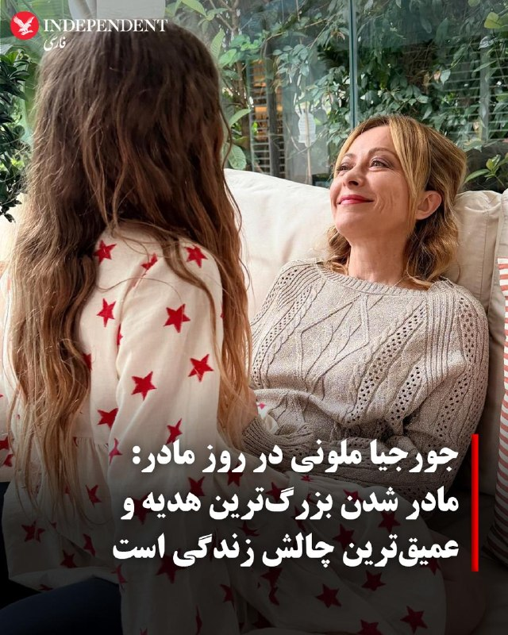

♦️جورجیا ملونی، نخست‌وزیر ایتالیا، روز یکشنبه به مناسبت روز مادر در پیامی در شبکه اجتماعی ایکس نوشت مادری «بزرگ‌ترین هدیه و در عین حال عمیق‌ترین چالشی است که زندگی می‌تواند پیش روی انسان قرار دهد.»

ملونی در این پیام نوشت مادری انسان را از درون تغییر می‌دهد؛ «قلب، زمان و نگاه او به جهان را دگرگون می‌کند» و در عین حال که انسان را قوی‌تر می‌کند، او را آسیب‌پذیرتر نیز می‌سازد.

نخست‌وزیر ایتالیا افزود مادری به انسان می‌آموزد عشق واقعی چیست؛ عشقی «بی‌حد و مرز و بدون هیچ شرطی.»
او همچنین نوشت مادر بودن یعنی «همیشه حضور داشتن، حتی زمانی که خسته‌ای»، و یعنی روبه‌رو شدن با ترس‌ها و فداکاری‌ها با شجاعت و پیدا کردن نیرو حتی زمانی که به نظر می‌رسد دیگر توانی باقی نمانده است.

ملونی در ادامه از همه مادران، به‌ویژه زنانی که «بی‌وقفه تلاش می‌کنند، نگرانی‌ها را در سکوت تحمل می‌کنند و با کوچک‌ترین جزئیات عشق و مراقبت را به دیگران هدیه می‌دهند» قدردانی کرد و روز مادر را به آن‌ها تبریک گفت.

نخست وزیر ایتالیا، از رابطه با شریک سابق زندگی‌اش، فرزند دختری به نام ژنوِرا (Ginevra) دارد که در سال ۲۰۱۶ متولد شده است.
‌🇸🇦 Indypersian

🤖 @VahidOOnLine

## VahidOOnLine — post 239353

  

کاظم غریب‌آبادی، معاون وزیر خارجه جمهوری اسلامی، در پیامی در شبکه اجتماعی ایکس با انتقاد از اعزام ناوهای نظامی فرانسه و بریتانیا به منطقه گفت تامین امنیت تنگه هرمز صرفا در اختیار جمهوری اسلامی است.

او افزود که تنگه هرمز «ملک مشاع قدرت‌های فرامنطقه‌ای» نیست و هرگونه حضور نظامی برای همراهی با «اقدامات آمریکا» در این آبراه با «پاسخ قاطع و فوری» روبه‌رو خواهد شد.
‌🏁 🇬🇧 IranintlTV

🤖 @VahidOOnLine

## VahidOOnLine — post 239352

  

♦️سباستین لوکورنو، نخست‌وزیر فرانسه، اعلام کرد یکی از پنج شهروند فرانسوی که روز یکشنبه از کشتی کروز آلوده به ویروس هانتا به فرانسه منتقل شدند، علائم این بیماری را نشان داده است.

لوکورنو در پیامی در شبکه اجتماعی ایکس نوشت: «یکی از آن‌ها در هواپیمای انتقال علائم بیماری را نشان داد.» او افزود این پنج مسافر «بلافاصله تا اطلاع ثانوی در قرنطینه کامل قرار گرفته‌اند.»

به گفته نخست‌وزیر فرانسه، این افراد تحت مراقبت پزشکی قرار دارند و آزمایش‌ها و معاینات پزشکی روی آن‌ها انجام خواهد شد.
او همچنین اعلام کرد که شامگاه یکشنبه فرمانی برای اجرای تدابیر لازم قرنطینه به منظور حفاظت از سلامت عمومی صادر خواهد کرد.

هواپیمای حامل این پنج مسافر که از کشتی تخلیه شده بودند، عصر یکشنبه در فرودگاه لو بورژه در شمال پاریس به زمین نشست. این افراد سپس با پنج آمبولانس و تحت اسکورت پلیس به بیمارستان بیشا در پاریس منتقل شدند.
‌🇸🇦 Indypersian

🤖 @VahidOOnLine

## VahidOOnLine — post 239351

  <a href="telegram/content/VahidOOnLine_239351_1778434746.mp4" target="_blank">🎬 Download video</a>

معاون وزیر خارجه جمهوری اسلامی در واکنش به احتمال اعزام ناوهای بریتانیایی و فرانسوی به تنگه هرمز گفت هرگونه استقرار ناوشکن‌ها در اطراف این تنگه با عنوان «حفاظت از کشتیرانی»، اقدامی برای تشدید بحران است.

او در پیامی در شبکه‌های اجتماعی نوشت حضور ناوهای جنگی فرانسه و بریتانیا در تنگه هرمز، به‌ویژه در صورت همراهی با اقدامات آمریکا، با «پاسخ فوری و قاطع» روبه‌رو خواهد شد.

وزارت دفاع بریتانیا پیش‌تر اعلام کرده بود ناو جنگی اچ‌ام‌اس دراگون را برای آمادگی در یک تلاش چندملیتی احتمالی به منظور حفاظت از کشتیرانی در تنگه هرمز، به خاورمیانه اعزام می‌کند.
‌🏁 🇬🇧 ManotoTV

🤖 @VahidOOnLine

## VahidOOnLine — post 239350

  <a href="telegram/content/VahidOOnLine_239350_1778434747.mp4" target="_blank">🎬 Download video</a>

بنیامین نتانیاهو، نخست‌وزیر اسرائیل، در گفت‌وگو با برنامه شصت دقیقه شبکه سی‌بی‌اس گفت جنگ با ایران تمام نشده، زیرا به گفته او هنوز اورانیوم غنی‌شده، سایت‌های غنی‌سازی، نیروهای نیابتی مورد حمایت جمهوری اسلامی و برنامه موشک‌های بالستیک باقی مانده‌اند.

نتانیاهو گفت بخش زیادی از توان ایران تضعیف شده، اما هنوز «کارهایی هست که باید انجام شود».

او درباره چگونگی خارج کردن اورانیوم با غنای بالا از ایران گفت در صورت وجود توافق، می‌توان وارد شد و آن را خارج کرد و این «بهترین راه» است.

نتانیاهو در پاسخ به این پرسش که آیا بدون توافق می‌توان اورانیوم را با زور خارج کرد، از توضیح درباره گزینه‌ها و برنامه‌های نظامی خودداری کرد، اما این موضوع را «ماموریتی فوق‌العاده مهم» خواند.
‌🏁 🇬🇧 ManotoTV

🤖 @VahidOOnLine

## VahidOOnLine — post 239349

  <a href="telegram/content/VahidOOnLine_239349_1778434747.mp4" target="_blank">🎬 Download video</a>

‌
پورتو | پرتغال؛ گردهمایی ایرانیان ـ گزارشگر ۲۰ اردیبهشت ۱۴۰۵
‌🏁 🇬🇧 ManotoTV

🤖 @VahidOOnLine

## VahidOOnLine — post 239348

  <a href="telegram/content/VahidOOnLine_239348_1778434748.mp4" target="_blank">🎬 Download video</a>

دونالد ترامپ در مصاحبه با برنامه فول مژر با شریل اتکیسن گفت آمریکا مواد هسته‌ای و اورانیوم غنی‌شده ایران را زیر نظر دارد و در صورت نزدیک شدن افراد به محل آن، واشنگتن مطلع خواهد شد.

او گفت عملیات رزمی علیه ایران را پایان‌یافته نمی‌داند، هرچند به گفته او ایران «شکست خورده» است. ترامپ افزود آمریکا حدود ۷۰ درصد اهداف مورد نظر خود را زده و اهداف دیگری هم وجود دارد که ممکن است هدف قرار بگیرد.

ترامپ همچنین گفت واشنگتن نباید اجازه دهد ایران به سلاح هسته‌ای برسد و مدعی شد اگر حمله بمب‌افکن‌های بی‌دو آمریکا به تاسیسات هسته‌ای ایران انجام نمی‌شد، جمهوری اسلامی ظرف دو هفته به سلاح هسته‌ای دست پیدا می‌کرد.
‌🏁 🇬🇧 ManotoTV

🤖 @VahidOOnLine

## VahidOOnLine — post 239347

  <a href="telegram/content/VahidOOnLine_239347_1778434750.mp4" target="_blank">🎬 Download video</a>

فرانکفورت | آلمان؛ گردهمایی ایرانیان ـ گزارشگر ۲۰ اردیبهشت ۱۴۰۵
‌🏁 🇬🇧 ManotoTV

🤖 @VahidOOnLine

## VahidOOnLine — post 239346

  <a href="telegram/content/VahidOOnLine_239346_1778434752.mp4" target="_blank">🎬 Download video</a>

نیس | فرانسه؛ گردهمایی ایرانیان ـ گزارشگر ۲۰ اردیبهشت ۱۴۰۵
‌🏁 🇬🇧 ManotoTV

🤖 @VahidOOnLine

## VahidOOnLine — post 239345

  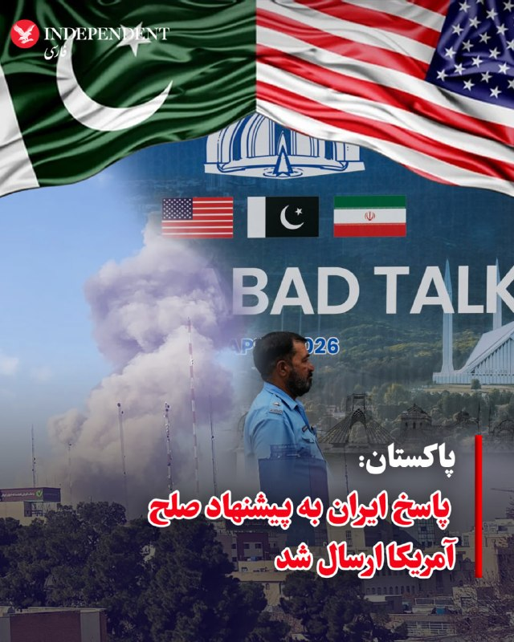

♦️یک مقام دولتی پاکستان که در مذاکرات مرتبط با جنگ ایران نقش دارد، روز یکشنبه ۲۰ اردیبهشت ماه، اعلام کرد اسلام‌آباد پاسخ جمهوری اسلامی به پیشنهاد آمریکا را دریافت و آن را به واشنگتن منتقل کرده است.
خبرگزاری رویترز با اعلام این خبر نوشت، این مقام پاکستانی جزئیات بیشتری درباره محتوای این پیشنهاد ارائه نکرد.
رسانه‌های دولتی روز یکشنبه ایران گزارش دادند تهران پاسخ به پیشنهاد آمریکا برای آغاز مذاکرات صلح با هدف پایان دادن به جنگ را ارسال کرده است. بر اساس اخبار منتشر شده، «بر پایان جنگ در تمامی جبهه‌ها، به‌ویژه لبنان» و مسائل مربوط به تنگه هرمز از موارد مطرح شده در این پاسخ است.
‌🇸🇦 Indypersian

🤖 @VahidOOnLine

## VahidOOnLine — post 239344

  <a href="telegram/content/VahidOOnLine_239344_1778434754.mp4" target="_blank">🎬 Download video</a>

ویدیوهای رسیده نشان می‌دهند یکشنبه ۲۰ اردیبهشت ایرانیان مقیم شهرهای بارسلون در اسپانیا، کپنهاگ دانمارک و لاهه در هلند علیه جمهوری اسلامی تجمع کردند.
‌🏁 🇬🇧 IranintlTV

🤖 @VahidOOnLine

## VahidOOnLine — post 239343

  

احمد مرادی، عضو کمیسیون انرژی مجلس گفت: کشورهای منطقه نباید «فریب» دونالد ترامپ و بنیامین نتانیاهو را بخورند و برای دستیابی به آرامش باید با تهران هماهنگ باشند و قدرت جمهوری اسلامی را درک کنند.

او افزود: تنگه هرمز دیگر به وضعیت گذشته بازنخواهد گشت و جمهوری اسلامی بر حفظ این موقعیت راهبردی تاکید دارد.
‌🏁 🇬🇧 IranintlTV

🤖 @VahidOOnLine

## VahidOOnLine — post 239342

  

ابوالفضل اقبالی، از طراحان «قانون عفاف و حجاب»، در تلویزیون جمهوری اسلامی گفت: «اتاق فرمان دشمن، موساد است. همان‌جایی حمله نظامی را تصویب می‌کند، تحریم اقتصادی را سازمان می‌دهد و زیرساخت را می‌زند. همان‌جا هم ساعتی ۳ دلار پول می‌دهد می‌گوید برو میدان ولیعصر با تاپ و شلوار قدم بزن.»

او گفت: «جنگ با جمهوری اسلامی ابعاد مختلف دارد. همان کس که حلقه‌های آشوب سازماندهی کرده، ارز دیجیتال توزیع می‌کند تا یک عده بیایند وضعیت اباحه‌گری را سامان بدهند.»
‌🏁 🇬🇧 IranintlTV

🤖 @VahidOOnLine

## VahidOOnLine — post 239341

  <a href="telegram/content/VahidOOnLine_239341_1778434756.mp4" target="_blank">🎬 Download video</a>

بر اساس ویدیوهای رسیده به ایران‌اینترنشنال، گروهی از ایرانیان مقیم بریتانیا، یکشنبه ۲۰ اردیبهشت در اعتراض به اعدام‌های جمهوری اسلامی، در بیرمنگام تجمع کردند.
‌🏁 🇬🇧 IranintlTV

🤖 @VahidOOnLine

## mwarmonitor — post 8834

🔸مارک لوین ؛ «رژیم ایران» دیوانه‌ها برای هزارمین بار نشان می‌دهند که قصد دارند فارغ از هر شرایطی به دنبال سلاح هسته‌ای بروند.

@mwarmonitor

## mwarmonitor — post 8833

🟢چراغ سبز مقام دولت ترامپ به تعلیق مالیات بنزین

📝نویسنده: بن گمن AXIOS

🔸کریس رایت، وزیر انرژی آمریکا روز یکشنبه اعلام کرد که دولت ترامپ با توجه به قیمت بالای سوخت، برای بررسی ایده «تعلیق مالیات فدرال بنزین» آمادگی دارد.

چرا این موضوع اهمیت دارد؟
اظهارات او تا حدی موضع کاخ سفید را در قبال ایده توقف مالیات فدرال (که ۱۸.۳ سنت به ازای هر گالن است) نرم‌تر کرده است.
نظرسنجی‌ها نشان می‌دهند که پرزیدنت ترامپ به دلیل رسیدن قیمت‌ها به بالاترین سطح در چهار سال اخیر، با فشار و انتقادات سیاسی روبروست.
طبق اعلام انجمن اتومبیل آمریکا (AAA)، میانگین قیمت بنزین معمولی در ایالات متحده در روز یکشنبه به ۴.۵۲ دلار در هر گالن رسید؛ این در حالی است که پیش از شروع جنگ، قیمت‌ها کمی کمتر از ۳ دلار بود.
جزئیات خبر
رایت در برنامه «Meet the Press» شبکه NBC، در پاسخ به سوالی درباره تعلیق مالیات بنزین گفت: «ما برای کاهش هزینه‌های مصرف‌کنندگان و کسب‌وکارها، پذیرای تمام ایده‌ها هستیم.» اما او اضافه کرد که «هر تصمیمی هزینه‌ها و مزایای (Tradeoffs) خود را دارد.»
قانون‌گذاران و نامزدهای دموکرات نیز پیش از این طرح‌هایی را برای تعلیق مالیات فدرال پیشنهاد داده بودند.
فلش‌بک: هفته گذشته، یکی از مقامات کاخ سفید گفته بود که این ایده «در حال حاضر تحت بررسی نیست.»
نگاه کلی
پیشنهاد «تعطیلات مالیاتی فدرال» در دهه‌های گذشته و در زمان‌های افزایش قیمت بارها مطرح شده، اما کنگره هرگز آن را به تصویب نرسانده است. مالیات بنزین و مالیات ۲۴.۳ سنتی گازوئیل، بودجه «صندوق امانی بزرگراه‌ها» را تأمین می‌کند که صرف ساخت و نگهداری جاده‌ها، پل‌ها و ترانزیت ملی می‌شود.
واقعیت موجود (Reality Check)
تعلیق مالیات نیازمند مصوبه کنگره است، هرچند ترامپ مکرراً از دستورات اجرایی برای اقدامات یک‌جانبه استفاده کرده است.
چشم‌انداز وسیع‌تر
کاخ سفید تاکنون اقدامات متعددی را برای کاهش فشار ناشی از مسدود شدن تنگه هرمز انجام داده است:
برداشت از ذخایر استراتژیک نفت.
لغو موقت «قانون جونز» (Jones Act) برای تسهیل جابجایی سوخت در بنادر آمریکا.
اما یک نکته مهم: هیچ‌کدام از این مراحل نمی‌تواند ضربه ناشی از جنگ به عرضه جهانی را جبران کند؛ چرا که قیمت خرده‌فروشی بنزین در آمریکا به قیمت نفت در بازارهای جهانی گره خورده است. بر اساس برآورد مرکز سیاست‌های دوحزبی، حتی تعلیق کامل مالیات تنها ۱۰ تا ۱۶ سنت از قیمت هر گالن کم می‌کند؛ یعنی واشینگتن ابزارهای کمی برای جبران فوری افزایش قیمت ۱.۵۰ دلاری ناشی از جنگ در اختیار دارد.
آنچه باید زیر نظر داشت
مقامات دولت ترامپ در حال ارزیابی استدلال‌های خود درباره قیمت انرژی با نزدیک شدن به انتخابات میان‌دوره‌ای هستند.


📌 وزیر انرژی در برنامه «Face the Nation» شبکه CBS تاکید کرد که ایرانِ مجهز به سلاح هسته‌ای خطر بزرگی برای منابع انرژی منطقه است و ضمن پذیرش دشواری‌های کوتاه‌مدت ناشی از جنگ، گفت:
«ما باید این هزینه را بپردازیم، وگرنه با تهدیدی بلندمدت برای صلح منطقه، عرضه انرژی و امنیت آمریکایی‌ها روبرو خواهیم شد.»

@mwarmonitor

## mwarmonitor — post 8832

  

🔸ترامپ همچنان می‌خواهد درِ فورت ناکس را باز کند تا شخصاً تأیید کند که ذخیره ۷۰۰ میلیارد دلاری طلا سرقت نشده است.

@mwarmonitor

## mwarmonitor — post 8831

🔴مرکز اطلاعات دریایی مشترک (JMIC)

۰۱ مارس – ۱۰ مه ۲۰۲۶

🔸تنش‌های منطقه‌ای - تأثیر بر امنیت دریانوردی
منطقه مورد نظر: منطقه دریایی خاورمیانه
شماره مرجع: JMIM 001-26
سطح تهدید منطقه‌ای: بحرانی (CRITICAL)

۱. خلاصه عملیاتی – ۷۲ ساعت گذشته
خلیج فارس و تنگه هرمز
ترافیک در تنگه هرمز همچنان به میزان قابل توجهی کاهش یافته است و چندین حادثه امنیتی در ۷۲ ساعت گذشته گزارش شده است.
در تاریخ ۰۸ مه ۲۰۲۶، یک لنج با پرچم هند که از دبی به سمت یمن در حال حرکت بود، دچار حریق شد و واژگون گشت. مرگ یک خدمه گزارش شده و ۱۷ نفر دیگر توسط یک شناور در نزدیکی محل حادثه نجات یافتند. ماهیت این حادثه در دست بررسی است.
در تاریخ ۰۹ مه ۲۰۲۶، هشدار شماره 26-056 سازمان UKMTO گزارش داد که یک کشتی تجاری در شمال شرقی دوحه (قطر) مورد اصابت یک پرتابه ناشناس قرار گرفته است. یک آتش‌سوزی کوچک مهار شد و تلفاتی گزارش نشده است.
خطر مین‌گذاری در نزدیکی طرح‌های تفکیک ترافیک (TSS) همچنان یک تهدید است و تداخل در سیستم‌های ناوبری ماهواره‌ای (GNSS) به صورت پراکنده مشاهده می‌شود.
دریای عمان و دریای عرب
کشتی‌های تجاری همچنان حضور پررنگ نیروهای دریایی را در سراسر دریای عمان و شمال دریای عرب گزارش می‌دهند. فعالیت‌های مربوط به اجرای محاصره در جریان است.
جنوب دریای سرخ، باب‌المندب و خلیج عدن (بدون تغییر)
ترافیک تجاری در باب‌المندب و خلیج عدن ثابت مانده است. پیام‌های حوثی‌ها بدون شاخص‌های عملیاتی مرتبط ادامه دارد.
سواحل سومالی و حوضه سومالی
سطح تهدید دزدی دریایی همچنان شدید (SEVERE) است. در حال حاضر سه کشتی تجاری در توقیف هستند:
نفتکش حامل فرآورده‌های نفتی – از ۲۱ آوریل ۲۰۲۶ در توقیف است.
کشتی باری عمومی / حمل سیمان – از ۲۶ آوریل ۲۰۲۶ در توقیف است.
نفتکش – از ۰۲ مه ۲۰۲۶ در توقیف است؛ این کشتی در ۱۰ مایلی سواحل یمن گرفته شده و به سمت آب‌های سومالی هدایت شده است؛ وضعیت آن تایید نشده است.
این سه شناور در آب‌های سرزمینی سومالی (TTW) باقی مانده‌اند و تهدید فوری برای کشتیرانی تجاری در منطقه محسوب نمی‌شوند.
لنج ربوده شده‌ای که در تاریخ ۲۵ آوریل ۲۰۲۶ گزارش شده بود، دیگر تحت کنترل دزدان دریایی نیست و فعالیت‌های سیستم شناسایی خودکار (AIS) نشان می‌دهد که این لنج به سلامت به سمت دریای عمان در حال حرکت است.


📌گزارش‌های اخیر از خلیج عدن (۹ تا ۱۰ مه) نشان می‌دهد که یک کشتی تجاری توسط دو گروه از قایق‌های کوچک مورد نزدیک‌شدن قرار گرفته است. فعالیت گروه‌های دزدی دریایی (PAG) در سواحل و حوضه سومالی همچنان بسیار محتمل است.

@mwarmonitor

## pm_afshaa — post 90496

  <a href="telegram/content/pm_afshaa_90496_1778434759.webm" target="_blank">🎬 Download video</a>

🔴غریب‌آبادی، معاون عراقچی:
تامین امنیت تنگه هرمز صرفا در اختیار جمهوری اسلامیه.

💧 Rainbet.com the #1 Non-KYC Crypto Casino & Sportsbook @rainbetcom

😁 @Pm_Afshaa

## pm_afshaa — post 90495

  <a href="telegram/content/pm_afshaa_90495_1778434760.webm" target="_blank">🎬 Download video</a>

🔴وزیر انرژی آمریکا در مصاحبه با CBS:
اهداف نظامی محقق شدن اما پایان دادن به برنامه هسته‌ای ایران هنوز باید محقق بشه؛ به احتمال زیاد این از طریق مذاکره محقق میشه، اما لزوماً اینگونه نخواهد شد!

💧 Rainbet.com the #1 Non-KYC Crypto Casino & Sportsbook @rainbetcom

😁 @Pm_Afshaa

## pm_afshaa — post 90494

  <a href="telegram/content/pm_afshaa_90494_1778434760.mp4" target="_blank">🎬 Download video</a>

🔴ابوالفضل اقبالی، از طراحان «قانون عفاف و حجاب»:

موساد برای راه رفتن با تاپ و شلوار در میدان ولیعصر ساعتی 3 دلار میده.
عدم ابلاغ قانون حجاب باعث شده جنگ بشه
یه شکافی ایجاد شده و حکومت دیگه نمیتونه بزور مردم رو به حجاب وادار کنه

💧Rainbet.com the #1 Non-KYC Crypto Casino & Sportsbook @rainbetcom

😁 @Pm_Afshaa

## DEJradio — post 4550

  <a href="telegram/content/DEJradio_4550_1778434762.webm" target="_blank">🎬 Download video</a>

😉
🔝 مذاکرات جمهوری اسلامی و آمریکا همزمان با آتش‌بس

#کاریکاتور
@DEJradio

## DEJradio — post 4549

  <a href="telegram/content/DEJradio_4549_1778434762.mp4" target="_blank">🎬 Download video</a>

🚨
👑 بولونیا؛ تظاهرات ایرانیان میهن‌دوست در پاسخ به فراخوان شاهزاده رضا پهلوی، ۲۰ اردیبهشت ۱۴۰۵

#بولونیا #همبستگی #انقلاب_شیروخورشید
@DEJradio

## DEJradio — post 4548

  <a href="telegram/content/DEJradio_4548_1778434764.mp4" target="_blank">🎬 Download video</a>

🎥📢 اعتراض یک شهروندان به افزایش شدید قیمت کالاها

#گرانی #فروپاشی
@DEJradio

## VahidOnline — post 75385

  

بنیامین نتانیاهو، نخست‌وزیر اسرائیل، در بخشی از یک مصاحبه که قرار است ساعاتی دیگر مشروح آن پخش شود، گفت که ذخایر اورانیوم غنی‌شده ایران باید از بین برود تا بتوان گفت جنگ آمریکا و اسرائیل با ایران به پایان رسیده است.

او در بخشی از گفت‌وگو با برنامه «۶۰ دقیقه» شبکه سی‌بی‌اس گفت: «این [جنگ] هنوز تمام نشده است، چون مواد هسته‌ای، اورانیوم غنی‌شده، باید از ایران خارج شود. تاسیسات غنی‌سازی هم که وجود دارد باید برچیده شوند.»

او همچنین گفت: «ایران هنوز از نیروهای نیابتی حمایت و موشک‌ بالستیک تولید می‌کند. بخش عمده‌ای از اینها نابود شده‌اند اما کارهایی باقی است.»

آقای نتانیاهو در پاسخ به این پرسش که این اورانیوم چگونه باید خارج شود، گفت: «وارد می‌شوید و آن را خارج می‌کنید.»
@VahidHeadline

📡 @VahidOnline

## IranIntlTV — post 336512

  

عبدالرضا رحمانی فضلی، سفیر جمهوری اسلامی در چین، گفت: هر توافق احتمالی باید با ضمانت قدرت‌های بزرگ همراه باشد و افزود پکن می‌تواند نقش ضامن هرگونه توافق را بر عهده گیرد.

او افزود: این توافق باید در شورای امنیت سازمان ملل نیز مطرح و تثبیت شود.
https://iranintl.com/202605104885

## IranIntlTV — post 336511

  

کاظم غریب‌آبادی، معاون وزیر خارجه جمهوری اسلامی، در پیامی در شبکه اجتماعی ایکس با انتقاد از اعزام ناوهای نظامی فرانسه و بریتانیا به منطقه گفت تامین امنیت تنگه هرمز صرفا در اختیار جمهوری اسلامی است.

او افزود که تنگه هرمز «ملک مشاع قدرت‌های فرامنطقه‌ای» نیست و هرگونه حضور نظامی برای همراهی با «اقدامات آمریکا» در این آبراه با «پاسخ قاطع و فوری» روبه‌رو خواهد شد.
https://iranintl.com/202605108605

## IranIntlTV — post 336510

  <a href="telegram/content/IranIntlTV_336510_1778434767.mp4" target="_blank">🎬 Download video</a>

ویدیوهای رسیده نشان می‌دهند یکشنبه ۲۰ اردیبهشت ایرانیان مقیم شهرهای بارسلون در اسپانیا، کپنهاگ دانمارک و لاهه در هلند علیه جمهوری اسلامی تجمع کردند.

## IranIntlTV — post 336509

  

احمد مرادی، عضو کمیسیون انرژی مجلس گفت: کشورهای منطقه نباید «فریب» دونالد ترامپ و بنیامین نتانیاهو را بخورند و برای دستیابی به آرامش باید با تهران هماهنگ باشند و قدرت جمهوری اسلامی را درک کنند.

او افزود: تنگه هرمز دیگر به وضعیت گذشته بازنخواهد گشت و جمهوری اسلامی بر حفظ این موقعیت راهبردی تاکید دارد.
https://iranintl.com/202605101132

## IranIntlTV — post 336508

🔻«از هستی ساقط شده‌ایم»؛ شهروندان از پیامدهای بیش از ۷۰ روز خاموشی اینترنت می‌گویند

بیش از ۷۰ روز است که میلیون‌ها نفر در ایران با محدودیت و قطعی گسترده اینترنت دست‌وپنجه نرم می‌کنند؛ شرایطی که به گفته بسیاری از شهروندان، زندگی، کار، درمان و آرامش روانی آنها را مختل کرده است.
با این حال آنچه در بسیاری از رسانه‌های بین‌المللی درباره ایران بازتاب پیدا می‌کند، عمدتا اظهارات مقام‌های جمهوری اسلامی است و نه روایت مردمی که در این روزها زیر فشار بی‌سابقه محدودیت‌های اینترنتی زندگی می‌کنند.

«از جنگ ۱۲ روزه تا امروز، کسب‌وکارم عملا نابود شده»

حسین، ۳۳ ساله و مدرس موسیقی که پیش از این بخش مهمی از کلاس‌هایش را آنلاین برگزار می‌کرد، می‌گوید از زمان آغاز جنگ ۱۲ روزه تا امروز، شغلش در عمل متوقف و درآمدش قطع شده است.
او توضیح می‌دهد: «شاگردهای من داخل و خارج ایران هستند اما به خاطر قطعی و اختلال اینترنت، دیگر نمی‌توانند در کلاس‌ها شرکت کنند. درآمدم تقریبا صفر شده.»
حسین با اشاره به فشار اقتصادی ناشی از این وضعیت می‌گوید: «جمهوری اسلامی که دلش برای ما نسوخته، دنیا هم انگار اصلا اهمیتی نمی‌دهد ما در چه باتلاقی دست‌وپا می‌زنیم.»
همسر او، محدثه، از طریق اینستاگرام شیرینی و رب خانگی می‌فروخته و حالا کسب‌وکارش به‌کل متوقف شده است.
او می‌گوید: «چهار سال تلاش کردیم با همه سختی‌ها زندگی‌مان را جلو ببریم اما این ۷۰ روز ما را از هستی ساقط کرد. پس‌اندازی را که برای خرید خانه کنار گذاشته بودیم، خرج کردیم و حالا مانده‌ایم اجاره و هزینه‌های زندگی را چطور پرداخت کنیم.»

اینترنت؛ کالایی طبقاتی

شهلا، ۵۶ ساله، مادر پسری دارای اوتیسم است. او می‌گوید بازی آنلاین، تنها فضای امن و آرامش‌بخش برای فرزندش بود، اما در این هفته‌ها، نبود اینترنت شرایط خانه را بحرانی کرده است: «پسرم دیگر امکان بازی ندارد، پر از استرس و خشونت شده و مدام با ما درگیر می‌شود.»
او با انتقاد از محدود شدن اینترنت می‌گوید: «واقعا کسانی که اینترنت را طبقاتی کرده‌اند، می‌فهمند خانواده‌ها چه فشاری را تحمل می‌کنند؟ اینترنت گیگی ۵۰۰ تا ۶۰۰ هزار تومان است؛ از کجا باید بیاورم؟»
شهلا می‌گوید سال‌ها تلاش کرده با کمک مشاوران و برنامه‌های درمانی، زندگی آرام‌تری برای فرزندش فراهم کند؛ اما این ۷۰ روز را «جهنم واقعی» توصیف می‌کند.

«۷۰ روز است نوه‌هایم را ندیده‌ام»

مژده، ۷۰ ساله، می‌گوید برای گرفتن وقت پزشک و دریافت نتایج آزمایش به او گفته‌اند اپلیکیشن «بله» را نصب کند؛ موضوعی که باعث نگرانی او شده است: «برای ثبت یک وقت دکتر باید اپلیکیشنی نصب کنم که بارها درباره امنیتش هشدار داده شده.»
فرزندان و نوه‌های مژده خارج از ایران زندگی می‌کنند. او می‌گوید پیش از این هر روز از طریق تماس تصویری نوه‌هایش را می‌دیده اما حالا بیش از ۷۰ روز است که تنها تماس‌های کوتاه تلفنی برایش باقی مانده است.
«من بازنشسته‌ام و توان خرید اینترنت طبقاتی را ندارم. اصلا چرا باید چنین شرایطی به مردم تحمیل شود و هیچ واکنش جدی‌ای هم وجود نداشته باشد؟»
او در ادامه می‌گوید: «همه‌چیز خلاصه شده در انرژی هسته‌ای، در حالی‌ که ادامه این وضعیت برای مردم فقط ضرر است. اگر کشور دیگری ۷۰ روز اینترنت را قطع می‌کرد، هر روز بازداشت و اعدام می‌کرد، حتما واکنش جهانی متفاوتی می‌دید.»

🔗جزئیات بیشتر را اینجا بخوانید.

@iranintltv

## IranIntlTV — post 336507

  

ابوالفضل اقبالی، از طراحان «قانون عفاف و حجاب»، در تلویزیون جمهوری اسلامی گفت: «اتاق فرمان دشمن، موساد است. همان‌جایی حمله نظامی را تصویب می‌کند، تحریم اقتصادی را سازمان می‌دهد و زیرساخت را می‌زند. همان‌جا هم ساعتی ۳ دلار پول می‌دهد می‌گوید برو میدان ولیعصر با تاپ و شلوار قدم بزن.»

او گفت: «جنگ با جمهوری اسلامی ابعاد مختلف دارد. همان کس که حلقه‌های آشوب سازماندهی کرده، ارز دیجیتال توزیع می‌کند تا یک عده بیایند وضعیت اباحه‌گری را سامان بدهند.»
https://iranintl.com/202605104362

## IranIntlTV — post 336506

  <a href="telegram/content/IranIntlTV_336506_1778434770.mp4" target="_blank">🎬 Download video</a>

بر اساس ویدیوهای رسیده به ایران‌اینترنشنال، گروهی از ایرانیان مقیم بریتانیا، یکشنبه ۲۰ اردیبهشت در اعتراض به اعدام‌های جمهوری اسلامی، در بیرمنگام تجمع کردند.

## IranIntlTV — post 336505

  <a href="https://t.me/IranintlTV/336505" target="_blank">📎 Download file</a>

🎧نسخه صوتی اخبار شبانگاهی | یکشنبه ۲۰ اردیبهشت
@iranintlTV

## IranIntlTV — post 336504

  <a href="telegram/content/IranIntlTV_336504_1778434772.mp4" target="_blank">🎬 Download video</a>

تیتر اول با نیوشا صارمی، یکشنبه ۲۰ اردیبهشت
@iranintltv

## Shin_Persian — post 5934

  

U.S. Central Command ✓ @CENTCOM Sun, 10 May 2026 14:46:41 UTC USS John Finn (DDG 113) sails behind USS Milius (DDG 69), USNS Carl Brashear (T-AKE-7), and USS George H.W. Bush (CVN 77) in the Arabian Sea. Over 20 U.S. warships are enforcing the blockade…

## Shin_Persian — post 5933

U.S. Central Command ✓ @CENTCOM
Sun, 10 May 2026 14:46:41 UTC

USS John Finn (DDG 113) sails behind USS Milius (DDG 69), USNS Carl Brashear (T-AKE-7), and USS George H.W. Bush (CVN 77) in the Arabian Sea.

Over 20 U.S. warships are enforcing the blockade against Iran. CENTCOM forces have redirected 61 commercial vessels and disabled 4 to

فارسی

ناو یو‌اس‌اس جان فین (USS John Finn - DDG 113) در دریای عرب در پشت ناوهای یو‌اس‌اس میلیوس (DDG 69)، یو‌اس‌ان‌اس کارل براشیر (T-AKE-7) و یو‌اس‌اس جورج اچ.دبلیو. بوش (CVN 77) در حال دریانوردی است.

بیش از ۲۰ ناو جنگی ایالات متحده در حال اجرای محاصره علیه ایران هستند. نیروهای سنتکام (CENTCOM - فرماندهی مرکزی ایالات متحده) مسیر ۶۱ کشتی تجاری را تغییر داده و ۴ فروند را از کار انداخته‌اند تا...

𝕏 · @shin_persian

## ManotoTV — post 105270

  <a href="telegram/content/ManotoTV_105270_1778434774.mp4" target="_blank">🎬 Download video</a>

معاون وزیر خارجه جمهوری اسلامی در واکنش به احتمال اعزام ناوهای بریتانیایی و فرانسوی به تنگه هرمز گفت هرگونه استقرار ناوشکن‌ها در اطراف این تنگه با عنوان «حفاظت از کشتیرانی»، اقدامی برای تشدید بحران است.

او در پیامی در شبکه‌های اجتماعی نوشت حضور ناوهای جنگی فرانسه و بریتانیا در تنگه هرمز، به‌ویژه در صورت همراهی با اقدامات آمریکا، با «پاسخ فوری و قاطع» روبه‌رو خواهد شد.

وزارت دفاع بریتانیا پیش‌تر اعلام کرده بود ناو جنگی اچ‌ام‌اس دراگون را برای آمادگی در یک تلاش چندملیتی احتمالی به منظور حفاظت از کشتیرانی در تنگه هرمز، به خاورمیانه اعزام می‌کند.

## ManotoTV — post 105269

  <a href="telegram/content/ManotoTV_105269_1778434774.mp4" target="_blank">🎬 Download video</a>

بنیامین نتانیاهو، نخست‌وزیر اسرائیل، در گفت‌وگو با برنامه شصت دقیقه شبکه سی‌بی‌اس گفت جنگ با ایران تمام نشده، زیرا به گفته او هنوز اورانیوم غنی‌شده، سایت‌های غنی‌سازی، نیروهای نیابتی مورد حمایت جمهوری اسلامی و برنامه موشک‌های بالستیک باقی مانده‌اند.

نتانیاهو گفت بخش زیادی از توان ایران تضعیف شده، اما هنوز «کارهایی هست که باید انجام شود».

او درباره چگونگی خارج کردن اورانیوم با غنای بالا از ایران گفت در صورت وجود توافق، می‌توان وارد شد و آن را خارج کرد و این «بهترین راه» است.

نتانیاهو در پاسخ به این پرسش که آیا بدون توافق می‌توان اورانیوم را با زور خارج کرد، از توضیح درباره گزینه‌ها و برنامه‌های نظامی خودداری کرد، اما این موضوع را «ماموریتی فوق‌العاده مهم» خواند.

## ManotoTV — post 105268

  <a href="telegram/content/ManotoTV_105268_1778434775.mp4" target="_blank">🎬 Download video</a>

‌
پورتو | پرتغال؛ گردهمایی ایرانیان ـ گزارشگر ۲۰ اردیبهشت ۱۴۰۵

## ManotoTV — post 105267

  <a href="telegram/content/ManotoTV_105267_1778434776.mp4" target="_blank">🎬 Download video</a>

دونالد ترامپ در مصاحبه با برنامه فول مژر با شریل اتکیسن گفت آمریکا مواد هسته‌ای و اورانیوم غنی‌شده ایران را زیر نظر دارد و در صورت نزدیک شدن افراد به محل آن، واشنگتن مطلع خواهد شد.

او گفت عملیات رزمی علیه ایران را پایان‌یافته نمی‌داند، هرچند به گفته او ایران «شکست خورده» است. ترامپ افزود آمریکا حدود ۷۰ درصد اهداف مورد نظر خود را زده و اهداف دیگری هم وجود دارد که ممکن است هدف قرار بگیرد.

ترامپ همچنین گفت واشنگتن نباید اجازه دهد ایران به سلاح هسته‌ای برسد و مدعی شد اگر حمله بمب‌افکن‌های بی‌دو آمریکا به تاسیسات هسته‌ای ایران انجام نمی‌شد، جمهوری اسلامی ظرف دو هفته به سلاح هسته‌ای دست پیدا می‌کرد.

## ManotoTV — post 105266

  <a href="telegram/content/ManotoTV_105266_1778434778.mp4" target="_blank">🎬 Download video</a>

فرانکفورت | آلمان؛ گردهمایی ایرانیان ـ گزارشگر ۲۰ اردیبهشت ۱۴۰۵

## ManotoTV — post 105265

  <a href="telegram/content/ManotoTV_105265_1778434779.mp4" target="_blank">🎬 Download video</a>

نیس | فرانسه؛ گردهمایی ایرانیان ـ گزارشگر ۲۰ اردیبهشت ۱۴۰۵

## FarsiVOA — post 217361

بحران امنیت غذایی زیر سایه «آمارسازی» جمهوری اسلامی؛ گفت‌وگو با دالغا خاتین‌اوغلو

## FarsiVOA — post 217360

آیا دولت جمهوری اسلامی بحران‌ها را مدیریت می‌کند و یا فقط به مردم توصیه می‌کند؟

## FarsiVOA — post 217359

  <a href="telegram/content/FarsiVOA_217359_1778434781.mp4" target="_blank">🎬 Download video</a>

ارتش اسرائیل از ادامه حملات به انبارهای تسلیحات، سکوهای پرتاب موشک و ساختمان‌های نظامی حزب‌الله در جنوب لبنان خبر داد و گفت در طول روز یکشنبه بیش از ۲۰ زیرساخت این گروه تروریستی را هدف قرار داده است.

تنش در مرز اسرائیل و لبنان، با وجود آتش‌بس شکننده، همچنان ادامه دارد. در روزهای گذشته، ارتش اسرائیل چندین بار از حمله به مواضع حزب‌الله در جنوب لبنان خبر داده و رسانه‌های لبنانی نیز از حملات هوایی اسرائیل به چند منطقه در جنوب این کشور گزارش داده‌اند.

## FarsiVOA — post 217358

  <a href="telegram/content/FarsiVOA_217358_1778434783.mp4" target="_blank">🎬 Download video</a>

رضا تقی‌زاده، چهره شناخته‌شده پادشاهی‌خواهان مشروطه‌طلب در عمق میدان در پاسخ به این پرسش که دستاورد رضا پهلوی چه بوده؛ گفت: تقویت و باز کردن دست جمهوری اسلامی بر کشتار و سرکوب

## FarsiVOA — post 217357

🔺سنتکام: با محاصره دریایی جمهوری اسلامی تاکنون ۶۱ کشتی وادار به تغییر مسیر شده‌اند و ۴ کشتی نیز از کار افتادند

◾️ستاد فرماندهی مرکزی ایالات متحده، سنتکام، روز یکشنبه ۲۰ اردیبهشت اعلام کرد نیروهای آمریکایی از آغاز اجرای فرمان دونالد ترامپ، رئیس‌جمهوری آمریکا برای اعمال محاصره دریایی علیه جمهوری اسلامی، تاکنون، ۶۱ کشتی را وادار به تغییر مسیر و یا بازگشت به بنادر ایران کرده‌اند.

⬇️ بیشتر بخوانید:

https://ir.voanews.com/a/maritime-diversion-iran-centcom-ship-naval-blockade/8148510.html

## DW_Farsi — post 124533

  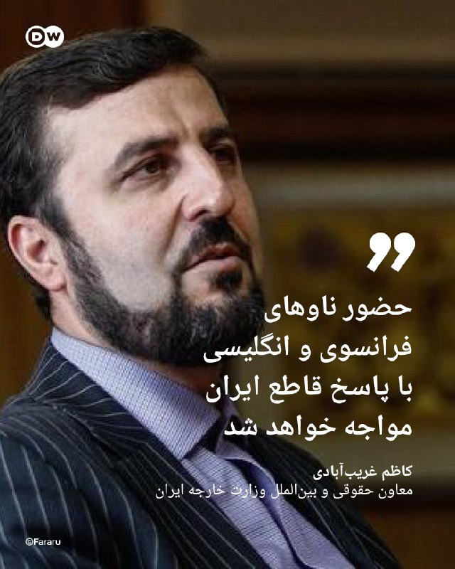

🔶تهدید غریب‌آبادی: حضور ناوهای فرانسوی و انگلیسی با پاسخ قاطع ایران مواجه خواهد شد

کاظم غریب‌آبادی، معاون حقوقی و بین‌الملل وزارت خارجه ایران، به ماموریت دریایی مشترک فرانسه و بریتانیا در تنگه هرمز و اعزام نیروی نظامی برای تامین امنیت دریایی در منطقه واکنش نشان داد.

او در پستی در شبکه اجتماعی ایکس نوشت: «هرگونه اعزام و استقرار ناوشکن‌های فرامنطقه‌ای در اطراف تنگه هرمز، با ادعای حفاظت از کشتیرانی، چیزی جز تشدید بحران در منطقه نیست.»

غریب‌آبادی ضمن هشدار به این کشورها برای خودداری از "پیچیده‌تر کردن اوضاع" نوشت: «حضور ناوهای فرانسوی و انگلیسی و یا هر کشور دیگری برای همراهی احتمالی با اقدامات غیرقانونی و خلاف حقوق بین الملل آمریکا در تنگه هرمز، با پاسخ قاطع و فوری نیروهای مسلح جمهوری اسلامی ایران مواجه خواهد شد.»

پیش از این در روز ۶ مه (۱۶ اردیبهشت) امانوئل مکرون، رئیس جمهور فرانسه، خبر داده بود که ارتش فرانسه در حال آماده‌سازی برای یک ماموریت احتمالی مشترک فرانسه و بریتانیا در تنگه هرمز است تا امنیت رفت‌وآمد کشتی‌ها در این آبراه بین‌المللی را دوباره برقرار کند.

@dw_farsi

## DW_Farsi — post 124532

  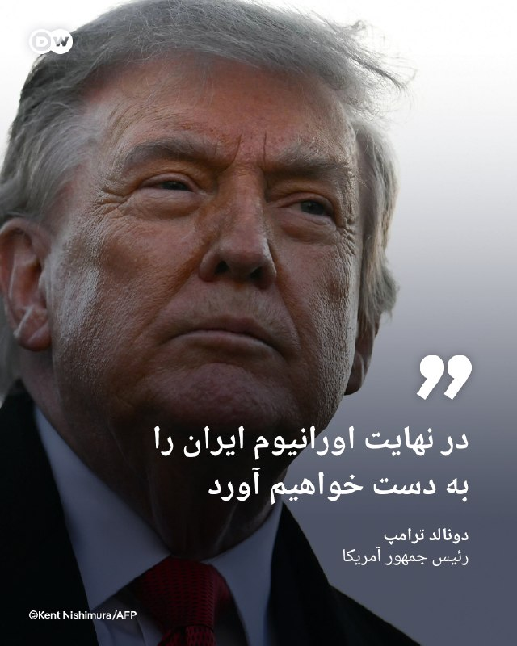

🔶ترامپ: در نهایت اورانیوم ایران را به دست خواهیم آورد

دونالد ترامپ، رئیس جمهور آمریکا، ابراز اطمینان کرده است که ایالات متحده "در مقطعی" اورانیوم غنی‌شده ایران را در اختیار خواهد گرفت.

او در مصاحبه‌ای در برنامه Full Measure (روایت کامل) به شریل اتکیسون، روزنامه‌نگار مستقل تلویزیونی گفت: «ما در مقطعی، هر زمان که بخواهیم، ​​به آن [اورانیوم غنی‌شده ایران] خواهیم رسید. ما آن را زیر نظر خواهیم داشت. ما آن را به خوبی زیر نظر داریم. اگر کسی به آن سایت نزدیک شود، ما از آن مطلع خواهیم شد و آن را منفجر خواهیم کرد.»

ترامپ همچنین در پاسخ به این سوال که آیا عملیات رزمی در ایران تمام شده است، گفت: «نه، من چنین چیزی نگفتم. من گفتم آن‌ها شکست خورده‌اند، اما این به آن معنا نیست که کارشان تمام شده است.»

او گفت در حملات آمریکا و اسرائیل طی جنگ اخیر "۷۰ درصد" اهداف مورد حمله قرار گرفتند و افزود: «ما اهداف دیگری هم داریم که احتمالاً می‌توانیم به آن‌ها حمله کنیم. اما حتی اگر این کار را نکنیم، سال‌ها طول می‌کشد تا آن‌ها دوباره بازسازی شوند.»

@dw_farsi

## DW_Farsi — post 124531

  

🔶نتانیاهو: جنگ ایران تا زمانی که اورانیوم غنی‌شده از بین نرود، تمام نشده است

بنیامین نتانیاهو، نخست وزیر اسرائیل، در مصاحبه‌ای که روز یکشنبه ۱۰ مه (۲۰ اردیبهشت) در برنامه "۶۰ دقیقه" پخش شد، به میجر گرت، خبرنگار ارشد سی‌بی‌اس نیوز در واشنگتن، گفت اورانیوم غنی‌شده با غلظت بالا باید از ایران خارج شود و تأسیسات غنی‌سازی این کشور باید برچیده شود.

نتانیاهو با اشاره به قابلیت‌های هسته‌ای ایران، نیروهای نیابتی و ظرفیت ساخت موشک، گفت: «اکنون، ما مقدار زیادی از آن را تخریب کرده‌ایم. اما همه اینها هنوز وجود دارد و کارهایی باید انجام شود.»

ناظران بین‌المللی تخمین می‌زنند که ایران هنوز حدود ۴۵۰ کیلوگرم اورانیوم غنی‌شده در سطحی نزدیک به سطح مورد نیاز برای ساخت بمب دارد.

نتانیاهو در مورد طرح‌های احتمالی برای خارج کردن اورانیوم از ایران گفت: «شما وارد می‌شوید و آن را خارج می‌کنید.» او گفت اگر توافقی حاصل شود، "بهترین راه" برای خروج اورانیوم غنی‌شده با غلظت بالا از ایران خواهد بود.

@dw_farsi

## Persian_Trend_Official — post 13840

  <a href="telegram/content/Persian_Trend_Official_13840_1778434785.mp4" target="_blank">🎬 Download video</a>

اشکان اسدیان، شهروند ایرانی از حضورش در محل حادثه و درگیری با ضارب در حمله تروریستی به یهودیان در لندن می‌گوید.

گفت‌وگوی رضا محدث، خبرنگار ایران‌اینترنشنال، با اشکان اسدیان، شاهد این حادثه

📝 Nick

📌 @persian_trend_official
پرشین ترند | متفاوت‌ترین کانال نظامی

## Persian_Trend_Official — post 13839

  <a href="telegram/content/Persian_Trend_Official_13839_1778434787.mp4" target="_blank">🎬 Download video</a>

💢ویدیویی منتشر شده که نشان می‌دهد امرپ زرهی «کیرپی » ساخت ترکیه که در اختیار نیروهای اوکراینی قرار دارد، پس از برخورد یک پهپاد انتحاری هدایت‌شونده با فیبر نوری روسی به لطف حفاظت ایده آل خود همچنان عملیاتی باقی ماند و به راهش ادامه داد

🫆:Tony

📌 @persian_trend_official
پرشین ترند | متفاوت‌ترین کانال نظامی

## RadioFarda — post 157036

تأکید نتانیاهو بر لزوم خروج ذخایر اورانیوم از ایران؛ «جنگ هنوز تمام نشده»

🔸بنیامین نتانیاهو، نخست‌وزیر اسرائیل، اعلام کرد که جنگ مشترک آمریکا و اسرائیل علیه ایران «دستاوردهای زیادی داشته، اما تمام نشده است.»

🔸او در مصاحبه‌ای با برنامه «۶۰ دقیقه» شبکه سی‌بی‌اس که بخش‌هایی از آن روز یکشنبه پخش شد، گفت که هنوز «کارهایی برای انجام دادن» در ایران باقی مانده و اذعان کرد که تهران همچنان بسیاری از توانمندی‌هایی را که در آغاز جنگ داشت، حفظ کرده است.

🔸جنگ آمریکا و اسرائیل از نهم اسفند سال گذشته آغاز شد که به کشته شدن رهبر سابق جمهوری اسلامی و شماری از فرماندهان و مقام‌های سیاسی و امنیتی ارشد جمهوری اسلامی انجامید. این جنگ بعد از ۴۰ روز با برقراری آتش‌بس متوقف شده است.

🔸نتانیاهو گفت ایران نه اورانیوم غنی‌شده خود را تحویل داده و نه تأسیسات هسته‌ای‌اش را برچیده است؛ همچنین حمایت از نیروهای نیابتی خود را متوقف نکرده و با هیچ محدودیتی برای برنامه موشک‌های بالستیکش موافقت نکرده است.

🔸نتانیاهو در بخشی از این مصاحبه گفت: «ما بخش زیادی از آن را تضعیف کرده‌ایم، اما همه آن‌ها هنوز وجود دارند و کارهایی باقی مانده که باید انجام شوند.»

🔸وقتی از او درباره نحوه رسیدگی به موضوع اورانیوم با غنای ۶۰ درصدی ایران که همچنان یکی از اهداف اصلی مذاکرات واشینگتن و تهران است، پرسیده شد، نتانیاهو گفت این مواد را می‌توان به‌صورت فیزیکی از ایران خارج کرد.

🔸او توضیح داد: «من درباره ابزارهای نظامی صحبت نخواهم کرد، اما چیزی که رئیس‌جمهور ترامپ به من گفته این است: “من می‌خواهم وارد آنجا شوم” و فکر می‌کنم این کار را می‌توان به‌صورت فیزیکی انجام داد. این مسئله، مشکل نیست. اگر توافقی داشته باشید و وارد شوید و آن را خارج کنید، چرا که نه؟ این بهترین راه است.»

@RadioFarda

## IranianMinds — post 19906

  

🔴یک پهپاد کامی‌کازه سپاه پاسداران به یک کشتی باری در آب‌های سرزمینی قطر در شمال‌شرق بندر مسعید حمله کرد.

در نتیجه این حمله، آتش‌سوزی کوچکی در عرشه کشتی رخ داد، اما تلفات جانی نداشت.

@IranianMinds

## IranianMinds — post 19905

  

🔴ترامپ ویوئویی را بازنشر کرده که مربوط به برنامه مارک لوین بود، جایی‌که مهمان برنامه میگه؛ از سرگیری اقدام نظامی، بهترین گزینه برای مقابله با ایران هست.

@IranianMinds

## BBCPersian — post 280684

  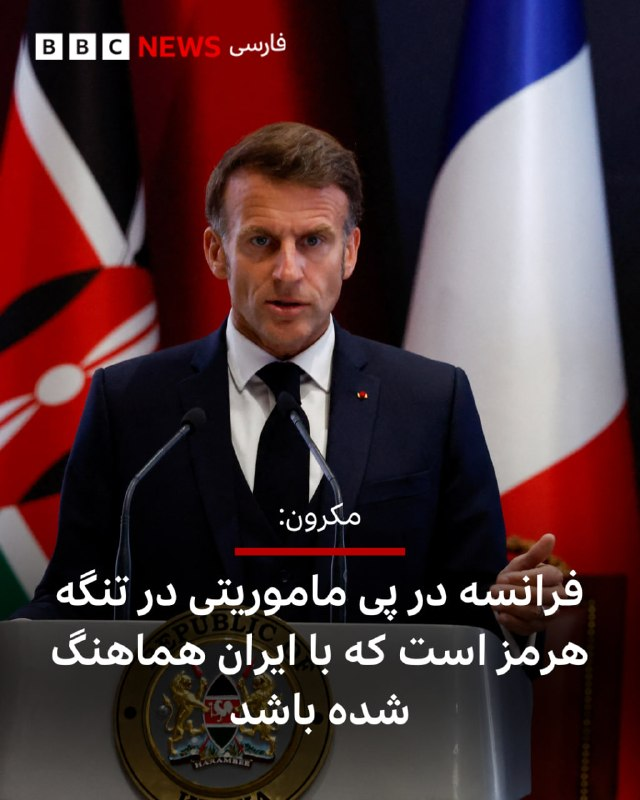

🔺امانوئل مکرون، رئیس‌جمهور فرانسه، روز یکشنبه گفت که کشورش «هرگز» درصدد استقرار نیروی دریایی در تنگه هرمز نبوده است، بلکه به‌دنبال یک ماموریت برای حفظ امنیت است که با ایران «هماهنگ شده باشد.»

او در یک کنفرانس خبری در نایروبی گفت که پس از هشدار ایران درباره «پاسخ قاطع و فوری» به هرگونه استقرار نیرو از سوی فرانسه یا بریتانیا در این آبراه راهبردی، همچنان بر این موضع خود تاکید دارد.

موضع مکرون پیش‌تر نیز بر انجام یک ماموریت «صرفا دفاعی» متمرکز بوده که مبتنی بر هماهنگی و کاهش تنش با ایران باشد و نه مشارکت در عملیات نظامی مستقیم در جریان درگیری‌ها.

ناوگروه شارل دوگل فرانسه در راه خلیج فارس است.

📸Reuters

https://bbc.in/49q6SAd
@BBCPersian

## BBCPersian — post 280683

🔻گزارش‌ها از «پایگاه موقت نیروهای اسرائیل در صحرای عراق» در اوایل جنگ با ایران

دو مقام امنیتی عراقی امروز گزارش وال استریت جورنال را تایید کردند که اسرائیل در اوایل جنگ با ایران یک پایگاه موقت در یک باند فرودگاه قدیمی در صحرایی درعراق ایجاد کرد.

به گزارش خبرگزاری فرانسه، در اوایل جنگ آمریکا و اسرائیل با ایران که ۲۸ فوریه (۹ اسفند) آغاز شد، نیروهای عراقی حضور نیروهای اسرائیل را در صحرای نجف در جنوب غربی کشور شناسایی کردند و با آنها درگیر شدند، که به کشته شدن یک سرباز عراقی و زخمی شدن دو نیروی دیگر آنها منجر شد.

این مقام امنیتی عراقی گفت که «با هماهنگی آمریکا» نیروهای اسرائیلی «پایگاهی را در یک باند فرودگاه متروکه که صدام حسین در صحرای نجف ساخته بود، ایجاد کردند.»

او گفت: «نیروهای اسرائیل دیگر آنجا حضور ندارند اما ممکن است تجهیزاتی را جا گذاشته باشند.»

مشخص نیست که نیروهای اسرائیلی چه مدت در این نقطه از عراق بوده‌اند یا ماموریتشان چه بوده است.

گزارش‌ حضور نیروهای خارجی در صحرای نجف در اوایل جنگ، پس از گزارش یک چوپان از مشاهده فعالیت‌های نظامی، منتشر شد.

وال استریت جورنال به نقل از افراد آشنا به موضوع، از جمله مقامات آمریکایی، شنبه گزارش داد که «اسرائیل یک پایگاه نظامی مخفی در صحرای عراق برای پشتیبانی از عملیات هوایی خود علیه ایران ایجاد کرده بود.»

ارتش اسرائیل به درخواست خبرگزاری فرانسه برای اظهار نظر در این مورد پاسخی نداده است. ایران و آمریکا هم هنوز درباره این گزارش‌ها اظهارنظری نکرده‌اند.

https://bbc.in/4db8yyE
@BBCPersian

## BBCPersian — post 280682

🔻پاکستان: پاسخ ایران پس از دریافت به طرف آمریکایی منتقل شد

وزارت خارجه پاکستان اعلام کرد که پاسخ ایران به پیشنهاد ایالات متحده درباره جنگ دریافت و به آمریکا منتقل شده است.

این خبر در حالی منتشر می‌شود که پاکستان به عنوان میانجی گفتگوهای ایران و آمریکا مسئولیت تبادل پیام‌ها میان دو کشور را بر عهده گرفته است.

ایران ساعتی پیش گفت پاسخ خود به آمریکا را به مقام‌های پاکستان ارسال کرده است.

https://bbc.in/4tqsDXS

## BBCPersian — post 280681

🔻ایران به پیشنهاد آمریکا برای پایان جنگ پاسخ داد

ایران پاسخش به «آخرین متن پیشنهادی آمریکا برای پایان جنگ» را از طریق پاکستان ارسال کرد. وزارت خارجه پاکستان اعلام کرد که پاسخ ایران را دریافت و به آمریکا منتقل کرده است.

هیچ جزئیاتی رسما درمورد این پاسخ منتشر نشده است. آمریکا نیز جزئیات هیچ یک از پیشنهادهای خود را علنی نکرده است اما بنا به گزارش رسانه‌های آمریکا، یک تفاهم‌نامه یک صفحه‌ای در ۱۴ ماده‌ آخرین پیشنهاد آمریکاست، شامل مفادی مانند تعلیق غنی‌سازی، لغو تحریم‌ و بازگشت کشتیرانی آزاد در تنگه هرمز.

https://bbc.in/42Vze1E
@BBCPersian

## BBCPersian — post 280680

  

🔻بنیامین نتانیاهو، نخست‌وزیر اسرائیل، در بخشی از یک مصاحبه که قرار است ساعاتی دیگر مشروح آن پخش شود، گفت که ذخایر اورانیوم غنی‌شده ایران باید از بین برود تا بتوان گفت جنگ آمریکا و اسرائیل با ایران به پایان رسیده است.

او در بخشی از گفت‌وگو با برنامه «۶۰ دقیقه» شبکه سی‌بی‌اس گفت: «این [جنگ] هنوز تمام نشده است، چون مواد هسته‌ای، اورانیوم غنی‌شده، باید از ایران خارج شود. تاسیسات غنی‌سازی هم که وجود دارد باید برچیده شوند.»

او همچنین گفت: «ایران هنوز از نیروهای نیابتی حمایت و موشک‌ بالستیک تولید می‌کند. بخش عمده‌ای از اینها نابود شده‌اند اما کارهایی باقی است.»

آقای نتانیاهو در پاسخ به این پرسش که این اورانیوم چگونه باید خارج شود، گفت: «وارد می‌شوید و آن را خارج می‌کنید.»

📸AFP via Getty Images

https://bbc.in/4uZmwv1
@BBCPersian

## Dirty_Kids — post 389229

هزار سال طول میکشه تا از ۱۰ سالگی به ۱۸ سالگی برسی
ولی بعدش رو دور 100× بزرگ میشی

@Dirty_Kids 👻

## Dirty_Kids — post 389228

  

🔴 پست جدید ترامپ.

تو مصاحبه جدیدشون گفتن جنگ با ایران هنوز تموم نشده. هر طور شده باید اورانیوم غنی شده رو از ایران خارج کنیم.

@Dirty_Kids 👻

## Dirty_Kids — post 389227

  <a href="telegram/content/Dirty_Kids_389227_1778434790.mp4" target="_blank">🎬 Download video</a>

به زودی در اکثر میدان‌های تهران:

@Dirty_Kids 👻

## Dirty_Kids — post 389226

بچه ها اسم این بازی عبور مرغ از خیابون  هست ویدئو نگاه کنید خیلی راحت 8 میلیون ازش سود گرفتیم😍 
😤اگ توم دوس داری خیلی راحت از بازی های انلاین پول در بیاری حتما عضو کازینو شبانه شو
✅ توی کازینو شبانه بهت اموزش میدیم از بازی های انلاین پول دربیاری👌 کانال کازینو…

## Dirty_Kids — post 389225

  <a href="telegram/content/Dirty_Kids_389225_1778434791.mp4" target="_blank">🎬 Download video</a>

بچه ها اسم این بازی عبور مرغ از خیابون  هست ویدئو نگاه کنید خیلی راحت 8 میلیون ازش سود گرفتیم😍

😤اگ توم دوس داری خیلی راحت از بازی های انلاین پول در بیاری حتما عضو کازینو شبانه شو
✅

توی کازینو شبانه بهت اموزش میدیم از بازی های انلاین پول دربیاری👌

کانال کازینو شبانه راهی برای چند برابر کردن سرمایت 🤷‍♂

کسب درامد انلاین با یه ادم حرفه ای یاد بگیر و‌ پول دربیار 
💵
G20
🎯همین حالا عضو شو و شروع کن👇N
https://t.me/+6ckCmywafrxiYzk0
https://t.me/+6ckCmywafrxiYzk0

## Hranews — post 112869

  

کودک-سربازی، سنتی دیرپا در حکومت جمهوری اسلامی/ مرتضی هامونیان

📡
📡
📡
📡
📡– کودکان از جمله نخستین قربانیان جنگ‌اند؛ چه خود در جنگ حاضر باشند و چه بر اثر تهاجمی از سوی #جنگ کشته شوند؛ چه خود مسلح باشند و به سویی شلیک کنند و چه در جنگ حاضر نباشند و در کشاکش آن کشته یا زخمی شوند. حتی شاهد فاجعه‌ی جنگ بودن نیز برای کودکان کافی است تا در تمام عمر، آن‌چه دیده‌اند را با خود حمل کنند و اثراتش را بر جان و تن خویش ببینند. زمانی، اما نه چندان دور، جنگ‌ها سن‌وسال نمی‌شناختند. هرکه توان حمل اسلحه‌ای داشت و می‌توانست شمشیری بکشد و تیر و کمانی در دست بگیرد، باید در جنگ حاضر می‌شد تا از قوم و قبیله و شهر و دیار خود در برابر تهاجم بیگانه دفاع کند. این روند در عصر جنگ‌ها با سلاح‌های گرم نیز ادامه یافت و مدت زمان زیادی طول کشید تا سال‌ها پس از جنگ جهانی دوم، این روال تغییر کند. در ابتدا و در کنوانسیون ژنو در سال ۱۹۴۹، مقرر شد که از کودکان و دیگر غیرنظامیان در جنگ حمایت شود. حدود سه دهه بعد، در ۱۹۷۷ و در پروتکل الحاقی به کنوانسیون ژنو، توصیه شد که افراد زیر ۱۵ سال در جنگ مشارکت داده نشوند. سرانجام، در ۱۹۸۹ و در کنوانسیون حقوق کودک، کشورها موظف شدند کودکان زیر ۱۵ سال را در جنگ به کار نگیرند؛ سنی که در سال ۲۰۰۰ و در پروتکل اختیاری مربوط به مشارکت کودکان در مخاصمات مسلحانه، به ۱۸ سال افزایش یافت. قرار شد در جهان متمدن، شهروندان زیر ۱۸ سال، یعنی کودکان، در مخاصمات و درگیری‌های نظامی #وارد نشوند. قرار شد که کودکان، جنگجویان میدان رزم نباشند.

اما در واقعیت، این کودکان عموماً در دو حالت به جنگ‌ها کشیده می‌شوند. یک حالت، تخلفی آشکار و نقض حقوق این کودکان از سوی حاکمیت‌هاست و حالت دیگر، اجبار ناشی از شرایط؛ وضعیتی که، با وجود وقوع آن، البته به‌هیچ‌وجه قابل پذیرش یا توجیه نیست.

ایران در دوران پس از جنگ جهانی دوم، تا آغاز جنگ ایران و عراق، جنگی جدی و علنی را در حافظه‌ی خود ندارد. از درگیری‌های مرزی تا تنش‌های جدی در مسئله‌ی اروندرود یا به‌قول عراقی‌ها شط‌العرب که در ایران رخ داد، تا سپتامبر ۱۹۸۰، یعنی آخرین روز شهریور ۱۳۵۹، ایران شاهد جنگی تمام‌عیار نبود. در پایان شهریور ۱۳۵۹، با حمله‌ی عراق، وضعیتی خاص در مرزها، به‌ویژه مرزهای جنوبی کشور، شکل گرفت. در طول هشت سال جنگ ایران و عراق، پدیده‌ی کودک-سرباز در ایران رخ داد. کودکانی که تعریف کرده‌اند: «اولین بار که شهید دیدم روی میدان مین بود؛ یک‌دفعه یک پوتین دیدم و نصف پا که آن‌جا بود. خیلی وحشتناک بود.» (۱) کودکانی که در مقام نیروی نظامی و در لباس نیروی بسیجی به جنگ ایران و عراق آورده شدند، پدیده‌ای قابل‌توجه بودند. بسیاری در این جنگ جان باختند، بسیاری جانباز شدند و بخشی نیز به اسارت درآمدند. شرایطی حاکم بود که دولت فراخوان‌های گسترده‌ای برای اعزام نیرو صادر می‌کرد و جوانان بسیاری با کم‌ترین تجهیزات و آموزش راهی جبهه‌ها می‌شدند. در این میان، کودکان و نوجوانانی نیز بودند که پیش از رسیدن به سن قانونی و برخلاف تمام قوانین و پیمان‌های بین‌المللی پذیرفته‌شده تا آن زمان، در جبهه‌های جنگ حاضر می‌شدند؛ واقعیتی تلخ و بی‌رحم که در تمام سال‌های جنگ ادامه داشت. ایران در سال ۱۳۷۳، با شرط مطابقت با مقررات اسلامی، به پیمان‌نامه‌ی حقوق کودک پیوست. هم‌چنین در سال ۱۳۵۹ (۱۹۸۰)، هنوز سن تعریف‌شده برای کودک-سرباز به ۱۸ سال نرسیده بود. (۶) با این حال، حضور این کودکان در این جنگ همواره محل پرسش بوده و هست. پرسش اصلی در این میان این است: چرا؟ چه رخ داد؟

ادامه مطلب
لینک به مطلب در وبسایت خط صلح

↘️
@hranews_bot تماس ✉️ - @Hranews کانال هرانا 🆑

## Hranews — post 112868

گزارشی از بازداشت سه شهروند توسط ماموران اطلاعات سپاه

❗️
❗️
❗️
❗️
❗️ – سه شهروند از جمله دو زن به دلیل “حمایت از کشورهای خارجی در جنگ و انتشار تصاویر مکان‌های مورد اصابت موشک‌ها در شبکه اجتماعی ایکس”، توسط ماموران سازمان اطلاعات سپاه در تهران #بازداشت شدند. همزمان ویدیویی از #اعترافات_اجباری دو تن از این شهروندان نیز منتشر شده که شرایط ضبط آن مشخص نیست.

ادامه مطلب

↘️
@hranews_bot تماس ✉️ -  @Hranews  کانال هرانا 🆑

## manototv — post 105270

  <a href="telegram/content/manototv_105270_1778434794.mp4" target="_blank">🎬 Download video</a>

معاون وزیر خارجه جمهوری اسلامی در واکنش به احتمال اعزام ناوهای بریتانیایی و فرانسوی به تنگه هرمز گفت هرگونه استقرار ناوشکن‌ها در اطراف این تنگه با عنوان «حفاظت از کشتیرانی»، اقدامی برای تشدید بحران است.

او در پیامی در شبکه‌های اجتماعی نوشت حضور ناوهای جنگی فرانسه و بریتانیا در تنگه هرمز، به‌ویژه در صورت همراهی با اقدامات آمریکا، با «پاسخ فوری و قاطع» روبه‌رو خواهد شد.

وزارت دفاع بریتانیا پیش‌تر اعلام کرده بود ناو جنگی اچ‌ام‌اس دراگون را برای آمادگی در یک تلاش چندملیتی احتمالی به منظور حفاظت از کشتیرانی در تنگه هرمز، به خاورمیانه اعزام می‌کند.

## manototv — post 105269

  <a href="telegram/content/manototv_105269_1778434794.mp4" target="_blank">🎬 Download video</a>

بنیامین نتانیاهو، نخست‌وزیر اسرائیل، در گفت‌وگو با برنامه شصت دقیقه شبکه سی‌بی‌اس گفت جنگ با ایران تمام نشده، زیرا به گفته او هنوز اورانیوم غنی‌شده، سایت‌های غنی‌سازی، نیروهای نیابتی مورد حمایت جمهوری اسلامی و برنامه موشک‌های بالستیک باقی مانده‌اند.

نتانیاهو گفت بخش زیادی از توان ایران تضعیف شده، اما هنوز «کارهایی هست که باید انجام شود».

او درباره چگونگی خارج کردن اورانیوم با غنای بالا از ایران گفت در صورت وجود توافق، می‌توان وارد شد و آن را خارج کرد و این «بهترین راه» است.

نتانیاهو در پاسخ به این پرسش که آیا بدون توافق می‌توان اورانیوم را با زور خارج کرد، از توضیح درباره گزینه‌ها و برنامه‌های نظامی خودداری کرد، اما این موضوع را «ماموریتی فوق‌العاده مهم» خواند.

## manototv — post 105268

  <a href="telegram/content/manototv_105268_1778434795.mp4" target="_blank">🎬 Download video</a>

‌
پورتو | پرتغال؛ گردهمایی ایرانیان ـ گزارشگر ۲۰ اردیبهشت ۱۴۰۵

## manototv — post 105267

  <a href="telegram/content/manototv_105267_1778434796.mp4" target="_blank">🎬 Download video</a>

دونالد ترامپ در مصاحبه با برنامه فول مژر با شریل اتکیسن گفت آمریکا مواد هسته‌ای و اورانیوم غنی‌شده ایران را زیر نظر دارد و در صورت نزدیک شدن افراد به محل آن، واشنگتن مطلع خواهد شد.

او گفت عملیات رزمی علیه ایران را پایان‌یافته نمی‌داند، هرچند به گفته او ایران «شکست خورده» است. ترامپ افزود آمریکا حدود ۷۰ درصد اهداف مورد نظر خود را زده و اهداف دیگری هم وجود دارد که ممکن است هدف قرار بگیرد.

ترامپ همچنین گفت واشنگتن نباید اجازه دهد ایران به سلاح هسته‌ای برسد و مدعی شد اگر حمله بمب‌افکن‌های بی‌دو آمریکا به تاسیسات هسته‌ای ایران انجام نمی‌شد، جمهوری اسلامی ظرف دو هفته به سلاح هسته‌ای دست پیدا می‌کرد.

## manototv — post 105266

  <a href="telegram/content/manototv_105266_1778434797.mp4" target="_blank">🎬 Download video</a>

فرانکفورت | آلمان؛ گردهمایی ایرانیان ـ گزارشگر ۲۰ اردیبهشت ۱۴۰۵

## manototv — post 105265

  <a href="telegram/content/manototv_105265_1778434799.mp4" target="_blank">🎬 Download video</a>

نیس | فرانسه؛ گردهمایی ایرانیان ـ گزارشگر ۲۰ اردیبهشت ۱۴۰۵

## alonews — post 119119

  <a href="telegram/content/alonews_119119_1778434800.webm" target="_blank">🎬 Download video</a>

👈ایندیپندنت: روابط چین با ایران، سفر ترامپ به پکن را پرتنش می‌کند

✅ @AloNews خبر جنگ

## alonews — post 119118

  <a href="telegram/content/alonews_119118_1778434801.mp4" target="_blank">🎬 Download video</a>

👈ولکر : آیا آمریکا به خاطر ترس از واکنش نظامی بیشتر ایران، از پروژه آزادی عقب کشید؟

🔴کریس رایت : آمریکا فقط موقتاً پروژه آزادی رو به خاطر نگرانی‌های ایران متوقف کرد

✅ @AloNews خبر جنگ

## alonews — post 119117

  <a href="telegram/content/alonews_119117_1778434802.webm" target="_blank">🎬 Download video</a>

👈سباستین لوکورنو، نخست‌وزیر فرانسه، اعلام کرد یکی از پنج شهروند فرانسوی که روز یکشنبه از کشتی کروز آلوده به ویروس هانتا به فرانسه منتقل شدند، علائم این بیماری را نشان داده است.

🔴لوکورنو در پیامی در شبکه اجتماعی ایکس نوشت: «یکی از آن‌ها در هواپیمای انتقال علائم بیماری را نشان داد.» او افزود این پنج مسافر «بلافاصله تا اطلاع ثانوی در قرنطینه کامل قرار گرفته‌اند.»

🔴به گفته نخست‌وزیر فرانسه، این افراد تحت مراقبت پزشکی قرار دارند و آزمایش‌ها و معاینات پزشکی روی آن‌ها انجام خواهد شد.

🔴او همچنین اعلام کرد که شامگاه یکشنبه فرمانی برای اجرای تدابیر لازم قرنطینه به منظور حفاظت از سلامت عمومی صادر خواهد کرد.

🔴هواپیمای حامل این پنج مسافر که از کشتی تخلیه شده بودند، عصر یکشنبه در فرودگاه لو بورژه در شمال پاریس به زمین نشست. این افراد سپس با پنج آمبولانس و تحت اسکورت پلیس به بیمارستان بیشا در پاریس منتقل شدند.

✅ @AloNews خبر جنگ

## alonews — post 119116

  <a href="telegram/content/alonews_119116_1778434803.webm" target="_blank">🎬 Download video</a>

👈خبرنگار الجزیره در تهران: نشانه‌هایی از یک توافق در افق در حال ترسیم است/ به زودی ممکن است شاهد دیدار ایران-آمریکا باشیم

✅ @AloNews خبر جنگ

## alonews — post 119115

  <a href="telegram/content/alonews_119115_1778434803.mp4" target="_blank">🎬 Download video</a>

👈زره‌پوش کیرپی ساخت ترکیه اوکراین پس از یک حمله از سوی پهپاد FPV فیبر نوری روسیه، به لطف سیستم محافظت در برابر پهپاد خود، سالم باقی ماند.

✅ @AloNews خبر جنگ

## alonews — post 119114

  <a href="telegram/content/alonews_119114_1778434804.webm" target="_blank">🎬 Download video</a>

👈سفیر آمریکا در سازمان ملل: واشنگتن در حال بررسی پاسخ ایران است که قبلاً از طریق پاکستان دریافت کرده است

✅ @AloNews خبر جنگ

## alonews — post 119113

  <a href="telegram/content/alonews_119113_1778434804.webm" target="_blank">🎬 Download video</a>

👈مکرون: فرانسه هرگز به اعزام کشتی‌های جنگی به تنگه هرمز فکر نکرده است.

✅ @AloNews خبر جنگ

## alonews — post 119112

  <a href="telegram/content/alonews_119112_1778434804.webm" target="_blank">🎬 Download video</a>

👈عبدالرضا رحمانی فضلی، سفیر و نماینده ویژه رئیس‌جمهوری در چین، روز یکشنبه اعلام کرد هرگونه توافق احتمالی باید با ضمانت قدرت‌های بزرگ همراه باشد و چین می‌تواند به عنوان ضامن چنین توافقی مطرح شود.

رحمانی فضلی در پیامی در شبکه اجتماعی ایکس نوشت هر توافق احتمالی باید در شورای امنیت سازمان ملل نیز مطرح شود و از حمایت قدرت‌های بزرگ برخوردار باشد.
او افزود چین و روسیه دو قدرت بزرگ و تاثیرگذار هستند و با توجه به جایگاه چین برای ایران و کشورهای منطقه خلیج فارس، پکن می‌تواند به عنوان ضامن هرگونه توافق احتمالی ایفای نقش کند.

✅ @AloNews خبر جنگ

---
📅 بروزرسانی: 1405/02/20 20:08
---

## VahidOOnLine — post 239340

  <a href="telegram/content/VahidOOnLine_239340_1778431106.mp4" target="_blank">🎬 Download video</a>

بولونیا | ایتالیا؛ گردهمایی ایرانیان ـ گزارشگر ۲۰ اردیبهشت ۱۴۰۵
‌🏁 🇬🇧 ManotoTV

🤖 @VahidOOnLine

## VahidOOnLine — post 239339

  

♦️عبدالرضا رحمانی فضلی، سفیر و نماینده ویژه رئیس‌جمهوری ایران در چین، روز یکشنبه اعلام کرد هرگونه توافق احتمالی باید با ضمانت قدرت‌های بزرگ همراه باشد و چین می‌تواند به عنوان ضامن چنین توافقی مطرح شود.
رحمانی فضلی در پیامی در شبکه اجتماعی ایکس نوشت هر توافق احتمالی باید در شورای امنیت سازمان ملل نیز مطرح شود و از حمایت قدرت‌های بزرگ برخوردار باشد.
او افزود چین و روسیه دو قدرت بزرگ و تاثیرگذار هستند و با توجه به جایگاه چین برای ایران و کشورهای منطقه خلیج فارس، پکن می‌تواند به عنوان ضامن هرگونه توافق احتمالی ایفای نقش کند.
‌🇸🇦 Indypersian

🤖 @VahidOOnLine

## VahidOOnLine — post 239338

  <a href="telegram/content/VahidOOnLine_239338_1778431110.mp4" target="_blank">🎬 Download video</a>

تماسی از ایران: «بدون نصب، عضو اپ‌های حکومتی شدم»
‌🏁 🇬🇧 ManotoTV

🤖 @VahidOOnLine

## VahidOOnLine — post 239337

  <a href="telegram/content/VahidOOnLine_239337_1778431112.mp4" target="_blank">🎬 Download video</a>

ویدیوهای رسیده نشان می‌دهند یکشنبه ۲۰ اردیبهشت ایرانیان مقیم شهرهای مونیخ در آلمان، وین اتریش و آرهوس دانمارک علیه جمهوری اسلامی تجمع کردند.
‌🏁 🇬🇧 IranintlTV

🤖 @VahidOOnLine

## VahidOOnLine — post 239336

  <a href="telegram/content/VahidOOnLine_239336_1778431116.mp4" target="_blank">🎬 Download video</a>

‌
دوبلین | ایرلند؛ گردهمایی ایرانیان ـ گزارشگر ۲۰ اردیبهشت ۱۴۰۵
‌🏁 🇬🇧 ManotoTV

🤖 @VahidOOnLine

## VahidOOnLine — post 239335

  <a href="telegram/content/VahidOOnLine_239335_1778431119.mp4" target="_blank">🎬 Download video</a>

‌
بیرمنگام | بریتانیا؛ گردهمایی ایرانیان ـ گزارشگر ۲۰ اردیبهشت ۱۴۰۵
‌🏁 🇬🇧 ManotoTV

🤖 @VahidOOnLine

## VahidOOnLine — post 239334

  <a href="telegram/content/VahidOOnLine_239334_1778431121.mp4" target="_blank">🎬 Download video</a>

بر اساس ویدیوهای رسیده به ایران‌اینترنشنال، ایرانیان ساکن هلند و جمهوری چک، یکشنبه ۲۰ اردیبهشت با فراخوان شاهزاده رضا پهلوی و در اعتراض به اعدام‌های جمهوری اسلامی، در شهرهای آمستردام و پراگ تجمع کردند.
‌🏁 🇬🇧 IranintlTV

🤖 @VahidOOnLine

## VahidOOnLine — post 239333

  <a href="telegram/content/VahidOOnLine_239333_1778431124.mp4" target="_blank">🎬 Download video</a>

بنیامین نتانیاهو، نخست‌وزیر اسرائیل، در گفت‌وگو با سی‌بی‌اس نیوز گفت جنگ با ایران تمام نشده، زیرا به گفته او هنوز اورانیوم غنی‌شده، سایت‌های غنی‌سازی، نیروهای نیابتی مورد حمایت ایران و برنامه موشک‌های بالستیک باقی مانده‌اند.

نتانیاهو گفت بخش زیادی از توان جمهوری اسلامی تضعیف شده، اما هنوز «کارهایی هست که باید انجام شود».

او درباره چگونگی خارج کردن اورانیوم با غنای بالا از ایران گفت در صورت وجود توافق، می‌توان وارد شد و آن را خارج کرد و این «بهترین راه» است.

نتانیاهو در پاسخ به این پرسش که آیا بدون توافق می‌توان اورانیوم را با زور خارج کرد، از توضیح درباره گزینه‌ها و برنامه‌های نظامی خودداری کرد، اما این موضوع را «ماموریتی فوق‌العاده مهم» خواند.
‌🏁 🇬🇧 ManotoTV

🤖 @VahidOOnLine

## VahidOOnLine — post 239332

  <a href="telegram/content/VahidOOnLine_239332_1778431127.mp4" target="_blank">🎬 Download video</a>

‌
کلن | آلمان؛ گردهمایی ایرانیان ـ گزارشگر ۲۰ اردیبهشت ۱۴۰۵
‌🏁 🇬🇧 ManotoTV

🤖 @VahidOOnLine

## VahidOOnLine — post 239331

  <a href="telegram/content/VahidOOnLine_239331_1778431128.mp4" target="_blank">🎬 Download video</a>

رگنسبورگ | المان؛ گردهمایی ایرانیان ـ گزارشگر ۲۰ اردیبهشت ۱۴۰۵
‌🏁 🇬🇧 ManotoTV

🤖 @VahidOOnLine

## VahidOOnLine — post 239330

  <a href="telegram/content/VahidOOnLine_239330_1778431131.mp4" target="_blank">🎬 Download video</a>

‌
آرهوس | دانمارک؛ گردهمایی ایرانیان ـ گزارشگر ۲۰ اردیبهشت ۱۴۰۵
‌🏁 🇬🇧 ManotoTV

🤖 @VahidOOnLine

## VahidOOnLine — post 239329

  

وزارت خارجه اردن حمله با پهپاد به کویت را محکوم کرد و آن را نقض آشکار قوانین بین‌المللی و منشور سازمان ملل و تجاوز به حاکمیت کویت دانست.
اردن تاکید کرد در کنار کویت ایستاده و از هر اقدامی که این کشور برای حفظ حاکمیت، امنیت و سلامت شهروندان و ساکنانش انجام دهد، حمایت می‌کند.
‌🏁 🇬🇧 IranintlTV

🤖 @VahidOOnLine

## VahidOOnLine — post 239328

  <a href="telegram/content/VahidOOnLine_239328_1778431133.mp4" target="_blank">🎬 Download video</a>

نخستین تراکنش آزمایشی موفق پرداخت الکترونیکی از طریق شبکه‌های ویزا و مسترکارت در سوریه را پس از ۱۵ سال وقفه انجام شد.

به گزارش اس‌پی‌تودی، این تراکنش یک آزمایش کنترل‌شده بوده و به معنای راه‌اندازی عمومی خدمات نیست، اما نشان می‌دهد پرداخت‌های بین‌المللی با کارت می‌توانند در چارچوب مقررات بانکی سوریه پردازش و تسویه شوند.

این اقدام پس از تفاهم‌نامه بیمیرا با بانک مرکزی سوریه و تصمیم این بانک برای مجاز کردن همکاری با شبکه‌های پرداخت جهانی انجام شده است. بانک مرکزی سوریه این روند را گامی برای افزایش شمول مالی و باز کردن بازار این کشور به سیستم‌های مالی بین‌المللی دانسته است.
‌🏁 🇬🇧 ManotoTV

🤖 @VahidOOnLine

## VahidOOnLine — post 239327

  <a href="telegram/content/VahidOOnLine_239327_1778431135.mp4" target="_blank">🎬 Download video</a>

سیدنی | استرالیا؛ گردهمایی ایرانیان ـ گزارشگر ۲۰ اردیبهشت ۱۴۰۵
‌🏁 🇬🇧 ManotoTV

🤖 @VahidOOnLine

## VahidOOnLine — post 239326

  <a href="telegram/content/VahidOOnLine_239326_1778431138.mp4" target="_blank">🎬 Download video</a>

برلین | آلمان؛ گردهمایی ایرانیان ـ گزارشگر ۲۰ اردیبهشت ۱۴۰۵
‌🏁 🇬🇧 ManotoTV

🤖 @VahidOOnLine

## VahidOOnLine — post 239325

  

♦️کاظم غریب‌آبادی، معاون حقوقی و بین‌المللی وزارت خارجه جمهوری اسلامی، روز یکشنبه هشدار داد حضور ناوهای فرانسوی و انگلیسی و یا هر کشور دیگری برای همراهی احتمالی با اقدامات آمریکا در تنگه هرمز، با «پاسخ قاطع و فوری» نیروهای مسلح جمهوری اسلامی مواجه خواهد شد.

غریب‌آبادی در پیامی در شبکه اجتماعی ایکس نوشت، هرگونه اعزام و استقرار ناوشکن‌های فرامنطقه‌ای در اطراف تنگه هرمز با ادعای «حفاظت از کشتیرانی»، چیزی جز تشدید بحران در منطقه نیست.

این مقام وزارت امورخارجه جمهوری اسلامی ادعا کرد منشأ ناامنی در منطقه «توسل غیرقانونی به زور، تهدید مستمر علیه دولت‌های ساحلی، محاصره دریایی و بی‌اعتنایی به منشور ملل متحد» است.

معاون وزیر خارجه جمهوری اسلامی همچنین تاکید کرد: «تنگه هرمز ملک مشاع قدرت‌های فرامنطقه‌ای نیست»، بلکه آبراهی حساس در مجاورت دولت‌های ساحلی است و اعمال حاکمیت جمهوری اسلامی ایران بر این تنگه و تعیین ترتیبات حقوقی آن، «حق ایران به عنوان کشور ساحلی» محسوب می‌شود.
‌🇸🇦 Indypersian

🤖 @VahidOOnLine

## VahidOOnLine — post 239324

  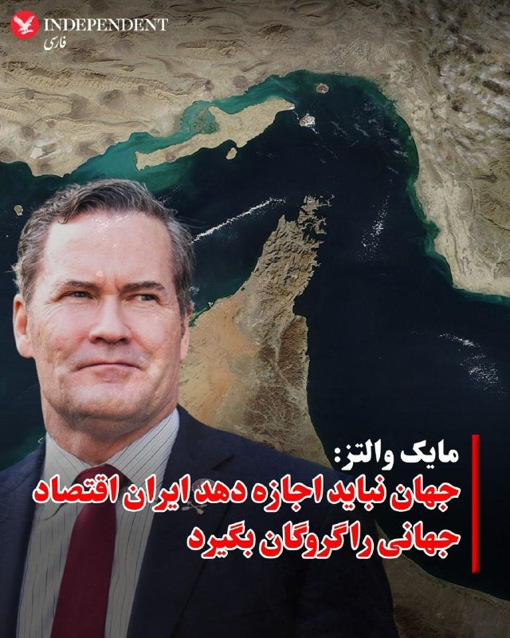

♦️مایک والتز، سفیر آمریکا در سازمان ملل متحد، روز یکشنبه گفت جهان نباید اجازه دهد جمهوری اسلامی اقتصاد جهانی را «گروگان» بگیرد. اظهاراتی که همزمان با ارسال پاسخ آخرین پیشنهاد تهران به واشنگتن مطرح شده است.

والتز در گفت‌وگو با برنامه «فاکس نیوز ساندی» گفت: «جهان نباید رژیم ایران را تحمل کند که تلاش می‌کند کل اقتصاد جهانی را خفه کند.»

سفیر آمریکا در سازمان ملل متحد جمهوری اسلامی را متهم کرد با مین‌گذاری دریایی و حمله به کشتی‌ها امنیت کشتیرانی را تهدید می‌کند و افزود: «آن‌ها حتی اکنون در تلویزیون دولتی ایران درباره هدف قرار دادن کابل‌های زیردریایی که داده‌های مالی، اطلاعات ابری و انواع اطلاعات مهم اقتصادی را از خلیج فارس منتقل می‌کنند، صحبت می‌کنند.»

والتز همچنین گفت واشنگتن در حال بررسی پاسخ ایران به آخرین پیشنهاد آمریکا برای پایان جنگ است.

والتز افزود: «خواهیم دید ایرانی‌ها شب گذشته در پاسخ به خط قرمز بسیار روشن ما چه چیزی ارائه کرده‌اند.» او تاکید کرد دونالد ترامپ بارها گفته است جمهوری اسلامی «هرگز نباید به سلاح هسته‌ای دست پیدا کند» و «نمی‌تواند اقتصاد جهان را گروگان بگیرد.»
‌🇸🇦 Indypersian

🤖 @VahidOOnLine

## VahidOOnLine — post 239323

  

دونالد ترامپ، رییس‌جمهور آمریکا، در بخش دیگری از مصاحبه با شریل اتکیسون، خبرنگار آمریکایی، در پاسخ به این که آیا جنگ علیه جمهوری اسلامی تمام شده، گفت: «نه، من این را نگفتم. من گفتم آن‌ها شکست خورده‌اند، اما این به معنای پایان کارشان نیست.»

ترامپ افزود: «ما می‌توانیم دو هفته دیگر هم وارد عمل شویم و هر هدفی را بزنیم. اهداف مشخصی داشتیم و احتمالا ۷۰ درصد آن‌ها را زده‌ایم، اما اهداف دیگری هم داریم که ممکن است به آن‌ها حمله کنیم.»

رییس‌جمهور آمریکا تاکید کرد: «اما حتی اگر این کار را هم نکنیم، سال‌های زیادی طول می‌کشد تا آن‌ها دوباره بازسازی کنند.»
‌🏁 🇬🇧 IranintlTV

🤖 @VahidOOnLine

## VahidOOnLine — post 239322

  <a href="telegram/content/VahidOOnLine_239322_1778431144.mp4" target="_blank">🎬 Download video</a>

برلین | آلمان؛ گردهمایی ایرانیان ـ گزارشگر ۲۰ اردیبهشت ۱۴۰۵
‌🏁 🇬🇧 ManotoTV

🤖 @VahidOOnLine

## VahidOOnLine — post 239321

  <a href="telegram/content/VahidOOnLine_239321_1778431146.mp4" target="_blank">🎬 Download video</a>

پراگ | چک؛ گردهمایی ایرانیان ـ گزارشگر ۲۰ اردیبهشت ۱۴۰۵
‌🏁 🇬🇧 ManotoTV

🤖 @VahidOOnLine

## pm_afshaa — post 90493

  <a href="telegram/content/pm_afshaa_90493_1778431148.mp4" target="_blank">🎬 Download video</a>

🔴ترامپ در مورد رابطه خود با رئیس‌جمهور چین شی جین‌پینگ پیش از دیدار پیش‌رو با او:

رابطه من با رئیس‌جمهور شی بسیار خوب است. من رهبران دیگر را نمی‌شناسم، اما رئیس‌جمهور شی مرد خوبی است، مرد باهوشی است، چین را دوست دارد.

و من منتظر حضورم هستم. ما قبلاً یک بار این کار را انجام دادیم و شگفت‌انگیز بود. قرار است یک سفر شگفت‌انگیز باشد، فکر می‌کنم قرار است یک سفر شگفت‌انگیز باشد.

💧 Rainbet.com the #1 Non-KYC Crypto Casino & Sportsbook @rainbetcom

😁 @Pm_Afshaa

## pm_afshaa — post 90492

  <a href="telegram/content/pm_afshaa_90492_1778431149.webm" target="_blank">🎬 Download video</a>

🔴فرماندهی مرکزی ایالت متحده:
بیش از 20 کشتی جنگی ایالات متحده در حال اعمال محاصره علیه ایران هستند.

نیروهای سنتکام 61 کشتی تجاری رو بازگرداندند و 4 کشتی رو غیرفعال کردند تا از رعایت قوانین اطمینان حاصل شود.

💧 Rainbet.com the #1 Non-KYC Crypto Casino & Sportsbook @rainbetcom

😁 @Pm_Afshaa

## pm_afshaa — post 90491

  <a href="telegram/content/pm_afshaa_90491_1778431150.webm" target="_blank">🎬 Download video</a>

🔴شرکت ایرفرانس: به‌دلیل شرایط امنیتی، پروازها به دبی، ریاض، تل‌آویو و بیروت تا 20 می (۳۰ اردیبهشت) لغو شده.

💧 Rainbet.com the #1 Non-KYC Crypto Casino & Sportsbook @rainbetcom

😁 @Pm_Afshaa

## VahidOnline — post 75384

  

Afkham_minus

📡 @VahidOnline

## VahidOnline — post 75383

  

رحیم نادعلی، معاون فرهنگی سپاه «محمد رسول‌الله» تهران گفت: «در جشن بزرگ پیوند آسمانی زوج‌های جان‌فدا، خودروهای جیپ جنگی برای جابه‌جایی عروس و دامادها در نظر گرفته شده که با گل‌آرایی، پرچم جمهوری اسلامی و تصاویر رهبری تزئین شده و زوج‌ها در این خودروها در مراسم حضور خواهند یافت.»

او افزود زوج‌های شرکت‌کننده قرار است با «ماشین‌های عروسی به شکل جیپ نظامی» و «خودروهای نظامی گل‌کاری‌شده» در سطح شهر حضور پیدا کنند تا «فضای شهر را به یک شکل هنری و نظامی» درآورند.

به گفته او، هدف این است که نشان داده شود این «زوج‌های جانفدا» جان خود را «زیر پرچم جمهوری اسلامی تقدیم این نظام خواهند کرد» و «از هیچ چیز نمی‌ترسند.»
@VahidOOnLine

📡 @VahidOnline

## VahidOnline — post 75378

رئیس‌جمهور آمریکا می‌گوید عملیات نظامی در ایران تمام نشده و ارتش ایالات متحده می‌تواند اهداف دیگری را نیز هدف قرار دهد.
دونالد ترامپ در گفت‌وگویی با شریل اتکیسون، مجری آمریکایی، که هفته گذشته ضبط و روز یکشنبه ۲۰ اردیبهشت پخش شده است، در پاسخ به این سوال که آیا عملیات رزمی در ایران تمام شده است، گفت: «نه، من چنین چیزی نگفتم. من گفتم آن‌ها شکست خورده‌اند، اما این به آن معنا نیست که کارشان تمام شده است. ما می‌توانیم به مدت دو هفته بیشتر هم وارد عمل شویم و تک‌تک اهداف را هدف قرار دهیم.»
او با اشاره به این که در حملات آمریکا و اسرائیل طی جنگ اخیر «احتمالا ۷۰ درصد» اهداف مورد اصابت قرار گرفتند، افزود: «ما اهداف دیگری هم داریم که احتمالاً می‌توانیم به آن‌ها حمله کنیم. اما حتی اگر این کار را نکنیم، سال‌ها طول می‌کشد تا آن‌ها دوباره بازسازی شوند.»
به نظر می‌رسد اظهارات آقای ترامپ پیش از ارسال پاسخ ایران به آخرین پیشنهاد آمریکا برای این توافق انجام شده است. هرچند که او پیشنهادات قبلی ایران را رد کرده بود.
رئیس‌جمهور آمریکا در مصاحبه با شریل اتکیسون همچنین دربارهٔ اورانیوم غنی‌شده ایران که در عمق زمین و در تأسیسات هدف قرار گرفته در جنگ ۱۲ روزه سال گذشته مدفون شده‌اند، گفت: «ما در مقطعی آن را به دست خواهیم آورد… ما آنجا را تحت نظارت داریم.»
ترامپ اضافه کرد: «من چیزی به نام نیروی فضایی ایجاد کردم و آن‌ها آنجا را زیر نظر دارند… اگر کسی به آن محل نزدیک شود، ما مطلع خواهیم شد و آن‌ها را نابود خواهیم کرد.»
او بارها اشاره کرده است که توافق با ایران باید شامل تحویل ذخایر اورانیوم غنی‌شده ایران به آمریکا باشد. تهران چنین درخواستی را رد کرده است.
@VahidHeadline
رئیس‌جمهور آمریکا گفت: «ما نمی‌توانیم اجازه بدهیم ایران سلاح هسته‌ای داشته باشد، چون آنها دیوانه‌اند. نمی‌توانیم اجازه دسترسی هسته‌ای به آنها بدهیم. اوباما این کار را کرد. اگر من توافق هسته‌ای ایران را لغو نکرده بودم، الان سلاح هسته‌ای را داشتند و الان علیه اسرائیل و خاورمیانه و شاید حتی فراتر از آن استفاده می‌کردند. می‌دانید، آنها در واقع موشک‌هایی دارند که دیدید می‌توانند به اروپا برسند.»
از آقای ترامپ سوال شد آیا این درست که عملیات رزمی علیه ایران تمام شده است.
رئیس‌جمهور آمریکا پاسخ داد:«من این را نگفتم. من گفتم آنها شکست خورده‌اند اما این به این معنا نیست که کارشان تمام شده است. ما می‌توانیم دو هفته دیگر هم وارد عمل شویم و هر هدفی را بزنیم. ما اهداف مشخصی داریم که احتمالاً ۷۰ درصد آن‌ها را زده‌ایم اما اهداف دیگری هم هستند که می‌توانیم بزنیم.»
آقای ترامپ گفت حتی اگر هم این کار را نکنیم، بازسازی سال‌های زیادی برای ایران طول می‌کشد.
@VahidHeadline
بنیامین نتانیاهو، نخست‌وزیر اسرائیل، در گفت‌وگو با سی‌بی‌اس نیوز درباره اورانیوم غنی‌شده در ایران و جنگ علیه جمهوری اسلامی گفت دونالد ترامپ به او گفته می‌خواهد وارد آنجا شود و به نظر او این اقدام از نظر عملی امکان‌پذیر است. او افزود اگر توافقی حاصل شود و بتوان وارد شد و این برنامه را برچید، این بهترین راه خواهد بود.
نتانیاهو از پاسخ به این پرسش که در صورت عدم توافق چه رخ خواهد داد خودداری کرد و گفت برای این موضوع جدول زمانی تعیین نمی‌کند، اما این ماموریت را بسیار مهم دانست.
IranIntl

📡 @VahidOnline

## IranIntlTV — post 336503

  <a href="telegram/content/IranIntlTV_336503_1778431152.mp4" target="_blank">🎬 Download video</a>

ویدیوهای رسیده نشان می‌دهند یکشنبه ۲۰ اردیبهشت ایرانیان مقیم شهرهای مونیخ در آلمان، وین اتریش و آرهوس دانمارک علیه جمهوری اسلامی تجمع کردند.

## IranIntlTV — post 336502

  <a href="telegram/content/IranIntlTV_336502_1778431155.mp4" target="_blank">🎬 Download video</a>

کی‌یر استارمر، نخست‌وزیر بریتانیا، پس از نتایج ضعیف حزب کارگر در انتخابات گفت پیام رای‌دهندگان را شنیده، اما تاکید کرد کنار نخواهد رفت. با این حال، فشارها در درون حزب افزایش یافته است و دست‌کم ۲۱ نماینده حزب کارگر خواستار کناره‌گیری او شده‌اند.

گفت‌وگو با تاج‌الدین سروش، خبرنگار ایران‌اینترنشنال
@iranintltv

## IranIntlTV — post 336501

  <a href="telegram/content/IranIntlTV_336501_1778431157.mp4" target="_blank">🎬 Download video</a>

ویدیوهای رسیده به ایران اینترنشنال نشان می‌دهد ایرانیان مقیم پاریس روز ۲۰ اردیبهشت‌ماه در پاسخ به فراخوان شاهزاده رضا پهلوی، با برگزاری راهپیمایی و تجمع در این شهر حضور یافتند.
@iranintltv

## IranIntlTV — post 336500

  <a href="telegram/content/IranIntlTV_336500_1778431159.mp4" target="_blank">🎬 Download video</a>

بر اساس ویدیوهای رسیده به ایران‌اینترنشنال، ایرانیان ساکن هلند و جمهوری چک، یکشنبه ۲۰ اردیبهشت با فراخوان شاهزاده رضا پهلوی و در اعتراض به اعدام‌های جمهوری اسلامی، در شهرهای آمستردام و پراگ تجمع کردند.

## IranIntlTV — post 336499

  <a href="https://t.me/IranintlTV/336499" target="_blank">📎 Download file</a>

🎧نسخه صوتی اخبار نیم‌روزی | یکشنبه ۲۰ اردیبهشت
@iranintlTV

## IranIntlTV — post 336498

  

وزارت خارجه اردن حمله با پهپاد به کویت را محکوم کرد و آن را نقض آشکار قوانین بین‌المللی و منشور سازمان ملل و تجاوز به حاکمیت کویت دانست.
اردن تاکید کرد در کنار کویت ایستاده و از هر اقدامی که این کشور برای حفظ حاکمیت، امنیت و سلامت شهروندان و ساکنانش انجام دهد، حمایت می‌کند.
https://iranintl.com/202605108954

## IranIntlTV — post 336497

  <a href="telegram/content/IranIntlTV_336497_1778431163.mp4" target="_blank">🎬 Download video</a>

با گذشت دو ماه از انتخاب مجتبی خامنه‌ای به عنوان سومین رهبر نظام، غیبت ادامه‌دار او بر روند دیپلماسی تاثیر گذاشته است. وال‌استریت ژورنال نوشت در حالی که مذاکره‌کنندگان به تصمیم مجتبی خامنه‌ای نیاز دارند او در بستر مرگ است. مجتبی کجاست و چه می‌کند؟

گزارشی از مجتبا پورمحسن
@iranintltv

## IranIntlTV — post 336496

  

دونالد ترامپ، رییس‌جمهور آمریکا، در بخش دیگری از مصاحبه با شریل اتکیسون، خبرنگار آمریکایی، در پاسخ به این که آیا جنگ علیه جمهوری اسلامی تمام شده، گفت: «نه، من این را نگفتم. من گفتم آن‌ها شکست خورده‌اند، اما این به معنای پایان کارشان نیست.»

ترامپ افزود: «ما می‌توانیم دو هفته دیگر هم وارد عمل شویم و هر هدفی را بزنیم. اهداف مشخصی داشتیم و احتمالا ۷۰ درصد آن‌ها را زده‌ایم، اما اهداف دیگری هم داریم که ممکن است به آن‌ها حمله کنیم.»

رییس‌جمهور آمریکا تاکید کرد: «اما حتی اگر این کار را هم نکنیم، سال‌های زیادی طول می‌کشد تا آن‌ها دوباره بازسازی کنند.»
https://iranintl.com/202605102371

## IranIntlTV — post 336495

  <a href="telegram/content/IranIntlTV_336495_1778431168.mp4" target="_blank">🎬 Download video</a>

خبرگزاری ایرنا گزارش داد پاسخ جمهوری اسلامی به آخرین متن پیشنهادی آمریکا برای پایان دادن به جنگ، یکشنبه از طریق میانجی پاکستانی ارسال شده است.

جزییات بیشتر با مرضیه حسینی، خبرنگار ایران‌اینترنشنال
@iranintltv

## IranIntlTV — post 336494

  <a href="telegram/content/IranIntlTV_336494_1778431170.mp4" target="_blank">🎬 Download video</a>

بر اساس ویدیوی رسیده به ایران‌اینترنشنال، گروهی از ایرانیان مقیم فرانسه یکشنبه ۲۰ اردیبهشت در تجمع اعتراضی پاریس پرفورمنسی با موضوع انقلاب ملی اجرا کردند.

## IranIntlTV — post 336493

  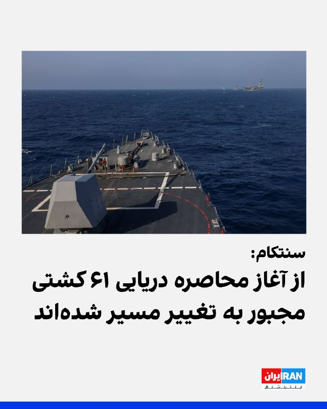

فرماندهی مرکزی ایالات متحده، سنتکام، اعلام کرد از زمان آغاز محاصره دریایی جنوب ایران ۶۱ کشتی تجاری مجبور به تغییر مسیر شده‌اند. چهار کشتی نیز در پی حملات نیروهای آمریکایی از کار افتاده و متوقف شده‌اند.
سنتکام افزود بیش از ۲۰ کشتی جنگی متعلق به ایالات متحده در حال اجرای عملیات در این منطقه هستند.
https://iranintl.com/202605105959

## ManotoTV — post 105264

  <a href="telegram/content/ManotoTV_105264_1778431174.mp4" target="_blank">🎬 Download video</a>

بولونیا | ایتالیا؛ گردهمایی ایرانیان ـ گزارشگر ۲۰ اردیبهشت ۱۴۰۵

## ManotoTV — post 105263

  <a href="telegram/content/ManotoTV_105263_1778431176.mp4" target="_blank">🎬 Download video</a>

تماسی از ایران: «بدون نصب، عضو اپ‌های حکومتی شدم»

## ManotoTV — post 105262

  <a href="telegram/content/ManotoTV_105262_1778431179.mp4" target="_blank">🎬 Download video</a>

‌
دوبلین | ایرلند؛ گردهمایی ایرانیان ـ گزارشگر ۲۰ اردیبهشت ۱۴۰۵

## ManotoTV — post 105261

  <a href="telegram/content/ManotoTV_105261_1778431181.mp4" target="_blank">🎬 Download video</a>

‌
بیرمنگام | بریتانیا؛ گردهمایی ایرانیان ـ گزارشگر ۲۰ اردیبهشت ۱۴۰۵

## ManotoTV — post 105260

  <a href="telegram/content/ManotoTV_105260_1778431184.mp4" target="_blank">🎬 Download video</a>

بنیامین نتانیاهو، نخست‌وزیر اسرائیل، در گفت‌وگو با سی‌بی‌اس نیوز گفت جنگ با ایران تمام نشده، زیرا به گفته او هنوز اورانیوم غنی‌شده، سایت‌های غنی‌سازی، نیروهای نیابتی مورد حمایت ایران و برنامه موشک‌های بالستیک باقی مانده‌اند.

نتانیاهو گفت بخش زیادی از توان جمهوری اسلامی تضعیف شده، اما هنوز «کارهایی هست که باید انجام شود».

او درباره چگونگی خارج کردن اورانیوم با غنای بالا از ایران گفت در صورت وجود توافق، می‌توان وارد شد و آن را خارج کرد و این «بهترین راه» است.

نتانیاهو در پاسخ به این پرسش که آیا بدون توافق می‌توان اورانیوم را با زور خارج کرد، از توضیح درباره گزینه‌ها و برنامه‌های نظامی خودداری کرد، اما این موضوع را «ماموریتی فوق‌العاده مهم» خواند.

## ManotoTV — post 105259

  <a href="telegram/content/ManotoTV_105259_1778431186.mp4" target="_blank">🎬 Download video</a>

‌
کلن | آلمان؛ گردهمایی ایرانیان ـ گزارشگر ۲۰ اردیبهشت ۱۴۰۵

## ManotoTV — post 105258

  <a href="telegram/content/ManotoTV_105258_1778431187.mp4" target="_blank">🎬 Download video</a>

رگنسبورگ | المان؛ گردهمایی ایرانیان ـ گزارشگر ۲۰ اردیبهشت ۱۴۰۵

## ManotoTV — post 105257

  <a href="telegram/content/ManotoTV_105257_1778431190.mp4" target="_blank">🎬 Download video</a>

‌
آرهوس | دانمارک؛ گردهمایی ایرانیان ـ گزارشگر ۲۰ اردیبهشت ۱۴۰۵

## ManotoTV — post 105256

  <a href="telegram/content/ManotoTV_105256_1778431192.mp4" target="_blank">🎬 Download video</a>

نخستین تراکنش آزمایشی موفق پرداخت الکترونیکی از طریق شبکه‌های ویزا و مسترکارت در سوریه را پس از ۱۵ سال وقفه انجام شد.

به گزارش اس‌پی‌تودی، این تراکنش یک آزمایش کنترل‌شده بوده و به معنای راه‌اندازی عمومی خدمات نیست، اما نشان می‌دهد پرداخت‌های بین‌المللی با کارت می‌توانند در چارچوب مقررات بانکی سوریه پردازش و تسویه شوند.

این اقدام پس از تفاهم‌نامه بیمیرا با بانک مرکزی سوریه و تصمیم این بانک برای مجاز کردن همکاری با شبکه‌های پرداخت جهانی انجام شده است. بانک مرکزی سوریه این روند را گامی برای افزایش شمول مالی و باز کردن بازار این کشور به سیستم‌های مالی بین‌المللی دانسته است.

## ManotoTV — post 105255

  <a href="telegram/content/ManotoTV_105255_1778431194.mp4" target="_blank">🎬 Download video</a>

سیدنی | استرالیا؛ گردهمایی ایرانیان ـ گزارشگر ۲۰ اردیبهشت ۱۴۰۵

## ManotoTV — post 105254

  <a href="telegram/content/ManotoTV_105254_1778431196.mp4" target="_blank">🎬 Download video</a>

برلین | آلمان؛ گردهمایی ایرانیان ـ گزارشگر ۲۰ اردیبهشت ۱۴۰۵

## ManotoTV — post 105253

  <a href="telegram/content/ManotoTV_105253_1778431199.mp4" target="_blank">🎬 Download video</a>

برلین | آلمان؛ گردهمایی ایرانیان ـ گزارشگر ۲۰ اردیبهشت ۱۴۰۵

## ManotoTV — post 105252

  <a href="telegram/content/ManotoTV_105252_1778431201.mp4" target="_blank">🎬 Download video</a>

پراگ | چک؛ گردهمایی ایرانیان ـ گزارشگر ۲۰ اردیبهشت ۱۴۰۵

## FarsiVOA — post 217356

  <a href="telegram/content/FarsiVOA_217356_1778431203.mp4" target="_blank">🎬 Download video</a>

بنیامین نتانیاهو، نخست وزیر اسرائیل، روز یکشنبه ۲۰ اردیبهشت، در گفت‌وگو با برنامه ۶۰ دقیقه سی‌بی‌اس نیوز، گفت: جنگ با جمهوری اسلامی ایران «تمام نشده است.»

او افزود که اورانیوم غنی‌شده با غلظت بالا باید از ایران خارج شود و تأسیسات غنی‌سازی نیز باید برچیده شود.

نتانیاهو، با اشاره به قابلیت‌های هسته‌ای جمهوری اسلامی، و همچنین نیروهای نیابتی آن در کشورهای دیگر و ظرفیت ساخت موشک نیز گفت: «اکنون، ما مقدار زیادی از آن را تخریب کرده‌ایم.» او افزود اما مواردی هنوز باقی مانده است و «کارهایی باید انجام شود.»

ناظران بین‌المللی تخمین می‌زنند که جمهوری اسلامی هنوز حدود ۹۷۰ پوند اورانیوم تقریباً در سطح بمب دارد.

گزارش کامل را در وب‌سایت صدای آمریکا بخوانید.

@FarsiVOA

## FarsiVOA — post 217355

🔺وزیر انرژی آمریکا: فشار اقتصادی بر رژیم ایران را افزایش می‌دهیم تا آن‌ها را وادار به مذاکره کنیم

◾️کریس رایت، وزیر انرژی ایالات متحده، یکشنبه ۲۰ اردیبهشت گفت فشار اقتصادی آمریکا بر رژیم ایران به‌طور قابل‌توجهی در حال افزایش است، و واشنگتن از ابزارهای مالی و اقتصادی مختلفی برای وادار کردن جمهوری اسلامی به بازگشت به میز مذاکره استفاده می‌کند.

⬇️ بیشتر بخوانید:

https://ir.voanews.com/a/chris-wright-cbs-inerview-iran-economic-pressure-increasing/8148505.html

## FarsiVOA — post 217354

  <a href="telegram/content/FarsiVOA_217354_1778431205.mp4" target="_blank">🎬 Download video</a>

رضا تقی‌زاده، چهره شناخته‌شده مشروطه‌خواهان پادشاهی‌خواه در عمق میدان گفت: شاهزاده پهلوی تا کنون دو تا خشت را هم روی هم نگذاشته. او با اشاره به شخصیت فرح پهلوی گفت: ای کاش ایشان از مادرش الگو می‌گرفت

## FarsiVOA — post 217353

🔺دونالد ترامپ: شکست نظامی رژیم ایران به معنای پایان کامل عملیات رزمی نیست

◾️دونالد ترامپ، رئیس جمهوری ایالات متحده، در گفت‌وگویی اختصاصی با برنامه «فول مژر» به میزبانی شریل اتکیسون، گفت حکومت ایران از نظر نظامی «شکست خورده» است و توان بازسازی سریع ظرفیت‌های نظامی و هسته‌ای خود را ندارد.

⬇️ بیشتر بخوانید:

https://ir.voanews.com/a/national-desk-sharyl-attkisson-president-trump-interview/8148497.html?withmediaplayer=1

## FarsiVOA — post 217352

رضا تقی‌زاده، چهره شناخته‌شده مشروطه‌خواهان پادشاهی‌خواه در عمق میدان: شاهزاده پهلوی در انتخاب اطرافیان خود مسئول است. باید پرسید چرا شاهزاده پهلوی به جز اسرائیل مورد اقبال هیچ قدرت سیاسی دیگری نبوده؟

## FarsiVOA — post 217351

🔺بنیامین نتانیاهو: جنگ با جمهوری اسلامی تمام نشده است

◾️بنیامین نتانیاهو، نخست وزیر اسرائیل، روز یکشنبه ۲۰ اردیبهشت، در گفت‌وگو با برنامه ۶۰ دقیقه سی‌بی‌اس نیوز، گفت: جنگ با جمهوری اسلامی ایران «تمام نشده است.»

⬇️ بیشتر بخوانید:

https://ir.voanews.com/a/benjamin-netanyahu-iran-war-israel-uranium/8148494.html

## FarsiVOA — post 217350

وزارت امور خارجه قطر روز یکشنبه ۲۰ اردیبهشت اعلام کرد نخست‌وزیر این کشور در گفت‌وگو با وزیر امور خارجه جمهوری اسلامی به او گفته است که استفاده از تنگه هرمز به‌عنوان «ابزار فشار» تنها به عمیق‌تر شدن بحران در خلیج فارس منجر خواهد شد.

شیخ محمد بن عبدالرحمن آل‌ثانی، نخست‌وزیر و وزیر امور خارجه قطر، همچنین در این تماس تلفنی با عباس عراقچی، وزیر امور خارجه رژیم ایران، تأکید کرد که همه طرف‌های درگیر در این مناقشه باید به تلاش‌های میانجی‌گرانه برای پایان دادن به جنگ پاسخ مثبت دهند.

وزارت امور خارجه قطر اعلام نکرد این تماس تلفنی چه زمانی انجام شده است.

گزارش کامل را در وب‌سایت صدای آمریکا بخوانید.

@FarsiVOA

## DW_Farsi — post 124530

  

🔶هشدار قطر به ایران نسبت به استفاده از تنگه هرمز به عنوان اهرم فشار

قطر به ایران هشدار داده است که در مذاکرات جاری با ایالات متحده برای پایان دادن به جنگ فعلی، از تنگه هرمز به عنوان "ابزار فشار" استفاده نکند.

بنابر اعلام دولت دوحه، محمد بن عبدالرحمن آل ثانی، نخست وزیر قطر، روز یکشنبه ۲۰ اردیبهشت (۱۰ مه) در تماس تلفنی با عباس عراقچی، وزیر خارجه ایران، گفت: «اگر تهران از این آبراه کلیدی به عنوان اهرم فشار استفاده کند، این بحران تنها تشدید خواهد شد.»

آل ثانی گفت آزادی دریاها به عنوان یک اصل "غیرقابل مذاکره" است.

همزمان با نقش رسمی پاکستان در میانجیگری برای پایان دادن به جنگ ایران، قطر نیز در پشت صحنه فعال بوده است.

وب‌سایت خبری آمریکایی "اکسیوس" گزارش داده است که آل ثانی روز شنبه ۹ مه در میامی با مارکو روبیو، وزیر خارجه آمریکا و استیو ویتکاف، فرستاده ویژه دونالد ترامپ، در قالب تلاش‌ها برای پایان دادن به جنگ، دیدار کرده است.

@dw_farsi

## DW_Farsi — post 124529

  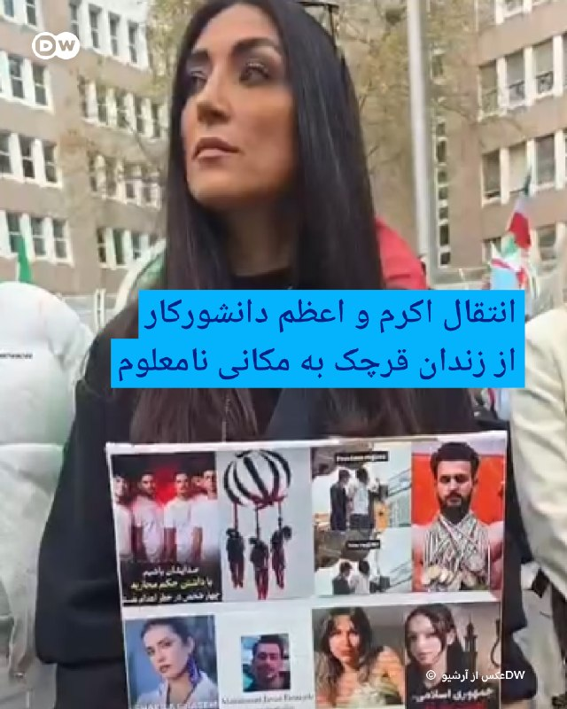

🔶انتقال اکرم و اعظم دانشورکار از زندان قرچک به مکانی نامعلوم

به گزارش خبرگزاری حقوق بشری هرانا اکرم و اعظم دانشورکار، خواهران اکبر دانشورکار، زندانی سیاسی اعدام شده در فروردین ۱۴۰۵، که در زندان قرچک ورامین محبوس بودند، از این زندان به مکان نامعلومی منتقل شدند.

به نوشته هرانا، این دو خواهر در پی مراجعات مکرر به زندان قزلحصار، پزشکی قانونی و مراجع قضایی برای تحویل پیکر برادرشان، در روز شنبه ۲۹ فروردین ۱۴۰۵ بازداشت و به زندان قرچک ورامین منتقل شده بودند.

"اجتماع و تبانی در امنیت داخلی و اختلال در نظم عمومی" از اتهامات مطرح شده علیه این دو خواهر هستند و اکنون پس از روزها بی‌خبری از وضعیت آنان، خانواده در نگرانی شدیدی به سر می‌برد.

اکبر دانشور کار از هواداران "سازمان مجاهدین خلق ایران"، به اتهام بغی از طریق عضویت در گروه‌های مخالف نظام به اعدام محکوم شد. این حکم روز دوشنبه ۱۰ فروردین ماه ۱۴۰۵ در زندان قزلحصار کرج به اجرا در آمد.

@dw_farsi

## Persian_Trend_Official — post 13838

https://youtube.com/live/KXs-so7OROY?feature=share راس ساعت 20 به وقت تهران لایو آغاز میشه حتما تشریف بیارید چندتا اتفاق جالب رو میخوایم در موردش صحبت کنیم

## Persian_Trend_Official — post 13837

تصمیم گرفتم لایو های شبانه رو از این به بعد، حدود ساعت 20 به وقت ایران اجرا کنم .

## Persian_Trend_Official — post 13836

  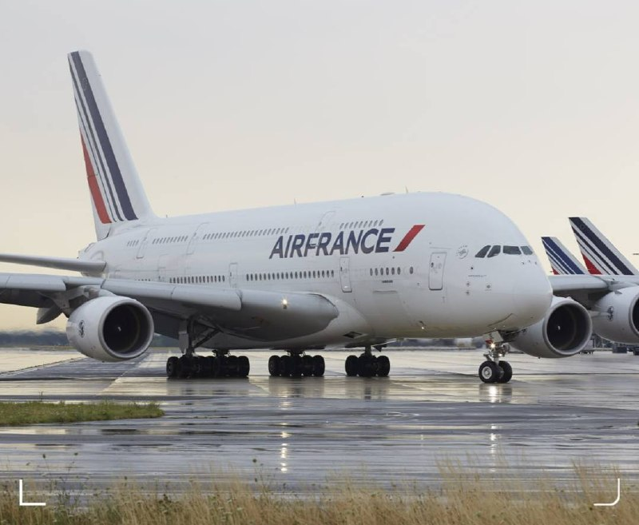

🔴لغو پروازهای شرکت هواپیمایی فرانسه به ۴ مقصد

💢ایرفرانس در بیانیه‌ای اعلام کرد: به‌دلیل شرایط امنیتی، پروازها به دبی، ریاض، تل‌آویو و بیروت تا ۲۰ می (۳۰ اردیبهشت) لغو شده است.

💢ازسرگیری عملیات پروازی منوط به ارزیابی مجدد وضعیت محلی خواهد بود که به‌شدت درحال تغییر است.

🫆:Tony

📌 @persian_trend_official
پرشین ترند | متفاوت‌ترین کانال نظامی

## Persian_Trend_Official — post 13835

  <a href="telegram/content/Persian_Trend_Official_13835_1778431209.mp4" target="_blank">🎬 Download video</a>

🔴 نتانیاهو: جنگ با ایران تمام نشده است

💢هنوز مواد هسته‌ای و اورانیوم غنی‌شده‌ای وجود دارد که باید از ایران خارج شود.

💢هنوز سایت‌های غنی‌سازی‌ هستند که باید برچیده شوند. هنوز گروه‌های نیابتی وجود دارند که ایران از آن‌ها حمایت می‌کند.

💢همچنین موشک‌های بالستیکی وجود دارند که آن‌ها همچنان خواهان تولیدشان هستند.

🫆:Tony

📌 @persian_trend_official
پرشین ترند | متفاوت‌ترین کانال نظامی

## IranianMinds — post 19904

  

🔴 پست جدید ترامپ.

@IranianMinds

## IranianMinds — post 19903

🔴 ارتش اسرائیل :

از ساکنان روستاهای دیرالزهرانی، جرجو و سجاد در جنوب لبنان می‌خواهیم تخلیه شده و یک کیلومتر از این مناطق فاصله بگیرن چون داریم میایم بالا سر حزب الله.

@IranianMinds

## BBCPersian — post 280679

  <a href="telegram/content/BBCPersian_280679_1778431212.mp4" target="_blank">🎬 Download video</a>

تجمعات شبانه حامیان حکومت در ایران در حالی به هفتادمین شب رسیده که کشمکش‌های سیاسی در مورد مذاکره با آمریکا و حجاب در این تجمعات همچنان ادامه دارد.
 
پس از آن که عباس عبدی و صادق زیباکلام، دو تحلیلگر سیاسی در تهران به نقش این تجمعات در ایجاد فشار برای ادامه جنگ و جلوگیری از توافق با آمریکا اشاره کردند، دادستانی تهران امروز علیه هر دو اعلام جرم کرد.
 
همچنین گزارش‌هایی از خطابه و شعار علیه محمدباقر قالیباف، عباس عراقچی و تیم مذاکره‌کننده در این تجمعات منتشر شده است. در برخی از این تجمع‌ها بدبین کردن مردم به مسئولان را «بازی در زمین دشمن» خوانده شده است از جمله در رشت. محمدعلی پورمختار، نماینده ادوار مجلس، در مورد این شعارها گفت: «شعارهایی که علیه قالیباف و تیم مذاکره‌کننده در تجمعات شبانه سر داده می‌شود، بدون تردید موجب دوقطبی‌سازی خواهد شد.» حجاب برخی زنان شرکت‌کننده هم  واکنش‌‌برانگیز شده است.
 
@bbcpersian
 

## BBCPersian — post 280669

  <a href="telegram/content/BBCPersian_280669_1778431215.mp4" target="_blank">🎬 Download video</a>

⭕️فعالیت سفارتخانه‌‌های ایران در شبکه اجتماعی ایکس در پی جنگ آمریکا و اسرائیل با ایران مورد توجه میلیون‌ها مخاطب غیر ایرانی و همچنین کارشناسان تبلیغات جنگ قرار گرفته است.

این حساب‌ها که تا پیش از جنگ، اعلان‌های اداری برای شهروندان ایران و بیانیه‌‌های رسمی دیپلماتیک را بازنشر می‌‌کردند، در نبود دیگر صداهایی که در پی قطع اینترنت در ایران به بیرون راه نمی‌یابند، ناگهان جبهه‌ای گشودند که تا پیش از آن چندان از آن در جنگ نرم استفاده نشده بود.

پویا قربانی از بخش دیجیتال بی‌بی‌سی فارسی با کوری الپرت، پژوهشگر دانشگاه ملبورن در حوزه «تاثیر هوش مصنوعی بر دموکراسی و سیاست» گفتگو کرده و از او پرسیده است که بهره‌گیری از این شیوه نوین پروپاگاندا چه نشانه‌ای از تحول در دیپلماسی دیجیتال در جنگ‌ها به دست ما می‌دهد؟

بی‌بی‌سی فارسی درباره این موضوع با سفارت ایران در آفریقای جنوبی و تایلند تماس گرفت اما پاسخی به پرسش‌های ما داده نشد.

آلبوم را ورق بزنید
@bbcpersian

## Hranews — post 112867

مسعود عبدالله‌زاده از زندان نقده آزاد شد

❗️
❗️
❗️
❗️
❗️ – مسعود (سوران) عبدالله‌زاده، شهروند بازداشتی، امروز یکشنبه با تودیع وثیقه از زندان نقده آزاد شد.

ادامه مطلب

#مسعود_عبدالله‌زاده
#سوران_عبدالله‌زاده

↘️
@hranews_bot تماس ✉️ -  @Hranews  کانال هرانا 🆑

## manototv — post 105264

  <a href="telegram/content/manototv_105264_1778431217.mp4" target="_blank">🎬 Download video</a>

بولونیا | ایتالیا؛ گردهمایی ایرانیان ـ گزارشگر ۲۰ اردیبهشت ۱۴۰۵

## manototv — post 105263

  <a href="telegram/content/manototv_105263_1778431219.mp4" target="_blank">🎬 Download video</a>

تماسی از ایران: «بدون نصب، عضو اپ‌های حکومتی شدم»

## manototv — post 105262

  <a href="telegram/content/manototv_105262_1778431221.mp4" target="_blank">🎬 Download video</a>

‌
دوبلین | ایرلند؛ گردهمایی ایرانیان ـ گزارشگر ۲۰ اردیبهشت ۱۴۰۵

## manototv — post 105261

  <a href="telegram/content/manototv_105261_1778431224.mp4" target="_blank">🎬 Download video</a>

‌
بیرمنگام | بریتانیا؛ گردهمایی ایرانیان ـ گزارشگر ۲۰ اردیبهشت ۱۴۰۵

## manototv — post 105260

  <a href="telegram/content/manototv_105260_1778431226.mp4" target="_blank">🎬 Download video</a>

بنیامین نتانیاهو، نخست‌وزیر اسرائیل، در گفت‌وگو با سی‌بی‌اس نیوز گفت جنگ با ایران تمام نشده، زیرا به گفته او هنوز اورانیوم غنی‌شده، سایت‌های غنی‌سازی، نیروهای نیابتی مورد حمایت ایران و برنامه موشک‌های بالستیک باقی مانده‌اند.

نتانیاهو گفت بخش زیادی از توان جمهوری اسلامی تضعیف شده، اما هنوز «کارهایی هست که باید انجام شود».

او درباره چگونگی خارج کردن اورانیوم با غنای بالا از ایران گفت در صورت وجود توافق، می‌توان وارد شد و آن را خارج کرد و این «بهترین راه» است.

نتانیاهو در پاسخ به این پرسش که آیا بدون توافق می‌توان اورانیوم را با زور خارج کرد، از توضیح درباره گزینه‌ها و برنامه‌های نظامی خودداری کرد، اما این موضوع را «ماموریتی فوق‌العاده مهم» خواند.

## manototv — post 105259

  <a href="telegram/content/manototv_105259_1778431228.mp4" target="_blank">🎬 Download video</a>

‌
کلن | آلمان؛ گردهمایی ایرانیان ـ گزارشگر ۲۰ اردیبهشت ۱۴۰۵

## manototv — post 105258

  <a href="telegram/content/manototv_105258_1778431230.mp4" target="_blank">🎬 Download video</a>

رگنسبورگ | المان؛ گردهمایی ایرانیان ـ گزارشگر ۲۰ اردیبهشت ۱۴۰۵

## manototv — post 105257

  <a href="telegram/content/manototv_105257_1778431232.mp4" target="_blank">🎬 Download video</a>

‌
آرهوس | دانمارک؛ گردهمایی ایرانیان ـ گزارشگر ۲۰ اردیبهشت ۱۴۰۵

## manototv — post 105256

  <a href="telegram/content/manototv_105256_1778431234.mp4" target="_blank">🎬 Download video</a>

نخستین تراکنش آزمایشی موفق پرداخت الکترونیکی از طریق شبکه‌های ویزا و مسترکارت در سوریه را پس از ۱۵ سال وقفه انجام شد.

به گزارش اس‌پی‌تودی، این تراکنش یک آزمایش کنترل‌شده بوده و به معنای راه‌اندازی عمومی خدمات نیست، اما نشان می‌دهد پرداخت‌های بین‌المللی با کارت می‌توانند در چارچوب مقررات بانکی سوریه پردازش و تسویه شوند.

این اقدام پس از تفاهم‌نامه بیمیرا با بانک مرکزی سوریه و تصمیم این بانک برای مجاز کردن همکاری با شبکه‌های پرداخت جهانی انجام شده است. بانک مرکزی سوریه این روند را گامی برای افزایش شمول مالی و باز کردن بازار این کشور به سیستم‌های مالی بین‌المللی دانسته است.

## manototv — post 105255

  <a href="telegram/content/manototv_105255_1778431236.mp4" target="_blank">🎬 Download video</a>

سیدنی | استرالیا؛ گردهمایی ایرانیان ـ گزارشگر ۲۰ اردیبهشت ۱۴۰۵

## manototv — post 105254

  <a href="telegram/content/manototv_105254_1778431239.mp4" target="_blank">🎬 Download video</a>

برلین | آلمان؛ گردهمایی ایرانیان ـ گزارشگر ۲۰ اردیبهشت ۱۴۰۵

## manototv — post 105253

  <a href="telegram/content/manototv_105253_1778431241.mp4" target="_blank">🎬 Download video</a>

برلین | آلمان؛ گردهمایی ایرانیان ـ گزارشگر ۲۰ اردیبهشت ۱۴۰۵

## manototv — post 105252

  <a href="telegram/content/manototv_105252_1778431243.mp4" target="_blank">🎬 Download video</a>

پراگ | چک؛ گردهمایی ایرانیان ـ گزارشگر ۲۰ اردیبهشت ۱۴۰۵

## alonews — post 119111

  <a href="telegram/content/alonews_119111_1778431246.webm" target="_blank">🎬 Download video</a>

👈کریس رایت، وزیر انرژی ایالات متحده، به شبکه ان‌بی‌سی گفت که یک توافق مرحله‌ای ممکن است برای حل تمام نگرانی‌ها در مورد برنامه هسته‌ای ایران کافی نباشد.

🔴ما هیچ گزینه‌ای را در مورد ایران در مرحله پیش‌رو، از جمله اقدام نظامی، رد نمی‌کنیم.

✅ @AloNews خبر جنگ

## alonews — post 119110

  <a href="telegram/content/alonews_119110_1778431246.webm" target="_blank">🎬 Download video</a>

👈هم اکنون حمله اسرائیل به جنوب لبنان

✅ @AloNews خبر جنگ

## alonews — post 119109

  <a href="telegram/content/alonews_119109_1778431246.webm" target="_blank">🎬 Download video</a>

👈کارشناس صداوسیما: ‎
موساد ساعتی ۳ دلار می‌دهد که دختران با تاپ و شلوار در میدان ولیعصر راه بروند. عدم ابلاغ قانون حجاب باعث جنگ شد!

✅ @AloNews خبر جنگ

## alonews — post 119108

  <a href="telegram/content/alonews_119108_1778431247.webm" target="_blank">🎬 Download video</a>

👈حاکم امارات:
امان از روزی که خشم عربی ما بیدار شود

✅ @AloNews خبر جنگ

## alonews — post 119107

  <a href="telegram/content/alonews_119107_1778431247.mp4" target="_blank">🎬 Download video</a>

👈پوتین در سال ۲۰۲۲: یک فرد معتاد به مواد مخدر و نئونازی‌.

🔴پوتین در سال ۲۰۲۶: آقای زلنسکی.

✅ @AloNews خبر جنگ

## alonews — post 119106

  <a href="telegram/content/alonews_119106_1778431248.webm" target="_blank">🎬 Download video</a>

👈رای دادگاه صادرشد: آپارات ۳۶۰۰ میلیارد تومان به تلویزیون بدهد!

🔴وبسایت آپارات در بیانیه‌ای از صدور رأی جدید دادگاه در پرونده شکایت صداوسیما خبر داد و نوشت: طی ۱۱ سال گذشته، آپارات با ۲۶ پرونده و شکایت از سوی سازمان صداوسیما مواجه بوده است؛ در حالی که ماهیت این سرویس، از ابتدا یک پلتفرم کاربرمحور برای انتشار محتوای کاربران بوده است.

🔴در تازه‌ترین رأی صادرشده، روز گذشته مدیرعامل آپارات به پرداخت حدود ۳.۶ همت خسارت بابت انتشار محتوایی که توسط کاربران بر بستر این پلتفرم بارگذاری شده محکوم شده و دادگاه، مسئولیت این محتوا را متوجه پلتفرم دانسته است.

✅ @AloNews خبر جنگ

## alonews — post 119105

  <a href="telegram/content/alonews_119105_1778431248.webm" target="_blank">🎬 Download video</a>

👈شاهزاده سعودی:
اگر به ایران حمله می کردیم تاسیسات نفتی و حیاتی کشورمان مورد هدف قرار می گرفت.

🔴همکاری با پاکستان برای کاهش تنش‌، ریاض عقلانیت را انتخاب کرد.

✅ @AloNews خبر جنگ

## alonews — post 119104

  <a href="telegram/content/alonews_119104_1778431248.mp4" target="_blank">🎬 Download video</a>

👈ترامپ: ونزوئلا در حال حاضر کشوری بسیار خوشحالی‌ست. آن‌ها بدبخت بودند و اکنون خوشحال هستند.

🔴نفتی که در حال بیرون آمدن است عظیم است.

✅ @AloNews خبر جنگ

---
📅 بروزرسانی: 1405/02/20 19:09
---

## VahidOOnLine — post 239316

  

♦️مایک والتز، سفیر ایالات متحده در سازمان ملل متحد، روز یکشنبه اعلام کرد دونالد ترامپ، رئیس‌جمهوری آمریکا، پیش از بازگشت به حملات نظامی علیه ایران، به مسیر دیپلماسی «هر فرصتی» خواهد داد.

والتز در گفتگو با برنامه «این هفته» شبکه ای‌بی‌سی نیوز گفت تصمیم‌گیری درباره این‌که چه اقدامی نقض آتش‌بس محسوب می‌شود و چه زمانی باید به اقدام نظامی بازگشت، بر عهده ترامپ است.

او افزود: «وقتی میانجی‌ها، در این مورد پاکستان، از ما می‌خواهند پیش از بازگشت به بمباران ایران، به این مذاکرات فرصت دیگری بدهیم، فکر می‌کنم این انتخاب کاملا مناسبی برای رئیس‌جمهوری ترامپ است.»

والتز تاکید کرد ترامپ «پیش از بازگشت به خصومت‌ها، هر فرصتی را که ممکن باشد به دیپلماسی می‌دهد.»
‌🇸🇦 Indypersian

🤖 @VahidOOnLine

## VahidOOnLine — post 239315

  <a href="telegram/content/VahidOOnLine_239315_1778427581.mp4" target="_blank">🎬 Download video</a>

هانوفر | آلمان؛ گردهمایی ایرانیان ـ گزارشگر ۲۰ اردیبهشت ۱۴۰۵
‌🏁 🇬🇧 ManotoTV

🤖 @VahidOOnLine

## VahidOOnLine — post 239314

  <a href="telegram/content/VahidOOnLine_239314_1778427583.mp4" target="_blank">🎬 Download video</a>

ویدیوی رسیده به ایران‌اینترنشنال حاکی است گروهی از ایرانیان ساکن بریتانیا یکشنبه ۲۰ اردیبهشت در پی فراخوان شاهزاده رضا پهلوی در لندن تجمع کردند.
‌🏁 🇬🇧 IranintlTV

🤖 @VahidOOnLine

## VahidOOnLine — post 239313

  <a href="telegram/content/VahidOOnLine_239313_1778427586.mp4" target="_blank">🎬 Download video</a>

هامبورگ | آلمان؛ گردهمایی ایرانیان ـ گزارشگر ۲۰ اردیبهشت ۱۴۰۵
‌🏁 🇬🇧 ManotoTV

🤖 @VahidOOnLine

## VahidOOnLine — post 239312

  <a href="telegram/content/VahidOOnLine_239312_1778427589.mp4" target="_blank">🎬 Download video</a>

‌
مالمو | سوئد؛ گردهمایی ایرانیان ـ گزارشگر ۲۰ اردیبهشت ۱۴۰۵
‌🏁 🇬🇧 ManotoTV

🤖 @VahidOOnLine

## VahidOOnLine — post 239311

  <a href="telegram/content/VahidOOnLine_239311_1778427592.mp4" target="_blank">🎬 Download video</a>

ویدیوهای رسیده به ایران‌اینترنشنال نشان می‌دهند گروهی از ایرانیان ساکن جمهوری ایرلند، یکشنبه ۲۰ اردیبهشت در اعتراض به اعدام‌های جمهوری اسلامی، در شهر دوبلین تجمع کردند.
‌🏁 🇬🇧 IranintlTV

🤖 @VahidOOnLine

## VahidOOnLine — post 239310

  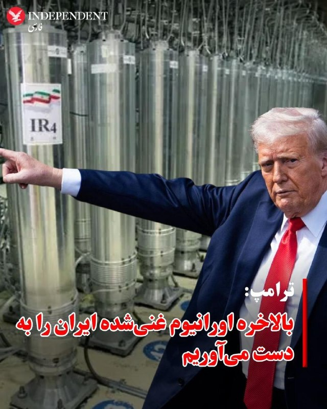

♦️دونالد ترامپ، رئیس‌جمهوری ایالات متحده، روز یکشنبه در گفتگو با برنامه تلویزیونی «فول مژر» اعلام کرد واشنگتن از طریق نظارت‌های دقیق فضایی، تاسیسات هسته‌ای ایران را زیر نظر دارد و هرگونه تلاش برای دسترسی به آن‌ها را با واکنش نظامی قاطع پاسخ خواهد داد.

ترامپ در این مصاحبه با تاکید بر رصد مداوم این مکان‌ها تصریح کرد که ایالات متحده بالاخره به اورانیوم غنی‌شده ایران دست پیدا خواهد کرد و با بهره‌گیری از توان «نیروی فضایی»، تمامی موقعیت‌ها و آدرس‌های مربوطه را به طور کامل تحت کنترل دارد.

ترامپ هشدار داد که اگر هر فرد یا گروهی تلاش کند به این محل‌های مشخص نزدیک شود، ایالات متحده بلافاصله مطلع شده و آن را نابود خواهد کرد.
‌🇸🇦 Indypersian

🤖 @VahidOOnLine

## VahidOOnLine — post 239309

  <a href="telegram/content/VahidOOnLine_239309_1778427595.mp4" target="_blank">🎬 Download video</a>

ویدیوهای رسیده به ایران اینترنشنال نشان می‌دهد شمار زیادی از ایرانیان مقیم هامبورگ روز یکشنبه ۲۰ اردیبهشت‌ماه در پی فراخوان شاهزاده رضا پهلوی، در اعتراض به اعدام‌های جمهوری اسلامی و قطع اینترنت در ایران راهپیمایی کردند.
‌🏁 🇬🇧 IranintlTV

🤖 @VahidOOnLine

## VahidOOnLine — post 239308

  <a href="telegram/content/VahidOOnLine_239308_1778427597.mp4" target="_blank">🎬 Download video</a>

بر اساس ویدیوهای رسیده به ایران‌اینترنشنال، ایرانیان مقیم سوئیس یکشنبه ۲۰ اردیبهشت در پی فراخوان شاهزاده رضا پهلوی، علیه اعدام‌های جمهوری اسلامی و قطع اینترنت در ایران، در شهر ژنو تجمع کردند.
‌🏁 🇬🇧 IranintlTV

🤖 @VahidOOnLine

## VahidOOnLine — post 239307

  <a href="telegram/content/VahidOOnLine_239307_1778427600.mp4" target="_blank">🎬 Download video</a>

هلسینکی | فنلاند؛ گردهمایی ایرانیان ـ گزارشگر ۲۰ اردیبهشت ۱۴۰۵
‌🏁 🇬🇧 ManotoTV

🤖 @VahidOOnLine

## VahidOOnLine — post 239306

  <a href="telegram/content/VahidOOnLine_239306_1778427602.mp4" target="_blank">🎬 Download video</a>

گزارشگر منوتو با ارسال ویدیویی از گرانی اقلام خوراکی در فروشگاه می‌گوید:
«سپاه ما رو به خواری و ذلت انداخته»
‌🏁 🇬🇧 ManotoTV

🤖 @VahidOOnLine

## VahidOOnLine — post 239305

  <a href="telegram/content/VahidOOnLine_239305_1778427604.mp4" target="_blank">🎬 Download video</a>

ویدیوهای رسیده به ایران‌اینترنشنال نشان می‌دهند گروهی از ایرانیان مقیم ایتالیا، یکشنبه ۲۰ اردیبهشت در اعتراض به اعدام‌های جمهوری اسلامی، در شهر بولونیا تجمع کردند و شعار «تا آخوند کفن نشود، این وطن وطن نشود» سردادند.
‌🏁 🇬🇧 IranintlTV

🤖 @VahidOOnLine

## VahidOOnLine — post 239304

  

رسانه‌های ایران گزارش دادند در پاسخ جمهوری اسلامی درباره توافق خاتمه جنگ به میانجی پاکستانی، بر پایان جنگ در همه جبهه‌ها، به‌ویژه لبنان، و تامین امنیت کشتیرانی تاکید شده است.

پیش‌تر دونالد ترامپ گفته بود انتظار دارد هر چه سریع‌تر پاسخ جمهوری اسلامی را دریافت کند.
‌🏁 🇬🇧 IranintlTV

🤖 @VahidOOnLine

## VahidOOnLine — post 239303

  <a href="telegram/content/VahidOOnLine_239303_1778427608.mp4" target="_blank">🎬 Download video</a>

ویدیوهای رسیده به ایران‌اینترنشنال نشان می‌دهد ایرانیان مقیم هامبورگ در آلمان روز یکشنبه ۲۰ اردیبهشت‌ماه در پی فراخوان شاهزاده رضا پهلوی، در اعتراض به اعدام‌های جمهوری اسلامی و قطع اینترنت در ایران راهپیمایی کردند.
‌🏁 🇬🇧 IranintlTV

🤖 @VahidOOnLine

## VahidOOnLine — post 239302

  <a href="telegram/content/VahidOOnLine_239302_1778427611.mp4" target="_blank">🎬 Download video</a>

بر اساس ویدیوهای رسیده به ایران‌اینترنشنال، گروهی از ایرانیان مقیم بریتانیا، یکشنبه ۲۰ اردیبهشت در اعتراض به اعدام‌های جمهوری اسلامی، در شهرهای نیوکسل و بیرمنگام تجمع کردند و شعار دادند: «ایران آری، آخوند نه»
‌🏁 🇬🇧 IranintlTV

🤖 @VahidOOnLine

## VahidOOnLine — post 239301

  

♦️دونالد ترامپ، رئیس‌جمهوری آمریکا، روز یکشنبه در گفتگو با برنامه آمریکایی «فول مژر» با اشاره به مذاکرات اخیر با جمهوری اسلامی گفت: «با گروه سرسختی طرف هستیم»، اما در عین حال تاکید کرد ایران از نظر نظامی شکست خورده است.

ترامپ همچنین گفت آمریکا «سه رده رهبری» در ایران را از میان برده و جمهوری اسلامی اکنون «رهبرانی ندارد، چون آن‌ها را نابود کردیم.»

او در ادامه گفت ایران دیگر سامانه پدافند هوایی و رادار ندارد و مدعی شد جمهوری اسلامی «نه نیروی دریایی دارد و نه نیروی هوایی.»

ترامپ افزود جمهوری اسلامی موشک‌هایی در اختیار داشت که توان رسیدن به اروپا را داشتند و اگر توافق هسته‌ای موسوم به برجام لغو نمی‌شد، ایران اکنون به سلاح هسته‌ای دست یافته بود.

او همچنین یادآور شد در صورتی که آمریکا از برجام خارج نمی‌شد، بازسازی توانمندی‌های ایران «۲۰ سال» زمان می‌برد.
‌🇸🇦 Indypersian

🤖 @VahidOOnLine

## mwarmonitor — post 8830

  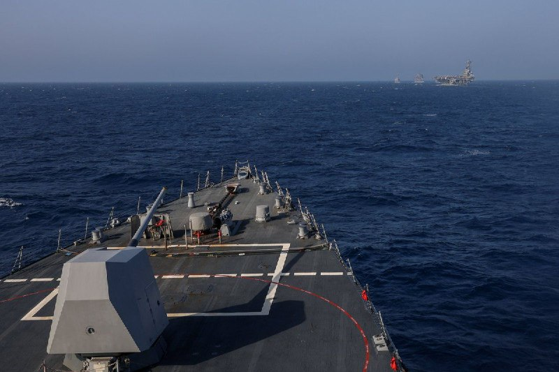

🔴اUSS John Finn (DDG-113) در پشت سرِ USS Milius (DDG-69)، USNS Carl Brashear (T-AKE-7) و USS George H.W. Bush (CVN-77) در دریای عرب در حال حرکت است.

📌بیش از ۲۰ ناو جنگی آمریکا در حال اجرای محاصره علیه ایران هستند. نیروهای سنتکام تاکنون ۶۱ کشتی تجاری را منحرف کرده و ۴ فروند را از کار انداخته‌اند تا از اجرای این روند اطمینان حاصل شود.

@mwarmonitor

## pm_afshaa — post 90490

  <a href="telegram/content/pm_afshaa_90490_1778427616.webm" target="_blank">🎬 Download video</a>

🔴نخست وزیر پاکستان: فرمانده ارتش پاکستان بهم گفت که ایران پاسخ خودش به پیشنهاد آمریکا رو ارسال کرده و دریافت شده.

💧 Rainbet.com the #1 Non-KYC Crypto Casino & Sportsbook @rainbetcom

😁 @Pm_Afshaa

## pm_afshaa — post 90489

  <a href="telegram/content/pm_afshaa_90489_1778427617.webm" target="_blank">🎬 Download video</a>

🔴ترامپ: نگفتم عملیات نظامی علیه ایران پایان یافته، بلکه گفتم آنها شکست خوردن.

💧 Rainbet.com the #1 Non-KYC Crypto Casino & Sportsbook @rainbetcom

😁 @Pm_Afshaa

## pm_afshaa — post 90488

  <a href="telegram/content/pm_afshaa_90488_1778427618.webm" target="_blank">🎬 Download video</a>

🔴دونالد ترامپ: 3 سطح از رهبری ایران نابود شده اما من فکر میکنم ما با افرادی روبرو هستیم که قدرت خاصی دارن؛ خیلی جالبه که آنها معامله می‌کنند و سپس آن را می‌شکنند. آنها گروه سر سختی هستند.

اگر امروز انجا رو ترک کنیم، ایران برای بازسازی توانمندی‌هایش به 20 سال زمان نیاز خواهد داشت.

💧 Rainbet.com the #1 Non-KYC Crypto Casino & Sportsbook @rainbetcom

😁 @Pm_Afshaa

## pm_afshaa — post 90487

  <a href="telegram/content/pm_afshaa_90487_1778427619.webm" target="_blank">🎬 Download video</a>

🔴نتانیاهو در مصاحبه با CBS News: جنگ با ایران هنوز تموم نشده، چون هنوز یه مقدار اورانیوم غنی‌شده تو ایران مونده که باید از ایران خارجش بشه؛ هنوزم سایت‌های غنی‌سازی هست که باید جمع بشه، هنوز گروه‌های نیابتی‌ای که ایران حمایتشون میکنه وجود دارن و ایران هنوز…

## pm_afshaa — post 90486

  <a href="telegram/content/pm_afshaa_90486_1778427619.mp4" target="_blank">🎬 Download video</a>

🔴نتانیاهو در مصاحبه با CBS News:
جنگ با ایران هنوز تموم نشده، چون هنوز یه مقدار اورانیوم غنی‌شده تو ایران مونده که باید از ایران خارجش بشه؛

هنوزم سایت‌های غنی‌سازی هست که باید جمع بشه، هنوز گروه‌های نیابتی‌ای که ایران حمایتشون میکنه وجود دارن و ایران هنوز میخواد موشک بالستیک تولید کنه؛ ما خیلی از توانشونو نابود یا ضعیف کردیم، ولی هنوز کار مونده که باید انجام بدیم.

💧 Rainbet.com the #1 Non-KYC Crypto Casino & Sportsbook @rainbetcom

😁 @Pm_Afshaa

## pm_afshaa — post 90485

  <a href="telegram/content/pm_afshaa_90485_1778427622.webm" target="_blank">🎬 Download video</a>

🔴منبع دیپلماتیک پاکستانی به الجزیره:
پاسخ ایران به پیشنهاد آمریکا پس از دریافت به طرف آمریکایی منتقل شد.

💧 Rainbet.com the #1 Non-KYC Crypto Casino & Sportsbook @rainbetcom

😁 @Pm_Afshaa

## pm_afshaa — post 90484

  <a href="telegram/content/pm_afshaa_90484_1778427623.webm" target="_blank">🎬 Download video</a>

🔴ترامپ ویدیویی رو بازنشر کرده که مربوط به برنامه مارک لوینه؛ جایی که مهمان برنامه میگه «ازسرگیری اقدام نظامی، بهترین گزینه برای مقابله با ایرانه.»

💧 Rainbet.com the #1 Non-KYC Crypto Casino & Sportsbook @rainbetcom

😁 @Pm_Afshaa

## iaghapour — post 2595

⭕️ ادعای عجیب نماینده مجلس: با ۴ هزار میلیارد تومان ایتا را به سطح واتس‌اپ می‌رسانیم!

رئیس کمیته ICT مجلس در اظهارنظری جنجالی مدعی شده است که فاصله میان پیام‌رسان‌های داخلی مثل ایتا با نمونه‌های جهانی مانند واتس‌اپ، تنها در کمبود بودجه برای خرید سرور خلاصه می‌شود. به گفته او، ارتقای این پلتفرم‌ها هزینه چندانی برای کشور ندارد.

این نماینده مجلس معتقد است که پلتفرم‌های داخلی از نظر فنی کمبودی ندارند و تنها زیرساخت‌های سخت‌افزاری آن‌ها باید تقویت شود:

🔹 بودجه برای رقابت: مصطفی طاهری مدعی است با صرف ۳ تا ۴ هزار میلیارد تومان برای خرید سرور، می‌توان کیفیت ایتا را به سطح واتس‌اپ رساند تا توانایی پذیرش بدون مشکل بیش از ۲۰ میلیون کاربر را داشته باشد.

🔸 هشدار درباره جاسوسی سخت‌افزاری: این مقام مسئول همچنین به موضوع استفاده از بیگ‌دیتا (داده‌های بزرگ) اشاره کرده و مدعی شده که آمریکا قوانینی برای جاسوسی در لایه‌های سخت‌افزاری و تراشه‌ها (حتی پایین‌تر از سطح سیستم‌عامل) دارد.

این اظهارات در حالی مطرح می‌شود که کارشناسان حوزه تکنولوژی، موفقیت پلتفرم‌های جهانی را فراتر از صرفا تعداد سرور می‌دانند و مواردی چون امنیت، پروتکل‌های رمزنگاری، حریم خصوصی و نوآوری‌های مداوم نرم‌افزاری را از عوامل اصلی برتری آن‌ها به حساب می‌آورند.

یکی از کاربرا زیر همین پست در دیجیاتو کامنت جالبی گذاشته بود:
مامان‌بزرگ منم با چند میلیارد نیکی میناژ میشه!

پ.ن: حالا فارق از این حرفا داره میگه اینا دارن از کاربراشون جاسوسی میکنن برای همین ما باید اپ های خودمون رو داشته باشیم... من حرفی ندارم.

🆔 @iaghapour

## kianmeli1 — post 87328

  <a href="telegram/content/kianmeli1_87328_1778427623.mp4" target="_blank">🎬 Download video</a>

🔴چگونه تصور می‌کنید اورانیوم بسیار غنی‌شده از ایران خارج خواهد شد؟

بنیامین نتانیاهو:

شما وارد می‌شوید و آن را بیرون می‌آورید. رئیس‌جمهور ترامپ به من گفته است: «می‌خواهم وارد آنجا شوم.»

من زمان‌بندی خاصی برای آن ارائه نمی‌دهم، اما می‌گویم که این یک مأموریت بسیار مهم است.
 https://t.me/kianmeli1

## kianmeli1 — post 87327

🔴شرکت ایرفرانس در بیانیه‌ای اعلام کرد:

به‌دلیل شرایط امنیتی، پروازها به دبی، ریاض، تل‌آویو و بیروت تا ۲۰ می (۳۰ اردیبهشت) لغو شده است
https://t.me/kianmeli1

## IranIntlTV — post 336492

  <a href="telegram/content/IranIntlTV_336492_1778427625.mp4" target="_blank">🎬 Download video</a>

ویدیوی رسیده به ایران‌اینترنشنال حاکی است گروهی از ایرانیان ساکن بریتانیا یکشنبه ۲۰ اردیبهشت در پی فراخوان شاهزاده رضا پهلوی در لندن تجمع کردند.

## IranIntlTV — post 336491

  <a href="telegram/content/IranIntlTV_336491_1778427629.mp4" target="_blank">🎬 Download video</a>

معترضان ایرانی در بانکوک، پایتخت تایلند، هم‌صدا با کارزار جهانی «یک ملت در گروگان»، خواستار توجه جامعه بین‌المللی به وضعیت بحرانی داخل ایران شدند.
@iranintltv

## IranIntlTV — post 336490

  <a href="telegram/content/IranIntlTV_336490_1778427631.mp4" target="_blank">🎬 Download video</a>

بیل راثبورن، مقام پیشین امنیت المپیک، درباره احتمال برنامه‌ریزی شبکه‌های مخفی جمهوری اسلامی و گروه‌های نیابتی برای انجام اقدامات تروریستی در جریان جام جهانی فوتبال در آمریکا هشدار داد.

گفت‌وگو با رها پوربخش، عضو تحریریه ایران‌اینترنشنال
@iranintltv

## IranIntlTV — post 336489

  <a href="telegram/content/IranIntlTV_336489_1778427634.mp4" target="_blank">🎬 Download video</a>

ویدیوهای رسیده به ایران‌اینترنشنال نشان می‌دهند گروهی از ایرانیان ساکن جمهوری ایرلند، یکشنبه ۲۰ اردیبهشت در اعتراض به اعدام‌های جمهوری اسلامی، در شهر دوبلین تجمع کردند.

## IranIntlTV — post 336488

  <a href="telegram/content/IranIntlTV_336488_1778427637.mp4" target="_blank">🎬 Download video</a>

ویدیوهای رسیده به ایران اینترنشنال نشان می‌دهد شمار زیادی از ایرانیان مقیم هامبورگ روز یکشنبه ۲۰ اردیبهشت‌ماه در پی فراخوان شاهزاده رضا پهلوی، در اعتراض به اعدام‌های جمهوری اسلامی و قطع اینترنت در ایران راهپیمایی کردند.

## IranIntlTV — post 336487

  <a href="telegram/content/IranIntlTV_336487_1778427638.mp4" target="_blank">🎬 Download video</a>

بر اساس ویدیوهای رسیده به ایران‌اینترنشنال، ایرانیان مقیم سوئیس یکشنبه ۲۰ اردیبهشت در پی فراخوان شاهزاده رضا پهلوی، علیه اعدام‌های جمهوری اسلامی و قطع اینترنت در ایران، در شهر ژنو تجمع کردند.

## IranIntlTV — post 336486

  <a href="telegram/content/IranIntlTV_336486_1778427641.mp4" target="_blank">🎬 Download video</a>

ویدیوهای رسیده به ایران‌اینترنشنال نشان می‌دهند گروهی از ایرانیان مقیم ایتالیا، یکشنبه ۲۰ اردیبهشت در اعتراض به اعدام‌های جمهوری اسلامی، در شهر بولونیا تجمع کردند و شعار «تا آخوند کفن نشود، این وطن وطن نشود» سردادند.

## IranIntlTV — post 336485

  <a href="telegram/content/IranIntlTV_336485_1778427644.mp4" target="_blank">🎬 Download video</a>

خبرگزاری دولتی ایرنا گزارش داد پاسخ جمهوری اسلامی به آخرین متن پیشنهادی آمریکا برای خاتمه جنگ، به میانجی پاکستانی تحویل داده شده است.

گفت‌وگو با علی شیرازی، عضو تحریریه ایران‌اینترنشنال
@iranintltv

## IranIntlTV — post 336484

  

رسانه‌های ایران گزارش دادند در پاسخ جمهوری اسلامی درباره توافق خاتمه جنگ به میانجی پاکستانی، بر پایان جنگ در همه جبهه‌ها، به‌ویژه لبنان، و تامین امنیت کشتیرانی تاکید شده است.

پیش‌تر دونالد ترامپ گفته بود انتظار دارد هر چه سریع‌تر پاسخ جمهوری اسلامی را دریافت کند.
https://iranintl.com/202605106999

## IranIntlTV — post 336483

  <a href="telegram/content/IranIntlTV_336483_1778427647.mp4" target="_blank">🎬 Download video</a>

ویدیوهای رسیده به ایران‌اینترنشنال نشان می‌دهد ایرانیان مقیم هامبورگ در آلمان روز یکشنبه ۲۰ اردیبهشت‌ماه در پی فراخوان شاهزاده رضا پهلوی، در اعتراض به اعدام‌های جمهوری اسلامی و قطع اینترنت در ایران راهپیمایی کردند.

## IranIntlTV — post 336482

  <a href="telegram/content/IranIntlTV_336482_1778427650.mp4" target="_blank">🎬 Download video</a>

بر اساس ویدیوهای رسیده به ایران‌اینترنشنال، گروهی از ایرانیان مقیم بریتانیا، یکشنبه ۲۰ اردیبهشت در اعتراض به اعدام‌های جمهوری اسلامی، در شهرهای نیوکسل و بیرمنگام تجمع کردند و شعار دادند: «ایران آری، آخوند نه»

## ManotoTV — post 105251

  <a href="telegram/content/ManotoTV_105251_1778427653.mp4" target="_blank">🎬 Download video</a>

هانوفر | آلمان؛ گردهمایی ایرانیان ـ گزارشگر ۲۰ اردیبهشت ۱۴۰۵

## ManotoTV — post 105250

  <a href="telegram/content/ManotoTV_105250_1778427655.mp4" target="_blank">🎬 Download video</a>

هامبورگ | آلمان؛ گردهمایی ایرانیان ـ گزارشگر ۲۰ اردیبهشت ۱۴۰۵

## ManotoTV — post 105249

  <a href="telegram/content/ManotoTV_105249_1778427658.mp4" target="_blank">🎬 Download video</a>

‌
مالمو | سوئد؛ گردهمایی ایرانیان ـ گزارشگر ۲۰ اردیبهشت ۱۴۰۵

## ManotoTV — post 105248

  <a href="telegram/content/ManotoTV_105248_1778427660.mp4" target="_blank">🎬 Download video</a>

هلسینکی | فنلاند؛ گردهمایی ایرانیان ـ گزارشگر ۲۰ اردیبهشت ۱۴۰۵

## ManotoTV — post 105247

  <a href="telegram/content/ManotoTV_105247_1778427662.mp4" target="_blank">🎬 Download video</a>

گزارشگر منوتو با ارسال ویدیویی از گرانی اقلام خوراکی در فروشگاه می‌گوید:
«سپاه ما رو به خواری و ذلت انداخته»

## FarsiVOA — post 217349

  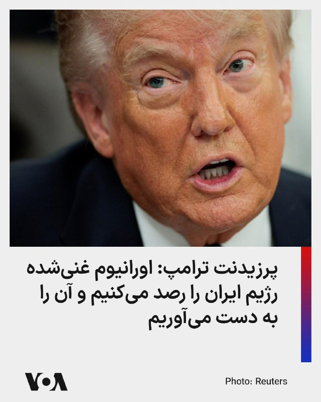

رئیس جمهوری آمریکا می‌گوید که اورانیوم غنی‌شده جمهوری اسلامی که در زیر آوار مدفون شده، تحت رصد آمریکا قرار دارد.

پرزیدنت ترامپ روز یکشنبه ۲۰ اردیبهشت در یک مصاحبه تلویزیونی گفت: «ما دیر یا زود [این اورانیوم غنی‌شده] را به دست خواهیم آورد. تحت رصد ما است.»

او افزود که نیروی فضایی آمریکا این ذرات و مکان دفن آنها را زیر نظر دارند و اگر کسی وارد آن شود، ایالات متحده حتی از نام، نشانی، و شماره پرسنلی آن شخص مطلع خواهد شد.»

او با تاکید بر رصد این مکان، تاکید کرد: «اگر کسی به آن جا نزدیک شود، ما باخبر خواهیم شد و آنها را منفجر خواهیم کرد.»

اشاره پرزیدنت ترامپ به ۴۵۰ کیلوگرم اورانیوم غنی‌شده ایران است که تابستان گذشته در حملات هوایی آمریکا به تاسیسات اتمی جمهوری اسلامی زیر خاک مدفون شد. ایالات متحده بارها اعلام کرده که این ذرات باید از ایران خارج شود. آمریکا دو روز قبل نیز ۱۳.۵ کیلوگرم اورانیوم غنی‌شده را از ونزوئلا خارج و به ایالات متحده منتقل کرد.

## FarsiVOA — post 217348

  <a href="telegram/content/FarsiVOA_217348_1778427665.mp4" target="_blank">🎬 Download video</a>

رضا تقی‌زاده در عمق میدان در پاسخ به پرسش فهیمه خضر حیدری درباره آینده سیاسی ایران گفت: به رضا پهلوی رأی نخواهم داد

## DW_Farsi — post 124528

  

🔶امضای "پیمان آوریل" در اعتراض به افزایش اعدام‌ها و سرکوب سیاسی در ایران

بیش از صد نهاد مدنی، سیاسی و حقوق بشری با امضای یک پیمان‌نامه به نام "پیمان آوریل" به موج فزاینده اعدام‌ها و سرکوب سیاسی در ایران اعتراض و بر تداوم مبارزه برای لغو کامل مجازات اعدام و آزادی زندانیان سیاسی تأکید کردند.

امضاکنندگان، اعدام را "ابزار سرکوب، ارعاب و قتل حکومتی" توصیف کرده و خواستار پایان فوری تمامی احکام اعدام در ایران شده‌اند.

در بخشی از این میثاق آمده است: «ما امضاکنندگان این پیمان اعلام می‌کنیم که متحدانه و با تمام قوا علیه هر حکم و اجرای اعدام توسط جمهوری اسلامی، به هر جرم و بهانه‌ای، مبارزه می‌کنیم و برای قطع فوری اعدام‌ها در ایران پیگیرانه می‌کوشیم.»

این بیانیه همچنین تأکید می‌کند که "هیچ انسانی نباید به دلیل عقیده، اعتراض، فعالیت سیاسی یا سبک زندگی خود زندانی یا مجازات شود" و بر آزادی فوری و بی‌قید و شرط تمامی زندانیان سیاسی و عقیدتی پافشاری می‌کند.

@dw_farsi

## Persian_Trend_Official — post 13834

مستند رضاشاه، پدر ایران نوین 🔥

## Persian_Trend_Official — post 13833

مستند رضاشاه، پدر ایران نوین 🔥

## Persian_Trend_Official — post 13832

مستند رضاشاه، پدر ایران نوین 🔥

## Persian_Trend_Official — post 13831

⭕️ رئیس انرژی: پارسال 9 هزار مگاوات کمبود برق داشتیم و امسال 24 هزارمگاوات؛ مردم برای قطعی های برق در هر 7 روز هفته خودشونو آماده کنن. 📝 Nick 📌 @persian_trend_official پرشین ترند | متفاوت‌ترین کانال نظامی

## Persian_Trend_Official — post 13830

  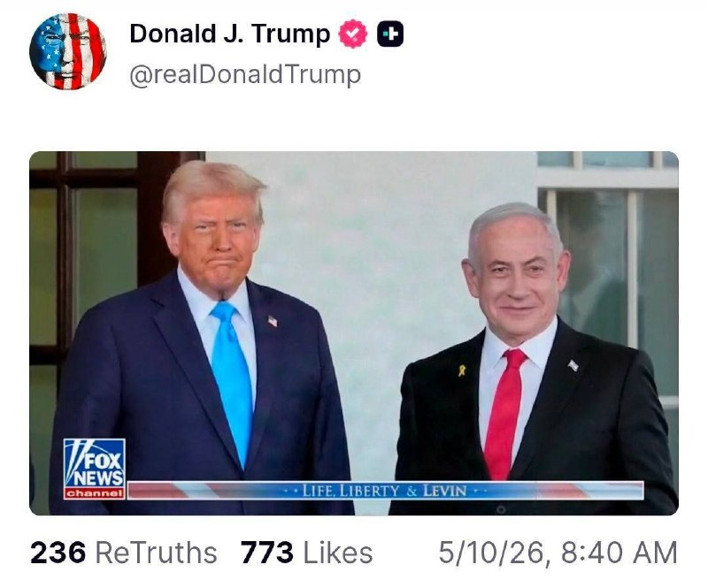

پست ترامپ در تروث سوشال لحظاتی قبل منتشر کرد.

## RadioFarda — post 157035

ترامپ: اهداف دیگری در ایران باقی مانده که می‌توانیم به آنها حمله کنیم

🔸رئیس‌جمهور آمریکا می‌گوید عملیات نظامی در ایران تمام نشده و ارتش ایالات متحده می‌تواند اهداف دیگری را نیز هدف قرار دهد.

🔸دونالد ترامپ در گفت‌وگویی با شریل اتکیسون، مجری آمریکایی، که هفته گذشته ضبط و روز یکشنبه ۲۰ اردیبهشت پخش شده است، در پاسخ به این سوال که آیا عملیات رزمی در ایران تمام شده است، گفت: «نه، من چنین چیزی نگفتم. من گفتم آن‌ها شکست خورده‌اند، اما این به آن معنا نیست که کارشان تمام شده است. ما می‌توانیم به مدت دو هفته بیشتر هم وارد عمل شویم و تک‌تک اهداف را هدف قرار دهیم.»

🔸او با اشاره به این که در حملات آمریکا و اسرائیل طی جنگ اخیر «احتمالا ۷۰ درصد» اهداف مورد اصابت قرار گرفتند، افزود: «ما اهداف دیگری هم داریم که احتمالاً می‌توانیم به آن‌ها حمله کنیم. اما حتی اگر این کار را نکنیم، سال‌ها طول می‌کشد تا آن‌ها دوباره بازسازی شوند.»

🔸به نظر می‌رسد اظهارات آقای ترامپ پیش از ارسال پاسخ ایران به آخرین پیشنهاد آمریکا برای این توافق انجام شده است. هرچند که او پیشنهادات قبلی ایران را رد کرده بود.

🔸رئیس‌جمهور آمریکا در مصاحبه با شریل اتکیسون همچنین دربارهٔ اورانیوم غنی‌شده ایران که در عمق زمین و در تأسیسات هدف قرار گرفته در جنگ ۱۲ روزه سال گذشته مدفون شده‌اند، گفت: «ما در مقطعی آن را به دست خواهیم آورد… ما آنجا را تحت نظارت داریم.»

🔸ترامپ اضافه کرد: «من چیزی به نام نیروی فضایی ایجاد کردم و آن‌ها آنجا را زیر نظر دارند… اگر کسی به آن محل نزدیک شود، ما مطلع خواهیم شد و آن‌ها را نابود خواهیم کرد.»

🔸او بارها اشاره کرده است که توافق با ایران باید شامل تحویل ذخایر اورانیوم غنی‌شده ایران به آمریکا باشد. تهران چنین درخواستی را رد کرده است.

@RadioFarda

## IranianMinds — post 19902

  <a href="telegram/content/IranianMinds_19902_1778427667.mp4" target="_blank">🎬 Download video</a>

🔴 ترامپ:

ونزوئلا در حال حاضر کشوری بسیار شاد است. اونا خیلی بدبخت بودند و حالا خوشحال هستند.

نفتی که از اونجا بیرون میاد بسیار زیاد است.

@IranianMinds

## IranianMinds — post 19901

🔴 معاون وزیر امور خارجه جمهوری اسلامی:

حضور ناوهای جنگی فرانسه و انگلیس در تنگه هرمز با واکنش فوری و قاطع مواجه خواهد شد.

@IranianMinds

## IranianMinds — post 19900

  

نه داداش تو نمیدونی جمهوری اسلامی خیلی خوب داره دووم میاره جلو آمریکا و اسرائیل :

@IranianMinds

## IranianMinds — post 19899

  <a href="telegram/content/IranianMinds_19899_1778427670.mp4" target="_blank">🎬 Download video</a>

🔴 نتانیاهو:

جنگ با ایران تمام نشده است زیرا هنوز اورانیوم غنی شده وجود دارد که باید از ایران خارج شود.

هنوز سایت های غنی سازی وجود دارد که باید برچیده شوند. هنوز هم پروکسی هایی وجود دارند که ایران از آنها پشتیبانی می کند و موشک های بالستیکی که آنها می خواهند تولید کنند.

ما خیلی اونارو تحقیر کردیم، اما جای کار وجود دارد.

@IranianMinds

## IranianMinds — post 19897

  <a href="https://t.me/IranianMinds/19897" target="_blank">📎 Download file</a>

📲#اپلیکیشن اندروید سایت جهانی دربی بت

👍اسپانسر لیگ انگلیس
👍
🔥امکان شارژ امن از طریق کارت بانکی
➖➖➖➖➖➖➖➖➖

🪙همین حالا عضو شوید 👇
https://t.me/+aCbq7yy8QY80NzQ0

## IranianMinds — post 19896

  

😤دنبال یه سایت شرط بندی بین المللی بودی که به ایرانیا خدمات بده؟!
⛔

👍دربی بت همون انتخاب  100%

💎ویژگی های سایت جهانی Derby Bet:

⬅️امکان شارژ امن با کارت بانکی

⬅️واریز اول دوبل شارژ می شوید(بونوس۱۰۰٪)

⬅️پر اپشن ترین سایت فعال در ایران

⬅️تسویه حساب کمتر از 5 دقیقه

⬅️برگشت بخشی از باخت به صورت هفتگی

🚨کد هدیه ثبت نام:GG007

⚠️برای دانلود اپلکیشن کلیک کنید
👉
ge20

🔔کانال دربی بت :

🪙https://t.me/+aCbq7yy8QY80NzQ0

## BBCPersian — post 280668

  

⭕️دونالد ترامپ به شبکه آمریکایی ای‌بی‌سی گفت: «من نگفتم عملیات رزمی علیه ایران تمام شد، گفتم آنها شکست خورده‌اند.»

رئیس‌جمهور آمریکا گفت: «ما نمی‌توانیم اجازه بدهیم ایران سلاح هسته‌ای داشته باشد، چون آنها دیوانه‌اند. نمی‌توانیم اجازه دسترسی هسته‌ای به آنها بدهیم. اوباما این کار را کرد. اگر من توافق هسته‌ای ایران را لغو نکرده بودم، الان سلاح هسته‌ای را داشتند و الان علیه اسرائیل و خاورمیانه و شاید حتی فراتر از آن استفاده می‌کردند. می‌دانید، آنها در واقع موشک‌هایی دارند که دیدید می‌توانند به اروپا برسند.»

از آقای ترامپ سوال شد آیا این درست که عملیات رزمی علیه ایران تمام شده است.
رئیس‌جمهور آمریکا پاسخ داد:«من این را نگفتم. من گفتم آنها شکست خورده‌اند اما این به این معنا نیست که کارشان تمام شده است. ما می‌توانیم دو هفته دیگر هم وارد عمل شویم و هر هدفی را بزنیم. ما اهداف مشخصی داریم که احتمالاً ۷۰ درصد آن‌ها را زده‌ایم اما اهداف دیگری هم هستند که می‌توانیم بزنیم.»

آقای ترامپ گفت حتی اگر هم این کار را نکنیم، بازسازی سال‌های زیادی برای ایران طول می‌کشد.

📸AFP via Getty Images

https://bbc.in/3Pghafw
@BBCPersian

## BBCPersian — post 280667

  <a href="telegram/content/BBCPersian_280667_1778427675.mp4" target="_blank">🎬 Download video</a>

اینستاگرام روز ۱۸ اردیبهشت ۱۴۰۵ اعلام کرد که گزینه ارسال پیام‌های مستقیم با فناوری حریم خصوصی بسیار امن را حذف می‌کند. این در حالی است که این پلتفرم سال‌ها این فناوری را به عنوان آینده اینستاگرام معرفی می‌کرد.

مارک زاکربرگ، مدیرعامل متا، در سال ۲۰۱۹ وعده داد که اجرای رمزگذاری سرتاسری در سراسر برنامه‌هایش، پلتفرم‌هایش را ایمن‌تر و مطمئن‌تر خواهد کرد. اما ماه گذشته این شرکت از این وعده خود دست کشید؛ اقدامی که مورد تحسین گروه‌های مجری قانون قرار گرفت اما فعالان حریم خصوصی به آن انتقاد کردند.
@BBCPersian
https://bbc.in/4fc1lAT

## BBCPersian — post 280666

  <a href="telegram/content/BBCPersian_280666_1778427678.mp4" target="_blank">🎬 Download video</a>

اینستاگرام روز ۱۸ اردیبهشت ۱۴۰۵ اعلام کرد که گزینه ارسال پیام‌های مستقیم با فناوری حریم خصوصی بسیار امن را حذف می‌کند. این در حالی است که این پلتفرم سال‌ها این فناوری را به عنوان آینده اینستاگرام معرفی می‌کرد.

مارک زاکربرگ، مدیرعامل متا، در سال ۲۰۱۹ وعده داد که اجرای رمزگذاری سرتاسری در سراسر برنامه‌هایش، پلتفرم‌هایش را ایمن‌تر و مطمئن‌تر خواهد کرد. اما ماه گذشته این شرکت از این وعده خود دست کشید؛ اقدامی که مورد تحسین گروه‌های مجری قانون قرار گرفت اما فعالان حریم خصوصی به آن انتقاد کردند.
@BBCPersian
https://bbc.in/4fc1lAT

## BBCPersian — post 280665

🔻مدیرعامل شرکت پایانه‌های نفتی ایران ایجاد یک لکه نفتی در سواحل جزیره خارگ را «ادعای کذب و به دور از واقعیت» خواند.

به گزارش رسانه‌های ایران، عباس اسدروز گفت: «به محض انتشار این اخبار، گروه‌های متخصص اچ‌اس‌ئی [سلامت و ایمنی]، اداره شیمیایی و آزمایشگاه، همه منطقه را پایش کردند اما حتی کوچک‌ترین موردی یافت نشد.»

به گفته او، نه مرکز بین‌المللی میمک، وابسته به سازمان بین المللی دریانوردی، نه ایران گزارشی از آلودگی در این منطقه ثبت نکرده‌اند.

آقای اسدروز همچنین گفت: «روایت‌سازان مدعی لکه‌ای هستند که به سمت دریا می‌رود، در حالی که با توجه به جهت باد شمال‌غربی (۲۰ گره دریایی) به سمت جنوب شرقی، اگر لکه‌ای وجود داشت باید به سمت ساحل می‌آمد.»

اشاره آقای اسدروز به پست نهاد غیردولتی «رصدخانه درگیری و محیط زیست» در شبکه ایکس است که نوشته بود: «منشا اولیه هنوز مشخص نیست و این لکه در حال حرکت به سمت جنوب است و به نظر نمی‌رسد به‌درستی مهار شود.»

https://bbc.in/4u2uB1B
@BBCPersian

## idfinfarsi — post 11562

ارتش اسرائیل تروریست‌های نخبه و دیگر تروریست‌هایی را که نیروهای ما را در نوار غزه تهدید می‌کردند، به هلاکت رساند

نیروهای ارتش اسرائیل در فرماندهی جنوب، امروز (یکشنبه) تروریست‌های مسلح نخبه از سازمان تروریستی حماس را که برای پیشبرد توطئه‌های تروریستی در کوتاه‌مدت علیه نیروهای ارتش اسرائیل در جنوب نوار غزه فعالیت می‌کردند، شناسایی کردند.

در حادثه دیگری که دیشب (شنبه) رخ داد، نیروهای تیم رزمی تیپ ۱۴ که در شمال نوار غزه فعالیت می‌کردند، دو تروریست را که در منطقه خط زرد اقدامات مشکوکی را روی زمین انجام می‌دادند و به گونه‌ای به نیروها نزدیک می‌شدند که تهدید فوری ایجاد می‌کردند، شناسایی کردند.

در هر دو حادثه، نیروی هوایی، تحت هدایت نیروها، تروریست‌ها را به هلاکت رساند تا تهدید را از بین ببرد.

قبل از حملات، اقداماتی برای به حداقل رساندن آسیب به غیرنظامیان، از جمله استفاده از سلاح‌های دقیق و رصد هوایی، انجام شد.

ارتش اسرائیل در فرماندهی جنوب مطابق با توافق در منطقه مستقر هستند و به عملیات خود برای از بین بردن هرگونه تهدید فوری ادامه خواهند داد.

## manototv — post 105251

  <a href="telegram/content/manototv_105251_1778427680.mp4" target="_blank">🎬 Download video</a>

هانوفر | آلمان؛ گردهمایی ایرانیان ـ گزارشگر ۲۰ اردیبهشت ۱۴۰۵

## manototv — post 105250

  <a href="telegram/content/manototv_105250_1778427682.mp4" target="_blank">🎬 Download video</a>

هامبورگ | آلمان؛ گردهمایی ایرانیان ـ گزارشگر ۲۰ اردیبهشت ۱۴۰۵

## manototv — post 105249

  <a href="telegram/content/manototv_105249_1778427684.mp4" target="_blank">🎬 Download video</a>

‌
مالمو | سوئد؛ گردهمایی ایرانیان ـ گزارشگر ۲۰ اردیبهشت ۱۴۰۵

## manototv — post 105248

  <a href="telegram/content/manototv_105248_1778427687.mp4" target="_blank">🎬 Download video</a>

هلسینکی | فنلاند؛ گردهمایی ایرانیان ـ گزارشگر ۲۰ اردیبهشت ۱۴۰۵

## manototv — post 105247

  <a href="telegram/content/manototv_105247_1778427689.mp4" target="_blank">🎬 Download video</a>

گزارشگر منوتو با ارسال ویدیویی از گرانی اقلام خوراکی در فروشگاه می‌گوید:
«سپاه ما رو به خواری و ذلت انداخته»

## alonews — post 119103

  <a href="telegram/content/alonews_119103_1778427691.webm" target="_blank">🎬 Download video</a>

👈هیمتی:
مشکلات اقتصادی و تورم بخاطر جنگ هست

✅ @AloNews خبر جنگ

## alonews — post 119102

  <a href="telegram/content/alonews_119102_1778427691.webm" target="_blank">🎬 Download video</a>

👈امیرعباس فخرآور: من هم لایق پادشاهی هستم چون سواد کافی و نفوذ خوبی در کاخ سفید دارم اما دنبال پادشاهی نیستم و دنبال ایران آزادم و پیش خیلی از مردم ایران هم اعتبارم زیاده

✅ @AloNews خبر جنگ

## alonews — post 119101

  <a href="telegram/content/alonews_119101_1778427692.webm" target="_blank">🎬 Download video</a>

👈غریب‌آبادی: حضور ناوهای فرانسوی و انگلیسی و یا هر کشور دیگری برای همراهی احتمالی با اقدامات غیرقانونی و خلاف حقوق بین‌الملل آمریکا در تنگه هرمز، با پاسخ قاطع و فوری نیروهای مسلح جمهوری اسلامی ایران مواجه خواهد شد.

✅ @AloNews خبر جنگ

## alonews — post 119100

  <a href="telegram/content/alonews_119100_1778427692.webm" target="_blank">🎬 Download video</a>

👈شرکت ایرفرانس در بیانیه‌ای اعلام کرد:
به‌دلیل شرایط امنیتی، پروازها به دبی، ریاض، تل‌آویو و بیروت تا ۲۰ می (۳۰ اردیبهشت) لغو شده است

✅ @AloNews خبر جنگ

## alonews — post 119099

  <a href="telegram/content/alonews_119099_1778427692.webm" target="_blank">🎬 Download video</a>

👈ترامپ: نگفتم عملیات نظامی علیه ایران پایان یافته، بلکه گفتم آنها شکست خوردن.

✅ @AloNews خبر جنگ

## alonews — post 119098

  <a href="telegram/content/alonews_119098_1778427692.webm" target="_blank">🎬 Download video</a>

👈نخست‌وزیر پاکستان اعلام کرد که ژنرال عاصم منیر، رئیس ستاد ارتش، به او اطلاع داده است که پاسخی از سوی ایران به پیشنهاد آمریکا دریافت شده است.

✅ @AloNews خبر جنگ

## alonews — post 119097

  <a href="telegram/content/alonews_119097_1778427693.webm" target="_blank">🎬 Download video</a>

👈فرماندهی مرکزی ایالات متحده:
بیش از 20 ناو جنگی آمریکا محاصره ایران را اجرا میکنند

🔴نیروهای CENTCOM 61 کشتی تجاری را هدایت کرده اند و 4 کشتی را برای اطمینان از انطباق غیرفعال کرده اند.‌‌

✅ @AloNews خبر جنگ

## alonews — post 119096

  <a href="telegram/content/alonews_119096_1778427693.mp4" target="_blank">🎬 Download video</a>

👈چگونه تصور می‌کنید اورانیوم بسیار غنی‌شده از ایران خارج شود؟

🔴نتانیاهو: شما وارد می‌شوید و آن را بیرون می‌آورید. رئیس‌جمهور ترامپ به من گفته است، «می‌خواهم وارد آنجا شوم.»

🔴من جدول زمانی برای آن نمی‌دهم، اما می‌گویم این یک مأموریت فوق‌العاده مهم است

✅ @AloNews خبر جنگ

---
📅 بروزرسانی: 1405/02/20 18:17
---

## VahidOOnLine — post 239300

  

مایک والتز، نماینده آمریکا در سازمان ملل متحد، به فاکس نیوز گفت: عملیات خشم اقتصادی در حال حاضر اقتصاد ایران را ویران می‌کند. پول آنها در حال سقوط آزاد است، ذخایر ارزی آنها نزدیک به صفر است.
‌🏁 🇬🇧 IranintlTV

🤖 @VahidOOnLine

## VahidOOnLine — post 239299

  <a href="telegram/content/VahidOOnLine_239299_1778424423.mp4" target="_blank">🎬 Download video</a>

اینسبروک | اتریش؛ گردهمایی ایرانیان ـ گزارشگر ۲۰ اردیبهشت ۱۴۰۵
‌🏁 🇬🇧 ManotoTV

🤖 @VahidOOnLine

## VahidOOnLine — post 239298

  <a href="telegram/content/VahidOOnLine_239298_1778424425.mp4" target="_blank">🎬 Download video</a>

ژنو | سوئیس؛ گردهمایی ایرانیان ـ گزارشگر ۲۰ اردیبهشت ۱۴۰۵
‌🏁 🇬🇧 ManotoTV

🤖 @VahidOOnLine

## VahidOOnLine — post 239297

  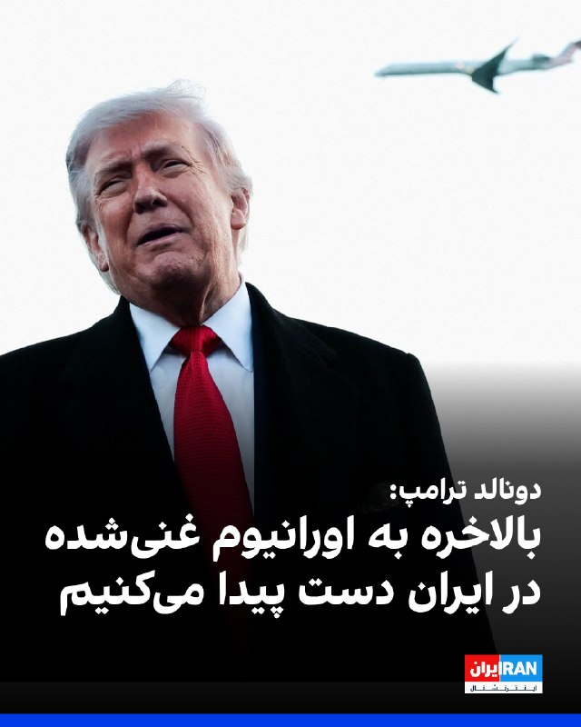

دونالد ترامپ در گفت‌وگو با «فول مژر» درباره اورانیوم غنی‌شده در ایران گفت: ما بالاخره به آن دست پیدا می‌کنیم، ما آنجا را تحت نظارت داریم. همه‌چیز تحت نظر است. اگر کسی به آن محل نزدیک شود، خبردار می‌شویم و نابودش می‌کنیم.
‌🏁 🇬🇧 IranintlTV

🤖 @VahidOOnLine

## VahidOOnLine — post 239296

  

دونالد ترامپ در گفت‌وگو با «فول مژر» درباره اورانیوم غنی‌شده در ایران گفت: ما بالاخره به آن دست پیدا می‌کنیم، ما آنجا را تحت نظارت داریم. همه‌چیز تحت نظر است. اگر کسی به آن محل نزدیک شود، خبردار می‌شویم و نابودش می‌کنیم.
‌🏁 🇬🇧 IranintlTV

🤖 @VahidOOnLine

## VahidOOnLine — post 239295

  

دونالد ترامپ در گفت‌وگو با «فول مژر» درباره اورانیوم غنی‌شده در ایران گفت: ما بالاخره به آن دست پیدا می‌کنیم، ما آنجا را تحت نظارت داریم. همه‌چیز تحت نظر است. اگر کسی به آن محل نزدیک شود، خبردار می‌شویم و نابودش می‌کنیم.
‌🏁 🇬🇧 IranintlTV

🤖 @VahidOOnLine

## VahidOOnLine — post 239294

  <a href="telegram/content/VahidOOnLine_239294_1778424429.mp4" target="_blank">🎬 Download video</a>

راهپیمایی ایرانیان ساکن استکهلم سوئد، یکشنبه ۲۰ اردیبهشت ۱۴۰۵
‌🏁 🇬🇧 ManotoTV

🤖 @VahidOOnLine

## VahidOOnLine — post 239293

  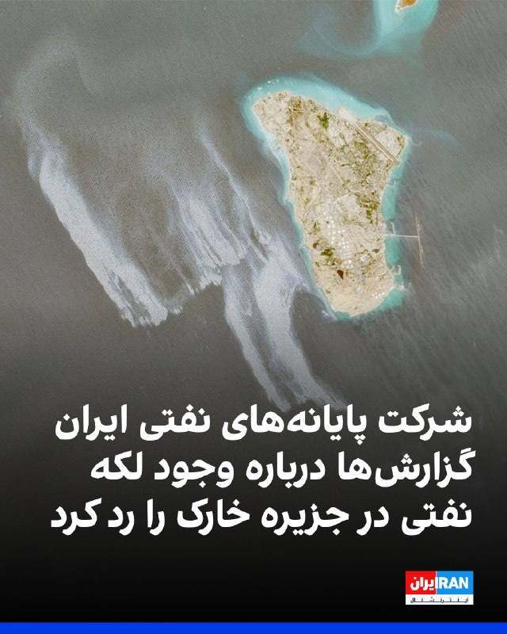

عباس اسدروز، مدیرعامل شرکت پایانه‌های نفتی ایران، گزارش‌ها درباره وجود لکه نفتی در جزیره خارک را رد کرد و گفت پس از انتشار این اخبار، گروه‌های تخصصی کل منطقه را پایش کردند اما هیچ نشتی شناسایی نشد.

او افزود: هیچ‌گونه نشتی در زیرساخت‌ها، مخازن ذخیره‌سازی، سیستم‌های اندازه‌گیری، اسکله‌ها، خطوط لوله این منطقه و کشتی‌های در حال بارگیری وجود ندارد.

آسوشیتدپرس جمعه ۱۸ اردیبهشت گزارش داد لکه‌ای نفتی از بخش غربی جزیره خارک، در حال نشت است.
آمی دنیل، مدیرعامل شرکت اطلاعات دریایی «ویندوارد ای‌آی»، به ای‌پی گفت از روز سه‌شنبه، معادل حدود ۸۰ هزار بشکه نفت از جزیره خارک نشت کرده است.
‌🏁 🇬🇧 IranintlTV

🤖 @VahidOOnLine

## VahidOOnLine — post 239292

  <a href="telegram/content/VahidOOnLine_239292_1778424433.mp4" target="_blank">🎬 Download video</a>

بر اساس ویدیوهای رسیده به ایران‌اینترنشنال، ایرانیان مقیم نروژ یکشنبه ۲۰ اردیبهشت در پی فراخوان شاهزاده رضا پهلوی، علیه اعدام‌های جمهوری اسلامی و قطع اینترنت در ایران، در شهر اسلو تجمع کردند.
‌🏁 🇬🇧 IranintlTV

🤖 @VahidOOnLine

## VahidOOnLine — post 239291

♦️مصطفی طاهری، عضو کمیسیون صنایع مجلس، روز یکشنبه ۲۰ اردیبهشت در گفتگویی تلویزیونی مدعی شد بر اساس پیش‌نویس مطرح‌شده، امکان ایجاد حدود ۱۵ میلیارد دلار درآمد برای کشور وجود دارد.
او با اشاره به اینکه در شرایط عادی درآمد نفتی ایران می‌تواند به حدود ۴۰ میلیارد دلار برسد، گفت این رقم معادل بیش از یک‌سوم درآمد نفتی کشور است و می‌تواند «گشایش قابل‌توجهی» در اقتصاد ایجاد کند.
طاهری همچنین تاکید کرد که اهمیت این درآمد به‌دلیل ارزی بودن آن است و می‌تواند در بهبود وضعیت بازار ارز، کاهش نوسانات و مدیریت عرضه و تقاضا نقش مؤثری داشته باشد.
طاهری افزود، تزریق این منابع ارزی می‌تواند بخشی از مشکلات مربوط به چندنرخی بودن ارز و بی‌ثباتی بازار را کاهش دهد.
‌🇸🇦 Indypersian

🤖 @VahidOOnLine

## VahidOOnLine — post 239290

  <a href="telegram/content/VahidOOnLine_239290_1778424436.mp4" target="_blank">🎬 Download video</a>

گردهمایی ایرانیان ساکن توکیو مقابل وزارت خارجه ژاپن، یکشنبه ۲۰ اردیبهشت
‌🏁 🇬🇧 ManotoTV

🤖 @VahidOOnLine

## VahidOOnLine — post 239289

  <a href="telegram/content/VahidOOnLine_239289_1778424438.mp4" target="_blank">🎬 Download video</a>

شماری از ایرانیان ساکن لندن روز شنبه ۱۰ مه با حضور در تجمعی مقابل دفتر نخست‌وزیر بریتانیا، مخالفت خود را با یهودستیزی اعلام کردند.

شرکت‌کنندگان در این گردهمایی با در دست داشتن پرچم‌های ایران و اسرائیل و پلاکاردهایی در حمایت از همزیستی و مقابله با نفرت‌پراکنی، خواستار ایستادگی در برابر یهودستیزی و افراط‌گرایی شدند.

این تجمع در حالی برگزار شد که در ماه‌های اخیر نگرانی‌ها درباره افزایش موارد یهودستیزی در بریتانیا و برخی کشورهای اروپایی افزایش یافته است.
‌🏁 🇬🇧 ManotoTV

🤖 @VahidOOnLine

## VahidOOnLine — post 239288

  <a href="telegram/content/VahidOOnLine_239288_1778424440.mp4" target="_blank">🎬 Download video</a>

راهپیمایی ایرانیان گوتنبرگ
‌🏁 🇬🇧 ManotoTV

🤖 @VahidOOnLine

## VahidOOnLine — post 239287

  <a href="telegram/content/VahidOOnLine_239287_1778424442.mp4" target="_blank">🎬 Download video</a>

حضور گسترده ایرانیان در تجمع ضد یهودستیزی در برابر دفتر نخست وزیر در لندن، یکشنبه ۲۰ اردیبهشت
‌🏁 🇬🇧 ManotoTV

🤖 @VahidOOnLine

## VahidOOnLine — post 239286

  <a href="telegram/content/VahidOOnLine_239286_1778424444.mp4" target="_blank">🎬 Download video</a>

دفتر رسانه‌ای دولت دبی اعلام کرد دود غلیظ مشاهده‌شده در منطقه الجداف، ناشی از آتش‌سوزی در یک قایق متوقف در خور دبی بوده است.

بر اساس این بیانیه، تیم‌های دفاع مدنی دبی حریق را در مدت ۵۴ دقیقه به طور کامل مهار کردند و عملیات خنک‌سازی محل ادامه دارد.

دفتر رسانه‌ای دولت دبی اعلام کرد در این حادثه هیچ مصدومی گزارش نشده و رنگ سیاه و غلظت دود به دلیل سوختن مواد فایبرگلاس به کار رفته در ساخت قایق بوده است.
‌🏁 🇬🇧 ManotoTV

🤖 @VahidOOnLine

## VahidOOnLine — post 239285

  <a href="telegram/content/VahidOOnLine_239285_1778424445.mp4" target="_blank">🎬 Download video</a>

ویدیوهای رسیده به ایران‌اینترنشنال نشان می‌دهند گروهی از ایرانیان مقیم آلمان، یکشنبه ۲۰ اردیبهشت در اعتراض به اعدام‌های جمهوری اسلامی، در شهر هانوفر تجمع کردند و فریاد «ایستاده‌ایم تا پایان» سردادند.
‌🏁 🇬🇧 IranintlTV

🤖 @VahidOOnLine

## VahidOOnLine — post 239284

  

وزارت خارجه امارات متحده عربی «حملات با پهپاد» به کویت را به‌شدت محکوم کرد و افزود این حملات «تروریستی» علیه کویت نقض حاکمیت این کشور محسوب می‌شود و امنیت و ثبات آن را تهدید می‌کند.

صبح یک‌شنبه کویت از مقابله با پهپادهای پرتاب شده به این کشور خبر داد.
‌🏁 🇬🇧 IranintlTV

🤖 @VahidOOnLine

## VahidOOnLine — post 239283

  <a href="telegram/content/VahidOOnLine_239283_1778424449.mp4" target="_blank">🎬 Download video</a>

ویدیوی ارسال‌شده به ایران‌اینترنشنال نشان می‌دهد یکشنبه ۲۰ اردیبهشت محبوبه رمضانی و رحیمه یوسف‌زاده، مادران پژمان قلی‌پور و نوید بهبودی، معترضان کشته‌شده در آبان ۹۸، با حضور در تجمع ایرانیان در هانوفر آلمان، اعتراض «فرزندان ایران را برای سرنگونی حکومت فاسد آخوندی» خواندند.
‌🏁 🇬🇧 IranintlTV

🤖 @VahidOOnLine

## VahidOOnLine — post 239282

  

♦️وزارت خارجه قطر، روز یکشنبه اعلام کرد شیخ محمد بن عبدالرحمن آل ثانی، نخست‌وزیر و وزیر خارجه این کشور، در تماس تلفنی با فیصل بن فرحان، وزیر خارجه عربستان سعودی، درباره تحولات مربوط به آتش‌بس میان آمریکا و ایران گفتگو کرده است.
بر اساس بیانیه وزارت خارجه قطر، دو طرف همچنین درباره تلاش‌ها برای کاهش تنش‌ها «به گونه‌ای که به تقویت امنیت و ثبات منطقه کمک کند» رایزنی کردند.
شیخ محمد بن عبدالرحمن آل ثانی، پیش از این تماس، با عباس عراقچی درباره بحران منطقه‌ای و انسداد تنگه هرمز گفتگو کرده بود. وزیر امور خارجه قطر در این گفتگو از تهران خواسته بود آبراهه هرمز را به عنوان «اهرم فشار» به کار نگیرد.
‌🇸🇦 Indypersian

🤖 @VahidOOnLine

## VahidOOnLine — post 239281

♦️عبدالناصر همتی، رئیس بانک مرکزی در مصاحبه با صداوسیما گفت که افزایش نرخ دلار با توجه به جنگ منطقی بوده و هم اکنون بازار ارز در آرامش است.
همتی همچنین گفت: «در جلسه امروز به نتایج خوبی برای تامین و تخصیص ارز ۱۴۰۵ رسیدیم.»
‌🇸🇦 Indypersian

🤖 @VahidOOnLine

## mwarmonitor — post 8829

📝این آخرین تلاش‌هایِ دولتِ اِستامر قبل از کله‌پا شدنِ

## mwarmonitor — post 8828

🔴ترامپ: «برای من لازم بود که مداخله نظامی انجام دهم، زیرا با اطمینان می‌دانستم که ایران در مسیر دستیابی به سلاح هسته‌ای قرار دارد.» @mwarmonitor

## mwarmonitor — post 8827

«مصاحبه ترامپ درباره موضوعات مختلف داخلی و خارجی انجام شد که بخش‌های مهم مربوط به ایران را در ادامه برای شما ارائه خواهم کرد.»

## mwarmonitor — post 8826

🔴ترامپ در مصاحبه‌ای با The National Desk اعلام کرد: «می‌توانیم دو هفته دیگر ادامه دهیم و همه اهداف را بزنیم؛ ما اهداف مشخصی داشتیم که ۷۰ درصد آن‌ها را انجام داده‌ایم. اهداف بیشتری هم وجود دارد که می‌توانیم به‌طور احتمالی آن‌ها را هدف قرار دهیم.» او همچنین…

## mwarmonitor — post 8825

🔴شریل اتکیسون: در کجای جنگ هستیم، اگر هنوز مواد هسته‌ای، یعنی اورانیوم غنی‌شده را از آن‌ها نگرفته‌ایم؟ 🔵دونالد ترامپ: خب، ما در مقطعی آن را به دست خواهیم آورد، هر زمان که بخواهیم. ما آنجا را تحت نظر داریم. می‌دانی، من چیزی به نام «نیروی فضایی» ایجاد کردم و…

## mwarmonitor — post 8824

  

ترامپ در سوشال تروث

@mwarmonitor

## mwarmonitor — post 8823

  

✈️هواپیمای سوخت‌رسان هوایی KC-46A Pegasus متعلق به نیروی هوایی آمریکا امروز با دفعات بیشتری بر فراز عراق در حال عملیات بوده است.

✈️در همین حال، یک فروند دیگر KC-135R Stratotanker که از پایگاه هوایی الظفره در ابوظبی پرواز کرده، اکنون در حال فعالیت بر فراز دریای عمان است.

@mwarmonitor

## mwarmonitor — post 8822

🔴شریل اتکیسون: در کجای جنگ هستیم، اگر هنوز مواد هسته‌ای، یعنی اورانیوم غنی‌شده را از آن‌ها نگرفته‌ایم؟
🔵دونالد ترامپ: خب، ما در مقطعی آن را به دست خواهیم آورد، هر زمان که بخواهیم. ما آنجا را تحت نظر داریم. می‌دانی، من چیزی به نام «نیروی فضایی» ایجاد کردم و آن‌ها هر لحظه آنجا را تماشا می‌کنند. اگر کسی وارد شود، آن‌ها می‌توانند نامش، آدرسش و شماره نشانش را به شما بگویند.
نه، ما آنجا را خیلی خوب تحت نظر داریم. اگر کسی به آن مکان نزدیک شود، ما باخبر خواهیم شد و آن‌ها را منفجر خواهیم کرد.

@mwarmonitor

## mwarmonitor — post 8821

  <a href="telegram/content/mwarmonitor_8821_1778424453.mp4" target="_blank">🎬 Download video</a>

🎬 Video

## mwarmonitor — post 8820

Trump is typing ...

## mwarmonitor — post 8819

🔴یک منبع دیپلماتیک پاکستانی به الجزیره: پاسخ ایران بلافاصله پس از دریافت، به طرف آمریکایی منتقل شد.

@mwarmonitor

## mwarmonitor — post 8818

📝در دنیایی که کانال‌های چندصد هزار نفری، اطلاع‌رسانی را به «کاسه گدایی» تبدیل کرده‌اند، مسیر ما متفاوت است.

🔸 اینجا نه خبری از تبلیغاتِ سایت‌های بت و فروشندگان VPN است و نه بساطِ گلریزان به حساب‌های پی‌پال پهن شده؛ اینجا خبری از «کاسبی از جهل» نیست.

🔸تمام آنچه در این فضا منتشر می‌شود، به صورت تک‌نفره، دلی و با هدف رساندن اخبار صحیح به ایرانیان داخل و خارج از کشور است. ما بدون هیچ چشم‌داشتی، بر لبه‌ی حقیقت ایستاده‌ایم تا تفاوت میان «رسانه مستقل» و «دکان‌های مجازی» بیش از پیش آشکار شود.

تعهد ما فقط به حقیقت است، نه به جیب مخاطب.

@mwarmonitor

## mwarmonitor — post 8817

رئیس‌جمهور ترامپ از خطوط قرمز خود عقب‌نشینی نکرده است. او خطوط قرمز خود را حفظ کرده که این نکته مثبتی برای اوست. اما من فکر می‌کنم ما باید فشارهای اقتصادی را حفظ کنیم، محاصره را ادامه دهیم؛ اقتصاد آن‌ها در حال فروپاشی است و آن‌ها نمی‌توانند این حجم از فشار…

## mwarmonitor — post 8816

🔴مارک لوین : «نکته بسیار خوبی است. آن‌ها نمی‌توانند دوباره این کار را انجام دهند. ما ممکن است مجبور شویم ۱۰، ۱۵ یا ۲۰ سال دیگر برگردیم. شما مخالفتی را که در برابر کارهای رئیس‌جمهور (ترامپ) وجود دارد، می‌بینید. من می‌بینم که مخالفت‌ها اینجا در ایالات متحده…

## mwarmonitor — post 8815

🔴مارک لوین: به «زندگی، آزادی و لوین» خوش آمدید. ما اینجا با دوست خوبمان، «ربکا هاینریش»، پژوهشگر ارشد موسسه هادسون و مدیر طرح دفاعی کیستون هستیم. ربکا، ممنون که دوباره به برنامه ما آمدی. خب، ما الان در نقطه‌ای هستیم که فکر می‌کنم همه چیز به دو گزینه ختم می‌شود:…

## mwarmonitor — post 8814

🔴مارک لوین: به «زندگی، آزادی و لوین» خوش آمدید. ما اینجا با دوست خوبمان، «ربکا هاینریش»، پژوهشگر ارشد موسسه هادسون و مدیر طرح دفاعی کیستون هستیم. ربکا، ممنون که دوباره به برنامه ما آمدی. خب، ما الان در نقطه‌ای هستیم که فکر می‌کنم همه چیز به دو گزینه ختم می‌شود: مهار (ایران) از طریق یک توافق، یا نوعی پیروزی؛ جایی که فشار را حفظ کنیم، فشار نظامی، فشار اقتصادی و غیره. تو در حال حاضر این وضعیت را چطور می‌بینی؟

🔵ربکا هاینریش: خب، من در واقع فکر می‌کنم راه سومی هم وجود دارد و آن این است که اساساً فشار را دوباره برقرار کنید، یک عملیات نظامی دیگر انجام دهید و این کار زمینه را برای رسیدن به توافقی که واقعاً کارایی داشته باشد، بیشتر فراهم می‌کند.
پرزیدنت ترامپ در برابر این رژیمِ باقی‌مانده (رژیم ایران) به طرز باورنکردنی صبور بوده است، اما این صبر نتیجه‌ای نداده است. وقتی رئیس‌جمهور می‌گوید «ببینید، ما قرار است آتش‌بس داشته باشیم»، شما همچنان می‌بینید که شبه‌نظامیان سپاه پاسداران (IRGC) به کشتی‌های نیروی دریایی شلیک می‌کنند.
مارک، همانطور که می‌دانی ارتش ما هنوز در منطقه حضور دارد، بنابراین ما به انهدام این قایق‌های کوچک که سعی دارند به نفت‌کش‌ها یا کشتی‌های ما آسیب برسانند، ادامه می‌دهیم. اما می‌دانی، دیگر کافی است. ما آن‌ها را از نظر اقتصادی تحت فشار گذاشته‌ایم؛ آن‌ها به دلیل کارزار فشار اقتصادی پرنسسیپ ترامپ، روزانه صدها میلیون دلار از دست می‌دهند.
فشار نظامی هنوز پابرجاست و اگر پرنسسیپ ترامپ چراغ سبز نشان دهد، عملی خواهد شد. اما من همچنان فکر می‌کنم که ما باید دور دیگری (از حملات) را انجام دهیم. ما می‌دانیم چه اهدافی را هنوز باید در داخل ایران بزنیم. این کار باید در مرحله بعد انجام شود و آن زمان در موقعیت بهتری خواهیم بود تا ایرانی‌ها را وادار کنیم که واقعاً وارد بازی شوند (همکاری کنند).
🔴مارک لوین: خب، فرض کنیم این کار را کردیم و به آن مرحله رسیدیم و آن‌ها گفتند: «بسیار خوب، تسلیم، ما واقعاً می‌خواهیم دوباره با شما صحبت کنیم.» ما چه می‌خواهیم؟ می‌دانیم که «سلاح هسته‌ای نباید باشد»، می‌دانیم که «غنی‌سازی نباید باشد»، می‌دانیم که می‌خواهیم «تمام ذخایر غنی‌شده حذف شود»... دیگر چه می‌خواهیم؟
🔵ربکا هاینریش: ما کنترل «تنگه هرمز» را می‌خواهیم. می‌دانید، پرنسسیپ ترامپ کاملاً حق داشت که عملیات «خشم حماسی» (Epic Fury) را آغاز کند. وقتی می‌بینید منتقدانش می‌آیند و می‌گویند: «اوه خدای من، ایالات متحده برای تهدید ایرانی‌ها علیه تنگه آماده نبود»، این حرف‌ها مزخرف است.
ما همیشه می‌دانستیم که این تنها کاری است که ایرانی‌ها می‌توانند انجام دهند؛ اینکه در تنگه هرمز که بیش از ۲۰ درصد حمل و نقل جهانی از آن می‌گذرد، رعب و وحشت ایجاد کنند. بنابراین ما نمی‌توانیم دیگر هرگز این کارت بازی را به آن‌ها بدهیم.
و البته می‌دانیم تا زمانی که ایرانی‌ها بتوانند در تنگه رعب و وحشت ایجاد کنند... و در ضمن، هنوز ۱۵۰۰ کشتی توسط ایرانی‌ها در تنگه به گروگان گرفته شده‌اند که پرنسسیپ ترامپ می‌خواست با پروژه «آزادی» آن‌ها را آزاد کند. ما آن را متوقف کردیم چون ایرانی‌ها از ما خواستند متوقفش کنیم، که به نظر من این یک اشتباه بود.
اما فکر می‌کنم باید این (قدرت) را از آن‌ها بگیریم. آن‌ها نباید بتوانند نیروهای نیابتی را در سراسر منطقه تامین مالی کنند. ما در واقع با محروم کردن آن‌ها از هرگونه منابع، داریم با این موضوع مقابله می‌کنیم. آن‌ها در حال حاضر به دلیل فشار اقتصادی که در آن هستند، حتی قادر به پرداخت حقوق شبه‌نظامیان خود نیستند.
اما ما نمی‌خواهیم آن‌ها کنترل تنگه را داشته باشند، آن‌ها نمی‌توانند سلاح هسته‌ای داشته باشند و نمی‌توانند برنامه موشک‌های بالستیکی داشته باشند که به عنوان یک سپر عمل کند.شرکای عالی ما و متحدان اسرائیلی‌مان، تا نتوانند دوباره این کار را انجام دهند، اگر لازم باشد ۱۰، ۱۵ یا ۲۰ سال دیگر دوباره برگردیم.»

@mwarmonitor

## mwarmonitor — post 8813

ترامپ در سوشال تروث ویدیو به همراه متن ترجمه‌شده در ادامه، خدمت شما عزیزان در کانال قرار خواهد گرفت. @mwarmonitor

## mwarmonitor — post 8812

  

ترامپ در سوشال تروث
ویدیو به همراه متن ترجمه‌شده در ادامه، خدمت شما عزیزان در کانال قرار خواهد گرفت.

@mwarmonitor

## mwarmonitor — post 8811

  <a href="telegram/content/mwarmonitor_8811_1778424456.mp4" target="_blank">🎬 Download video</a>

🇮🇱سخنگوی ارتش اسرائیل:

🔸همکاری میان اپراتور یک پهپاد و یک افسر در تیپ کفیر در نوار غزه

🔹در یک واکنش سریع، یک پهپاد نیروی هوایی با همکاری تیپ کفیر، فردی را که مظنون به کارگذاری مواد انفجاری در جنوب نوار غزه بود، هدف قرار داد.

🔸نیروی هوایی به‌طور مداوم به پشتیبانی از نیروهای رزمی در جبهه‌های مختلف، در عملیات‌های هجومی و دفاعی ادامه می‌دهد.

@mwarmonitor

## mwarmonitor — post 8810

امروز باید منتظر توئیت ترامپ در مورد جواب ایران به طرح پیشنهادی آمریکا باشیم

## pm_afshaa — post 90483

🔴ترامپ:ما نمی‌توانیم اجازه دهیم ایران سلاح هسته‌ای داشته باشد چون آن‌ها دیوانه هستند.

اگر من توافق هسته‌ای اوباما با ایران را لغو نکرده بودم، آن‌ها اکنون آن را داشتند و ممکن بود از آن علیه اسرائیل و خاورمیانه و شاید فراتر استفاده کنن

💧 Rainbet.com the #1 Non-KYC Crypto Casino & Sportsbook @rainbetcom

😁 @Pm_Afshaa

## pm_afshaa — post 90482

🔴ترامپ: هنوز اهداف دیگری در ایران داریم که همچنان احتمال هدف قرار دادنشان بسیار بالاست

💧 Rainbet.com the #1 Non-KYC Crypto Casino & Sportsbook @rainbetcom

😁 @Pm_Afshaa

## pm_afshaa — post 90481

🔴ترامپ: می‌توانیم تا دو هفته دیگر علیه ایران حرکت کنیم و به هر یک از اهداف مشخص‌شده ضربه بزنیم

💧 Rainbet.com the #1 Non-KYC Crypto Casino & Sportsbook @rainbetcom

😁 @Pm_Afshaa

## pm_afshaa — post 90480

🔴ترامپ درباره ایران:ما در نهایت اورانیوم غنی‌شده ایران را به دست خواهیم آورد. هر چه بخواهیم ما آن را تحت نظر داریم. من چیزی به نام نیروی فضایی ایجاد کردم و آن‌ها در حال نظارت بر آن هستند. اگر کسی وارد شود، می‌توانند نام، آدرس و شماره نشان او را به شما بگویند اگر کسی به آن مکان نزدیک شود، ما از آن مطلع خواهیم شد و او را منفجر خواهیم کرد

💧 Rainbet.com the #1 Non-KYC Crypto Casino & Sportsbook @rainbetcom

😁 @Pm_Afshaa

## pm_afshaa — post 90479

  <a href="telegram/content/pm_afshaa_90479_1778424457.webm" target="_blank">🎬 Download video</a>

🔴رئیس انرژی: پارسال 9 هزار مگاوات کمبود برق داشتیم و امسال 24 هزارمگاوات؛ مردم برای قطعی های برق در هر 7 روز هفته خودشونو آماده کنن.

💧 Rainbet.com the #1 Non-KYC Crypto Casino & Sportsbook @rainbetcom

😁 @Pm_Afshaa

## pm_afshaa — post 90478

  <a href="telegram/content/pm_afshaa_90478_1778424458.webm" target="_blank">🎬 Download video</a>

🔴ایسنا: تمرکز اصلی پاسخ جمهوری اسلامی به طرح پیشنهادی آمریکا بر «خاتمه جنگ و امنیت دریانوردی در خلیج فارس و تنگه هرمزه.»

💧 Rainbet.com the #1 Non-KYC Crypto Casino & Sportsbook @rainbetcom

😁 @Pm_Afshaa

## pm_afshaa — post 90477

  <a href="telegram/content/pm_afshaa_90477_1778424459.webm" target="_blank">🎬 Download video</a>

🔴صداوسیما: پاسخی که به آمریکا داده شده همچنان مطابق با مواضع قبلی ماست، از جمله آمادگی برای ادامه آتش‌بس در ازای بازگشایی متقابل تنگه هرمز و پیشبرد مذاکرات متمرکز بر پایان دادن به جنگ در منطقه.

💧 Rainbet.com the #1 Non-KYC Crypto Casino & Sportsbook @rainbetcom

😁 @Pm_Afshaa

## pm_afshaa — post 90476

  <a href="telegram/content/pm_afshaa_90476_1778424459.webm" target="_blank">🎬 Download video</a>

🔴حمید رسایی، نماینده مجلس: تمام تلاشم رو میکنم تا اینترنت بین الملل وصل نشه.

💧 Rainbet.com the #1 Non-KYC Crypto Casino & Sportsbook @rainbetcom

😁 @Pm_Afshaa

## pm_afshaa — post 90475

  <a href="telegram/content/pm_afshaa_90475_1778424460.webm" target="_blank">🎬 Download video</a>

ایرنا:پاسخ جمهوری اسلامی به آخرین متن پیشنهادی آمریکا برای خاتمه جنگ، امروز به میانجی پاکستانی ارسال شد 
💧 Rainbet.com the #1 Non-KYC Crypto Casino & Sportsbook @rainbetcom 
😁 @Pm_Afshaa

## pm_afshaa — post 90474

  <a href="telegram/content/pm_afshaa_90474_1778424461.webm" target="_blank">🎬 Download video</a>

ایرنا:پاسخ جمهوری اسلامی به آخرین متن پیشنهادی آمریکا برای خاتمه جنگ، امروز به میانجی پاکستانی ارسال شد 
💧 Rainbet.com the #1 Non-KYC Crypto Casino & Sportsbook @rainbetcom 
😁 @Pm_Afshaa

## pm_afshaa — post 90473

ایرنا:پاسخ جمهوری اسلامی به آخرین متن پیشنهادی آمریکا برای خاتمه جنگ، امروز به میانجی پاکستانی ارسال شد

💧 Rainbet.com the #1 Non-KYC Crypto Casino & Sportsbook @rainbetcom

😁 @Pm_Afshaa

## pm_afshaa — post 90472

🔴ویتکاف و کوشنر قراره به مسکو برن

💧 Rainbet.com the #1 Non-KYC Crypto Casino & Sportsbook @rainbetcom

😁 @Pm_Afshaa

## pm_afshaa — post 90471

  <a href="telegram/content/pm_afshaa_90471_1778424461.webm" target="_blank">🎬 Download video</a>

🔴وزارت دفاع امارات: امروز دوتا موشک که از سمت ایران پرتاب شده بود رو رهگیری کردیم. 
💧 Rainbet.com the #1 Non-KYC Crypto Casino & Sportsbook @rainbetcom 
😁 @Pm_Afshaa

## pm_afshaa — post 90470

سخنگوی کمیسیون امنیت ملی: از امروز خویشتن‌داری ما تمام شد

💧 Rainbet.com the #1 Non-KYC Crypto Casino & Sportsbook @rainbetcom

😁 @Pm_Afshaa

## pm_afshaa — post 90469

  <a href="telegram/content/pm_afshaa_90469_1778424462.webm" target="_blank">🎬 Download video</a>

🔴تسنیم: از اونجایی که کابل‌های فیبر نوری حیاتی از کف تنگه هرمز عبور میکنه، ما باید هزینه سالانه از کمپانی‌های بزرگ بگیریم و آمازون، مایکروسافت و متا رو موظف کنیم تحت قوانین ایران کار کنن!

💧 Rainbet.com the #1 Non-KYC Crypto Casino & Sportsbook @rainbetcom

😁 @Pm_Afshaa

## pm_afshaa — post 90468

  <a href="telegram/content/pm_afshaa_90468_1778424463.webm" target="_blank">🎬 Download video</a>

🔴وزارت دفاع امارات:
امروز دوتا موشک که از سمت ایران پرتاب شده بود رو رهگیری کردیم.

💧 Rainbet.com the #1 Non-KYC Crypto Casino & Sportsbook @rainbetcom

😁 @Pm_Afshaa

## pm_afshaa — post 90467

  <a href="telegram/content/pm_afshaa_90467_1778424464.webm" target="_blank">🎬 Download video</a>

🔴کویت: بامداد امروز چند تا پهپاد متخاصم (دشمن) رو تو حریم هوایی خودمون رصد کردیم و باهاشون برخورد شد و منهدم شدن.

💧 Rainbet.com the #1 Non-KYC Crypto Casino & Sportsbook @rainbetcom

😁 @Pm_Afshaa

## pm_afshaa — post 90465

  <a href="telegram/content/pm_afshaa_90465_1778424464.webm" target="_blank">🎬 Download video</a>

‏
🔴فارس: علی عبداللهی، رئیس ستاد کل نیروهای مسلح، با مجتبی خامنه‌ای دیدار کرد.

💧 Rainbet.com the #1 Non-KYC Crypto Casino & Sportsbook @rainbetcom

😁 @Pm_Afshaa

## pm_afshaa — post 90464

  <a href="telegram/content/pm_afshaa_90464_1778424465.webm" target="_blank">🎬 Download video</a>

🔴پزشکیان: خاموش کردن یک چراغ مثل شلیک تیر به سمت دشمنه.

💧 Rainbet.com the #1 Non-KYC Crypto Casino & Sportsbook @rainbetcom

😁 @Pm_Afshaa

## pm_afshaa — post 90463

  <a href="telegram/content/pm_afshaa_90463_1778424466.webm" target="_blank">🎬 Download video</a>

🔴آرش نجفی، رییس کمیسیون انرژی اتاق بازرگانی: امسال به طور مستمر روزانه دو ساعت قطعی برق خانگی، تجاری و اداری خواهیم داشت!

💧 Rainbet.com the #1 Non-KYC Crypto Casino & Sportsbook @rainbetcom

😁 @Pm_Afshaa

## DEJradio — post 4547

  

🔸
⭕️ خبرگزاری فارس:
مجتبی خامنه‌ای به نیروهای مسلح دستور ادامه عملیات را صادر کرده است

خبرگزاری فارس وابسته به سـ.ـپاه یکشنبه ۲۰ اردیبهشت گزارش داد، مجتبی خامنه‌ای، در دیدار با پاسدار علی عبداللهی، فرمانده قرارگاه مرکزی خاتم‌الانبیا، «دستور جدیدی برای ادامه عملیات و مقابله قاطعانه با دشمنان» داده است.
این خبرگزاری افزود، علی عبداللهی، دستورهای جدید را در دیدار با مجتبی خامنه‌ای دریافت کرده است.
طبق این گزارش عبداللهی در این دیدار، مجتبی خامنه‌ای را در جریان «میزان آمادگی نیروهای مسلح» قرار داده است.
زمان برگزاری این دیدار را مشخص نیست، اما عبداللهی گفته: «نیروهای مسلح برای مقابله با هرگونه اقدام آمریکا و اسرائیل در آمادگی کامل قرار دارند.»

#موشتبا #تنگه_هرمز #جنگ

@DEJradio

## DEJradio — post 4546

  <a href="telegram/content/DEJradio_4546_1778424467.mp4" target="_blank">🎬 Download video</a>

🎥📢“نتانیاهو و ترامپ مادرانی را که خامنه‌ای داغدارشان کرده بود خوشحال کردن

#نتانیاهو #ترامپ #مادران_داغدار
@DEJradio

## DEJradio — post 4545

  

📝
⭕️ یادداشت؛
ترامپ سیاست را با عینک تجارت می‌بیند

پرسشی که شاید ذهن بسیاری را درگیر کرده باشد این است که آیا ارتش آمریکا نمی‌تواند مانع اقدامات ایذایی سـ.ـپاه در تنگه هرمز شود؟
از نظر نظامی و تجهیزاتی، فاصله میان ارتش آمریکا و سـ.ـپاه پاسداران بسیار زیاد است و عملاً آمریکا توان مقابله با اقدامات ایذایی سـ.ـپاه را دارد؛ هرچند این مسئله ممکن است نسبت به برخی عملیات‌های دیگر پیچیدگی‌های متفاوتی داشته باشد، اما در نهایت چالش بزرگی برای آمریکا محسوب نمی‌شود.
اما پرسش اصلی اینجاست که چرا ترامپ عجله‌ای برای پایان دادن سریع به این وضعیت ندارد؟ او به‌عنوان یک تاجر، ممکن است از تهدید مسدود شدن تنگه هرمز به‌عنوان ابزاری برای فشار اقتصادی و سیاسی بر اروپا و چین استفاده کند.
اروپایی که از نگاه ترامپ حاضر نیست هزینه کافی برای تأمین امنیت خود بپردازد و در ناتو نیز گاه ساز مخالف می‌زند، باری اضافی بر دوش آمریکا محسوب می‌شود. اکنون نیز با اختلال در جریان انتقال نفت از تنگه هرمز، اروپا تحت فشار اقتصادی سنگینی قرار گرفته است و ترامپ امیدوار است این فشار باعث شود کشورهای اروپایی سهم بیشتری در هزینه‌های امنیتی پرداخت کنند و حتی ناوگان دریایی خود را به منطقه اعزام نمایند؛ یعنی کشورهایی که تا دیروز منتقد مقابله نظامی با جمهوری اسلامی بودند، ناچار شوند در این تقابل نقش فعال‌تری ایفا کنند.
از سوی دیگر، چین به‌عنوان بزرگ‌ترین خریدار نفت ارزان ایران و کشوری که نزدیک به نیمی از نفت مصرفی خود را از خلیج فارس تأمین می‌کند نیز تحت فشار قرار می‌گیرد؛ چراکه هرگونه محدودیت در تنگه هرمز می‌تواند صادرات نفت به چین را مختل کند. همزمان، ترامپ نیز با محاصره دریایی جمهوری اسلامی ، تلاش می‌کند مانع انتقال نفت جمهوری اسلامی به چین شود.
ترامپ می‌خواهد همه هزینه‌های امنیت و منافع خود را بپردازند. حتی کره جنوبی و ژاپن نیز از نگاه او دور نمانده‌اند؛ شاید اولویت نخستش نباشند، اما قطعاً فراموششان نکرده است. او در نهایت با ذهنیت یک تاجر به سیاست نگاه می‌کند.

#ترامپ #خاورمیانه
@DEJradio

## DEJradio — post 4544

  <a href="telegram/content/DEJradio_4544_1778424471.webm" target="_blank">🎬 Download video</a>

🚨
⭕️ خبرگزاری جمهوری اسلامی، ایرنا، مدعی شد پاسخ تهران به آخرین متن پیشنهادی آمریکا برای پایان جنگ، از طریق میانجی پاکستانی ارسال شده است. بنا بر این گزارش، پاسخ جمهوری اسلامی روز یکشنبه به طرف آمریکایی منتقل شده است.

#مذاکرات #پاکستان #جنگ
@DEJradio

## DEJradio — post 4543

  <a href="telegram/content/DEJradio_4543_1778424471.mp4" target="_blank">🎬 Download video</a>

⭕️
🗣 یکی از شهروندان از تهران با ارسال ویدیویی نوشت، «از شهرستان‌ها آدم به تهران می‌آورند برای تجمعات، اینجا پر است از ماشین‌هایی با پلاک شهرهای اطراف و یا شهرستان‌های دیگر. غریبه‌هایی که سعی می‌کنند، چشم از تو بدزدند، وقتی که آن‌ها را کنار ماشین‌های مزین شده به پرچم و عکس آقای شهیدشان و آقای جدیدشان می‌بینی.
این ماشین یکی از آن‌هاست. خراب و دود کرده کنار یکی از خیابان‌های شمال شهر ایستاده بود. زن و یکی از دخترها داخل سوپر مارکتی شدند که مردم محل هم دیگر به سختی توان خرید از آن را دارند. آن‌ها پول خوراکی که تهیه کرد بودند با کارت سبز رنگی که مشخص بود؛ کارت بانکی نیست و شبیه کارت هدیه بود، دادند و کنار پیاده رو، روی زمین نشستند و صبحانه خوردند. در میان نگاه های مردمی که از کنارشان می گذشتند؛ بعضی با نفرت و برخی با ترحم.»

#تجمعات_خیابانی
@DEJradio

## DEJradio — post 4542

  

🔸
⭕️ وبسایت «وای نت» در تحلیلی به قلم سور پلاکر، سردبیر ارشد اقتصادی این روزنامه، با مقایسه وضعیت کنونی جمهوری اسلامی با روزهای آخر آلمان نازی، هشدار داد اگر ترامپ بخواهد با صبر و حوصله منتظر بماند تا حاکمان ایران از تعصب ایدئولوژیک خود دست بردارند، ممکن است روزی برسد که بفهمد کار بیهوده‌ای کرده است؛ تاریخ اروپا در ۸۱ سال پیش نشان داد دیکتاتوری آدولف هیتلر تا وقتی شکست به آن تحمیل نشد، جنگ را ادامه داد.
در این یادداشت آمده «در هفته‌های اخیر، ترامپ توافق‌هایی معقول به حکومت ایران پیشنهاد کرده است تا به جنگ پایان دهد. تندروها در میان رهبران حکومت، با وجود ضربه‌هایی که ایرانیان متحمل شده‌اند و در جنگ با ایالات متحده و اسرائیل همچنان متحمل خواهند شد، این پیشنهادها را با تمسخر رد کرده‌اند.»
این تحلیل با اشاره به اینکه اکثریت آلمانی‌ها با وجودی که ایمانشان را به هیتلر و حکومت نازی‌ها از دست داده بودند، شورش نکردند و خودشان نازیسم را سرنگون نکردند، گفت حکومت آلمان نازی تا آخرین لحظه و تا زمانی که سربازان متفقین با زور بر درهای مقرهایشان کوبیدند، به سرکوب ادامه داد.

#جمهوری_اسلامی #هیتلر
@DEJradio

## DEJradio — post 4541

  <a href="telegram/content/DEJradio_4541_1778424475.mp4" target="_blank">🎬 Download video</a>

🎥
👑 ۱۹ دی‌ماه ۱۴۰۴؛ تیراندازی بـ.ـسیجی‌ها به مردم از پشت سر
وقتی مردم برای نجات جان خود در کوچه‌ها پنهان شده‌ بودند نیروهای سرکوبگر از پشت سر به آنها تیراندازی کردند.

#سرکوبگران #دیماه
@DEJradio

## DEJradio — post 4540

  <a href="telegram/content/DEJradio_4540_1778424477.webm" target="_blank">🎬 Download video</a>

⭕️
🔺 چند هفته پس از پایان جنگ ۴۰ روزه، بازار کار ایران با یکی از شدیدترین موج‌های بیکاری و تعدیل نیرو روبرو شده است. بسیاری از کارخانجات تعطیل شده‌اند و هزاران نفر شغل‌شان را از دست داده‌اند.
خبرگزاری فارس وابسته به سـ.ـپاه با اشاره به تعطیلی کارخانه‌ها و تولیدی‌ها به نقل از یک تولیدگر نوشته «اوضاع افتضاح است.»
این خبرگزاری به نقل از یک «تحلیلگر اقتصادی» می‌نویسد، «حتی اگر درگیر جنگ هم نبودیم، در دنیای امروز، اقتصاد کشور باید با فرض یک جنگ ۱۰ ساله بازمعماری شود. دولت باید با مردم حرف بزند و به سرعت وضعیتی که تصمیم‌ها را موقت، سرمایه‌گذاری‌ها را معلق و زنجیره‌های تولید را شکننده نگه داشت، پایان یابد.»
به نوشته فارس «بذر یک اقتصاد مقاوم در پذیرش یک افق هرچند دشوار کاشته می‌شود. فرض جنگی ۱۰ ساله، هرچند بی‌رحم است اما دست‌کم نقشه‌راه دارد؛ همان نقشه‌ای که می‌تواند چراغ کارخانه‌ای را پس‌از ماه‌ها خاموشی، دوباره روشن کند.»

#بیکاری #فقر
@DEJradio

## DEJradio — post 4539

  <a href="telegram/content/DEJradio_4539_1778424478.webm" target="_blank">🎬 Download video</a>

📢
🔺 “دی‌ماه از فاصله نسبتاً نزدیک به سینه و دنده‌های من ساچمه اصابت کرد، صدمه شدید دیدم، هنوز وقتی نفس که میکشم تو قفسه سینه‌ام درد میکنم، اما بدتر اینجاست که شغلم رو از دست دادم بیکارم

#پیام_دریافتی #دیماه
@DEJradio

## DEJradio — post 4538

  <a href="telegram/content/DEJradio_4538_1778424478.mp4" target="_blank">🎬 Download video</a>

🚨
🔸 حسن حسن‌زاده؛ سرکوبگری با ایده‌‌هایی برای حجاب اجباری

#شناسایی_سرکوبگران #حجاب_اجباری
@DEJradio

## DEJradio — post 4537

  <a href="telegram/content/DEJradio_4537_1778424481.webm" target="_blank">🎬 Download video</a>

🔺🎥 پشتیبانی از شاهزاده رضا پهلوی و اعتراض به قطعی اینترنت در ایران

#قطعی_اینترنت #شاهزاده_رضا_پهلوی
@DEJradio

## mamlekate — post 103496

  <a href="telegram/content/mamlekate_103496_1778424482.mp4" target="_blank">🎬 Download video</a>

دوستانی که دنبال کون آخوند نگران بودند ایران سوریه بشه، سوریه با سوییفت، ویزا و مستر به جهان وصل شد

@mamlekate

## mamlekate — post 103495

📝 ساخت «پایگاهی مخفی» توسط اسرائیل در صحرای عراق

وال‌استریت ژورنال می‌گوید، اسرائیل پیش از حمله به ایران پایگاهی مخفی در عراق ساخته بود که نقشی کلیدی در پشتیبانی از عملیات هوایی علیه ایران داشته است. اسرائیل حتی برای حفاظت از این پایگاه، به نیروهای عراقی حمله کرده است.

@mamlekate

## mamlekate — post 103494

📝 امارات متحده عربی: دو پهپاد پرتاب شده از ایران را در روز یکشنبه رهگیری کردیم

وزارت دفاع امارات متحده عربی اعلام کرد که روز یکشنبه، دو پهپاد پرتاب شده از ایران را رهگیری کرده است. در روزهای گذشته امارات متحده عربی چندین بار هدف موشک ها و پهپادهای پرتاب شده از سوی جمهوری اسلامی قرار گرفت.

@mamlekate

## mamlekate — post 103492

  <a href="telegram/content/mamlekate_103492_1778424484.mp4" target="_blank">🎬 Download video</a>

در جریان سومین ماه قطعی اینترنت در داخل ایران، یک ایرانی در خارج، تست آزمایش سرعت اینترنت خود را منتشر کرد. گفته شده این ایرانی باید سریع‌ترین اینترنت خانگی دنیا رو داشته باشه.

@mamlekate

## mamlekate — post 103491

  

توضیحی تکراری: تبلیغاتی که توی تلگرام نمایش داده میشن، بصورت اتوماتیک توسط تلگرام نمایش داده میشن. ادمین کانال‌ها، نقشی توی نمایش تبلیغات تلگرام ندارند. توی توضیحات پین کانال و چندین کوییز و هشدار سعی کردم این مساله رو آموزش بدم. اما هنوز متاسفانه قربانی داریم.

تماس با افرادی که نمی‌شناسین دو ریسک داره: یکی ریسک از دست دادن پولتون. دومین ریسک هم مربوط به اطلاعات شماست. مراقب افشای اطلاعات خودتون به این مافیاهای شیاد باشید.

مملکته ارتباطی با فروش وی‌پی‌ان، کانفیگ، استارلینک و اخیرا سیم‌کارت سفید یا هر تبلیغ عمومی یا مارکتینگ‌های دایرکتی دیگه نداشته، نداره و نخواهد داشت. درآمد مملکته از حمایت‌های مالی چند نفر از گل‌های گل کانال (حدود ۲۰۰ دلار در ماه) + گنج قناعته.

@mamlekate

## mamlekate — post 103490

❗️ بندرعباس ۲۰ اردیبهشت ساعت ۱۲:۰۰ هواپیمای مسافری بلند شد بعد ۱۵ دقیقه بعد صدای ۲ انفجار شدید از سمت پایگاه هوایی و فرودگاه اومد.

❗️ توی قشم هم احساس شد

📝 همین الان باز داره صدای هواپیما داره میاد و خبری نیست. مهمات عمل نکرده بوده احتمالا. ما میدون تره و بار بودیم دقیقا اون دست پایگاه هوایی

@mamlekate

## mamlekate — post 103489

📝 وای‌نت: روزهای پایانی آلمان نازی هشداری برای ترامپ در قبال جمهوری اسلامی است

وب‌سایت وای‌نت در یادداشتی تحلیلی به قلم «سور پلوکر» نوشت تجربه فروپاشی آلمان نازی در سال ۱۹۴۵ می‌تواند هشداری برای دونالد ترامپ باشد؛ هشداری درباره حکومت‌هایی که حتی در آستانه شکست نیز حاضر به عقب‌نشینی نیستند و تا زمانی که شکست به آن‌ها تحمیل نشود، به جنگ ادامه می دهند.

@mamlekate

## mamlekate — post 103488

📝 اذعان وزارت ارتباطات به «شوک اقتصادی» قطع سراسری اینترنت

وزارت ارتباطات می‌گوید بخش ارتباطات و فناوری اطلاعات در جریان جنگ اخیر ۳۳۵ میلیون دلار خسارت مستقیم دیده است؛ عددی که فقط خسارت زیرساختی جنگ است و زیان ناشی از تصمیم‌های مربوط به قطع اینترنت را شامل نمی‌شود.

@mamlekate

## mamlekate — post 103487

  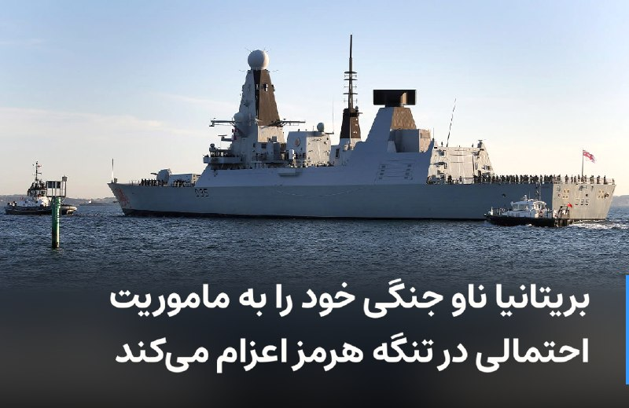

📝 بریتانیا ناو جنگی خود را به ماموریت احتمالی در تنگه هرمز اعزام می‌کند

وزارت دفاع بریتانیا اعلام کرد ناو جنگی اچ‌ام‌اس دراگون برای پیوستن به ماموریت احتمالی حفاظت از کشتیرانی در تنگه هرمز به خاورمیانه اعزام می‌شود. بر اساس این اعلام، این ناو نیروی دریایی سلطنتی به منطقه اعزام شده است تا آماده پیوستن به ابتکار مشترک بریتانیا و فرانسه باشد.

@mamlekate

## VahidOnline — post 75377

  

خبرگزاری ایرنا، روز یکشنبه ۲۰ اردیبهشت ۱۴۰۵گزارش داد پاسخ تهران به آخرین طرح پیشنهادی ایالات متحده برای رسیدن به توافق بر سر پایان جنگ، برای پاکستان به عنوان میانجی مذاکرات ارسال شده است.

ایرنا بدون اشاره به جزئیات بیشتر نوشت: «بر اساس طرح پیشنهادی، در این مرحله مذاکرات متمرکز بر موضوع خاتمه جنگ در منطقه خواهد بود.»

وب‌سایت اکسیوس و خبرگزاری رویترز، چهارشنبه هفته گذشته گزارش دادند که واشنگتن و تهران به یک «یادداشت تفاهم یک‌صفحه‌ای» برای پایان دادن به جنگ نزدیک شده‌اند.

رویترز نوشته بود در این تفاهم‌نامه حتی به تعلیق فعالیت هسته‌ای ایران یا بازگشایی تنگه هرمز که از سوی سپاه پاسداران بسته شده، اشاره‌ای نشده است.

در مقابل، روزنامه وال‌استریت ژورنال گزارش داده بود که در طرح پیشنهادی آمریکا، تهران باید ثابت کند که به‌دنبال سلاح اتمی نیست، تاسیسات فردو، نطنز و اصفهان را برچیند، فعالیت زیرزمینی هسته‌ای را متوقف کند و همچنین بپذیرد غنی‌سازی را تا ۲۰ سال متوقف کند.

رییس‌جمهور و وزیر خارجه آمریکا روز جمعه گفته بودند جمهوری اسلامی تا پایان همان روز قرار است به پیشنهاد ایالات متحده پاسخ دهد.
@VahidHeadline
ولی جمهوری اسلامی به جای جمعه، روز بسته شدن بازارها، صبر کرد یکشنبه پاسخ داد که ساعت ۸ شبش به وقت شرق آمریکا بازارهای مالی هفته کاری رو آغاز می‌کنند.
📡 @VahidOnline

## VahidOnline — post 75376

  

وزارت دفاع امارات متحده عربی روز یکشنبه ۲۰ اردیبهشت اعلام کرد که سامانه‌های پدافند هوایی این کشور با موفقیت دو پهپاد پرتاب شده از «ایران» را منهدم کردند.

این وزارتخانه تاکید کرده است که از زمان ««شروع حملات آشکار ایران، پدافند هوایی امارات متحده عربی در مجموع ۵۵۱ موشک بالستیک، ۲۹ موشک کروز و ۲۲۶۵ پهپاد را منهدم کرده است.»
وزارت دفاع امارات همچنین گزارش داده است که از زمان شروع حملات آشکار ایران، تعداد کل جانباختگان نظامی به ۳ نفر رسیده و تلفات غیرنظامی هم ۱۰ نفر از ملیت‌های پاکستانی، نپالی، بنگلادشی، فلسطینی، هندی و مصری است.
@VahidOOnLine

📡 @VahidOnline

## VahidOnline — post 75375

  

رسانه‌های جمهوری اسلامی گفته‌اند علی عبداللهی، فرمانده قرارگاه مرکزی خاتم‌الانبیا، با مجتبی خامنه‌ای دیدار کرده و گزارشی از آمادگی نیروهای مسلح، از جمله ارتش، سپاه، نیروی انتظامی، نهادهای امنیتی، مرزبانی، وزارت دفاع و بسیج ارائه داده است.

بر اساس این گزارش‌ها، عبداللهی گفته نیروهای مسلح از نظر روحیه رزمی، آمادگی دفاعی و هجومی، طرح‌های راهبردی و تجهیزات لازم برای مقابله با «دشمنان» در سطح بالایی از آمادگی قرار دارند.

این رسانه‌ها همچنین نوشتند مجتبی خامنه‌ای در این دیدار تدابیر تازه‌ای برای ادامه اقدامات و مقابله با دشمنان ابلاغ کرده است. با وجود انتشار متن این خبر، رسانه‌های جمهوری اسلامی تصویری از این دیدار منتشر نکردند.
@VahidOOnLine

📡 @VahidOnline

## VahidOnline — post 75374

  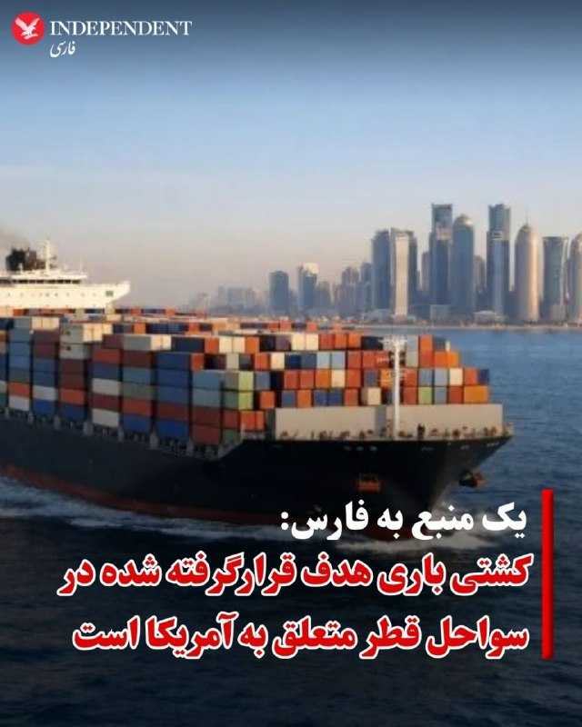

خبرگزاری فارس، وابسته به سپاه پاسداران درباره کشتی باری هدف ‌قرارگرفته شده در نزدیکی سواحل قطر، به نقل از منبعی که نامش را فاش نکرد، گزارش داد این کشتی با پرچم آمریکا تردد می‌کرده و متعلق به ایالات متحده بوده است.

سازمان «عملیات تجارت دریایی بریتانیا» (UKMTO) صبح یکشنبه گزارش داد که یک پرتابه به سمت یک کشتی باری  در ۲۳ مایل دریایی (۳۷ کیلومتری) شمال شرقی دوحه شلیک شده است.
بنا بر این گزارش یک آتش‌سوزی کوچک در این کشتی رخ داده که خاموش شده است و تلفات جانی نیز نداشته است.

این خبر در حالی اعلام شده است که مارکو روبیو، وزیر امور خارجه آمریکا روز شنبه با محمد بن عبدالرحمن آل ثانی، نخست‌وزیر و وزیر امور خارجه قطر، در میامی دیدار و گفتگو کرد و شراکت دو کشور را برای بازدارندگی در برابر تهدیدات و تقویت ثبات در خاورمیانه حائز اهمیت خواند.
@VahidOOnLine

📡 @VahidOnline

## VahidOnline — post 75373

  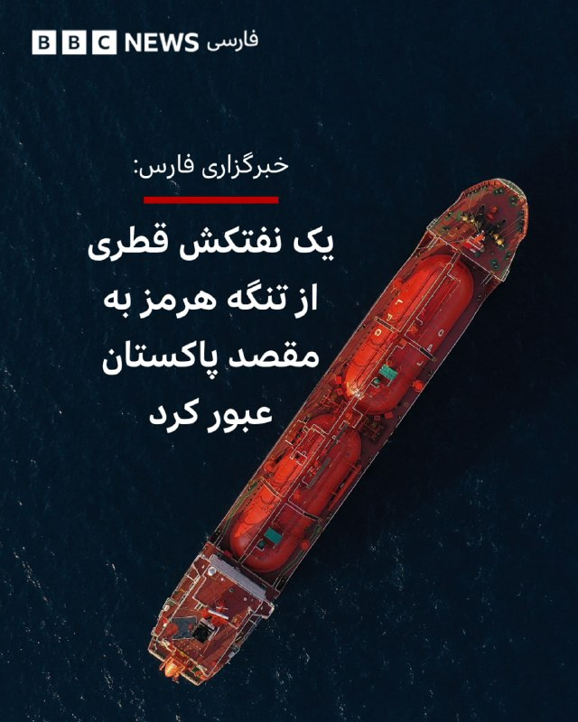

‌ ‌ ‌ ‌
خبرگزاری فارس می‌گوید «یک نفتکش حمل‌کننده گاز طبیعی مایع متعلق به قطر به نام الخریطیات» با «اجازه ایران» از تنگه هرمز عبور کرده است.

بنابر این گزارش، این نفتکش «روز گذشته در دهانهٔ تنگهٔ هرمز دیده شده بود و پس از آن سامانه موقعیت‌یاب خودکار خود را خاموش کرد.»

به گفته فارس، «این نفتکش که مقصدش پاکستان است، نخستین نفتکش غیرمرتبط با ایران است که از نیروی دریایی سپاه اجازه عبور از تنگه هرمز دریافت کرده است.»
@VahidHeadline

📡 @VahidOnline

## VahidOnline — post 75372

  

رسانه‌های داخل ایران روز یک‌شنبه به نقل از مدیرعامل شرکت پایانه‌های نفتی ایران هر گونه آلودگی نفتی ناشی از تأسیسات جزیره خارک را تکذیب کردند.

او گفت: «به محض انتشار این اخبار، گروه‌های متخصص اچ‌اس‌ئی و اداره شیمیایی و آزمایشگاه، همه منطقه را پایش کردند اما حتی کوچک‌ترین موردی یافت نشد.»

خبرگزاری رویترز گزارش داده بود که تصاویر ماهواره‌ای ثبت‌شده در روزهای ۱۶ تا ۱۸ اردیبهشت، لکه‌ای بزرگ را در آب‌های اطراف جزیره خارک، مهم‌ترین پایانه صادرات نفت ایران، نشان می‌دهد که به گفته کارشناسان با «نشت نفت» سازگار است.

بر اساس این گزارش، لکه‌ای خاکستری و سفیدرنگ در غرب جزیره خارک دیده شده که به گفته یک پژوهشگر «رصدخانه منازعه و محیط زیست»، مساحتی حدود ۴۵ کیلومتر مربع را پوشش می‌دهد.

به گفته عباس اسدروز، «طبق اعلام مرکز بین‌المللی «میمک» به نمایندگی از سازمان بین‌المللی دریانوردی هیچ‌گونه نشتی در زیرساخت‌ها، مخازن ذخیره‌سازی، سیستم‌های اندازه‌گیری، اسکله‌ها، خطوط لوله این منطقه و کشتی‌های در حال بارگیری وجود ندارد.»

اسدروز توضیح نداده است که لکه موجود در تصاویر نشان‌دهنده چه چیزی است.
@VahidHeadline

📡 @VahidOnline

## VahidOnline — post 75371

  

به گزارش «وال‌استریت ژورنال»، اسرائیل در اقدامی بی‌سابقه یک پایگاه نظامی مخفی در بیابان‌های عراق ایجاد کرده است تا از این طریق عملیات هوایی گسترده خود علیه ایران را پشتیبانی کند.

این پایگاه که پیش از آغاز درگیری‌ها و با آگاهی ایالات متحده احداث شده، میزبان نیروهای ویژه اسرائیل و یگان‌های امداد و نجات برای خلبانانی بود که ممکن بود در جریان حملات سرنگون شوند.
طبق گفته مقام‌های آگاه، استقرار این مرکز لجستیک در فاصله ۱۶۰۰ کیلومتری از اسرائیل، نقش کلیدی در مدیریت هزاران حمله هوایی تل‌آویو علیه اهداف نظامی رژیم جمهوری اسلامی در خاک ایران طی هفته‌های اخیر ایفا کرده است.

این گزارش فاش می‌کند که مخفیگاه مذکور در اوایل ماه مارس و پس از گزارش یک چوپان محلی درباره تحرکات مشکوک هلیکوپترها، تا آستانه لو رفتن پیش رفت. در پی این گزارش، ارتش عراق نیروهایی را برای بازرسی به منطقه اعزام کرد، اما نیروهای اسرائیلی با اجرای حملات هوایی سنگین علیه سربازان عراقی، مانع از دسترسی آن‌ها به این سایت سری شدند که در نتیجه آن یک سرباز عراقی کشته و دو نفر مجروح شدند.
@VahidOOnLine

📡 @VahidOnline

## VahidOnline — post 75369

تصاویر ساختگی دیگری که ترامپ در صفحه‌اش منتشر کرده: realDonaldTrump

📡 @VahidOnline

## VahidOnline — post 75368

  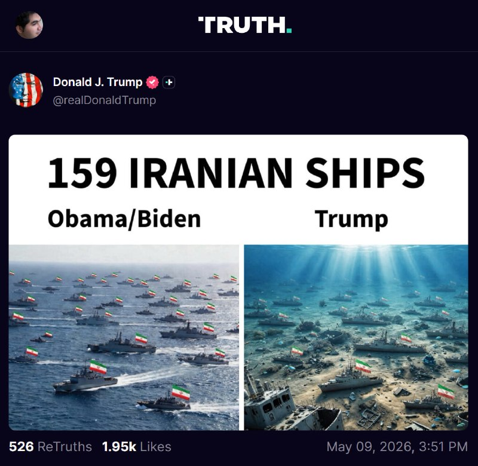

پست ترامپ: realDonaldTrump

📡 @VahidOnline

## VahidOnline — post 75367

  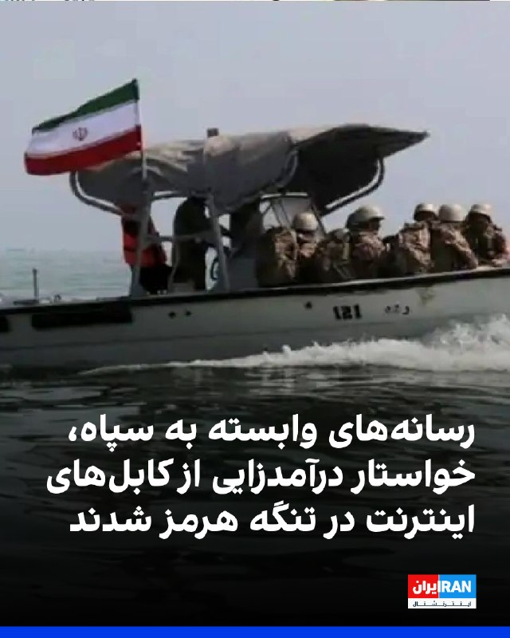

خبرگزاری تسنیم، وابسته به سپاه پاسداران، با اشاره به کابل‌های فیبر نوری عبوری از تنگه هرمز و تهدید به اختلال در اقتصاد دیجیتال جهان در صورت آسیب به این کابل‌ها، خواهان اخذ هزینه از شرکت‌های خارجی و الزام غول‌های فناوری نظیر متا، آمازون و مایکروسافت به فعالیت تحت قوانین جمهوری اسلامی شد.

تسنیم نوشت: «کابل‌های تار نوری زیردریایی عبوری از تنگه هرمز روزانه حامل بیش از ۱۰ تریلیون دلار آمریکا تراکنش مالی (شامل پیام‌های سوئیفت، معاملات بورس و تبادلات ارزی) هستند.»

رسانه وابسته به سپاه در ادامه خواستار «اخذ هزینه مجوز اولیه و تمدید سالانه از شرکت‌های خارجی، الزام غول‌های فناوری (متا، آمازون، مایکروسافت) به فعالیت تحت قوانین جمهوری اسلامی و انحصار تعمیر و نگهداری کابل‌ها از سوی شرکت‌های ایرانی شد.»

فارس، دیگر وابسته به سپاه، نیز در گزارشی نوشت که ده‌ها کابل فیبر نوری زیردریایی که آسیا، اروپا و خاورمیانه را به هم متصل می‌کنند، از گذرگاه تنگه هرمز عبور می‌کنند و تهدید کرد که «هرگونه آسیب به این کابل‌ها می‌تواند اختلالات گسترده‌ای در اینترنت و اقتصاد دیجیتال کشورهای مختلف ایجاد کند.»
@VahidOOnLine

📡 @VahidOnline

## VahidOnline — post 75366

  

ولادیمیر پوتین، رئیس‌جمهور روسیه، روز شنبه ۱۹ اردیبهشت، ساعتی بعد از برپایی رژهٔ «روز پیروزی» در مسکو، گفت که معتقد است جنگ اوکراین در حال اتمام است.

او بدون اشاره به جزئیات بیشتر دربارهٔ این جنگ به خبرنگاران گفت: «فکر می‌کنم این موضوع در حال پایان یافتن است.»

روزنامه فایننشال تایمز روز پنجشنبه گزارش داده بود که رهبران اتحادیه اروپا در حال آماده‌سازی برای مذاکرات احتمالی هستند. وقتی از پوتین پرسیده شد آیا حاضر است با اروپایی‌ها وارد گفت‌وگو شود، او گفت که گزینه ترجیحی‌اش گرهارد شرودر، صدراعظم پیشین آلمان، است.
@VahidHeadline

📡 @VahidOnline

## VahidOnline — post 75365

  <a href="telegram/content/VahidOnline_75365_1778424495.mp4" target="_blank">🎬 Download video</a>

ویدیویی از تجمعات شبانه طرفداران جمهوری اسلامی منتشر شده که در آن فرد خواننده می‌گوید زنان «کم حجابی» که در تجمع طرفداری از حکومت شرکت می‌کنند «نور چشم» آن‌ها هستند و ظاهر افراد ملاک نیست.
نظام جمهوری اسلامی پیش از این زنان بدون حجاب اجباری را بازداشت کرده و طی لایحه‌ای به نام «حجاب و عفاف» قصد ابلاغ جریمه‌های و محرومیت‌های سنگین علیه آنان را داشت.
با این حال، در هفته‌های گذشته حکومت سعی کرده با انتشار ویدیوها و مصاحبه‌هایی از تعدادی زن بی‌حجاب در تجمعات حکومتی، پایگاه اجتماعی خود را گسترده نشان دهد.
@VahidHeadline

📡 @VahidOnline

## VahidOnline — post 75364

  

مقام‌های لبنانی روز شنبه اعلام کردند که در حملات هوایی اسرائیل به جنوب لبنان، هشت نفر کشته شده‌اند. همچنین بزرگراهی در جنوب بیروت هدف حمله هوایی قرار گرفت.

این حملات تازه با وجود آتش‌بس سه‌هفته‌ای میان اسرائیل و حزب‌الله، گروه مورد حمایت [جمهوری اسلامی در] ایران، انجام شد؛ آتش‌بسی که تأثیر چندانی در توقف تبادل روزانه آتش، عمدتاً در جنوب لبنان، نداشته است.

حزب‌الله روز شنبه اعلام کرد که در واکنش به ادامه حملات، نیروهای اسرائیلی در شمال این کشور را با پهپاد هدف قرار داده است.
@VahidHeadline

📡 @VahidOnline

## VahidOnline — post 75363

  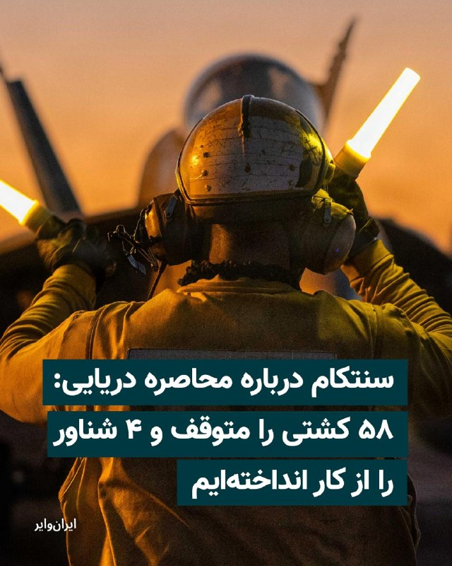

فرماندهی مرکزی آمریکا، سنتکام، روز ۱۹ اردیبهشت ۱۴۰۵ اعلام کرد محاصره دریایی آمریکا علیه جمهوری اسلامی همچنان به‌طور کامل اجرا می‌شود و نیروهای این فرماندهی تاکنون ۵۸ کشتی تجاری را تغییر مسیر داده و چهار شناور را از کار انداخته‌اند تا از ورود یا خروج آن‌ها به بنادر ایران جلوگیری شود.
@VahidHeadline

📡 @VahidOnline

## VahidOnline — post 75358

گذشت

‌ عبدالله امیدوار، یکی از دو برادر امیدوار که اولین نزدیک به ۷۰ سال پیش با موتورسیکلت دور جهان را گشتند، در سانتياگو، پايتخت شيلی درگذشت.

عبدالله، برادر کوچکتر پس از پایان سفرشان به شيلی رفت و در آنجا ازدواج کرد و شرکت فیلم‌سازی در شيلی تاسيس کرد.

عبدالله۲۱ ساله و عیسی ۲۳ ساله، در سال ۱۹۵۴

## kianmeli1 — post 87326

🔴پزشکیان، رئیس جمهور ایران، تنها دقایقی پس از ارسال پاسخ ایران به پیشنهاد آمریکا توسط میانجیگران پاکستانی، بیانیه‌ای منتشر کرد:

او می‌گوید: «ما هرگز در برابر دشمن سر تعظیم فرود نمی‌آوریم و اگر صحبت از گفتگو یا مذاکره می‌شود، به معنای تسلیم یا عقب‌نشینی نیست. بلکه هدف، احقاق حقوق ملت ایران و دفاع از منافع ملی با قدرت و قاطعیت است.»
https://t.me/kianmeli1

## kianmeli1 — post 87325

🔴ترامپ: «ما می‌توانیم دو هفته دیگر ادامه دهیم و تک تک اهداف را هدف قرار دهیم، ما اهداف مشخصی داریم که می‌خواستیم به آنها برسیم و ۷۰ درصد آنها را انجام داده‌ایم.

احتمالاً اهداف بیشتری هم وجود دارد که می‌توانیم به آنها ضربه بزنیم.»
https://t.me/kianmeli1

## kianmeli1 — post 87324

‏🔴ایرنا، خبرگزاری رسمی جمهوری اسلامی: پاسخ جمهوری اسلامی به آخرین متن پیشنهادی آمریکا برای خاتمه جنگ، امروز به میانجی پاکستانی ارسال شد
https://t.me/kianmeli1

## kianmeli1 — post 87323

  

🔴آتش سوزی شدید یک کشتی در سواحل دبی/امارات_ علت: نامشخص
https://t.me/kianmeli1

## kianmeli1 — post 87322

🔴دقایقی پیش چندین پهپاد به امارات حمله کرده است
https://t.me/kianmeli1

## kianmeli1 — post 87321

‏🔴کویت از مقابله با پهپادهای پرتاب شده به این کشور در صبح یکشنبه خبر داد
https://t.me/kianmeli1

## kianmeli1 — post 87320

‏🔴وزارت دفاع قطر تایید کرد که صبح یکشنبه یک کشتی تجاری باری در آب‌های این کشور هدف یک پهپاد قرار گرفته است
https://t.me/kianmeli1

## kianmeli1 — post 87319

‏🔴مهر به نقل از فرمانداری چابهار: شنیده شدن صدای انفجار مربوط به خنثی‌سازی مهمات عمل نکرده است
https://t.me/kianmeli1

## kianmeli1 — post 87318

🔴مدیرعامل آرامکو عربستان: حتی با صلح نفت گران می‌ماند
https://t.me/kianmeli1

## kianmeli1 — post 87317

🔴یک طلافروشی در بلوار اندرزگوی تهران هدف سرقت مسلحانه قرار گرفت و سارقان پس از آن، از محل متواری شدند
https://t.me/kianmeli1

## kianmeli1 — post 87316

  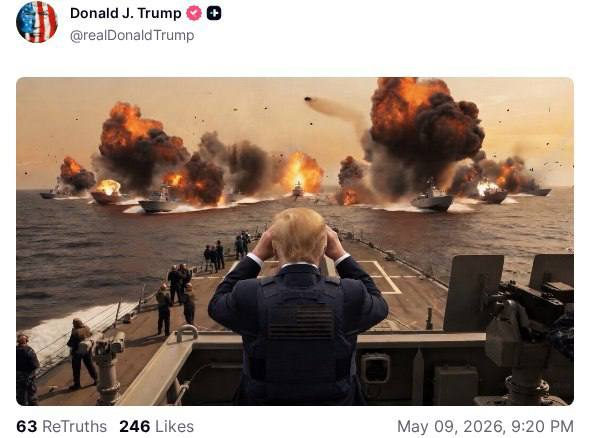

🔴پست جدید ترامپ

[جنگ نزدیک است].
https://t.me/kianmeli1

## kianmeli1 — post 87315

  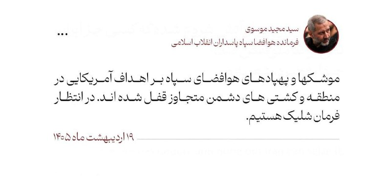

🔴با نزدیک شدن به پایان ضرب الاجل ترامپ، فرمانده هوافضا سپاه نوشت:

موشک ها بر اهداف امریکایی قفل شده و فقط منتظر فرمان هستیم
https://t.me/kianmeli1

## kianmeli1 — post 87312

🔴پست جدید ترامپ
https://t.me/kianmeli1

## kianmeli1 — post 87311

  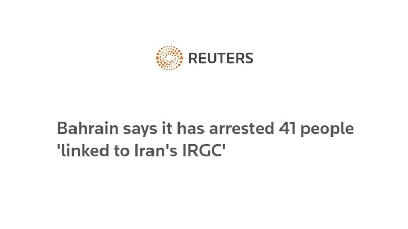

🔴رویترز: بحرین ۴۱ نفر از شهروندانش را به اتهام «ارتباط با سپاه پاسداران» بازداشت کرد
https://t.me/kianmeli1

## kianmeli1 — post 87310

  

🔴سخنگو قرارگاه خاتم

تنگه هرمز: ورود سگ‌ها یا آمریکایی‌ها ممنوع است
https://t.me/kianmeli1

## kianmeli1 — post 87309

  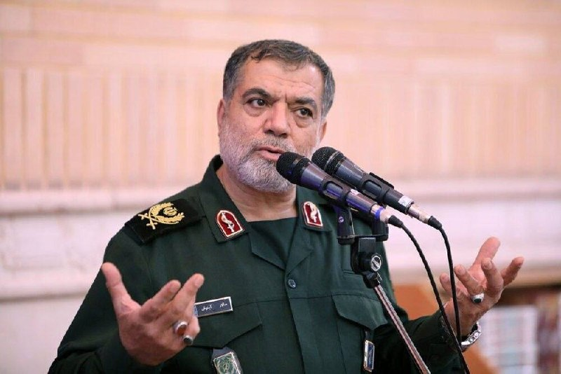

🔴سالار آبنوش: موساد با جن‌ها دنبال آقا مجتبی هست
https://t.me/kianmeli1

## kianmeli1 — post 87308

🔴همزمان با ادامه خاموشی اینترنت در ایران، گزارش‌ها از توقیف اموال شهروندان، بازداشت‌ها، و افزایش فشارهای امنیتی حکایت دارد. منتقدان می‌گویند جمهوری اسلامی همزمان با مصادره اموال به نام «نفع ملت»، اینترنت مردم و کسب‌وکارها را هم زیر فشار برده است.
https://t.me/kianmeli1

## kianmeli1 — post 87307

🔴العربیه گزارش داد اسرائیل به آمریکا هشدار داده زمان به نفع جمهوری اسلامی در جریان است و هرگونه وقت‌کشی در مذاکرات و طولانی شدن آن، امنیت کل منطقه را به خطر می‌اندازد.
https://t.me/kianmeli1

## IranIntlTV — post 336481

  <a href="telegram/content/IranIntlTV_336481_1778424502.mp4" target="_blank">🎬 Download video</a>

یکی از شرکت‌کنندگان در تجمع لندن در گفت‌وگو با آیدین مقیمی، خبرنگار ایران‌اینترنشنال، گفت: «تا وقتی که اینترنت مردم ایران قطع باشد، صدای ایرانیان داخل کشور در سراسر جهان هستیم.»
@iranintltv

## IranIntlTV — post 336480

  <a href="telegram/content/IranIntlTV_336480_1778424503.mp4" target="_blank">🎬 Download video</a>

سرخط خبرهای یکشنبه ۲۰ اردیبهشت
@iranintltv

## IranIntlTV — post 336479

  

مایک والتز، نماینده آمریکا در سازمان ملل متحد، به فاکس نیوز گفت: عملیات خشم اقتصادی در حال حاضر اقتصاد ایران را ویران می‌کند. پول آنها در حال سقوط آزاد است، ذخایر ارزی آنها نزدیک به صفر است.
https://iranintl.com/202605109384

## IranIntlTV — post 336476

  

دونالد ترامپ در گفت‌وگو با «فول مژر» درباره اورانیوم غنی‌شده در ایران گفت: ما بالاخره به آن دست پیدا می‌کنیم، ما آنجا را تحت نظارت داریم. همه‌چیز تحت نظر است. اگر کسی به آن محل نزدیک شود، خبردار می‌شویم و نابودش می‌کنیم.
https://iranintl.com/202605102225

## IranIntlTV — post 336475

  <a href="telegram/content/IranIntlTV_336475_1778424507.mp4" target="_blank">🎬 Download video</a>

معصومه طاهرخانی، تحلیل‌گر اقتصادی، گفت ایرانیان در حال حاضر درگیر «اقتصاد بقا» هستند. او افزود: «وقتی سفره مردم کوچک‌تر، ارزان‌تر و بی‌کیفیت‌تر می‌شود، نسلی شکل می‌گیرد که با مشکلات سلامت روبه‌رو خواهد بود و این موضوع تهدیدی جدی برای آینده ایران به شمار می‌رود.»
@iranintltv

## IranIntlTV — post 336474

  <a href="telegram/content/IranIntlTV_336474_1778424509.mp4" target="_blank">🎬 Download video</a>

یکی از شرکت‌کنندگان در تجمع لندن در گفت‌وگو با آیدین مقیمی، خبرنگار ایران‌اینترنشنال، گفت: «همه جهان باید در جریان اعدام‌ها در ایران قرار بگیرد و ما با حضور در تجمع‌ها صدای زندانیان سیاسی هستیم.»
@iranintltv

## IranIntlTV — post 336473

  

عباس اسدروز، مدیرعامل شرکت پایانه‌های نفتی ایران، گزارش‌ها درباره وجود لکه نفتی در جزیره خارک را رد کرد و گفت پس از انتشار این اخبار، گروه‌های تخصصی کل منطقه را پایش کردند اما هیچ نشتی شناسایی نشد.

او افزود: هیچ‌گونه نشتی در زیرساخت‌ها، مخازن ذخیره‌سازی، سیستم‌های اندازه‌گیری، اسکله‌ها، خطوط لوله این منطقه و کشتی‌های در حال بارگیری وجود ندارد.

آسوشیتدپرس جمعه ۱۸ اردیبهشت گزارش داد لکه‌ای نفتی از بخش غربی جزیره خارک، در حال نشت است.
آمی دنیل، مدیرعامل شرکت اطلاعات دریایی «ویندوارد ای‌آی»، به ای‌پی گفت از روز سه‌شنبه، معادل حدود ۸۰ هزار بشکه نفت از جزیره خارک نشت کرده است.
https://iranintl.com/202605108217

## IranIntlTV — post 336472

  <a href="telegram/content/IranIntlTV_336472_1778424512.mp4" target="_blank">🎬 Download video</a>

بر اساس ویدیوهای رسیده به ایران‌اینترنشنال، ایرانیان مقیم نروژ یکشنبه ۲۰ اردیبهشت در پی فراخوان شاهزاده رضا پهلوی، علیه اعدام‌های جمهوری اسلامی و قطع اینترنت در ایران، در شهر اسلو تجمع کردند.

## IranIntlTV — post 336471

  <a href="telegram/content/IranIntlTV_336471_1778424514.mp4" target="_blank">🎬 Download video</a>

یکی از آسیب‌دیدگان چشمی خیزش سراسری ۱۴۰۱ در تجمع برلین به ایران‌اینترنشنال گفت: «مذاکره با جمهوری اسلامی به‌معنای پایمال کردن خون جاویدنامان ایران است.» او افزود حکومت ایران اینترنت را به روی مردم قطع کرده و «ما اینجا هستیم تا صدای آن‌ها را به گوش جهانیان برسانیم.»

گزارش علی حسن‌پور، خبرنگار ایران‌اینترنشنال
@iranintltv

## IranIntlTV — post 336470

  <a href="telegram/content/IranIntlTV_336470_1778424516.mp4" target="_blank">🎬 Download video</a>

ویدیوهای رسیده به ایران‌اینترنشنال نشان می‌دهند گروهی از ایرانیان مقیم آلمان، یکشنبه ۲۰ اردیبهشت در اعتراض به اعدام‌های جمهوری اسلامی، در شهر هانوفر تجمع کردند و فریاد «ایستاده‌ایم تا پایان» سردادند.

## IranIntlTV — post 336469

  

وزارت خارجه امارات متحده عربی «حملات با پهپاد» به کویت را به‌شدت محکوم کرد و افزود این حملات «تروریستی» علیه کویت نقض حاکمیت این کشور محسوب می‌شود و امنیت و ثبات آن را تهدید می‌کند.

صبح یک‌شنبه کویت از مقابله با پهپادهای پرتاب شده به این کشور خبر داد.
https://iranintl.com/202605105298

## IranIntlTV — post 336468

  <a href="telegram/content/IranIntlTV_336468_1778424520.mp4" target="_blank">🎬 Download video</a>

ویدیوی ارسال‌شده به ایران‌اینترنشنال نشان می‌دهد یکشنبه ۲۰ اردیبهشت محبوبه رمضانی و رحیمه یوسف‌زاده، مادران پژمان قلی‌پور و نوید بهبودی، معترضان کشته‌شده در آبان ۹۸، با حضور در تجمع ایرانیان در هانوفر آلمان، اعتراض «فرزندان ایران را برای سرنگونی حکومت فاسد آخوندی» خواندند.

## IranIntlTV — post 336467

  <a href="telegram/content/IranIntlTV_336467_1778424522.mp4" target="_blank">🎬 Download video</a>

یکی از شرکت‌کنندگان در تجمع برلین در گفت‌وگو با علی حسن‌پور، خبرنگار ایران‌اینترنشنال، برای فاطمه سپهری پیام فرستاد و گفت: «مادر عزیزم طاقت بیار، ایران آزاد می‌شود و ما آزادی را در کنارت جشن می‌گیریم.»
@iranintltv

## IranIntlTV — post 336466

  <a href="telegram/content/IranIntlTV_336466_1778424524.mp4" target="_blank">🎬 Download video</a>

انتشار تصاویر ماهواره‌ای تازه از احتمال نشت نفت در آب‌های اطراف جزیره خارک، توجه جهانی را جلب کرده است. هم‌زمان، تهدید رسانه‌های نزدیک به سپاه پاسداران درباره کنترل کابل‌های اینترنتی زیر دریا، نگرانی‌ها درباره امنیت انرژی و آسیب‌پذیری زیرساخت‌های حیاتی در تنگه هرمز را افزایش داده است.

عادله بورنگ، عضو تحریریه ایران‌اینترنشنال، از واکنش کاربران رسانه‌های اجتماعی به این موضوع‌ها گزارش می‌دهد
@iranintltv

## IranIntlTV — post 336465

  <a href="telegram/content/IranIntlTV_336465_1778424526.mp4" target="_blank">🎬 Download video</a>

کارزار همبستگی ایرانیان خارج از کشور با «ملت در گروگان» در ایران ادامه دارد. این تجمع‌ها با فراخوان شاهزاده رضا پهلوی و در اعتراض به تشدید اعدام‌‌ها، سرکوب و قطع اینترنت در ایران، برگزار می‌شود.

علی حسن‌پور، خبرنگار ایران‌اینترنشنال، از تجمع شهر برلین گزارش می‌دهد
@iranintltv

## IranIntlTV — post 336464

  <a href="telegram/content/IranIntlTV_336464_1778424528.mp4" target="_blank">🎬 Download video</a>

یکی از شرکت‌کنندگان در تجمع استکهلم گفت تنها خواسته دوست جاویدنامش، محمود موسوی، ۲۹ ساله که دی‌ماه در قشم کشته شد، این بود که «خسته نشویم و ادامه دهیم».

گزارش مهران عباسیان، خبرنگار ایران‌اینترنشنال
@iranintltv

## IranIntlTV — post 336463

  <a href="telegram/content/IranIntlTV_336463_1778424531.mp4" target="_blank">🎬 Download video</a>

ایرانیان مقیم استکهلم در ادامه کارزار همبستگی با انقلاب ملی و در اعتراض به تشدید اعدام‌‌ها، سرکوب و قطع اینترنت در ایران، تجمع کردند.

گفت‌وگوی مهران عباسیان، خبرنگار ایران‌اینترنشنال، با شرکت‌کنندگان در این تجمع
@iranintltv

## IranIntlTV — post 336462

🔻افزایش بازداشت‌ها و تشدید فشار امنیتی جمهوری اسلامی بر جامعه بهائی در سایه قطع اینترنت

بررسی‌های ایران‌اینترنشنال نشان می‌دهد در هفته‌های اخیر و هم‌زمان با تداوم قطعی اینترنت، فشارهای امنیتی و قضایی جمهوری اسلامی علیه جامعه بهائی در شهرهای مختلف ایران افزایش یافته و احضار، بازداشت، تفتیش خانه‌ها، ضبط گسترده اموال و اجرای احکام حبس شدت گرفته است.

بر اساس اطلاعات رسیده به ایران‌اینترنشنال، از اعتراضات دی‌ماه تا صبح یک‌شنبه ۲۰ اردیبهشت، شماری از شهروندان بهائی در شهرهای مختلف بازداشت شده‌اند.

پیوند نعیمی، برنا نعیمی و شکیلا قاسمی در کرمان، بهزاد یزدانی و همسرش رومینا خزعلی، مهسا ستوده، ماندانا ستوده، پژمان زارع، سارا سپهری و عنقا سیاوشی در شیراز و فلورا صمدانی در یزد، از جمله شهروندان بهائی بازداشت‌شده در این دوره‌اند.

همچنین وفا کاشفی، نوید ذره‌بین ایرانی، پیام فریدیان، ربیع مالکی و سپهر کوشکباغی در مشهد، ریاض بهراد در کرج و آرتین غضنفری در تهران نیز در این مدت بازداشت شده‌اند.

بسیاری از این شهروندان همچنان در بازداشت و بلاتکلیفی به‌ سر می‌برند و خبر تازه‌ای از آزادی یا ادامه بازداشت شماری از آنان، از جمله فریدیان، مالکی و کوشکباغی، در دست نیست.
جامعه جهانی بهائی ۱۰ اردیبهشت در بیانیه‌ای هشدار داد پیوند و برنا نعیمی تحت شکنجه، ضرب‌وشتم، شوک الکتریکی، محرومیت از آب و غذا و اعدام‌های نمایشی قرار گرفته‌اند تا به اتهام‌هایی که مرتکب نشده‌اند، اعتراف کنند.

جامعه جهانی بهائی تاکید کرد این دو نفر در خطر اعدام قرار دارند.

هم‌زمان، برخی دیگر از شهروندان بهائی در هفته‌های اخیر بازداشت شده و پس از تودیع وثیقه‌های سنگین، به‌طور موقت آزاد شده‌اند.

با گذشت ۷۲ روز از قطعی اینترنت در ایران، منابع مطلع به ایران‌اینترنشنال گفته‌اند ابعاد واقعی بازداشت‌ها و فشارها علیه جامعه بهائی بسیار گسترده‌تر از موارد رسانه‌ای‌شده است، اما اختلال در اطلاع‌رسانی، تهدید خانواده‌ها و فضای امنیتی، دسترسی به اطلاعات دقیق را دشوار کرده است.

وزارت اطلاعات جمهوری اسلامی دی‌ماه ۱۴۰۴ در اطلاعیه‌ای از شناسایی یک «شبکه ۳۲ نفره جاسوسی» مرتبط با شهروندان بهائی خبر داد.

وزارت اطلاعات این افراد را به «اغتشاش و تخریب‌گری» متهم کرد و افزود ۱۲ نفر از آنان بازداشت و ۱۳ تن دیگر احضار شده‌اند.

مقام‌های جمهوری اسلامی پیش‌تر نیز از جمله در جریان جنگ ۱۲ روزه، شهروندان بهائی را به «جاسوسی برای اسرائیل» متهم و برای شماری از آنان پرونده‌سازی کرده بودند.

بلاتکلیفی بازداشت‌شدگان و فشار بر خانواده‌ها

بر اساس اطلاعات رسیده به ایران‌اینترنشنال، شماری از شهروندان بهائی بازداشت‌شده در هفته‌ها و ماه‌های اخیر، بدون دسترسی روشن به روند قضایی، در وضعیت بلاتکلیف نگهداری می‌شوند.

در برخی پرونده‌ها، خانواده‌ها از محل نگهداری، وضعیت جسمی، اتهامات مطرح‌شده یا زمان احتمالی آزادی عزیزانشان بی‌اطلاع مانده‌اند و پیگیری‌های آنان نیز با تهدید و فشار امنیتی روبه‌رو شده است.

در مواردی، تماس بازداشت‌شدگان با خانواده‌ها بسیار کوتاه و محدود بوده و همین تماس‌های چندثانیه‌ای نیز امکان اطلاع از وضعیت جسمی و روحی آنان را فراهم نکرده است.

منابع مطلع به ایران‌اینترنشنال گفته‌اند برخی خانواده‌ها، حتی پس از تامین وثیقه‌های سنگین، همچنان با ادامه بازداشت عزیزانشان روبه‌رو شده‌اند و در برخی پرونده‌ها نیز اتهامات تازه‌ای به بازداشت‌شدگان افزوده شده است.

اطلاعات رسیده همچنین از نگرانی جدی درباره وضعیت جسمی شماری از بازداشت‌شدگان حکایت دارد.

برخی از آنان پیش از بازداشت با مشکلات پزشکی، نیاز به مصرف دارو یا مسئولیت نگهداری از اعضای بیمار و سالخورده خانواده روبه‌رو بوده‌اند، اما در بازداشت با محدودیت تماس، کمبود دارو، نبود رسیدگی پزشکی کافی و محرومیت از دسترسی منظم به خانواده مواجه شده‌اند.

بازداشت هم‌زمان اعضای برخی خانواده‌های بهائی، نگهداری طولانی‌مدت در بلاتکلیفی و تهدید نزدیکان برای خودداری از پیگیری، فشار مضاعفی بر خانواده‌های بهائی وارد کرده است.

🔗ادامه گزارش را اینجا بخوانید
@iranintltv

## IranIntlTV — post 336461

  <a href="telegram/content/IranIntlTV_336461_1778424533.mp4" target="_blank">🎬 Download video</a>

بر اساس ویدیوهای رسیده به ایران‌اینترنشنال، ایرانیان مقیم بریتانیا یکشنبه ۲۰ اردیبهشت در پی فراخوان شاهزاده رضا پهلوی، علیه اعدام‌های جمهوری اسلامی و قطع اینترنت در ایران، در شهر شفیلد تجمع کردند.

## IranIntlTV — post 336460

  <a href="telegram/content/IranIntlTV_336460_1778424536.mp4" target="_blank">🎬 Download video</a>

یکی از شرکت‌کنندگان در تجمع برلین به علی حسن‌پور، خبرنگار ایران‌اینترنشنال، گفت: «اینجا هستیم تا از سیاستمداران اروپایی بخواهیم چشم خود را بر اعدام‌ها در ایران نبندند و برای دسترسی مردم ایران به اینترنت تلاش کنند.»
@iranintltv

## Shin_Persian — post 5932

Shin ✓ @hey_itsmyturn
Sun, 10 May 2026 14:37:49 UTC

State-run YJC citing Al Jazeera:
"Pakistan delivered [Islamic Regime of] Iran's response to the United States on the ceasefire terms"

فارسی

خبرگزاری دولتی YJC به نقل از الجزیره:
«پاکستان پاسخ [رژیم اسلامی] ایران درباره شرایط آتش‌بس را به ایالات متحده تحویل داد»

𝕏 · @shin_persian

## Shin_Persian — post 5931

📦 mhrv-rs v1.9.19 released

• **UI accessibility
• Also rolling up the exit_node Content-Encoding fix (#964)

Files (Android APKs, Windows, macOS, Linux, OpenWRT) on the files channel:

👉 v1.9.19 — all files with SHA-256

Channel:
https://t.me/mhrv_rs
or: https://t.me/+R1OyoHX2boA1ZDgx

#v1919

## Shin_Persian — post 5930

  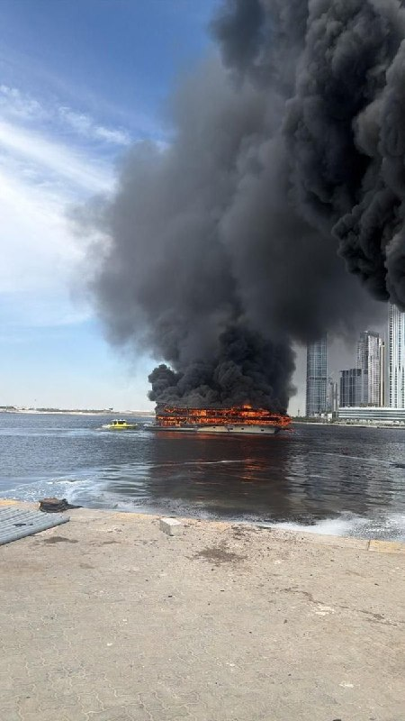

Dubai Media Office ✓ @DXBMediaOffice Sun, 10 May 2026 11:25:48 UTC توضيح: الدخان الملاحظ في منطقة الجداف ناتج عن حريق في قارب متوقف في خور دبي. ولم ينتج عن الحريق اي إصابات، وتعود كثافة الدخان إلى مادة الفيبرجلاس المستخدمة في تصنيع القارب. وتدعو الجهات المعنية…

## Shin_Persian — post 5929

Dubai Media Office ✓ @DXBMediaOffice
Sun, 10 May 2026 11:25:48 UTC

توضيح: الدخان الملاحظ في منطقة الجداف ناتج عن حريق في قارب متوقف في خور دبي. ولم ينتج عن الحريق اي إصابات، وتعود كثافة الدخان إلى مادة الفيبرجلاس المستخدمة في تصنيع القارب. وتدعو الجهات المعنية الجمهور إلى الحصول على المعلومات من المصادر الرسمية وعدم تداول الشائعات أو المعلومات

English

Clarification: The smoke observed in the Al Jaddaf area is resulting from a fire in a boat docked in Dubai Creek. The fire has not resulted in any injuries, and the density of the smoke is due to the fiberglass material used in the boat's manufacturing. Concerned authorities urge the public to obtain information from official sources and to avoid circulating rumors or misinformation.

𝕏 · @shin_persian

## Shin_Persian — post 5928

  <a href="telegram/content/Shin_Persian_5928_1778424539.mp4" target="_blank">🎬 Download video</a>

Open Source Intel ✓ @Osint613
Sun, 10 May 2026 12:02:08 UTC

Visa and Mastercard now functional in Syria after 15 years.

فارسی

ویزا و مسترکارت پس از ۱۵ سال اکنون در سوریه فعال هستند.

𝕏 · @shin_persian

## Shin_Persian — post 5927

  

DefenceGeek 🇬🇧 ✓ @DefenceGeek Sun, 10 May 2026 13:06:00 UTC UPDATE: US Air Force Tanker Fleet 10/05/2026 (Ceasefire Day 33) #FreeIran‌ --- Operation EPIC FURY / Project FREEDOM --- Bit of a major update today instead of my weekly update on Tuesday as I'm…

## Shin_Persian — post 5926

DefenceGeek 🇬🇧 ✓ @DefenceGeek
Sun, 10 May 2026 13:06:00 UTC

UPDATE: US Air Force Tanker Fleet 10/05/2026 (Ceasefire Day 33) #FreeIran‌
--- Operation EPIC FURY / Project FREEDOM ---

Bit of a major update today instead of my weekly update on Tuesday as I'm going to be a little busy then. Overall tanker numbers have reduced slightly (230 down to 225) from my last update, but this coincides with a shift of some tankers into CENTCOM and others back to the US via UK/German bases. The implication of the change in positioning being that the US is now using the tankers in CENTCOM for operations and rotating them out with less used airframes elsewhere, while still running training flights for the RAF Fairford (EGVA)-based bombers in the UK and Mediterranean.

Of the 114 tankers identified in CENTCOM (Red Zone):
- 93 have been tracked flying so far in May 2026
- 37 of those have been tracked flying at least once in the last 36hrs
- The tanker with the oldest "last tracked" date was last seen on 21st March 2026

Usual rule, exact distribution I won't give out for now on the off chance that hostilities begin again in the coming days/weeks.

@MATA_osint @vcdgf555 @steffanwatkins @ArmchairAdml @TheIntelFrogbu @jamjake01 @Andyyyyrrrr @Saint1Mil @rocketron101 @Faytuks

فارسی

به‌روزرسانی: ناوگان تانکرهای نیروی هوایی ایالات متحده (USAF) ۱۰ مه ۲۰۲۶ (روز سی‌وسوم آتش‌بس) #FreeIran‌
--- عملیات خشم حماسی (EPIC FURY) / پروژه آزادی (FREEDOM) ---

امروز به‌جای به‌روزرسانی هفتگی در سه‌شنبه، یک به‌روزرسانی مهم دارم، چرا که آن روز کمی سرم شلوغ خواهد بود. در مجموع، تعداد تانکرها نسبت به آخرین به‌روزرسانی من اندکی کاهش یافته است (از ۲۳۰ به ۲۲۵ فروند)، اما این موضوع با جابه‌جایی برخی تانکرها به منطقه مسئولیت فرماندهی مرکزی ایالات متحده (CENTCOM) و بازگشت برخی دیگر به ایالات متحده از طریق پایگاه‌های بریتانیا و آلمان همزمان شده است. پیامد این تغییر موقعیت این است که ایالات متحده در حال حاضر از تانکرها در سنتکام (CENTCOM) برای عملیات استفاده می‌کند و آن‌ها را با بدنه هواپیماهایی که کمتر در جاهای دیگر استفاده شده‌اند، جایگزین می‌کند، در حالی که همچنان پروازهای آموزشی برای بمب‌افکن‌های مستقر در پایگاه نیروی هوایی سلطنتی فیرفورد (RAF Fairford - EGVA) در بریتانیا و مدیترانه را ادامه می‌دهد.

از ۱۱۴ تانکر شناسایی‌شده در سنتکام (منطقه قرمز):
- ۹۳ فروند تا این لحظه در ماه مه ۲۰۲۶ ردیابی شده‌اند.
- ۳۷ فروند از آن‌ها حداقل یک بار در ۳۶ ساعت گذشته ردیابی شده‌اند.
- قدیمی‌ترین تاریخ مربوط به «آخرین ردیابی»، مربوط به ۲۱ مارس ۲۰۲۶ است.

طبق قاعده همیشگی، توزیع دقیق را فعلاً اعلام نمی‌کنم تا در صورت آغاز احتمالی دوباره خصومت‌ها در روزها/هفته‌های آینده، اطلاعاتی درز نکند.

@MATA_osint @vcdgf555 @steffanwatkins @ArmchairAdml @TheIntelFrogbu @jamjake01 @Andyyyyrrrr @Saint1Mil @rocketron101 @Faytuks

𝕏 · @shin_persian

## Shin_Persian — post 5924

وزارة التربية والتعليم ✓ @MOEUAEofficial Sun, 10 May 2026 11:21:46 UTC تعلن #وزارة_التربية_والتعليم استئناف التعليم الحضوري لجميع الطلبة والكوادر التعليمية والإدارية في المدارس الحكومية والخاصة والحضانات على مستوى الدولة، اعتبارًا من يوم الاثنين الموافق…

## Shin_Persian — post 5923

وزارة التربية والتعليم ✓ @MOEUAEofficial
Sun, 10 May 2026 11:21:46 UTC

تعلن #وزارة_التربية_والتعليم استئناف التعليم الحضوري لجميع الطلبة والكوادر التعليمية والإدارية في المدارس الحكومية والخاصة والحضانات على مستوى الدولة، اعتبارًا من يوم الاثنين الموافق 11 مايو 2026، وذلك في ضوء المتابعة المستمرة للمستجدات والتنسيق القائم مع الجهات المعنية، بما يضمن انتظام العملية التعليمية واستمرارية التقييمات الأكاديمية.

The Ministry of Education announces the resumption of in-person learning for all students, teaching and administrative staff in public and private schools and nurseries across the UAE, effective Monday, 11 May 2026. This decision follows the continuous monitoring of developments and coordination with the relevant authorities, ensuring the continuity of the educational process and academic assessments.

فارسی

#وزارت_آموزش_و_پرورش امارات از سرگیری آموزش حضوری برای تمامی دانش‌آموزان و کادر آموزشی و اداری در مدارس دولتی و خصوصی و مهدکودک‌ها در سراسر کشور را از روز دوشنبه ۱۱ می ۲۰۲۶ (۲۱ اردیبهشت ۱۴۰۵) اعلام می‌کند. این تصمیم در راستای پایش مستمر تحولات و هماهنگی‌های موجود با مراجع ذی‌صلاح اتخاذ شده است تا از نظم فرآیند آموزشی و تداوم ارزیابی‌های تحصیلی اطمینان حاصل شود.

𝕏 · @shin_persian

## Shin_Persian — post 5922

  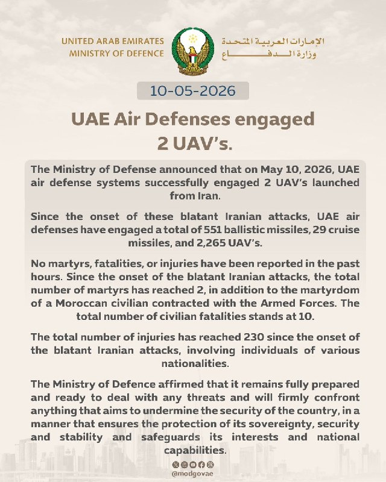

وزارة الدفاع |MOD UAE ✓ @modgovae Sun, 10 May 2026 10:44:56 UTC UAE Air Defenses engaged 2 UAV’s. The Ministry of Defense announced that on May 10, 2026, UAE air defense systems successfully engaged 2 UAV’s launched from Iran. Since the onset of these…

## Shin_Persian — post 5921

وزارة الدفاع |MOD UAE ✓ @modgovae
Sun, 10 May 2026 10:44:56 UTC

UAE Air Defenses engaged 2 UAV’s.

The Ministry of Defense announced that on May 10, 2026, UAE air defense systems successfully engaged 2 UAV’s launched from Iran.

Since the onset of these blatant Iranian attacks, UAE air defenses have engaged a total of 551 ballistic missiles, 29 cruise missiles, and 2,265 UAV’s.

No martyrs, fatalities, or injuries have been reported in the past hours. Since the onset of the blatant Iranian attacks, the total number of martyrs has reached 2, in addition to the martyrdom of a Moroccan civilian contracted with the Armed Forces. The total number of civilian fatalities stands at 10, from Pakistani, Nepalese, Bangladeshi, Palestinian, Indian, and Egyptian nationalities.

The total number of injuries has reached 230 since the onset of the blatant Iranian attacks, involving individuals of various nationalities, including Emirati, Egyptian, Sudanese, Ethiopian, Filipino, Pakistani, Iranian, Indian, Bangladeshi, Sri Lankan, Azerbaijani, Yemeni, Ugandan, Eritrean, Lebanese, Afghan, Bahraini, Comorian, Turkish, Iraqi, Nepalese, Nigerian, Omani, Jordanian, Palestinian, Ghanaian, Indonesian, Swedish, Tunisian, Moroccan, and Russian.

The Ministry of Defence affirmed that it remains fully prepared and ready to deal with any threats and will firmly confront anything that aims to undermine the security of the country, in a manner that ensures the protection of its sovereignty, security and stability and safeguards its interests and national capabilities.

#وزارة_الدفاع
#وزارة_الدفاع_الإماراتية
#MOD
#UAEMinistryOfDefence

ترجمه فارسی در بخش نظرات

𝕏 · @shin_persian

## Shin_Persian — post 5920

Shin ✓ @hey_itsmyturn
Sun, 10 May 2026 10:19:32 UTC

Explosions in Erbil, unknown nature.
KRI, #Iraq 🇮🇶

فارسی

انفجارهایی در اربیل، ماهیت نامشخص.
اقلیم کردستان عراق (KRI)، #Iraq 🇮🇶

𝕏 · @shin_persian

## Shin_Persian — post 5919

  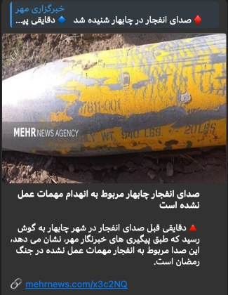

Shin ✓ @hey_itsmyturn
Sun, 10 May 2026 09:43:49 UTC

Mehr News on Chabahar explosion: UXO

فارسی

خبرگزاری مهر درباره انفجار چابهار: مهمات عمل‌نکرده (UXO)

𝕏 · @shin_persian

## Shin_Persian — post 5918

  

Shin ✓ @hey_itsmyturn
Sun, 10 May 2026 09:38:47 UTC

State-affiliated Mehr News:

Loud explosion heard in the city of Chabahar. No details on cause or exact location yet.
Sistan and Baluchestan Province, #Iran

فارسی

خبرگزاری دولتی مهر:

صدای انفجار مهیبی در شهر چابهار شنیده شد. هنوز جزئیاتی از علت یا محل دقیق آن در دست نیست.
استان سیستان و بلوچستان، #Iran_

𝕏 · @shin_persian

## Shin_Persian — post 5917

Shin ✓ @hey_itsmyturn
Sun, 10 May 2026 08:51:58 UTC

Possibly UXO EOD

فارسی

احتمال وجود مهمات عمل‌نکرده (UXO) و نیاز به خنثی‌سازی بمب (EOD)

𝕏 · @shin_persian

## Shin_Persian — post 5916

Shin ✓ @hey_itsmyturn
Sun, 10 May 2026 08:50:08 UTC

2 blasts in Bandar Abbas, Hormozgan Province, #Iran

فارسی

۲ انفجار در بندرعباس، استان هرمزگان، #Iran

𝕏 · @shin_persian

## Shin_Persian — post 5915

  

↩️ Quoted tweet: Ali Vaez ✓ @AliVaez Sat, 09 May 2026 18:15:52 UTC Israel Built and Defended a Secret Iran War Base in Iraq https://www.wsj.com/world/middle-east/israel-built-and-defended-a-secret-iran-war-base-in-iraq-3590851a ↩️ توییت نقل‌قول شده — برای…

## Shin_Persian — post 5914

↩️ Quoted tweet:
Ali Vaez ✓ @AliVaez
Sat, 09 May 2026 18:15:52 UTC

Israel Built and Defended a Secret Iran War Base in Iraq https://www.wsj.com/world/middle-east/israel-built-and-defended-a-secret-iran-war-base-in-iraq-3590851a

↩️ توییت نقل‌قول شده — برای پاسخ، پست زیر را ببینید.

فارسی

اسرائیل یک پایگاه جنگی مخفی علیه ایران در عراق ساخته و از آن دفاع کرده است https://www.wsj.com/world/middle-east/israel-built-and-defended-a-secret-iran-war-base-in-iraq-3590851a

𝕏 · @shin_persian

## Shin_Persian — post 5913

Shin ✓ @hey_itsmyturn
Sat, 09 May 2026 21:17:43 UTC

Jet activity over Baghdad
#Iraq 🇮🇶

فارسی

فعالیت جت‌ها بر فراز بغداد
#Iraq 🇮🇶

𝕏 · @shin_persian

## ManotoTV — post 105246

  <a href="telegram/content/ManotoTV_105246_1778424545.mp4" target="_blank">🎬 Download video</a>

اینسبروک | اتریش؛ گردهمایی ایرانیان ـ گزارشگر ۲۰ اردیبهشت ۱۴۰۵

## ManotoTV — post 105245

  <a href="telegram/content/ManotoTV_105245_1778424547.mp4" target="_blank">🎬 Download video</a>

ژنو | سوئیس؛ گردهمایی ایرانیان ـ گزارشگر ۲۰ اردیبهشت ۱۴۰۵

## ManotoTV — post 105243

  <a href="telegram/content/ManotoTV_105243_1778424549.mp4" target="_blank">🎬 Download video</a>

راهپیمایی ایرانیان ساکن استکهلم سوئد، یکشنبه ۲۰ اردیبهشت ۱۴۰۵

## ManotoTV — post 105242

  <a href="telegram/content/ManotoTV_105242_1778424550.mp4" target="_blank">🎬 Download video</a>

گردهمایی ایرانیان ساکن توکیو مقابل وزارت خارجه ژاپن، یکشنبه ۲۰ اردیبهشت

## ManotoTV — post 105241

  <a href="telegram/content/ManotoTV_105241_1778424552.mp4" target="_blank">🎬 Download video</a>

شماری از ایرانیان ساکن لندن روز شنبه ۱۰ مه با حضور در تجمعی مقابل دفتر نخست‌وزیر بریتانیا، مخالفت خود را با یهودستیزی اعلام کردند.

شرکت‌کنندگان در این گردهمایی با در دست داشتن پرچم‌های ایران و اسرائیل و پلاکاردهایی در حمایت از همزیستی و مقابله با نفرت‌پراکنی، خواستار ایستادگی در برابر یهودستیزی و افراط‌گرایی شدند.

این تجمع در حالی برگزار شد که در ماه‌های اخیر نگرانی‌ها درباره افزایش موارد یهودستیزی در بریتانیا و برخی کشورهای اروپایی افزایش یافته است.

## ManotoTV — post 105240

  <a href="telegram/content/ManotoTV_105240_1778424554.mp4" target="_blank">🎬 Download video</a>

راهپیمایی ایرانیان گوتنبرگ

## ManotoTV — post 105239

  <a href="telegram/content/ManotoTV_105239_1778424556.mp4" target="_blank">🎬 Download video</a>

حضور گسترده ایرانیان در تجمع ضد یهودستیزی در برابر دفتر نخست وزیر در لندن، یکشنبه ۲۰ اردیبهشت

## ManotoTV — post 105238

  <a href="telegram/content/ManotoTV_105238_1778424558.mp4" target="_blank">🎬 Download video</a>

دفتر رسانه‌ای دولت دبی اعلام کرد دود غلیظ مشاهده‌شده در منطقه الجداف، ناشی از آتش‌سوزی در یک قایق متوقف در خور دبی بوده است.

بر اساس این بیانیه، تیم‌های دفاع مدنی دبی حریق را در مدت ۵۴ دقیقه به طور کامل مهار کردند و عملیات خنک‌سازی محل ادامه دارد.

دفتر رسانه‌ای دولت دبی اعلام کرد در این حادثه هیچ مصدومی گزارش نشده و رنگ سیاه و غلظت دود به دلیل سوختن مواد فایبرگلاس به کار رفته در ساخت قایق بوده است.

## ManotoTV — post 105237

  

خبرگزاری ایرنا نوشت پاسخ جمهوری اسلامی به آخرین متن پیشنهادی آمریکا برای خاتمه جنگ، امروز از طریق میانجی پاکستانی ارسال شده است.

بر اساس این گزارش، سخنگوی وزارت خارجه جمهوری اسلامی پیش‌تر گفته بود دیدگاه‌ها و ملاحظات تهران درباره پیشنهادهای آمریکا پس از تکمیل بررسی‌ها و جمع‌بندی نهایی ارسال می‌شود.

ایرنا افزود در طرح پیشنهادی، مذاکرات در این مرحله بر موضوع خاتمه جنگ در منطقه متمرکز خواهد بود.

## ManotoTV — post 105236

  <a href="telegram/content/ManotoTV_105236_1778424560.mp4" target="_blank">🎬 Download video</a>

یوری اوشاکوف، دستیار رئیس‌جمهور روسیه در امور سیاست خارجی، اعلام کرد استیو ویتکاف، فرستاده ویژه رئیس‌جمهور آمریکا، و جرد کوشنر، داماد دونالد ترامپ، احتمالا به‌زودی برای ادامه گفت‌وگوها به مسکو سفر می‌کنند.

به گزارش اینترفکس، اوشاکوف گفت: «دیر یا زود، فکر می‌کنم به‌زودی، همکاران دائمی ما استیو ویتکاف و کوشنر به مسکو می‌آیند و ما گفت‌وگو را با آن‌ها ادامه می‌دهیم.»

او همچنین گفت واشنگتن موضوع حل‌وفصل جنگ اوکراین را کنار نگذاشته و تماس‌های تلفنی فعال میان آمریکا و روسیه ادامه دارد. ودوموستی نیز نوشت این سفر احتمالی در چارچوب ادامه گفت‌وگوها درباره حل‌وفصل جنگ اوکراین مطرح شده است.

## ManotoTV — post 105235

  <a href="telegram/content/ManotoTV_105235_1778424561.mp4" target="_blank">🎬 Download video</a>

گزارشگرمنوتو: «به فراخوان شاهزاده رضا پهلوی، ما ایرانیان در شهر ماربیا روز ۱۰ مه گرد هم آمدیم تا صدای مردم ایران باشیم و حمایت خود را از انقلاب شیروخورشید اعلام کنیم.»

## ManotoTV — post 105234

  

وزارت دفاع امارات اعلام کرد سامانه‌های پدافند هوایی این کشور روز ۲۰ اردیبهشت با دو پهپاد که به گفته این وزارتخانه از ایران شلیک شده بودند، مقابله کرده‌اند.

بر اساس اطلاعیه وزارت دفاع امارات، از آغاز درگیری‌ها، سامانه‌های پدافندی این کشور با چند حمله موشکی و پهپادی مقابله کرده‌اند.

## ManotoTV — post 105233

  

همزمان با «روز مادر» که در بسیاری از کشورهای جهان در دومین یکشنبه ماه مه گرامی داشته می‌شود، تصویری از مادر مهراد صادقی، نوجوان جان‌باخته اعتراضات ۱۴۰۴، بر مزار فرزندش منتشر شده است. جهان مناسبت می‌سازد، سیاستمدارها پیام تبریک می‌دهند، و بعضی مادرها کنار سنگ قبر فرزندشان دراز می‌کشند. تمدن بشر، شاهکار تناقض.

متن خبر:

مهراد صادقی، نوجوان اصفهانی و نقاش، در جریان اعتراضات سال ۱۴۰۴ با اصابت گلوله نیروهای امنیتی از ناحیه پهلو جان باخت.

بنا بر روایت خانواده، مادر مهراد پس از بی‌پاسخ ماندن تماس‌هایش، سرانجام با فردی ناشناس روبه‌رو شد که با تلفن همراه فرزندش پاسخ داده و گفته بود: «فرزندتان تیر خورده، بیایید او را ببرید.»

خانواده می‌گویند مهراد را در حالی به خانه منتقل کردند که دیگر جان باخته بود و پیکر او به مدت دو روز در بالکن خانه نگهداری شد.

به گفته نزدیکان خانواده، پس از انتقال پیکر به باغ رضوان اصفهان، جسد برای مدتی به خانواده تحویل داده نشد و در نهایت حدود یک هفته بعد، پیکر مهراد تحویل و در همان‌جا به خاک سپرده شد.

## ManotoTV — post 105232

  <a href="telegram/content/ManotoTV_105232_1778424564.mp4" target="_blank">🎬 Download video</a>

گزارشگرمنوتو: «گردهمایی و راهپیمایی امروز ملبورن در پاسخ به فراخوان شاهزاده رضا پهلوی

تا زمان آزادی پا پس نمی‌کشیم و صدای ایران خواهیم بود.»

شماری از ایرانیان ساکن ملبورن امروز با حضور در این گردهمایی، حمایت خود را از انقلاب شیروخورشید و مردم داخل ایران اعلام کردند.

فراخوان این تجمع با محوریت اعتراض به «خاموشی سراسری اینترنت»، «اعدام‌های بی‌وقفه» و حمایت از زندانیان سیاسی منتشر شده بود.

## ManotoTV — post 105231

  

رسانه‌های جمهوری اسلامی گفته‌اند علی عبداللهی، فرمانده قرارگاه مرکزی خاتم‌الانبیا، با مجتبی خامنه‌ای دیدار کرده و گزارشی از آمادگی نیروهای مسلح، از جمله ارتش، سپاه، نیروی انتظامی، نهادهای امنیتی، مرزبانی، وزارت دفاع و بسیج ارائه داده است.

بر اساس این گزارش‌ها، عبداللهی گفته نیروهای مسلح از نظر روحیه رزمی، آمادگی دفاعی و هجومی، طرح‌های راهبردی و تجهیزات لازم برای مقابله با «دشمنان» در سطح بالایی از آمادگی قرار دارند.

این رسانه‌ها همچنین نوشتند مجتبی خامنه‌ای در این دیدار تدابیر تازه‌ای برای ادامه اقدامات و مقابله با دشمنان ابلاغ کرده است. با وجود انتشار متن این خبر، رسانه‌های جمهوری اسلامی تصویری از این دیدار منتشر نکردند.

## ManotoTV — post 105230

  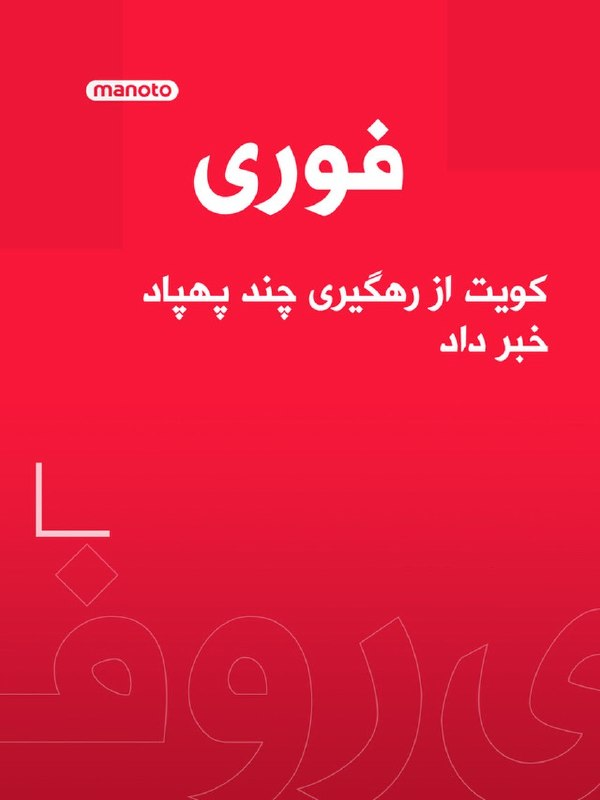

کویت اعلام کرد چند پهپاد «متخاصم» در حریم هوایی این کشور شناسایی شده‌اند و با آن‌ها بر اساس رویه‌های تعیین‌شده برخورد شده است.

مقام‌های کویتی جزئیات بیشتری درباره تعداد دقیق پهپادها، مبدا احتمالی آن‌ها یا محل رهگیری منتشر نکرده‌اند.

## ManotoTV — post 105229

  

خبرگزاری حکومتی مهر گزارش داد دقایقی پیش صدای یک انفجار شدید در شهر چابهار شنیده شده است.

بر اساس این گزارش، هنوز جزئیات بیشتری درباره علت انفجار، محل دقیق آن و خسارت‌های احتمالی منتشر نشده است.

تا زمان انتشار این خبر، مقام‌های محلی توضیحی درباره این حادثه نداده‌اند.

## ManotoTV — post 105228

  <a href="telegram/content/ManotoTV_105228_1778424568.mp4" target="_blank">🎬 Download video</a>

امیرحسین کریمی، یکی از شرکت‌کنندگان «آکادمی گوگوش»، درگذشت.

او از چهره‌های پرطرفدار و جنجالی آخرین فصل «آکادمی گوگوش» در «منوتو» بود و بسیاری او را با اجرای یکی از آثار فرهاد به یاد می‌آورند.

او که با نام «اردشیر پهلو» نیز شناخته می‌شد، پس از حضور در آکادمی گوگوش، مهمان نخستین قسمت برنامه «امید اِی‌اِم» در «منوتو» نیز بود و در میان مخاطبان این برنامه‌ها به چهره‌ای شناخته‌شده تبدیل شد.

بر اساس گزارش‌ها، او چند هفته پیش در نروژ دچار سانحه رانندگی شده بود و روز سه‌شنبه در ۳۹ سالگی جان باخت. خبر درگذشت او به‌تازگی منتشر شده است.

## ManotoTV — post 105227

  

وزارت خارجه قطر اعلام کرد شیخ محمد بن عبدالرحمن بن جاسم آل ثانی، نخست‌وزیر و وزیر خارجه این کشور، در میامی با مارکو روبیو، وزیر خارجه آمریکا، و استیو ویتکاف، فرستاده آمریکا در امور خاورمیانه، دیدار کرده است.

به گزارش خبرگزاری رسمی قطر، در این دیدار روابط راهبردی دو کشور، به‌ویژه در حوزه‌های دفاع و انرژی، تحولات منطقه و تلاش‌های میانجی‌گرانه برای کاهش تنش‌ها بررسی شد.

وب‌سایت اکسیوس نیز گزارش داد این دیدار بخشی از تلاش‌ها برای دستیابی به توافقی برای پایان دادن به جنگ در ایران بوده است.

## ManotoTV — post 105226

  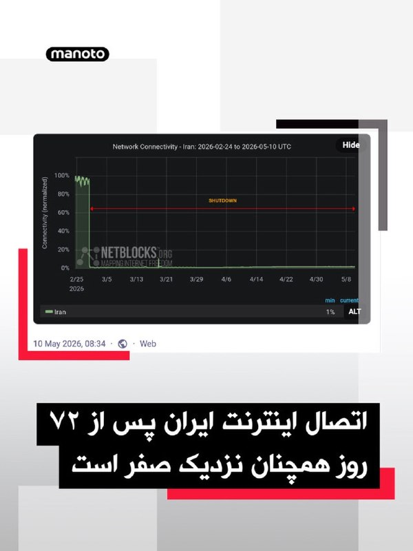

نت‌بلاکس اعلام کرد قطعی گسترده اینترنت در ایران پس از ۱۷۰۴ ساعت همچنان ادامه دارد و این محدودیت بی‌سابقه اکنون وارد سومین ماه خود شده است؛ در حالی که مقام‌های جمهوری اسلامی همچنان دسترسی عمومی به اینترنت بین‌المللی را برای مردم داخل ایران محدود نگه داشته‌اند.

## FarsiVOA — post 217347

  <a href="telegram/content/FarsiVOA_217347_1778424571.mp4" target="_blank">🎬 Download video</a>

ارتش اسرائیل اعلام کرد در هفته گذشته حدود ۷۰ موضع حزب‌الله را هدف قرار داده و بیش از ۳۰ نیروی حزب‌الله را حذف کرده است. این ارتش همچنین از رهگیری و انهدام چند موشک شلیک شده به سمت نیروهای اسرائیل در جنوب لبنان خبر داد.

## FarsiVOA — post 217346

🔺آغاز دومین جلسه دادگاه سران رژیم سابق سوریه؛ همه دارایی‌های بشار اسد مصادره شد

◾️خبرگزاری رسمی سوریه (سانا) روز یکشنبه ۲۰ اردیبهشت، گزارش داد که دادگاه جنایی سوریه، دومین جلسه محاکمه سران رژیم سابق این کشور را آغاز کرده است.

⬇️ بیشتر بخوانید:

https://ir.voanews.com/a/syria-bashar-alassad-court-criminal-political/8148477.html?withmediaplayer=1

## FarsiVOA — post 217345

در ادامه نشانه‌های بحران در بازار دارو، دبیر انجمن پیوند کلیه ایران از کاهش ذخایر دارویی و نایاب شدن برخی آنتی‌بیوتیک‌ها خبر داده و هشدار داده است که ادامه این وضعیت می‌تواند برای بیماران دیالیزی و پیوندی مشکل‌ساز شود.

فاطمه پوررضاقلی به‌طور مشخص درباره آنتی‌بیوتیک‌ها هشدار داده و گفته برخی از این داروها «بسیار نایاب» شده‌اند.

صدای آمریکا روز گذشته به نقل از منابع خود در بیمارستان‌ها و داروخانه‌ها گزارش داده بود دستورالعمل‌هایی برای کاهش مصرف سرم و آنتی‌بیوتیک ابلاغ شده و توزیع این اقلام در داروخانه‌ها با تأخیر و کمتر از میزان تقاضا انجام می‌شود.

گزارش کامل را در وب‌سایت صدای آمریکا بخوانید.

@FarsiVOA

## FarsiVOA — post 217344

رضا تقی‌زاده، چهره شناخته‌شده مشروطه‌خواهان پادشاهی‌خواه در عمق میدان به‌شدت از عملکرد رضا پهلوی انتقاد کرد و گفت او به سوگند ولیعهدی پشت کرده است

## FarsiVOA — post 217343

🔺سفر وزیر خزانه‌داری آمریکا به ژاپن و کره جنوبی در آستانه دیدار تاریخی پرزیدنت ترامپ و شی‌ جین‌پینگ

◾️وزیر خزانه‌داری آمریکا از سفر خود به ژاپن و کره جنوبی در آستانه نشست پرزیدنت ترامپ و رئیس جمهوری چین خبر داد.

⬇️ بیشتر بخوانید:

https://ir.voanews.com/a/scott-bessent-travel-china-south-korea-beijing-america-japan/8148484.html

## FarsiVOA — post 217342

🔺رسانه حکومتی «ایرنا» می‌گوید رژیم ایران پاسخ خود به پیشنهاد آمریکا را از طریق پاکستان ارسال کرده است

◾️خبرگزاری حکومتی «ایرنا» روز یکشنبه ۲۰ اردیبهشت گزارش داد که رژیم ایران پاسخ خود را به پیشنهاد ایالات متحده با هدف پایان دادن به جنگ دوماهه، از طریق پاکستان به‌عنوان میانجی به آمریکا ارسال کرده است.

⬇️ بیشتر بخوانید:

https://ir.voanews.com/a/irna-iran-response-to-us-pakistan/8148482.html

## FarsiVOA — post 217341

برملا شدن ابعاد تازه‌ای از ارتباط جمهوری اسلامی با حمله تروریستی ۷ اکتبر - گفت‌و‌گو با حسن هاشمیان

## FarsiVOA — post 217340

  <a href="telegram/content/FarsiVOA_217340_1778424574.mp4" target="_blank">🎬 Download video</a>

ارتش اسرائیل تصاویری از هدف قرار دادن فرد مظنون به کارگذاری مواد منفجره با همکاری میان اپراتور پهپاد و افسر تیپ کفیر در نوار غزه منتشر و تاکید کرد نیروی هوایی این ارتش «به‌طور مداوم به پشتیبانی از نیروهای رزمی در جبهه‌های مختلف، در عملیات‌های هجومی و دفاعی ادامه می‌دهد.»

## FarsiVOA — post 217339

  <a href="telegram/content/FarsiVOA_217339_1778424577.mp4" target="_blank">🎬 Download video</a>

فرماندهی مرکزی ایالات متحده، سنتکام، ویدیویی از سوخت‌رسانی هوایی به یک جنگنده اف‌۱۸ نیروی دریایی آمریکا در آسمان خاورمیانه منتشر کرد.

به گفته سنتکام، این جنگنده در حال گشت‌ بر فراز منطقه بود و سوخت مورد نیاز خود را از یک هواپیمای سوخت‌رسان کی-۱۳۵ نیروی هوایی آمریکا دریافت کرد.

@FarsiVOA

## FarsiVOA — post 217338

🔺هشدار قطر به جمهوری اسلامی: استفاده از تنگه هرمز به‌عنوان «ابزار فشار» بحران را عمیق‌تر می‌کند

◾️وزارت امور خارجه قطر روز یکشنبه ۲۰ اردیبهشت اعلام کرد نخست‌وزیر این کشور در گفت‌وگو با وزیر امور خارجه جمهوری اسلامی به او گفته است که استفاده از تنگه هرمز به‌عنوان «ابزار فشار» تنها به عمیق‌تر شدن بحران در خلیج فارس منجر خواهد شد.

⬇️ بیشتر بخوانید:

https://ir.voanews.com/a/qatar-iran-hormuz-strait-closing-crisis-increase/8148473.html

## FarsiVOA — post 217337

نت‌بلاکس، نهاد مستقل پایش اینترنت، اعلام کرد خاموشی اینترنت در ایران وارد هفتادودومین روز شده و اتصال کشور پس از بیش از ۱۷۰۴ ساعت همچنان در پایین‌ترین سطح قرار دارد.

به نوشته نت‌بلاکس، هیچ نشانه‌ای از بازگشت گسترده دسترسی دیده نمی‌شود و مقام‌ها همچنان از دسترسی عمومی مردم به اینترنت جهانی جلوگیری می‌کنند.

بحران اینترنت در ایران فقط یک اختلال فنی نیست. نت‌بلاکس از خاموشی ۷۲ روزه و نبود نشانه بازگشت دسترسی می‌گوید؛ دنیای اقتصاد از گران‌تر شدن مسیر اتصال پرسرعت می‌نویسد؛ مهر آن را مسئله حقوق شهروندی و تبعیض در دسترسی می‌داند؛ و گاردین از اثر آن بر اطلاع‌رسانی و ارتباط با منابع داخل ایران می‌گوید.

گزارش کامل را در وب‌سایت صدای آمریکا بخوانید.

@FarsiVOA

## FarsiVOA — post 217336

🔺انفجار بمب انتحاری جان دست کم ۱۵ پلیس پاکستان را گرفت

▪️انفجار بمب انتحاری در پاسگاه پلیس «فاتح خیل» ایالت خیبر پختونخوا پاکستان منجر به کشته شدن دست کم ۱۵ پلیس شد.

▪️فرمانده منطقه‌ای پلیس شهر «بنو» در مرز با افغانستان روز یکشنبه اعلام کرد که «تروریست‌ها با هدایت یک خودروی مملو از مواد منفجره به این پاسگاه، حمله را ترتیب دادند.»

▪️شدت انفجار خودرو مملو از مواد منفجره به حدی بوده که نه تنها پاسگاه پلیس کلاً ویران شده، بلکه ساختمان‌های اطراف نیز آسیب جدی دیده است.

⬇️ بیشتر بخوانید:
https://ir.voanews.com/a/8148466.html

## FarsiVOA — post 217335

  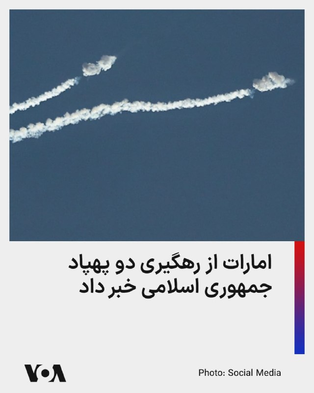

وزارت دفاع امارات متحده عربی اعلام کرد پدافند هوایی این کشور روز یکشنبه با دو پهپاد منتسب به جمهوری اسلامی مقابله کرده است.

بر اساس آمار منتشرشده از سوی وزارت دفاع امارات، حملات منتسب به جمهوری اسلامی از آغاز درگیری‌ها تاکنون به دوهزار و ۲۶۵ پهپاد، ۲۹ موشک کروز و ۵۵۱ موشک بالستیک رسیده است.

این اعلامیه در حالی منتشر شده که آتش‌بس میان آمریکا و جمهوری اسلامی همچنان شکننده توصیف می‌شود و کویت نیز از شناسایی پهپادهای «متخاصم» در حریم هوایی خود خبر داده بود.

امارات در روزهای گذشته نیز از مقابله با حملات موشکی و پهپادی منتسب به جمهوری اسلامی خبر داده بود؛ حملاتی که تهران دست‌کم بخشی از آن‌ها را رد کرده است.
@FarsiVOA

## FarsiVOA — post 217334

  <a href="telegram/content/FarsiVOA_217334_1778424578.mp4" target="_blank">🎬 Download video</a>

ارتش اسرائیل اعلام کرد نیروهای تیپ کفیر، تحت فرماندهی لشکر غزه، در ادامه عملیات پاکسازی در محدوده اردوگاه‌های مرکزی نوار غزه، در شرق خط زرد، دو مسیر زیرزمینی را منهدم کردند.

بر اساس اعلام ارتش اسرائیل، این دو مسیر تونلی در مجموع حدود دو کیلومتر طول داشتند و در جریان عملیات، چند اتاق اقامت و مقادیر مختلفی سلاح در داخل آنها شناسایی شد.

ارتش اسرائیل همچنین اعلام کرد نیروهایش در جریان جست‌وجوهای میدانی در این منطقه، ده‌ها راکت و مواد انفجاری را نیز کشف کرده‌اند.

طبق بیانیه ارتش اسرائیل، نیروهای فرماندهی جنوب همچنان بر اساس چارچوب توافق آتش‌بس در منطقه مستقر هستند و به عملیات برای رفع هرگونه تهدید فوری ادامه خواهند داد.
@FarsiVOA

## FarsiVOA — post 217333

  

ارتش کویت اعلام کرد بامداد یکشنبه چند پهپاد «متخاصم» را در حریم هوایی این کشور شناسایی و با آن‌ها مقابله کرده است. رویترز نوشته این نخستین حادثه از این نوع در کویت از زمان اجرای آتش‌بس جنگ با جمهوری اسلامی است. به گزارش رویترز، ارتش کویت جزئیات بیشتری درباره منشأ این پهپادها یا خسارت احتمالی منتشر نکرده است.

این حادثه در حالی رخ می‌دهد که آتش‌بس میان آمریکا و جمهوری اسلامی از ابتدا شکننده بوده است. رویترز در هشتم آوریل نوشته بود با وجود توافق دو هفته‌ای آتش‌بس، در همان روز نخست همچنان درگیری‌هایی جریان داشت و کشورهای حاشیه خلیج فارس، از جمله کویت، بحرین و امارات، از حملات موشکی و پهپادی گزارش داده بودند.

کویت پیش‌تر نیز گفته بود پدافند هوایی این کشور در جریان جنگ با موشک‌ها و پهپادهای جمهوری اسلامی مقابله کرده؛ از جمله موجی از پهپادها در هشتم آوریل که به گفته رویترز زیرساخت‌های حیاتی را هدف گرفته بود.

در روزهای اخیر نیز امارات متحده عربی از مقابله پدافند هوایی خود با دو موشک بالستیک و سه پهپاد جمهوری اسلامی خبر داده بود؛ حملاتی که به نوشته رویترز سه زخمی بر جا گذاشت.
@FarsiVOA

## FarsiVOA — post 217332

  

وزارت خارجه قطر اعلام کرد محمد بن عبدالرحمن آل‌ثانی، نخست‌وزیر و وزیر خارجه قطر، در دیداری در میامی با مارکو روبیو، وزیر خارجه آمریکا، و استیو ویتکاف، فرستاده ویژه دولت ترامپ، درباره تلاش‌های میانجی‌گرانه برای رسیدن به توافق میان واشنگتن و تهران گفت‌وگو کرده است.

به گفته وزارت خارجه قطر، در این دیدار آخرین تحولات منطقه و میانجی‌گری پاکستان برای کاهش تنش و تقویت امنیت و ثبات منطقه بررسی شد.

نخست‌وزیر قطر تأکید کرده همه طرف‌ها باید به تلاش‌های جاری میانجی‌گری پاسخ دهند تا مسیر برای رسیدگی به ریشه‌های بحران از راه گفت‌وگو و ابزارهای مسالمت‌آمیز باز شود.

تایمز اسرائیل نیز نوشته قطر در پشت صحنه به‌عنوان کانال ارتباطی میان واشنگتن و تهران عمل می‌کند، در حالی که پاکستان نقش اصلی میانجی‌گری را بر عهده دارد. این تلاش‌ها همزمان با مذاکرات درباره چارچوبی برای پایان جنگ و توافق گسترده‌تر میان آمریکا و ایران ادامه دارد.
@FarsiVOA

## FarsiVOA — post 217331

  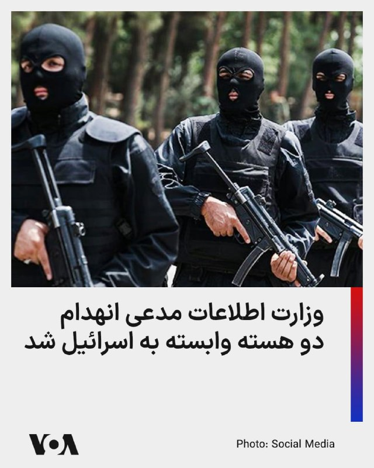

وزارت اطلاعات، از اصلی‌ترین بازوهای سرکوب جمهوری اسلامی، اعلام کرد دو هسته عملیاتی وابسته به موساد را در چند استان ایران شناسایی و منهدم کرده است.

بر اساس ادعای این وزارتخانه، یک هسته چهار نفره در استان آذربایجان غربی پیش از اجرای آنچه «عملیات تروریستی علیه مراکز حساس» و «ترور فردی در تهران» خوانده شده، شناسایی و بازداشت شده است. در این اطلاعیه آمده یک نفر نیز در جریان درگیری با نیروهای وزارت اطلاعات کشته شده است.

وزارت اطلاعات همچنین مدعی است هسته‌ای دیگر در استان‌های کرمان و البرز، پیش از انجام هرگونه اقدام، شناسایی و بازداشت شده است.

به گفته این وزارتخانه، از افراد بازداشت‌شده شماری ریزپرنده، خودروی مخصوص حمل‌ونقل، سه قبضه کلت کمری با صداخفه‌کن، جلیقه ضدگلوله، تفنگ وینچستر، تفنگ دوربین‌دار، مهمات و تجهیزات استارلینک کشف شده است.

در بخش دیگری از اطلاعیه، وزارت اطلاعات از بازداشت فردی با نام اختصاری «مسعود-ت» خبر داده که به گفته این نهاد قصد خروج اطلاعات طبقه‌بندی‌شده یک مرکز نظامی در قزوین از کشور را داشته است.
@FarsiVOA

## FarsiVOA — post 217330

  

مدیر عامل شرکت هواپیمایی سوئیس اینترنشنال می‌گوید فعلاً با کمبود فوری سوخت جت مواجه نیست، اما برنامه‌های اضطراری سوخت را بررسی می‌کند.

ینس فهلینگر در ادامه گفته است این شرکت برای شش هفته آینده ذخایر کافی سوخت جت در اختیار دارد و پیش‌بینی‌های تأمین‌کنندگان سوخت این شرکت در حال حاضر مثبت است.

بیش از ۷۰ درصد سوخت هواپیمای مصرفی اروپا از کشورهای عرب حاشیه خلیج فارس تامین می‌شود که به خاطر انسداد تنگه هرمز توسط جمهوری اسلامی مختل و قیمت آن در بازارهای اروپایی دو برابر شده است.
@FarsiVOA

## FarsiVOA — post 217329

  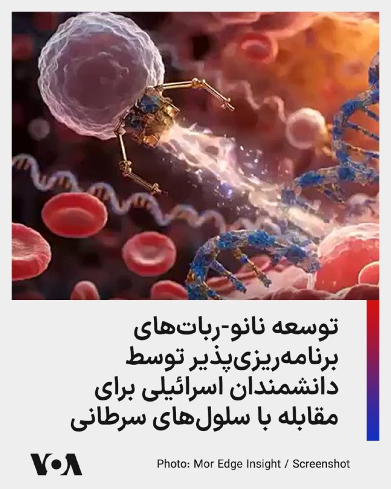

محققان دانشگاه «تکنیون» اسرائیل موفق به توسعه نانو-ربات‌هایی از جنس دی‌اِن‌اِی شده‌اند که می‌توانند مستقیماً در داخل بدن انسان به جنگ بیماری‌ها بروند.

این ماشین‌های برنامه‌ریزی‌پذیر تنها ۱۰۰ نانومتر عرض دارند و کاملاً از رشته‌های دی‌اِن‌اِی ساخته شده‌اند.

این نانو-ربات‌ها در جریان خون حرکت کرده، نشانگرهای سلول‌های سرطانی را شناسایی می‌کنند و سموم درمانی را فقط داخل تومور تخلیه می‌کنند؛ بدون اینکه کوچک‌ترین آسیبی به سلول‌های سالم برسد.

در آزمایش‌های اخیر بر روی سرطان‌های تهاجمی، این روش دقت و اثربخشی خیره‌کننده‌ای از خود نشان داده است.

تیم‌های تحقیقاتی همچنین در حال توسعه نانو-تکنولوژی مشابه‌ای برای ترمیم نورون‌های حرکتی هستند که می‌تواند تحولی بزرگ در درمان بیماری‌های عصبی سخت‌علاج مانند اِی‌اِل‌اِس ایجاد کند.

این نوآوری، بدن انسان را به میدان نبردی هوشمند علیه بیماری‌ها تبدیل کرده و مرزهای بین علم و تخیل را جابه‌جا کرده است.
@FarsiVOA

## FarsiVOA — post 217328

  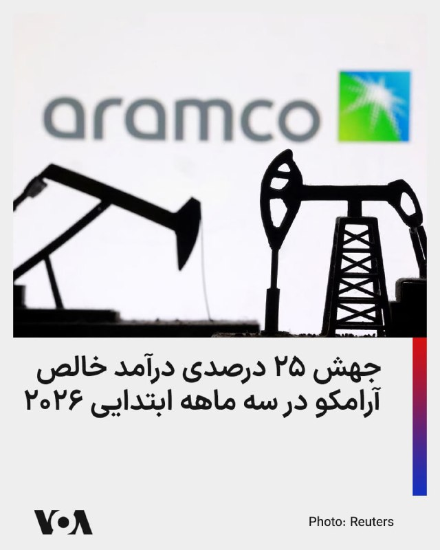

شرکت نفت عربستان سعودی، آرامکو، از جهش ۲۵ درصدی درآمد خالص خود در سه ماهه ابتدایی ۲۰۲۶ خبر داد. آرامکو می‌گوید در دوره یاد شده ۳۲.۵ میلیارد دلار درآمد خالص داشته است؛ موضوعی که نشان از انعطاف عربستان در ادامه صادرات نفت به رغم انسداد تنگه هرمز دارد.

امین ناصر، مدیرعامل شرکت آرامکو نیز به این موضوع اشاره کرده و گفته است ظرفیت صادرات روزانه نفت از طریق خط لوله شرق‌-غرب و مسیر دریای سرخ به هفت میلیون بشکه اوج گرفته است.

به رغم حملات جمهوری اسلامی به این کشور و انسداد تنگه هرمز، سرمایه‌گذاری‌های آرامکو دستخوش تغییر چندانی نشده و حدود ۱۲ میلیارد دلار در سه‌ماه ابتدایی امسال بوده است.
@FarsiVOA

## DW_Farsi — post 124527

🔶روسیه در "روز پیروزی" از پهپاد تهاجمی جدیدش رونمایی کرد

روسیه در رژه نظامی "روز پیروزی" در روز شنبه ۹ ماه مه (۱۹ اردیبهشت) برای نخستین بار از پهپاد سنگین انتحاری "گران−۵" خود رونمایی کرد.

این رژه نظامی که به مناسبت گرامی‌داشت هشتاد و یکمین سالگرد پیروزی اتحاد جماهیر شوروی سابق بر آلمان نازی در مسکو برگزار شد، برخلاف سال‌های گذشته، با نمایش تانک‌ها و تجهیزات سنگین نظامی روسیه همراه نبود.

در جریان این مراسم در مسکو، تصاویر این پهپاد جدید بر روی نمایشگرهای غول‌پیکر به نمایش گذاشته شد. در این تصاویر دیده می‌شد که سامانه تسلیحاتی مورد نظر با استفاده از منجنیق پرتاب می‌شود.

@dw_farsi

## DW_Farsi — post 124526

  

🔶ایران پاسخ خود به طرح پیشنهادی آمریکا را ارسال کرد

خبرگزاری ایرنا روز یکشنبه ۲۰ اردیبهشت (۱۰ مه) در خبری اختصاصی نوشت جمهوری اسلامی پاسخ خود به آخرین متن پیشنهادی آمریکا برای خاتمه جنگ را به میانجی پاکستانی ارسال کرده است.

ایرنا نوشته بر اساس طرح پیشنهادی، در این مرحله، مذاکرات متمرکز بر موضوع خاتمه جنگ خواهد بود.

پیش از این مارکو روبیو، وزیر خارجه آمریکا، روز جمعه ۸ مه (۱۸ اردیبهشت) در جریان سفر خود به ایتالیا گفته بود ایالات متحده انتظار دارد پاسخ ایران به پیشنهاد اخیر واشنگتن برای پایان دادن به جنگ را دریافت کند. روبیو گفته بود امیدوار است محتوای این پاسخ، زمینه را برای ورود به یک روند "جدی" مذاکراتی فراهم سازد.

به گفته برخی منابع خبری، بر اساس طرح پیشنهادی که توسط ایالات متحده ارائه شده است و در صورت پذیرش آن توسط ایران، جنگ رسما پیش از شروع مذاکرات در مورد مسائل مهم‌تری، از جمله برنامه هسته‌ای ایران، پایان می‌یابد.

@dw_farsi

## DW_Farsi — post 124525

  

🔶فشار بر زندانیان قزلحصار؛ از اعمال خشونت تا محرومیت از دارو و غذا

"سازمان حقوق بشر ایران" مستقر در نروژ از افزایش خشونت شدید علیه زندانیان محبوس در زندان قزلحصار و کمبود اقلام خوراکی و دارویی در این زندان خبر داد.

در گزارش این سازمان حقوق بشری از جمله آمده است: «تعدادی از زندانیان واحد ۴ این زندان با لوله‌های پلی‌اتیلن مورد ضرب‌وجرح شدید قرار گرفته‌اند و زندانبا‌ن‌هایی با سابقه اعمال خشونت علیه زندانیان به این واحد منتقل شده‌اند.»

در این گزارش از احمد ترکمان، افسر نگهبان واحد ۲ زندان قزل‌حصار نام برده شده که به اعمال خشونت مشهور است و شخصا در مقابل چشمان شماری از زندانیان، یک زندانی تبعه افغانستان به نام عبدالعهد تورن ان‌شاءالله را "با لوله پلی‌اتیلن سه اینچی مورد ضرب‌وجرح شدید" قرار داده است.

همچنین زندانیان واحد ۳ زندان قزل‌حصار با فشارهای شدید معیشتی مواجه هستند و دسترسی محدودی به امکانات درمانی دارند؛ قیمت اقلام خوراکی چند برابر شده و حتی آب معدنی هم نایاب است.

@dw_farsi

## DW_Farsi — post 124524

  

🔶پزشکیان: مذاکره به معنای تسلیم نیست، هدف احقاق حقوق مردم است

مسعود پزشکیان، رئیس جمهور ایران، روز یکشنبه ۲۰ اردیبهشت (۱۰ مه) در جلسه کارگروه بازسازی خسارات ناشی از جنگ گفت مردم باید با واقع‌بینی شرایط کشور و محدودیت‌های موجود را درک کنند.

پزشکیان افزود: «ملت ایران در برابر دشمن هرگز سر خم نخواهد کرد و اگر سخنی از گفت‌و‌گو یا مذاکره مطرح می‌شود، معنای آن تسلیم یا عقب‌نشینی نیست، بلکه هدف، احقاق حقوق ملت ایران و دفاع مقتدرانه از منافع ملی است.»

رئیس دولت چهاردهم جمهوری اسلامی، ماندن و ایستادگی در چنین شرایطی را "از شهادت نیز دشوارتر" دانست و گفت: «مردمی که با صبر، مقاومت و تحمل در میدان باقی مانده‌اند، در حقیقت در حال انجام جهاد اکبر هستند.»

بسیاری این سخنان را زمینه‌چینی برای پذیرش تصمیمات اتخاذشده از سوی حکومت در مذاکره و گفت‌وگو با آمریکا می‌دانند؛ به ویژه پذیرش از سوی پایگاه هواداران افراطی حکومت که مخالف هرگونه مذاکره و طرفدار ادامه تنش و جنگ با آمریکا و اسرائیل هستند.

@dw_farsi

## DW_Farsi — post 124523

  

🔶گزارش رسانه‌های ایران از دیدار فرمانده قرارگاه خاتم با مجتبی خامنه‌ای

خبرگزاری ایسنا روز یکشنبه ۱۰ مه (۲۰ اردیبهشت) گزارش داد که علی عبداللهی، فرمانده قرارگاه خاتم‌الانبیای سپاه پاسداران با مجتبی خامنه‌ای دیدار کرده و گزارشی از آمادگی‌های نیروهای مسلح جمهوری اسلامی به رهبر جدید جمهوری اسلامی ارائه کرده است.

آنطور که در این گزارش آمده، فرمانده قرارگاه خاتم‌الانبیا به مجتبی خامنه‌ای اطمینان داده که "نیروهای مسلح تا آخرین نفس از آرمان‌های انقلاب اسلامی، ایران، حاکمیت و منافع ملی و ملت غیرتمند و شجاع ایران دفاع خواهند کرد".

ایسنا ادعا کرده که در اين ديدار مجتبی خامنه‌ای "تدابیر جدید و راهگشایی برای مقابله با دشمن" به عبداللهی ابلاغ کرده است.

این در حالی است که از زمان کشته شدن علی خامنه‌ای در حملات اسرائیل و آمریکا به محل بیت رهبری در تهران، هیچگونه پیام صوتی یا تصویری و عکس جدیدی از مجتبی خامنه‌ای منتشر نشده و گمانه‌زنی‌های بسیاری درباره وضعیت سلامتی و یا حتی زنده‌بودن یا نبودن او در جریان است.

@dw_farsi

## DW_Farsi — post 124522

  <a href="telegram/content/DW_Farsi_124522_1778424588.mp4" target="_blank">🎬 Download video</a>

🎥سه شهر و یک دنیا تاریخ؛ آلمان در آینه جنگ

نام برخی شهرهای آلمان هم با تحولات تاریخی مثبت در دوران رشد و شکوفایی علم و اندیشه و سیاست گره خورده، هم با روزهای سیاه رژیم ترور رایش سوم به رهبری آدولف هیتلر.

@dw_farsi

## DW_Farsi — post 124521

  

🔶۷۲ روز قطعی اینترنت و سکوت دیجیتال در ایران

قطعی و محدودیت گسترده اینترنت در ایران وارد هفتادودومین روز خود شد؛ وضعیتی که بنا بر داده‌های نت بلاکس، نهاد ناظر بر وضعیت دسترسی به اینترنت در جهان، همچنان بدون نشانه‌ای از بازگشت پایدار ارتباطات ادامه دارد.

بر اساس این داده‌ها، اتصال اینترنت در ایران پس از ۱۷۰۴ ساعت همچنان قطع است. این اختلال گسترده اکنون وارد سومین ماه پیاپی شده و از آن به‌عنوان یکی از طولانی‌ترین دوره‌های محدودیت اینترنت نه تنها در ایران بلکه در جهان یاد می‌شود.

این در حالی است که اینترنت در ایران پیش از شروع جنگ نیز در زمان اعتراضات دی‌ماه ۱۴۰۴ با یک قطعی گسترده روبرو بود و به فاصله کوتاهی پس از آغاز حملات آمریکا و اسرائیل، جمهوری اسلامی مجددا ایران را در یک خاموشی دیجیتال فرو برد.

@dw_farsi

## DW_Farsi — post 124520

🔶آلمان از سقف سهم مصرف از منابع طبیعی در سال ۲۰۲۶ عبور کرد

از منظر آمار، آلمان منابع طبیعی مورد نیاز برای کل سال ۲۰۲۶ را از روز یکشنبه ۱۰ مه (۲۰ اردیبهشت) به پایان رسانده است.

سازمان محیط زیستی "شبکه ردپای جهانی" (Global Footprint Network)، اصطلاحا " روز اضافه‌برداشت زمین " را سالانه برای کشورهای مختلف و همچنین برای کل سیاره محاسبه می‌کند.

اگر همه مردم جهان به اندازه ساکنان آلمان منابع طبیعی مصرف و دی‌اکسید کربن تولید می‌کردند، ظرفیت زیستی سالانه زمین همین حالا، در یک‌سوم نخست سال ۲۰۲۶، به پایان می‌رسید.

@dw_farsi

## DW_Farsi — post 124519

🔸تلاش آلمان برای خرید موشک‌های تاماهاک از آمریکا

به گزارش فایننشال تایمز، پس از لغو قرار استقرار موشک‌های تاماهاک در آلمان از سوی آمریکا، دولت آلمان قصد دارد برای خریداری این موشک‌های کروز از ایالات متحده تلاش کند.

این روزنامه بریتانیایی به نقل از منابع آگاه گزارش داده که دولت آلمان امیدوار است بتواند واشنگتن را به فروش این تسلیحات، همراه با سامانه پرتابگر زمینی موشکی "تایفون" مرتبط با آن، متقاعد کند.

بر اساس این گزارش، بوریس پیستوریوس، وزیر دفاع آلمان، قصد دارد برای پیگیری خرید این سامانه‌های دوربرد به واشنگتن سفر کند.

آلمان در ماه ژوئیه سال گذشته درخواست خرید سامانه تایفون را ارائه کرده بود، اما آمریکا تاکنون به این درخواست پاسخی نداده است.

با این حال، به نوشته فایننشال تایمز، سفر پیستوریوس به آمریکا بستگی به این دارد که آیا او بتواند دیداری با پیت هگست، همتای آمریکایی خود، ترتیب دهد یا نه.

این روزنامه می‌نویسد با توجه به تیرگی روابط میان دونالد ترامپ، رئیس جمهور آمریکا، و فریدریش مرتس، صدراعظم آلمان، در پی جنگ ایران، چنین دیداری قطعی به نظر نمی‌رسد.

تاکنون نیز هیچ واکنشی از سوی کاخ سفید، وزارت دفاع آمریکا یا وزارت دفاع آلمان در این خصوص منتشر نشده است.

@dw_farsi

## DW_Farsi — post 124518

  

🔸دادستانی تهران علیه صادق زیباکلام و عباس عبدی اعلام جرم کرد

خبرگزاری قوه قضائیه روز یکشنبه ۲۰ اردیبهشت اعلام کرد که دادستانی تهران علیه صادق زیباکلام، استاد پیشین دانشگاه و عباس عبدی، روزنامه‌نگار و فعال سیاسی اعلام جرم کرده است. در اطلاعیه قوه قضائیه آمده است، یادداشت اخیر عبدی در روزنامه "اعتماد" و مصاحبه زیباکلام با خبرگزاری "آنا" دلیل اعلام جرم علیه آنان بوده است.

عباس عبدی ۱۶ اردیبهشت در یادداشت خود برای اعتماد در مورد "جعل خبر" به ویژه از سوی برخی چهره‌‌های تندرو در مجلس شورای اسلامی هشدار داده و نوشته بود: «این افراد تحت نام نمایندگی هر چه بخواهند می‌گویند و کسی هم در مقام اصلاح آنها برنمی‌آید.»

صادق زیباکلام نیز در مصاحبه‌اش با خبرگزاری آنا که ۱۷ اردیبهشت منتشر شد، با انتقاد از "آمریکاستیزی" و بیان اینکه "چه شد که آمریکاستیزی و مرگ بر آمریکا تبدیل به ایدئولوژی جمهوری اسلامی شد" گفته بود: «شماها همیشه کیفرخواستتان علیه آمریکا یک‌سویه هست؛ هیچ وقت نگاه نکردید که ما چه کار کردیم؛ شما می‌گویید که آمریکایی‌ها ایرباس را زدند ولی هیچ‌وقت نیامدید بگویید که چه شد که ایرباس زده شد؟»

@dw_farsi

## DW_Farsi — post 124517

  

🔸عاصم منیر: پاکستان به تلاش‌های میانجی‌گرانه بین ایران و آمریکا ادامه می‌دهد

عاصم منیر، فرمانده ارتش پاکستان، روز یکشنبه اظهار داشت، اسلام‌آباد به تلاش‌های میانجی‌گرانه خود میان تهران و واشنگتن ادامه خواهد داد.

او در جریان یک سخنرانی به مناسبت اولین سالگرد جنگ سه‌‌روزه میان پاکستان و هند گفت: «ما تمام تلاش خود را برای موفقیت این میانجی‌گری به کار خواهیم گرفت و به این کار ادامه خواهیم داد.»

عاصم منیر که گفته می‌شود روابط دوستانه‌ای با دونالد ترامپ، رئیس جمهور آمریکا دارد، تأکید کرد پاکستان در تلاش است به صلحی پایدار در جنگ آمریکا و اسرائیل علیه ایران که بخش بزرگی از منطقه را درگیر کرده، دست یابد.

در همین حال پاکستان و قطر با انتشار بیانیه‌هایی از گفت‌وگوی تلفنی میان نخست‌وزیر قطر و نخست‌وزیر پاکستان خبر دادند. در این بیانیه گفته شده است که دو طرف درباره آخرین تحولات منطقه و همچنین تلاش‌های میانجی‌گرانه پاکستان رایزنی کرده‌اند.

@dw_farsi

## DW_Farsi — post 124516

🔸جنگ ایران؛ ساخت "پایگاهی مخفی" توسط اسرائیل در صحرای عراق

به نوشته روزنامه وال‌استریت ژورنال، اسرائیل پیش از آغاز جنگ با ایران در نهم اسفند ۱۴۰۴، یک پایگاه نظامی مخفی در بیابان غربی عراق ساخته بود؛ پایگاهی که به عنوان مرکز لجستیکی برای نیروی هوایی اسرائیل و محل استقرار نیروهای ویژه و تیم‌های تجسس و نجات عمل می‌کرد.

این روزنامه آمریکایی در گزارشی که شنبه ۹ مه (۱۹ اردیبهشت) منتشر شد، به نقل از منابع آگاه، از جمله مقام‌های آمریکایی، نوشت که این پایگاه اندکی پیش از آغاز عملیات "غرش شیران" ساخته شده؛ عملیاتی که با مشارکت آمریکا و اسرائیل علیه ایران آغاز شد.

بر اساس این گزارش، هدف از ایجاد این پایگاه، نزدیکتر کردن اسرائیل به میدان نبرد و فراهم کردن امکان واکنش سریع در صورت سرنگونی احتمالی خلبانان اسرائیلی بر فراز خاک ایران یا دیگر مناطق بوده است. به گفته این منابع، نیروهای ویژه نیروی هوایی اسرائیل که برای عملیات کماندویی در خاک دشمن آموزش دیده‌اند، در این پایگاه حضور داشته‌اند.

وال‌استریت ژورنال همچنین گزارش داده است که گرچه هیچ جنگنده اسرائیلی در جریان این جنگ سرنگون نشد، اما هنگام سقوط یک جنگنده اف-۱۵ آمریکایی در نزدیکی اصفهان، اسرائیل پیشنهاد کمک برای عملیات نجات را مطرح کرده بود؛ هرچند در نهایت نیروهای آمریکایی خود خدمه این هواپیما را نجات دادند.

به نوشته این روزنامه، محل این پایگاه مخفی نزدیک بود در اوایل ماه مارس گذشته فاش شود. رسانه‌های عراقی در آن زمان گزارش داده بودند که یک چوپان محلی فعالیت‌های غیرعادی، از جمله پرواز بالگردها و تیراندازی، را در منطقه‌ای دورافتاده مشاهده کرده و موضوع را به نیروهای امنیتی اطلاع داده است.

در پی این گزارش، نیروهای عراقی برای بررسی به منطقه اعزام شده‌اند. اما به گفته منابعی که وال‌استریت ژورنال با آنها گفت‌وگو کرده، اسرائیل برای جلوگیری از نزدیک شدن نیروهای عراقی، حملاتی هوایی علیه آنان انجام داده است.

@dw_farsi

## DW_Farsi — post 124515

  

🔸اسرائیل دو فعال حقوق بشری ناوگان کمک‌رسانی به غزه را اخراج کرد

اسرائیل روز یکشنبه ۱۰ مه از اخراج دو فعال حقوق بشری خبر داد. به گفته وزارت خارجه اسرائیل، سیف ابو کِشِک، شهروند اسپانیا و تیاگو آویلا، شهروند برزیل که سوار بر یک ناوگان بین‌المللی سعی در شکستن محاصره نوار غزه از طریق دریا را داشتند، پس از بازداشت و انتقال به اسرائیل از این کشور اخراج شدند.

طبق این گزارش، این دو نفر که بخشی از دومین "ناوگان همبستگی جهانی صمود" بودند ۱۲ آوریل از اسپانیا به سمت غزه راه افتاده بودند. این دو ۲۹ آوریل در آب‌های بین‌المللی بازداشت و به اسرائیل منتقل شده بودند.

وزارت خارجه اسرائیل گفته است که سیف ابو کشک که اصالتا یک فلسطینی و مظنون به ارتباط با یک سازمان تروریستی است و تیاگو آویلا نیز مظنون به فعالیت غیرقانونی است.

این افراد با رد اتهامات مطرح شده از سوی اسرائیل گفته‌اند که در چارچوب یک مأموریت بشردوستانه برای غیرنظامیان غزه فعالیت می‌کردند و بازداشتشان در آب‌های بین‌المللی غیرقانونی بوده است.

اسپانیا پیش‌تر خواستار آزادی فوری ابو کشک شده بود.

@dw_farsi

## DW_Farsi — post 124514

  

🔸جهش چشمگیر سود شرکت نفت آرامکو در سه ماهه نخست سال ۲۰۲۶

شرکت نفت عربستان سعودی، آرامکو، روز یکشنبه دهم مه (۲۰ اردیبهشت) اعلام کرد که سود خالص این شرکت در سه‌ماهه نخست سال ۲۰۲۶ نسبت به مدت مشابه سال گذشته ۲۵.۵ درصد افزایش یافته است.

آرامکو که بزرگ‌ترین صادرکننده نفت جهان به شمار می‌رود، در بیانیه‌ای که در وب‌سایت بورس عربستان منتشر شد اعلام کرد که افزایش درآمد این شرکت "عمدتاً به دلیل افزایش قیمت‌ها و حجم فروش محصولات پالایش‌شده و شیمیایی، همچنین افزایش حجم فروش نفت خام و رشد قیمت نفت خام" ناشی از جنگ در خاورمیانه بوده است.

قیمت نفت در سه‌ماهه نخست امسال از حدود ۶۰ دلار در اوایل فوریه به بیش از ۱۰۰ دلار در هر بشکه در ماه مارس افزایش یافت. بسته شدن تنگه هرمز توسط ایران باعث ایجاد بحران جهانی انرژی شد و بازارهای جهانی در حال حاضر با عدم قطعیت درباره روند جنگ آمریکا و اسرائیل علیه ایران مواجه هستند.

آمریکا همچنان در انتظار پاسخ ایران به درخواست یک صفحه‌ای واشنگتن درباره توافق بر سر پایان جنگ است.

@dw_farsi

## DW_Farsi — post 124513

  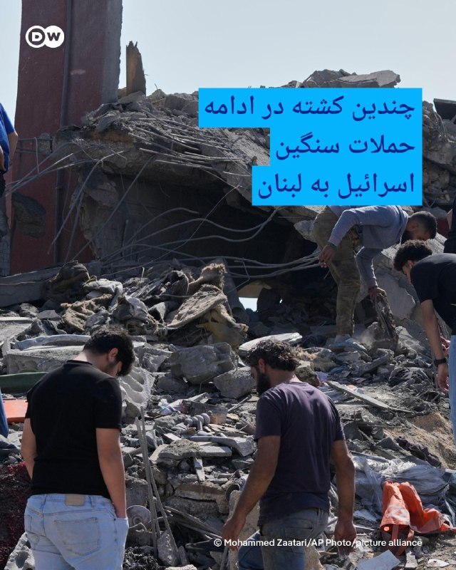

🔸چندین کشته در ادامه حملات سنگین اسرائیل به لبنان

ارتش اسرائیل روز یکشنبه دهم مه (۲۰ اردیبهشت) اعلام کرد، در حملات هوایی دو روز گذشته جنوب لبنان بیش از ده عضو حزب‌الله کشته و حدود ۴۰ مکان مورد استفاده این گروه شبه نظامی مورد حمایت جمهوری اسلامی، از جمله انبارهای تسلیحات و یک موشک‌انداز هدف قرار گرفتند.

در همین حال به گفته ارتش اسرائیل، دو پهپاد شلیک‌شده از سوی حزب‌الله صبح روز یکشنبه بر فراز مناطقی در جنوب لبنان که نیروهای اسرائیل در آنجا مستقر هستند، رهگیری و منهدم شدند.

شبکه خبری المیادین، وابسته به حزب‌الله لبنان گزارش داد که در حملات روز شنبه اسرائیل به جنوب لبنان حدود ۲۶ تن کشته شدند.

شبکه خبری الجزیره در گزارشی از کشته شدن دستکم ۲۴ تن در جنوب لبنان در پی حملات اسرائیل در روز شنبه خبر داد و با استناد به آمار ارائه‌شده توسط وزارت بهداشت لبنان نوشت، از ۱۶ آوریل تا کنون ۵۰۰ نفر در این کشور در پی حملات نیروهای اسرائیلی کشته شده‌اند.

این گزارش شمار کل کشته‌شدگان از زمان آغاز بمباران لبنان توسط اسرائیل در دوم مارس را بیش از ۲۷۵۹ نفر اعلام کرده است.

@dw_farsi

## DW_Farsi — post 124512

  

🔸نیویورک تایمز: روسیه از طریق دریای خزر قطعات پهپاد برای ایران ارسال می‌کند

روزنامه نیویورک تایمز روز شنبه نهم مه (۱۹ اردیبهشت) در گزارشی به نقل از مقامات آمریکایی نوشت که روسیه با دور زدن محاصره تنگه هرمز، از دریای خزر برای ارسال قطعات پهپاد به ایران استفاده می‌کند و از این طریق به جمهوری اسلامی برای بازسازی توان تهاجمی‌اش کمک می‌رساند.

در این گزارش آمده است که پس از محاصره دریایی بنادر جنوبی ایران توسط آمریکا، دریای خزر اکنون به یک مسیر حیاتی تجاری میان این دو متحد تبدیل شده است و روسیه در حال حاضر کالاهایی را که به‌طور سنتی از طریق تنگه هرمز منتقل می‌شدند، به بنادر حاشیه دریای خزر ارسال می‌کند.

این گزارش می‌گوید که رصد تجارت در دریای خزر از فاصله دور دشوار است و تنها پنج کشوری که با این دریا هم‌مرز هستند به آن دسترسی دارند. به نوشته نیویورک تایمز، کشتی‌هایی که به‌طور منظم در این مسیر رفت‌وآمد می‌کنند، سیستم‌های ردیابی خود را خاموش می‌کنند.
@dw_farsi

## DW_Farsi — post 124511

🔸پوتین شرودر، صدراعظم اسبق آلمان را به عنوان میانجی مطرح کرد

ولادیمیر پوتین، رئیس جمهور روسیه، گرهارد شرودر، صدراعظم اسبق آلمان، را که سال‌هاست با او دوستی نزدیکی دارد، به عنوان میانجی مورد نظر خود در جنگ میان روسیه و اوکراین مطرح کرده است.

پوتین شنبه ۹ مه پس از رژه پیروزی به مناسبت پایان جنگ جهانی دوم در مسکو، در یک کنفرانس خبری گفت که گرچه آمریکا برای میانجی‌گری تلاش کرده، اما او از میان سیاستمداران اروپایی، می‌تواند گرهارد شرودر، رهبر پیشین حزب سوسیال دموکرات آلمان، را به عنوان میانجی تصور کند.

پوتین اعلام کرد: «از میان همه سیاستمداران اروپایی، گفت‌وگو با شرودر را ترجیح می‌دهم.»

شرودر به دلیل نزدیکی‌اش به پوتین و شرکت‌های روسی، بارها هدف انتقادهای شدید قرار گرفته است. صدراعظم اسبق آلمان اواخر ژانویه گذشته، در یادداشتی برای "برلینر تسایتونگ"، تجاوز نظامی روسیه علیه اوکراین را مغایر حقوق بین‌الملل توصیف کرد، اما در عین حال افزود: «با شیطان‌سازی از روسیه به عنوان دشمنی ابدی نیز مخالفم.»

ولادیمیر پوتین در کنار انتقاد شدید از حمایت اروپا از اوکراین، تأکید کرد که برای گفت‌وگوی مستقیم با ولودیمیر زلنسکی، رئیس جمهور اوکراین، آماده است، البته به این شرط که زلنسکی به مسکو برود. زلنسکی پیش‌تر چنین سفری را رد کرده بود.

روسیه و اوکراین از دیروز شنبه ۹ ماه مه (۱۹ اردیبهشت) به ابتکار دونالد ترامپ، رئیس جمهور آمریکا، بر سر آتش‌بسی سه روزه تا ۱۱ مه، به همراه تبادل هزار اسیر جنگی از هر دو طرف، توافق کرده‌اند.

@dw_farsi

## DW_Farsi — post 124510

  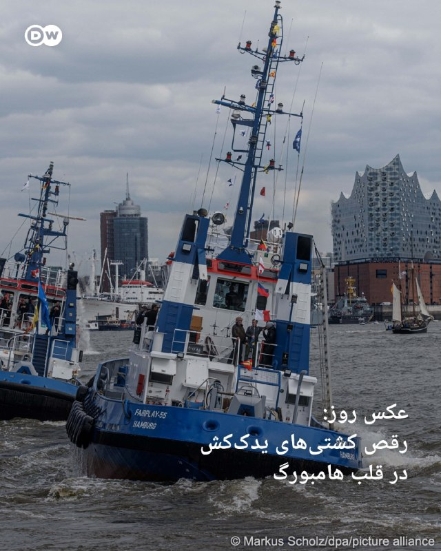

📸عکس روز: رقص کشتی‌های یدک‌کش در قلب هامبورگ

۸۳۷ سال از تأسیس بندر هامبورگ می‌گذرد و به همین مناسبت کشتی‌های یدک‌کش چنان بر فراز رودخانه "البه" می‌لغزند که گویی برای رقصی مشترک با هم قرار گذاشته‌اند. آن‌ها با هماهنگی ظریف و برازنده خود خطوطی پرشور و مواج را بر پهنه آب ترسیم می‌کنند. در پس‌زمینه این صحنه، فرهنگسرا و تالار کنسرت ‌فیلارمونی هامبورگ دیده می‌شود که همچون رهبر ارکستر بر باله یدک‌کش‌ها در این دومین شهر بزرگ آلمان نظاره می‌افکند.

@dw_farsi

## DW_Farsi — post 124509

  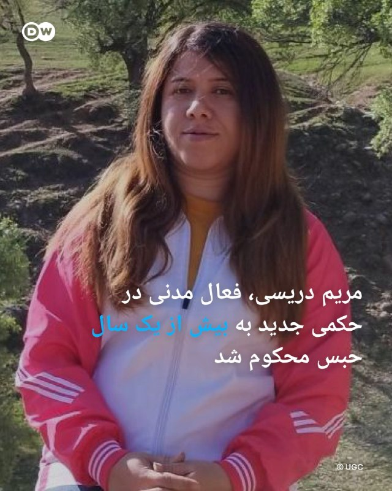

🔸مریم دریسی، فعال مدنی در حکمی جدید به بیش از یک سال حبس محکوم شد

دادگاه انقلاب شیراز در حکمی تازه مریم دریسی، فعال مدنی اهل کازرون، را به یک سال و سه ماه حبس تعزیری محکوم کرد.

به گزارش سایت حقوق بشری هرانا، این حکم به اتهام "تبلیغ علیه نظام" برای مریم دریسی صادر و در حالی به وکیل او ابلاغ شده است که حداکثر مجازات قانونی این اتهام یک سال حبس است اما دادگاه با استناد به مقررات تکرار جرم، مجازات او را تشدید کرده است.

مریم دریسی اسفندماه سال گذشته با تودیع وثیقه آزاد شده بود. دادگاه کیفری کازرون ۲۴ فروردین امسال در حکمی غیابی او را به اتهام "اخلال در نظم و آسایش عمومی" به یک سال حبس و ۷۴ ضربه شلاق محکوم کرده بود.

در متن دادنامه صادر شده علیه این فعال مدنی که هرانا تصویر آن را منتشر کرده، "شعار دادن‌های هنجارشکنانه و تشویق نمودن مردم جهت دست زدن و کل کشیدن به قصد تحریک جمعیت حاضر و کنترل جمعیت در مراسم" یادبود بهنام عنایت، از جانباختگان اعتراضات دی‌ماه ۱۴۰۴، از مصادیق اتهامات مطروحه علیه این فعال مدنی عنوان شده است.

@dw_farsi

## DW_Farsi — post 124503

🔸چه کسانی از جنگ در ایران سود می‌برند؟

🔻گزارشی از آتفه چهارمحالیان

با ادامه درگیری‌های نظامی میان ایران، آمریکا و اسرائیل و هم‌زمان با تشدید بحران‌های اقتصادی و سیاسی در ایران پرسش درباره این‌که هزینه‌های جنگ بر دوش چه کسانی قرار می‌گیرد و چه بخش‌هایی از ساختار قدرت از این وضعیت سود می‌برند، به یکی از موضوعات بحث‌برانگیز اقتصاد سیاسی کشور تبدیل شده است.

مهرداد وهابی، پژوهشگر ، نویسنده و استاد اقتصاد دانشگاه سوربن شمالی فرانسه در گفت‌وگو با دویچه وله به تعدادی از پرسش‌های جاری در فضای عمومی درباره پیامدهای اقتصادی جنگ پاسخ داده است. به باور او، اقتصاد ایران پیش از جنگ نیز با تورم مزمن، شوک‌های ارزی، کاهش ارزش ریال و کسری بودجه روبه‌رو بوده، اما شرایط جنگی این بحران‌ها را تشدید کرده است.

از منظر این اقتصاددان، در حالی که بخش بزرگی از جامعه، نیروی کار و دولت رسمی ایران از پیامدهای جنگ آسیب دیده‌اند، نهادهای وابسته به بخش ولایی و سپاه پاسداران انقلاب اسلامی از افزایش قیمت نفت، تجارت موازی و تمرکز بیشتر منابع اقتصادی سود برده‌اند.

@dw_farsi

## Persian_Trend_Official — post 13829

⭕️ رئیس انرژی: پارسال 9 هزار مگاوات کمبود برق داشتیم و امسال 24 هزارمگاوات؛ مردم برای قطعی های برق در هر 7 روز هفته خودشونو آماده کنن.

📝 Nick

📌 @persian_trend_official
پرشین ترند | متفاوت‌ترین کانال نظامی

## Persian_Trend_Official — post 13828

  <a href="telegram/content/Persian_Trend_Official_13828_1778424598.webm" target="_blank">🎬 Download video</a>

دونالد ترامپ : نگفتم عملیات نظامی علیه ایران پایان یافته، بلکه گفتم آن‌ها شکست خورده‌اند !!!

📌 @persian_trend_official
پرشین ترند | متفاوت‌ترین کانال نظامی

## Persian_Trend_Official — post 13827

  <a href="telegram/content/Persian_Trend_Official_13827_1778424598.mp4" target="_blank">🎬 Download video</a>

🔴ویدیویی از آماده سازی پهپاد های فیبر نوری 💢در چند وقت اخیر FPV های فیبر نوری حزب الله سر صدا زیادی به راه انداخته لذا این ویدیو جهت افزایش اطلاعات علاقه مندان بارگذاری میشود ▪️پهپاد انتحاری از نوع fpv فیبر نوری، با هدف مقابله با جنگ الکترونیک و اخلال‌گرها…

## Persian_Trend_Official — post 13826

تصمیم گرفتم لایو های شبانه رو از این به بعد، حدود ساعت 20 به وقت ایران اجرا کنم .

## Persian_Trend_Official — post 13825

  

در ساعات گذشته چندین پهپاد انتحاری به سوی کشور امارات کویت قطر پهپاد شلیک شد .
همچنین یککشتی باربریِ متعلق به کره‌جنوبیخ تو تنگه هرمز با دو تا پهپادِ ناشناس هدف گرفته شده است.

☆Phantom☆

📌 @persian_trend_official
پرشین ترند | متفاوت‌ترین کانال نظامی

## Persian_Trend_Official — post 13824

  

⭕️ ایرنا؛
🔸پاسخ ایران به متن پیشنهادی آمریکا ارسال شد

🔹پاسخ جمهوری اسلامی ایران به آخرین متن پیشنهادی آمریکا برای خاتمه جنگ، امروز به میانجی پاکستانی ارسال شد.

🔹سخنگوی وزارت خارجه قبلا چند بار اعلام کرده بود دیدگاه‌ها و ملاحظات ایران راجع به پیشنهادهای آمریکا، بعد از تکمیل بررسی‌ها و جمع‌بندی نهایی، ارسال خواهد شد.

🔹بر اساس طرح پیشنهادی، در این مرحله مذاکرات متمرکز بر موضوع خاتمه جنگ در منطقه خواهد بود.

🫆:Tony

📌 @persian_trend_official
پرشین ترند | متفاوت‌ترین کانال نظامی

## Persian_Trend_Official — post 13823

  

🔴 گزارش‌ها از اعزام گسترده هواپیماهای ترابری سنگین آمریکا به خاورمیانه

💢برخی منابع از پرواز و اعزام ۱۳ فروند هواپیمای ترابری نظامی سنگین ارتش آمریکا از پایگاه‌های اروپایی به سمت خاورمیانه طی ساعات اخیر خبر می‌دهند.

🫆:Tony

📌 @persian_trend_official
پرشین ترند | متفاوت‌ترین کانال نظامی

## Persian_Trend_Official — post 13822

  <a href="telegram/content/Persian_Trend_Official_13822_1778424603.mp4" target="_blank">🎬 Download video</a>

🔴ویدیویی از آماده سازی پهپاد های فیبر نوری

💢در چند وقت اخیر FPV های فیبر نوری حزب الله سر صدا زیادی به راه انداخته لذا این ویدیو جهت افزایش اطلاعات علاقه مندان بارگذاری میشود

▪️پهپاد انتحاری از نوع fpv فیبر نوری، با هدف مقابله با جنگ الکترونیک و اخلال‌گرها طراحی شده؛ جایی که پهپادهای عادی معمولاً کور و قطع می‌شوند.

▪️این پهپاد به‌جای ارتباط رادیویی، از کابل فیبر نوری استفاده می‌کند و همین موضوع باعث می‌شود عملاً در برابر جمینگ و اختلال الکترونیکی مقاوم باشد.

▪️این پهپاد هاتوان نفوذ دقیق به مواضع، سنگرها و خودروهای زرهی را دارد و به دلیل تأخیر بسیار کم در انتقال تصویر، کنترل‌پذیری بالایی در لحظات آخر حمله فراهم می‌کند.

💢استفاده گسترده از پهپادهای فیبر نوری در جنگ اوکراین، توجه بسیاری از ارتش‌ها و گروه‌های نظامی از جمله حزب الله را به این فناوری جلب کرده است.

🫆:Tony

📌 @persian_trend_official
پرشین ترند | متفاوت‌ترین کانال نظامی

## Persian_Trend_Official — post 13821

  <a href="telegram/content/Persian_Trend_Official_13821_1778424605.webm" target="_blank">🎬 Download video</a>

منابع عراقی به روزنامه العربی الجدید گفتند که اسماعیل قاآنی فرمانده نیروی قدس سپاه ایران طی سفری رسمی وارد بغداد شد. این دومین سفر او به بغداد در کمتر از یک ماه است.
🇮🇷🇮🇶
☆Phantom☆

📌 @persian_trend_official
پرشین ترند | متفاوت‌ترین کانال نظامی

## Persian_Trend_Official — post 13820

🔴ادعای دفاع هوایی امارات در مقابل دو پهپاد

💢دفاع هوایی امارات متحده عربی اعلام کرد دو موشک ورودی که گفته می‌شود از سمت ایران شلیک شده بودند را رهگیری و منهدم کرده است.

🫆:Tony

📌 @persian_trend_official
پرشین ترند | متفاوت‌ترین کانال نظامی

## Persian_Trend_Official — post 13819

  <a href="telegram/content/Persian_Trend_Official_13819_1778424605.webm" target="_blank">🎬 Download video</a>

🔴 ترامپ و شکاف در روابط آمریکا با متحدان؛ پیامدهای جنگ ایران

💢یک گزارش تازه رویترز نشان می‌دهد تنش‌های دونالد ترامپ با متحدان سنتی آمریکا، حالا فراتر از یک اختلاف سیاسی معمول رفته و در حال تبدیل شدن به یک تغییر ساختاری در روابط بین‌الملل است.

💢براساس این گزارش، تصمیم‌هایی مثل کاهش بخشی از نیروهای آمریکا در آلمان، احتمال کاهش حضور نظامی در دیگر کشورهای اروپایی و همچنین مواضع مبهم در قبال حملات منطقه‌ای، باعث شده اعتماد متحدان واشنگتن به شدت آسیب ببیند.

▪️اروپا، خاورمیانه و شرق آسیا حالا با یک نگرانی مشترک روبه‌رو هستند:
آیا آمریکا در یک بحران واقعی همچنان قابل اتکا خواهد بود؟

💢در اروپا، برخی کشورها به سمت افزایش همکاری‌های نظامی مستقل و کاهش وابستگی به آمریکا حرکت کرده‌اند. در آسیا هم کشورهایی مثل ژاپن و کره جنوبی نسبت به میزان تعهد واشنگتن در صورت درگیری احتمالی با چین، دچار تردید شده‌اند.

💢در مقابل، چین و روسیه این وضعیت را یک فرصت می‌بینند تا نفوذ خود را در مناطق مختلف افزایش دهند.

🫆:Tony
📌 @persian_trend_official
پرشین ترند | متفاوت‌ترین کانال نظامی

## Persian_Trend_Official — post 13818

  <a href="telegram/content/Persian_Trend_Official_13818_1778424606.webm" target="_blank">🎬 Download video</a>

💢 سخنگوی کمیسیون امنیت ملی: از امروز خویشتن‌داری ما تمام شد

▪️هرتعرضی به شناورهای ما،با پاسخ سنگین و قاطع به شناور ها و پایگاه های آمریکایی مواجه خواهد شد

🫆:Tony

📌 @persian_trend_official
پرشین ترند | متفاوت‌ترین کانال نظامی

## Persian_Trend_Official — post 13817

  <a href="telegram/content/Persian_Trend_Official_13817_1778424607.mp4" target="_blank">🎬 Download video</a>

🔴 دود غلیظ بر فراز اربیل پس از حمله پهپادی به مقر گروه‌های مخالف جمهوری اسلامی

💢منابع محلی از برخاستن ستون‌های دود از اطراف شهر اربیل در شمال عراق خبر می‌دهند؛ پس از آنکه یک پهپاد مواضع گروه‌های کرد مخالف جمهوری اسلامی را هدف قرار داد/نایا

▪️تاکنون جزئیاتی درباره تلفات یا خسارات احتمالی منتشر نشده است.

🫆:Tony

📌 @persian_trend_official
پرشین ترند | متفاوت‌ترین کانال نظامی

## Persian_Trend_Official — post 13816

💢خبرگزاری صداوسیمای جمهوری اسلامی گزارش داد «علی عبداللهی» از فرماندهان ارشد نظامی ایران با «مجتبی خامنه‌ای» دیدار کرده است.

▪️بر اساس این گزارش:

💢 مجتبی خامنه‌ای در این دیدار از نیروهای مسلح تقدیر کرده

💢 او همچنین از «اقدامات جدید و مسیر ادامه اقدامات برای مقابله قدرتمندانه با دشمنان» سخن گفته است

💢 جزئیات بیشتری درباره ماهیت این اقدامات منتشر نشده است

از زمان انتصاب مجتبی خامنه‌ای در ماه مارس، تاکنون هیچ حضور عمومی یا تصویر رسمی جدیدی از او منتشر نشده و پیام‌هایش معمولاً از طریق رسانه‌های حکومتی قرائت می‌شود

🫆:Tony

📌 @persian_trend_official
پرشین ترند | متفاوت‌ترین کانال نظامی

## Persian_Trend_Official — post 13815

  <a href="telegram/content/Persian_Trend_Official_13815_1778424608.webm" target="_blank">🎬 Download video</a>

🔴 کویت: چند پهپاد «متخاصم» در حریم هوایی کشور شناسایی شدند

💢وزارت دفاع کویت اعلام کرد بامداد امروز چند پهپاد «متخاصم» در حریم هوایی این کشور شناسایی شده‌اند.

💢سخنگوی وزارت دفاع در بیانیه‌ای اعلام کرد این پهپادها «طبق رویه‌های تعیین‌شده» رهگیری و با آن‌ها مقابله شده است.

تا این لحظه جزئیاتی درباره منشأ پهپادها، تعداد دقیق آن‌ها یا خسارات احتمالی منتشر نشده است.

🫆:Tony

📌 @persian_trend_official
پرشین ترند | متفاوت‌ترین کانال نظامی

## Persian_Trend_Official — post 13814

  <a href="telegram/content/Persian_Trend_Official_13814_1778424608.mp4" target="_blank">🎬 Download video</a>

🇸🇾 اتفاقی تاریخی برای سوریه؛
پس از بیش از ۱۵ سال، اولین تراکنش با کارت‌های ویزا و مسترکارت در این کشور انجام شد.

این رویداد می‌تواند نشانه‌ای از بازگشت تدریجی سوریه به شبکه مالی جهانی پس از سال‌ها انزوای ناشی از تحریم‌ها باشد.

☆Phantom☆

📌 @persian_trend_official
پرشین ترند | متفاوت‌ترین کانال نظامی

## Persian_Trend_Official — post 13813

کانال رسمی پرشین ترند pinned «https://youtube.com/shorts/3Y-nec_YFoI?si=BzoGOXd-FGHyJLOw»

## Persian_Trend_Official — post 13812

https://youtube.com/shorts/3Y-nec_YFoI?si=BzoGOXd-FGHyJLOw

## Persian_Trend_Official — post 13811

  

🔴 کره شمالی «حمله هسته‌ای خودکار» را وارد قانون اساسی کرد

بر اساس گزارش روزنامه «تلگراف»، کره شمالی قانون اساسی خود را به‌گونه‌ای اصلاح کرده که در صورت کشته شدن یا ناتوان شدن «کیم جونگ اون» بر اثر حمله خارجی، پاسخ هسته‌ای به‌صورت خودکار الزامی شود.

طبق این گزارش:

▪️ اگر ساختار فرماندهی نیروهای هسته‌ای کره شمالی در معرض تهدید قرار گیرد
▪️ ارتش موظف است فوراً حمله هسته‌ای تلافی‌جویانه را آغاز کند

🫆:Tony

📌 @persian_trend_official
پرشین ترند | متفاوت‌ترین کانال نظامی

## Persian_Trend_Official — post 13810

  

🔴 دقایقی پیش یک فروند جنگنده F-35 Lightning II متعلق به نیروی هوایی ایالات متحده، هنگام پرواز بر فراز دریای عمان، کد اضطراری ۷۷۰۰ را ارسال کرد.

🔹این کد نشان‌دهنده بروز وضعیت اضطراری جدی و نیاز فوری هواپیما به فرود است.

☆Phantom☆
📌 @persian_trend_official
پرشین ترند | متفاوت‌ترین کانال نظامی

## RadioFarda — post 157034

🔸یک هفته پس از سخنان امام جمعه رشت درباره لزوم برخورد با «بی‌حجابی»، یکی از مداحان حکومتی در تجمعی، زنان« کم‌حجابی» را که «به میدان آمده‌اند» «دختران این کشور» توصیف کرد.

🔸پیش‌تر امام جمعه رشت خواستار برخورد با زنانی شده بود که از حجاب اجباری تبعیت نمی‌کنند.

🔸جمهوری اسلامی سابقه‌ای طولانی در محدود کردن حقوق زنان دارد و طی دهه‌های گذشته قوانین سخت‌گیرانه‌ای درباره پوشش زنان اعمال کرده است.

🔸با این حال، از زمان اعتراض‌های «زن، زندگی، آزادی» تاکنون، زنان با حضور و نافرمانی مدنی، حکومت را برای کاهش محدودیت‌ها تحت فشار قرار داده‌اند.

@RadioFarda

## RadioFarda — post 157033

ایران می‌گوید به طرح پیشنهادی آمریکا برای توافق «پاسخ داده است»

🔸خبرگزاری جمهوری اسلامی، ایرنا، روز یکشنبه ۲۰ اردیبهشت خبر داد که پاسخ تهران به آخرین طرح پیشنهادی ایالات متحده برای رسیدن به توافق بر سر پایان جنگ، برای پاکستان به عنوان میانجی مذاکرات ارسال شده است.

🔸ایرنا بدون اشاره به جزئیات بیشتر نوشته است: «بر اساس طرح پیشنهادی، در این مرحله مذاکرات متمرکز بر موضوع خاتمه جنگ در منطقه خواهد بود».

🔸این در حالی است که دونالد ترامپ، رئیس‌جمهور آمریکا، چهارشنبه هفته گذشته بار دیگر تأکید کرد که ایالات متحده اورانیوم غنی‌شدۀ ایران را خواهد گرفت.

🔸وب‌سایت اکسیوس و خبرگزاری رویترز در همان روز گفته بودند که واشینگتن و تهران به یک «یادداشت تفاهم یک‌صفحه‌ای» برای پایان دادن به جنگ نزدیک شده‌اند.

🔸رویترز گفته بود در این تفاهم‌نامه حتی به تعلیق فعالیت هسته‌ای ایران یا بازگشایی تنگهٔ هرمز هم که توسط سپاه پاسداران بسته شده اشاره نشده است.

🔸در مقابل روزنامهٔ وال‌استریت جورنال گزارش داده بود که در طرح پیشنهادی آمریکا، تهران باید ثابت کند که به‌دنبال سلاح اتمی نیست، تأسیسات فردو و نطنز و اصفهان را برچیند، فعالیت زیرزمینی هسته‌ای را متوقف کند، و همین‌طور بپذیرد که غنی‌سازی را تا ۲۰ سال متوقف کند.

🔸رئیس‌جمهور و وزیر خارجه آمریکا روز جمعه گفته بودند که جمهوری اسلامی تا پایان همان روز قرار است به پیشنهاد ایالات متحده پاسخ دهد.

@RadioFarda

## RadioFarda — post 157032

امارات می‌گوید دو پهپاد شلیک‌شده از سوی ایران را رهگیری کرده است

🔸وزارت دفاع امارات متحده عربی اعلام کرد سامانه‌های پدافند هوایی این کشور روز یکشنبه ۲۰ اردیبهشت دو پهپاد شلیک‌شده از سوی ایران را رهگیری کرده‌ است.

🔸به گزارش خبرگزاری رویترز، این تازه‌ترین مورد از حملات ازسرگرفته‌شده علیه این کشور نفت‌خیز حوزه خلیج فارس است.

🔸امارات در روزهای اخیر گزارش داده که از سوی ایران هدف حمله قرار گرفته، آن هم پس از چهار هفته آرامش نسبی از زمان اعلام آتش‌بس در جنگ ایالات متحده و اسرائیل با ایران.

🔸ایران انجام هرگونه عملیات علیه امارات در روزهای اخیر را رد کرده، اما هشدار داده است که در صورت انجام هر اقدامی از سوی امارات علیه آن، «پاسخی کوبنده» خواهد داد.

🔸این حملات باعث شد که امارات هفته گذشته آموزش مدارس را به‌صورت غیرحضوری برگزار کند، اما مقامات روز یکشنبه اعلام کردند آموزش حضوری از روز دوشنبه از سر گرفته خواهد شد.

@RadioFarda

## RadioFarda — post 157031

  <a href="https://t.me/radiofarda/157031" target="_blank">📎 Download file</a>

📻بشنوید: ساعت ۱۴ با رادیوفردا،۲۰ اردیبهشت ۱۴۰۵‌

@Radiofarda

## RadioFarda — post 157030

🔸رسانه‌های داخل ایران روز یک‌شنبه به نقل از مدیرعامل شرکت پایانه‌های نفتی ایران هر گونه آلودگی نفتی ناشی از تأسیسات جزیره خارک را تکذیب کردند. 🔸او گفت: «به محض انتشار این اخبار، گروه‌های متخصص اچ‌اس‌ئی و اداره شیمیایی و آزمایشگاه، همه منطقه را پایش کردند…

## RadioFarda — post 157029

  

🔸رسانه‌های داخل ایران روز یک‌شنبه به نقل از مدیرعامل شرکت پایانه‌های نفتی ایران هر گونه آلودگی نفتی ناشی از تأسیسات جزیره خارک را تکذیب کردند.

🔸او گفت: «به محض انتشار این اخبار، گروه‌های متخصص اچ‌اس‌ئی و اداره شیمیایی و آزمایشگاه، همه منطقه را پایش کردند اما حتی کوچک‌ترین موردی یافت نشد.»

🔸خبرگزاری رویترز گزارش داده بود که تصاویر ماهواره‌ای ثبت‌شده در روزهای ۱۶ تا ۱۸ اردیبهشت، لکه‌ای بزرگ را در آب‌های اطراف جزیره خارک، مهم‌ترین پایانه صادرات نفت ایران، نشان می‌دهد که به گفته کارشناسان با «نشت نفت» سازگار است.

🔸بر اساس این گزارش، لکه‌ای خاکستری و سفیدرنگ در غرب جزیره خارک دیده شده که به گفته یک پژوهشگر «رصدخانه منازعه و محیط زیست»، مساحتی حدود ۴۵ کیلومتر مربع را پوشش می‌دهد.

@RadioFarda

## RadioFarda — post 157028

  

🔸در روزی که گزارش‌های تأییدنشده حاکی از آن است که ایران قرار است به پیشنهاد آمریکا برای پایان جنگ پاسخ بدهد، سخنگوی کمیسیون امنیت ملی مجلس شورای اسلامی خطاب به آمریکا می‌گوید که «از امروز خویشتن‌داری ما تمام شد».

🔸ابراهیم رضایی در پیام خود در شبکه ایکس همچنین نوشته است:‌ «بهترین راه، تسلیم‌ شدن و دادن امتیاز است. باید به نظم منطقه‌ای جدید عادت کنید.»

🔸این نماینده اصولگرای مجلس همچنین هشدار داد: «هر تعرضی به شناورهای ما، با پاسخ سنگین و قاطع ایران به شناورها و پایگاه‌های آمریکایی مواجه خواهد شد.»

🔸رضایی همچنین نوشته است: «ساعت در گذر زمان و به ضرر آمریکایی‌هاست، به نفعشان هست که حماقت نکنند و خود را در باتلاقی که افتاده‌اند بیشتر فرو نبرند.»

🔸حکومت ایران قرار بود در روز جمعه به پیشنهاد تازه دولت دونالد ترامپ پاسخ بدهد،‌ اما تا این ساعت از روز یک‌شنبه هنوز خبری در این باره منتشر نشده است.

🔸همزمان برخی منابع نزدیک به حکومت در شبکه‌های اجتماعی نوشته‌اند که این پاسخ روز یک‌شنبه ارسال خواهد شد.

🔸رادیوفردا قادر به تأیید این اخبار نیست.

@RadioFarda

## RadioFarda — post 157027

🔸 در مراسم آغاز به کار «پیتر مجیار» به‌عنوان نخست‌وزیر جدید مجارستان، «ژولت هگدوش» سیاستمدار شناخته‌شده مجارستانی بار دیگر با اجرای رقص معروف خود روی پله‌های پارلمان، توجه رسانه‌ها و حاضران را به خود جلب کرد. 🔸 هگدوش که پس از پیروزی انتخاباتی حزب مخالف «تیسا»…

## RadioFarda — post 157026

🔸 در مراسم آغاز به کار «پیتر مجیار» به‌عنوان نخست‌وزیر جدید مجارستان، «ژولت هگدوش» سیاستمدار شناخته‌شده مجارستانی بار دیگر با اجرای رقص معروف خود روی پله‌های پارلمان، توجه رسانه‌ها و حاضران را به خود جلب کرد.

🔸 هگدوش که پس از پیروزی انتخاباتی حزب مخالف «تیسا» در ۱۲ آوریل و انتشار ویدئوی رقص پرشور او در فضای مجازی به شهرت رسیده بود، این بار نیز مقابل جمعیتی که در میدان پارلمان بوداپست گرد آمده بودند، حرکات نمایشی و «گیتار خیالی» اجرا کرد.

🔸 همزمان اعضای جدید پارلمان و حاضران او را تشویق می‌کردند و بسیاری با تلفن‌های همراه خود از این صحنه فیلم می‌گرفتند.

@RadioFarda

## RadioFarda — post 157025

🔸نت‌بلاکس که میزان دسترسی به اینترنت در سراسر جهان را رصد می‌کند نوشت که روز یک‌شنبه عدم دسترسی مردم عادی در ایران به اینترنت بین‌المللی به ۷۲ روز رسیده است. 🔸ایران بیش از ۴۰ روز پیش در این زمینه به رکوردی جهانی رسید و از آن پس تنها هر روز رکورد خود را شکسته…

## RadioFarda — post 157024

  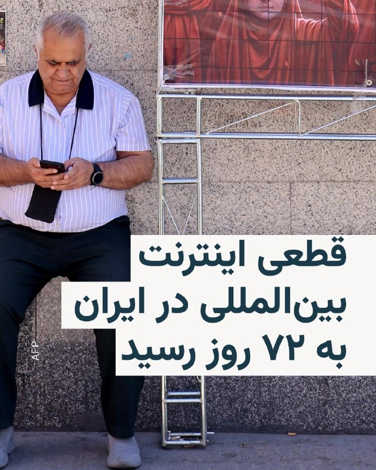

🔸نت‌بلاکس که میزان دسترسی به اینترنت در سراسر جهان را رصد می‌کند نوشت که روز یک‌شنبه عدم دسترسی مردم عادی در ایران به اینترنت بین‌المللی به ۷۲ روز رسیده است.

🔸ایران بیش از ۴۰ روز پیش در این زمینه به رکوردی جهانی رسید و از آن پس تنها هر روز رکورد خود را شکسته است.

🔸در پی آغاز حملات گسترده آمریکا و اسرائیل به ایران،‌ مقامات جمهوری اسلامی اولین کاری که کردند این بود که دسترسی مردم به اینترنت بین‌المللی و تماس آنها با جهان خارج را قطع کردند.

🔸این در حالی است که خود در تمام این مدت با «سیم‌کارت سفید» به اینترنت بدون محدودیت دسترسی داشته‌اند. عباس عراقچی، وزیر خارجه جمهوری اسلامی،‌ در مصاحبه‌ای در پاسخ به یک سوال درباره این که چرا او و مقامات و نه مردم عادی در کشور به اینترنت دسترسی دارند ادعا کرد که وظیفه او رساندن صدای مردم به خارج از کشور است.
@RadioFarda

## RadioFarda — post 157021

  

🔸وزیر خارجه آمریکا روز شنبه در حالی با نخست وزیر قطر در میامی در فلوریدا دیدار داشت که یک نفتکش قطری حامل گاز مایع در راه پاکستان از تنگه هرمز می‌گذشت.

🔸بر اساس اطلاعات کشتی‌رانی در خلیج فارس که خبرگزاری رویترز شنبه شب گزارش کرد، این نفتکش حامل گاز طبیعی مایع روز شنبه به مقصد پاکستان در حال گذر از تنگه هرمز بود.

🔸این خبرگزاری به نقل از منابعی نوشته است که گذر این نفتکش «با تأیید» جمهوری اسلامی صورت می‌گیرد، اقدامی برای اعتمادسازی با دو کشور قطر و پاکستان که هر دو در جنگ آمریکا و اسرائیل با ایران نقش میانجی را ایفا کرده‌اند.

🔸از زمان آغاز جنگ، این نخستین باری خواهد بود که یک نفتکش قطری می‌تواند برای انتقال سوخت از تنگه هرمز بگذرد.

🔸همزمان، بر اساس بیانیه‌ای که وزارت خارجه آمریکا روز شنبه منتشر کرد، مارکو روبیو در دیدار با محمد بن عبدالرحمن آل ثانی، نخست وزیر قطر، درباره نیاز به ادامه همکاری دو کشور «برای رفع تهدیدها و ارتقای ثبات و امنیت در خاورمیانه» گفت‌وگو کرده است.

🔸در این بیانیه به طور مستقیم به ایران اشاره‌ای نشده است.

@RadioFarda

## RadioFarda — post 157020

  

🔸ولادیمیر پوتین، رئیس‌جمهور روسیه، روز شنبه ۱۹ اردیبهشت، ساعتی بعد از برپایی رژهٔ «روز پیروزی» در مسکو، گفت که معتقد است جنگ اوکراین در حال اتمام است.

🔸او بدون اشاره به جزئیات بیشتر دربارهٔ این جنگ به خبرنگاران گفت: «فکر می‌کنم این موضوع در حال پایان یافتن است.»

🔸روزنامه فایننشال تایمز روز پنجشنبه گزارش داده بود که رهبران اتحادیه اروپا در حال آماده‌سازی برای مذاکرات احتمالی هستند. وقتی از پوتین پرسیده شد آیا حاضر است با اروپایی‌ها وارد گفت‌وگو شود، او گفت که گزینه ترجیحی‌اش گرهارد شرودر، صدراعظم پیشین آلمان، است.

🔸کرملین هفته گذشته اعلام کرده بود این دولت‌های اروپایی هستند که باید نخستین گام را بردارند، زیرا آن‌ها پس از آغاز جنگ اوکراین در سال ۲۰۲۲، ارتباط خود با مسکو را قطع کردند.

🔸تهاجم روسیه به اوکراین که بیش از چهار سال از آغاز آن می‌گذرد، جدی‌ترین بحران در روابط روسیه و غرب از زمان بحران موشکی کوبا در سال ۱۹۶۲ را رقم زده است.

@RadioFarda

## RadioFarda — post 157019

🔸روزنامهٔ وال‌ استریت جورنال در گزارشی اختصاصی نوشت اسرائیل پیش از جنگ اخیر با ایران، یک پایگاه نظامی مخفی در بیابان غرب عراق ایجاد کرده بود که برای پشتیبانی از عملیات هوایی علیه ایران استفاده می‌شد. 🔸این روزنامه، روز شنبه ۱۹ اردیبهشت، به‌نقل از منابع آگاه…

## RadioFarda — post 157018

  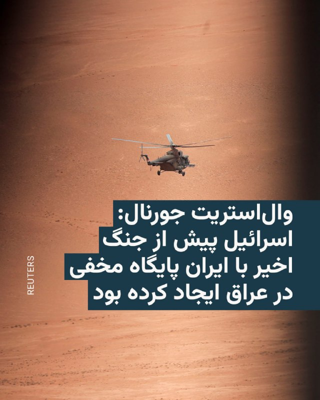

🔸روزنامهٔ وال‌ استریت جورنال در گزارشی اختصاصی نوشت اسرائیل پیش از جنگ اخیر با ایران، یک پایگاه نظامی مخفی در بیابان غرب عراق ایجاد کرده بود که برای پشتیبانی از عملیات هوایی علیه ایران استفاده می‌شد.

🔸این روزنامه، روز شنبه ۱۹ اردیبهشت، به‌نقل از منابع آگاه از جمله چند مقام‌ آمریکایی نوشت این پایگاه اندکی پیش از آغاز جنگ و با اطلاع آمریکا ساخته شد و محل استقرار نیروهای ویژه و مرکز پشتیبانی لجستیکی نیروی هوایی اسرائیل بود.

🔸بر اساس این گزارش، تیم‌های جست‌وجو و نجات نیز در این پایگاه مستقر بودند تا در صورت سرنگونی خلبانان اسرائیلی وارد عمل شوند.

🔸بر اساس این گزارش، در اوایل ماه مارس، پس از آن‌که یک چوپان محلی فعالیت‌های غیرعادی نظامی و پرواز بالگردها را گزارش کرد، ارتش عراق نیروهایی را برای بررسی منطقه اعزام کرد، اما اسرائیل با حملات هوایی مانع پیشروی آن‌ها شد.

@RadioFarda

## RadioFarda — post 157017

  <a href="https://t.me/radiofarda/157017" target="_blank">📎 Download file</a>

تورم و گرانی؛ اضطرابی که برای ایرانی‌ها تمامی ندارد

🔸مقام‌های جمهوری اسلامی همچنان از تلاش برای «ثبات اقتصادی» سخن می‌گویند، اما سفرهٔ میلیون‌ها خانواده ایرانی در فروردین ۱۴۰۵ کوچک‌تر از همیشه شد؛ از گوشت و لبنیات تا دارو و هزینهٔ درمان، موج تازه گرانی کالاهای اساسی بار دیگر معیشت مردم را هدف گرفت و بسیاری از شهروندان می‌گویند تورم دیگر فقط یک عدد در گزارش‌های رسمی نیست بلکه به اضطراب روزانه‌ای تبدیل شده که هر بار در صف فروشگاه‌ها، داروخانه‌ها و روی قبض‌های زندگی تکرار می‌شود.

🔸گزارش بنیامین صدر را بشنوید.

@RadioFarda

## RadioFarda — post 157016

مسکو رژه «روز پیروزی» را به‌صورت محدود و با تدابیر امنیتی شدید برگزار کرد

🔸روسیه روز ۱۹ اردیبهشت، در حالی که نگرانی‌ها از احتمال برهم زدن مراسم از سوی اوکراین افزایش یافته بود، محدودترین رژهٔ «روز پیروزی» خود در سال‌های اخیر را برگزار کرد.

🔸این مراسم که به‌مناسبت شکست آلمان نازی در جنگ جهانی دوم برگزار می‌شود، در دوران ریاست‌جمهوری ولادیمیر پوتین به یکی از مهم‌ترین تعطیلات سال در روسیه تبدیل شده است؛ جشنی پرشکوه برای نمایش تاریخ نظامی شوروی و روسیه و همچنین جنگ جاری مسکو در اوکراین.

🔸با این حال، مراسم امسال، با توجه به حملهٔ پهپادی اوکراین به یکی از حومه‌های مسکو در هفتهٔ گذشته و افزایش نگرانی‌های امنیتی، بدون حضور تانک‌ها و دیگر تجهیزات سنگین رزمی در میدان سرخ برگزار شد.

🔸مسکو پیش‌تر تهدید کرده بود که اگر اوکراین این رژه را مختل کند، حمله‌ای «گسترده» به مرکز کی‌یف انجام خواهد داد. این تهدیدها پیش از آن مطرح شد که دو طرف با میانجی‌گری دونالد ترامپ، رئیس‌جمهور آمریکا، بر سر آتش‌بسی سه‌روزه توافق کنند.

🔸با اجرایی شدن آتش‌بس موقت، هم روسیه و هم اوکراین از کاهش حملات در شب ۱۹ اردیبهشت خبر دادند. با این حال، ارتش اوکراین اعلام کرد نیروهای روسیه از روز قبل یک موشک و ده‌ها پهپاد به‌سمت اوکراین شلیک کرده‌اند. مسکو نیز مدعی شد که کی‌یف توافق را نقض کرده است، هرچند گزارشی دربارهٔ اختلال در خود مراسم رژه منتشر نشد.

🔸گزارش کامل را در وب‌سایت رادیوفردا بخوانید.

@RadioFarda

## RadioFarda — post 157015

  <a href="https://t.me/radiofarda/157015" target="_blank">📎 Download file</a>

📻بشنوید: ایستگاه ۱۹ با رادیوفردا، ۱۹ اردیبهشت ۱۴۰۵

@RadioFarda

## RadioFarda — post 157014

نهاد قدرت در جمهوری اسلامی، پس از علی خامنه‌ای، در دست کیست؟

🔸در ایرانِ امروز، قدرت دیگر چهره‌ای واحد ندارد؛ نه می‌توان آن را فقط در اتاق رهبر جمهوری اسلامی جست‌وجو کرد، نه در دولت، و نه حتی فقط در ستاد فرماندهی سپاه پاسداران.

🔸جمهوری اسلامی پس از جنگ آمریکا و اسرائیل علیه ایران، کشته‌شدن علی خامنه‌ای، حذف شماری از فرماندهان اصلی سپاه و مقام‌های ارشد امنیتی و نیز مجروح‌شدن مجتبی خامنه‌ای وارد مرحله‌ای از آرایش چندلایه و بی‌ثبات قدرت شده است؛ وضعیتی که در آن هر نهاد بخشی از قدرت را در اختیار دارد، اما هیچ‌یک به‌تنهایی تجسم کامل قدرت نیست.

🔸بخشی از دشواری فهم سازوکار قدرت در ایران به همین ساختار چندلایه و پراکندهٔ تصمیم‌گیری بازمی‌گردد؛ نکته‌ای که مقام‌های آمریکایی نیز به آن اشاره کرده‌اند.

🔸گزارش کامل وحید پوراستاد را در وب‌سایت رادیوفردا بخوانید.

@RadioFarda

## RadioFarda — post 157013

  

🔸فرماندهی مرکزی ایالات متحده، سنتکام، روز شنبه خبر داد از ابتدای محاصره دریایی علیه بنادر ایران تاکنون، ۵۸ کشتی تجاری را وادار به «تغییر مسیر» کرده است.

🔸در اطلاعیه سنتکام که در حساب شبکه ایکس آن منتشر شده است، آمده که نیروهای نظامی آمریکا در خاورمیانه چهار کشتی ایرانی را «از کار انداخته‌اند تا مانع ورود یا خروج آن‌ها از بنادر ایران شوند».

🔸ارتش آمریکا جمعه از شلیک به دو نفتکش ایرانی «ام‌تی سی استار» و «ام‌تی سودا» و از کار انداختن آنها خبر داد و روز چهارشنبه نیز نفتکش «ام‌تی حسنا» با پرچم ایران هدف قرار گرفته بود.

🔸ماه گذشته نیز نیروهای آمریکایی یک کشتی باری ایرانی را توقیف کرده بودند.

🔸محاصره دریایی ایران در حالی ادامه دارد که ایران هنوز به طرح پیشنهادی آمریکا برای رسیدن به توافق پایان جنگ پاسخ نداده است. به گفته مقام‌های آمریکایی، این پاسخ قرار بود روز جمعه به واشینگتن تحویل داده شود.

🔸از سوی دیگر جمهوری اسلامی رفع محاصره دریایی را پیش‌شرط باز شدن تنگه هرمز خوانده است.

@RadioFarda

## IranianMinds — post 19895

  <a href="telegram/content/IranianMinds_19895_1778424618.mp4" target="_blank">🎬 Download video</a>

🔴 ترامپ:

دو گروه از رهبرانشان از بین رفته‌اند، گروه A رفته، گروه B هم رفته، و احتمالاً گروه C هم از بین رفته است.

ما با افرادی طرف هستیم که نوعی قدرت دارند. خیلی جالب است آن‌ها یک توافق می‌کنند و بعد آن را می‌شکنند.

@IranianMinds

## IranianMinds — post 19894

  <a href="telegram/content/IranianMinds_19894_1778424620.mp4" target="_blank">🎬 Download video</a>

🔴 ترامپ:

ایران از نظر نظامی شکست خورده است. شاید در ذهن خودشان هنوز این را ندانند، اما من فکر می‌کنم می‌دانند، چون من مستقیما با آن‌ها در ارتباط هستم

@IranianMinds

## IranianMinds — post 19893

🔴 ترامپ:

من مجبور بودم از نظر نظامی وارد عمل شوم، چون با اطمینان می‌دانستم ایران در مسیر دست‌یابی به سلاح هسته‌ای قرار دارد

@IranianMinds

## IranianMinds — post 19892

🔴 ترامپ :

تحت هیچ شرایطی ما نباید اجازه بدیم اونا سلاح هسته ای داشته باشن ، چون اونا دیوانه اند!

@IranianMinds

## IranianMinds — post 19891

🔴 ترامپ:

اگر ایران به سلاح هسته‌ای دست پیدا کند، آن را علیه اسرائیل و خاورمیانه به کار می‌برد!

@IranianMinds

## IranianMinds — post 19890

🔴 ترامپ : ما در ایران اهداف مشخصی داشتیم که دنبال می‌کردیم و احتمالا حدود ۷۰ درصدشون رو محقق کردیم @IranianMinds

## IranianMinds — post 19889

🔴 ترامپ:

هنوز اهداف دیگری در ایران داریم که همچنان احتمال هدف قرار دادنشان بسیار بالاست!

@IranianMinds

## IranianMinds — post 19888

🔴 ترامپ :

ما در ایران اهداف مشخصی داشتیم که دنبال می‌کردیم و احتمالا حدود ۷۰ درصدشون رو محقق کردیم

@IranianMinds

## IranianMinds — post 19887

🔴 ترامپ:

می‌توانیم تا دو هفته دیگر علیه ایران حرکت کنیم و به هر یک از اهداف مشخص‌شده ضربه بزنیم.

@IranianMinds

## IranianMinds — post 19886

🔴 ترامپ:

اگه امروز جنگ رو ترک کنیم، 20 سال طول می‌کشد تا ایران توانایی‌هایش را بازسازی کند

@IranianMinds

## IranianMinds — post 19885

  

🔴 ترامپ داره ویدیوهایی از مارک لوین منتشر می‌کنه که توش میگه فشار روی ایران باید ادامه پیدا کنه و حتی احتمال داره برای قوی‌تر کردن موضع آمریکا قبل از مذاکرات، یه دور دیگه درگیری و جنگ هم اجتناب‌ناپذیر باشه!

@IranianMinds

## IranianMinds — post 19884

🔴 ترامپ:

من هیچوقت نگفتم که عملیات نظامی علیه ایران تمام شده است، اما گفتم که آنها شکست خوردند

@IranianMinds

## IranianMinds — post 19883

🔴 ترامپ:

نیروی فضایی ما تمام منطقه رو زیر نظر داره اگه کسی به اورانیوم غنی شده ایران که زیر آوار مدفون شده نزدیک شود، از آن مطلع خواهیم شد و آن را بمباران و نابود خواهیم کرد.

@IranianMinds

## IranianMinds — post 19882

🔴 ترامپ :

در مقطعی به اورانیوم غنی شده ایران که در اعماق زمین و آوار مدفون شده است خواهیم رسید

@IranianMinds

## IranianMinds — post 19881

  

🔴 پست جدید ترامپ :

وزیر خارجه اسرائیل ازم‌ تمجید کرد.

@IranianMinds

## IranianMinds — post 19880

🔴 الجزیره به نقل از یک مقام پاکستانی:

پیام ایران‌ رو منتقل کردیم به آمریکاییا و‌ دارن بررسیش میکنن

@IranianMinds

## IranianMinds — post 19879

  <a href="telegram/content/IranianMinds_19879_1778424624.mp4" target="_blank">🎬 Download video</a>

🔴یک فروند KC-135 امریکا در حال پرواز در آسمان خاورمیانه و درحال سوخت‌رسانی به یک F/A-18 سوپر‌هورنت.

@IranianMinds

## IranianMinds — post 19878

🔴 جمهوری اسلامی : پاسخ خودمون به آمریکا برای پایان دادن به جنگ رو دادیم. @IranianMinds

## IranianMinds — post 19877

🔴 جمهوری اسلامی :

پاسخ خودمون به آمریکا برای پایان دادن به جنگ رو دادیم.

@IranianMinds

## IranianMinds — post 19876

۱۰ می روز جهانی مادر است، اما در سرزمین ما، بعضی مادرها فقط مادر نماندند، به درد یک ملت تبدیل شدند.
مادرانی که فرزندانشان را در راه آزادی از دست دادند و مادرانی که خود، جاویدنام راه ایران شدند.
نامتان در حافظهٔ این خاک خواهد ماند، مثل نوری خاموش‌نشدنی.
روز مادر بر تمام مادران غیور و سربلند ایران‌زمین خجسته باد.
بر آنان که ایستادند، سوختند ، اما نشکستند.

@IranianMinds

## BBCPersian — post 280664

🔹چند خبر کوتاه از ایران

▪️وزارت خارجه ایران رافائل گروسی، مدیرکل آژانس بین‌المللی انرژی اتمی، را به سیاسی‌کاری متهم کرد. سخنگوی وزارت خارجه ایران در شبکه اجتماعی ایکس نوشت وظیفه آژانس «راستی‌آزمایی است، نه ارسال پیام‌های سیاسی در مورد تنگه هرمز، موشک‌های ایران یا نحوه رفتار تهران.» به گفته اسماعیل بقایی «وقتی بی‌طرفی حرفه‌ای قربانی رفتارهای سیاسی یا جاه‌طلبی‌های شخصی بشود، اعتبار نهادها دچار فرسایش می‌شود و بعد از چندی اثربخشی آنها نیز مخدوش می‌گردد.» آقای گروسی هفته گذشته در مصاحبه‌ای گفته بود توافق آمریکا و ایران نیازمند اراده سیاسی در تهران است.»

▪️نایب رئیس مجلس ایران گفت: «تنگه هرمز با عملیات نظامی باز نمی‌شود.» علی نیکزاد در نطق پیش از دستور در جلسه اینترنتی امروز مجلس گفت: «سال‌ها بود که تنگه هرمز با نجابت ملت ایران مورد استفاده شما قرار می‌گرفت. این شما بودید که جنگ‌افروزی کردید و امروز باید به نظم جدید این آبراه استراتژیک عادت کنید.»

▪️مسعود پزشکیان در جلسه کارگروه بازسازی پس از جنگ گفت که «اگر «سخنی از گفت‌وگو یا مذاکره مطرح می‌شود، معنای آن تسلیم یا عقب‌نشینی نیست» و هدف «احقاق حقوق ملت ایران و دفاع مقتدرانه از منافع ملی است.»

https://bbc.in/4u0SGG1
@BBCPersian

## BBCPersian — post 280663

🔻نخست‌وزیر قطر: همه طرف‌ها باید برای پایان دادن به جنگ تلاش کنند

نخست‌وزیر قطر با وزیر خارجه ایالات متحده درباره اوضاع منطقه و میانجیگری پاکستان برای پایان جنگ گفت‌‌وگو کرده است.

در بیانیه‌ دولت قطر آمده است که محمد بن عبدالرحمن آل ثانی، نخست‌وزیر و وزیر خارجه قطر، در دیدار با مارکو روبیو در میامی خواستار توجه همه طرف‌ها به تلاش‌های میانجیگرانه و «رسیدگی به ریشه‌های بحران از طریق روش‌های مسالمت‌آمیز» شده است.

بنابر این بیانیه، قطر خواهان «توافقی جامع» برای صلح پایدار در منطقه است.

ساعاتی پس از دیدار محمدبن عبدالرحمن آل ثانی با وزیر خارجه آمریکا، او با عباس عراقچی، وزیر خارجه ایران، تلفنی گفت‌وگو کرد.

خبرگزاری دولتی ایرنا نوشت در این تماس تلفنی «پیرامون آخرین تحولات منطقه‌ای و روندهای جاری دیپلماتیک» گفت‌وگو شده است اما جزئیات بیشتری منتشر نکرد.

https://bbc.in/4wiFopY
@BBCPersian

## BBCPersian — post 280662

🔻قطر حمله به یک کشتی تجاری در آبهایش را تایید کرد

وزارت دفاع قطر تایید کرد یک پهپاد کشتی تجاری که از امارات به سمت بندر مسیعید در حرکت بود، در آب‌های قطر هدف قرار گرفته است.

بنابر اعلام وزارت دفاع قطر، در اثر اصابت این پهپاد آتش‌سوزی محدودی در کشتی رخ داد اما تلفات جانی نداشت.

در این بیانیه به مبدا حرکت این پهپاد اشاره نشده است.

بنابر این گزارش، پس از اطفای حریق این کشتی که از امارات حرکت کرده بود به سمت بندر مسیعید ادامه داد.

برخی رسانه‌های ایران می‌گویند این کشتی فله‌بر متعلق به آمریکا بوده و با پرچم آمریکا حرکت می‌کرد.

ایران تهدید کرده است شناورهای آمریکا را هدف قرار خواهد داد.

https://bbc.in/4nljC0U
@BBCPersian

## BBCPersian — post 280661

🔻اولین جلسه علنی مجلس ایران بعد از شروع جنگ اینترنتی برگزار شد

مجلس ایران برای اولین بعد از شروع جنگ اخیر، به‌صورت وبینار (ویدئو کنفرانس) جلسه علنی داشت.

آخرین جلسه علنی مجلس ۲۸ بهمن ۱۴۰۴ بود.

بنابر گزارش‌ها موضوع این جلسه «التهابات بازار، نگرانی‌های مردم و گرانی‌های اخیر» بود.

مجلس شورای اسلامی در آخرین جلسه‌اش در سال گذشته به موضوع اصلاح لایحه بودجه سال ۱۴۰۵ پرداخته بود.

علت تاخیر در برگزاری جلسات مجلس «مسائل امنیتی» عنوان شده است.

با اینکه مجلس پس از شروع جنگ جلسه علنی نداشت، به گفته علی نیکزاد، نایب رئیس مجلس، «مجلس و نمایندگان از روز نخست جنگ فعالانه نقش‌آفرینی» کردند و «قانون بودجه سال ۱۴۰۵ در میانه جنگ، نهایی و ابلاغ شد.»

آقای نیکزاد همچنین گفت که «۱۲ جلسه با مشارکت هیئت رئیسه، رؤسای کمیسیون‌های تخصصی مجلس، معاونت‌های مجلس، مرکز پژوهش‌ها و اعضای هیئت دولت با موضوعات ارزیابی و نحوه جبران خسارت» و «بیش از ۹۰ جلسه و نشست نظارتی» در کمیسیون‌های مجلس برگزار شده است.

https://bbc.in/4toE7Lq
@BBCPersian

## BBCPersian — post 280660

  <a href="telegram/content/BBCPersian_280660_1778424626.mp4" target="_blank">🎬 Download video</a>

⭕️سرخط خبرها، یکشنبه ۲۰ اردیبهشت ۱۴۰۵
@BBCPersian

## BBCPersian — post 280659

⚽️رئیس فیفا برای تیم ملی فوتبال ایران در جام جهانی آرزوی موفقیت کرد

جانی اینفانتینو برای تیم فوتبال ایران در جام جهانی پیش رو در آمریکای شمالی «بهترین‌ها» را آرزو کرد.

رئیس فدراسیون بین‌المللی فوتبال در شبکه‌های اجتماعی نوشت: «برای جمهوری اسلامی ایران در چهارمین حضور متوالی خود در جام جهانی فیفا بهترین‌ها را آرزو می‌کنم.»

تیم ملی مردان ایران قرار است اولین بازی خود را در ۲۵ خرداد (۱۵ ژوئن) در کالیفرنیا مقابل نیوزیلند انجام دهد.

فدراسیون فوتبال ایران پیش از این از فیفا خواسته بود که به‌دلیل نگرانی‌های امنیتی بازی‌هایش به مکزیک منتقل شود اما فیفا این درخواست را رد کرد و گفت نمی‌تواند محل مسابقات را در این فاصله نزدیک به برگزاری تغییر دهد.

تیم ایران با نیوزیلند و بلژیک و مصر هم‌گروه است.

https://bbc.in/49CiMXK
@BBCPersian

## BBCPersian — post 280658

  

🔻ایران می‌گوید پاسخش به «آخرین متن پیشنهادی آمریکا برای خاتمه جنگ» را امروز به پاکستان ارسال کرده است.

وزارت خارجه ایران گفته بود که «بعد از تکمیل بررسی‌ها و جمع‌بندی نهایی» به پیشنهاد آمریکا پاسخ خواهد داد.

ایرنا نوشت: «بر اساس طرح پیشنهادی، در این مرحله مذاکرات متمرکز بر موضوع خاتمه جنگ در منطقه خواهد بود.»

آمریکا هفته پیش پیشنهاد دیگری به ایران داد و دونالد ترامپ بعد از آن چند بار گفته بود منتظر پاسخ تهران است.

به گفته رسانه‌های آمریکا طرح آخر دولت دونالد ترامپ یک پیشنهاد یک صفحه‌ای در ۱۴ بند است.

📸AFP via Getty Images

https://bbc.in/42qUBrr
@BBCPersian

## BBCPersian — post 280657

🔻سخنگوی کمیسیون امنیت ملی مجلس: از امروز خویشتنداری ما تمام شد

سخنگوی کمیسیون امنیت ملی و سیاست خارجی مجلس ایران گفت که از امروز «خویشتنداری» به پایان می‌رسد.

ابراهیم رضایی در شبکه اجتماعی ایکس نوشت: «هر تعرضی به شناورهای ما، با پاسخ سنگین و قاطع ایران به شناورها و پایگاه‌های آمریکایی مواجه خواهد شد.»

آقای رضایی در پایان نوشت: «باید به نظم منطقه‌ای جدید عادت کنید.»

https://bbc.in/4u0LNEF
@BBCPersian

## BBCPersian — post 280656

⚽️«بی‌رحم و عذاب‌آور»؛ پنالتی از کی وارد فوتبال شد؟

✍️فیل جونز و سونیا آکسلی
بی‌بی‌سی

مارتین کلی روزی را به یاد می‌آورد که آرزو داشت مثل بقیه بچه‌های حاضر در استادیوم، چهارپایه‌ای داشت تا روی آن بایستد و دید بهتری به زمین داشته باشد.

او نمی‌خواست پشت سر دیگر تماشاچیان، دیدن نخستین ضربات پنالتی رسمی تاریخ فوتبال را از دست بدهد.

📲ادامه مطلب در لینک زیر⬇️

https://bbc.in/4wAKzlw
@BBCPersian

## BBCPersian — post 280655

🔻امارات: با دو پهپاد با موفقیت مقابله کردیم

وزارت دفاع امارات متحده عربی می‌گوید که پدافند هوایی‌اش با موفقیت دو پهپاد را که از ایران شلیک شده بودند، هدف قرار داده است.

گزارشی از خسارت‌ منتشر نشده است.

ساعاتی پیش کویت هم از شناسایی و مقابله با پهپاد در آسمانش خبر داده بود.

ایران اظهارنظری نکرده است.

https://bbc.in/4wqbvo0
@BBCPersian

## BBCPersian — post 280649

✍️آرچی میچل
گزارشگر اقتصادی، بی‌بی‌سی

⭕️در حالی که خانواده‌ها در سراسر جهان هزینه‌های جنگ آمریکا و اسرائیل علیه ایران را می‌پردازند، برخی شرکت‌ها در همین مدت سودهای کلانی به دست آورده‌اند.

بلاتکلیفی ناشی از این درگیری و بسته شدن عملی تنگه هرمز از سوی ایران، هزینه‌های زندگی را افزایش داده و بودجه شرکت‌ها، خانواده‌ها و دولت‌ها را تحت فشار قرار داده است.

📲در اینجا برخی از شرکت‌ها و حوزه‌هایی را مرور می‌کنیم که با ادامه جنگ در خاورمیانه، میلیاردها دلار سود به دست آورده‌اند.🔽

📸Getty/ BBC

https://bbc.in/42rgmY7
@BBCPersian

## BBCPersian — post 280648

  

🔻رسانه‌های ایران می‌گویند سرلشگر علی عبداللهی، فرمانده قرارگاه مرکزی خاتم‌الانبیا، با مجتبی خامنه‌ای، رهبر جمهوری اسلامی، دیدار کرده است.

این رسانه‌ها بدون انتشار هیچ عکس یا تصویری نوشته‌اند که فرمانده قرارگاه خاتم «گزارشی از آمادگی‌های نیروهای مسلح جمهوری اسلامی ایران اعم از ارتش جمهوری اسلامی، سپاه پاسداران انقلاب اسلامی، نیروهای انتظامی امنیتی و مرزبانی کشور، وزارت دفاع و بسیجیان» را به آقای خامنه‌ای داده است.

بنابر گزارش‌ها رهبر جمهوری اسلامی از نیروهای مسلح در جنگ آمریکا و اسرائیل با ایران «قدردانی» کرده است.
مسعود پزشکیان، رئیس‌جمهور ایران، ۱۷ اردیبهشت «دو ساعت و نیم» دیدار با رهبر جمهوری اسلامی خبر داد اما به زمان این دیدار اشاره نکرد.

از زمان حمله آمریکا و اسرائیل به بیت رهبری،‌ صدا یا تصویری از مجتبی خامنه‌ای منتشر نشده است و رسانه‌های ایران فقط پیام‌های مکتوب از طرف او منتشر کرده‌اند.

📸GettyImages/ ISNA

https://bbc.in/4df4GfU
@BBCPersian

## BBCPersian — post 280647

  <a href="telegram/content/BBCPersian_280647_1778424630.mp4" target="_blank">🎬 Download video</a>

این صحنه‌ای است که بی‌بی‌سی به اشتباه به جای گای کوینی، روزنامه‌نگار حوزه فناوری، با گای گوما، که برای یک مصاحبه شغلی آمده بود، به صورت زنده مصاحبه کرد.

۲۰ سال پیش، در تاریخ ۸ مه ۲۰۰۶، گوما برای مصاحبه‌ای به بی‌بی‌سی دعوت شد. اما در پذیرش، او را با کوینی اشتباه گرفتند و از یک برنامه زنده از کانال خبری بی‌بی‌سی سردرآورد. گوما در این موقعیت عجیب جا نزد و با وجود اینکه از موضوع خبر نداشت، به سوالات مجری پاسخ داد. او شغلی را که تقاضا کرده بود، نگرفت.

@BBCPersian
https://bbc.in/48RTMeY

## BBCPersian — post 280646

🔻 کویت: به حمله پهپادی پاسخ دادیم

کویت می‌گوید که بامداد امروز هدف حمله پهپادی قرار گرفته است.

سرهنگ عبدالعزیز العطوان، سخنگوی وزارت دفاع کویت، گفت که در ساعت‌های اول بامداد یکشنبه «چندیدن پهپاد متخاصم در آسمان کویت شناسایی شدند و مطابق دستورالعمل‌ها به آنها پاسخ داده شد.»

جزئیات بیشتری منتشر نشده است.

پیش از آتش‌بس، کویت چندین بار از حملات پهپادی ایران و رهگیری آنها خبر داده بود.

https://bbc.in/3PtcOBM
@BBCPersian

## BBCPersian — post 280645

  

‌ ‌ ‌ ‌
خبرگزاری فارس می‌گوید «یک نفتکش حمل‌کننده گاز طبیعی مایع متعلق به قطر به نام الخریطیات» با «اجازه ایران» از تنگه هرمز عبور کرده است.

بنابر این گزارش، این نفتکش «روز گذشته در دهانهٔ تنگهٔ هرمز دیده شده بود و پس از آن سامانه موقعیت‌یاب خودکار خود را خاموش کرد.»

به گفته فارس، «این نفتکش که مقصدش پاکستان است، نخستین نفتکش غیرمرتبط با ایران است که از نیروی دریایی سپاه اجازه عبور از تنگه هرمز دریافت کرده است.»

بر طبق داده‌های ناوبری مارین‌ترفیک که تردد دریایی را رصد و منعکس می‌کند، براساس آخرین سیگنال دریافتی، این کشتی دیروز حدود ساعت ۱۶:۲۷ به وقت دوحه در تنگه هرمز و در ۴۴ کیلومتری جنوب شرقی جزیره قشم قرار داشت و سپس سیگنال خود را حدود ۱۴ ساعت پنهان کرد و اکنون پس از عبور از تنگه هرمز مجددا سیگنال آن قابل رویت است.

https://bbc.in/4tKlylj
📷Danil Shamkin/NurPhoto via Getty Images / عکس آرشیوی
@BBCPersian

## idfinfarsi — post 11561

  <a href="telegram/content/idfinfarsi_11561_1778424633.mp4" target="_blank">🎬 Download video</a>

سخنگوی ارتش اسرائیل:

تماشا کنید: همکاری میان اپراتور یک پهپاد و یک افسر در تیپ کفیر در نوار غزه

در یک واکنش سریع، یک پهپاد نیروی هوایی با همکاری تیپ کفیر، فردی را که مظنون به کارگذاری مواد انفجاری در جنوب نوار غزه بود، هدف قرار داد.

نیروی هوایی به‌طور مداوم به پشتیبانی از نیروهای رزمی در جبهه‌های مختلف، در عملیات‌های هجومی و دفاعی ادامه می‌دهد.

## Dirty_Kids — post 389224

  

‌‎
نه بابا خب بچه خودش رفته پانزده خرداد خرید کرده اومده جلو آیینه استایلشو زده
(عرزشی همینقدر خر) 🤣

@Dirty_Kids 👻

## Dirty_Kids — post 389223

  

کره شمالی توی قانون اساسیش داره قانونی رو اضافه میکنه که درصورتی که رهبر این کشور "کیم جونگ اون" توسط کشوری ترور و کشته بشه، کره شمالی با بمب اتم از اون کشور انتقام بگیره.

@Dirty_Kids 👻

## Dirty_Kids — post 389222

  

فرق بین تمدن و توحش

@Dirty_Kids 👻

## Dirty_Kids — post 389221

وضعیت تکنولوژی در منطقه:

‏- افغانستان و ترکیه : اینترنت 5G تست و راه‌اندازی شد.
‏- عراق: تلگرام رفع فیلتر شد.
‏- سوریه: سوییفت، ویزا و مستر به سوریه آمدند.
‏- ایران: رکورد شکنی جدید، قطعی اینترنت به یازدهمین هفته رسید.

@Dirty_Kids 👻

## Dirty_Kids — post 389220

  <a href="telegram/content/Dirty_Kids_389220_1778424637.mp4" target="_blank">🎬 Download video</a>

متین ستوده:
همه دنیا می‌داند ترامپ دیوانه است.

حالا ببین شما کی هستید که دنیا دست به دامن اون دیوونه شده که شما رو نابود کنه!

اینها واقعا مارو کسخل فرض کردن؟ خب کسکش خونشور کیان پیرفلک و ۴۰هزار جوون ۱۸ و ۱۹دی رو جمهوری اسلامی کشت. برای کی گریه کردی پلشت؟

از قاتل حمایت میکنن، بعد برای قربانی گریه میکنن

@Dirty_Kids 👻

## Dirty_Kids — post 389219

  

شاید این وسط براتون سوال باشه نظر مراجع در مورد خوردن شیر همسر چیه؟

خامنه ای، مکارم، وحید خراسانی، نوری همدانی: جایز است و مشکل نداره✅
سیستانی: خورده نشه بهتره❌

+ یکی از علما هم گفته من خوردم خوشمزه نبوده، نخورین بهتره :))

@Dirty_Kids 👻

## Dirty_Kids — post 389214

عکسای جدید بانو بیلی آیلیش که خیلی تو ایکس وایرال شده

@Dirty_Kids 👻

## Dirty_Kids — post 389213

‏فکر کن یه عالمه درس بخونی که بری خارج یه عالمه درس بخونی.

@Dirty_Kids 👻

## Dirty_Kids — post 389212

  <a href="telegram/content/Dirty_Kids_389212_1778424639.mp4" target="_blank">🎬 Download video</a>

Mother's Day 2026

روزت مبارک مامان ♥️
#محمدرضاقربانی

@Dirty_Kids 👻

## Dirty_Kids — post 389211

  <a href="telegram/content/Dirty_Kids_389211_1778424642.mp4" target="_blank">🎬 Download video</a>

«بچه شیعه باخت نمیده»
چون نزدیک جام‌جهانی هستیم این مدلیشم ببینید

@Dirty_Kids 👻

## Dirty_Kids — post 389210

  <a href="https://t.me/Dirty_Kids/389210" target="_blank">📎 Download file</a>

✅ اپلیکیشن اندروید سایت جهانی دربی بت

💰اولین سایت جهانی با امکان شارژ و برداشت ریالی(کارت به کارت)

🔗 برای ورود فیلترشکن روی کشور مناسب قرار دهید مانند فنلاند و المان و....

😀Telegram Channel
👇
https://t.me/+bcynkEgSW2dlYTc0

## Dirty_Kids — post 389209

  

😤دنبال یه سایت شرط بندی بین المللی بودی که به ایرانیا خدمات بده؟!
⛔

👍دربی بت همون انتخاب  100%

💎ویژگی های سایت جهانی Derby Bet:

⬅️امکان شارژ امن با کارت بانکی

⬅️واریز اول دوبل شارژ می شوید(بونوس۱۰۰٪)

⬅️پر اپشن ترین سایت فعال در ایران

⬅️تسویه حساب کمتر از 5 دقیقه

⬅️برگشت بخشی از باخت به صورت هفتگی

🚨کد هدیه ثبت نام:GG007

⚠️برای دانلود اپلکیشن کلیک کنید
👉

🔔کانال دربی بت :

🪙https://t.me/+bcynkEgSW2dlYTc0

## Dirty_Kids — post 389208

رفتم شیرینی فروشی، پرسیدم ببخشید این ظرف گِرده که روش پسته داره چیه؟
یکطوری نگاهم کرد گفت این دسرمون خیلی لایت و کریمیه با تاپینگِ سالتِد کارامل سیروپ، با پودرِ پستاچیو.
گفتم نخرم زشته؛ خریدم رفتم حساب کردم، توی فاکتور نوشته بود شیر برنج. :)))))))))

@Dirty_Kids 👻

## Dirty_Kids — post 389207

  <a href="telegram/content/Dirty_Kids_389207_1778424644.mp4" target="_blank">🎬 Download video</a>

داره میگه جنده‌ای، کصکش ادا تنگا رو درنیار دیگه 🤭🤭🤭

@Dirty_Kids 👻

## Dirty_Kids — post 389205

تتوی جدید ریحانا از نقاشی بچش
داداش خب یه شیش ماه صبر میکردی شاید تو نقاشی پیشرفت میکرد

@Dirty_Kids 👻

## Hranews — post 112866

  

💥 دعوت به همکاری با خبرگزاری هرانا

خبرگزاری هرانا، با بیش از دو دهه سابقه در حوزه گزارشگری و مستندسازی حقوق بشر، در راستای توسعه فعالیت‌های خود از علاقه‌مندان واجد شرایط برای همکاری دعوت می‌کند.

هرانا در این مرحله بیش از آن‌که به دنبال افراد با سابقه حرفه‌ای باشد، به دنبال افرادی متعهد، دقیق و آموزش‌پذیر است؛ کسانی که دغدغه واقعی حقوق بشر دارند و مایل‌اند در یک چارچوب حرفه‌ای، مهارت‌های خود را توسعه دهند.

زمینه‌های همکاری شامل:
گزارشگری، ویراستاری، ترجمه، مدیریت شبکه‌های اجتماعی و سایر حوزه‌های مرتبط

ویژگی‌های مورد انتظار:

* تسلط کافی به زبان فارسی (خواندن و نوشتن)
* دقت، مسئولیت‌پذیری و توانایی یادگیری مستمر
* علاقه و حساسیت نسبت به موضوعات حقوق بشر
* آمادگی برای فعالیت در چارچوب‌های سازمان‌یافته و حرفه‌ای

❗️ توجه: درخواست‌ها صرفاً در صورتی بررسی خواهند شد که اطلاعات ثبت‌شده در فرم (از جمله کشور محل سکونت و سایر شرایط اعلام‌شده) با الزامات همکاری همخوانی داشته باشد.

همکاری با هرانا فرصتی است برای کسب تجربه عملی در حوزه مستندسازی و فعالیت‌های حقوق بشری در یک نهاد با سابقه و ساختار حرفه‌ای.

📎 برای ثبت درخواست همکاری، لطفا فرم زیر را تکمیل کنید:
https://hra.news/4cBjHqs

📩 در صورت بروز مشکل در تکمیل فرم، می‌توانید رزومه و اطلاعات تماس خود را به آدرس زیر ارسال نمایید:
info@hra-news.org

↘️
@hranews_bot تماس ✉️ -  @Hranews  کانال هرانا 🆑

## Hranews — post 112865

قتل و به آتش کشیدن پیکر یک کودک ۹ ساله در سراوان؛ متهم بازداشت شد

❗️
❗️
❗️
❗️
❗️ – اواخر فروردین‌ماه امسال پیکر بی‌جان فاطمه‌ زهرا حسین‌بر، #کودک ۹ ساله اهل شهر گُشت از توابع شهرستان سراوان، پس از چند روز ناپدید شدن، در شرایطی خشونت‌بار در حاشیه شهر کشف شد. فرمانده انتظامی سراوان اکنون از بازداشت متهم این پرونده خبر داده است.

ادامه مطلب

#فاطمه_زهرا_حسین‌بر

↘️
@hranews_bot تماس ✉️ -  @Hranews  کانال هرانا 🆑

## Hranews — post 112864

  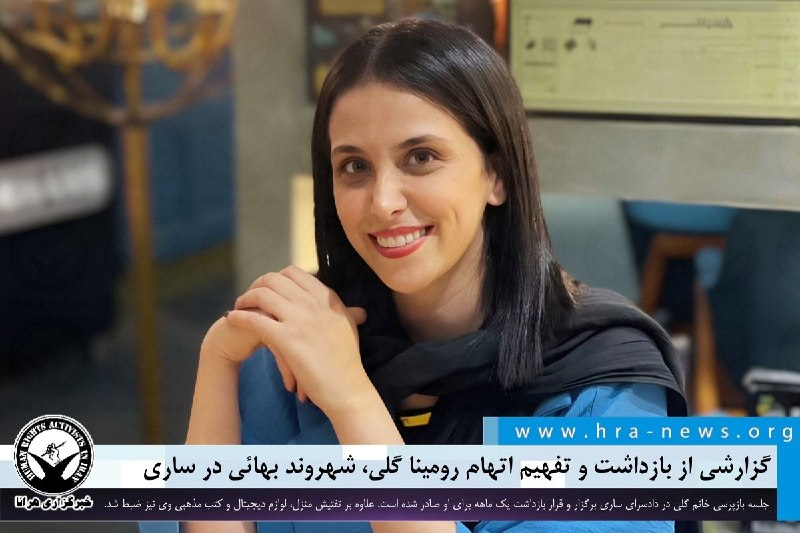

رومینا گلی، شهروند بهائی در ساری بازداشت و تفهیم اتهام شد

❗️
❗️
❗️
❗️
❗️ – رومینا گلی، شهروند بهائی ساکن ساری، روز گذشته #بازداشت شد و امروز یکشنبه، جلسه بازپرسی وی در دادسرای این شهرستان برگزار شد. در پایان این جلسه، قرار بازداشت موقت یک‌ماهه برای وی صادر شده است.

به گزارش خبرگزاری هرانا، ارگان خبری مجموعه فعالان حقوق بشر در ایران، رومینا گلی بازداشت شد و مورد تفهیم اتهام قرار گرفت.

بر اساس اطلاعات دریافتی هرانا، امروز یکشنبه ۲۰ اردیبهشت‌ماه، جلسه بازپرسی خانم گلی در دادسرای ساری برگزار شد. در جریان این جلسه، وی بر اساس ماده ۵۰۰ و ماده ۵۰۰ مکرر قانون مجازات اسلامی، از بابت اتهامات “تبلیغ علیه نظام” و “فعالیت تبلیغی مغایر با شرع اسلام” مورد تفهیم اتهام قرار گرفت. همچنین، برای این شهروند بهائی قرار بازداشت موقت یک‌ ماهه صادر شده است.

ادامه مطلب

#رومینا_گلی

↘️
@hranews_bot تماس ✉️ -  @Hranews  کانال هرانا 🆑

## Hranews — post 112863

  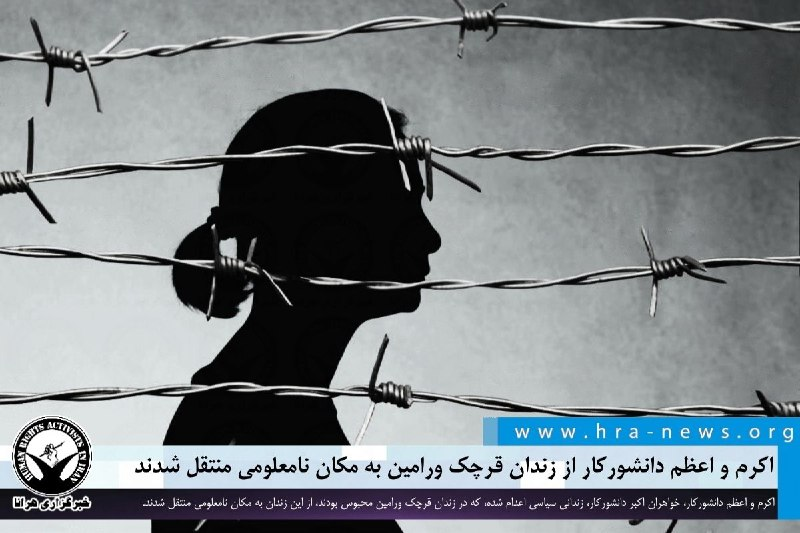

اکرم و اعظم دانشورکار از زندان قرچک ورامین به مکان نامعلومی منتقل شدند

❗️
❗️
❗️
❗️
❗️ – اکرم و اعظم دانشورکار، خواهران اکبر دانشورکار، زندانی سیاسی اعدام‌شده، که در زندان قرچک ورامین محبوس بودند، از این زندان به مکان نامعلومی منتقل شدند. بی‌خبری از وضعیت این دو زندانی، نگرانی خانواده آنان را افزایش داده است.

به گزارش خبرگزاری هرانا، ارگان خبری مجموعه فعالان حقوق بشر در ایران، اکرم و اعظم دانشورکار از زندان قرچک ورامین به مکانی نامعلوم منتقل شدند.

یک منبع مطلع نزدیک به خانواده این شهروندان، ضمن تایید این خبر به هرانا گفت: “روز پنجشنبه ۱۷ اردیبهشت‌ماه، اکرم و اعظم دانشورکار توسط نیروهای امنیتی از زندان قرچک ورامین به مکانی نامعلوم منتقل شدند. از زمان انتقال تاکنون، هیچ‌گونه تماسی از جانب این افراد با خانواده‌هایشان برقرار نشده است. بی‌خبری از وضعیت خواهران دانشورکار، نگرانی نزدیکان آنان را افزایش داده است.”

ادامه مطلب

#اکرم_دانشورکار
#اعظم_دانشورکار

↘️
@hranews_bot تماس ✉️ -  @Hranews  کانال هرانا 🆑

## Hranews — post 112862

سیستان‌وبلوچستان؛ ۳ شهروند بر اثر انفجار مین کشته و مجروح شدند

❗️
❗️
❗️
❗️
❗️ – #انفجار_مین در مناطق مرزی شهرستان‌های میرجاوه و زاهدان، منجر به مرگ و مجروح شدن سه شهروند شد.

ادامه مطلب

↘️
@hranews_bot تماس ✉️ -  @Hranews  کانال هرانا 🆑

## Hranews — post 112861

  

بلاتکلیفی زهرا موسوی در زندان وکیل‌آباد مشهد ادامه دارد

❗️
❗️
❗️
❗️
❗️ – زهرا موسوی، شهروند ۲۱ ساله و سرپرست خانواده، بیش از سه ماه است که در زندان وکیل‌آباد مشهد در بازداشت به‌سر می‌برد. خانم موسوی همچنان در بند آرامش این زندان بلاتکلیف است و رسیدگی قضایی موثری به پرونده وی صورت نگرفته است.

به گزارش خبرگزاری هرانا، ارگان خبری مجموعه فعالان حقوق بشر در ایران، بلاتکلیفی زهرا موسوی در زندان وکیل‌آباد مشهد ادامه دارد.

بر اساس اطلاعات دریافتی هرانا، زهرا موسوی اوایل بهمن‌ماه ۱۴۰۴ در جریان اعتراضات سراسری بازداشت شده است. اتهامات مطرح‌ شده علیه وی شامل «حضور در اعتراضات، ایجاد گروه، آموزش و ساخت و استفاده از کوکتل مولوتوف و ترغیب افراد به برهم زدن نظم و امنیت ملی» عنوان شده است.
یک منبع مطلع از وضعیت این زندانی، در تماس با هرانا گفت: «خانم موسوی که پیش از بازداشت به عنوان صندوق‌دار در یک رستوران در شهرستان فریمان مشغول به کار بود، تابعیت ایرانی و افغانستانی دارد. او متولد ایران است، اما در پی تشکیل این پرونده، شناسنامه ایرانی‌اش سلب شده و با تهدید به تبعید نیز مواجه شده است.»

ادامه مطلب

#زهرا_موسوی

↘️
@hranews_bot تماس ✉️ -  @Hranews  کانال هرانا 🆑

## Hranews — post 112860

بازداشت و ضبط تجهیزات استارلینک دستکم چهار شهروند در زاهدان

❗️
❗️
❗️
❗️
❗️ – روز چهارشنبه ۱۶ اردیبهشت‌ماه، نیروهای امنیتی با مراجعه به منازل شماری از شهروندان در زاهدان، دستکم چهار شهروند را #بازداشت کردند. در جریان این اقدام، تجهیزات اینترنت ماهواره‌ای استارلینک و برخی وسایل الکترونیکی این افراد نیز ضبط شد.

ادامه مطلب

↘️
@hranews_bot تماس ✉️ -  @Hranews  کانال هرانا 🆑

## Hranews — post 112859

وزارت اطلاعات از بازداشت شماری از افراد و کشته شدن یک تن خبر داد

❗️
❗️
❗️
❗️
❗️ – وزارت اطلاعات در اطلاعیه ای از شناسایی و #بازداشت شماری از افراد در استان‌هایی از جمله آذربایجان‌‌غربی، کرمان و البرز خبر داد. این نهاد امنیتی، اتهامات مطروحه این افراد را #جاسوسی عنوان کرد و اظهار داشت که در جریان این عملیات یک تن کشته شده است.

ادامه مطلب

↘️
@hranews_bot تماس ✉️ -  @Hranews  کانال هرانا 🆑

## Hranews — post 112858

  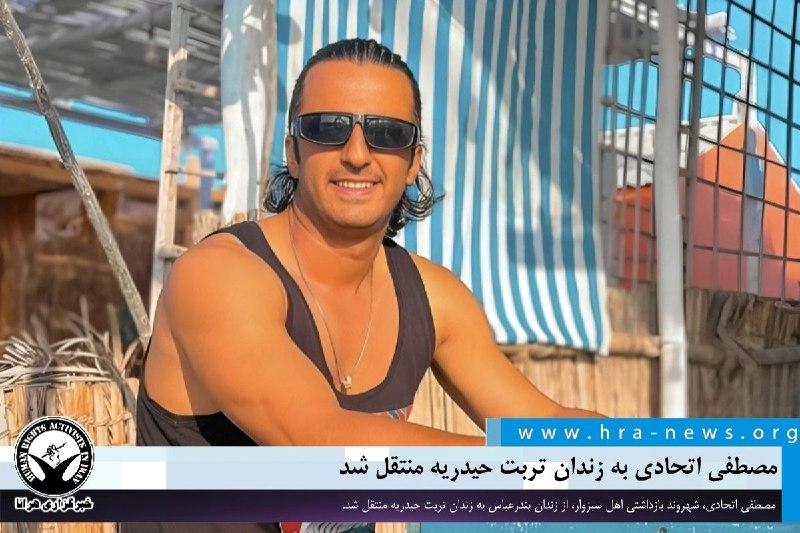

تداوم بازداشت؛ مصطفی اتحادی به زندان تربت‌حیدریه منتقل شد

❗️
❗️
❗️
❗️
❗️ – مصطفی اتحادی، شهروند اهل سبزوار که بیش از ۷۰ روز است بازداشت شده، در روزهای اخیر از زندان بندرعباس به زندان تربت‌حیدریه منتقل شد. وی همچنان در بلاتکلیفی قضایی به سر می‌برد.

به گزارش خبرگزاری هرانا، ارگان خبری مجموعه فعالان حقوق بشر در ایران، مصطفی اتحادی در بازداشت بسر میبرد.

یک منبع مطلع ضمن تایید این خبر به هرانا گفت: “از بازداشت آقای اتحادی ۷۲ روز می‌گذرد و او اواخر هفته گذشته از زندان بندرعباس به زندان تربت‌حیدریه منتقل شده است. وی همچنان در بلاتکلیفی قضایی به سر می‌برد و تاکنون امکان آزادی موقت او نیز فراهم نشده است.”

ادامه مطلب

#مصطفی_اتحادی

↘️
@hranews_bot تماس ✉️ -  @Hranews  کانال هرانا 🆑

## Hranews — post 112857

  

زندان وکیل‌آباد مشهد؛ تداوم بازداشت و بلاتکلیفی ملیکا خاوری و مینا زارعی

❗️
❗️
❗️
❗️
❗️ – ملیکا خاوری خراسانی و مینا زارعی، شهروندان ساکن مشهد، علیرغم گذشت ۷۱ روز از زمان بازداشت، کماکان به صورت بلاتکلیف در زندان وکیل‌آباد این شهر نگهداری می‌شوند.

به گزارش خبرگزاری هرانا، ارگان خبری مجموعه فعالان حقوق بشر در ایران، ملیکا خاوری خراسانی و مینا زارعی، کماکان در بازداشت به سر می‌برند.

یک منبع مطلع نزدیک به خانواده این شهروندان، ضمن تایید این خبر به هرانا گفت: «ملیکا خاوری خراسانی و مینا زارعی، به صورت جداگانه در تاریخ ۱۰ اسفند ۱۴۰۴ توسط نیروهای امنیتی بازداشت شدند. با گذشت زمان، این شهروندان کماکان به صورت بلاتکلیف در قرنطینه زندان وکیل‌آباد مشهد نگهداری می‌شوند.»

ادامه مطلب

#ملیکا_خاوری_خراسانی
#مینا_زارعی

↘️
@hranews_bot تماس ✉️ -  @Hranews  کانال هرانا 🆑

## Hranews — post 112856

  

گزارشی از بازداشت ۹ شهروند در سبزوار

❗️
❗️
❗️
❗️
❗️ – در روزهای اخیر، ۹ شهروند در سبزوار توسط نیروهای امنیتی #بازداشت و به زندان تربت‌حیدریه منتقل شدند. تاکنون هویت چهار تن از آنان، امیرحسین پایدار، فرزانه پروانه، سعید پروانه و الهام پروانه، از اعضای خانواده ابوالفضل پایدار، از جان‌باختگان اعتراضات دی‌ماه ۱۴۰۴، احراز شده است.

به گزارش خبرگزاری هرانا، ارگان خبری مجموعه فعالان حقوق بشر در ایران، روز سه شنبه ۱۵ اردیبهشت ۱۴۰۵، دست‌کم ۹ شهروند توسط نیروهای امنیتی در سبزوار بازداشت و به زندان تربت‌حیدریه منتقل شدند.

بر اساس اطلاعات دریافتی هرانا، بازداشت این شهروندان در پی اقدام به برگزاری مراسم تولد ابوالفضل پایدار، یکی از جان‌باختگان اعتراضات دی‌ماه ۱۴۰۴، صورت گرفته است. تاکنون هویت چهار تن از بازداشت‌شدگان که از اعضای خانواده ابوالفضل پایدار هستند، به نام‌های امیرحسین پایدار، فرزانه پروانه، سعید پروانه و الهام پروانه، احراز شده است.

ادامه مطلب

#امیرحسین_پایدار
#فرزانه_پروانه
#سعید_پروانه
#الهام_پروانه

↘️
@hranews_bot تماس ✉️ -  @Hranews  کانال هرانا 🆑

## Hranews — post 112855

  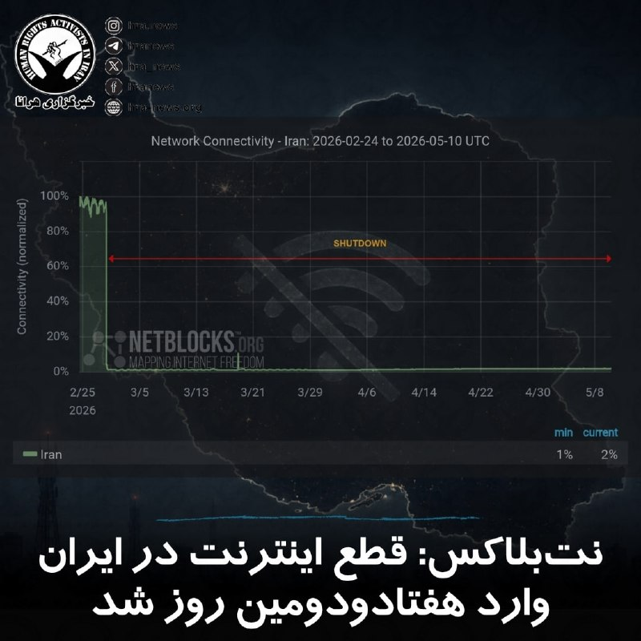

نت‌بلاکس، که محدودیت دسترسی به #اینترنت در جهان را رصد می‌کند، اعلام کرد که قطع اینترنت در ایران وارد هفتادودومین روز خود شده است. این نهاد با اشاره به تداوم محدودیت‌ها پس از ۱۷۰۴ ساعت، اعلام کرد که دسترسی کاربران ایرانی به اینترنت جهانی همچنان در وضعیت «تقریبا متوقف» قرار دارد و نشانه‌ای از بازگشت گسترده اینترنت بین‌المللی مشاهده نمی‌شود.

↘️
@hranews_bot تماس ✉️ -  @Hranews  کانال هرانا 🆑

## Hranews — post 112854

دادستان تهران علیه عباس عبدی، صادق زیباکلام و دو رسانه اعلام جرم کرد

❗️
❗️
❗️
❗️
❗️ – مرکز رسانه قوه قضاییه از #اعلام_جرم دادستان تهران علیه عباس عبدی و صادق زیباکلام خبر داد. همچنین دو رسانه منتشرکننده اظهارات این افراد نیز با گشایش پرونده قضایی مواجه شده‌اند.

ادامه مطلب

#عباس_عبدی
#صادق_زیباکلام

↘️
@hranews_bot تماس ✉️ -  @Hranews  کانال هرانا 🆑

## Hranews — post 112853

  

💥 دعوت به همکاری با خبرگزاری هرانا

خبرگزاری هرانا، با بیش از دو دهه سابقه در حوزه گزارشگری و مستندسازی حقوق بشر، در راستای توسعه فعالیت‌های خود از علاقه‌مندان واجد شرایط برای همکاری دعوت می‌کند.

هرانا در این مرحله بیش از آن‌که به دنبال افراد با سابقه حرفه‌ای باشد، به دنبال افرادی متعهد، دقیق و آموزش‌پذیر است؛ کسانی که دغدغه واقعی حقوق بشر دارند و مایل‌اند در یک چارچوب حرفه‌ای، مهارت‌های خود را توسعه دهند.

زمینه‌های همکاری شامل:
گزارشگری، ویراستاری، ترجمه، مدیریت شبکه‌های اجتماعی و سایر حوزه‌های مرتبط

ویژگی‌های مورد انتظار:

* تسلط کافی به زبان فارسی (خواندن و نوشتن)
* دقت، مسئولیت‌پذیری و توانایی یادگیری مستمر
* علاقه و حساسیت نسبت به موضوعات حقوق بشر
* آمادگی برای فعالیت در چارچوب‌های سازمان‌یافته و حرفه‌ای

❗️ توجه: درخواست‌ها صرفاً در صورتی بررسی خواهند شد که اطلاعات ثبت‌شده در فرم (از جمله کشور محل سکونت و سایر شرایط اعلام‌شده) با الزامات همکاری همخوانی داشته باشد.

همکاری با هرانا فرصتی است برای کسب تجربه عملی در حوزه مستندسازی و فعالیت‌های حقوق بشری در یک نهاد با سابقه و ساختار حرفه‌ای.

📎 برای ثبت درخواست همکاری، لطفا فرم زیر را تکمیل کنید:
https://hra.news/4cBjHqs

📩 در صورت بروز مشکل در تکمیل فرم، می‌توانید رزومه و اطلاعات تماس خود را به آدرس زیر ارسال نمایید:
info@hra-news.org

↘️
@hranews_bot تماس ✉️ -  @Hranews  کانال هرانا 🆑

## Hranews — post 112852

گزارشی از بیکاری و معوقات مزدی کارگران در شهرهای مختلف کشور

❗️
❗️
❗️
❗️
❗️– نایب رئیس کانون عالی #کارگران بازنشسته و مستمری بگیران تامین اجتماعی کشور از بیکاری حدود ۳۰۰ تن از کارگران شرکت «بشل موتور» سوادکوه پس از پایان قرارداد موقت آنها خبر داد. از سوی دیگر، شماری از کارکنان پتروشیمی چابهار نسبت به معوقات مزدی و تعدیل نیرو در این پتروشیمی گلایه‌مند هستند. همچنین جمعی از صیادان و ملوانان اعلام کردند که در پی شرایط مرتبط به جنگ اخیر، با بیکاری مواجه شده‌اند.

ادامه مطلب

↘️
@hranews_bot تماس ✉️ - @Hranews کانال هرانا 🆑

## Hranews — post 112851

  

مریم دریسی به حبس و شلاق محکوم شد

❗️
❗️
❗️
❗️
❗️– مریم دریسی، شهروند ساکن کازرون که در اسفند ماه با تودیع وثیقه آزاد شده بود، توسط دادگاه‌های کیفری کازرون و انقلاب شیراز مجموعا به دو سال و سه ماه حبس و تحمل ۷۴ ضربه #شلاق محکوم شد.

به گزارش خبرگزاری هرانا، ارگان خبری مجموعه فعالان حقوق بشر در ایران، مریم دریسی، به حبس و شلاق محکوم شد.

براساس حکم صادره توسط شعبه ۱۰۱ دادگاه کیفری دو کازرون، خانم دریسی از بابت اتهام «اخلال در نظم و آسایش عمومی» (ماده ۶۱۸ قانون مجازات اسلامى) به یک سال حبس و ۷۴ ضربه شلاق محکوم شده است. این حکم در تاریخ ۲۴ فروردین ۱۴۰۵ و به صورت غیابی صادر شده است. همچنین خانم دریسی در بخش دیگری از پرونده خود، توسط شعبه یک دادگاه انقلاب شیراز از بابت اتهام «تبلیغ علیه نظام» به یک سال و سه ماه حبس محکوم شده است. این حکم امروز به وکیل او در حالی ابلاغ شده که حداکثر مجازات قانونی این اتهام یک سال حبس است و دادگاه با استناد به مقررات تکرار جرم، مجازات وی را تشدید کرده است.

#مریم_دریسی

ادامه مطلب

↘️
@hranews_bot تماس ✉️ - @Hranews کانال هرانا 🆑

## Hranews — post 112850

مصدومیت ۴ کارگر از جمله یک آتش‌نشان در سایه فقدان ایمنی کار

❗️
❗️
❗️
❗️
❗️– در سایه فقدان ایمنی محیط و شرایط نامناسب کار، چهار #کارگر از جمله یک آتش‌نشان در شهرهای مشهد، خرم‌آباد، مارگون و پاکدشت، طی حوادثی حین انجام کار مصدوم شدند.

ادامه مطلب

↘️
@hranews_bot تماس ✉️ - @Hranews کانال هرانا 🆑

## Hranews — post 112849

به دلیل فروش فیلترشکن؛ ۲ شهروند در اسلامشهر بازداشت شدند
 

❗️
❗️
❗️
❗️
❗️ – بنا بر اعلام فرمانده انتظامی اسلامشهر، دو شهروند در این شهرستان به دلیل فروش فیلترشکن توسط ماموران پلیس امنیت و فتا #بازداشت شدند.
 
ادامه مطلب

↘️
@hranews_bot تماس ✉️ -  @Hranews  کانال هرانا 🆑

## Hranews — post 112848

  

داروهای کمیاب، قیمت‌های نجومی؛ روایت بیماران از بازار غیررسمی دارو پس از جنگ
 

❗️
❗️
❗️
❗️
❗️ – گزارش میدانی پیش‌رو به بحران #کمبود_دارو در ایران پس از جنگ و گسترش بازار غیررسمی فروش دارو می‌پردازد؛ بحرانی که بیماران را از صف داروخانه‌ها به کانال‌ها و گروه‌های تلگرامی کشانده است.
 
گزارش حاضر بر پایه روایت بیماران، خانواده‌ها و کارکنان داروخانه‌ها، تصویری از دشواری روزانه تهیه دارو، افزایش قیمت‌ها، نگرانی درباره اصالت داروهای بازار آزاد و شکل‌گیری شبکه‌های غیررسمی تأمین دارو ارائه می‌کند:
 
بعد از ساعت ۹ شب است اما صف مقابل داروخانه شبانه‌روزی خیابان طالقانی هنوز تمام نشده. بعضی بیماران نسخه‌های کاغذی را در دست دارند و بعضی دیگر عکس جعبه دارو را روی تلفن همراهشان نشان می‌دهند. زن میانسالی هر چند دقیقه یک بار نام داروی همسرش را زیر لب تکرار می‌کند؛ مرد جوانی کنار در ورودی مدام با چند داروخانه دیگر تماس می‌گیرد و پاسخ همه تقریباً یکسان است: «نداریم.»
 
ادامه مطلب

↘️
@hranews_bot تماس ✉️ -  @Hranews  کانال هرانا 🆑

## manototv — post 105246

  <a href="telegram/content/manototv_105246_1778424649.mp4" target="_blank">🎬 Download video</a>

اینسبروک | اتریش؛ گردهمایی ایرانیان ـ گزارشگر ۲۰ اردیبهشت ۱۴۰۵

## manototv — post 105245

  <a href="telegram/content/manototv_105245_1778424651.mp4" target="_blank">🎬 Download video</a>

ژنو | سوئیس؛ گردهمایی ایرانیان ـ گزارشگر ۲۰ اردیبهشت ۱۴۰۵

## manototv — post 105243

  <a href="telegram/content/manototv_105243_1778424653.mp4" target="_blank">🎬 Download video</a>

راهپیمایی ایرانیان ساکن استکهلم سوئد، یکشنبه ۲۰ اردیبهشت ۱۴۰۵

## manototv — post 105242

  <a href="telegram/content/manototv_105242_1778424655.mp4" target="_blank">🎬 Download video</a>

گردهمایی ایرانیان ساکن توکیو مقابل وزارت خارجه ژاپن، یکشنبه ۲۰ اردیبهشت

## manototv — post 105241

  <a href="telegram/content/manototv_105241_1778424657.mp4" target="_blank">🎬 Download video</a>

شماری از ایرانیان ساکن لندن روز شنبه ۱۰ مه با حضور در تجمعی مقابل دفتر نخست‌وزیر بریتانیا، مخالفت خود را با یهودستیزی اعلام کردند.

شرکت‌کنندگان در این گردهمایی با در دست داشتن پرچم‌های ایران و اسرائیل و پلاکاردهایی در حمایت از همزیستی و مقابله با نفرت‌پراکنی، خواستار ایستادگی در برابر یهودستیزی و افراط‌گرایی شدند.

این تجمع در حالی برگزار شد که در ماه‌های اخیر نگرانی‌ها درباره افزایش موارد یهودستیزی در بریتانیا و برخی کشورهای اروپایی افزایش یافته است.

## manototv — post 105240

  <a href="telegram/content/manototv_105240_1778424658.mp4" target="_blank">🎬 Download video</a>

راهپیمایی ایرانیان گوتنبرگ

## manototv — post 105239

  <a href="telegram/content/manototv_105239_1778424660.mp4" target="_blank">🎬 Download video</a>

حضور گسترده ایرانیان در تجمع ضد یهودستیزی در برابر دفتر نخست وزیر در لندن، یکشنبه ۲۰ اردیبهشت

## manototv — post 105238

  <a href="telegram/content/manototv_105238_1778424663.mp4" target="_blank">🎬 Download video</a>

دفتر رسانه‌ای دولت دبی اعلام کرد دود غلیظ مشاهده‌شده در منطقه الجداف، ناشی از آتش‌سوزی در یک قایق متوقف در خور دبی بوده است.

بر اساس این بیانیه، تیم‌های دفاع مدنی دبی حریق را در مدت ۵۴ دقیقه به طور کامل مهار کردند و عملیات خنک‌سازی محل ادامه دارد.

دفتر رسانه‌ای دولت دبی اعلام کرد در این حادثه هیچ مصدومی گزارش نشده و رنگ سیاه و غلظت دود به دلیل سوختن مواد فایبرگلاس به کار رفته در ساخت قایق بوده است.

## manototv — post 105237

  

خبرگزاری ایرنا نوشت پاسخ جمهوری اسلامی به آخرین متن پیشنهادی آمریکا برای خاتمه جنگ، امروز از طریق میانجی پاکستانی ارسال شده است.

بر اساس این گزارش، سخنگوی وزارت خارجه جمهوری اسلامی پیش‌تر گفته بود دیدگاه‌ها و ملاحظات تهران درباره پیشنهادهای آمریکا پس از تکمیل بررسی‌ها و جمع‌بندی نهایی ارسال می‌شود.

ایرنا افزود در طرح پیشنهادی، مذاکرات در این مرحله بر موضوع خاتمه جنگ در منطقه متمرکز خواهد بود.

## manototv — post 105236

  <a href="telegram/content/manototv_105236_1778424665.mp4" target="_blank">🎬 Download video</a>

یوری اوشاکوف، دستیار رئیس‌جمهور روسیه در امور سیاست خارجی، اعلام کرد استیو ویتکاف، فرستاده ویژه رئیس‌جمهور آمریکا، و جرد کوشنر، داماد دونالد ترامپ، احتمالا به‌زودی برای ادامه گفت‌وگوها به مسکو سفر می‌کنند.

به گزارش اینترفکس، اوشاکوف گفت: «دیر یا زود، فکر می‌کنم به‌زودی، همکاران دائمی ما استیو ویتکاف و کوشنر به مسکو می‌آیند و ما گفت‌وگو را با آن‌ها ادامه می‌دهیم.»

او همچنین گفت واشنگتن موضوع حل‌وفصل جنگ اوکراین را کنار نگذاشته و تماس‌های تلفنی فعال میان آمریکا و روسیه ادامه دارد. ودوموستی نیز نوشت این سفر احتمالی در چارچوب ادامه گفت‌وگوها درباره حل‌وفصل جنگ اوکراین مطرح شده است.

## manototv — post 105235

  <a href="telegram/content/manototv_105235_1778424665.mp4" target="_blank">🎬 Download video</a>

گزارشگرمنوتو: «به فراخوان شاهزاده رضا پهلوی، ما ایرانیان در شهر ماربیا روز ۱۰ مه گرد هم آمدیم تا صدای مردم ایران باشیم و حمایت خود را از انقلاب شیروخورشید اعلام کنیم.»

## manototv — post 105234

  

وزارت دفاع امارات اعلام کرد سامانه‌های پدافند هوایی این کشور روز ۲۰ اردیبهشت با دو پهپاد که به گفته این وزارتخانه از ایران شلیک شده بودند، مقابله کرده‌اند.

بر اساس اطلاعیه وزارت دفاع امارات، از آغاز درگیری‌ها، سامانه‌های پدافندی این کشور با چند حمله موشکی و پهپادی مقابله کرده‌اند.

## manototv — post 105233

  

همزمان با «روز مادر» که در بسیاری از کشورهای جهان در دومین یکشنبه ماه مه گرامی داشته می‌شود، تصویری از مادر مهراد صادقی، نوجوان جان‌باخته اعتراضات ۱۴۰۴، بر مزار فرزندش منتشر شده است. جهان مناسبت می‌سازد، سیاستمدارها پیام تبریک می‌دهند، و بعضی مادرها کنار سنگ قبر فرزندشان دراز می‌کشند. تمدن بشر، شاهکار تناقض.

متن خبر:

مهراد صادقی، نوجوان اصفهانی و نقاش، در جریان اعتراضات سال ۱۴۰۴ با اصابت گلوله نیروهای امنیتی از ناحیه پهلو جان باخت.

بنا بر روایت خانواده، مادر مهراد پس از بی‌پاسخ ماندن تماس‌هایش، سرانجام با فردی ناشناس روبه‌رو شد که با تلفن همراه فرزندش پاسخ داده و گفته بود: «فرزندتان تیر خورده، بیایید او را ببرید.»

خانواده می‌گویند مهراد را در حالی به خانه منتقل کردند که دیگر جان باخته بود و پیکر او به مدت دو روز در بالکن خانه نگهداری شد.

به گفته نزدیکان خانواده، پس از انتقال پیکر به باغ رضوان اصفهان، جسد برای مدتی به خانواده تحویل داده نشد و در نهایت حدود یک هفته بعد، پیکر مهراد تحویل و در همان‌جا به خاک سپرده شد.

## manototv — post 105232

  <a href="telegram/content/manototv_105232_1778424669.mp4" target="_blank">🎬 Download video</a>

گزارشگرمنوتو: «گردهمایی و راهپیمایی امروز ملبورن در پاسخ به فراخوان شاهزاده رضا پهلوی

تا زمان آزادی پا پس نمی‌کشیم و صدای ایران خواهیم بود.»

شماری از ایرانیان ساکن ملبورن امروز با حضور در این گردهمایی، حمایت خود را از انقلاب شیروخورشید و مردم داخل ایران اعلام کردند.

فراخوان این تجمع با محوریت اعتراض به «خاموشی سراسری اینترنت»، «اعدام‌های بی‌وقفه» و حمایت از زندانیان سیاسی منتشر شده بود.

## manototv — post 105231

  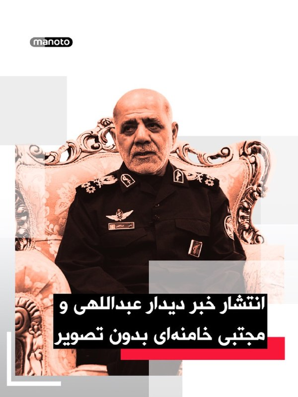

رسانه‌های جمهوری اسلامی گفته‌اند علی عبداللهی، فرمانده قرارگاه مرکزی خاتم‌الانبیا، با مجتبی خامنه‌ای دیدار کرده و گزارشی از آمادگی نیروهای مسلح، از جمله ارتش، سپاه، نیروی انتظامی، نهادهای امنیتی، مرزبانی، وزارت دفاع و بسیج ارائه داده است.

بر اساس این گزارش‌ها، عبداللهی گفته نیروهای مسلح از نظر روحیه رزمی، آمادگی دفاعی و هجومی، طرح‌های راهبردی و تجهیزات لازم برای مقابله با «دشمنان» در سطح بالایی از آمادگی قرار دارند.

این رسانه‌ها همچنین نوشتند مجتبی خامنه‌ای در این دیدار تدابیر تازه‌ای برای ادامه اقدامات و مقابله با دشمنان ابلاغ کرده است. با وجود انتشار متن این خبر، رسانه‌های جمهوری اسلامی تصویری از این دیدار منتشر نکردند.

## manototv — post 105230

  

کویت اعلام کرد چند پهپاد «متخاصم» در حریم هوایی این کشور شناسایی شده‌اند و با آن‌ها بر اساس رویه‌های تعیین‌شده برخورد شده است.

مقام‌های کویتی جزئیات بیشتری درباره تعداد دقیق پهپادها، مبدا احتمالی آن‌ها یا محل رهگیری منتشر نکرده‌اند.

## manototv — post 105229

  

خبرگزاری حکومتی مهر گزارش داد دقایقی پیش صدای یک انفجار شدید در شهر چابهار شنیده شده است.

بر اساس این گزارش، هنوز جزئیات بیشتری درباره علت انفجار، محل دقیق آن و خسارت‌های احتمالی منتشر نشده است.

تا زمان انتشار این خبر، مقام‌های محلی توضیحی درباره این حادثه نداده‌اند.

## manototv — post 105228

  <a href="telegram/content/manototv_105228_1778424673.mp4" target="_blank">🎬 Download video</a>

امیرحسین کریمی، یکی از شرکت‌کنندگان «آکادمی گوگوش»، درگذشت.

او از چهره‌های پرطرفدار و جنجالی آخرین فصل «آکادمی گوگوش» در «منوتو» بود و بسیاری او را با اجرای یکی از آثار فرهاد به یاد می‌آورند.

او که با نام «اردشیر پهلو» نیز شناخته می‌شد، پس از حضور در آکادمی گوگوش، مهمان نخستین قسمت برنامه «امید اِی‌اِم» در «منوتو» نیز بود و در میان مخاطبان این برنامه‌ها به چهره‌ای شناخته‌شده تبدیل شد.

بر اساس گزارش‌ها، او چند هفته پیش در نروژ دچار سانحه رانندگی شده بود و روز سه‌شنبه در ۳۹ سالگی جان باخت. خبر درگذشت او به‌تازگی منتشر شده است.

## manototv — post 105227

  

وزارت خارجه قطر اعلام کرد شیخ محمد بن عبدالرحمن بن جاسم آل ثانی، نخست‌وزیر و وزیر خارجه این کشور، در میامی با مارکو روبیو، وزیر خارجه آمریکا، و استیو ویتکاف، فرستاده آمریکا در امور خاورمیانه، دیدار کرده است.

به گزارش خبرگزاری رسمی قطر، در این دیدار روابط راهبردی دو کشور، به‌ویژه در حوزه‌های دفاع و انرژی، تحولات منطقه و تلاش‌های میانجی‌گرانه برای کاهش تنش‌ها بررسی شد.

وب‌سایت اکسیوس نیز گزارش داد این دیدار بخشی از تلاش‌ها برای دستیابی به توافقی برای پایان دادن به جنگ در ایران بوده است.

## manototv — post 105226

  

نت‌بلاکس اعلام کرد قطعی گسترده اینترنت در ایران پس از ۱۷۰۴ ساعت همچنان ادامه دارد و این محدودیت بی‌سابقه اکنون وارد سومین ماه خود شده است؛ در حالی که مقام‌های جمهوری اسلامی همچنان دسترسی عمومی به اینترنت بین‌المللی را برای مردم داخل ایران محدود نگه داشته‌اند.

## alonews — post 119095

  <a href="telegram/content/alonews_119095_1778424677.mp4" target="_blank">🎬 Download video</a>

👈بنیامین نتانیاهو: من فکر می‌کنم جنگ با ایران دستاوردهای زیادی داشته است، اما هنوز تمام نشده، زیرا هنوز مواد هسته‌ای، اورانیوم غنی‌شده وجود دارد که باید از ایران خارج شود.

🔴هنوز سایت‌های غنی‌سازی وجود دارند که باید منهدم شوند. هنوز نیروهای نیابتی وجود دارند که ایران از آن‌ها حمایت می‌کند.

🔴موشک‌های بالستیکی وجود دارند که آن‌ها هنوز می‌خواهند تولید کنند. حالا، ما بخش زیادی از آن را تضعیف کرده‌ایم، اما همه آن‌ها هنوز وجود دارند و کارهایی باید انجام شود.

✅ @AloNews خبر جنگ

## alonews — post 119094

  <a href="telegram/content/alonews_119094_1778424679.webm" target="_blank">🎬 Download video</a>

👈ترامپ: من هشت جنگ را به پایان رساندم و ما بهترین اقتصاد را که تاکنون داشته‌ایم داریم.

🔴همین که وارد اتاق می‌شوم، می‌بینم شاخص S&P در طول یک جنگ به اصطلاح، به بالاترین حد جدیدی رسیده است.

🔴من آن را یک درگیری نظامی می‌نامم چون نسبتاً آسان بود

✅ @AloNews خبر جنگ

## alonews — post 119093

  <a href="telegram/content/alonews_119093_1778424679.webm" target="_blank">🎬 Download video</a>

👈ترامپ: حتی اگر به اهداف باقی‌مانده در ایران حمله نکنیم، بازسازی آنها سال‌ها طول خواهد کشید.

✅ @AloNews خبر جنگ

## alonews — post 119092

  <a href="telegram/content/alonews_119092_1778424680.webm" target="_blank">🎬 Download video</a>

👈ترامپ: ما اکنون نفت و گازی بیشتر از مجموع روسیه و عربستان سعودی تولید می‌کنیم.

🔴 تا پایان امسال، این عدد احتمالاً دو برابر خواهد شد.

✅ @AloNews خبر جنگ

## alonews — post 119091

  <a href="telegram/content/alonews_119091_1778424680.mp4" target="_blank">🎬 Download video</a>

👈 ترامپ: ناتو ثابت کرده که یک ببر کاغذی است. آن‌ها برای کمک آنجا نبودند.

🔴جالب این است که بسیاری از کشورهای ناتو از تنگه هرمز استفاده می‌کنند — ما از تنگه استفاده نمی‌کنیم.

🔴ما به تنگه نیاز نداریم. ما این کار را برای کمک به اسرائیل و عربستان سعودی و قطر و امارات متحده عربی و دیگران انجام دادیم.

✅ @AloNews خبر جنگ

## alonews — post 119090

  <a href="telegram/content/alonews_119090_1778424682.mp4" target="_blank">🎬 Download video</a>

👈 ترامپ درباره جمهوري اسلامي: رهبران آن‌ها رفته‌اند، تیم A رفته، تیم B رفته و احتمالاً تیم C رفته است.

🔴ما با افرادی طرف هستیم که قدرتی خاص دارند. بسیار جالب است — آن‌ها توافق می‌کنند و سپس آن را نقض می‌کنند.

✅ @AloNews خبر جنگ

## alonews — post 119089

  <a href="telegram/content/alonews_119089_1778424684.mp4" target="_blank">🎬 Download video</a>

👈ترامپ درباره ایران: اگر من سلیمانی را از بین نمی‌بردم، فکر می‌کنم ایران کشور متفاوتی بود. کشور شایسته‌تری می‌شد.

🔴اما او نابغه‌ای شرور بود.

✅ @AloNews خبر جنگ

## alonews — post 119088

  <a href="telegram/content/alonews_119088_1778424686.webm" target="_blank">🎬 Download video</a>

👈ترامپ درباره ایران: ما نمی‌توانیم اجازه دهیم ایران سلاح هسته‌ای داشته باشد چون آن‌ها دیوانه هستند.

🔴اگر من توافق هسته‌ای اوباما با ایران را لغو نکرده بودم، آن‌ها اکنون آن را داشتند و ممکن بود از آن علیه اسرائیل و خاورمیانه و شاید فراتر استفاده کنند.

✅ @AloNews خبر جنگ

## alonews — post 119086

  <a href="telegram/content/alonews_119086_1778424687.webm" target="_blank">🎬 Download video</a>

👈ترامپ: ما اهداف مشخصی داریم که در ایران به دنبال دستیابی به آنها بوده‌ایم و شاید حدود ۷۰ درصد از آنها را محقق کرده باشیم

✅ @AloNews خبر جنگ

## alonews — post 119085

  <a href="telegram/content/alonews_119085_1778424687.webm" target="_blank">🎬 Download video</a>

👈ترامپ: ایران از نظر نظامی شکست خورده است و ممکن است خودشان متوجه این موضوع نباشند، اما من فکر می‌کنم که متوجه هستند.

🔴ایران شکست خورده است، اما این به معنای نابودی کامل آن نیست.

🔴ما می‌توانیم تا دو هفته دیگر علیه ایران اقدام نظامی انجام دهیم و به تک تک اهداف شناسایی شده حمله کنیم

✅ @AloNews خبر جنگ

## alonews — post 119084

  <a href="telegram/content/alonews_119084_1778424687.webm" target="_blank">🎬 Download video</a>

👈ترامپ: هنوز اهدافی داریم که محقق نشده

✅ @AloNews خبر جنگ

## alonews — post 119083

  <a href="telegram/content/alonews_119083_1778424687.webm" target="_blank">🎬 Download video</a>

👈ترامپ: ما می‌توانیم تا دو هفته دیگر علیه ایران اقدام نظامی انجام دهیم و به تک تک اهداف شناسایی شده حمله کنیم.

✅ @AloNews خبر جنگ

## alonews — post 119082

  <a href="telegram/content/alonews_119082_1778424688.webm" target="_blank">🎬 Download video</a>

👈ترامپ کلیپ‌هایی از مارک لوین منتشر می‌کند که استدلال می‌کند فشار بر ایران باید ادامه یابد و پیشنهاد می‌دهد ممکن است یک دور دیگر مبارزه اجتناب‌ناپذیر باشد تا موقعیت آمریکا را پیش از مذاکرات تقویت کند.

✅ @AloNews خبر جنگ

## alonews — post 119081

  <a href="telegram/content/alonews_119081_1778424688.webm" target="_blank">🎬 Download video</a>

👈ترامپ: نگفتم که عملیات نظامی علیه ایران تمام شده است، اما گفتم که آنها شکست خوردند

✅ @AloNews خبر جنگ

## alonews — post 119080

  <a href="telegram/content/alonews_119080_1778424688.webm" target="_blank">🎬 Download video</a>

👈ترامپ: اگر کسی به اورانیوم غنی‌شده ایران که زیر آوار دفن شده نزدیک شود، ما از آن مطلع خواهیم شد و آن را منفجر خواهیم کرد

✅ @AloNews خبر جنگ

## alonews — post 119079

  <a href="telegram/content/alonews_119079_1778424688.webm" target="_blank">🎬 Download video</a>

👈ترامپ: بالاخره به اورانیوم غنی‌شده ایران که زیر آوار مدفون شده، خواهیم رسید

🔴ما اورانیوم غنی‌شده ایران را که زیر آوار دفن شده است، زیر نظر داریم و نیروی فضایی ایالات متحده آن را مدیریت می‌کند.

✅ @AloNews خبر جنگ

## alonews — post 119078

  <a href="telegram/content/alonews_119078_1778424689.webm" target="_blank">🎬 Download video</a>

👈رئیس ستاد ارتش اسرائیل: ما در بالاترین سطح آماده باش برای بازگشت به جنگ ایران هستیم

✅ @AloNews خبر جنگ

## alonews — post 119077

  <a href="telegram/content/alonews_119077_1778424689.mp4" target="_blank">🎬 Download video</a>

👈نیروهای پزشکی ارتش بریتانیا با چتر پریدن تو جزیره تریستان دا کونیا وسط اقیانوس اطلس

🔴 رفتن کمک یه شهروند انگلیسی که "هانتاویروس" گرفته

✅ @AloNews خبر جنگ

## alonews — post 119076

  <a href="telegram/content/alonews_119076_1778424691.webm" target="_blank">🎬 Download video</a>

👈سفیر اسلام آباد در مسکو: مذاکرات ایران-آمریکا به بن‌بست نرسیده است

🔴 مذاکرات ادامه دارد و ما معتقدیم که دیر یا زود به نتیجه خواهیم رسید

✅ @AloNews خبر جنگ

## alonews — post 119075

  <a href="telegram/content/alonews_119075_1778424691.webm" target="_blank">🎬 Download video</a>

👈مایک والتز» سفیر آمریکا در سازمان ملل متحد به شبکه ABC گفت: مذاکرات با ایران و روند دیپلماتیک ادامه دارد، بنابراین خواهیم دید چه اتفاقی می‌افتد

✅ @AloNews خبر جنگ

---
📅 بروزرسانی: 1405/02/19 18:12
---

## VahidOOnLine — post 239107

  

♦️ ابراهیم عزیزی، رئیس کمیسیون امنیت ملی مجلس شورای اسلامی، روز شنبه ۱۹ اردیبهشت، با انتشار پیامی در شبکه اجتماعی ایکس کشورهای منطقه از جمله بحرین را تهدید کرد که در صورت همراهی با قطعنامه پیشنهادی آمریکا در شورای امنیت سازمان ملل، با «پیامدهای جدی» مواجه خواهد شد.

عزیزی بحرین را «کشور ذره‌بینی» خواند و نوشت: «به دولت‌هایی همچون کشور ذره‌بینی بحرین که در حال همراهی با قطعنامه آمریکایی هستند، درباره پیامدهای جدی این اقدام هشدار می‌دهیم. درهای تنگه هرمز را برای همیشه به روی خود نبندید!»

قطعنامه مذکور که با حمایت آمریکا و کشورهای حوزه خلیج فارس به شورای امنیت سازمان ملل ارائه شده، از ایران می‌خواهد که ضمن توقف حملات علیه شناورهایی که قصد عبور از تنگه هرمز را دارند، محل دقیق مین‌های کارگذاری شده را اعلام کند و از دریافت هرگونه عوارض عبور از شناورهای عبوری خودداری کند.
‌🇸🇦 Indypersian

🤖 @VahidOOnLine

## VahidOOnLine — post 239106

  

وزارت خارجه عربستان سعودی در بیانیه‌ای حمایت کامل ریاض را از اقداماتی اعلام کرد که پادشاهی بحرین برای مقابله با آنچه «اقدام‌های صادرشده از سوی ایران» خوانده، اتخاذ کرده است.

در این بیانیه آمده است این اقدام‌ها به گفته مقام‌های سعودی، امنیت ملی بحرین را تحت تاثیر قرار می‌دهد و با هدف بی‌ثبات کردن امنیت و ثبات این کشور انجام می‌شود.
‌🏁 🇬🇧 ManotoTV

🤖 @VahidOOnLine

## VahidOOnLine — post 239105

  <a href="telegram/content/VahidOOnLine_239105_1778337776.mp4" target="_blank">🎬 Download video</a>

دانمارک؛ «پاینده ایران، جاوید شاه
‌🏁 🇬🇧 ManotoTV

🤖 @VahidOOnLine

## pm_afshaa — post 90413

علم‌الگدا: گرانی ها ، کار پیاده‌نظام‌های
دشمنه

💧 Rainbet.com the #1 Non-KYC Crypto Casino & Sportsbook @rainbetcom

😁 @Pm_Afshaa

## pm_afshaa — post 90412

💰تعرفه
💰

1 گیگ    
⬆️ 295 ت

500 مگ 
⬆️ 185 ت

100 مگ 
⬆️ 55 ت

⭐️ اتصال پایدار در نت ملی

⭐️ مناسب اینستاگرام و تلگرام و یوتیوب

⭐️ دارای سایت استعلام باقی حجم

⭐️ بدون محدودیت کاربر و بدون انقضا

⭐️ ضمانت بازگشت وجه درصورت عدم رضایت

🌟 تست هم موجود میباشد 
🌟

جهت خرید به آیدی زیر پیام دهید 
⬆️

Admin : @Four_Support 
👨‍💻

Channel : @Four_Vpn_4 
🩵

🎇داخل گروه زیر هر شب قرعه کشی ۱۰ اشتراک رایگان انجام میشود 
⬆️
https://t.me/+v8GFmLXjHa5jNDZk

## pm_afshaa — post 90411

  <a href="telegram/content/pm_afshaa_90411_1778337778.webm" target="_blank">🎬 Download video</a>

🔴رئیس کمیسیون آموزش مجلس: به آسیب‌دیدگان جنگ سهمیهٔ کنکور تعلق میگیره.

💧 Rainbet.com the #1 Non-KYC Crypto Casino & Sportsbook @rainbetcom

😁 @Pm_Afshaa

## IranIntlTV — post 336312

  <a href="telegram/content/IranIntlTV_336312_1778337779.mp4" target="_blank">🎬 Download video</a>

سرخط خبرهای شنبه ۱۹ اردیبهشت
@iranintltv

## IranIntlTV — post 336311

  <a href="telegram/content/IranIntlTV_336311_1778337780.mp4" target="_blank">🎬 Download video</a>

ایرانیان مقیم لندن در حمایت از انقلاب ملی و در پاسخ به فراخوان شاهزاده رضا پهلوی در این شهر تجمع کردند.

گفت‌وگوی تاج‌الدین سروش، خبرنگار ایران‌اینترنشنال، با شرکت‌کنندگان در این تجمع
@iranintltv

## ManotoTV — post 105196

  

وزارت خارجه عربستان سعودی در بیانیه‌ای حمایت کامل ریاض را از اقداماتی اعلام کرد که پادشاهی بحرین برای مقابله با آنچه «اقدام‌های صادرشده از سوی ایران» خوانده، اتخاذ کرده است.

در این بیانیه آمده است این اقدام‌ها به گفته مقام‌های سعودی، امنیت ملی بحرین را تحت تاثیر قرار می‌دهد و با هدف بی‌ثبات کردن امنیت و ثبات این کشور انجام می‌شود.

## FarsiVOA — post 217267

🔺طرح اتهام علیه دو مظنون به تهیه «محتوای یهودستیزانه» در بریتانیا

▪️بریتانیا می‌گوید دو مرد پس از ضبط ویدیوهایی یهودستیزانه برای انتشار شبکه اجتماعی تیک‌تاک، به «آزار شهروندان با انگیزه مذهبی» متهم شدند.

⬇️ بیشتر بخوانید:

https://ir.voanews.com/a/britain-antisemitic-london-police-/8148287.html/?nocach=1

## Persian_Trend_Official — post 13756

  <a href="telegram/content/Persian_Trend_Official_13756_1778337783.mp4" target="_blank">🎬 Download video</a>

🔴یکی از دلایل قطع بودن اینترنت تلاش برای القا روایت مورد پسند حاکمیت به فضای درونی جامعه است

🫆:Tony

📌 @persian_trend_official
پرشین ترند | متفاوت‌ترین کانال نظامی

## IranianMinds — post 19838

🔴دونالد ترامپ:

اگر همه چیز امضاء و نهایی نشود، مسیر متفاوتی را پیش خواهیم گرفت.
اگر اتفاقی حاصل نشود، ممکن است به پروژه آزادسازی تنگه هرمز بازگردیم، اما آن پروژه آزادی پلاس خواهد بود.
پروژه آزادی به اضافه موارد دیگر.

@IranianMinds

## Dirty_Kids — post 389167

  <a href="telegram/content/Dirty_Kids_389167_1778337785.mp4" target="_blank">🎬 Download video</a>

ویدئویی که تو این روزهای بی‌نِتی وایرال شده؛

دختره پشت فرمون داره مشروب میخوره و با افتخار فیلم هم می‌گیره! کاش اگه تصادف کردی حداقل فقط خودت آسیب ببینب و به بقیه آسیب نزنی...

اینا همینایی هستن که بی‌حجاب میرن تجمعات عرزشیا

@Dirty_Kids 👻

## alonews — post 118895

  <a href="telegram/content/alonews_118895_1778337787.webm" target="_blank">🎬 Download video</a>

👈وزارت دفاع هند از آزمایش موفق موشک پیشرفته «آگنی» مجهز به سامانه‌های مستقل هدف‌گیری‌شده چندگانه از جزیره خبر داد.
 

🔴بنابر اعلام وزارت دفاع هند، این موشک به اهداف از پیش تعیین شده در منطقه اقیانوس هند با موفقیت برخورد کرد.

✅ @AloNews خبر جنگ

---
📅 بروزرسانی: 1405/02/19 18:02
---

## VahidOOnLine — post 239104

  

رجب طیب اردوغان، رییس‌جمهور ترکیه در دیدار با مسرور بارزانی، نخست‌وزیر اقلیم کردستان عراق گفت که ترکیه از هدف قرار گرفتن اربیل در جریان جنگ ایران متاسف شده و به هیچ وجه نمی‌خواهد درگیری به دیگر کشورهای منطقه گسترش یابد.

اربیل عراق و مقرهای احزاب کرد ایرانی در این منطقه، از زمان آغاز جنگ میان جمهوری اسلامی و آمریکا و اسرائیل، بارها از سوی حکومت ایران هدف حملات موشکی و پهپادی قرار گرفت.
‌🏁 🇬🇧 IranintlTV

🤖 @VahidOOnLine

## VahidOOnLine — post 239103

  

ویدیویی از معاون جمعیت هلال احمر منتشر شده که در آن می‌گوید در روز نخست حمله آمریکا و اسرائیل به «بیت رهبری»، علی لاریجانی، عباس عراقچی و علی‌اکبر صالحی در محل حضور داشتند. بر پایه این گفتگو آن‌ها زمان حملات در بیت بودن و به صورت «خاک و خلی» مشاهده شده‌اند.
‌🏁 🇬🇧 ManotoTV

🤖 @VahidOOnLine

## VahidOOnLine — post 239102

  

به دنبال فراخوان شاهزاده رضا پهلوی، ایرانیان روز یک‌شنبه، ۲۰ اردیبهشت در شهرهای مختلف جهان در اعتراض به خاموشی اینترنت، بازداشت‌های گسترده و احکام اعدام تجمع و راهپیمایی برگزار می‌کنند.
عنوان فراخوان «یک ملت در گروگان» اعلام شده و هدف از برگزاری، اعتراض به خاموشی اینترنت، بازداشت‌های گسترده و ادامه اعدام شهروندان عنوان شده است.

تجمع سیدنی در استرالیا ساعت ۱۵:۰۰ به وقت محلی آغاز می‌شود و شرکت‌کنندگان مسیر «نورث هاید پارک» تا «مارتین پلیس» را راهپیمایی خواهند کرد. تجمع سئول در کره جنوبی ساعت ۱۶:۰۰ به وقت محلی مقابل ساختمان وزارت خارجه برگزار می‌شود.

تجمع استکهلم در سوئد ساعت ۱۳:۰۰ به وقت محلی در میدان «نورا بانتوریه» برگزار خواهد شد. معترضان در برلین ساعت ۱۵:۰۰ به وقت محلی از «پوتسدامر پلاتس» به سمت «براندنبورگ تور» راهپیمایی می‌کنند و تجمع فرانکفورت ساعت ۱۶:۰۰ به وقت محلی در مرکز شهر برگزار می‌شود.

بر اساس این فراخوان، تجمع تورنتو در کانادا ساعت ۱۳:۰۰ به وقت محلی در مقابل کتابخانه «ریچموند هیل» برگزار خواهد شد و ایرانیان در لس‌آنجلس نیز ساعت ۱۶:۰۰ به وقت محلی در «ویلسایر بولوار» گرد هم می‌آیند.
https://ira
‌🏁 🇬🇧 IranintlTV

🤖 @VahidOOnLine

## IranIntlTV — post 336310

  

رجب طیب اردوغان، رییس‌جمهور ترکیه در دیدار با مسرور بارزانی، نخست‌وزیر اقلیم کردستان عراق گفت که ترکیه از هدف قرار گرفتن اربیل در جریان جنگ ایران متاسف شده و به هیچ وجه نمی‌خواهد درگیری به دیگر کشورهای منطقه گسترش یابد.

اربیل عراق و مقرهای احزاب کرد ایرانی در این منطقه، از زمان آغاز جنگ میان جمهوری اسلامی و آمریکا و اسرائیل، بارها از سوی حکومت ایران هدف حملات موشکی و پهپادی قرار گرفت.
https://iranintl.com/202605098953

## IranIntlTV — post 336309

  <a href="telegram/content/IranIntlTV_336309_1778337164.mp4" target="_blank">🎬 Download video</a>

رییس انجمن اهدای عضو ایران از کاهش شدید اهدای عضو در شرایط جنگی خبر داد. کتایون نجف‌زاده با اشاره به کاهش ۵۰ تا ۷۰ درصدی اهدای عضو گفت روزانه ۷ تا ۱۰ نفر در کشور به همین دلیل جان خود را از دست می دهند.

گفت‌وگو با مازیار صدری، فوق تخصص مراقبت‌های ویژه
@iranintltv

## IranIntlTV — post 336308

  <a href="telegram/content/IranIntlTV_336308_1778337166.mp4" target="_blank">🎬 Download video</a>

بنا بر اطلاعات رسیده به ایران‌اینترنشنال، به بازیکنان شاغل در لیگ‌های داخلی فوتبال ایران وعده داده شده در صورت حضور در تجمعات شبانه، چهار درصد کسر شده از قراردادشان به آن‌ها بازگردانده خواهد شد.

جزییات بیشتر در گفت‌وگو با رها پوربخش، عضو تحریریه ایران‌اینترنشنال
@iranintltv

## IranIntlTV — post 336307

  

به دنبال فراخوان شاهزاده رضا پهلوی، ایرانیان روز یک‌شنبه، ۲۰ اردیبهشت در شهرهای مختلف جهان در اعتراض به خاموشی اینترنت، بازداشت‌های گسترده و احکام اعدام تجمع و راهپیمایی برگزار می‌کنند.
عنوان فراخوان «یک ملت در گروگان» اعلام شده و هدف از برگزاری، اعتراض به خاموشی اینترنت، بازداشت‌های گسترده و ادامه اعدام شهروندان عنوان شده است.

تجمع سیدنی در استرالیا ساعت ۱۵:۰۰ به وقت محلی آغاز می‌شود و شرکت‌کنندگان مسیر «نورث هاید پارک» تا «مارتین پلیس» را راهپیمایی خواهند کرد. تجمع سئول در کره جنوبی ساعت ۱۶:۰۰ به وقت محلی مقابل ساختمان وزارت خارجه برگزار می‌شود.

تجمع استکهلم در سوئد ساعت ۱۳:۰۰ به وقت محلی در میدان «نورا بانتوریه» برگزار خواهد شد. معترضان در برلین ساعت ۱۵:۰۰ به وقت محلی از «پوتسدامر پلاتس» به سمت «براندنبورگ تور» راهپیمایی می‌کنند و تجمع فرانکفورت ساعت ۱۶:۰۰ به وقت محلی در مرکز شهر برگزار می‌شود.

بر اساس این فراخوان، تجمع تورنتو در کانادا ساعت ۱۳:۰۰ به وقت محلی در مقابل کتابخانه «ریچموند هیل» برگزار خواهد شد و ایرانیان در لس‌آنجلس نیز ساعت ۱۶:۰۰ به وقت محلی در «ویلسایر بولوار» گرد هم می‌آیند.

## ManotoTV — post 105195

  <a href="telegram/content/ManotoTV_105195_1778337168.mp4" target="_blank">🎬 Download video</a>

دانمارک؛ «پاینده ایران، جاوید شاه

## ManotoTV — post 105194

  

ویدیویی از معاون جمعیت هلال احمر منتشر شده که در آن می‌گوید در روز نخست حمله آمریکا و اسرائیل به «بیت رهبری»، علی لاریجانی، عباس عراقچی و علی‌اکبر صالحی در محل حضور داشتند. بر پایه این گفتگو آن‌ها زمان حملات در بیت بودن و به صورت «خاک و خلی» مشاهده شده‌اند.

## BBCPersian — post 280582

🔻لبنان: یک نفر بر اثر حملات امروز اسرائیل کشته شد

لبنان اعلام کرد که با وجود آتش‌بس با حزب‌الله، در حملات امروز اسرائیل به جنوب این کشور دست‌کم یک نفر کشته شده است.

این حملات پس از صدور هشدار تخلیه برای چندین روستا از سوی ارتش اسرائیل انجام شد.

نیروهای اسرائیلی و حزب‌الله مورد حمایت ایران، از زمان اجرایی شدن توافق آتش‌بس در لبنان در ۱۷ آوریل، تقریباً هر روز و عمدتاً در جنوب لبنان با یکدیگر تبادل آتش داشته‌اند.

ارتش اسرائیل از ساکنان ۹ روستا خواسته بود منطقه را تخلیه کنند و هشدار داده بود که در واکنش به «نقض توافق آتش‌بس» از سوی حزب‌الله، «با قدرت» اقدام خواهد کرد.

خبرگزاری رسمی لبنان گزارش داد که جنگنده‌های اسرائیلی یک شهرک در جنوب و چند منطقه دیگر را که در هشدار تخلیه ذکر شده بودند، هدف قرار دادند.

https://bbc.in/3Pf13yO
@BBCPersian

## BBCPersian — post 280581

  <a href="https://t.me/bbcpersian/280581" target="_blank">📎 Download file</a>

📻این هفته در پرگار: شکل نظام سیاسی، موضوعی فرعی؟

🔻آیا شکل یک نظام سیاسی مهم نیست و آنچه اهمیت دارد مضمون آن است؟ آیا مفهوم مشروطه جواب این سوال را می‌دهد؟

میهمان‌ها:
فرزانه بذرپور، تحلیل‌گر سیاسی
دامون گلریز، تحلیل‌گر سیاسی
 
@BBCPersian

## Dirty_Kids — post 389166

  <a href="telegram/content/Dirty_Kids_389166_1778337171.mp4" target="_blank">🎬 Download video</a>

ویدیو وایرال شده از پیرسگی ولایی در هنگام فرار از دست مردم

قیافه‌هارو ببینید!! همه عرب فلسطینی لبنانی عراقی افغانین.. پول ما صرف چه چیزایی میشه

@Dirty_Kids 👻

## Dirty_Kids — post 389165

‏یعنی من شک نداشتم اینا مخازن پر بشه سر شیلنگ رو میگیرن سمت خلیج فارس. اونی که ۴۰ هزار معترض رو میکشه مگه از نابود کردن اکولوژی ابایی داره؟

@Dirty_Kids 👻

## manototv — post 105196

  

وزارت خارجه عربستان سعودی در بیانیه‌ای حمایت کامل ریاض را از اقداماتی اعلام کرد که پادشاهی بحرین برای مقابله با آنچه «اقدام‌های صادرشده از سوی ایران» خوانده، اتخاذ کرده است.

در این بیانیه آمده است این اقدام‌ها به گفته مقام‌های سعودی، امنیت ملی بحرین را تحت تاثیر قرار می‌دهد و با هدف بی‌ثبات کردن امنیت و ثبات این کشور انجام می‌شود.

## manototv — post 105195

  <a href="telegram/content/manototv_105195_1778337174.mp4" target="_blank">🎬 Download video</a>

دانمارک؛ «پاینده ایران، جاوید شاه

## manototv — post 105194

  

ویدیویی از معاون جمعیت هلال احمر منتشر شده که در آن می‌گوید در روز نخست حمله آمریکا و اسرائیل به «بیت رهبری»، علی لاریجانی، عباس عراقچی و علی‌اکبر صالحی در محل حضور داشتند. بر پایه این گفتگو آن‌ها زمان حملات در بیت بودن و به صورت «خاک و خلی» مشاهده شده‌اند.

## alonews — post 118894

  <a href="telegram/content/alonews_118894_1778337175.mp4" target="_blank">🎬 Download video</a>

یک روحانی:اگه تو بهشت زمین بخواهید باید هرمتر ۱۷۰۰دلار بدید بیاد

[@AloTweet]

## alonews — post 118893

  <a href="telegram/content/alonews_118893_1778337177.webm" target="_blank">🎬 Download video</a>

👈نشریه نشنال امارات: انتظار می‌رود روز دوشنبه (به صورت احتمالی)، شورای امنیت سازمان ملل به پیش‌نویس قطعنامه تغییر یافته آمریکا و شورای همکاری خلیج فارس درباره تنگه هرمز رأی دهد

🔴در پیش‌نویس جدید: فصل هفتم (اقدام نظامی) حذف شده است.

🔴 سطح اجرا به امکان بررسی تحریم‌ها در آینده کاهش یافته است.

🔴عبارت‌هایی درباره گفتگو، کاهش تنش و «صلح پایدار» اضافه شده است.

🔴خواسته‌های اصلی از ایران از جمله پایان حملات، پاک‌سازی مین و توقف اخذ عوارض، تا حد زیادی بدون تغییر باقی مانده است

✅ @AloNews خبر جنگ

## alonews — post 118892

  <a href="telegram/content/alonews_118892_1778337177.webm" target="_blank">🎬 Download video</a>

👈اکونومیست : روسیه می‌خواد 5000 پهپاد برای حمله به نیروهای آمریکا به ایران بده که با جنگ الکترونیک هم نمی‌شه جلوشون وایساد

✅ @AloNews خبر جنگ

---
📅 بروزرسانی: 1405/02/19 17:52
---

## kianmeli1 — post 87293

  

🔴اقلام رکورددار در تورم/ روغن جامد با ۳۸۵درصد افزایش در صدر
https://t.me/kianmeli1

## IranIntlTV — post 336306

  <a href="telegram/content/IranIntlTV_336306_1778336564.mp4" target="_blank">🎬 Download video</a>

روزنامه دنیای اقتصاد گزارش داد حذف امارات از شرکای تجاری ایران می‌تواند زنجیره تامین کالا در ایران را به‌سرعت تحت تاثیر قرار دهد؛ چرا که بیش از ۳۰ درصد واردات و بخش عمده تامین ارز کالاها از طریق بازار امارات انجام می‌شود.
گفت‌وگو با اشکان نظام‌آبادی، روزنامه‌نگار اقتصادی
@iranintltv

## DW_Farsi — post 124480

  <a href="telegram/content/DW_Farsi_124480_1778336565.mp4" target="_blank">🎬 Download video</a>

🎥 احتمال قطع پخش جام جهانی در چین

چین با حدود ۲۰۰ میلیون هوادار فوتبال، یکی از بزرگ‌ترین بازارهای فوتبالی جهان به حساب می‌آید.
اما اختلاف میان فیفا و شبکه دولتی چین بر سر حق پخش، حالا این احتمال را ایجاد کرده که میلیون‌ها نفر در چین نتوانند جام جهانی را تماشا کنند.
@dw_farsi

## IranianMinds — post 19837

🔴علم‌الهدی هم گفته که گرانی، کار پیاده‌نظام‌های دشمن است.

@IranianMinds

## alonews — post 118891

  <a href="telegram/content/alonews_118891_1778336567.webm" target="_blank">🎬 Download video</a>

👈یک منبع دیپلماتیک ایرانی به الجزیره عربی گفت که تصاویر مربوط به بازدید رئیس جمهور مصر و رئیس امارات از نیروهای نظامی در امارات، اطلاعات جدیدی برای تهران محسوب نمی‌شود و اشاره کرد که ایران از حمایت مصر از کشورهای حاشیه خلیج فارس آگاه است و ماهیت روابط قاهره با شرکای عرب خود را درک می‌کند.

🔴این منبع ایرانی گفت که نگرانی ایران معطوف به حمایت از آمریکا و اسرائیل در جنگ علیه تهران است و تأکید کرد که ایران، مصر را به دنبال رویارویی یا ارائه هرگونه حمایت برای حمله به ایران نمی‌بیند و بنابراین مصر را طرفدار چنین اقداماتی محسوب نمی‌کند.

🔴لازم به ذکر است که اخیرا یک اسکادران از جنگنده‌های رافال نیروی هوایی مصر در امارات متحده عربی مستقر شد.

✅ @AloNews خبر جنگ

---
📅 بروزرسانی: 1405/02/19 17:42
---

## VahidOOnLine — post 239101

  

روح‌الله متفکر آزاد، عضو هیات‌ رییسه مجلس گفت: «اگر امارات متحده عربی از عقلانیت استراتژیک برخوردار باشد، هرگز به‌خاطر منافع اسرائیل و آمریکا که در این میدان ناکام مانده‌اند، خود را در مهلکه‌ای بزرگ‌تر از توان و ظرفیت خود قرار نخواهد داد.»

او افزود: «امارات برای جمهوری اسلامی عددی محسوب نمی‌شود.»

این نماینده مجلس ادامه داد: «توصیه می‌شود اماراتی‌ها با درک قواعد این جنگ، از ورود به عرصه‌ای که فراتر از ظرفیت و اندازه آن‌هاست، خودداری کنند.»
‌🏁 🇬🇧 IranintlTV

🤖 @VahidOOnLine

## VahidOOnLine — post 239100

  

♦️ دولت ایالات متحده در حال برنامه‌ریزی برای تخلیه مسافران آمریکایی از یک کشتی تفریحی است که با شیوع مرگبار ویروس هانتا (Hantavirus) مرتبط است.
 
به گزارش فاکس‌نیوز، تیمی از مرکز کنترل و پیشگیری از بیماری‌ها (CDC) در جزایر قناری مستقر شده است تا میزان قرارگیری در معرض آلودگی و نیازهای نظارتی را ارزیابی کند.
 
مسافران با یک پرواز اختصاصیِ پزشکی به «مرکز ملی قرنطینه» در دانشگاه نبراسکا منتقل خواهند شد تا تحت مراقبت‌های پزشکی قرار بگیرند.
 
همچنین، متخصصان بیشتری از CDC جهت پشتیبانی از ارزیابی‌های سلامت در پایگاه هوایی «آف‌ات» (Offutt) در همان نزدیکی مستقر خواهند شد.
‌🇸🇦 Indypersian

🤖 @VahidOOnLine

## IranIntlTV — post 336305

  

روح‌الله متفکر آزاد، عضو هیات‌ رییسه مجلس گفت: «اگر امارات متحده عربی از عقلانیت استراتژیک برخوردار باشد، هرگز به‌خاطر منافع اسرائیل و آمریکا که در این میدان ناکام مانده‌اند، خود را در مهلکه‌ای بزرگ‌تر از توان و ظرفیت خود قرار نخواهد داد.»

او افزود: «امارات برای جمهوری اسلامی عددی محسوب نمی‌شود.»

این نماینده مجلس ادامه داد: «توصیه می‌شود اماراتی‌ها با درک قواعد این جنگ، از ورود به عرصه‌ای که فراتر از ظرفیت و اندازه آن‌هاست، خودداری کنند.»
https://iranintl.com/202605097571

## IranIntlTV — post 336304

  <a href="telegram/content/IranIntlTV_336304_1778335957.mp4" target="_blank">🎬 Download video</a>

ایرانیان آلمان روز شنبه در دوسلدورف تجمع کرده و ضمن حمایت از انقلاب ملی فریاد پشتیبانی از شاهزاده رضا پهلوی سر دادند.

@iranintltv

## Persian_Trend_Official — post 13755

  <a href="telegram/content/Persian_Trend_Official_13755_1778335958.mp4" target="_blank">🎬 Download video</a>

🔴ویدیویی منتشر شده سنتکام از هدف قرار دادن لانچرهای موشکی جمهوری اسلامی در زمان قبل از آتش بس

🫆:Tony

📌 @persian_trend_official
پرشین ترند | متفاوت‌ترین کانال نظامی

## IranianMinds — post 19836

  

🔴ترامپ مقاله‌ی یک ماهه را منتشر کرد که ادعا می‌کند بیشتر آمریکایی‌ها معتقدند جلوگیری از دستیابی ایران به سلاح هسته‌ای مهم‌تر از پایان دادن به جنگ است، با عنوان بسیار مهم. این موضع کشور ما است.

@IranianMinds

## BBCPersian — post 280580

  <a href="telegram/content/BBCPersian_280580_1778335960.mp4" target="_blank">🎬 Download video</a>

⭕️سرخط خبرها، شنبه ۱۹ اردیبهشت ۱۴۰۵
@BBCPersian

## alonews — post 118890

  <a href="telegram/content/alonews_118890_1778335962.webm" target="_blank">🎬 Download video</a>

👈خسارت قطع اینترنت تاکنون

511,200,000,000,000تومان

🔴اما این حجم خسارت برای مسئولان جزو بیت المال نیست اما شکستن شیشه خودرو بیت المال است

✅ @AloNews خبر جنگ

## alonews — post 118889

  <a href="telegram/content/alonews_118889_1778335962.webm" target="_blank">🎬 Download video</a>

👈نیویورک‌تایمز: پهپادهای ایران، حضور‌گستردهٔ آمریکا در غرب آسیا را به نقطه‌ضعف تبدیل کرده‌اند

✅ @AloNews خبر جنگ

## alonews — post 118888

  <a href="telegram/content/alonews_118888_1778335962.webm" target="_blank">🎬 Download video</a>

👈احتمال شنیدن صدای انفجارهای کنترل‌شده مهمات در بندرعباس

✅ @AloNews خبر جنگ

---
📅 بروزرسانی: 1405/02/19 17:33
---

## mwarmonitor — post 8755

  <a href="telegram/content/mwarmonitor_8755_1778335383.mp4" target="_blank">🎬 Download video</a>

📝اوضاع جوری شده که باید آرزو کرد درد و بلای مارک لوین مستقیم بخوره تو سر هرچی مثلاً ایرانیه که این روزها رگ غیرتش خشک شده و افتاده دنبال عادی‌سازی. کافیه فقط یه دور تو این اینستاگرام فارسی بزنید تا عمق فاجعه رو با چشمای خودتون ببینید؛ جوری که انگار نه انگار خون کسی به زمین ریخته.
🔸یه مشت حرامزاده‌ پرچم به دست که توی میدان‌ها نقش بازی می‌کنن و نون رو به نرخ روز می‌خورن، از یه طرف؛ و از اونا حرومی‌تر اونایی هستن که توی کافه‌ها و رستوران‌ها جوری غرق در خوش‌گذرونی و استوری گذاشتن هستن که انگار حافظه‌شون کلاً پاک شده.
🔸این جماعتِ بی‌هویت، با هر لبخند مصنوعی و هر میز چیده‌شده‌شون، دارن روی زخم‌های باز نمک می‌پاشن. برای این نون به نرخ روز خورها، نه وطن معنی داره و نه شرف؛ فقط کافیه بساط عیش و نوش‌شون به راه باشه تا روی هر جنایتی چشم ببندن. واقعاً که این حجم از وقاحت و بی‌عاری، خودش یه هنرِ کثیفه که فقط از عهده این "ایرانی‌نماها" برمی‌آید.

@mwarmonitor

## BBCPersian — post 280579

🔻پوتین در رژه روز پیروزی ناتو را تقبیح کرد

ولادیمیر پوتین، رئیس‌جمهور روسیه، از سخنرانی سالانه خود به مناسبت «روز پیروزی» در میدان سرخ مسکو برای توجیه جنگ در اوکراین و محکوم کردن ناتو استفاده کرد.

رئیس‌جمهور روسیه در حضور صدها پرسنل نظامی و در کنار چند نفر از رهبران جهان، گفت که در حال جنگی «موجه» است؛ او اوکراین را «نیرویی متجاوز» خواند که «از سوی ناتو مسلح و حمایت می‌شود».

«روز پیروزی» یادبود پیروزی اتحاد جماهیر شوروی بر آلمان نازی و بزرگترین تعطیلی سراسری در روسیه است؛ اما امسال جشن‌های این مراسم کم‌سر‌وصداتر از معمول برگزار می‌شود.

https://bbc.in/4d9CJ9q
@BBCPersian

---
📅 بروزرسانی: 1405/02/19 17:26
---

## Persian_Trend_Official — post 13754

  <a href="telegram/content/Persian_Trend_Official_13754_1778334990.mp4" target="_blank">🎬 Download video</a>

🔴 ارسال محموله جدید تانک‌های روسی به خطوط مقدم جنگ

💢منابع روسی گزارش می‌دهند محموله جدیدی از تانک‌های اصلی میدان نبرد T-90M، T-72B3M و T-80BVM از کارخانه‌های تولیدی به خطوط مقدم جنگ اعزام شده‌اند.

💢این اقدام در حالی انجام می‌شود که روسیه همچنان در حال افزایش تولید و نوسازی تجهیزات زرهی خود برای ادامه جنگ با اوکراین است.

🫆:Tony

📌 @persian_trend_official
پرشین ترند | متفاوت‌ترین کانال نظامی

## Hranews — post 112847

  

در یازدهمین هفته از قطع اینترنت در ایران، رئیس دانشگاه صنعتی امیرکبیر از «آغاز دسترسی دانشجویان تحصیلات تکمیلی به اینترنت همراه در ساعات مشخص از روز» خبر داده است. عباس سروش همچنین ادعا کرد که در حال حاضر ۹۵٪ اساتید این دانشگاه به اینترنت دسترسی دارند.

↘️
@hranews_bot تماس ✉️ -  @Hranews  کانال هرانا 🆑

---
📅 بروزرسانی: 1405/02/19 17:22
---

## VahidOOnLine — post 239099

  

ابراهیم عزیزی، رییس کمیسیون امنیت ملی مجلس، با اشاره به پیش‌نویس قطعنامه بحرین علیه جمهوری اسلامی در شورای امنیت، در شبکه ایکس نوشت: «به دولت‌هایی همچون کشور ذره‌بینی بحرین که در حال همراهی با قطعنامه آمریکایی هستند، درباره پیامدهای جدی این اقدام هشدار می‌دهیم.»

او افزود: «درهای تنگه هرمز را برای همیشه به روی خود نبندید.»
‌🏁 🇬🇧 IranintlTV

🤖 @VahidOOnLine

## IranIntlTV — post 336303

  

ابراهیم عزیزی، رییس کمیسیون امنیت ملی مجلس، با اشاره به پیش‌نویس قطعنامه بحرین علیه جمهوری اسلامی در شورای امنیت، در شبکه ایکس نوشت: «به دولت‌هایی همچون کشور ذره‌بینی بحرین که در حال همراهی با قطعنامه آمریکایی هستند، درباره پیامدهای جدی این اقدام هشدار می‌دهیم.»

او افزود: «درهای تنگه هرمز را برای همیشه به روی خود نبندید.»
https://iranintl.com/202605099666

## alonews — post 118887

  <a href="telegram/content/alonews_118887_1778334754.webm" target="_blank">🎬 Download video</a>

👈سخنگوی وزارت دفاع بریتانیا: ما یک ناو جنگی بریتانیا به خاورمیانه اعزام می‌شود تا برای پیوستن به مأموریتی بین‌المللی برای رفع انسداد تنگه هرمز آماده باشد.

🔴این سخنگو افزود: «ما میتوانیم تأیید کنیم که اچاماس دراگون به خاورمیانه اعزام خواهد شد تا پیش از هر مأموریت چندملیتی آینده، در موقعیتی مستقر شود که از کشتیرانی بین‌المللی محافظت کند، زمانی که شرایط به کشتیها اجازه عبور از تنگه هرمز را بدهد.»

🔴 «استقرار پیشگیرانه اچاماس دراگون بخشی از برنامه‌ریزی محتاطانه‌ای است که تضمین میکند بریتانیا، به عنوان بخشی از ائتلاف چندملیتی تحت رهبری مشترک بریتانیا و فرانسه، آماده تأمین امنیت تنگه باشد، آن‌گاه که شرایط اجازه دهد.»

✅ @AloNews خبر جنگ

## alonews — post 118886

  <a href="telegram/content/alonews_118886_1778334755.webm" target="_blank">🎬 Download video</a>

👈گفتگوی مقامات ارشد قطر و مصر درباره آتش‌بس ایران

✅ @AloNews خبر جنگ

## alonews — post 118885

  <a href="telegram/content/alonews_118885_1778334755.webm" target="_blank">🎬 Download video</a>

👈رئیس کمیسیون امنیت ملی مجلس، ابراهیم عزیزی : به دولت‌هایی مثل بحرین هشدار میدیم که طرف قطعنامه‌ای که آمریکا هلش میده نرن

🔴وگرنه تاوان سنگینی داره،تنگه هرمز شاهرگ دنیاست، کاری نکنین خودتون باعث بسته شدنش بشین

✅ @AloNews خبر جنگ

---
📅 بروزرسانی: 1405/02/19 17:12
---

## VahidOOnLine — post 239098

ایرانیان دانمارک در کپنهاگ روز شنبه با تشکیل تجمعی در حمایت از انقلاب ملی علیه جمهوری اسلامی شعار «پاینده ایران» سر دادند.
‌🏁 🇬🇧 IranintlTV

🤖 @VahidOOnLine

## VahidOOnLine — post 239097

  

دونالد ترامپ، رییس‌جمهوری آمریکا، گزارشی درباره نتایج یک نظرسنجی را که نشان می‌دهد اکثریت رای‌دهندگان آمریکایی جلوگیری از دستیابی جمهوری اسلامی به سلاح هسته‌ای را مهم‌تر از پایان سریع جنگ می‌دانند، در شبکه تروت سوشال بازنشر کرد و نوشت: «این بسیار مهم است، این جایگاه ملت ماست.»

این نظرسنجی که یک ماه پیش از سوی ناپولیتان نیوز منتشر شده، نشان می‌دهد ۵۳ درصد از رای‌دهندگان گفته‌اند جلوگیری از دستیابی جمهوری اسلامی به سلاح هسته‌ای مهم‌تر از پایان دادن به درگیری است.
‌🏁 🇬🇧 IranintlTV

🤖 @VahidOOnLine

## mwarmonitor — post 8754

🇮🇷🇺🇸«ایران هنوز هیچ نشانه‌ای نداده است که آیا طرح رئیس‌جمهور دونالد ترامپ را که روز چهارشنبه ارسال شده و پیشنهاد می‌کند جمهوری اسلامی طی یک ماه آینده آبراه را دوباره بازگشایی کند و در مقابل، آمریکا محاصره بنادر ایران را پایان دهد، خواهد پذیرفت یا نه.» Bloomberg

@mwarmonitor

## pm_afshaa — post 90410

🔴وال استریت ژورنال: بیش از 20 هزار ملوان در صدها کشتی در تنگه هرمز گیر افتاده‌اند و بسیاری از کشتی‌ها با کمبود شدید غذا، آب، سوخت و دارو روبه‌رو شده‌اند

💧 Rainbet.com the #1 Non-KYC Crypto Casino & Sportsbook @rainbetcom

😁 @Pm_Afshaa

## pm_afshaa — post 90409

🔴نت‌بلاکس:قطعی اینترنت در ایران، وارد یازدهمین هفته شد

💧 Rainbet.com the #1 Non-KYC Crypto Casino & Sportsbook @rainbetcom

😁 @Pm_Afshaa

## DEJradio — post 4536

  <a href="telegram/content/DEJradio_4536_1778334171.mp4" target="_blank">🎬 Download video</a>

🚨🎥 حال‌‌وش گزارش داد شامگاه جمعه ۱۸ اردیبهشت‌ماه ۱۴۰۵، چندین فروند پهپاد در آسمان و خیابان‌های خیام و خرمشهر در نزدیکی مسجد مکی زاهدان مشاهده شده که باعث نگرانی شماری از شهروندان ساکن این مناطق شده است.

بر اساس ویدئوی ارسالی به حال‌‌وش، چراغ و پرواز یکی از این پهپادها در آسمان منطقه به‌وضوح قابل مشاهده بوده و از آن فیلم‌برداری شده است.
به گفته منابع محلی، علاوه بر این پهپاد، چراغ چند پهپاد دیگر نیز در فاصله‌ای دورتر دیده شده و صدای پرواز آن‌ها در آسمان منطقه شنیده می‌شده است.

به گفته منابع حال‌‌وش: «پهپادها برای مدتی بر فراز مناطق مسکونی اطراف مسجد مکی و خیابان‌های مجاور در حال پرواز و گشت‌زنی بودند و صدای ممتد آن‌ها در سطح منطقه شنیده می‌شد.»

#پهباد #زاهدان
@DEJradio

## IranIntlTV — post 336302

ایرانیان دانمارک در کپنهاگ روز شنبه با تشکیل تجمعی در حمایت از انقلاب ملی علیه جمهوری اسلامی شعار «پاینده ایران» سر دادند.

## IranIntlTV — post 336301

  

دونالد ترامپ، رییس‌جمهوری آمریکا، گزارشی درباره نتایج یک نظرسنجی را که نشان می‌دهد اکثریت رای‌دهندگان آمریکایی جلوگیری از دستیابی جمهوری اسلامی به سلاح هسته‌ای را مهم‌تر از پایان سریع جنگ می‌دانند، در شبکه تروت سوشال بازنشر کرد و نوشت: «این بسیار مهم است، این جایگاه ملت ماست.»

این نظرسنجی که یک ماه پیش از سوی ناپولیتان نیوز منتشر شده، نشان می‌دهد ۵۳ درصد از رای‌دهندگان گفته‌اند جلوگیری از دستیابی جمهوری اسلامی به سلاح هسته‌ای مهم‌تر از پایان دادن به درگیری است.
https://iranintl.com/202605091217

## FarsiVOA — post 217266

وزارت دفاع آمریکا برای نخستین بار بخشی از اسناد مربوط به پدیده‌های ناشناس پرنده را منتشر کرد.

این اسناد شامل عکس‌ها، ویدیوها، و گزارش‌هایی است که پیش‌تر در دسترس عموم قرار نداشتند و انتشار آن‌ها در راستای افزایش شفافیت انجام شده است.

@FarsiVOA

## FarsiVOA — post 217265

لکه‌های نفتی خارک؛ شواهد ماهواره‌ای چه می‌گویند و چرا سکوت ادامه دارد

## DW_Farsi — post 124479

🔶 سفر روبیو به ایتالیا؛ آدم ترامپ برای "مهار خسارت"

برای مارکو روبیو، وزیر خارجه آمریکا سفر به ایتالیا نوعی بازگشت به ریشه‌های خانوادگی‌اش نیز بود؛ بخشی از خانواده او از منطقه پیمونت ایتالیا می‌آیند. در وزارت خارجه ایتالیا در رم، حتی بخش ایتالیایی شجره‌نامه خانوادگی‌اش به‌طور رسمی به او اهدا شد.

روبیو که فرزند مهاجران تبعیدی کوبایی است و به اسپانیایی روان صحبت می‌کند، از شباهت زیاد زبان اسپانیایی و ایتالیایی ابراز شگفتی کرد. او همچنین گفت که مدتی با یک اپلیکیشن آموزش زبان در حال یادگیری ایتالیایی بوده است.

او گفت: «اشتراک بابِل (Babbel) [اپ آموزش زبان] من تمام شده و هنوز تمدیدش نکرده‌ام؛ باید دوباره تمدیدش کنم تا دفعه بعد که به اینجا آمدم ادامه بدهم. اما واقعاً جالب است. من تقریباً همه چیز را می‌فهمم. در جلسات حتی هدفون ترجمه هم نگذاشتم، چون همه حرف‌های او را مستقیم متوجه می‌شدم.»

اما هدف اصلی گفت‌وگوهای روبیو در ایتالیا، مسائل خانوادگی نبود، بلکه سیاست جهانی بود. هرچند روابط شخصی نیز در این سفر نقش داشت؛ زیرا رابطه میان جورجیا ملونی، نخست‌وزیر ایتالیا، و دونالد ترامپ زمانی بسیار خوب بود، اما حالا دچار تنش شده است.

ملونی انتقادهای تند ترامپ از پاپ لئو چهاردهم را غیرقابل قبول دانسته بود. علاوه بر آن، ایتالیا حاضر نشده در جنگ علیه ایران مشارکت کند.
پس از دیدار روبیو و ملونی، وزارت خارجه آمریکا اعلام کرد که روبیو برای «تقویت شراکت راهبردی پایدار میان آمریکا و ایتالیا» با ملونی دیدار کرده است.

طبق اعلام رسمی، موضوعات دیدار شامل چالش‌های امنیتی، همکاری فراآتلانتیکی و هماهنگی نزدیک درباره اولویت‌های مشترک بوده است؛ یعنی تلاشی برای یافتن زمینه مشترک بیشتر در میان بحران‌های جهانی.

جنگ با ایران نیز از جمله این مسائل بود. امیدها برای پایان سریع جنگ فعلاً کاهش یافته، هرچند ایران در حال بررسی پیشنهاد مذاکره آمریکا است.
روبیو پس از دیدار با ملونی در روز جمعه ۸ مه (۱۸ اردیبهشت) در رم گفت: «ما هنوز امروز منتظر پاسخ ایران هستیم. خواهیم دید این پاسخ چیست و امیدواریم بتواند مذاکرات را به‌طور جدی پیش ببرد.»

روبیو همچنین با همتای ایتالیایی خود، آنتونیو تایانی، دیدار مفصلی داشت. موضوع گفت‌وگوها شامل همکاری‌های دوجانبه در حوزه اقتصاد و امنیت بود.

تایانی پس از این دیدار موضع ایتالیا را چنین بیان کرد: «اروپا به آمریکا نیاز دارد، ایتالیا به آمریکا نیاز دارد، اما ایالات متحده نیز به اروپا و ایتالیا نیازمند است. وحدت غرب بسیار اساسی است. به همین دلیل، من مثبت می‌بینم که دیدار با پدر مقدس خوب پیش رفت.»
@dw_farsi

## Persian_Trend_Official — post 13753

  <a href="telegram/content/Persian_Trend_Official_13753_1778334174.mp4" target="_blank">🎬 Download video</a>

وضعیت اصلا به نفع حزب دموکرات نیست!

پس از اجرای طرح باز توزیع حوزه‌های انتخابی ایالت ها که موجب شده هردو حزب به تکاپو برای گرفتن حداکثر ظرفیت برای خود باشند و تبلیغات خود را گسترش دهند بر اساس نظرسنجی های برگزار شده و پیشبینی از افزایش میزان رای‌های هر حزب در برخی از ایالت های آمریکا نسبت به انتخاب پیشین! (قرمز جمهوری خواهان و آبی دموکرات‌ها)

🔴در تگزاس 5 کرسی بیشتر
🔴در فلوریدا 4 کرسی بیشتر
🔴در تنسی یک کرسی بیشتر و حذف آخرین کرسی دموکرات‌های این ایالت
🔴در اوهایو دو کرسی بیشتر
🔴در میزوری 1 کرسی بیشتر
🔴در کارولینای شمالی یک کرسی بیشتر
🔴در آلاباما کسب یک کرسی بیشتر
🔵در کالیفرنیا کسب پنج کرسی بیشتر
🔵در ویرجینیا کسب چهار کرسی جدید
🔵در یوتا کسب اولین کرسی دموکرات‌ها

نتیجه تغییرات تاکنون: 15 نفر جمهوری خواهان و 10 نفر و دستکم پنج نفر بیشتر نسبت به انتخابات سابق

📝 Nick

📌 @persian_trend_official
پرشین ترند | متفاوت‌ترین کانال نظامی

## RadioFarda — post 157007

🔸وزارت دفاع بریتانیا روز شنبه اعلام کرد که پیش از هرگونه مأموریت بین‌المللی برای کمک به حفاظت از کشتیرانی در تنگه هرمز، یک ناوشکن به خاورمیانه اعزام خواهد کرد. 🔸سخنگوی این وزارتخانه به خبرگزاری فرانسه گفت: «استقرار پیشاپیش ناوشکن «اچ‌ام‌اس دراگون» بخشی از…

## RadioFarda — post 157006

  

🔸وزارت دفاع بریتانیا روز شنبه اعلام کرد که پیش از هرگونه مأموریت بین‌المللی برای کمک به حفاظت از کشتیرانی در تنگه هرمز، یک ناوشکن به خاورمیانه اعزام خواهد کرد.

🔸سخنگوی این وزارتخانه به خبرگزاری فرانسه گفت: «استقرار پیشاپیش ناوشکن «اچ‌ام‌اس دراگون» بخشی از برنامه‌ریزی محتاطانه‌ای است که تضمین می‌کند بریتانیا به‌عنوان بخشی از یک ائتلاف چندملیتی به رهبری مشترک بریتانیا و فرانسه، در زمان مناسب آماده تأمین امنیت تنگه باشد.»

🔸لندن و پاریس چند هفته پیش اعلام کردند که طرح‌های نظامی برای تأمین امنیت تنگه هرمز در حال شکل‌گیری است و در بازگرداندن جریان تجارت از طریق این گذرگاه حیاتی موفق خواهد بود.

@RadioFarda

## RadioFarda — post 157005

  

🔸فدراسیون فوتبال ایران روز شنبه با اعلام این که تیم ملی کشور قطعا در جام جهانی فوتبال شرکت خواهد کرد، شرط‌هایی برای این حضور اعلام کرد.

🔸در میان شرط‌هایی که این فدراسیون به آنها اشاره کرده است، لزوم صدور ویزای آمریکا برای «تمامی بازیکنان و کادر فنی، به ویژه کسانی که در سپاه خدمت کرده‌اند» آمده است.

🔸فدراسیون نام مهدی طارمی و احسان حاج‌صفی، دو بازیکن باسابقه تیم ملی، را قید کرده که دوران سربازی را در سپاه پاسداران گذرانده‌اند.

🔸فدراسیون فوتبال ایران همچنین خواستار «بالاترین سطح پروتکل‌های حفاظتی و امنیتی» توسط پلیس آمریکا شد تا به گفته آن، از «حواشی و مشکلات احتمالی (مانند آنچه در استرالیا رخ داد) جلوگیری شود».

🔸اشاره فدراسیون به اتفاقاتی است که در جریان حضور تیم ملی فوتبال زنان ایران در جام ملت‌های آسیا در استرالیا در روزهای ابتدایی جنگ اخیر رخ داد و در نهایت به پناهندگی تعدادی از اعضای این تیم به کشور میزبان ختم شد.

🔸ایران همچنین خواستار ممنوع شدن ورود هرگونه پرچم به جز «پرچم رسمی جمهوری اسلامی» به ورزشگاه‌های محل بازی تیم ایران شده است.

@RadioFarda

## Dirty_Kids — post 389164

نت بلاکس فقط میشمره ما چند روزه قطعیم؟
خب یه گوهییی بخور شمردن رو منم بلدم.

@Dirty_Kids 👻

## Dirty_Kids — post 389163

  <a href="telegram/content/Dirty_Kids_389163_1778334178.mp4" target="_blank">🎬 Download video</a>

برای حکومتی‌های بی‌حجاب نوحه ساختن!

«هرکسی که چادریه تاج‌سرمونه و مث خواهرمونه، کم‌حجابیم که اومده میون میدون، نور چشممون و دختر کشورمونه. آخه کی میگه ظاهر آدما ملاکه؟ در اصل ملاک آدمیت دلِ پاکه.»

تو تجمعات شبانه‌شون فعک کنم کافور میدن، چون همینا معتقد بود موی زن تحریک کنندس باعث راست کردن میشود و گناه است

@Dirty_Kids 👻

## Dirty_Kids — post 389162

  <a href="telegram/content/Dirty_Kids_389162_1778334180.mp4" target="_blank">🎬 Download video</a>

توی محور بهبهان-رامهرمز یه پژو پارس با یه پژو ۴۰۵ به این شکل شاخ به شاخ شد و باعث شد ۶ نفر کشته بشن! 🔞

+ رانندگی تو جاده‌های غیراستاندارد ایران تا این حد خطرناکه که حتی ممکنه توی یه جاده خلوت وقتی داری مسیرتو میری یهو یکی باهات شاخ به شاخ شه!

@Dirty_Kids 👻

## alonews — post 118884

  <a href="telegram/content/alonews_118884_1778334183.webm" target="_blank">🎬 Download video</a>

👈مینو محرز متخصص بیماری‌های عفونی:
ویروس «هانتا» که شایع شده مرگباره ولی در ایران هنوز موردی گزارش نشده.
ویروس هانتا مثل کووید نیست که فوری جهانگیر بشه و مردم نگران باشن چرا که سرایت انسان به انسان در این ویروس خیلی نادره.
معمولا بخاطر تماس با جوندگان مثل فضله جوندگان بهش مبتلا میشن.
این بیماری میتونه سخت و کشنده باشه و درصورت ابتلا درصد مرگ بسیار زیاده.
علایم این بیماری مثل آنفولانزاست و شامل تب؛ سرفه و بدن درده.

✅ @AloNews خبر جنگ

## alonews — post 118883

  <a href="telegram/content/alonews_118883_1778334183.webm" target="_blank">🎬 Download video</a>

👈آغاز تست خدمات اینترنت 5G در کابل افغانستان...

✅ @AloNews خبر جنگ

## alonews — post 118881

  <a href="telegram/content/alonews_118881_1778334184.webm" target="_blank">🎬 Download video</a>

👈وال استریت ژورنال: بیش از ۲۰ هزار ملوان در صدها کشتی در تنگه هرمز گیر افتاده‌اند و بسیاری از کشتی‌ها با کمبود شدید غذا، آب، سوخت و دارو روبه‌رو شده‌اند.

🔴گفته می‌شود بیش از ۸۰۰ کشتی منتظر خروج هستند.

🔴از زمان آغاز بحران، دست‌کم ۱۰ ملوان کشته شده‌اند و بیش از ۳۰ کشتی هدف پهپادها یا موشک‌های ایرانی قرار گرفته‌اند.

🔴خدمه کشتی‌ها گفته‌اند دائماً در ترس از حملات موشکی، پهپادی، مین‌های دریایی و گشت‌های دریایی ایران زندگی می‌کنند؛ در حالی که هزینه بیمه هم به‌شدت افزایش یافته و کمبود تجهیزات بدتر شده است.

🔴برخی کشتی‌ها برای جلوگیری از درگیری:

ردیاب‌های خود را خاموش کرده‌اند
پرچم کشورشان را تغییر داده‌اند
یا خود را «چینی» معرفی کرده‌اند
تا شاید بتوانند از تنش‌ها دور بمانند و منتظر بازگشایی مسیر بمانند.

✅ @AloNews خبر جنگ

---
📅 بروزرسانی: 1405/02/19 17:02
---

## VahidOOnLine — post 239096

  

بر اساس اطلاعات رسیده به ایران‌اینترنشنال، پیام افخمی، شهروند ساکن تهران، ۲۵ اسفند ۱۴۰۴ در منزل خود از سوی ماموران وزارت اطلاعات بازداشت شده و تاکنون خبری از وضعیت، محل نگهداری و اتهام‌های او در دست نیست.

افخمی از زمان بازداشت تنها یک تماس کوتاه با خانواده داشته است.
‌🏁 🇬🇧 IranintlTV

🤖 @VahidOOnLine

## VahidOOnLine — post 239095

  

معاون وزیر ارتباطات اعلام کرد برآوردهای اولیه نشان می‌دهد کسب‌وکارهای دیجیتال و تجارت الکترونیک در جریان جنگ و محدودیت‌های اینترنتی اخیر، حدود ۲.۴ همت خسارت دیده‌اند.به گفته چیت‌ساز، در ۴۰ روز گذشته با نهادها و تشکل‌های مختلف برای جمع‌آوری مستندات مربوط به خسارت‌های فیزیکی، کاهش درآمد و تعدیل نیرو مکاتبه شده است. او گفت هنوز آمار دقیقی از میزان خسارت واردشده به فریلنسرها وجود ندارد، چون نهاد مشخصی برای ثبت و جمع‌آوری اطلاعات این بخش تعریف نشده است.معاون وزیر ارتباطات همچنین گفت تماس‌های تلفنی بین‌المللی از ابتدای دوره محدودیت‌ها برقرار بوده و اختلالی در این زمینه گزارش نشده است.
‌🏁 🇬🇧 ManotoTV

🤖 @VahidOOnLine

## VahidOOnLine — post 239094

  <a href="telegram/content/VahidOOnLine_239094_1778333551.mp4" target="_blank">🎬 Download video</a>

«تجمع ایرانیان در دانمارک»
‌🏁 🇬🇧 ManotoTV

🤖 @VahidOOnLine

## VahidOOnLine — post 239093

  <a href="telegram/content/VahidOOnLine_239093_1778333553.mp4" target="_blank">🎬 Download video</a>

♦️رژه روز پیروزی روسیه در میدان سرخ مسکو امسال با مدت‌زمان کوتاه‌تر و تغییراتی در ساختار برگزاری همراه بود.
بر اساس گزارش‌ها، این مراسم حدود ۴۵ دقیقه به طول انجامید و برخلاف برخی سال‌های گذشته، نمایش گسترده‌ای از تجهیزات نظامی در آن دیده نشد. همچنین تعداد یگان‌های شرکت‌کننده کاهش یافته و تنها ۱۲ واحد رژه در میدان سرخ حضور داشتند که نسبت به سال ۲۰۲۴ کمتر بوده است.
در بخشی از این مراسم، ویدیویی چند دقیقه‌ای درباره تجهیزات نظامی جدید روسیه پخش شد. همچنین حضور نیروهایی از کره شمالی در رژه توجه‌ها را به خود جلب کرد.
در این رویداد، رهبرانی از کشورهایی مانند بلاروس، قزاقستان، ازبکستان، مالزی و لائوس حضور داشتند، در حالی که کیم جونگ اون، رهبر کره شمالی، در این مراسم شرکت نکرد و تنها پیام تبریکی ارسال کرد.
این مراسم در شرایطی برگزار شد که تحلیلگران به تغییرات در نحوه برگزاری رژه امسال و پیام‌های سیاسی آن توجه ویژه‌ای نشان داده‌اند.
‌🇸🇦 Indypersian

🤖 @VahidOOnLine

## mwarmonitor — post 8753

  

🇺🇸رئیس‌جمهور ترامپ مقاله‌ای مربوط به حدود یک ماه پیش را بازنشر کرد که در آن ادعا شده اکثر آمریکایی‌ها معتقدند جلوگیری از دستیابی ایران به سلاح هسته‌ای، مهم‌تر از پایان دادن به جنگ است.

او در توضیح این مطلب نوشت:
«بسیار مهم. این موضع کشور ماست.»

@mwarmonitor

## mwarmonitor — post 8748

🚢سه نفتکش بزرگ حامل نفت خام ایران که هدف حمله آمریکا 🇺🇸 قرار گرفته‌اند، امروز در خلیج جاسک شرقی در مختصات زیر در حال سوختن مشاهده شدند:

25.6139, 57.9483

🚢یک نفتکش از نوع Suezmax به‌شدت در حال آتش‌سوزی است.
یک شناور آتش‌نشانی در نزدیکی یک VLCC که دود می‌کند حضور دارد و از یک VLCC دیگر که هنوز در حال سوختن است، نشت سوخت مشاهده می‌شود.

🚨این حادثه دقیقاً مقابل پایگاه دریایی سپاه پاسداران انقلاب اسلامی رخ داده است.

@mwarmonitor

## IranIntlTV — post 336300

  

بر اساس اطلاعات رسیده به ایران‌اینترنشنال، پیام افخمی، شهروند ساکن تهران، ۲۵ اسفند ۱۴۰۴ در منزل خود از سوی ماموران وزارت اطلاعات بازداشت شده و تاکنون خبری از وضعیت، محل نگهداری و اتهام‌های او در دست نیست.

افخمی از زمان بازداشت تنها یک تماس کوتاه با خانواده داشته است.
https://iranintl.com/202605094577

## IranIntlTV — post 336299

  <a href="telegram/content/IranIntlTV_336299_1778333555.mp4" target="_blank">🎬 Download video</a>

یکی از شرکت‌کنندگان در تجمع کپنهاگن، به مهران عباسیان، خبرنگار ایران‌اینترنشنال، گفت: «امروز جمع شده‌ایم تا صدای مردمی باشیم که صدایشان قطع شده تا بگوییم می‌خواهیم ایران را از غاصبان پس بگیریم.»
@iranintltv

## ManotoTV — post 105193

  

معاون وزیر ارتباطات اعلام کرد برآوردهای اولیه نشان می‌دهد کسب‌وکارهای دیجیتال و تجارت الکترونیک در جریان جنگ و محدودیت‌های اینترنتی اخیر، حدود ۲.۴ همت خسارت دیده‌اند.به گفته چیت‌ساز، در ۴۰ روز گذشته با نهادها و تشکل‌های مختلف برای جمع‌آوری مستندات مربوط به خسارت‌های فیزیکی، کاهش درآمد و تعدیل نیرو مکاتبه شده است. او گفت هنوز آمار دقیقی از میزان خسارت واردشده به فریلنسرها وجود ندارد، چون نهاد مشخصی برای ثبت و جمع‌آوری اطلاعات این بخش تعریف نشده است.معاون وزیر ارتباطات همچنین گفت تماس‌های تلفنی بین‌المللی از ابتدای دوره محدودیت‌ها برقرار بوده و اختلالی در این زمینه گزارش نشده است.

## ManotoTV — post 105192

  <a href="telegram/content/ManotoTV_105192_1778333557.mp4" target="_blank">🎬 Download video</a>

«تجمع ایرانیان در دانمارک»

## FarsiVOA — post 217264

  <a href="telegram/content/FarsiVOA_217264_1778333559.mp4" target="_blank">🎬 Download video</a>

ارتش اسرائیل با انتشار این ویدیو اعلام کرد در ۲۴ ساعت گذشته بیش از ۸۵ زیرساخت متعلق به حزب‌الله را در چند منطقه در لبنان هدف قرار داد. این زیرساخت‌ها شامل انبارهای تسلیحاتی، سکوی پرتاب و ساختمان‌های مورد استفاده نظامی حزب‌الله است.

ارتش اسرائیل همچنین اعلام کرد یک سایت زیرزمینی برای تولید سلاح متعلق به حزب‌الله را در منطقه بقاع هدف قرار داده است.

این ویدیو بی‌صدا است.

## RadioFarda — post 157004

آیا کشاورزی ایران زیر فشار محاصره خارجی و با «آمارسازی داخلی» دوام می‌آورد؟

🔸دولت جمهوری اسلامی ایران می‌گوید اغلب نیازهای کشاورزی کشور در داخل تولید می‌شود و ایران پس از بسته شدن عملی تنگه هرمز و همچنین محاصره دریایی بنادر جنوبی‌ توسط آمریکا، مشکلی در وضعیت کشاورزی، به‌ویژه دسترسی کشاورزان به کودهای شیمیایی، ندارد.

🔸اما گزارش‌های رسانه‌ای و ارزیابی کارشناسان حاکی است که وضعیت تولید کشاورزی ایران در سال‌های اخیر روند نزولی داشته و کمبود و گرانی کودهای شیمیایی می‌تواند این وضعیت را وخیم‌تر کند.

🔸شرایط به‌گونه‌ای است که یکی از رسانه‌های ایران این پرسش را مطرح کرده که آیا وضعیت کنونی منجر به «فلج شدن کشاورزی ایران خواهد شد؟»

🔸وضعیت واقعی تولید کشاورزی در ایران چیست، افزایش قیمت کود به چه میزان بوده و تأثیراتش چیست، و محاصرهٔ بنادر ایران چه نتایجی در حوزهٔ کشاورزی دارد؟

🔸گزارش کامل را در وب‌سایت رادیوفردا بخوانید.

@RadioFarda

## manototv — post 105193

  

معاون وزیر ارتباطات اعلام کرد برآوردهای اولیه نشان می‌دهد کسب‌وکارهای دیجیتال و تجارت الکترونیک در جریان جنگ و محدودیت‌های اینترنتی اخیر، حدود ۲.۴ همت خسارت دیده‌اند.به گفته چیت‌ساز، در ۴۰ روز گذشته با نهادها و تشکل‌های مختلف برای جمع‌آوری مستندات مربوط به خسارت‌های فیزیکی، کاهش درآمد و تعدیل نیرو مکاتبه شده است. او گفت هنوز آمار دقیقی از میزان خسارت واردشده به فریلنسرها وجود ندارد، چون نهاد مشخصی برای ثبت و جمع‌آوری اطلاعات این بخش تعریف نشده است.معاون وزیر ارتباطات همچنین گفت تماس‌های تلفنی بین‌المللی از ابتدای دوره محدودیت‌ها برقرار بوده و اختلالی در این زمینه گزارش نشده است.

## manototv — post 105192

  <a href="telegram/content/manototv_105192_1778333561.mp4" target="_blank">🎬 Download video</a>

«تجمع ایرانیان در دانمارک»

## alonews — post 118880

  <a href="telegram/content/alonews_118880_1778333562.webm" target="_blank">🎬 Download video</a>

👈طبقاتی شدن اینترنت با سرعت ادامه دارد

🔴اطلاعیه دانشگاه امیرکبیر: دسترسی دانشجویان تحصیلات تکمیلی به اینترنت همراه را از هفته گذشته آغاز کردیم تا این افراد بتوانند در ساعات مشخصی از روز به آن دسترسی داشته باشند.

✅ @AloNews خبر جنگ

---
📅 بروزرسانی: 1405/02/19 16:52
---

## VahidOOnLine — post 239092

  

احسان چیت‌ساز، معاون وزیر ارتباطات گفت که در طول جنگ اخیر، بیش از ۵۰۰ سایت ارتباطی مورد حمله دشمنان قرار گرفت و به‌طور مرتب «ارتباط جزایر ما با سرزمین اصلی قطع می‌شد و در مواردی شهید هم دادیم و خسارت‌های زیادی متحمل شدیم.»

او افزود: «بخشی از این خسارت‌ها ناشی از حملات موشکی مستقیم بود که منجر به تخریب دارایی‌ها و سرمایه‌های ثابت در حوزه اقتصاد دیجیتال شد و چالش اساسی ایجاد کرد.»
‌🏁 🇬🇧 IranintlTV

🤖 @VahidOOnLine

## VahidOOnLine — post 239091

  

وزارت دفاع بریتانیا اعلام کرد ناو جنگی اچ‌ام‌اس دراگون برای پیوستن به ماموریت احتمالی حفاظت از کشتیرانی در تنگه هرمز به خاورمیانه اعزام می‌شود.

بر اساس این اعلام، این ناو نیروی دریایی سلطنتی به منطقه اعزام شده است تا آماده پیوستن به ابتکار مشترک بریتانیا و فرانسه باشد.

در حالی که آتش‌بس شکننده‌ای برقرار است، حملات روز جمعه ادامه یافت و نیروهای آمریکا دو نفتکش جمهوری اسلامی را که به گفته آن‌ها در تلاش برای نقض محاصره اعمال‌شده از سوی دونالد ترامپ، رییس‌جمهوری آمریکا، بودند، هدف قرار دادند.
‌🏁 🇬🇧 IranintlTV

🤖 @VahidOOnLine

## IranIntlTV — post 336298

  

احسان چیت‌ساز، معاون وزیر ارتباطات گفت که در طول جنگ اخیر، بیش از ۵۰۰ سایت ارتباطی مورد حمله دشمنان قرار گرفت و به‌طور مرتب «ارتباط جزایر ما با سرزمین اصلی قطع می‌شد و در مواردی شهید هم دادیم و خسارت‌های زیادی متحمل شدیم.»

او افزود: «بخشی از این خسارت‌ها ناشی از حملات موشکی مستقیم بود که منجر به تخریب دارایی‌ها و سرمایه‌های ثابت در حوزه اقتصاد دیجیتال شد و چالش اساسی ایجاد کرد.»
https://iranintl.com/202605099835

## IranIntlTV — post 336297

  

وزارت دفاع بریتانیا اعلام کرد ناو جنگی اچ‌ام‌اس دراگون برای پیوستن به ماموریت احتمالی حفاظت از کشتیرانی در تنگه هرمز به خاورمیانه اعزام می‌شود.

بر اساس این اعلام، این ناو نیروی دریایی سلطنتی به منطقه اعزام شده است تا آماده پیوستن به ابتکار مشترک بریتانیا و فرانسه باشد.

در حالی که آتش‌بس شکننده‌ای برقرار است، حملات روز جمعه ادامه یافت و نیروهای آمریکا دو نفتکش جمهوری اسلامی را که به گفته آن‌ها در تلاش برای نقض محاصره اعمال‌شده از سوی دونالد ترامپ، رییس‌جمهوری آمریکا، بودند، هدف قرار دادند.
https://iranintl.com/202605091928

## DW_Farsi — post 124478

  

🔶 روبیو: چند نهاد چین که تصاویر ماهواره‌ای به ایران می‌دادند تحریم شدند

مارکو روبیو، وزیر امور خارجه آمریکا اعلام کرد، هدف تحریم‌های تازه کشورش چندین نهاد مستقر در چین است که تصاویر ماهواره‌ای به ایران می‌دادند تا این کشور را در حملات نظامی علیه نیروهای ایالات متحده در خاورمیانه توانمند سازند.

طبق بیانیه مندرج در وب‌سایت وزارت امور خارجه ایالات متحده، دولت دونالد ترامپ روز جمعه ۸ مه (۱۸ اردیبهشت) همچنین اعلام کرد که در حال اعمال تحریم‌هایی علیه ۱۱ نهاد و سه فرد مستقر در ایران، چین، بلاروس و امارات متحده عربی است که در تلاش‌های ایران برای دستیابی یا استفاده از تسلیحات و تجهیزات مرتبط با آن مشارکت داشته‌اند.

ایالات متحده می‌گوید که از تمام اقدامات لازم و ابزارهایی که در اختیار دارد برای هدف قرار دادن نهادها و افراد در کشورهای ثالث که به ارتش و صنایع دفاعی جمهوری اسلامی ایران کمک می‌کنند، استفاده خواهد کرد.
@dw_farsi

## IranianMinds — post 19835

  <a href="telegram/content/IranianMinds_19835_1778332967.mp4" target="_blank">🎬 Download video</a>

🔴نوحه برای بی‌حجاب‌ها هم خوانده شد.
کم حجابی‌هم که اومده نور چشممونه.

قذافی هم یه گردان فاحشه داشت و بهشون پول می‌داد در مراسم‌ها شرکت کنن.
چی شدن؟

@IranianMinds

## alonews — post 118879

  <a href="telegram/content/alonews_118879_1778332970.webm" target="_blank">🎬 Download video</a>

👈عارف،معاون اول دولت: درست میشه

✅ @AloNews خبر جنگ

---
📅 بروزرسانی: 1405/02/19 16:43
---

## VahidOOnLine — post 239090

  

علیرضا منادی سفیدان، رئیس کمیسیون آموزش مجلس شورای اسلامی اعلام کرده به «آسیب‌دیدگان جدی جنگ» سهمیه کنکور تعلق می‌گیرد.
‌🏁 🇬🇧 ManotoTV

🤖 @VahidOOnLine

## VahidOOnLine — post 239089

  

♦️ سخنگوی وزارت دفاع بریتانیا روز شنبه اعلام کرد که ناو «اچ‌ام‌اس دراگون» (HMS Dragon)، متعلق به ناوگان سلطنتی این کشور، جهت «استقرار پیش‌دستانه برای هرگونه ماموریت چندملیتی آتی جهت حفاظت از کشتیرانی بین‌المللی در تنگه هرمز» به منطقه خاورمیانه اعزام می‌شود.

این سخنگو افزود: «استقرار ناو دراگون بخشی از یک برنامه‌ریزی هوشمندانه است تا اطمینان حاصل شود که بریتانیا، به عنوان بخشی از یک ائتلاف چندملیتی به رهبری مشترک لندن و پاریس، آمادگی کامل را برای تامین امنیت تنگه هرمز در زمان مقتضی داراست.»

به گفته این وزارتخانه، اعزام مذکور در راستای تعهد بریتانیا به یک ماموریت دفاعی و چندملیتی با هدف تقویت اعتماد کشتیرانی تجاری در این آبراه حیاتی صورت می‌گیرد. بریتانیا و فرانسه تاکنون نشست‌های برنامه‌ریزی متعددی را با حضور ده‌ها کشور برای تشکیل ائتلافی جهت بازگرداندن «آزادی ناوبری» در تنگه هرمز رهبری کرده‌اند. با این حال، آن‌ها تاکید دارند که این ماموریت تنها زمانی آغاز خواهد شد که یک آتش‌بس پایدار برقرار شده و صنعت دریانوردی از امنیت کامل تردد کشتی‌ها اطمینان حاصل کند.
‌🇸🇦 Indypersian

🤖 @VahidOOnLine

## VahidOOnLine — post 239088

  

وام، خبرگزاری رسمی امارات متحده عربی گزارش داد محمد بن زاید آل نهیان، رئیس امارات متحده عربی، در تماس تلفنی با ژوزف عون، رئیس‌جمهوری لبنان، گفت‌وگو کرد.در این تماس، عون بار دیگر حملات «تروریستی» جمهوری‌اسلامی علیه غیرنظامیان و تأسیسات غیرنظامی در امارات را محکوم کرد و بر همبستگی لبنان با امارات و حمایت از تمامی اقدام‌های این کشور برای حفظ امنیت، حاکمیت و سلامت سرزمین و شهروندانش تأکید کرد.
‌🏁 🇬🇧 ManotoTV

🤖 @VahidOOnLine

## VahidOOnLine — post 239087

  

فریدریش مرتس، صدراعظم آلمان، با اشاره به اختلاف‌ها میان اروپا و آمریکا تاکید کرد هدف نهایی دو طرف پایان دادن به درگیری و جلوگیری از دستیابی جمهوری اسلامی به سلاح هسته‌ای است. او گفت: «هدف نهایی ما پایان دادن به این درگیری و تضمین این است که ایران نتواند سلاح هسته‌ای تولید کند.» مرتس افزود: «این هدف، هدفی مشترک میان آمریکا و اروپا است.»
‌🏁 🇬🇧 IranintlTV

🤖 @VahidOOnLine

## pm_afshaa — post 90408

  <a href="telegram/content/pm_afshaa_90408_1778332386.webm" target="_blank">🎬 Download video</a>

🔥 ربات فروشگاه مردمی وینستون در خدمت شماست 
🔥

فروش کانفیگ ویتوری 
🏳

گیگی 220.000 تومان
☄️
گیگی 250.000 تومان 
☄️
گیگی 280.000 تومان 
☄️

🔥 سرعت موشکی

💎 ( پنل مشاهده حجم در ربات )
لوکیشن بلغارستان و آلمان و ترکیه 
🇧🇬
🇩🇪
🇹🇷

‼️ برای خرید ربات رو استارت کنید 
‼️

BOT 
📎 @WinstonLite_bot

PV 
✉️ @mosadeveloper

CH 
📣 https://t.me/winstonservice

## pm_afshaa — post 90407

  <a href="telegram/content/pm_afshaa_90407_1778332387.webm" target="_blank">🎬 Download video</a>

🔴ترامپ مقاله‌ای رو منتشر کرد که ادعا میکنه بیشتر آمریکایی‌ها معتقدن جلوگیری از دستیابی ایران به سلاح هسته‌ای مهم‌تر از پایان دادن به جنگه؛ با عنوان «بسیار مهم. این موضع کشور ما است.

💧 Rainbet.com the #1 Non-KYC Crypto Casino & Sportsbook @rainbetcom

😁 @Pm_Afshaa

## IranIntlTV — post 336296

🔻دریای خزر، مسیر پنهان تجارت و همکاری نظامی تهران و مسکو در سایه جنگ

نیویورک‌تایمز گزارش داد روسیه از طریق دریای خزر کالاهای نظامی و تجاری به ایران ارسال می‌کند تا توان جمهوری اسلامی را برای مقاومت در برابر حملات آمریکا تقویت کند. این رسانه به نقل از مقام‌های آمریکایی نوشت روسیه از مسیر دریای خزر قطعات پهپاد به ایران منتقل می‌کند.

بر اساس این گزارش، روسیه همچنین کالاهایی را تامین می‌کند که پیش‌تر معمولا از تنگه هرمز عبور می‌کردند.

آمارهای تجاری روسیه نشان می‌دهند حمل‌ونقل از طریق دریای خزر در ماه‌های اخیر افزایش یافته است.

ویتالی چرنوف، مدیر بخش تحلیل در گروه رسانه‌ای پورت‌نیوز، گفت سالانه دو میلیون تن گندم روسیه که پیش‌تر از دریای سیاه به ایران ارسال می‌شد، اکنون از مسیر خزر منتقل می‌شود.

او افزود: «در سایه بی‌ثباتی در خاورمیانه، مسیرهای خزر به ایران بسیار جذاب‌تر به نظر می‌رسند.»

الکساندر شاروف، رییس موسسه روس‌ایران‌اکسپو که به صادرکنندگان روسیه برای یافتن خریداران ایرانی کمک می‌کند، نیز برآورد کرد حجم بار عبوری از خزر ممکن است امسال دو برابر شود.

نیویورک‌تایمز نوشت که حمله جنگنده‌های اسرائیلی به مرکز فرماندهی نیروی دریایی جمهوری اسلامی در بندر انزلی در اسفند ۱۴۰۴، بار دیگر نگاه‌ها را به دریای خزر جلب کرد. جایی که در ماه‌های اخیر به یکی از مهم‌ترین مسیرهای تجاری و لجستیکی میان ایران و روسیه تبدیل شده است و نقشی فزاینده در تجارت آشکار و پنهان میان تهران و مسکو پیدا کرده است.
مسیر جایگزین

به نوشته نیویورک‌تایمز، برای ایران و روسیه - دو کشوری که هم‌زمان درگیر جنگ و تحت تحریم‌های گسترده غرب هستند - دریای خزر به مسیر مهمی برای انتقال کالا و همکاری‌های اقتصادی و نظامی تبدیل شده است.

مقام‌های آمریکایی گفتند روسیه از طریق دریای خزر قطعات پهپاد برای حکومت ایران ارسال می‌کند تا تهران بتواند توان پهپادی خود را که در جنگ اخیر حدود ۶۰ درصد آن از دست رفته است، بازسازی کند.

این مقام‌ها که نخواستند نامشان فاش شود، گفتند مسکو همچنین بخشی از کالاهایی را که پیش‌تر از مسیر تنگه هرمز وارد ایران می‌شد، اکنون از طریق دریای خزر منتقل می‌کند. به‌ویژه پس از آن که تنگه هرمز با محاصره نیروی دریایی آمریکا روبه‌رو شد.

مقام‌های حکومت ایران نیز اعلام کرده‌اند توسعه مسیرهای جایگزین تجاری با سرعت در حال انجام است و چهار بندر ایران در ساحل خزر به‌صورت شبانه‌روزی در حال دریافت گندم، ذرت، خوراک دام، روغن آفتابگردان و دیگر کالاهای اساسی هستند.

محمدرضا مرتضوی، رییس انجمن صنایع غذایی ایران، به صداوسیمای جمهوری اسلامی گفت ایران در حال انتقال مسیر واردات کالاهای اساسی به دریای خزر است.
مسیر دشوار برای رصد غرب

آمارهای بنادر روسیه نیز نشان‌دهنده رشد سریع حمل‌ونقل در دریای خزر است.

چرنوف گفت دو میلیون تن گندم روسیه اکنون از مسیر خزر منتقل می‌شود، زیرا مسیر دریای سیاه در معرض حملات اوکراین قرار دارد.

دریای خزر که بزرگ‌تر از ژاپن و بزرگ‌ترین دریاچه جهان محسوب می‌شود، به نوشته نیویورک‌تایمز به مسیر دشواری برای رصد غرب تبدیل شده است.

گروه‌های ردیابی دریایی می‌گویند کشتی‌هایی که میان بنادر ایران و روسیه رفت‌وآمد می‌کنند، اغلب سامانه‌های ردیابی خود را خاموش می‌کنند.

بر خلاف خلیج فارس، آمریکا نیز امکان توقیف یا بازرسی کشتی‌ها در خزر را ندارد، زیرا تنها پنج کشور ساحلی به این آبراه دسترسی دارند.

نیکول گراجفسکی، پژوهشگر حوزه ایران و روسیه در موسسه مطالعات سیاسی پاریس، گفت: «اگر به‌دنبال مسیر ایده‌آل برای دور زدن تحریم‌ها و انتقال تجهیزات نظامی باشید، دریای خزر همان‌جاست.»
همکاری پهپادی تهران و مسکو

این گزارش تاکید کرد همکاری نظامی جمهوری اسلامی و روسیه در زمینه پهپادها، نمونه‌ای از نزدیکی دفاعی دو کشور است.

به گفته مقام‌های آمریکایی، در حالی که روسیه در سال‌های گذشته برای جنگ اوکراین از ایران پهپاد دریافت می‌کرد، هم‌زمان قطعات و فناوری به ایران می‌فرستاد.

اما پس از آن که این کشور از تیر ۱۴۰۲ تولید نسخه بومی پهپاد شاهد را در کارخانه‌ای در تاتارستان آغاز کرد، نیازش به واردات مستقیم از ایران کاهش یافت.

اوکراین در مرداد ۱۴۰۴ اعلام کرد یک کشتی روسی را در بندر اولیا در شمال غرب خزر هدف قرار داده که به گفته کی‌یف در حال انتقال قطعات پهپاد شاهد از ایران بوده است.

وزارت خزانه‌داری آمریکا نیز پیش‌تر این کشتی و مالک روس آن را تحریم کرده و گفته بود در انتقال موشک‌های بالستیک کوتاه‌برد از ایران به روسیه نقش داشته‌اند.
خزر، نقطه کور برای آمریکا

به نوشته نیویورک‌تایمز، اهمیت راهبردی دریای خزر برای ایران و روسیه سال‌هاست روشن بوده است.
🔗ادامه این گزارش را اینجا بخوانید
@iranintltv

## IranIntlTV — post 336295

  

فریدریش مرتس، صدراعظم آلمان، با اشاره به اختلاف‌ها میان اروپا و آمریکا تاکید کرد هدف نهایی دو طرف پایان دادن به درگیری و جلوگیری از دستیابی جمهوری اسلامی به سلاح هسته‌ای است. او گفت: «هدف نهایی ما پایان دادن به این درگیری و تضمین این است که ایران نتواند سلاح هسته‌ای تولید کند.» مرتس افزود: «این هدف، هدفی مشترک میان آمریکا و اروپا است.»
https://iranintl.com/202605094061

## ManotoTV — post 105191

  

علیرضا منادی سفیدان، رئیس کمیسیون آموزش مجلس شورای اسلامی اعلام کرده به «آسیب‌دیدگان جدی جنگ» سهمیه کنکور تعلق می‌گیرد.

## ManotoTV — post 105190

  

وام، خبرگزاری رسمی امارات متحده عربی گزارش داد محمد بن زاید آل نهیان، رئیس امارات متحده عربی، در تماس تلفنی با ژوزف عون، رئیس‌جمهوری لبنان، گفت‌وگو کرد.در این تماس، عون بار دیگر حملات «تروریستی» جمهوری‌اسلامی علیه غیرنظامیان و تأسیسات غیرنظامی در امارات را محکوم کرد و بر همبستگی لبنان با امارات و حمایت از تمامی اقدام‌های این کشور برای حفظ امنیت، حاکمیت و سلامت سرزمین و شهروندانش تأکید کرد.

## Persian_Trend_Official — post 13752

  

🔴 پرواز مداوم هواپیمای ارتباطی ارتش آمریکا بر فراز عراق

💢هواپیمای E-11A متعلق به ارتش آمریکا از روز قبل به‌طور مداوم بر فراز مناطق جنوب‌غربی Iraq در حال پرواز است.

💢این هواپیما که برای ایجاد و حفظ ارتباطات رادیویی میان واحدهای عملیاتی ارتش آمریکا استفاده می‌شود، طبق داده‌های فلایت‌رادار از ریاض عربستان به پرواز درآمده است.

💢حضور مداوم E-11A معمولاً در شرایطی دیده می‌شود که نیروهای آمریکایی نیاز به پوشش ارتباطی گسترده برای عملیات‌های هوایی و زمینی داشته باشند.

🫆:Tony

📌 @persian_trend_official
پرشین ترند | متفاوت‌ترین کانال نظامی

## IranianMinds — post 19834

🔴وزارت دفاع بریتانیا اعلام کرد که ناوشکن دراگون در چار‌چوب اجرای مأموریتی تنگه هرمز، راهی خاورمیانه شده است.

@IranianMinds

## manototv — post 105191

  

علیرضا منادی سفیدان، رئیس کمیسیون آموزش مجلس شورای اسلامی اعلام کرده به «آسیب‌دیدگان جدی جنگ» سهمیه کنکور تعلق می‌گیرد.

## manototv — post 105190

  

وام، خبرگزاری رسمی امارات متحده عربی گزارش داد محمد بن زاید آل نهیان، رئیس امارات متحده عربی، در تماس تلفنی با ژوزف عون، رئیس‌جمهوری لبنان، گفت‌وگو کرد.در این تماس، عون بار دیگر حملات «تروریستی» جمهوری‌اسلامی علیه غیرنظامیان و تأسیسات غیرنظامی در امارات را محکوم کرد و بر همبستگی لبنان با امارات و حمایت از تمامی اقدام‌های این کشور برای حفظ امنیت، حاکمیت و سلامت سرزمین و شهروندانش تأکید کرد.

## alonews — post 118878

  <a href="telegram/content/alonews_118878_1778332393.mp4" target="_blank">🎬 Download video</a>

👈رئیس کمیسیون آموزش مجلس: به آسیب‌دیدگان جنگ سهمیهٔ کنکور تعلق می‌گیرد تا مثل ما دکتر شوند

✅ @AloNews خبر جنگ

<!-- MSG END -->

<!-- NAV START -->

<a href="https://github.com/AliKhaste81/aio-downloader/blob/main/telegram/content/archive_1.md" style="display:inline-block; padding:6px 12px; margin:0 4px; background-color:#2ea44f; color:white; text-decoration:none; border-radius:4px; font-weight:bold;">صفحه بعد</a>

<!-- NAV END -->
