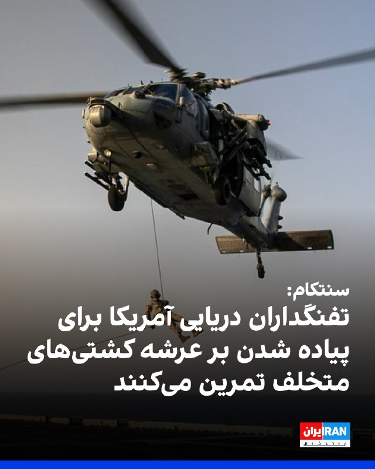
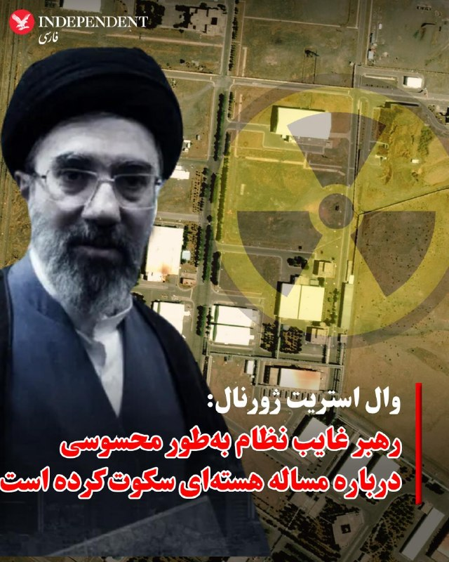
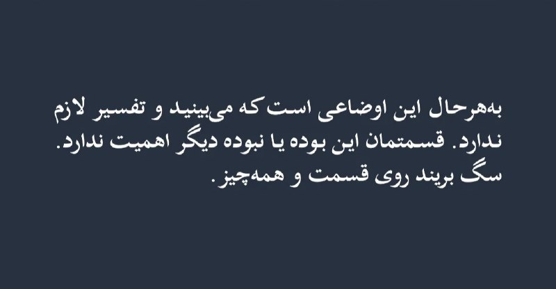

# خواننده تلگرام

<!-- TOP_NAV START -->

<a href="https://github.com/AliKhaste81/aio-downloader/blob/main/telegram/content/archive_1.md" style="display:inline-block; padding:6px 12px; margin:0 4px; background-color:#2ea44f; color:white; text-decoration:none; border-radius:4px; font-weight:bold;">صفحه بعد</a>

<!-- TOP_NAV END -->

<!-- MSG START -->

---
📅 بروزرسانی: 1405/02/21 03:00
---

## VahidOOnLine — post 239413

  

♦️به گزارش «عرب‌نیوز»، شرکت «آرامکو»، غول نفتی عربستان سعودی، روز یکشنبه از جهش ۲۵ درصدی سود خود در سه ماهه نخست سال جاری خبر داد. این موفقیت مالی در حالی به دست آمده که تنش‌ها در تنگه هرمز، صادرات انرژی را با بحران جدی روبه‌رو کرده است، اما آرامکو با بهره‌گیری حداکثری از ظرفیت «خط لوله شرق به غرب» خود، موفق شد نفت را بدون عبور از این آبراهِ مسدود شده، به دریای سرخ و بازارهای جهانی برساند. امین ناصر، مدیرعامل آرامکو، با اعلام سود ۳۲.۵ میلیارد دلاری برای این دوره، تاکید کرد که خط لوله استراتژیک این کشور اکنون با حداکثر ظرفیت یعنی روزانه ۷ میلیون بشکه فعالیت می‌کند تا بخشی از شوک جهانی انرژی ناشی از جنگ با ایران را جبران کند.
‌🇸🇦 Indypersian

🤖 @VahidOOnLine

## VahidOOnLine — post 239412

  <a href="telegram/content/VahidOOnLine_239412_1778455811.mp4" target="_blank">🎬 Download video</a>

ویدیوهای منتشرشده در شبکه‌های اجتماعی، به همراه تصاویر دریافتی، نشان می‌دهد یکی از حامیان جمهوری اسلامی روز یک‌شنبه ۲۰ اردیبهشت وارد تجمع ضدحکومتی ایرانیان در تورنتو شده و سپس پرچم جمهوری اسلامی را برافراشته و تکان می‌دهد.
بر اساس گزارش‌های منتشرشده، در پی این حمله، دست‌کم یک نفر زخمی شده و به چندین خودرو آسیب وارد شده است.

عکس از پیمان خواجه‌حسنی، خبرنگار
‌🏁 🇬🇧 IranintlTV

🤖 @VahidOOnLine

## VahidOOnLine — post 239411

  

فرماندهی مرکزی ایالات متحده، ‌سنتکام، نوشت که تمرین‌‌های تفنگداران دریایی آمریکا تضمین می‌کند که آن‌ها در صورت فرا خوانده شدن برای پیاده شدن بر عرشه کشتی‌‌های متخلف در طول محاصره ایران توسط ایالات متحده آماده باشند.

سنتکام در این ارتباط، تصاویری از تمرین‌های تفنگداران دریایی بر روی عرشه ناو تریپولی را در شبکه اجتماعی ایکس منتشر کرد.
‌🏁 🇬🇧 IranintlTV

🤖 @VahidOOnLine

## VahidOOnLine — post 239410

  

♦️وال استریت ژورنال در گزارشی درباره غیبت طولانی مجتبی خامنه‌ای که سومین رهبر نظام معرفی شده، به سکوت او درباره مساله هسته‌ای اشاره کرد و نوشت در حالی که بحث مذاکره و توافق با آمریکا مطرح است، در بیانیه‌های منتسب به رهبر جدید نظام هیچ اشاره ای به موضوع هسته‌ای نشده است. علی خامنه‌ای، پدر کشته شده او نیز اغلب در موضوعات مهم از جمله مساله هسته‌ای موضعی مبهم اتخاذ می‌کرد. رویکردی که برخی آن را به تلاش رهبر سابق جمهوری اسلامی برای نپذیرفتن مسئولیت تصمیم‌گیری‌های مهم ارتباط می‌دادند. وال استریت ژورنال بااشاره به جراحت‌های شدید مجتبی خامنه‌ای در حمله دو ماه پیش که پدر، پسر و همسرش را کشت، می‌نویسد: از آن زمان تاکنون، تنها چیزی که از او شنیده شده، پیام‌هایی منتسب به مجتبی خامنه‌ای و تصاویری است که با هوش مصنوعی تولید یا دستکاری شده‌اند. این روزنامه آمریکایی در ادامه، نبود مجتبی خامنه‌ای را مشکلی برای نظام و طرفدارانش توصیف می‌کند و به نقش روح‌الله خامنه‌ای در نوشیدن جام زهر در اواخر دهه ۶۰ و نقش علی خامنه‌ای در نرمش قهرمانانه منتهی به برجام اشاره می‌کند. وال استریت ژورنال می‌نویسد: مقام‌های جمهوری اسلامی حتی یک فایل صوتی تازه از رهبر جدید نظام منتشر نکرده‌اند؛ کاری که رهبر پیشین نظام گاهی هنگام تهدیدهای امنیتی انجام می‌داد. بسیاری اکنون می‌پرسند آیا او اصلا زنده است یا نه. این در حالی است که محتوای پیام‌های منتسب به او نیز آن‌قدر کلی بوده که حتی حامیانش، تردید دارند خامنه‌ای نقشی در نگارش آن‌ها داشته باشد. مقامات جمهوری اسلامی در روزهای اخیر تلاش کرده‌اند ادعا‌هایی را درباره دیدار با او مطرح کنند یا اطلاعاتی درباره میزان جراحتش ارایه دهند اما به نوشته وال استریت ژورنال، این اقدامات نیز نتوانسته تردید‌ها را درباره وضعیت مجتبی خامنه‌ای از بین ببرد.
‌🇸🇦 Indypersian

🤖 @VahidOOnLine

## VahidOOnLine — post 239409

  

♦️درحالی که دونالد ترامپ، پاسخ تهران به پیشنهاد آمریکا را که پس از ۱۰ روز ارسال شده، «کاملا غیرقابل قبول» توصیف کرده است، وال استریت ژورنال جزئیاتی از این پاسخ را به نقل از منابع آگاه، روایت کرده است. این روزنامه آمریکایی می نویسد، تهران به‌طور رسمی پاسخی چندصفحه‌ای به آخرین پیشنهاد آمریکا برای پایان دادن به جنگ ارسال کرده و در آن خواسته‌های خود را با جزئیات مطرح کرده است؛ پاسخی که به گفته افراد مطلع، همچنان شکاف‌هایی میان دو طرف باقی می‌گذارد.
به گفته این منابع، پاسخ جدید مسئله اصلی مورد مطالبه آمریکا یعنی دریافت تعهدات قبلی درباره سرنوشت برنامه هسته‌ای ایران و ذخایر اورانیوم با غنای بالای آن را حل نمی‌کند. در عوض، تهران پیشنهاد داده است که همزمان با لغو محاصره کشتی‌ها و بنادر ایران از سوی آمریکا، جنگ متوقف شود و تنگه هرمز به‌تدریج به روی رفت‌وآمد تجاری باز شود.
این منابع گفتند مسائل هسته‌ای طی ۳۰ روز آینده مذاکره خواهد شد. به گفته آن‌ها، ایران پیشنهاد داده بخشی از اورانیوم با غنای بالای خود را رقیق کند و بقیه به کشور ثالث منتقل شود.
به گفته این افراد، پاسخ تهران که به میانجی‌‌های پاکستان تحویل داده و سپس به واشینگتن منتقل شده، شامل درخواست تضمین‌هایی است که در صورت شکست مذاکرات یا خروج بعدی آمریکا از توافق، اورانیوم منتقل‌شده دوباره به ایران بازگردانده شود.
آن‌ها افزودند ایران همچنین اعلام کرده حاضر است غنی‌سازی اورانیوم را تعلیق کند، اما برای دوره‌ای کوتاه‌تر از توقف ۲۰ ساله‌ای که آمریکا پیشنهاد داده است. به گفته این منابع، رژیم ایران با برچیدن تاسیسات هسته‌ای خود مخالفت کرده است.
تسنیم، وابسته به سپاه پاسداران، به نقل از یک «منبع آگاه» گزارش داد که روایت روزنامه وال‌استریت ژورنال درباره پیشنهادهای ایران در زمینه مواد هسته‌ای «صحت ندارد.»
گزارش تسنیم می‌گوید رژیم ایران خواستار لغو تحریم‌های دفتر کنترل دارایی‌های خارجی آمریکا علیه فروش نفت ایران در دوره پیشنهادی ۳۰ روزه شده است. جمهوری اسلامی همچنین خواهان آزادسازی دارایی‌های مسدودشده خود در خارج از کشور است.
‌🇸🇦 Indypersian

🤖 @VahidOOnLine

## VahidOOnLine — post 239408

  <a href="telegram/content/VahidOOnLine_239408_1778455816.mp4" target="_blank">🎬 Download video</a>

گردهمایی ایرانیان سانفرانسیسکو
‌🏁 🇬🇧 ManotoTV

🤖 @VahidOOnLine

## VahidOOnLine — post 239407

  <a href="telegram/content/VahidOOnLine_239407_1778455818.mp4" target="_blank">🎬 Download video</a>

گردهمایی ایرانیان هامبورگ
‌🏁 🇬🇧 ManotoTV

🤖 @VahidOOnLine

## VahidOOnLine — post 239406

  <a href="telegram/content/VahidOOnLine_239406_1778455820.mp4" target="_blank">🎬 Download video</a>

نیکوزیا|قبرس؛ راهپیمایی و گردهمایی ایرانیان
‌🏁 🇬🇧 ManotoTV

🤖 @VahidOOnLine

## VahidOOnLine — post 239405

  

جیسون برادسکی، مدیر سیاست‌گذاری اتحاد علیه ایران هسته‌ای، در مورد تماس تلفنی دونالد ترامپ و بنیامین نتانیاهو در مورد پاسخ جمهوری اسلامی نوشت: «تغییر وضع موجود ضروری است. محاصره لازم است، اما کافی نیست.»

او در شبکه اجتماعی ایکس تاکید کرد ترکیب محاصره با اقدام نظامی مهم خواهد بود.

برادسکی همچنین اشاره کرد: «برخلاف تصوری که رسانه‌ها و برخی مفسران ایجاد کرده‌اند، رییس‌جمهور همچنان نشان می‌دهد که به هیچ توافقی با رژیم ایران، صرف نظر از شرایط، مشتاق نیست. اگر او واقعا برای هر توافقی مشتاق بود، مدت‌ها پیش توافقی حاصل شده بود.»
‌🏁 🇬🇧 IranintlTV

🤖 @VahidOOnLine

## pm_afshaa — post 90519

کانفینگ با سرعت موشک شارژ کردم هر کی خواست بیاد دایرکت چنل هم پرداخت ریالی داریم هم ارزی 5 گیگ 1800 10 گیگ 3200

## pm_afshaa — post 90518

کانفینگ با سرعت موشک شارژ کردم

هر کی خواست بیاد دایرکت چنل

هم پرداخت ریالی داریم هم ارزی

5 گیگ 1800
10 گیگ 3200

## pm_afshaa — post 90516

امستردام هلند

💧 Rainbet.com the #1 Non-KYC Crypto Casino & Sportsbook @rainbetcom

😁 @Pm_Afshaa

## pm_afshaa — post 90511

دونالد ترامپ پست جدیدی در تروث خود از صحبت های مارک لوین با محتوای ضرورت آموزش نظامی مردم ایران ( گارد جاویدان ) را منتشر کرد.

💧 Rainbet.com the #1 Non-KYC Crypto Casino & Sportsbook @rainbetcom

😁 @Pm_Afshaa

## pm_afshaa — post 90510

🔴مارک فاکس، معاون سابق فرماندهی مرکزی آمریکا : آتش‌بس با ایران به اسرائیل اجازه داد تا ذخایر مهمات خودشو دوباره پر کنه و اطلاعات بیشتری جمع‌آوری کنه

💧 Rainbet.com the #1 Non-KYC Crypto Casino & Sportsbook @rainbetcom

😁 @Pm_Afshaa

## IranIntlTV — post 336550

  <a href="telegram/content/IranIntlTV_336550_1778455822.mp4" target="_blank">🎬 Download video</a>

ویدیوهای منتشرشده در شبکه‌های اجتماعی، به همراه تصاویر دریافتی، نشان می‌دهد یکی از حامیان جمهوری اسلامی روز یک‌شنبه ۲۰ اردیبهشت وارد تجمع ضدحکومتی ایرانیان در تورنتو شده و سپس پرچم جمهوری اسلامی را برافراشته و تکان می‌دهد.
بر اساس گزارش‌های منتشرشده، در پی این حمله، دست‌کم یک نفر زخمی شده و به چندین خودرو آسیب وارد شده است.

عکس از پیمان خواجه‌حسنی، خبرنگار

## IranIntlTV — post 336549

  

فرماندهی مرکزی ایالات متحده، ‌سنتکام، نوشت که تمرین‌‌های تفنگداران دریایی آمریکا تضمین می‌کند که آن‌ها در صورت فرا خوانده شدن برای پیاده شدن بر عرشه کشتی‌‌های متخلف در طول محاصره ایران توسط ایالات متحده آماده باشند.

سنتکام در این ارتباط، تصاویری از تمرین‌های تفنگداران دریایی بر روی عرشه ناو تریپولی را در شبکه اجتماعی ایکس منتشر کرد.
https://iranintl.com/202605106827

## IranIntlTV — post 336548

  <a href="telegram/content/IranIntlTV_336548_1778455825.mp4" target="_blank">🎬 Download video</a>

یکی از شرکت‌کنندگان در تجمع «یک ملت گروگان» در واشینگتن به اردوان روزبه، خبرنگار ایران‌اینترنشنال، گفت: «افتخار می‌کنیم که در حمایت از مردم ایران و به نمایندگی از آن‌ها در این مراسم شرکت کنیم.»

او افزود: «امروز همچنین روز مادر در آمریکاست و می‌خواهیم به مادران ایران، به‌ویژه مادرانی که فرزندانشان را از دست داده‌اند، ادای احترام کنیم. حداقل کاری که می‌توانستیم انجام دهیم، حضور در این مراسم بود.»
@iranintltv

## IranIntlTV — post 336547

  

جیسون برادسکی، مدیر سیاست‌گذاری اتحاد علیه ایران هسته‌ای، در مورد تماس تلفنی دونالد ترامپ و بنیامین نتانیاهو در مورد پاسخ جمهوری اسلامی نوشت: «تغییر وضع موجود ضروری است. محاصره لازم است، اما کافی نیست.»

او در شبکه اجتماعی ایکس تاکید کرد ترکیب محاصره با اقدام نظامی مهم خواهد بود.

برادسکی همچنین اشاره کرد: «برخلاف تصوری که رسانه‌ها و برخی مفسران ایجاد کرده‌اند، رییس‌جمهور همچنان نشان می‌دهد که به هیچ توافقی با رژیم ایران، صرف نظر از شرایط، مشتاق نیست. اگر او واقعا برای هر توافقی مشتاق بود، مدت‌ها پیش توافقی حاصل شده بود.»
https://iranintl.com/202605105974

## IranIntlTV — post 336546

  <a href="telegram/content/IranIntlTV_336546_1778455827.mp4" target="_blank">🎬 Download video</a>

مراد ویسی، تحلیل‌گر ارشد ایران‌اینترنشنال، گفت: «سفر ترامپ به پکن می‌تواند پیام هشدار جدی‌تری برای تهران داشته باشد. به‌ویژه با توجه به تهدید دوباره ترامپ به بمباران شدیدتر در صورت عدم توافق. اعلام مذاکره ترامپ و شی جین‌ پینگ درباره جمهوری اسلامی، احتمال شکل‌گیری معامله و بده‌بستان میان واشینگتن و پکن بر سر پرونده ایران را پررنگ‌تر کرده است.»
@iranintltv

## IranIntlTV — post 336545

  <a href="telegram/content/IranIntlTV_336545_1778455829.mp4" target="_blank">🎬 Download video</a>

دونالد ترامپ پاسخ جمهوری اسلامی به پیشنهاد آمریکا را غیرقابل قبول دانست.

او پیش‌تر گفته بود جمهوری اسلامی ۴۷ سال با آمریکا و جهان بازی کرده و با تاخیر، زمان خریده است، اما این اتفاق دیگر نخواهد افتاد.

گفت‌وگو با شایان سمیعی، کارشناس امنیت ملی
@iranintltv

## Shin_Persian — post 5950

Shin ✓ @hey_itsmyturn
Sun, 10 May 2026 22:45:03 UTC

NOW @ 2244Z -
AA activity over northwestern Tehran, Tehran Province, #Iran

فارسی

هم‌اکنون در ۲۲۴۴ زولو (۰۲:۱۴ به وقت تهران) -
فعالیت پدافند هوایی در شمال غرب تهران، استان تهران، #Iran

𝕏 · @shin_persian

## Shin_Persian — post 5949

  <a href="telegram/content/Shin_Persian_5949_1778455831.mp4" target="_blank">🎬 Download video</a>

Shin ✓ @hey_itsmyturn
Sun, 10 May 2026 22:36:12 UTC

Earlier @ 1800Z -
AA activity,
ring road near Ziba Shahr in Dezful.
Khuzestan Province, #Iran
(Via @mamlekate)

فارسی

پیش‌تر در ساعت ۱۸۰۰ زولو (۲۱:۳۰ به وقت تهران) -
فعالیت پدافند هوایی،
کمربندی نزدیک زیباشهر در دزفول.
استان خوزستان، #Iran
(از طریق @mamlekate)

𝕏 · @shin_persian

## ManotoTV — post 105286

  <a href="telegram/content/ManotoTV_105286_1778455833.mp4" target="_blank">🎬 Download video</a>

گردهمایی ایرانیان سانفرانسیسکو

## ManotoTV — post 105285

  <a href="telegram/content/ManotoTV_105285_1778455834.mp4" target="_blank">🎬 Download video</a>

گردهمایی ایرانیان هامبورگ

## ManotoTV — post 105284

  <a href="telegram/content/ManotoTV_105284_1778455836.mp4" target="_blank">🎬 Download video</a>

نیکوزیا|قبرس؛ راهپیمایی و گردهمایی ایرانیان

## FarsiVOA — post 217387

⚡️افشای عملیات اسرائیل در خاک عراق و فشار واشنگتن برای پایان‌ نفوذ جمهوری اسلامی در دولت جدید
@FarsiVOA

## FarsiVOA — post 217386

⚡️چرا جمهوری اسلامی به‌رغم برقراری آتش‌بس به حملات خود به کشورهای منطقه ادامه می‌دهد
@FarsiVOA

## FarsiVOA — post 217385

⚡️در جلسه مجلس شورای اسلامی برای گرانی چه گذشت؟
@FarsiVOA

## IranianMinds — post 19923

  

🔴 ترامپ به آکسیوس گفت که پاسخ ایران به آخرین پیش‌نویس توافق برای پایان دادن به جنگ را رد خواهد کرد؛ پاسخی که پس از ۱۰ روز انتظار آمریکا برای دریافت جواب تهران ارسال شده بود.

او گفت: «نامه‌شان را دوست ندارم. نامناسب است. از پاسخشان خوشم نیامد.»
ترامپ همچنین افزود که ایران «۴۷ سال است بسیاری از کشورها را بازی داده است.»

او تایید کرد که روز یکشنبه با نتانیاهو گفت‌وگو کرده؛ تماسی که آن را «بسیار خوب» توصیف کرد، اما تأکید داشت که مذاکرات با ایران «مسئله من است، نه مسئله دیگران.

@IranianMinds

## IranianMinds — post 19922

فقط کافیه مرغ از خیابون رد کنی و‌پولت چند برابر کنی
💵👌

## IranianMinds — post 19921

  <a href="telegram/content/IranianMinds_19921_1778455839.mp4" target="_blank">🎬 Download video</a>

بچه ها اسم این بازی عبور مرغ از خیابون  هست ویدئو نگاه کنید خیلی راحت 8 میلیون ازش سود گرفتیم😍

😤اگ توم دوس داری خیلی راحت از بازی های انلاین پول در بیاری حتما عضو کازینو شبانه شو
✅

توی کازینو شبانه بهت اموزش میدیم از بازی های انلاین پول دربیاری👌

کازینو شبانه راهی برای چند برابر کردن سرمایت 🤷‍♂

کسب درامد انلاین با یه ادم حرفه ای یاد بگیر و‌ پول دربیار 
💵
ae20
🎯همین حالا عضو شو و شروع کن👇
https://t.me/+OS-QBvyDO4M2ZGY0
https://t.me/+OS-QBvyDO4M2ZGY0

## BBCPersian — post 280699

  

🔻تیم فوتبال بارسلونا با شکست دو بر صفر رئال مادرید، با وجود سه مسابقه باقی‌مانده، قهرمان شد و برای ۲۹مین بار جام قهرمانی باشگاه‌های اسپانیا - لالیگا - را تصاحب کرد.

دو تیم عصر یکشنبه در مهمترین الکلاسیکو سال و در قالب هفته سی و پنجم لالیگا روبروی هم قرار گرفتند که شاگردان فلیک در همان دقایق ابتدایی - دقیقه ۹ - با کاشته زیبا رشفورد جلو افتادند.

تورس تنها ۹ دقیقه بعد - در دقیقه ۱۸ - گل دوم بارسلونا را زد تا هانسی فلیک در همان نیمه اول برق قهرمانی در چشمانش ثبت شود.

این قهرمانی برای بارسلونا ارزش مضاعفی داشت چرا که آنها با شکست مستقیم رقیب سنتی خود جام را کسب کردند.

📸 Getty

@BBCPersian

## Dirty_Kids — post 389251

  <a href="https://t.me/Dirty_Kids/389251" target="_blank">📎 Download file</a>

✅ اپلیکیشن اندروید سایت جهانی دربی بت

💰اولین سایت جهانی با امکان شارژ و برداشت ریالی(کارت به کارت)

🔗 برای ورود فیلترشکن روی کشور مناسب قرار دهید مانند فنلاند و المان و....

😀Telegram Channel
👇
https://t.me/+bcynkEgSW2dlYTc0

## Dirty_Kids — post 389250

  

😤دنبال یه سایت شرط بندی بین المللی بودی که به ایرانیا خدمات بده؟!
⛔

👍دربی بت همون انتخاب  100%

💎ویژگی های سایت جهانی Derby Bet:

⬅️امکان شارژ امن با کارت بانکی

⬅️واریز اول دوبل شارژ می شوید(بونوس۱۰۰٪)

⬅️پر اپشن ترین سایت فعال در ایران

⬅️تسویه حساب کمتر از 5 دقیقه

⬅️برگشت بخشی از باخت به صورت هفتگی

🚨کد هدیه ثبت نام:GG007

⚠️برای دانلود اپلکیشن کلیک کنید
👉

🔔کانال دربی بت :

🪙https://t.me/+bcynkEgSW2dlYTc0

## Dirty_Kids — post 389249

  

#بخوابیم

@Dirty_Kids 👻

## Dirty_Kids — post 389248

  

محصول مشترک الجزایر، فرانسه، ادیداس کرج و کردستان: @Dirty_Kids 👻

## Dirty_Kids — post 389247

  

بلایی که یه پریود ساده ممکنه سرت بیاره.

این خانوم لارن وسر مدل آمریکاییه که بخاطر استفاده از تامپون تو سن ۲۴ سالگی دچار TSS یا سندروم شوک مسمومیت میشه و هر دو پاش رو از دست میده.

@Dirty_Kids 👻

## Dirty_Kids — post 389246

  

نه داداش تو نمیدونی جمهوری اسلامی خیلی خوب داره دووم میاره جلو آمریکا و اسرائیل :

@Dirty_Kids 👻

## Dirty_Kids — post 389245

  

دیگه نمیشه یبار مصرف کرد
باید بعد استفاده بشوریمش رو بند آویزون کنیم

@Dirty_Kids 👻

## manototv — post 105286

  <a href="telegram/content/manototv_105286_1778455844.mp4" target="_blank">🎬 Download video</a>

گردهمایی ایرانیان سانفرانسیسکو

## manototv — post 105285

  <a href="telegram/content/manototv_105285_1778455846.mp4" target="_blank">🎬 Download video</a>

گردهمایی ایرانیان هامبورگ

## manototv — post 105284

  <a href="telegram/content/manototv_105284_1778455848.mp4" target="_blank">🎬 Download video</a>

نیکوزیا|قبرس؛ راهپیمایی و گردهمایی ایرانیان

<!-- MSG END -->

<!-- NAV START -->

<a href="https://github.com/AliKhaste81/aio-downloader/blob/main/telegram/content/archive_1.md" style="display:inline-block; padding:6px 12px; margin:0 4px; background-color:#2ea44f; color:white; text-decoration:none; border-radius:4px; font-weight:bold;">صفحه بعد</a>

<!-- NAV END -->
