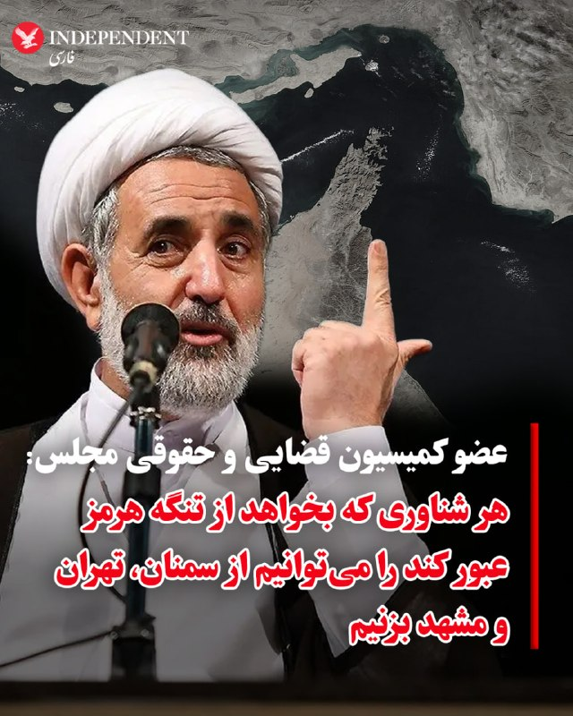
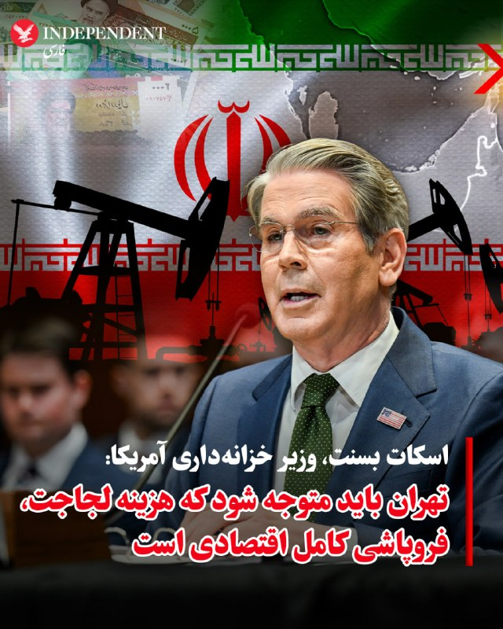
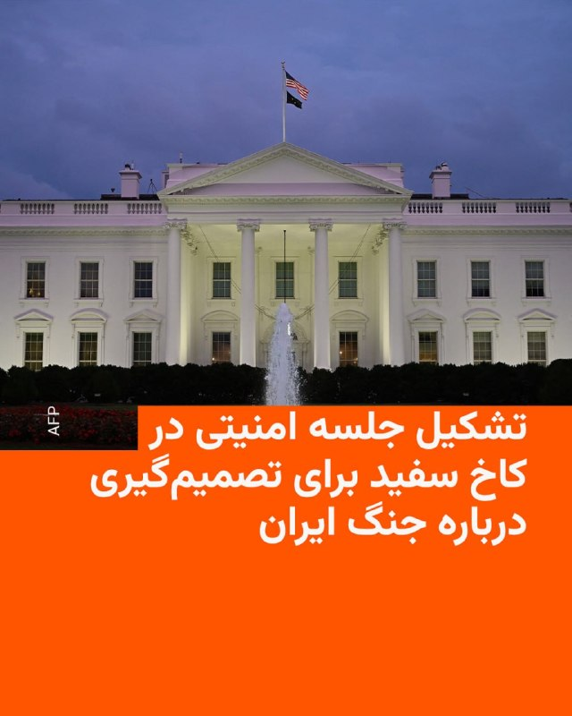

# خواننده تلگرام

<!-- TOP_NAV START -->

<a href="https://github.com/AliKhaste81/aio-downloader/blob/main/telegram/content/archive_1.md" style="display:inline-block; padding:6px 12px; margin:0 4px; background-color:#2ea44f; color:white; text-decoration:none; border-radius:4px; font-weight:bold;">صفحه بعد</a>

<!-- TOP_NAV END -->

<!-- MSG START -->

---
📅 بروزرسانی: 1405/02/22 00:26
---

## VahidOOnLine — post 239585

  

مجتبی ذوالنوری، عضو کمیسیون حقوقی مجلس، گفت: «لازم نیست در تنگه هرمز باشیم تا هر شناوری را که از آنجا رد می‌شود، بزنیم. از سمنان و مشهد و تهران می‌زنیم. چند شناور که آنجا غرق شود، خود تنگه بسته می‌شود. روی بحث مین‌ریزی کار کردیم و نجابت به خرج دادیم از این حق استفاده نکردیم.»
‌🏁 🇬🇧 IranintlTV

🤖 @VahidOOnLine

## VahidOOnLine — post 239584

  

وال استریت ژورنال به نقل از منابع مطلع گزارش داد که امارات متحده عربی حملات نظامی علیه جمهوری اسلامی انجام داده است؛ اقدامی که این کشور را در جایگاه یکی از طرف‌های فعال در جنگ قرار می‌دهد.

در این گزارش آمده است نیروهای نظامی این کشور به جنگنده‌های ساخت غرب و شبکه‌های نظارتی پیشرفته مجهز هستند و این حملات نشان می‌دهد امارات متحده عربی اکنون تمایل بیشتری دارد از این توانمندی‌ها برای حفاظت از قدرت اقتصادی و نفوذ رو‌به‌گسترش خود در سراسر خاورمیانه استفاده کند.

وال استریت ژورنال افزود که این حملات شامل حمله به یک پالایشگاه در جزیره لاوان ایران در خلیج فارس بوده که در اواسط فروردین انجام شده است؛ امارات به‌طور علنی انجام این حملات را تایید نکرده است.
در بخش دیگری از این گزارش آمده است که امارات متحده عربی اکنون تهران را تهدیدی مستقیم علیه ثبات و مدل اقتصادی خود می‌داند. همچنین براساس گمانه‌زنی‌ها، گفته می‌شود امارات متحده عربی با استفاده از جنگنده‌های میراژ فرانسوی و پهپادهای چینی متعلق به خود، در داخل ایران عملیات انجام داده است.
‌🏁 🇬🇧 IranintlTV

🤖 @VahidOOnLine

## VahidOOnLine — post 239583

  

♦️همزمان با افزایش تنش‌ها میان تهران و واشنگتن، مجتبی ذوالنور، عضو کمیسیون قضایی و حقوقی مجلس، در گفتگو با شبکه خبر با اشاره به ویژگی‌های جغرافیایی تنگه هرمز گفت عرض این تنگه در باریک‌ترین نقطه حدود ۴۵ کیلومتر است، اما همه این محدوده قابل کشتیرانی نیست. به گفته او، بخش‌هایی از مسیر به‌دلیل عمق کم و بستر صخره‌ای، به‌ویژه در نزدیکی سواحل عمان و جزیره سلامه، محدودیت عبور دارند و عملا مسیرهای کشتیرانی به نواحی مشخصی محدود می‌شود.
ذوالنور همچنین با اشاره به موقعیت راهبردی ایران در این منطقه افزود آب‌های سرزمینی ایران، که حدود ۱۲ مایل دریایی (نزدیک به ۲۲ کیلومتر) را شامل می‌شود، بخش مهمی از مسیر عبور کشتی‌ها را پوشش می‌دهد. او مدعی شد ایران توان هدف قرار دادن شناورها را حتی از فواصل دور دارد و تأکید کرد هر شناوری که بخواهد از تنگه هرمز عبور کند را می‌توانیم از سمنان، تهران و مشهد بزنیم.
او همچنین به موضوع توانمندی‌های مین‌ریزی در خلیج فارس اشاره کرد و گفت ایران تاکنون از این ظرفیت استفاده نکرده است.
‌🇸🇦 Indypersian

🤖 @VahidOOnLine

## VahidOOnLine — post 239582

  

♦️وزارت خزانه‌داری ایالات متحده، روز دوشنبه، ۲۱ اردیبهشت‌ماه، در بیانیه‌ای رسمی اعلام کرد که پاسخ اخیر تهران به پیشنهاد دیپلماتیک واشنگتن، نه‌تنها از نظر سیاسی غیرقابل‌قبول است، بلکه با استانداردهای لازم برای لغو تحریم‌های مالی و اقتصادی نیز همخوانی ندارد. این وزارتخانه تاکید کرد که رویکرد فعلی ایران مانع از هرگونه گشایش در مسیر مبادلات بین‌المللی و آزادسازی دارایی‌های بلوکه شده می‌شود و تا زمانی که تعهدات شفافی در حوزه برنامه هسته‌ای ارائه نشود، فشارها بر شبکه مالی این کشور ادامه خواهد یافت.
در همین راستا، اسکات بسنت، وزیر خزانه‌داری دولت دونالد ترامپ، در اکس با بازنشر این بیانیه، موضعی قاطعانه اتخاذ کرد. او با اشاره به اینکه پاسخ تهران نشان‌دهنده عدم تمایل این کشور به همکاری واقعی است، نوشت: «در حالی که دولت ترامپ با حسن نیت مسیری برای دیپلماسی باز کرد، تهران با پاسخی کاملا غیرقابل‌قبول به میز مذاکره بازگشته است.» بسنت تاکید کرد که وزارت خزانه‌داری، سیاست‌های مالی را به گونه‌ای تنظیم خواهد کرد که جمهوری اسلامی متوجه شود عدم پذیرش توافق، هزینه‌های اقتصادی سنگین و غیرقابل‌جبرانی برای نظام پولی و بانکی این کشور به همراه خواهد داشت. او نوشت: «زمان آن رسیده که تهران متوجه شود هزینه لجاجت، فروپاشی کامل اقتصادی است».
‌🇸🇦 Indypersian

🤖 @VahidOOnLine

## VahidOOnLine — post 239581

  <a href="telegram/content/VahidOOnLine_239581_1778533012.mp4" target="_blank">🎬 Download video</a>

وزارت خزانه‌داری آمریکا اعلام کرد ۱۲ فرد و نهاد را به‌دلیل نقش در فروش و انتقال نفت جمهوری اسلامی توسط سپاه پاسداران به چین تحریم کرده است.

در بیانیه دفتر کنترل دارایی‌های خارجی وزارت خزانه‌داری آمریکا آمده سپاه پاسداران برای پنهان کردن نقش خود در فروش نفت و انتقال درآمدها به جمهوری اسلامی، از شرکت‌های پوششی در کشورهای مختلف استفاده می‌کند.

اسکات بسنت، وزیر خزانه‌داری آمریکا، گفت: «در حالی که ارتش ایران تلاش می‌کند خود را بازسازی کند، عملیات “خشم اقتصادی” به محروم کردن جمهوری اسلامی از منابع مالی برنامه‌های تسلیحاتی، نیروهای نیابتی و جاه‌طلبی‌های هسته‌ای ادامه خواهد داد.»

وزارت خزانه‌داری آمریکا همچنین اعلام کرد جمهوری اسلامی به‌جای استفاده از درآمدهای نفتی برای حمایت از مردم ایران، این منابع را صرف توسعه تسلیحات، حمایت از گروه‌های نیابتی و تأمین مالی نیروهای امنیتی می‌کند.

در میان افراد تحریم‌شده، نام احمد محمدی‌زاده، رئیس قرارگاه نفتی شهید پورجعفری سپاه، صمد فتحی سلامی، مسئول مالی این قرارگاه، و محمدرضا اشرفی گهی، مسئول بازرگانی آن، دیده می‌شود.

همچنین چند شرکت مستقر در هنگ‌کنگ، دبی، عمان و شارجه به اتهام همکاری در انتقال نفت ایران و دور زدن تحریم‌ها هدف تحریم قرار گرفته‌اند.

وزارت خزانه‌داری آمریکا هشدار داد هر شرکت یا مؤسسه مالی خارجی که با شبکه‌های مرتبط با سپاه پاسداران همکاری کند، ممکن است هدف تحریم‌های ثانویه آمریکا قرار گیرد.
‌🏁 🇬🇧 ManotoTV

🤖 @VahidOOnLine

## VahidOOnLine — post 239580

  

سی‌بی‌اس نیوز به نقل از مقام‌های آمریکایی گزارش داد که پاکستان به‌طور غیررسمی اجازه داده است برخی هواپیماهای نظامی ایران در فرودگاه‌های این کشور مستقر شوند؛ اقدامی که احتمالا آن‌ها را از حملات هوایی آمریکا مصون می‌سازد.
براساس این گزارش، ایران همچنین برخی هواپیماهای غیرنظامی خود را به افغانستان منتقل کرده است، هرچند مشخص نیست که آیا در میان آن‌ها هواپیماهای نظامی نیز وجود دارد یا خیر.
‌🏁 🇬🇧 IranintlTV

🤖 @VahidOOnLine

## VahidOOnLine — post 239579

  <a href="telegram/content/VahidOOnLine_239579_1778533015.mp4" target="_blank">🎬 Download video</a>

دونالد ترامپ در کاخ سفید با تیم امنیتی و فرماندهان نظامی آمریکا درباره ادامه مسیر جنگ با جمهوری اسلامی جلسه برگزار می‌کند. او گفته در داخل حکومت ایران اختلاف وجود دارد؛ «میانه‌روها» دنبال توافق‌اند اما «دیوانه‌ها» می‌خواهند جنگ ادامه پیدا کند.
‌🏁 🇬🇧 IranintlTV

🤖 @VahidOOnLine

## VahidOOnLine — post 239577

  

ایالات متحده تحریم‌های جدیدی مرتبط با جمهوری اسلامی علیه سه فرد و ۹ نهاد، از جمله چهار نهاد مستقر در هنگ‌کنگ، ۴ نهاد در امارات متحده عربی و یک نهاد در عمان وضع کرد.

طبق این گزارش، محمدرضا اشرفی، صمد فتحی سلامی و احمد محمدی‌زاده به دلیل ارتباط با سپاه پاسداران تحریم شده‌اند.
‌🏁 🇬🇧 IranintlTV

🤖 @VahidOOnLine

## mwarmonitor — post 8932

🇦🇪امارات متحده عربی به‌طور مخفیانه حملات نظامی علیه ایران انجام داده است، به گفته منابع - وال‌استریت ژورنال

🔸این حملات شامل حمله به یک پالایشگاه در جزیره لاوان ایران بوده است.

@mwarmonitor

## mwarmonitor — post 8931

🔴رئیس‌جمهور ترامپ تمایل دارد دستور ازسرگیری درگیری با ایران را صادر کند — کانال ۱۲ اسرائیل

@mwarmonitor

## mwarmonitor — post 8930

💠امروز، دفتر کنترل دارایی‌های خارجی وزارت خزانه‌داری آمریکا (OFAC)، ۱۲ فرد و نهاد را به دلیل نقش آن‌ها در تسهیل فروش و انتقال نفت ایران توسط سپاه پاسداران انقلاب اسلامی (IRGC) به جمهوری خلق چین تحریم کرد.

💠سپاه پاسداران برای پنهان‌سازی نقش خود در فروش نفت و انتقال درآمدها به حکومت ایران، به شرکت‌های پوششی در حوزه‌های اقتصادی سهل‌گیر متکی است. به‌جای آنکه این درآمدها صرف حمایت از مردم در مضیقه ایران شود، حکومت ایران آن را به سمت توسعه تسلیحات، حمایت از نیروهای نیابتی تروریستی، و تأمین مالی نیروهای امنیتی که آزادی‌های شهروندان را سرکوب می‌کنند هدایت می‌کند.

🔸اسکات بسنت وزیر خزانه‌داری آمریکا ؛

🔘در حالی که نیروهای نظامی ایران به‌شدت در تلاش برای بازسازی خود هستند، کارزار «خشم اقتصادی» همچنان به محروم کردن رژیم از منابع مالی مورد نیاز برای برنامه‌های تسلیحاتی، نیروهای نیابتی تروریستی و جاه‌طلبی‌های هسته‌ای ادامه خواهد داد.

🔘وزارت خزانه‌داری به تلاش خود برای قطع دسترسی رژیم ایران به شبکه‌های مالی که از آن‌ها برای انجام اقدامات تروریستی و بی‌ثبات کردن اقتصاد جهانی استفاده می‌کند، ادامه خواهد داد.

@mwarmonitor

## mwarmonitor — post 8929

⚠️افشاگری به نقل از CBSNews: 🔴منابعی به Jennifer Jacobs و JimLaPorta گفتند که در حالی که پاکستان خود را به‌عنوان کانال دیپلماتیک میان تهران و واشینگتن مطرح می‌کرد، به‌طور پنهانی به هواپیماهای نظامی ایران اجازه داد در خاک این کشور مستقر شوند؛ اقدامی که می‌توانست…

## mwarmonitor — post 8928

⚠️افشاگری به نقل از CBSNews:

🔴منابعی به Jennifer Jacobs و JimLaPorta گفتند که در حالی که پاکستان خود را به‌عنوان کانال دیپلماتیک میان تهران و واشینگتن مطرح می‌کرد، به‌طور پنهانی به هواپیماهای نظامی ایران اجازه داد در خاک این کشور مستقر شوند؛ اقدامی که می‌توانست آن‌ها را از حملات هوایی آمریکا مصون نگه دارد.

🔴چند روز پس از آنکه دونالد ترامپ در اوایل آوریل آتش‌بس را اعلام کرد، تهران چندین فروند هواپیما را به پایگاه هوایی نورخان متعلق به نیروی هوایی پاکستان منتقل کرد.

🔴در میان تجهیزات نظامی منتقل‌شده، یک فروند RC-130 نیروی هوایی ایران نیز وجود داشت؛ گونه‌ای شناسایی و جمع‌آوری اطلاعات از هواپیمای ترابری تاکتیکی C-130 هرکولس.

@mwarmonitor

## pm_afshaa — post 90601

🔥رفقا هانا که همیشه تبلیغشو کردم فقط مخصوص یوزرای ما تخفیف گذاشته👇🏼 1 Gig = 280,000 T 2 Gig = 560,000 T 3 Gig = 800,000 T 5 Gig = 1,200,000 T 10 Gig = 2,200,000T 20 Gig = 4,000,000T 💎پرداخت ریال ، کارت به کارت 💵واریز با ارز دیجیتال ( ترون ) 📌قابلیت…

## pm_afshaa — post 90600

🔥رفقا هانا که همیشه تبلیغشو کردم فقط مخصوص یوزرای ما تخفیف گذاشته👇🏼

1 Gig = 280,000 T
2 Gig = 560,000 T
3 Gig = 800,000 T
5 Gig = 1,200,000 T
10 Gig = 2,200,000T
20 Gig = 4,000,000T

💎پرداخت ریال ، کارت به کارت

💵واریز با ارز دیجیتال ( ترون )

📌قابلیت مشاهده حجم مصرفی
📌نامحدود بودن تعداد کاربران
📌سرعت دانلود به شدت بالا

ایدی جهت خرید👇🏼👇🏼👇🏼👇🏼

@RealHoneyi

## pm_afshaa — post 90599

  <a href="telegram/content/pm_afshaa_90599_1778533018.webm" target="_blank">🎬 Download video</a>

🔴سی‌بی‌اس نیوز به نقل از مقامات آمریکایی: پاکستان علیرغم نقش میانجی، به هواپیماهای نظامی ایران اجازه داد در فرودگاه‌هایش پارک کنن و به طور بالقوه از آنها در برابر حملات هوایی آمریکا محافظت کنه! چند روز پس از اعلام آتش‌بس با ایران توسط ترامپ، ایران چندین فروند…

## pm_afshaa — post 90598

  <a href="telegram/content/pm_afshaa_90598_1778533018.webm" target="_blank">🎬 Download video</a>

🔴سی‌بی‌اس نیوز به نقل از مقامات آمریکایی:
پاکستان علیرغم نقش میانجی، به هواپیماهای نظامی ایران اجازه داد در فرودگاه‌هایش پارک کنن و به طور بالقوه از آنها در برابر حملات هوایی آمریکا محافظت کنه!

چند روز پس از اعلام آتش‌بس با ایران توسط ترامپ، ایران چندین فروند هواپیما رو به پایگاه هوایی «نور خان» نیروی هوایی پاکستان فرستاد. این پایگاه، یک تأسیسات نظامی راهبردی است که درست در حومه شهر راولپندی، شهر پادگانی پاکستان قرار داره. در میان تجهیزات نظامی ارسالی، یک فروند آر سی-۱۳۰ از نیروی هوایی ایران وجود داشت که نوعی هواپیمای شناسایی و گردآوری اطلاعات از فروند لاکهید سی-۱۳۰ هرکولس (هواپیمای ترابری تاکتیکی) محسوب میشه.

💧Rainbet.com the #1 Non-KYC Crypto Casino & Sportsbook @rainbetcom

😁 @Pm_Afshaa

## pm_afshaa — post 90597

  <a href="telegram/content/pm_afshaa_90597_1778533019.webm" target="_blank">🎬 Download video</a>

🔴اسکای‌نیوز:
60 تا از نماینده حزب کارگر خواستار کناره‌گیری کیر استارمر نخست وزیر بریتانیا شدن.

💧 Rainbet.com the #1 Non-KYC Crypto Casino & Sportsbook @rainbetcom

😁 @Pm_Afshaa

## pm_afshaa — post 90596

  <a href="telegram/content/pm_afshaa_90596_1778533020.webm" target="_blank">🎬 Download video</a>

🔴مدیرعامل آرامکو: جنگ ایران و بسته‌ موندن تنگه هرمز باعث شده که یک میلیارد بشکه نفت صادر نشه.

💧 Rainbet.com the #1 Non-KYC Crypto Casino & Sportsbook @rainbetcom

😁 @Pm_Afshaa

## pm_afshaa — post 90595

  <a href="telegram/content/pm_afshaa_90595_1778533021.webm" target="_blank">🎬 Download video</a>

🔴آمریکا تحریم‌های جدیدی علیه 3 فرد و 9 نهاد مرتبط با جمهوری اسلامی اعمال کرد؛ نهادهایی در هنگ‌کنگ، امارات و عمان.

طبق این گزارش، محمدرضا اشرفی، صمد فتحی سلامی و احمد محمدی‌زاده به دلیل ارتباط با سپاه پاسداران تحریم شدن.

💧Rainbet.com the #1 Non-KYC Crypto Casino & Sportsbook @rainbetcom

😁 @Pm_Afshaa

## pm_afshaa — post 90593

  <a href="telegram/content/pm_afshaa_90593_1778533021.webm" target="_blank">🎬 Download video</a>

🔴سازمان رادیو و تلویزیون اسرائیل:
در ساعات اخیر بحث و رایزنی‌هایی با آمریکا درباره ازسرگیری جنگ علیه ایران در حال انجامه.

💧 Rainbet.com the #1 Non-KYC Crypto Casino & Sportsbook @rainbetcom

😁 @Pm_Afshaa

## pm_afshaa — post 90592

  <a href="telegram/content/pm_afshaa_90592_1778533022.webm" target="_blank">🎬 Download video</a>

🔴تسنیم به نقل از منبع نزدیک به تیم مذاکرات: برخلاف اظهارات برخی رسانه‌های غربی، در متن پیشنهادی جمهوری اسلامی هیچ‌گونه پذیرش خروج مواد غنی‌شده هسته‌ای از کشور وجود نداره.

💧 Rainbet.com the #1 Non-KYC Crypto Casino & Sportsbook @rainbetcom

😁 @Pm_Afshaa

## pm_afshaa — post 90591

🔴وزیر دفاع بلژیک: به ابتکار فرانسه و انگلیس برای پاکسازی تنگه هرمز از مین‌های دریایی و بازگشت به دریانوردی آزاد خواهیم پیوست

💧 Rainbet.com the #1 Non-KYC Crypto Casino & Sportsbook @rainbetcom

😁 @Pm_Afshaa

## DEJradio — post 4573

  <a href="telegram/content/DEJradio_4573_1778533023.mp4" target="_blank">🎬 Download video</a>

🚨
🔸 خبر ۲۱
دوشنبه ۲۱ اردیبهشت ۱۴۰۵

#خبر۲۱
@DEJradio

## mamlekate — post 103504

📝 رویترز: نفتکش‌هایی از قطر، امارات متحده عربی و عراق از تنگه‌ هرمز عبور کردند

بررسی داده‌ها و گزارش‌های رسمی نشان می‌دهد عبور نفتکش‌ها و کشتی‌های حامل گاز طبیعی مایع از تنگه هرمز همچنان به‌صورت محدود، موردی و با هماهنگی‌های امنیتی انجام می‌شود. برخی کشتی‌ها با موافقت جمهوری اسلامی و خاموش کردن سیستم‌های رهگیری از این آبراه عبور کرده‌اند.

@mamlekate

## VahidOnline — post 75426

  

وزارت خزانه‌داری ایالات متحده، روز دوشنبه، ۲۱ اردیبهشت‌ماه، در بیانیه‌ای رسمی اعلام کرد که پاسخ اخیر تهران به پیشنهاد دیپلماتیک واشنگتن، نه‌تنها از نظر سیاسی غیرقابل‌قبول است، بلکه با استانداردهای لازم برای لغو تحریم‌های مالی و اقتصادی نیز همخوانی ندارد.

این وزارتخانه تاکید کرد که رویکرد فعلی ایران مانع از هرگونه گشایش در مسیر مبادلات بین‌المللی و آزادسازی دارایی‌های بلوکه شده می‌شود و تا زمانی که تعهدات شفافی در حوزه برنامه هسته‌ای ارائه نشود، فشارها بر شبکه مالی این کشور ادامه خواهد یافت.

در همین راستا، اسکات بسنت، وزیر خزانه‌داری دولت دونالد ترامپ، در اکس با بازنشر این بیانیه، موضعی قاطعانه اتخاذ کرد.
او با اشاره به اینکه پاسخ تهران نشان‌دهنده عدم تمایل این کشور به همکاری واقعی است، نوشت: «در حالی که دولت ترامپ با حسن نیت مسیری برای دیپلماسی باز کرد، تهران با پاسخی کاملا غیرقابل‌قبول به میز مذاکره بازگشته است.» بسنت تاکید کرد که وزارت خزانه‌داری، سیاست‌های مالی را به گونه‌ای تنظیم خواهد کرد که جمهوری اسلامی متوجه شود عدم پذیرش توافق، هزینه‌های اقتصادی سنگین و غیرقابل‌جبرانی برای نظام پولی و بانکی این کشور به همراه خواهد داشت. او نوشت: «زمان آن رسیده که تهران متوجه شود هزینه لجاجت، فروپاشی کامل اقتصادی است».
@VahidOOnLine

📡 @VahidOnline

## kianmeli1 — post 87353

  

🔴روسیه با شروع صادرات قطعات به ایران، بزرگترین کارخانه پهپاد جهان را گسترش می‌دهد.
https://t.me/kianmeli1

## kianmeli1 — post 87352

  

🔴طبق گزارش سی‌بی‌اس، به نقل از مقامات آمریکایی که نخواستند نامشان فاش شود، پاکستان، میانجی کلیدی در مذاکرات جاری به ایران اجازه داد تا هواپیماهای کلیدی خود را در پایگاه‌هایشان جابجا کند، احتمالاً برای جلوگیری از دست دادن آنها در حملات هوایی ایالات متحده. طبق این گزارش، هم پاکستان و هم افغانستان به آنها اجازه انجام این کار را دادند. ایران در روزهای اولیه جنگ، یکی از هواپیماهای ISR خود، یک RC-130 تبدیل‌شده به نام «صبا» و سایر هواپیماها، چه نظامی و چه غیرنظامی، را به پایگاه نیروی هوایی نورخان پاکستان فرستاد.
https://t.me/kianmeli1

## kianmeli1 — post 87351

  

🔴به گزارش وال استریت ژورنال، به نقل از افراد آگاه، امارات متحده عربی در واقع حملاتی علیه ایران انجام داده است.

طبق این گزارش، این حملات شامل حملات به پالایشگاه ایران در جزیره لاوان بلافاصله پس از اعلام آتش‌بس اسمی نیز می‌شد.

علاوه بر این، طبق گزارش‌ها، ایالات متحده نه تنها از دخالت خود آگاه بوده، بلکه «بی‌سروصدا» از پیوستن امارات و احتمالاً سایر کشورهای خلیج فارس به اقدامات تهاجمی علیه ایران استقبال کرده است.

تا به امروز، امارات متحده عربی به طور نامتناسبی بیشتر از هر یک از همسایگان خلیج فارس خود، هدف موشک‌ها و پهپادهای ایرانی قرار گرفته است و همواره گفته است که حق خود را برای جلوگیری از حملات ایران به هر وسیله ممکن محفوظ می‌دارد.
https://t.me/kianmeli1

## kianmeli1 — post 87350

  <a href="telegram/content/kianmeli1_87350_1778533029.mp4" target="_blank">🎬 Download video</a>

🔴ذوالنور عضو کمیسیون قضایی و حقوقی مجلس: هر شناوری که بخواهد از تنگه هرمز عبور کند را می‌توانیم از سمنان ،تهران و مشهد بزنیم
https://t.me/kianmeli1

## kianmeli1 — post 87349

  

🔴رونق بازار سیم‌کارت‌های عراقی در شهرهای مرزی کشور / اینترنت جایگزین از مسیر غیررسمی به ایران رسید

گزارش‌های میدانی و پیام‌های دریافتی از مخاطبان نشان می‌دهد در برخی مناطق مرزی کشور، به‌ویژه در استان خوزستان و نواحی همجوار با مرز عراق، فروش سیم‌کارت‌های اپراتورهای عراقی از جمله زین و دیگر اپراتورهای فعال این کشور افزایش یافته است.

این سیم‌کارت‌ها از مسیرهای غیررسمی وارد کشور شده و با قیمت‌هایی به‌مراتب بالاتر از نرخ معمول، در اختیار متقاضیان قرار می‌گیرند.
آنچه این بازار را قابل توجه کرده، استقبال بخشی از مردم از این سیم‌کارت‌هاست؛ کاربرانی که برای دسترسی به اینترنت بین‌الملل و حفظ ارتباطات خود، به استفاده از خدمات اپراتورهای خارجی روی آورده‌اند.
https://t.me/kianmeli1

## kianmeli1 — post 87348

  

🔴 ترامپ به سمت صدور دستور از سرگیری جنگ با ایران متمایل است -N12
https://t.me/kianmeli1

## IranIntlTV — post 336709

  

مجتبی ذوالنوری، عضو کمیسیون حقوقی مجلس، گفت: «لازم نیست در تنگه هرمز باشیم تا هر شناوری را که از آنجا رد می‌شود، بزنیم. از سمنان و مشهد و تهران می‌زنیم. چند شناور که آنجا غرق شود، خود تنگه بسته می‌شود. روی بحث مین‌ریزی کار کردیم و نجابت به خرج دادیم از این حق استفاده نکردیم.»
https://iranintl.com/202605116088

## IranIntlTV — post 336708

  

وال استریت ژورنال به نقل از منابع مطلع گزارش داد که امارات متحده عربی حملات نظامی علیه جمهوری اسلامی انجام داده است؛ اقدامی که این کشور را در جایگاه یکی از طرف‌های فعال در جنگ قرار می‌دهد.

در این گزارش آمده است نیروهای نظامی این کشور به جنگنده‌های ساخت غرب و شبکه‌های نظارتی پیشرفته مجهز هستند و این حملات نشان می‌دهد امارات متحده عربی اکنون تمایل بیشتری دارد از این توانمندی‌ها برای حفاظت از قدرت اقتصادی و نفوذ رو‌به‌گسترش خود در سراسر خاورمیانه استفاده کند.

وال استریت ژورنال افزود که این حملات شامل حمله به یک پالایشگاه در جزیره لاوان ایران در خلیج فارس بوده که در اواسط فروردین انجام شده است؛ امارات به‌طور علنی انجام این حملات را تایید نکرده است.
در بخش دیگری از این گزارش آمده است که امارات متحده عربی اکنون تهران را تهدیدی مستقیم علیه ثبات و مدل اقتصادی خود می‌داند. همچنین براساس گمانه‌زنی‌ها، گفته می‌شود امارات متحده عربی با استفاده از جنگنده‌های میراژ فرانسوی و پهپادهای چینی متعلق به خود، در داخل ایران عملیات انجام داده است.
https://iranintl.com/202605110620

## IranIntlTV — post 336707

  <a href="telegram/content/IranIntlTV_336707_1778533035.mp4" target="_blank">🎬 Download video</a>

دونالد ترامپ گفت که آتش‌بس مانند بیماری در وضعیت احتضار با دستگاه زنده است و شانس زنده ماندن آن را «تنها یک درصد» خواند. همزمان گمانه‌زنی‌ها درباره ادامه رویکرد ترامپ برای حل مساله ایران از طریق دیپلماسی یا حمله نظامی ادامه دارد.

گفت‌وگو با جیسون برادسکی، مدیر سیاست‌گذاری اتحاد علیه ایران هسته‌ای
@iranintltv

## IranIntlTV — post 336706

  <a href="telegram/content/IranIntlTV_336706_1778533037.mp4" target="_blank">🎬 Download video</a>

مصطفی دانشگر، تحلیل‌گر سیاسی، گفت: «تلاش تهران برای امتیاز ندادن به واشینگتن در مساله هسته‌ای، بیش از آن‌که بر پشتوانه‌ای مشخص استوار باشد، ناشی از توهم و اشتباه محاسباتی است.»
@iranintltv

## IranIntlTV — post 336705

  <a href="telegram/content/IranIntlTV_336705_1778533040.mp4" target="_blank">🎬 Download video</a>

ائتلاف منطقه‌ای علیه تهران در حال شکل‌گیری است. تام کاتن، سناتور جمهوری‌خواه، گفت کشورهای عربی دیگر از آمریکا برای صلح کمک نمی‌خواهند، بلکه به‌دنبال همکاری نظامی علیه جمهوری اسلامی هستند.

گفت‌وگو با شایان سمیعی، کارشناس امنیت ملی
@iranintltv

## IranIntlTV — post 336704

  

سی‌بی‌اس نیوز به نقل از مقام‌های آمریکایی گزارش داد که پاکستان به‌طور غیررسمی اجازه داده است برخی هواپیماهای نظامی ایران در فرودگاه‌های این کشور مستقر شوند؛ اقدامی که احتمالا آن‌ها را از حملات هوایی آمریکا مصون می‌سازد.
براساس این گزارش، ایران همچنین برخی هواپیماهای غیرنظامی خود را به افغانستان منتقل کرده است، هرچند مشخص نیست که آیا در میان آن‌ها هواپیماهای نظامی نیز وجود دارد یا خیر.
https://iranintl.com/202605113219

## IranIntlTV — post 336703

  <a href="telegram/content/IranIntlTV_336703_1778533043.mp4" target="_blank">🎬 Download video</a>

دونالد ترامپ در کاخ سفید با تیم امنیتی و فرماندهان نظامی آمریکا درباره ادامه مسیر جنگ با جمهوری اسلامی جلسه برگزار می‌کند. او گفته در داخل حکومت ایران اختلاف وجود دارد؛ «میانه‌روها» دنبال توافق‌اند اما «دیوانه‌ها» می‌خواهند جنگ ادامه پیدا کند.
@iranintltv

## IranIntlTV — post 336702

  <a href="https://t.me/IranintlTV/336702" target="_blank">📎 Download file</a>

🎧نسخه صوتی ۲۴ با فرداد فرحزاد: جلسه ترامپ و فرماندهان ارتش در کاخ سفید در مورد ایران
@iranintlTV

## IranIntlTV — post 336701

  <a href="telegram/content/IranIntlTV_336701_1778533046.mp4" target="_blank">🎬 Download video</a>

وخیم‌ترین اوضاع اقتصاد ایران بعد از قحطی جنگ جهانی

چشم‌انداز با مهدی مهدوی‌آزاد

تماشای نسخه کامل این برنامه در یوتیوب:
https://youtu.be/r1t36aJQtRA
@iranintltv

## IranIntlTV — post 336700

  <a href="https://t.me/IranintlTV/336700" target="_blank">📎 Download file</a>

🎧نسخه صوتی چشم‌انداز: وخیم‌ترین اوضاع اقتصاد ایران بعد از قحطی جنگ جهانی
@iranintlTV

## IranIntlTV — post 336699

  

ایالات متحده تحریم‌های جدیدی مرتبط با جمهوری اسلامی علیه سه فرد و ۹ نهاد، از جمله چهار نهاد مستقر در هنگ‌کنگ، ۴ نهاد در امارات متحده عربی و یک نهاد در عمان وضع کرد.

طبق این گزارش، محمدرضا اشرفی، صمد فتحی سلامی و احمد محمدی‌زاده به دلیل ارتباط با سپاه پاسداران تحریم شده‌اند.
https://iranintl.com/202605111289

## Shin_Persian — post 5959

Shin ✓ @hey_itsmyturn
Mon, 11 May 2026 19:30:59 UTC

Treasury's Economic Fury campaign targets 12 individuals and entities facilitating IRGC oil sales to China through front companies in Hong Kong, Dubai, and other jurisdictions, disrupting tens of millions in oil revenue.

𝐈𝐧𝐝𝐢𝐯𝐢𝐝𝐮𝐚𝐥𝐬:
- 𝐀𝐡𝐦𝐚𝐝 𝐌𝐨𝐡𝐚𝐦𝐦𝐚𝐝𝐢 𝐙𝐚𝐝𝐞𝐡 (Iran): Chief of IRGC Shahid Purja'fari Oil Headquarters, coordinates debt resolution with sanctioned entities through Golden Globe cover company
- 𝐒𝐚𝐦𝐚𝐝 𝐅𝐚𝐭𝐡𝐢 𝐒𝐚𝐥𝐚𝐦𝐢 (Iran): Finance chief of IRGC Shahid Purja'fari Oil Headquarters, manages foreign currency operations overseas
- 𝐌𝐨𝐡𝐚𝐦𝐦𝐚𝐝𝐫𝐞𝐳𝐚 𝐀𝐬𝐡𝐫𝐚𝐟𝐢 𝐆𝐡𝐞𝐡𝐢 (Iran): Commercial chief of IRGC oil headquarters, handled communications with Haokun Energy regarding debts

𝐄𝐧𝐭𝐢𝐭𝐢𝐞𝐬:
- 𝐇𝐨𝐧𝐠 𝐊𝐨𝐧𝐠 𝐁𝐥𝐮𝐞 𝐎𝐜𝐞𝐚𝐧 𝐋𝐢𝐦𝐢𝐭𝐞𝐝 (Hong Kong): Cover company arranging IRGC oil sales and shipments worth tens of millions, used sanctioned tankers GAGAN, CANGJIE, and HASNA
- 𝐇𝐨𝐧𝐠 𝐊𝐨𝐧𝐠 𝐒𝐚𝐧𝐦𝐮 𝐋𝐢𝐦𝐢𝐭𝐞𝐝 (Hong Kong): Cover company performing similar role to Golden Globe in facilitating Iranian oil sales
- 𝐎𝐜𝐞𝐚𝐧 𝐀𝐥𝐥𝐢𝐚𝐧𝐳 𝐒𝐡𝐢𝐩𝐩𝐢𝐧𝐠 𝐋𝐋𝐂 (Dubai): Facilitated IRGC oil shipments on five sanctioned shadow fleet tankers in 2025
- 𝐀𝐭𝐢𝐜 𝐄𝐧𝐞𝐫𝐠𝐲 𝐅𝐙𝐄 (Sharjah): Worked with IRGC to facilitate oil shipments on sanctioned vessels
- 𝐙𝐞𝐮𝐬 𝐋𝐨𝐠𝐢𝐬𝐭𝐢𝐜𝐬 𝐆𝐫𝐨𝐮𝐩 (Oman): Arranged vessels for Iranian oil cargoes including shipments on CANGJIE
- 𝐉𝐢𝐚𝐧𝐝𝐢 𝐇𝐊 𝐋𝐢𝐦𝐢𝐭𝐞𝐝 (Hong Kong): Entered deal to purchase tens of millions in Iranian oil from IRGC in mid-2025
- 𝐌𝐚𝐱 𝐇𝐨𝐧𝐨𝐫 𝐈𝐧𝐭𝐞𝐫𝐧𝐚𝐭𝐢𝐨𝐧𝐚𝐥 𝐓𝐫𝐚𝐝𝐞 𝐂𝐨., 𝐋𝐢𝐦𝐢𝐭𝐞𝐝 (Hong Kong): Purchased millions of barrels of Iranian oil carried on sanctioned SCALER and SKIPPER
- 𝐁𝐥𝐚𝐧𝐜𝐚 𝐆𝐨𝐨𝐝𝐬 𝐖𝐡𝐨𝐥𝐞𝐬𝐚𝐥𝐞𝐫 𝐋𝐋𝐂 (Dubai): Arranged 2025 oil deal with IRGC via Golden Globe
- 𝐔𝐧𝐢𝐯𝐞𝐫𝐬𝐚𝐥 𝐅𝐨𝐫𝐭𝐮𝐧𝐞 𝐓𝐫𝐚𝐝𝐢𝐧𝐠 𝐋𝐋𝐂 (Dubai): Contracted with Golden Globe for oil carried by sanctioned XD LEO, also serves as NIOC front company

𝐊𝐞𝐲 𝐕𝐞𝐬𝐬𝐞𝐥𝐬 𝐑𝐞𝐟𝐞𝐫𝐞𝐧𝐜𝐞𝐝:
- 𝐆𝐀𝐆𝐀𝐍 (IMO 9256468)
- 𝐂𝐀𝐍𝐆𝐉𝐈𝐄 (IMO 9299680)
- 𝐇𝐀𝐒𝐍𝐀 (IMO 9212917)
- 𝐇𝐀𝐍𝐒𝐎𝐍 (IMO 9237412)
- 𝐎𝐓𝐋𝐀 (IMO 9299719)
- 𝐒𝐂𝐀𝐋𝐄𝐑 (IMO 9254915)
- 𝐁𝐄𝐋𝐋𝐀 𝟏 (IMO 9230880)
- 𝐀𝐍𝐃𝐑𝐎𝐌𝐄𝐃𝐀 𝐕 (IMO 9197832)
- 𝐒𝐊𝐈𝐏𝐏𝐄𝐑 (IMO 9304667)
- 𝐗𝐃 𝐋𝐄𝐎 (IMO 9312872)

Action builds on July 2025 designation of Golden Globe Demir Celik Petrol, expanding pressure on IRGC oil revenue networks. Treasury warns of potential secondary sanctions on Chinese "teapot" refineries and foreign financial institutions facilitating Iranian commerce.

ترجمه فارسی در بخش نظرات

𝕏 · @shin_persian

## ManotoTV — post 105323

  <a href="telegram/content/ManotoTV_105323_1778533050.mp4" target="_blank">🎬 Download video</a>

وزارت خزانه‌داری آمریکا اعلام کرد ۱۲ فرد و نهاد را به‌دلیل نقش در فروش و انتقال نفت جمهوری اسلامی توسط سپاه پاسداران به چین تحریم کرده است.

در بیانیه دفتر کنترل دارایی‌های خارجی وزارت خزانه‌داری آمریکا آمده سپاه پاسداران برای پنهان کردن نقش خود در فروش نفت و انتقال درآمدها به جمهوری اسلامی، از شرکت‌های پوششی در کشورهای مختلف استفاده می‌کند.

اسکات بسنت، وزیر خزانه‌داری آمریکا، گفت: «در حالی که ارتش ایران تلاش می‌کند خود را بازسازی کند، عملیات “خشم اقتصادی” به محروم کردن جمهوری اسلامی از منابع مالی برنامه‌های تسلیحاتی، نیروهای نیابتی و جاه‌طلبی‌های هسته‌ای ادامه خواهد داد.»

وزارت خزانه‌داری آمریکا همچنین اعلام کرد جمهوری اسلامی به‌جای استفاده از درآمدهای نفتی برای حمایت از مردم ایران، این منابع را صرف توسعه تسلیحات، حمایت از گروه‌های نیابتی و تأمین مالی نیروهای امنیتی می‌کند.

در میان افراد تحریم‌شده، نام احمد محمدی‌زاده، رئیس قرارگاه نفتی شهید پورجعفری سپاه، صمد فتحی سلامی، مسئول مالی این قرارگاه، و محمدرضا اشرفی گهی، مسئول بازرگانی آن، دیده می‌شود.

همچنین چند شرکت مستقر در هنگ‌کنگ، دبی، عمان و شارجه به اتهام همکاری در انتقال نفت ایران و دور زدن تحریم‌ها هدف تحریم قرار گرفته‌اند.

وزارت خزانه‌داری آمریکا هشدار داد هر شرکت یا مؤسسه مالی خارجی که با شبکه‌های مرتبط با سپاه پاسداران همکاری کند، ممکن است هدف تحریم‌های ثانویه آمریکا قرار گیرد.

## ManotoTV — post 105322

  <a href="telegram/content/ManotoTV_105322_1778533051.mp4" target="_blank">🎬 Download video</a>

تماسی از رشت:
«از رضا سمیع‌پور گفت…
۵۱ ساله، مردی نجیب و حامی حیوانات که جلوی خانه‌اش از پشت هدف گلوله قرار گرفت.
و از آیدین دولت‌خواه…
جوان ۲۲ ساله‌ای که با چهار گلوله کشته شد.

## FarsiVOA — post 217483

🔺آمریکا شبکه بین‌المللی فروش نفت سپاه پاسداران را هدف تحریم‌های تازه قرار داد

▪️وزارت خزانه‌داری ایالات متحده روز دوشنبه ۲۱ اردیبهشت از اعمال تحریم‌های جدید علیه ۱۲ فرد و شرکت مرتبط با شبکه فروش نفت سپاه پاسداران انقلاب اسلامی خبر داد؛ اقدامی که بخشی از کارزار «خشم اقتصادی» دولت رئیس جمهوری آمریکا، دونالد ترامپ علیه رژیم ایران توصیف شده است.

⬇️ بیشتر بخوانید:
https://ir.voanews.com/a/ofac-sanctions-twelve-iranian-individuals-and-entities-oil/8148883.html
@FarsiVOA

## FarsiVOA — post 217482

  

⚡️دونالد ترامپ، رئیس جمهوری آمریکا، دوشنبه عصر در یک سخنرانی در کاخ سفید با اشاره به قیمت‌های انرژی گفت: «ما مجبور شدیم سفری به کشور زیبای ایران داشته باشیم. نمی‌خواستیم اجازه دهیم آنها به سلاح هسته‌ای دست پیدا کنند. و تصمیم درستی گرفتیم و حالا اوضاع‌مان خیلی خوب است. به‌محض اینکه آن ماجرا تمام شود، قیمت‌ها به‌شدت کاهش پیدا خواهد کرد و ما آن را سر و سامان می‌دهیم.»

@FarsiVOA

## FarsiVOA — post 217481

⚡️دونالد ترامپ، رئیس جمهوری آمریکا، روز دوشنبه ۲۱ اردیبهشت، طی مراسمی در کاخ سفید، درباره مذاکرات جاری با رژیم ایران گفت که رهبران جمهوری اسلامی افرادی غیرشرافتمند و دیوانگانی هستند که مدام نظرشان را تغییر می‌دهند. صدای آمریکا بخشی از این مراسم را به طور زنده و با ترجمه همزمان پژواک کیومرثی پخش کرد.
@FarsiVOA

## FarsiVOA — post 217480

  <a href="telegram/content/FarsiVOA_217480_1778533053.mp4" target="_blank">🎬 Download video</a>

⚡️سینا قنبرپور در برنامه تفسیر خبر: از زنان ایران بیاموزیم که چگونه یک حکومت خودکامه را به عقب برانیم
@FarsiVOA

## FarsiVOA — post 217479

🔺سی‌ان‌ان: رژیم ایران شبکه‌های خرابکاری را برای اقدامات یهودستیزانه در اروپا اجیر می‌کند

▪️شبکه «سی‌ان‌ان» در یک تحقیق مفصل گزارش داده است که رژیم ایران و گروه‌های نیابتی وابسته به آن در حال گسترش شبکه‌های اطلاعاتی و خرابکاری خود در اروپا هستند. آنها از طریق شبکه‌های اجتماعی افراد مختلفی مثل مجرمان، جوانان، و نیروهای اجیرشده را برای جمع‌آوری اطلاعات و انجام عملیات علیه یهودستیزانه جذب می‌کنند.

⬇️ بیشتر بخوانید:
https://ir.voanews.com/a/cnn-report-iran-antisemitism-terrorism-britain/8148804.html
@FarsiVOA

## FarsiVOA — post 217478

⚡️در گفت‌وگو با حسن هاشمیان از صدای آمریکا به سفر پنهانی اسماعیل قاآنی به بغداد پرداختیم؛ سفری که به‌گفته آقای هاشمیان با «ورود و دیدار قاچاقی» فرمانده نیروی قدس انجام شده و هدفش مهار دولت جدید عراق و دور کردن علی الزیدی از واشنگتن در میانه کشمکش فزاینده جمهوری اسلامی و آمریکا است.
@FarsiVOA

## FarsiVOA — post 217477

  <a href="telegram/content/FarsiVOA_217477_1778533055.mp4" target="_blank">🎬 Download video</a>

⚡️نازیلا گلستان در برنامه تفسیر خبر: آزادی زندانیان سیاسی باید به یک مطالبه ملی تبدیل شود
@FarsiVOA

## FarsiVOA — post 217476

⚡️در برنامه تفسیر خبر امروز، مهدی آقازمانی با کارشناسان مهمان، درباره چالش موجود در مذاکرات بین آمریکا و باقی‌مانده جمهوری اسلامی در سایه تشدید فشار داخلی بر مردم ایران از سوی حکومت و تلاش برای سرعت بخشی به اعدام معترضان، گفتگو می‌کند
@FarsiVOA

## FarsiVOA — post 217475

  <a href="telegram/content/FarsiVOA_217475_1778533056.mp4" target="_blank">🎬 Download video</a>

⚡️آلان توفیقی: اپوزسیون ایران به جای همگرایی به واگرایی رسیده است
@FarsiVOA

## FarsiVOA — post 217472

پنتاگون اعلام کرد سربازان لشکر ۲۵ پیاده‌نظام در پایگاه فورت ماگسایسای در فیلیپین، تمرین انتقال تجهیزات سنگین با بالگرد را برگزار کردند.

به گفته وزارت جنگ آمریکا، هدف از این تمرین افزایش سرعت و دقت در پشتیبانی از عملیات نظامی در میدان نبرد است.

@FarsiVOA

## FarsiVOA — post 217471

⚡️علی جوانمردی: چالش مذاکره و گزینه‌های پیش رو
@FarsiVOA

## DW_Farsi — post 124578

  

🔶 سفر قاآنی به عراق برای جلوگیری از خلع‌ سلاح حامیان جمهوری اسلامی

رسانه‌های عربی به نقل از منابع عراقی گزارش داده‌اند که تلاش‌هایی برای به تعویق انداختن نشست پارلمان عراق، که قرار است به رای‌گیری درباره ترکیب کابینه علی الزیدی اختصاص یابد، در جریان است.

بر اساس این گزارش‌ها، در درون "چارچوب هماهنگی" بر سر توزیع پست‌های وزارتی اختلاف‌های جدی وجود دارد و همین موضوع برگزاری نشست پارلمان را با تاخیر روبه‌رو کرده است.

هم‌زمان، روزنامه الشرق الاوسط به نقل از دو مقام عراقی گزارش داد که اختلاف بر سر نقش گروه‌های مسلح نزدیک به ایران، روند تشکیل دولت جدید عراق را با مانع روبه‌رو کرده است.

به گفته این منابع، تهران با تلاش‌ها برای محدود کردن حضور این گروه‌ها در ساختار دولت آینده مخالفت کرده و از جریان‌های همسو خواسته است از حمایت هر کابینه‌ای که به تضعیف جایگاه این نیروها منجر شود، خودداری کنند.

این گزارش‌ها هم‌زمان با خبرهایی درباره سفر اسماعیل قاآنی، فرمانده نیروی قدس سپاه پاسداران انقلاب اسلامی، به بغداد منتشر شده‌اند.
@dw_farsi

## DW_Farsi — post 124577

  

🔶 وزیر نفت ایران: اقداماتی در واکنش به محاصره دریایی آمریکا انجام داده‌ایم

محسن پاک‌نژاد، وزیر نفت جمهوری اسلامی، روز دوشنبه ۱۱ مه (۲۱ اردیبهشت) در گفت‌وگو با تلویزیون دولتی ایران گفت بخش نفت این کشور از زمان آغاز محاصره دریایی آمریکا علیه بنادر ایران با برخی مشکلات روبه‌رو شده، اما وزارت نفت اقدام‌های مقابله‌ای انجام داده است.

او بدون اشاره به جزئیات این اقدام‌ها گفت این روند همچنان ادامه دارد. پاک‌نژاد در عین حال اظهار داشت: «در طول ۴۰ روز جنگ، تولید ما کاهش پیدا نکرد و روند صادرات مطلوب بود.»

او افزود: «طبیعتا در روزهای پس از محاصره آمریکا با چالش‌هایی روبه‌رو شده‌ایم، اما اقدام‌هایی انجام شده و این روند ادامه دارد». وزیر نفت جمهوری اسلامی در ادامه گفت: «دشمن دچار توهم است.»

در همین حال، خبرگزاری رویترز گزارش داد که پاک‌نژاد در اظهارات خود جزئیاتی درباره این تدابیر ارائه نکرده است.

پیش‌تر نیز برخی مقام‌های آمریکایی گفته بودند جمهوری اسلامی در حال سازگار شدن با محاصره از راه‌های مختلف است.
@dw_farsi

## Persian_Trend_Official — post 13949

  

🔹محمد باقر قالیباف

💢هیچ راهی جز پذیرش حقوق ملت ایران، آن‌گونه که در طرح ۱۴ بندی آمده، وجود ندارد.

💢هر مسیر دیگری کاملاً بی‌نتیجه خواهد بود و چیزی جز شکست‌های پیاپی به همراه نخواهد داشت.

💢هرچه بیشتر وقت‌کشی کنند، هزینه بیشتری هم از جیب مالیات‌دهندگان آمریکایی پرداخت خواهد شد.

🫆:Tony

📌 @persian_trend_official
پرشین ترند | متفاوت‌ترین کانال نظامی

## Persian_Trend_Official — post 13948

  

🔴 وال‌استریت ژورنال: امارات حملات مخفیانه‌ای علیه ایران انجام داده است

💢وال‌استریت ژورنال به نقل از منابع مدعی شد امارات متحده عربی به‌صورت مخفیانه چند حمله نظامی علیه ایران انجام داده که از جمله آن‌ها حمله به یک پالایشگاه نفت در جزیره لاوان در اوایل آوریل بوده است؛ تقریباً هم‌زمان با زمانی که ترامپ از آتش‌بس صحبت کرده بود.

💢طبق این گزارش، این حمله باعث آتش‌سوزی گسترده شده و پالایشگاه را برای چند ماه از مدار خارج کرده است.

💢در ادامه ادعا شده ایران نیز در پاسخ، حملات موشکی و پهپادی علیه امارات و کویت انجام داده است.

🫆:Tony

📌 @persian_trend_official
پرشین ترند | متفاوت‌ترین کانال نظامی

## Persian_Trend_Official — post 13947

🔴 ادعای سی‌بی‌اس درباره پرواز هواپیماهای ایرانی به پاکستان

به گزارش سی‌بی‌اس به نقل از مقامات آمریکایی، چند روز پس از اعلام آتش‌بس میان ایران و آمریکا در اوایل آوریل، چند فروند هواپیمای ایرانی به پایگاه هوایی «نور خان» نیروی هوایی پاکستان در نزدیکی راولپندی اعزام شده‌اند.

بر اساس این ادعا:

این پایگاه یک مرکز نظامی مهم در حومه اسلام‌آباد/راولپندی محسوب می‌شود.

در میان هواپیماهای اعزامی، یک فروند C-130 هرکولس نیروی هوایی ایران نیز دیده شده است

📌 این گزارش هنوز به‌طور مستقل تأیید نشده و جزئیات رسمی از سوی ایران یا پاکستان منتشر نشده است.

🫆:Tony

📌 @persian_trend_official
پرشین ترند | متفاوت‌ترین کانال نظامی

## Persian_Trend_Official — post 13946

  <a href="telegram/content/Persian_Trend_Official_13946_1778533060.mp4" target="_blank">🎬 Download video</a>

🔹 آتش سوزی در پالایشگاه اوکلاهامای آمریکا

💢منابع خبری از وقوع آتش‌سوزی در پالایشگاه شرکت اچ‌اف سینکلر در تولسا، در اوکلاهمای آمریکا خبر دادند.

💢در جریان این حادثه دود سیاه عظیمی از این تأسیسات  نفتی به آسمان برخاست.

💢مقامات هنوز علت این آتش سوزی یا اینکه آیا کسی آسیب دیده است یا خیر را اعلام نکرده‌اند.

🫆:Tony

📌 @persian_trend_official
پرشین ترند | متفاوت‌ترین کانال نظامی

## Persian_Trend_Official — post 13945

🔴 ۶۰ نماینده حزب کارگر خواستار کناره‌گیری استارمر شدند

شبکه «اسکای‌نیوز» گزارش داد تاکنون ۶۰ نماینده حزب کارگر بریتانیا خواستار کناره‌گیری «کی یر استارمر» نخست‌وزیر این کشور شده‌اند.

🫆:Tony

📌 @persian_trend_official
پرشین ترند | متفاوت‌ترین کانال نظامی

## Persian_Trend_Official — post 13944

  <a href="telegram/content/Persian_Trend_Official_13944_1778533062.webm" target="_blank">🎬 Download video</a>

💢وزیر دفاع بلژیک

💢به فرانسه و انگلیس برای پاکسازی تنگه هرمز از مین‌های دریایی و بازگشت به دریانوردی آزاد خواهیم پیوست.

🫆:Tony

📌 @persian_trend_official
پرشین ترند | متفاوت‌ترین کانال نظامی

## Persian_Trend_Official — post 13943

🔴وزارت خزانه داری آمریکا اطلاع داده که تحریم های جدیدی علیه افراد مرتبط با جمهوری اسلامی اعمال کرده است

🫆:Tony

📌 @persian_trend_official
پرشین ترند | متفاوت‌ترین کانال نظامی

## RadioFarda — post 157068

آمریکا تحریم‌های جدیدی را علیه شبکه مالی حامی ایران اعمال کرد

🔸وزارت خزانه‌داری آمریکا در ادامه کارزار «خشم اقتصادی» علیه تهران، از اعمال تحریم‌های جدیدی علیه شبکه‌های مالی حامی جمهوری اسلامی خبر داد.

🔸بر اساس بیانیه‌ای که در وب‌سایت رسمی این وزارتخانه منتشر شد، واشینگتن ۳ فرد و ۹ نهاد را به فهرست تحریم‌های خود اضافه کرده است.

🔸نکته قابل توجه در این فهرست، حضور ۴ شرکت مستقر در هنگ‌کنگ است که به گفته مقامات آمریکایی، «نقشی کلیدی در تسهیل جابه‌جایی پول و دور زدن تحریم‌های نفتی ایران در بازارهای آسیایی» ایفا می‌کردند.

🔸بر اساس بیانیۀ وزارت خزانه‌داری ایالات متحده، این افراد و شرکت‌ها، انتقال نفت ایران به چین را تسهیل می‌کرده‌اند.

🔸مقامات وزارت خزانه‌داری آمریکا پیشتر تأکید کرده بودند که ردیابی دارایی‌های سپاه پاسداران در بانک‌های بین‌المللی با همکاری متحدان منطقه‌ای با سرعت بیشتری ادامه خواهد یافت.

🔸به گزارش رویترز، تحلیلگران معتقدند هدف قرار دادن شرکت‌های مستقر در هنگ‌کنگ، پیامی صریح به شبکه‌های واسطه در شرق آسیاست که همچنان به همکاری مالی با تهران ادامه می‌دهند. این تحریم‌ها در شرایطی اعمال می‌شود که بن‌بست دیپلماتیک میان واشینگتن و تهران بر سر بازگشایی تنگه هرمز و برنامه هسته‌ای همچنان پابرجاست.

@RadioFarda

## RadioFarda — post 157067

  

تشکیل جلسه امنیتی در کاخ سفید برای تصمیم‌گیری درباره جنگ ایران

🔸در پی سخنان دونالد ترامپ درباره پیشنهادات تازه ایران، وب‌سایت خبری اکسیوس روز دوشنبه به نقل از سه منبع خبر داد که قرار است برای تصمیم‌گیری درباره گام‌های پیشِ رو در مورد ایران در کاخ سفید جلسه امنیتی تشکیل شود.

🔸به نوشته اکسیوس، بررسی امکان بازگشت به حمله نظامی از جمله این گام‌های احتمالی است.

🔸بر اساس این گزارش، علاوه بر رئیس جمهور آمریکا، جی‌دی ونس، معاون او، استیو ویتکاف، نماینده ویژه ترامپ، مارکو روبیو، وزیر خارجه، و پیت هگست، وزیر دفاع، نیز در این جلسه حضور خواهند داشت.

🔸اکسیوس از دن کین، رئیس ستاد مشترک ارتش آمریکا، و جان رتکلیف، رئیس سی‌آی‌ای، به عنوان دو شرکت‌کننده دیگر در این جلسه امنیتی نام برده است.

🔸این جلسه پس از آن برگزار می‌شود که ترامپ در دفتر کار خود در گفت‌وگو با خبرنگاران پیشنهادات تازه حکومت ایران را «احمقانه» و «آشغال» نامید و چنین نظر داد که آتش‌بس فعلی به‌زور زنده نگه داشته شده است.

@RadioFarda

## IranianMinds — post 19975

🔴کانال ۱۲ اسرائیل:

رئیس جمهور ترامپ تمایل دارد دستور از سرگیری درگیری با ایران را صادر کند.

@IranianMinds

## IranianMinds — post 19974

  

درود قهرمان.

@IranianMinds

## BBCPersian — post 280792

🔻رئیس سازمان انرژی اتمی: غنی‌سازی قابل مذاکره نیست

محمد اسلامی، رئیس سازمان انرژی اتمی ایران در نشست کمیسیون امنیت ملی مجلس با اشاره به این که «فناوری هسته‌ای در دستور کار مذاکرات قرار ندارد» گفت که برنامه غنی‌سازی ایران «قابل مذاکره نیست.»

آقای اسلامی گفت که «تمهیدات لازم» برای حفاظت از مراکز و دارایی‌های هسته‌ای ایران انجام شده است.

دونالد ترامپ عصر امروز درباره ذخیره اورانیوم غنی‌شده ایران گفته بود: «ایران به من گفت که می‌خواهد گردوغبار هسته‌ای را به ما بدهند. اما باید خودتان آن را خارج کنید.»

https://bbc.in/4nlrNud
@BBCPersian

## BBCPersian — post 280791

🔻نماینده ایران در سازمان بین‌المللی دریانوردی: اقدام آمریکا علیه دو نفتکش حامل خدمه ایرانی غیرقانونی است

نماینده جمهوری اسلامی ایران در سازمان بین‌المللی دریانوردی (آیمو) در نامه‌ای به دبیرکل این سازمان، اقدام علیه دو نفتکش حامل خدمه ایرانی را «غیرقانونی و غیرانسانی» خواند و واشنگتن را «مسئول جان و سلامت دریانوردان» گرفتار در این وضعیت دانست.

به گفته علی موسوی، این دو نفتکش در جریان عملیات محاصره دریایی آمریکا و به دلیل آن چه که «حمل محموله مرتبط با ایران» خوانده شده، توقیف شده‌اند.

در این نامه آمده است که حدود ۶۰ نفر از خدمه دو نفتکش «ام‌تی تیفانی» و «ام‌تی ماجستیک» پس از توقیف، به یدک‌کش منتقل شده‌اند و در شرایطی «نامناسب و ناامن» نگهداری می‌شوند.

در این نامه گفته شده است که که این افراد تاکنون بیش از«۱۲۰۰ مایل دریایی» جابه‌جا شده‌اند و با کمبود غذا و آب روبه‌رو هستند.

آقای موسوی همچنین گفته است که این شناور اجازه حرکت به سمت مالزی را نداشته و تحت فشار نیروهای آمریکایی به سمت سنگاپور هدایت شده، اما هنوز مجوز پیاده شدن خدمه در این بندر صادر نشده است.

نماینده ایران در آیمو با محکوم کردن رفتار آمریکا، این اقدامات را «غیرقانونی، غیرانسانی و مغایر با اصول بنیادین ایمنی جان انسان‌ها در دریا» توصیف کرد و هشدار داد که ادامه این وضعیت می‌تواند پیامدهای انسانی فاجعه‌باری به همراه داشته باشد.

او از دبیرکل آیمو و کشورهای عضو خواست برای ارسال فوری غذا، آب و کمک‌های پزشکی و همچنین فراهم کردن شرایط امن برای انتقال و تعیین تکلیف خدمه اقدام کنند.

https://bbc.in/49pCSo6
@BBCPersian

## BBCPersian — post 280790

  <a href="telegram/content/BBCPersian_280790_1778533064.mp4" target="_blank">🎬 Download video</a>

🔻آخرین خبرهای مهم روز دوشنبه ۲۱ اردیبهشت ۱۴۰۵

@BBCPersian

## BBCPersian — post 280789

🔻لیتوانی اعزام نیروی نظامی برای کمک به آمریکا در تنگه هرمز را بررسی می‌کند

لیتوانی اعزام نیروی نظامی برای کمک به ایالات متحده در تنگه هرمز را بررسی می‌کند.

شورای دفاع دولتی لیتوانی که ریاست آن با رئیس‌جمهور است، امروز طرحی در این زمینه به پارلمان فرستاد.

این طرح می گوید که به دنبال آن است که لیتوانی بتواند تا ۴۰ سرباز و نیروی نظامی برای کمک به ایالات متحده در تنگه هرمز اعزام کند.

https://bbc.in/4d4DBxt
@BBCPersian

## BBCPersian — post 280788

🔻وزیر ارتباطات: در تلاش هستیم تا اینترنت در اسرع وقت برقرار شود

وزیر ارتباطات و فناوری اطلاعات با اشاره به قطع اینترنت گفته است که این وزارتخانه به نمایندگی از مردم به صورت شبانه روزی در حال پیگری است تا «دسترسی با کیفیت به اینترنت بین‌الملل برای کاربران در اسرع وقت برقرار شود.»

ستار هاشمی گفت که یکی از مطالبات به حق مردم و کسب و کارها از حاکمیت «دسترسی با کیفیت به اینترنت است.»

به گفته وزیر ارتباطات محدودیت دسترسی به اینترنت بین‌المللی به دلیل شرایط جنگی و بر اساس صلاح‌دید مراجع مربوطه بوده است.

او همچنین با ابراز امیدواری به این که این وضعیت هر چه سریع‌تر بهبود پیدا کند، افزود در این مورد جلسات مکرری در حوزه‌های مختلف برگزار شده است.

از زمان شروع جنگ در نهم اسفند ماه سال گذشته دسترسی به اینترنت در ایران قطع شده است.

https://bbc.in/4ubn7K2
@BBCPersian

## Dirty_Kids — post 389286

  <a href="telegram/content/Dirty_Kids_389286_1778533067.mp4" target="_blank">🎬 Download video</a>

🔴تو قسمت جدید سریال "ايفوريا | Euphoria" سیدنی سویینی حسابی به فوت فتیش‌ها حال داده و علاوه بر نمایش پاهاش، اونارو شخصا لیس زده!

+ تو این سریالِ فاخر، بانو سویینی به علت مسائل مالی، اکانت اونلی فنز زده و داره از این طریق، امرار معاش میکنه.

@Dirty_Kids 👻

## Dirty_Kids — post 389283

  <a href="telegram/content/Dirty_Kids_389283_1778533070.mp4" target="_blank">🎬 Download video</a>

لامین یامال بازیکن بی اخلاق و خانم‌باز بارسا توی جشن قهرمانی بارسلونا پرچم فلسطین را برافراشته.

+ این در جریان ۱ ماه دیگه باید بره امریکا لای کلی ایرانی؟

@Dirty_Kids 👻

## Dirty_Kids — post 389282

  <a href="telegram/content/Dirty_Kids_389282_1778533071.webm" target="_blank">🎬 Download video</a>

🎶 کانفیگ من کجایی

@Dirty_Kids 👻

## Dirty_Kids — post 389281

‏صدا سیما از آپارات شکایت کرده و 3.5 همت براش حکم بریده
بعد یجوری تیم مدیریتی آپارات توقع دارن مردم پشتشون باشن انگار تا الان درصدی پشت مردم بودن
کون لقتون خودتون داخل خودتون کون خودتون رو پاره کنید

پ‌ن: درصدی دلتون نسوزه
طرف مالک صبا ایده‌س جدای آپارات کلی پلتفرم رانتی دیگه از جمله فیلیمو داره که سالها 10 ها برابر این هزینه رو از هر کدومش دراورده
بعد جالبه کسی که خودش صادر کننده حکم اولیه انحصار پلتفرم توی فعالیت های مجازیه از انحصار صدا و سیما میناله
هنوز سایت فیلم و سریال های متفاوتی که با شکایت فیلیمو به فاک رفتن چون رایگان بودن از یاد کسی نرفته
جالبی ماجرا چیه؟
خود فعالیت فیلیمو غیرقانونیه از نظر جهانی و دقیقا همون فیلم سریال خارجی رو از تورنت به رایگان میگیرن انکد میکنن و با اشتراک میدن دست ملت
چرا؟ چون مردم صلاحیت استفاده از بیت تورنت رو ندارن و شورای فیلترینگ از همون اول اکثر ترکر ها رو فیلتر کرده برای مردم عادی!!!!
درصدی این افراد دم از وای آزادی بیان و انحصار بازار بزنن باید کیرتو در بیاری شلاقی بذاری دهنشون!

@Dirty_Kids 👻

## Dirty_Kids — post 389280

اگه اینترنت غزه ۷۲ روز قطع می‌شد گرتا تونبرگ به نشانه‌ی اعتراض ۷۲ متر کابل اینترنت رو می‌کرد تو کونش.

@Dirty_Kids 👻

## Dirty_Kids — post 389279

  <a href="telegram/content/Dirty_Kids_389279_1778533072.mp4" target="_blank">🎬 Download video</a>

وقتی آبرو نداری، نگران از دست دادنش نیستی و حد و مرزی برات وجود نداره در دروغ و تظاهر و فرومایگی و رنگ عوض کردن و جنایت و .... !! شرم بر کسانی که هنوز امید به اصلاح و بهبود از این نکبت دارند !!

@Dirty_Kids 👻

## Hranews — post 112891

گزارشی از قطع بیمه کارگران شهرداری ارومیه

❗️
❗️
❗️
❗️
❗️– شماری از #کارگران شهرداری ارومیه از قطع بیمه درمانی خود خبر دادند. اداره تامین اجتماعی ارومیه به دلیل بدهی‌های مالی شهرداری به تامین اجتماعی، از تمدید اعتبار درمان این کارگرانی که نیازمند خدمات هستند، خودداری کرده است.

ادامه مطلب

↘️
@hranews_bot تماس ✉️ - @Hranews کانال هرانا 🆑

## Hranews — post 112890

ایرانشهر؛ ۴ شهروند در پی تیراندازی بی‌ضابطه نیروهای امنیتی کشته شدند

❗️
❗️
❗️
❗️
❗️– روز گذشته در پی #تیراندازی_بی‌ضابطه نیروهای اداره اطلاعات ایرانشهر به سمت یک خودرو، چهار سرنشین آن جان خود را از دست دادند.

ادامه مطلب

↘️
@hranews_bot تماس ✉️ - @Hranews کانال هرانا 🆑

## manototv — post 105323

  <a href="telegram/content/manototv_105323_1778533075.mp4" target="_blank">🎬 Download video</a>

وزارت خزانه‌داری آمریکا اعلام کرد ۱۲ فرد و نهاد را به‌دلیل نقش در فروش و انتقال نفت جمهوری اسلامی توسط سپاه پاسداران به چین تحریم کرده است.

در بیانیه دفتر کنترل دارایی‌های خارجی وزارت خزانه‌داری آمریکا آمده سپاه پاسداران برای پنهان کردن نقش خود در فروش نفت و انتقال درآمدها به جمهوری اسلامی، از شرکت‌های پوششی در کشورهای مختلف استفاده می‌کند.

اسکات بسنت، وزیر خزانه‌داری آمریکا، گفت: «در حالی که ارتش ایران تلاش می‌کند خود را بازسازی کند، عملیات “خشم اقتصادی” به محروم کردن جمهوری اسلامی از منابع مالی برنامه‌های تسلیحاتی، نیروهای نیابتی و جاه‌طلبی‌های هسته‌ای ادامه خواهد داد.»

وزارت خزانه‌داری آمریکا همچنین اعلام کرد جمهوری اسلامی به‌جای استفاده از درآمدهای نفتی برای حمایت از مردم ایران، این منابع را صرف توسعه تسلیحات، حمایت از گروه‌های نیابتی و تأمین مالی نیروهای امنیتی می‌کند.

در میان افراد تحریم‌شده، نام احمد محمدی‌زاده، رئیس قرارگاه نفتی شهید پورجعفری سپاه، صمد فتحی سلامی، مسئول مالی این قرارگاه، و محمدرضا اشرفی گهی، مسئول بازرگانی آن، دیده می‌شود.

همچنین چند شرکت مستقر در هنگ‌کنگ، دبی، عمان و شارجه به اتهام همکاری در انتقال نفت ایران و دور زدن تحریم‌ها هدف تحریم قرار گرفته‌اند.

وزارت خزانه‌داری آمریکا هشدار داد هر شرکت یا مؤسسه مالی خارجی که با شبکه‌های مرتبط با سپاه پاسداران همکاری کند، ممکن است هدف تحریم‌های ثانویه آمریکا قرار گیرد.

## manototv — post 105322

  <a href="telegram/content/manototv_105322_1778533076.mp4" target="_blank">🎬 Download video</a>

تماسی از رشت:
«از رضا سمیع‌پور گفت…
۵۱ ساله، مردی نجیب و حامی حیوانات که جلوی خانه‌اش از پشت هدف گلوله قرار گرفت.
و از آیدین دولت‌خواه…
جوان ۲۲ ساله‌ای که با چهار گلوله کشته شد.

## alonews — post 119394

  <a href="telegram/content/alonews_119394_1778533079.mp4" target="_blank">🎬 Download video</a>

تهران در روزهای آتش بس

البته تهران پُرو

[@AloTweet]

## alonews — post 119392

  <a href="telegram/content/alonews_119392_1778533081.webm" target="_blank">🎬 Download video</a>

👈قالیباف: 
راه دیگری جز پذیرش حقوق مردم ایران که در پیشنهاد ۱۴ بندی آمده است، وجود ندارد.

🔴هر رویکرد دیگری کاملاً بی‌نتیجه و شکست‌ پشت شکست خواهد بود.

🔴هرچه بیشتر تعلل کنند، مالیات‌دهندگان آمریکایی هزینه بیشتری از جیب خود خواهند پرداخت.

✅ @AloNews خبر جنگ

## alonews — post 119391

  <a href="telegram/content/alonews_119391_1778533081.webm" target="_blank">🎬 Download video</a>

👈سایت خبری اسرائیلی والا به نقل از منابع: واشنگتن یک هفته پیشدر آستانه تصمیم گیری برای از سرگیری حملات به ایران بود

🔴افراد نزدیک به ترامپ هفته گذشته در آخرین لحظه او را متقاعد کردند که تصمیم به بازگشت به جنگ را متوقف کند.

🔴اسرائیل ارزیابی می‌کند که سید مجتبی خامنه‌ای همچنان مانع هرگونه پیشرفتی در مذاکرات می‌شود.

✅ @AloNews خبر جنگ

## alonews — post 119390

  <a href="telegram/content/alonews_119390_1778533081.webm" target="_blank">🎬 Download video</a>

🔴فوووووووووووری/ ایران به شورای امنیت سازمان ملل اطلاع داده است که در صورت اعزام زیردریایی هسته‌ای آمریکا به خاورمیانه، سطح غنی سازی ۱۰ تن اورانیوم باقی مانده را به ۶۰ درصد خواهد رساند!

✅ @AloNews خبر جنگ

## alonews — post 119389

  <a href="telegram/content/alonews_119389_1778533081.webm" target="_blank">🎬 Download video</a>

👈2 مقام ارشد آمریکایی به فاکس نیوز:
ترامپ به از سرگیری جنگ با ایران متمایل شده است.

✅ @AloNews خبر جنگ

## alonews — post 119388

  <a href="telegram/content/alonews_119388_1778533082.webm" target="_blank">🎬 Download video</a>

👈 آخرین قیمت نفت ۱۰۴.۲۴ دلار

✅ @AloNews خبر جنگ

## alonews — post 119387

  <a href="telegram/content/alonews_119387_1778533082.webm" target="_blank">🎬 Download video</a>

👈مدیرعامل آرامکو: اگر تنگهٔ هرمز همین امروز هم باز شود، بازگشت تعادل به بازار نفت ماه‌ها زمان خواهد برد

🔴اما اگر بازگشایی تنگه چند هفتهٔ دیگر به تعویق بیفتد، عادی‌سازی شرایط تا سال ۲۰۲۷ طول خواهد کشید.

✅ @AloNews خبر جنگ

## alonews — post 119386

  <a href="telegram/content/alonews_119386_1778533082.webm" target="_blank">🎬 Download video</a>

👈وال استریت ژورنال، با استناد به منابع:
امارات متحده عربی حملات نظامی علیه ایران انجام داده است، از جمله حمله به یک پالایشگاه در جزیره لاوان ایران

✅ @AloNews خبر جنگ

## alonews — post 119385

  <a href="telegram/content/alonews_119385_1778533082.webm" target="_blank">🎬 Download video</a>

👈فرماندهی عملیات مشترک عراق تأیید کرد که نیروهایش در ماه مارس با «واحدهای ناشناس بدون مجوز» که توسط هواپیما پشتیبانی می‌شدند در بیابان کربلا درگیر شدند، در حالی که تأکید کرد در حال حاضر هیچ نیروی غیرمجاز یا پایگاهی در خاک عراق وجود ندارد.

✅ @AloNews خبر جنگ

## alonews — post 119384

  <a href="telegram/content/alonews_119384_1778533083.webm" target="_blank">🎬 Download video</a>

👈کانال ۱۲ اسرائیل: رئیس‌جمهور ترامپ تمایل دارد دستور ازسرگیری درگیری با ایران را صادر کند

✅ @AloNews خبر جنگ

## alonews — post 119383

  <a href="telegram/content/alonews_119383_1778533083.webm" target="_blank">🎬 Download video</a>

👈کارکنان یک بیمارستان در هلند پس از اشتباهات رویه‌ای مرتبط با یک بیمار مبتلا به هانتاویروس، ایزوله شده‌اند، به گفته خبرگزاری AFP

✅ @AloNews خبر جنگ

## alonews — post 119382

  <a href="telegram/content/alonews_119382_1778533083.mp4" target="_blank">🎬 Download video</a>

👈ذوالنور عضو کمیسیون قضایی و حقوقی مجلس: هر شناوری که بخواهد از تنگه هرمز عبور کند را می‌توانیم از سمنان ،تهران و مشهد بزنیم

✅ @AloNews خبر جنگ

## alonews — post 119381

  <a href="telegram/content/alonews_119381_1778533087.webm" target="_blank">🎬 Download video</a>

👈کالاس: اروپا آماده انتقال تجربه مذاکرات هسته‌ای با ایران است

✅ @AloNews خبر جنگ

## alonews — post 119377

  <a href="telegram/content/alonews_119377_1778533087.mp4" target="_blank">🎬 Download video</a>

👈فیلمی از زیردریایی موشک بالستیک کلاس اوهایو USS Alaska (SSBN-732) که دیروز به جبل الطارق رسید.

✅ @AloNews خبر جنگ

## alonews — post 119376

  <a href="telegram/content/alonews_119376_1778533089.webm" target="_blank">🎬 Download video</a>

👈دیدار معاون وزیر خارجه نروژ و سفیر فرانسه با غریب‌آبادی

✅ @AloNews خبر جنگ

## alonews — post 119375

  <a href="telegram/content/alonews_119375_1778533090.webm" target="_blank">🎬 Download video</a>

👈اسکای نیوز:اکنون ۶۰ نماینده حزب کارگر خواستار کناره‌گیری کیر استارمر شده‌اند

✅ @AloNews خبر جنگ

## alonews — post 119374

  <a href="telegram/content/alonews_119374_1778533090.mp4" target="_blank">🎬 Download video</a>

⭕️ شاه چارلز امسال رفت استیت ویزیت از آمریکا! چنین استقبالی از ایشون شد؟!

✅@AloNews

<!-- MSG END -->

<!-- NAV START -->

<a href="https://github.com/AliKhaste81/aio-downloader/blob/main/telegram/content/archive_1.md" style="display:inline-block; padding:6px 12px; margin:0 4px; background-color:#2ea44f; color:white; text-decoration:none; border-radius:4px; font-weight:bold;">صفحه بعد</a>

<!-- NAV END -->
