# خواننده تلگرام

<!-- TOP_NAV START -->

<a href="https://github.com/AliKhaste81/aio-downloader/blob/main/telegram/content/archive_1.md" style="display:inline-block; padding:6px 12px; margin:0 4px; background-color:#2ea44f; color:white; text-decoration:none; border-radius:4px; font-weight:bold;">صفحه بعد</a>

<!-- TOP_NAV END -->

<!-- MSG START -->

---
📅 بروزرسانی: 1405/02/24 20:59
---

## VahidOOnLine — post 240161

  

♦️مارکو روبیو، وزیر امور خارجه ایالات متحده، در گفتگو با شبکه سی‌ان‌بی‌سی (CNBC) اعلام کرد که ترجیح چین احتمالا پیوستن داوطلبانه و آگاهانه تایوان به این کشور است. او اشاره کرد که در یک شرایط ایده‌آل، پکن به دنبال برگزاری نوعی رای‌گیری یا همه‌پرسی در تایوان است که به موجب آن، الحاق به خاک اصلی مورد توافق قرار گیرد.

روبیو با تاکید بر اینکه موضوع «اتحاد مجدد» بخش مهمی از حکم حکومتی شی جین‌پینگ در دوران تصدی او بوده است، خاطرنشان کرد که رهبر چین به‌وضوح اعلام کرده است که این اتفاق باید در برهه‌ای از زمان رخ دهد. با این حال، وزیر امور خارجه آمریکا هشدار داد که ایالات متحده معتقد است تلاش برای پیشبرد این هدف از طریق نیروی نظامی یا اقدامات قهری، یک «اشتباه وحشتناک» خواهد بود.
‌🇸🇦 Indypersian

🤖 @VahidOOnLine

## VahidOOnLine — post 240160

  <a href="telegram/content/VahidOOnLine_240160_1778779761.mp4" target="_blank">🎬 Download video</a>

فرمانده سنتکام اعلام کرد توان جمهوری‌اسلامی برای تهدید همسایگان و منافع آمریکا در منطقه به‌طور چشمگیری تضعیف شده است.
دریادار برد کوپر، فرمانده سنتکام، در جلسه‌ای در سنای آمریکا گفت: «تهدید ایران به‌طور قابل‌توجهی کاهش یافته و دیگر مانند گذشته قادر به تهدید شرکای منطقه‌ای یا آمریکا در همه حوزه‌ها نیست.»
او افزود نیروهای نیابتی جمهوری‌اسلامی در ۳۰ ماه پیش از جنگ اخیر بیش از ۳۵۰ حمله علیه نیروها و دیپلمات‌های آمریکایی انجام داده بودند؛ حملاتی که به گفته او به کشته شدن چهار سرباز آمریکایی منجر شد.
کوپر همچنین مدعی شد گروه‌هایی مانند حماس، حزب‌الله و حوثی‌ها اکنون از حمایت تسلیحاتی و لجستیکی جمهوری‌اسلامی جدا شده‌اند.
این فرمانده آمریکایی گفت ارتش آمریکا دیگر برای مقابله با پهپادهای جمهوری‌اسلامی از مهمات گران‌قیمت و پیشرفته استفاده نمی‌کند و به‌جای آن سراغ گزینه‌های ارزان‌تر رفته است.
به گفته او، جمهوری‌اسلامی تنها حدود ۱۰ درصد از پهپادهای خود را در اختیار دارد. با وجود آتش‌بس شکننده یک‌ماهه، درگیری‌های پراکنده میان نیروهای ایرانی و آمریکایی همچنان ادامه دارد.
‌🏁 🇬🇧 ManotoTV

🤖 @VahidOOnLine

## VahidOOnLine — post 240159

  

♦️معاون حقوقی وزیر خارجه جمهوری اسلامی در واکنش به اظهارات وزیر مشاور در امور خارجی امارات متحده عربی درباره حملات ایران به این کشور گفت: «امارات متحده عربی نقشی قابل توجه در حمایت و تسهیل تجاوز نظامی علیه جمهوری اسلامی ایران ایفا کرده است.»
کاظم غریب‌آبادی روز پنجشنبه ۲۴ اردیبهشت در حاشیه نشست بریکس افزود:‌ «طرفی که خود در شکل‌گیری و تشدید تنش‌ها سهیم بوده، فاقد جایگاه لازم برای طرح اتهامات و ادعاهای سیاسی علیه ایران است.»
غریب‌آبادی امارات را یک متجاوز خواند و گفت: «در رسانه‌های غربی و آمریکایی، گزارش‌ها و اخباری درباره حمله مستقیم امارات به ایران منتشر شده است. این موضوع مصداق مشارکت مستقیم در تجاوز است. شما نمی‌توانید ماهیت و نقش متجاوزانه خود را پشت این ادعاهای دروغین و روایت‌های ساختگی پنهان کنید.»
او در ادامه تاکید کرد که ایران نمی‌توانسته «نظاره‌گر هدف قرار گرفتن زیرساخت‌های خود توسط متجاوزین» باشد آن هم «با مشارکت و همراهی یکی از همسایگان، یعنی امارات متحده عربی.»
‌🇸🇦 Indypersian

🤖 @VahidOOnLine

## VahidOOnLine — post 240158

روایت شما از زندگی در آتش‌بس- پنجشنبه ۲۵ اردیبهشت ۱۴۰۵

🔹از گرگان: چند ماهه اعلام کردن حقوق ارتش و بازنشسته‌ها رو تا ۵۰ درصد بیشتر می‌کنن. زیاد نکردن که هیچ، چند روز هم دیرتر واریز کردن. امیدتون به نابودی اینا باشه. جاوید شاه.
🔹در کاشان به بچه‌های حدود ۱۰ ساله آموزش کار با کلاش می‌دن. واقعا این تو همه جای دنیا قفله.
🔹پرچم‌چرخانی و اشغال خیابون‌ها توسط جیره‌خوارهای جمهوری اسلامی مساوی با مصرف سوخت و پول ملت بیچاره‌ست.
🔹معاون اول پزشکیان گفته از بازگشت نخبه‌ها استقبال می‌کنیم. آخه مردک! می‌خواید برگردن که به جرم جاسوسی اعدام‌شون کنید؟
🔹از الوند قزوین: تو هیچ داروخانه‌ای قرص‌های اعصاب مثل سرترالین و غیره پیدا نمی‌شه. خیلی از این قرص‌ها عوارض ترک دارن. چه کسی جوابگوست؟
🔹از چهارمحال: گرونی بیداد کرده. یک کیلو بذر لوبیا سبز شده دو میلیون تومان.
🔹شعار فیفا جدایی فوتبال از سیاسته و به همین دلیل داره برای ویزای تیم رژیم تلاش می‌کنه. یکی بهش بگه به خاطر خوشحالی شکست تیم جمهوری اسلامی در جام ۲۰۲۲، جوان‌های زیادی کشته و مجروح شدن.
🔹ایدئولوژی و فلسفه جمهوری اسلامی ضدبشری و ضدانسانیته. انسان‌های داخل ایران برده‌شونن و خارج از ایران دشمن‌شون.
🔹اسنپ گرفتم، زانتیا بود. ایست بازرسی نگهش داشتن. وقتی راننده گفت اسنپم، با کمال تعجب گفتن کی آخه با زانتیا میره اسنپ! راننده هم گفت چیکار کنم، بی‌پولیه. ببینید چیکار کردن با مردم.
🔹۷۰ روزه نت‌ها قطعه. کسانی که آنلاین‌شاپ داشتن از کار بیکار شدن. خیلی‌ها مثل معلم زبان خودم می‌گفت قبل جنگ ۱۸ شاگرد داشتم و بعد جنگ ۳ شاگرد. قیمت دلار ۱۸۰٬۰۰۰ تومانه.
🔹اسکله شهید رجایی بندرعباس که معروف بود به دروازه طلایی، ترمینال‌های مادر سینا و بتا که جرثقیل‌های گانتری‌کرین مستقر هستن، واردات و صادرات اصلی کشور کلا تعطیل شده. اگر ادامه‌دار باشه به‌زودی قحطی کل کشور رو فرا می‌گیره.
🔹خوزستان شرکت‌های بهره‌برداری فلرهای نفتی رو با بیشترین حد فعال کردن و مشغول سوزاندن و هدر دادن سوخت هستن. چرا؟ چون توان و تجهیزات برای تسویه و استفاده بهینه از سوخت استخراج‌شده رو ندارن. دقت کنید شهرهای خوزستان در صدر پرخطر بودن آلودگی هوا هستن.
🔹اگه می‌گن قطعی اینترنت به‌خاطر مسائل امنیتیه، پس فروش انبوه اینترنت پرو چیه؟ اینترنت پرو امنیت رو به خطر نمی‌ندازه؟ و کسانی که رفتن پرو گرفتن، خائن هستن.
🔹محدودیت‌های زیادی روی برنامه شاد هست. برای ارسال تکالیف هم باید تایم زیادی بذاریم. احساس ناامنی افکار دانش‌آموزها رو به هم ریخته. آموزش‌وپرورش واقعا بی‌برنامه‌ست.
🔹من یک تولیدکننده محتوا تو اینستاگرام و یوتیوب بودم. بعد از قطعی اینترنت زندگیم نابود شده. همه‌چیز خیلی گرونه. کاری هم که خودمون با جون‌کندن راه انداختیم ازمون گرفتن.
‌🏁 🇬🇧 IranintlTV

🤖 @VahidOOnLine

## VahidOOnLine — post 240157

  

♦️پارلمان عراق روز پنجشنبه ۲۴ اردیبهشت، به دولت جدید این کشور به ریاست علی فالح الزیدی، بازرگان ۴۰ ساله، رای اعتماد داد. الزیدی که جوان‌ترین نخست‌وزیر تاریخ عراق محسوب می‌شود، پس از ماه‌ها بن‌بست سیاسی و فشارهای فزاینده ایالات متحده، این مسئولیت را بر عهده گرفته است. انتخاب او پس از آن صورت گرفت که واشنگتن نامزدی نوری المالکی را وتو کرده بود.

دفتر رسانه‌ای نخست‌وزیر اعلام کرد که مجلس نمایندگان به برنامه وزارتی و ۱۴ وزیر پیشنهادی الزیدی رای اعتماد داده است. اگرچه کابینه نهایی باید شامل ۲۳ وزیر باشد، اما به دلیل تداوم رایزنی‌های گروه‌های سیاسی، برخی کرسی‌ها هنوز خالی مانده است. الزیدی که از حمایت «چارچوب هماهنگی» (ائتلاف گروه‌های شیعه) برخوردار است، وظیفه دشواری برای برقراری توازن میان نفوذ جمهوری اسلامی و ایالات متحده در پیش دارد. انتظار می‌رود کابینه جدید به خواسته دیرینه واشنگتن مبنی بر خلع سلاح گروه‌های مورد حمایت تهران که آمریکا آن‌ها را تروریستی می‌داند، رسیدگی کند. این نشست پارلمان برخلاف روال معمول، به‌صورت زنده پخش نشد.
‌🇸🇦 Indypersian

🤖 @VahidOOnLine

## VahidOOnLine — post 240156

  

نخست‌وزیر جدید عراق، علی الزیدی، پنجشنبه تنها با بخشی از اعضای کابینه خود سوگند یاد کرد، زیرا قانون‌گذاران نتوانستند بر سر پست‌های کلیدی از جمله وزارت کشور و وزارت دفاع به توافق برسند.

خبرگزاری رویترز گزارش داد که باسم محمد به‌عنوان وزیر جدید نفت کشور منصوب شد و فؤاد حسین نیز در دولت جدید در سمت وزیر خارجه ابقا شد.

پارلمان عراق در مجموع به ۱۴ وزیر پیشنهادی رای اعتماد داد.
‌🏁 🇬🇧 IranintlTV

🤖 @VahidOOnLine

## VahidOOnLine — post 240155

  

منوچهر متکی، نماینده مجلس و وزیر خارجه پیشین جمهوری اسلامی، خطاب به بحرین گفت: «الان در آتش‌بس هستیم؛ دعا کنید جنگی در نگیرد، اما اگر جنگ شد و دوباره پایگاه‌های آمریکا را برای حمله به ما در اختیار بگذارید، آنچنان می‌زنیم که نامتان را فراموش کنید و خاک بحرین را توی توبره می‌کنیم.»

متکی گفت بحرین و برخی کشورهای منطقه با در اختیار گذاشتن امکانات و پایگاه‌ها به آمریکا، حملات علیه جمهوری اسلامی را تسهیل کردند و پس از حملات آمریکا و اسرائیل، به جای همدردی با ما به‌خاطر کشته شدن علی خامنه‌ای، با تحریک ایالات متحده در شورای امنیت علیه تهران قطعنامه تصویب کردند.

او همچنین گفت بحرین تلاش کرده بود در اجلاس بین‌المجالس در استانبول نیز مصوبه‌ای علیه جمهوری اسلامی به تصویب برساند، اما تهران با «تدبیر دیپلماتیک» و همراهی برخی کشورها مانع رای‌گیری درباره آن شد.

متکی این اظهارات را در روایت تازه خود از تنش لفظی با هیات بحرین در اجلاس بین‌المجالس استانبول بیان کرد و گفت آن زمان، پس از آن‌که نماینده بحرین جمهوری اسلامی را به «حمله ظالمانه» به بحرین و کشورهای عربی متهم کرد، این پاسخ را به او داده بود.
‌🏁 🇬🇧 IranintlTV

🤖 @VahidOOnLine

## VahidOOnLine — post 240154

  

♦️مهدی تاج، رئیس فدراسیون فوتبال اعلام کرد که هنوز هیچ ویزایی برای حضور تیم ملی در رقابت‌های جام جهانی در ایالات متحده صادر نشده است. خبرگزاری دولتی ایرنا به نقل از تاج نوشت: «فردا یا پس‌فردا نشست تعیین‌کننده‌ای با فیفا خواهیم داشت. آن‌ها باید به ما تضمین بدهند، چرا که موضوع ویزا هنوز حل نشده است».

او در ادامه افزود: «ما هنوز هیچ گزارشی از طرف مقابل درباره اینکه برای چه کسانی ویزا صادر شده، دریافت نکرده‌ایم و تا این لحظه هیچ ویزایی صادر نشده است». پیش از این انتظار می‌رفت بازیکنان برای انجام مراحل انگشت‌نگاری ویزا به آنکارا، پایتخت ترکیه، سفر کنند. تاج در این باره گفت: «بازیکنان باید برای انگشت‌نگاری به آنکارا بروند، اما ما در تلاش هستیم تا هماهنگی‌های لازم را انجام دهیم تا این کار در آنتالیا صورت گیرد و نیازی به سفر به آنکارا نباشد».
‌🇸🇦 Indypersian

🤖 @VahidOOnLine

## VahidOOnLine — post 240153

  <a href="telegram/content/VahidOOnLine_240153_1778779764.mp4" target="_blank">🎬 Download video</a>

دونالد ترامپ در گفت‌وگو با شان هنیتی گفت شی جین‌پینگ، رئیس‌جمهوری چین، متعهد شده به جمهوری اسلامی تجهیزات نظامی ارائه نکند.

ترامپ گفت: «او گفت قرار نیست تجهیزات نظامی بدهد؛ این حرف بزرگی است.»

رئیس‌جمهوری آمریکا در ادامه افزود چین همچنان بخش زیادی از نفت خود را از ایران خریداری می‌کند و مایل است این روند ادامه پیدا کند.

ترامپ همچنین گفت شی جین‌پینگ خواهان باز ماندن تنگه هرمز و جلوگیری از اختلال در عبور و مرور کشتی‌هاست.
‌🏁 🇬🇧 ManotoTV

🤖 @VahidOOnLine

## VahidOOnLine — post 240152

  

اکسیوس در گزارشی درباره ایران نوشت که مقام‌های آمریکایی انتظار ندارند دونالد ترامپ در جریان سفرش به چین اقدام چشمگیری در مورد جمهوری اسلامی انجام دهد، اما معتقدند او ممکن است بلافاصله پس از پایان این سفر تصمیم بعدی خود را اتخاذ کند.

براساس این گزارش یکی از گزینه‌های مورد بررسی ازسرگیری «پروژه آزادی» است؛ طرحی که در آن نیروی دریایی آمریکا تلاش می‌کند بن‌بست ایجاد شده در تنگه هرمز را بشکند.

به گزارش اکسیوس، گزینه دیگر آغاز کارزار جدید بمباران با تمرکز بر زیرساخت‌های ایران است.

مقام‌های اسرائیلی نیز گفته‌اند در صورت تصمیم ترامپ برای ازسرگیری جنگ، در آخر هفته جاری در وضعیت آماده‌باش کامل خواهند بود.
‌🏁 🇬🇧 IranintlTV

🤖 @VahidOOnLine

## VahidOOnLine — post 240151

♦️دونالد ترامپ، رئیس‌جمهوری آمریکا که به چین سفر کرده، روز پنجشنبه همراه با شی جین‌پینگ،‌ رئیس‌جمهوری چین برای بازدید از معبد بهشت ​​در پکن که بیش از ۵۰۰ سال قدمت دارد، وارد این معبد تاریخی شد.
او در توری اختصاصی همراه با شی در جریان جزئیاتی از این معبد قرار گرفت.
دونالد ترامپ، رئیس جمهوری ایالات متحده آمریکا شامگاه پنجشنبه ۲۴ اردیبهشت (به وقت محلی) و در جریان ضیافت شام شی جین‌پینگ، گفتگوها با رئیس‌جمهوری چین را «فوق‌العاده مثبت و سازنده» توصیف کرد.
‌🇸🇦 Indypersian

🤖 @VahidOOnLine

## VahidOOnLine — post 240150

  

دونالد ترامپ در گفت‌وگو با فاکس‌نیوز گفت رییس‌جمهور چین خواهان باز ماندن تنگه هرمز و دستیابی به توافق است و پیشنهاد داده برای تحقق آن به هر شکل ممکن کمک کند.
ترامپ افزود شی جین‌پینگ به او گفته چین هیچ‌گونه تجهیزات نظامی در اختیار جمهوری اسلامی قرار نخواهد داد.
‌🏁 🇬🇧 IranintlTV

🤖 @VahidOOnLine

## VahidOOnLine — post 240149

  <a href="telegram/content/VahidOOnLine_240149_1778779766.mp4" target="_blank">🎬 Download video</a>

♦️دونالد ترامپ، رئیس‌جمهوری آمریکا، در مصاحبه با شان هنیتی از فاکس نیوز گفت که شی جین‌پینگ، رئیس‌جمهور چین، برای همکاری در پرونده ایران و بازگشایی تنگه هرمز اعلام آمادگی کرده است. ترامپ تاکید کرد که شی تمایل دارد شاهد دستیابی به یک توافق باشد و به‌طور مشخص پیشنهاد داده است که در این زمینه هرگونه کمک لازم را ارائه دهد.

رئیس‌جمهور آمریکا با اشاره به حجم بالای خرید نفت چین از ایران، خاطرنشان کرد که پکن به‌دلیل این رابطه اقتصادی، نفوذ قابل‌توجهی دارد. به گفته ترامپ، رهبر چین بر تمایل خود برای بازگشایی تنگه هرمز تاکید کرده و گفته است: «اگر هر کمکی از دستم بربیاید، مشتاقم که انجام دهم».
‌🇸🇦 Indypersian

🤖 @VahidOOnLine

## VahidOOnLine — post 240148

  

♦️عباس عراقچی، وزیر خارجه جمهوری اسلامی روز پنجشنبه ۲۴ اردیبهشت با اشاره به تنش‌ها میان تهران و واشنگتن تاکید کرد که «آمریکا راه حل اختلاف با ایران را در جایی غیر از میدان نظامی جست‌وجو کند.»
عباس عراقچی در حاشیه دیدارهای خود با همتایانش در بریکس در واکنش به تهدیدهای مقامات آمریکایی و اسرائیلی مبنی بر از سرگیری حملات به ایران به‌محض بازگشت رئیس‌جمهوری آمریکا از چین گفت: «آن‌ها مدت‌هاست که به اشکال و شیوه‌های مختلف تهدیدهای خود را تکرار می‌کنند، اما خودشان نیز می‌دانند که از این تهدیدها و حتی از جنگی که به راه انداختند، هیچ نتیجه‌ای نگرفته‌اند و نخواهند گرفت.»
عراقچی با تاکید بر اینکه «ایران در برابر تهدیدها محکم ایستاده و سر خم نمی‌کند.» افزود: «راه‌حل در تهدید کردن نیست.»
وزیر خارجه جمهوری اسلامی در ادامه با ابراز امیدواری از تغییر نگاه مقام‌های آمریکایی به موضوعات مربوط به ایران تاکید کرد: «اگرچه امید نیست که به منطق روی آورند ولی بدانند که راه‌حل مسائل را باید در جایی غیر از میدان نظامی جست‌وجو کنند، زیرا از این مسیر به هیچ نتیجه‌ای نخواهند رسید.»
‌🇸🇦 Indypersian

🤖 @VahidOOnLine

## VahidOOnLine — post 240147

  

حمید رسایی، نماینده تهران در مجلس، نوشت جریانی «شناخته‌شده» در دولت چهاردهم که راه‌حل را «آزاد کردن و گران کردن» می‌داند، قصد دارد سهمیه بنزین هزار و ۵۰۰ تومانی و سه هزار تومانی را کاهش دهد و قیمت بنزین پنج هزار تومانی را به ۱۵ تا ۲۰ هزار تومان افزایش دهد.

او افزود همان جریان در دولت چهاردهم پیش‌تر با حذف ارز ترجیحی ۲۸ هزار و ۵۰۰ تومانی و گران کردن ارز، به گفته او، «بالاترین تورم پس از انقلاب ۵۷» را به مردم تحمیل کرده بود.

رسایی نوشت محمدباقر قالیباف با «پلمپ کردن بدون توجیه و دلیل مجلس»، راه نظارت نمایندگان بر تصمیمات دولت را بسته است. او افزود انجام تکلیف نمایندگی سخت شده، اما تلاش می‌کند مجلس را از این «مرگ تعمدی» بیرون بیاورد و جلوی این تصمیمات «عجیب» را در موقعیت «سخت و جنگی» فعلی بگیرد.
‌🏁 🇬🇧 IranintlTV

🤖 @VahidOOnLine

## mwarmonitor — post 9097

  

✈️📡 هواپیمای RC-135V Rivet Joint (شماره 64-14848) در حال انجام مأموریت بر فراز خلیج فارس است و در حال جمع‌آوری اطلاعات اطلاعاتی درباره ایران می‌باشد. 📝این هواپیما به‌تنهایی می‌تواند هشدار ورود به مرحله پیش از درگیری باشد؛ وقتی پروازهای روزانه و مستمر آواکس…

## mwarmonitor — post 9096

  

🇺🇸رئیس‌جمهور دونالد ترامپ در روز اول کاری خود، ممنوعیت دولت بایدن برای صدور مجوز صادرات LNG (گاز طبیعی مایع) را لغو کرد.

🇺🇸امروز، ایالات متحده بزرگ‌ترین تولیدکننده و صادرکننده گاز طبیعی در جهان است و پیش‌بینی می‌شود صادرات LNG این کشور تا پایان دهه تقریباً دو برابر شود.

@mwarmonitor

## mwarmonitor — post 9095

🇦🇪بیانیه: امارات حمله تروریستی به کشتی با پرچم هند در سواحل عمان را به شدت محکوم می‌کند

🇦🇪دولت امارات متحده عربی حمله تروریستی که کشتی حامل پرچم هند را در نزدیکی سواحل سلطنت عمان هدف قرار داد، با شدیدترین تعابیر محکوم کرد.

🇦🇪وزارت امور خارجه در بیانیه‌ای تأکید کرد که این حمله تهدیدی بزرگ برای ایمنی دریانوردی جهانی و تنش‌زایی خطرناکی است که ثبات آبراه‌های حیاتی را هدف قرار می‌دهد.

🇦🇪امارات همبستگی خود را با جمهوری دوست، هند، و حمایت کامل خود را از تمامی اقداماتی که منجر به حفاظت از امنیت و سلامت کشتی‌ها و منافع این کشور می‌شود، ابراز داشت.

🇦🇪این وزارتخانه همچنین تأکید کرد که این حمله نقض آشکار قطعنامه شماره ۲۸۱۷ شورای امنیت است که بر آزادی دریانوردی و رد هدف قرار دادن کشتی‌های تجاری یا مختل کردن مسیرهای دریایی بین‌المللی تأکید دارد. وزارت خارجه خاطرنشان کرد که هدف قرار دادن دریانوردی تجاری و استفاده از تنگه هرمز به عنوان ابزاری برای فشار یا باج‌خواهی اقتصادی، اقدامی راهزنانه محسوب شده و تهدیدی مستقیم برای ثبات منطقه، ملت‌های آن و امنیت انرژی جهانی است.

@mwarmonitor

## mwarmonitor — post 9094

  

✈️📡 هواپیمای RC-135V Rivet Joint (شماره 64-14848) در حال انجام مأموریت بر فراز خلیج فارس است و در حال جمع‌آوری اطلاعات اطلاعاتی درباره ایران می‌باشد.

📝این هواپیما به‌تنهایی می‌تواند هشدار ورود به مرحله پیش از درگیری باشد؛
وقتی پروازهای روزانه و مستمر آواکس را هم به آن اضافه کنیم، نشانه‌ها دیگر قابل چشم‌پوشی نیستند.

@mwarmonitor

## pm_afshaa — post 90753

  <a href="telegram/content/pm_afshaa_90753_1778779770.webm" target="_blank">🎬 Download video</a>

🔴اوباما درباره برنامه هسته‌ای ایران:
ما بدون شلیک یک گلوله آن را متوقف کردیم. 97 درصد اورانیوم آنها رو خارج کردیم. هیچ بحثی وجود نداره که آن توافق رو کار کرد و لازم نبود ما عده زیادی آدم بکشیم یا تنگه هرمز رو ببندیم.

💧 Rainbet.com the #1 Non-KYC Crypto Casino & Sportsbook @rainbetcom

😁 @Pm_Afshaa

## pm_afshaa — post 90752

  <a href="telegram/content/pm_afshaa_90752_1778779771.webm" target="_blank">🎬 Download video</a>

🔴پیت هگست:

علیرغم آنچه ممکن است در رسانه ها بشنوید، آمریکا در حال افول نیست. ما همچنان قوی‌ترین قدرت نظامی روی زمین هستیم، اما این قدرت مستلزم تجدید است.

با تهدیدهای جهانی که دائماً در حال تغییر هستند، زمان آن فرا رسیده است که یک سرمایه گذاری 1.5 تریلیون دلاری انجام دهید، یک پیش پرداخت نسلی.

این سرمایه‌گذاری تضمین می‌کند که ایالات متحده قدرت و قدرت بازدارندگی بی‌نظیری در برابر هر دشمنی را برای نسل‌های آینده حفظ کند.

💧 Rainbet.com the #1 Non-KYC Crypto Casino & Sportsbook @rainbetcom

😁 @Pm_Afshaa

## pm_afshaa — post 90751

  <a href="telegram/content/pm_afshaa_90751_1778779772.webm" target="_blank">🎬 Download video</a>

🔴کانال 12 به نقل از یک منبع:
اسرائیل وضعیت آماده باش خود را به منظور آمادگی برای احتمال تجدید جنگ ایران پس از بازگشت ترامپ از چین به اوج رسوند.

ارتش اسرائیل در تدارک تهاجمی و تدافعی برای احتمال از سرگیری فوری جنگ ایرانه.

💧 Rainbet.com the #1 Non-KYC Crypto Casino & Sportsbook @rainbetcom

😁 @Pm_Afshaa

## pm_afshaa — post 90750

  <a href="telegram/content/pm_afshaa_90750_1778779772.webm" target="_blank">🎬 Download video</a>

🔴ترامپ: رئیس‌جمهور شی مایله که شاهد یک توافق باشه. او گفت: اگه بتونم کمکی داشته باشم، دوست دارم کمک کنم.

هر کسی که این مقدار نفت میخره، مشخصاً نوعی رابطه داره و او دوست داره تنگه هرمز رو باز ببینه.

💧 Rainbet.com the #1 Non-KYC Crypto Casino & Sportsbook @rainbetcom

😁 @Pm_Afshaa

## pm_afshaa — post 90749

🎙️آیا رئیس جمهور شی از ترامپ درخواست کرده بود که به تایوان سلاح نفروشه؟

مارکو روبیو: خوب، این موضوع در گذشته مورد بحث قرار گرفته. اساساً در بحث امروز مطرح نشد. ما میدونیم که موضع آنها در این مورد چیست.

💧 Rainbet.com the #1 Non-KYC Crypto Casino & Sportsbook @rainbetcom

😁 @Pm_Afshaa

## pm_afshaa — post 90748

  <a href="telegram/content/pm_afshaa_90748_1778779773.webm" target="_blank">🎬 Download video</a>

🔴ترامپ: چین موافقت کرد 200 هواپیمای بوئینگ خریداری کنه.

💧 Rainbet.com the #1 Non-KYC Crypto Casino & Sportsbook @rainbetcom

😁 @Pm_Afshaa

## pm_afshaa — post 90747

  <a href="telegram/content/pm_afshaa_90747_1778779773.webm" target="_blank">🎬 Download video</a>

🔴حمید رسایی، نماینده تهران:
دولت قصد داره سهمیه بنزین هزار و ۵۰۰ تومنی و ۳ هزار تومنی رو کاهش بده و قیمت بنزین پنج هزار تومانی رو به ۱۵ تا ۲۰ هزار تومان افزایش بده.

💧 Rainbet.com the #1 Non-KYC Crypto Casino & Sportsbook @rainbetcom

😁 @Pm_Afshaa

## iaghapour — post 2611

  

💠 Mega Center 💠

🪩📈 ابزار مورد نیاز شما در دنیای کریپتو و تریدینگ / احراز هویت پلتفرم های خارجی

از افتتاح حساب های ارزی بین المللی
تا پکیج مدارک لازم جهت احراز هویت صرافی ها و سایت های خارجی
صدور مستر کارت و ویزا کارت و خدمات ارزی
سیم کارت های فیزیکی خارجی
خدمات وریفای تضمینی صرافی ها
ولت های فیزیکی معتبر و ...

👨‍💻لینک دسترسی ها و ارتباط :
www.megacenterx.com      
www.megacenterx.com
www.megacenterx.com

https://t.me/megacenter0
https://t.me/megacenter0

@Megav_admin22
@Megav_admin22

در صورت بالا نیامدن سایت ، بدون وی پی ان امتحان نمایید ✅

## iaghapour — post 2609

کل ریپازیتوری گیت هاب علیرضا که شامل X-UI و S-UI میشد بسته شده و هنوز دلیلش مشخص نیست.

## DEJradio — post 4636

  <a href="telegram/content/DEJradio_4636_1778779774.mp4" target="_blank">🎬 Download video</a>

🔺📢 "قیمت دارو سرسام‌آور شده، حکومت فقط دنبال جنگ‌افروزی است

یک شهروند از سمنان با ارسال یک ویدیو در پیامی نوشت: "ساکن سمنان هستم و براتون گزارشی می‌فرستم از افزایش قیمت دارو. این چند تا دارو رو دیروز از داروخانه به قیمت ۳ میلیون تومن خریدم درحالیکه پارسال قیمتش نصف این بود. درآمد ماهیانه من با این قیمت‌های سرسام آور تناسبی نداره و این به این معناست که برای خرید دارو باید از بقیه مایحتاج خودم و سه فرزندم صرف نظر کنم. این حکومت بی‌کفایت نه تنها که به فکر تامین نیازهای ما نیست بلکه با این جنگ افروزی‌هاش فقط اقتصاد کشور و درآمد مردم رو بیش از پیش نابود میکنه!"

#دارو #تورم
@DEJradio

## DEJradio — post 4635

  <a href="telegram/content/DEJradio_4635_1778779775.mp4" target="_blank">🎬 Download video</a>

🔺📢 "ما گرسنه‌ایم ولی از جنگ سیر

یک شهروند از تهران با ارسال ویدیویی از حرکت اعتراضی، نوشت گرانی زندگی مردم را مختل کرده است و بسیاری به نان شب محتاج‌اند اما حکومت انگار نه انگار که مردم چطور زندگی می‌کنند.

#تورم #جنگ
@DEJradio

## DEJradio — post 4631

  <a href="telegram/content/DEJradio_4631_1778779777.webm" target="_blank">🎬 Download video</a>

🚨📢 روزنامه «وال‌استریت ژورنال» گزارش داده بود که اسرائیل یک پایگاه نظامی مخفی در بیابان عراق [نزدیم کربلا] ایجاد کرده بود تا از کارزار هوایی خود علیه جمهوری اسلامی پشتیبانی کند و در روزهای ابتدایی جنگ نیز حملاتی هوایی علیه نیروهای عراقی انجام داده بود؛ نیروهایی که نزدیک بود این پایگاه و باند فرود آن را کشف کنند.

اکنون، نزدیک به دو ماه پس از ترک این پایگاه، نیروهای ارتش عراق و عناصر حشـ.ـدالشعبی وارد محل این تأسیسات اسرائیلی شده‌اند.
تصویر یک از رسانه رسمی «کتائب حـ.ـزب‌الله» منتشر شد، اعضای این گروه را در حال بررسی یک وانت تویوتا هایلوکس نشان می‌دهد که گفته می‌شود هدف حمله نیروهای اسرائیلی قرار گرفته است. این هایلوکس متعلق به یک چوپان عراقی بود که به‌طور اتفاقی این پایگاه را کشف کرده و موفق شده بود با ارتش عراق تماس بگیرد، اما پس از آن هدف قرار گرفت و کشته شد. نیروهای کمکی عراقی از لشکر۴۱ نیز توسط یک نیروی ناشناس هدف حمله قرار گرفتند که دست‌کم یک کشته و چند زخمی برجا گذاشت.

تصویر ۲ باند فرود را نشان می‌دهد؛ باندی که گفته می‌شود هم به‌عنوان ایستگاه سوخت‌گیری و هم نقطه استقرار پیشرو برای عملیات جست‌وجو و نجات رزمی استفاده می‌شد؛ عملیاتی که در صورت سرنگونی یک هواپیمای سرنشین‌دار اسرائیلی توسط پدافند هوایی ایران انجام می‌گرفت. گزارش شده که دست‌کم هفت بالگرد در این محل قابل مشاهده بوده‌اند.

منتقدان دولت عراق می‌گویند این کشور با وجود داشتن یک ساختار امنیتی نزدیک به دو میلیون نفر شامل مرزبانان، حـ.ـشدالشعبی، پلیس و ارتش، نتوانسته بود تشخیص دهد که یک نیروی نظامی خارجی عملاً در بیابان‌های عراق یک پایگاه هوایی ساخته است. همچنین جمهوری اسلامی نیز ماه‌ها از فعالیت چنین پایگاهی بی‌خبر بود.

#جنگ #عراق #حشد_الشعبی
@DEJradio

## VahidOnline — post 75468

  

برد کوپر، فرمانده ستاد فرماندهی مرکزی ایالات متحده (سنتکام)، اعلام کرد که صنایع موشکی، پهپادی و دریایی ایران «۹۰ درصد تضعیف شده‌اند.»

او در یک جلسه استماع در سنای آمریکا گفت: «تهدید ایران به‌طور قابل‌توجهی تضعیف شده و این کشور دیگر مانند گذشته، در هیچ حوزه‌ای، قادر به تهدید شرکای منطقه‌ای یا ایالات متحده نیست. آنها به‌شدت تضعیف شده‌اند.»

کوپر اشاره کرد که نیروهای نیابتی مسلح ایران در ۳۰ ماه پیش از جنگ اخیر، بیش از ۳۵۰ حمله علیه نیروها و دیپلمات‌های آمریکایی انجام داده بودند؛ به‌طور میانگین هر سه روز یک حمله، که در نتیجه آن چهار سرباز آمریکایی کشته شدند.

برد کوپر با دفاع از جنگ اخیر تأکید کرد: «امروز حماس، حزب‌الله و حوثی‌ها همگی از تأمین تسلیحات و حمایت ایران قطع شده‌اند. این نتیجه از پیش تضمین‌شده نبود.»

او همچنین گفت نیروهای آمریکایی دیگر برای سرنگون کردن پهپادهای ایرانی از مهمات پیشرفته و گران‌قیمت استفاده نمی‌کنند.
ذخایر سامانه‌های دفاعی پرهزینه برای مقابله با پهپادهای ایرانی در طول جنگ خبرساز شده بود، اما فرمانده سنتکام اعلام کرد ارتش آمریکا اکنون از مهمات ارزان‌تر استفاده می‌کند.
@VahidHeadline

📡 @VahidOnline

## VahidOnline — post 75467

  

حمید رسایی، نماینده تهران در مجلس، نوشت جریانی «شناخته‌شده» در دولت چهاردهم که راه‌حل را «آزاد کردن و گران کردن» می‌داند، قصد دارد سهمیه بنزین هزار و ۵۰۰ تومانی و سه هزار تومانی را کاهش دهد و قیمت بنزین پنج هزار تومانی را به ۱۵ تا ۲۰ هزار تومان افزایش دهد.

او افزود همان جریان در دولت چهاردهم پیش‌تر با حذف ارز ترجیحی ۲۸ هزار و ۵۰۰ تومانی و گران کردن ارز، به گفته او، «بالاترین تورم پس از انقلاب ۵۷» را به مردم تحمیل کرده بود.

رسایی نوشت محمدباقر قالیباف با «پلمپ کردن بدون توجیه و دلیل مجلس»، راه نظارت نمایندگان بر تصمیمات دولت را بسته است. او افزود انجام تکلیف نمایندگی سخت شده، اما تلاش می‌کند مجلس را از این «مرگ تعمدی» بیرون بیاورد و جلوی این تصمیمات «عجیب» را در موقعیت «سخت و جنگی» فعلی بگیرد.
@VahidOOnLine

📡 @VahidOnline

## VahidOnline — post 75466

  

مصطفی پوردهقان، دبیر دوم کمیسیون صنایع و معادن مجلس گفته است که مصوبه شورای عالی امنیت ملی در مورد اینترنت پرو در اجرا به «قلکی برای همراه اول، ایرانسل و رایتل» تبدیل شده است.

او در مورد انتخاب محمدرضا عارف، به عنوان رئیس ستاد ویژه ساماندهی فضای مجازی گفت که «مجلس در این مورد چیزی نمی‌داند» و این حکم مسعود پزشکیان، رئیس‌جمهور را «تزئینی» خوانده است.

به گفته این نماینده مجلس این قبیل اقدامات بیشتر جنبه «روانی » دارد و قرار نیست که «اتفاق خاصی» در این مورد بیفتد.

آقای پوردهقان همچنین گفته است که بدتر از قطعی اینترنت، تعطیلی مجلس است و اکنون مجلس با بسیاری از وزرای دولت به لحاظ نظارتی هیچ ارتباط خاصی درمورد عملکردشان ندارد که یکی از همین موارد موضوع اینترنت است و هنوز یک جلسه ویژه نداریم که فردی بیاید و شرایط را توضیح دهد.
@VahidHeadline

📡 @VahidOnline

## IranIntlTV — post 337200

روایت شما از زندگی در آتش‌بس- پنجشنبه ۲۵ اردیبهشت ۱۴۰۵

🔹از گرگان: چند ماهه اعلام کردن حقوق ارتش و بازنشسته‌ها رو تا ۵۰ درصد بیشتر می‌کنن. زیاد نکردن که هیچ، چند روز هم دیرتر واریز کردن. امیدتون به نابودی اینا باشه. جاوید شاه.
🔹در کاشان به بچه‌های حدود ۱۰ ساله آموزش کار با کلاش می‌دن. واقعا این تو همه جای دنیا قفله.
🔹پرچم‌چرخانی و اشغال خیابون‌ها توسط جیره‌خوارهای جمهوری اسلامی مساوی با مصرف سوخت و پول ملت بیچاره‌ست.
🔹معاون اول پزشکیان گفته از بازگشت نخبه‌ها استقبال می‌کنیم. آخه مردک! می‌خواید برگردن که به جرم جاسوسی اعدام‌شون کنید؟
🔹از الوند قزوین: تو هیچ داروخانه‌ای قرص‌های اعصاب مثل سرترالین و غیره پیدا نمی‌شه. خیلی از این قرص‌ها عوارض ترک دارن. چه کسی جوابگوست؟
🔹از چهارمحال: گرونی بیداد کرده. یک کیلو بذر لوبیا سبز شده دو میلیون تومان.
🔹شعار فیفا جدایی فوتبال از سیاسته و به همین دلیل داره برای ویزای تیم رژیم تلاش می‌کنه. یکی بهش بگه به خاطر خوشحالی شکست تیم جمهوری اسلامی در جام ۲۰۲۲، جوان‌های زیادی کشته و مجروح شدن.
🔹ایدئولوژی و فلسفه جمهوری اسلامی ضدبشری و ضدانسانیته. انسان‌های داخل ایران برده‌شونن و خارج از ایران دشمن‌شون.
🔹اسنپ گرفتم، زانتیا بود. ایست بازرسی نگهش داشتن. وقتی راننده گفت اسنپم، با کمال تعجب گفتن کی آخه با زانتیا میره اسنپ! راننده هم گفت چیکار کنم، بی‌پولیه. ببینید چیکار کردن با مردم.
🔹۷۰ روزه نت‌ها قطعه. کسانی که آنلاین‌شاپ داشتن از کار بیکار شدن. خیلی‌ها مثل معلم زبان خودم می‌گفت قبل جنگ ۱۸ شاگرد داشتم و بعد جنگ ۳ شاگرد. قیمت دلار ۱۸۰٬۰۰۰ تومانه.
🔹اسکله شهید رجایی بندرعباس که معروف بود به دروازه طلایی، ترمینال‌های مادر سینا و بتا که جرثقیل‌های گانتری‌کرین مستقر هستن، واردات و صادرات اصلی کشور کلا تعطیل شده. اگر ادامه‌دار باشه به‌زودی قحطی کل کشور رو فرا می‌گیره.
🔹خوزستان شرکت‌های بهره‌برداری فلرهای نفتی رو با بیشترین حد فعال کردن و مشغول سوزاندن و هدر دادن سوخت هستن. چرا؟ چون توان و تجهیزات برای تسویه و استفاده بهینه از سوخت استخراج‌شده رو ندارن. دقت کنید شهرهای خوزستان در صدر پرخطر بودن آلودگی هوا هستن.
🔹اگه می‌گن قطعی اینترنت به‌خاطر مسائل امنیتیه، پس فروش انبوه اینترنت پرو چیه؟ اینترنت پرو امنیت رو به خطر نمی‌ندازه؟ و کسانی که رفتن پرو گرفتن، خائن هستن.
🔹محدودیت‌های زیادی روی برنامه شاد هست. برای ارسال تکالیف هم باید تایم زیادی بذاریم. احساس ناامنی افکار دانش‌آموزها رو به هم ریخته. آموزش‌وپرورش واقعا بی‌برنامه‌ست.
🔹من یک تولیدکننده محتوا تو اینستاگرام و یوتیوب بودم. بعد از قطعی اینترنت زندگیم نابود شده. همه‌چیز خیلی گرونه. کاری هم که خودمون با جون‌کندن راه انداختیم ازمون گرفتن.

## IranIntlTV — post 337199

  

نخست‌وزیر جدید عراق، علی الزیدی، پنجشنبه تنها با بخشی از اعضای کابینه خود سوگند یاد کرد، زیرا قانون‌گذاران نتوانستند بر سر پست‌های کلیدی از جمله وزارت کشور و وزارت دفاع به توافق برسند.

خبرگزاری رویترز گزارش داد که باسم محمد به‌عنوان وزیر جدید نفت کشور منصوب شد و فؤاد حسین نیز در دولت جدید در سمت وزیر خارجه ابقا شد.

پارلمان عراق در مجموع به ۱۴ وزیر پیشنهادی رای اعتماد داد.
https://iranintl.com/202605145356

## IranIntlTV — post 337198

  

منوچهر متکی، نماینده مجلس و وزیر خارجه پیشین جمهوری اسلامی، خطاب به بحرین گفت: «الان در آتش‌بس هستیم؛ دعا کنید جنگی در نگیرد، اما اگر جنگ شد و دوباره پایگاه‌های آمریکا را برای حمله به ما در اختیار بگذارید، آنچنان می‌زنیم که نامتان را فراموش کنید و خاک بحرین را توی توبره می‌کنیم.»

متکی گفت بحرین و برخی کشورهای منطقه با در اختیار گذاشتن امکانات و پایگاه‌ها به آمریکا، حملات علیه جمهوری اسلامی را تسهیل کردند و پس از حملات آمریکا و اسرائیل، به جای همدردی با ما به‌خاطر کشته شدن علی خامنه‌ای، با تحریک ایالات متحده در شورای امنیت علیه تهران قطعنامه تصویب کردند.

او همچنین گفت بحرین تلاش کرده بود در اجلاس بین‌المجالس در استانبول نیز مصوبه‌ای علیه جمهوری اسلامی به تصویب برساند، اما تهران با «تدبیر دیپلماتیک» و همراهی برخی کشورها مانع رای‌گیری درباره آن شد.

متکی این اظهارات را در روایت تازه خود از تنش لفظی با هیات بحرین در اجلاس بین‌المجالس استانبول بیان کرد و گفت آن زمان، پس از آن‌که نماینده بحرین جمهوری اسلامی را به «حمله ظالمانه» به بحرین و کشورهای عربی متهم کرد، این پاسخ را به او داده بود.
https://iranintl.com/20

## IranIntlTV — post 337197

  

اکسیوس در گزارشی درباره ایران نوشت که مقام‌های آمریکایی انتظار ندارند دونالد ترامپ در جریان سفرش به چین اقدام چشمگیری در مورد جمهوری اسلامی انجام دهد، اما معتقدند او ممکن است بلافاصله پس از پایان این سفر تصمیم بعدی خود را اتخاذ کند.

براساس این گزارش یکی از گزینه‌های مورد بررسی ازسرگیری «پروژه آزادی» است؛ طرحی که در آن نیروی دریایی آمریکا تلاش می‌کند بن‌بست ایجاد شده در تنگه هرمز را بشکند.

به گزارش اکسیوس، گزینه دیگر آغاز کارزار جدید بمباران با تمرکز بر زیرساخت‌های ایران است.

مقام‌های اسرائیلی نیز گفته‌اند در صورت تصمیم ترامپ برای ازسرگیری جنگ، در آخر هفته جاری در وضعیت آماده‌باش کامل خواهند بود.
https://iranintl.com/202605149706

## IranIntlTV — post 337196

  

دونالد ترامپ در گفت‌وگو با فاکس‌نیوز گفت رییس‌جمهور چین خواهان باز ماندن تنگه هرمز و دستیابی به توافق است و پیشنهاد داده برای تحقق آن به هر شکل ممکن کمک کند.
ترامپ افزود شی جین‌پینگ به او گفته چین هیچ‌گونه تجهیزات نظامی در اختیار جمهوری اسلامی قرار نخواهد داد.
https://iranintl.com/202605142029

## IranIntlTV — post 337195

  <a href="telegram/content/IranIntlTV_337195_1778779782.mp4" target="_blank">🎬 Download video</a>

شش کشور عربی شامل بحرین، کویت، عربستان سعودی، امارات، قطر و اردن در نامه‌ای فوری به سازمان ملل، جمهوری اسلامی را مسئول خسارت‌های واردشده به کشورهای منطقه دانسته و خواستار پرداخت غرامت شدند.
جزییات بیشتر با مریم رحمتی، خبرنگار ایران‌اینترنشنال
@iranintltv

## IranIntlTV — post 337194

  <a href="telegram/content/IranIntlTV_337194_1778779783.mp4" target="_blank">🎬 Download video</a>

در ادامه سفر دونالد ترامپ به چین، روسای جمهور آمریکا و چین در ضیافت شام رسمی بر گسترش همکاری‌های اقتصادی و ادامه گفت‌وگوها تاکید کردند. شی جین‌پینگ این سفر را «تاریخی» توصیف کرد و ترامپ نیز گفت دیدارهای دو طرف مثبت و سازنده بوده است.
سمیرا قرایی، خبرنگار ایران‌اینترنشنال، گزارش می‌دهد
@iranintltv

## IranIntlTV — post 337193

  

«برنامه» امشب، «تریبون آزاد» شماست.
اگر فقط یک جمله فرصت داشتید با ایران حرف بزنید، چه می‌گفتید؟
چه چیزی هنوز دلتان را گرم نگه می‌دارد؟
نگرانی‌تان چیست؟
از چه چیزی عصبانی هستید؟
حرفی دارید که در دلتان مانده و جایی برای گفتنش نبوده؟
از خودتان بگویید؛ از امیدها و ترس‌هایتان،
از رؤیایی که هنوز زنده است یا از چیزی که از دست رفته است.
تاریخ با صدای شما نوشته می‌شود.
برای شرکت در برنامه، همین حالا در واتس‌اپ پیام بدهید:
۰۰۴۴۷۵۲۲۱۱۰۱۱۰
۰۰۴۴۷۵۴۴۱۱۰۱۱۰
۰۰۴۴۷۵۱۱۱۰۲۵۵۳
«برنامه با کامبیز حسینی»
«یک ایران، صدای شما را می‌شنود»
@iranintltv

## IranIntlTV — post 337192

یک شهروند با ارسال پیامی به ایران اینترنشنال از نایاب و گران شدن داروی اعصاب و روان روایت می‌کند. صدای او برای حفظ امنیتش با هوش مصنوعی تغییر یافته است.

## IranIntlTV — post 337191

  

حمید رسایی، نماینده تهران در مجلس، نوشت جریانی «شناخته‌شده» در دولت چهاردهم که راه‌حل را «آزاد کردن و گران کردن» می‌داند، قصد دارد سهمیه بنزین هزار و ۵۰۰ تومانی و سه هزار تومانی را کاهش دهد و قیمت بنزین پنج هزار تومانی را به ۱۵ تا ۲۰ هزار تومان افزایش دهد.

او افزود همان جریان در دولت چهاردهم پیش‌تر با حذف ارز ترجیحی ۲۸ هزار و ۵۰۰ تومانی و گران کردن ارز، به گفته او، «بالاترین تورم پس از انقلاب ۵۷» را به مردم تحمیل کرده بود.

رسایی نوشت محمدباقر قالیباف با «پلمپ کردن بدون توجیه و دلیل مجلس»، راه نظارت نمایندگان بر تصمیمات دولت را بسته است. او افزود انجام تکلیف نمایندگی سخت شده، اما تلاش می‌کند مجلس را از این «مرگ تعمدی» بیرون بیاورد و جلوی این تصمیمات «عجیب» را در موقعیت «سخت و جنگی» فعلی بگیرد.
https://iranintl.com/202605146615

## ManotoTV — post 105459

  <a href="telegram/content/ManotoTV_105459_1778779787.mp4" target="_blank">🎬 Download video</a>

فرمانده سنتکام اعلام کرد توان جمهوری‌اسلامی برای تهدید همسایگان و منافع آمریکا در منطقه به‌طور چشمگیری تضعیف شده است.
دریادار برد کوپر، فرمانده سنتکام، در جلسه‌ای در سنای آمریکا گفت: «تهدید ایران به‌طور قابل‌توجهی کاهش یافته و دیگر مانند گذشته قادر به تهدید شرکای منطقه‌ای یا آمریکا در همه حوزه‌ها نیست.»
او افزود نیروهای نیابتی جمهوری‌اسلامی در ۳۰ ماه پیش از جنگ اخیر بیش از ۳۵۰ حمله علیه نیروها و دیپلمات‌های آمریکایی انجام داده بودند؛ حملاتی که به گفته او به کشته شدن چهار سرباز آمریکایی منجر شد.
کوپر همچنین مدعی شد گروه‌هایی مانند حماس، حزب‌الله و حوثی‌ها اکنون از حمایت تسلیحاتی و لجستیکی جمهوری‌اسلامی جدا شده‌اند.
این فرمانده آمریکایی گفت ارتش آمریکا دیگر برای مقابله با پهپادهای جمهوری‌اسلامی از مهمات گران‌قیمت و پیشرفته استفاده نمی‌کند و به‌جای آن سراغ گزینه‌های ارزان‌تر رفته است.
به گفته او، جمهوری‌اسلامی تنها حدود ۱۰ درصد از پهپادهای خود را در اختیار دارد. با وجود آتش‌بس شکننده یک‌ماهه، درگیری‌های پراکنده میان نیروهای ایرانی و آمریکایی همچنان ادامه دارد.

## ManotoTV — post 105457

  <a href="telegram/content/ManotoTV_105457_1778779787.mp4" target="_blank">🎬 Download video</a>

دونالد ترامپ در گفت‌وگو با شان هنیتی گفت شی جین‌پینگ، رئیس‌جمهوری چین، متعهد شده به جمهوری اسلامی تجهیزات نظامی ارائه نکند.

ترامپ گفت: «او گفت قرار نیست تجهیزات نظامی بدهد؛ این حرف بزرگی است.»

رئیس‌جمهوری آمریکا در ادامه افزود چین همچنان بخش زیادی از نفت خود را از ایران خریداری می‌کند و مایل است این روند ادامه پیدا کند.

ترامپ همچنین گفت شی جین‌پینگ خواهان باز ماندن تنگه هرمز و جلوگیری از اختلال در عبور و مرور کشتی‌هاست.

## FarsiVOA — post 217744

کمیته نیروهای مسلح سنا روز پنجشنبه ۲۴ اردیبهشت یک جلسه استماع را با حضور دریابد برد کوپر، فرمانده سنتکام، و ژنرال داگوین اندرسون، فرمانده آفریکام، برگزار کرد. یکی از محورهای اصلی این جلسه اقدام نظامی آمریکا علیه رژیم ایران بود. صدای آمریکا این جلسه را با ترجمه همزمان پژواک کیومرثی پخش کرد.

## FarsiVOA — post 217743

کمیته نیروهای مسلح سنا روز پنجشنبه ۲۴ اردیبهشت یک جلسه استماع را با حضور دریابد برد کوپر، فرمانده سنتکام، و ژنرال داگوین اندرسون، فرمانده آفریکام، برگزار کرد. یکی از محورهای اصلی این جلسه اقدام نظامی آمریکا علیه رژیم ایران بود. صدای آمریکا این جلسه را با ترجمه همزمان پژواک کیومرثی پخش کرد.

## FarsiVOA — post 217742

کمیته نیروهای مسلح سنا روز پنجشنبه ۲۴ اردیبهشت یک جلسه استماع را با حضور دریابد برد کوپر، فرمانده سنتکام، و ژنرال داگوین اندرسون، فرمانده آفریکام، برگزار کرد. یکی از محورهای اصلی این جلسه اقدام نظامی آمریکا علیه رژیم ایران بود. صدای آمریکا این جلسه را با ترجمه همزمان پژواک کیومرثی پخش کرد.

## FarsiVOA — post 217741

کمیته نیروهای مسلح سنا روز پنجشنبه ۲۴ اردیبهشت یک جلسه استماع را با حضور دریابد برد کوپر، فرمانده سنتکام، و ژنرال داگوین اندرسون، فرمانده آفریکام، برگزار کرد. یکی از محورهای اصلی این جلسه اقدام نظامی آمریکا علیه رژیم ایران بود. صدای آمریکا این جلسه را با ترجمه همزمان پژواک کیومرثی پخش کرد.

## FarsiVOA — post 217740

اصغر فرهادی با فیلم جدیدش تحت عنوان «داستان‌های موازی» با حضور ایزابل اوپر، ونساند کسل، و کاترین دونوو به جشنواره کن می‌رود.

## FarsiVOA — post 217738

در گفت‌وگو با احمد وخشیته، پژوهشگر روابط بین‌الملل، به تصرف کشتی با پرچم هند در نزدیکی امارات، مواضع متناقض مقام‌های حکومت ایران در خصوص باز بودن تنگه هرمز پرداختیم و پرسیدیم آیا این اقدامات، ناشی از ضعف و انزواست یا بخشی از یک استراتژی حساب‌شده جمهوری اسلامی است؟

## FarsiVOA — post 217737

در گفت‌وگو با صالح کامرانی، کارشناس حقوق بین‌الملل، به هم‌زمانی فشار تحریم‌های آمریکا علیه چین، بحث تایوان و نقش منطقه‌ای پکن پرداختیم و پرسیدیم آیا معامله‌ای نانوشته میان واشنگتن و پکن بر سر ایران و تغییر موازنه قدرت در حال شکل‌گیری است؟

## FarsiVOA — post 217736

در گفت‌وگو با مهدی مصلحی، کارشناس بازار انرژی از لندن، به ابعاد اقتصادی سفر ترامپ به چین پرداختیم؛ از رقابت بر سر نیمه‌رساناها و انرژی تا نقش کشورهای خلیج فارس در معادله جدید گفتیم و پرسیدیم آیا این معادلات، ایران را از زنجیره‌های آینده اقتصاد جهانی کنار می‌گذارد؟

## FarsiVOA — post 217735

در گفت‌وگو با کامران متین و رضا تقی‌زاده، تحلیلگران سیاسی از بریتانیا، به همسویی تلویحی چین با راهبرد دریایی آمریکا پس از حمله به نفت‌کش چینی پرداختیم و پرسیدیم آیا جمهوری اسلامی در معادلات قدرت‌های بزرگ به «دارایی قابل حذف» تبدیل شده است؟

## FarsiVOA — post 217734

در گفت‌وگو با رضا تقی‌زاده، تحلیلگر سیاسی از بریتانیا، به همسویی تلویحی چین با راهبرد دریایی آمریکا پس از حمله به نفت‌کش چینی پرداختیم و پرسیدیم آیا جمهوری اسلامی در معادلات قدرت‌های بزرگ به «دارایی قابل حذف» تبدیل شده است؟

## FarsiVOA — post 217733

در میدان پرسیدیم: بالاخره کُردهای ایران از آمریکا سلاح گرفته‌اند یا نه؟ ماجرای سلاح‌هایی که رئیس‌جمهوری آمریکا می‌گوید کردها دریافت کرده و به مقصد نرسانده‌اند چیست؟

## DW_Farsi — post 124708

  

🔶 غریب‌آبادی در نشست بریکس: امارات یک متجاوز است
 
در اجلاس وزرای خارجه کشورهای عضو بریکس در دهلی‌نو، کاظم غریب‌آبادی، معاون وزیر خارجه ایران اعلام کرد امارات در "تسهیل اقدامات نظامی علیه ایران" نقش داشته و این کشور نمی‌تواند خود را در جایگاه قربانی معرفی کند.
 
او همچنین با استناد به قطعنامه ۱۹۷۴ مجمع عمومی سازمان ملل گفت: «کشورهایی که به متجاوز کمک کنند نیز در چارچوب حقوق بین‌الملل مسئول شناخته می‌شوند.»
 
به گفته غریب‌آبادی ایران پیش از آغاز درگیری‌ها دست‌کم "بیش از ۱۲۰ یادداشت رسمی دیپلماتیک" به شورای امنیت ارسال کرده و "بیش از ۵۰۰ صفحه سند و مدرک" در این زمینه ارائه داده است.
 
او همچنین مدعی شد "بیش از ۱۳۰ هزار هدف غیرنظامی" و "حدود ۴ هزار کشته غیرنظامی" در جریان حملات علیه ایران ثبت شده است.
 
معاون وزیر خارجه ایران یادآور شد تهران پیش از هرگونه درگیری، به کشورهای منطقه از جمله امارات هشدار داده و اعلام کرده بود در صورت همکاری با طرف‌های متخاصم، اقدامات دفاعی انجام خواهد داد.
 
@dw_farsi

## DW_Farsi — post 124707

  

🔶 کاتس: شاید مجبور شویم دوباره در ایران اقدام کنیم
 
یسرائیل کاتس، وزیر دفاع اسرائیل، روز پنج‌شنبه ۲۴ اردیبهشت (۱۴ مه) گفت کشورش برای احتمال انجام مجدد عملیات قریب‌الوقوع در ایران آمادگی دارد.
 
او تاکید کرد ایران در یک سال گذشته "ضربات بسیار سنگینی" متحمل شده است، اما ماموریت اسرائیل هنوز به پایان نرسیده و باید اهداف این کارزار محقق شود.
 
وزیر دفاع اسرائیل همچنین افزود: «ما باید اهداف این عملیات را تکمیل کنیم. همان‌طور که پیش‌تر گفته‌ام، برای این احتمال آماده‌ایم که به‌زودی مجبور شویم دوباره در ایران اقدام کنیم تا تحقق این اهداف تضمین شود.»
 
این مقام اسرائیلی پیش‌تر نیز گفته بود که کشورش از تلاش‌های دیپلماتیک واشنگتن حمایت می‌کند اما در عین حال ممکن است برای از بین بردن آنچه "تهدید وجودی" ایران می‌نامد، اقدام نظامی نیز ضروری باشد.
@dw_farsi

## DW_Farsi — post 124706

🔶 طولانی‌ترین حملات هوایی روسیه به اوکراین
 
چند روز پس از یک آتش‌بس کوتاه‌مدت ، روسیه یکی از طولانی‌ترین حملات هوایی خود در بیش از چهار سال جنگ علیه اوکراین را انجام داد. بنا بر اعلام ارتش اوکراین، روسیه دست‌کم ۶۷۵ پهپاد و ۵۶ موشک به خاک اوکراین شلیک کرده است.
 
بنا به گفته ولودیمیر زلنسکی ، رئیس‌جمهور اوکراین، در کی‌یف دست‌کم پنج نفر کشته و بیش از ۴۰ نفر زخمی شدند. در حملات جدید روسیه به پایتخت اوکراین، ساختمان‌های مسکونی، یک مدرسه، یک درمانگاه دامپزشکی و دیگر زیرساخت‌های غیرنظامی آسیب دیدند. به گفته ویتالی کلیچکو، شهردار کی‌یف جسد یک دختر ۱۲ ساله نیز از زیر آوار بیرون کشیده شد.
 
بر اساس اعلام مقامات نظامی اوکراین، در جریان این حملات شش منطقه در شهر کی‌یف و شش منطقه دیگر در اطراف آن هدف قرار گرفتند.
 
ولودیمیر زلنسکی در شبکه اجتماعی ایکس با اشاره به اظهارات اخیر ولادیمیرپوتین ، رئیس جمهور روسیه نوشت: «این‌ها قطعاً اقدامات کسانی نیست که باور دارند جنگ در حال پایان یافتن است.»
 
زلنسکی پیش‌تر نیز حملات گسترده اخیر با چندین کشته را "ترور" توصیف کرده بود.
 
او همچنین از متحدان غربی کشورش خواست واکنشی قاطع به این حمله شدید نشان دهند.
@dw_farsi

## Persian_Trend_Official — post 14155

https://youtube.com/live/SFBV2nP6Gs4?feature=share

## Persian_Trend_Official — post 14154

تا دقایقی دیگه لایو شروع میشه

## Persian_Trend_Official — post 14153

❤️ اگر از مخاطبان پرشین ترند هستید و تلگرام پرمیوم دارید،
با بوست کردن کانال کمک بزرگی به رشد و دیده‌شدن بیشتر پرشین ترند می‌کنید.
این بوست‌ها باعث می‌شود امکانات بیشتری برای انتشار محتوا، استوری و قابلیت‌های ویژه کانال فعال شود و در شرایط فعلی، به ادامه پوشش سریع و تحلیل‌های روزانه کمک زیادی می‌کند.
🙏 اگر مایل بودید، از طریق لینک زیر کانال را بوست کنید:
https://t.me/boost/persian_trend_official
📌 @persian_trend_official
پرشین ترند | متفاوت‌ترین کانال نظامی

## Persian_Trend_Official — post 14152

  

💎 تراست vpn رو چندین بار معرفی کردم
و بازخوردتون خیلی خوب بود

✅ همین الان بهشون پیام بدین و سرورتون رو دریافت کنین تا با سرعت بالا و بدون لگ ویدئوهای اینستاگرام و یوتیوب رو ببینین.

🔻 بهشون گفتم قیمتاشونم یه کاهش قیمت بدن

به ایدی زیر پیام بدین 👇

@trusstvpnn_admin
@trusstvpnn_admin
@trusstvpnn_admin

## Persian_Trend_Official — post 14151

  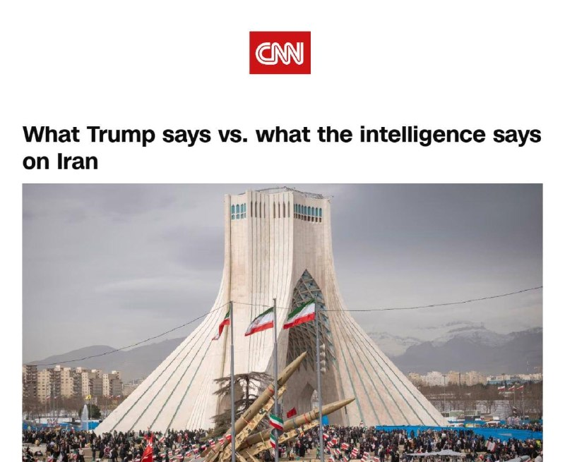

💢شبکه CNN: ادعاهای ترامپ درباره توان نظامی ایران با گزارش‌های اطلاعاتی مغایر است

🔹دولت ترامپ در حالی بر طبل نابودی کامل توان نظامی ایران می‌کوبد که گزارش‌های نهادهای اطلاعاتی تصویری متفاوت از واقعیت‌های میدان نبرد ارائه می‌دهند.

🔹ارزیابی‌های اطلاعاتی سی‌ان‌ان و نیویورک تایمز نشان می‌دهد که ایران بخش قابل‌توجهی از توان پهپادی و موشک‌های ساحلی خود را حفظ کرده است.
🔹در جلسات استماع سنا، مقامات ارشد نظامی از جمله کین (رئیس ستاد مشترک) و هگست (وزیر جنگ) از تأیید یا تکذیب آمارهای ترامپ (مانند نابودی ۸۰ درصد توان موشکی ایران) خودداری کرده و این جزئیات را «محرمانه» خواندند.
🔹تحلیل‌گران معتقدند اظهارات ترامپ درباره جنگ ایران بخشی از یک الگوی بزرگتر از بزرگ‌نمایی و تحریف حقایق برای پیشبرد اهداف سیاسی ست.

🫆:Tony

📌 @persian_trend_official
پرشین ترند | متفاوت‌ترین کانال نظامی

## Persian_Trend_Official — post 14150

  <a href="telegram/content/Persian_Trend_Official_14150_1778779790.webm" target="_blank">🎬 Download video</a>

💢حمید رسایی، نماینده تهران در مجلس،

▪️جریانی «شناخته‌شده» در دولت چهاردهم که راه‌حل را «آزاد کردن و گران کردن» می‌داند، قصد دارد سهمیه بنزین هزار و ۵۰۰ تومانی و سه هزار تومانی را کاهش دهد و قیمت بنزین پنج هزار تومانی را به ۱۵ تا ۲۰ هزار تومان افزایش دهد.

💢او افزود همان جریان در دولت چهاردهم پیش‌تر با حذف ارز ترجیحی ۲۸ هزار و ۵۰۰ تومانی و گران کردن ارز، به گفته او، «بالاترین تورم پس از انقلاب ۵۷» را به مردم تحمیل کرده بود.

💢رسایی نوشت محمدباقر قالیباف با «پلمپ کردن بدون توجیه و دلیل مجلس»، راه نظارت نمایندگان بر تصمیمات دولت را بسته است. او افزود انجام تکلیف نمایندگی سخت شده، اما تلاش می‌کند مجلس را از این «مرگ تعمدی» بیرون بیاورد و جلوی این تصمیمات «عجیب» را در موقعیت «سخت و جنگی» فعلی بگیرد.

🫆:Tony

📌 @persian_trend_official
پرشین ترند | متفاوت‌ترین کانال نظامی

## RadioFarda — post 157189

  <a href="https://t.me/radiofarda/157189" target="_blank">📎 Download file</a>

چرا عمومی شدن سفر نتانیاهو به امارات، برای اسرائیل مهم است؟ گفت‌وگو با حبیب حسینی‌فرد

🔸آیا بنیامین نتانیاهو نخست‌وزیر اسرائیل در میانه جنگ با ایران به امارات متحده عربی سفر کرده است؟ پاسخ دفتر نخست‌وزیر اسرائیل به این پرسش مثبت است اما وزارت خارجه امارات متحده عربی در بیانیه‌ای ادعای دفتر بنیامین نتانیاهو، در این زمینه را تکذیب کرده است. دفتر نخست‌وزیر اسرائیل با اعلام خبر سفر گفته بود دیدار به یک «پیشرفت تاریخی» در روابط میان دو کشور منجر شده است. اما ابوظبی با تکذیب آن می‌گوید روابط امارات با اسرائیل «علنی» است و «بر پایه توافقات غیرشفاف یا غیررسمی بنا نشده است». خبر پیرامون این سفر و تکذیب آن در میانه گزارش‌هایی منتشر شده که از حمله تلافی‌جویانه امارات متحده عربی به ایران و همچنین استفاده این کشور از سامانه ضدموشکی گنبد آهنین اسرائیل مورد توجه قرار گرفته است. ارزیابی حبیب حسینی‌فرد تحلیلگر امور بین‌الملل را در آلمان درباره این تحولات بشنوید.

@RadioFarda

## RadioFarda — post 157188

  <a href="https://t.me/radiofarda/157188" target="_blank">📎 Download file</a>

«همزیستی» با محکومان به اعدام در گفت‌وگو با اسماعیل عبدی

🔸زندگی ایرانی گویی با نام زندان گره خورده‌ است. هر روز خبری از بازداشت، آزادی و اعدام در میان سرخط‌ها به چشم می‌خورد. اما زندانی که ما درباره آن می‌شنویم با زندانی که یک فرد محبوس پشت دیوارها و میله‌های آن تجربه می‌کند بسیار فاصله دارد و ما کمتر از تجربه روزمره زندانیان مطلع می‌شویم. در این روزها که هر روز خبر از اجرای یک یا چند حکم اعدام منتشر می‌شود با یک زندانی سیاسی پیشین درباره این تجربه گفت‌وگو کرده‌ایم که تجربه هم‌بندی و زندگی با محکومان به اعدام را از جمله در بند ۳۵۰ زندان اوین داشته است؛ اسماعیل عبدی دبیرپیشین کانون صنفی معلمان تهران بوده و حدود ده سال از زندگی خود را در زندان‌های ایران سپری کرده و هم اکنون ساکن شهر فرانکفورت در آلمان است.

@RadioFarda

## RadioFarda — post 157187

  <a href="https://t.me/radiofarda/157187" target="_blank">📎 Download file</a>

📻بشنوید: ایستگاه ۱۹ با رادیوفردا، ۲۴ اردیبهشت ۱۴۰۵

@RadioFarda

## RadioFarda — post 157186

  <a href="https://t.me/radiofarda/157186" target="_blank">📎 Download file</a>

🔸در این کافه فردا به بحران صنعت گردشگری در دوران آتش‌بس، ازدواج جان‌فداها در میدان امام حسین تهران، حواشی مسابقات یوروویژن در اروپا، صحبت‌های عجیب یک نماینده مجلس در مورد بمب‌های «لازمان» و فرافکنی سخنگوی دولت در رابطه با اینترنت پرو می‌پردازیم.

🔸 برای تماس با ما می‌توانید به شناسه کافه فردا در تلگرام صوت و متن بفرستید.

📻 کافه فردا

## RadioFarda — post 157185

🔸دونالد ترامپ، رئیس‌جمهور آمریکا، روز پنجشنبه و بعد از دیدار با همتای چینی خود در پکن گفت که شی جین‌پینگ پیشنهاد داده است برای توافق با ایران و تضمین عبور و مرور کشتی‌ها از تنگه هرمز کمک کند و وعده داد تجهیزات نظامی به ایران ارسال نکند. 🔸او در گفت‌وگویی اختصاصی…

## RadioFarda — post 157184

  

🔸دونالد ترامپ، رئیس‌جمهور آمریکا، روز پنجشنبه و بعد از دیدار با همتای چینی خود در پکن گفت که شی جین‌پینگ پیشنهاد داده است برای توافق با ایران و تضمین عبور و مرور کشتی‌ها از تنگه هرمز کمک کند و وعده داد تجهیزات نظامی به ایران ارسال نکند.

🔸او در گفت‌وگویی اختصاصی با شان هنیتی، مجری شبکه فاکس‌نیوز، گفت: «رئیس‌جمهور شی مایل است توافقی حاصل شود. او واقعاً دوست دارد توافقی انجام شود. و گفت: “اگر بتوانم به هر شکلی کمک کنم، خوشحال می‌شوم کمک کنم.”»

@RadioFarda

## RadioFarda — post 157183

🔸برد کوپر، فرمانده ستاد فرماندهی مرکزی ایالات متحده (سنتکام)، اعلام کرد که صنایع موشکی، پهپادی و دریایی ایران «۹۰ درصد تضعیف شده‌اند.» 🔸او در یک جلسه استماع در سنای آمریکا گفت: «تهدید ایران به‌طور قابل‌توجهی تضعیف شده و این کشور دیگر مانند گذشته، در هیچ حوزه‌ای،…

## RadioFarda — post 157182

  

🔸برد کوپر، فرمانده ستاد فرماندهی مرکزی ایالات متحده (سنتکام)، اعلام کرد که صنایع موشکی، پهپادی و دریایی ایران «۹۰ درصد تضعیف شده‌اند.»

🔸او در یک جلسه استماع در سنای آمریکا گفت: «تهدید ایران به‌طور قابل‌توجهی تضعیف شده و این کشور دیگر مانند گذشته، در هیچ حوزه‌ای، قادر به تهدید شرکای منطقه‌ای یا ایالات متحده نیست. آنها به‌شدت تضعیف شده‌اند.»

🔸کوپر اشاره کرد که نیروهای نیابتی مسلح ایران در ۳۰ ماه پیش از جنگ اخیر، بیش از ۳۵۰ حمله علیه نیروها و دیپلمات‌های آمریکایی انجام داده بودند؛ به‌طور میانگین هر سه روز یک حمله، که در نتیجه آن چهار سرباز آمریکایی کشته شدند.

🔸این جنگ روز نهم اسفند سال گذشته با حملات آمریکا و اسرائیل به ایران آغاز شد و طی آن علی خامنه‌ای و شماری از فرماندهان و مقام‌های ارشد جمهوری اسلامی کشته شدند. ایران نیز در مقابل حملات موشکی به اسرائیل و شماری از کشورهای خاورمیانه انجام داد و تنگه هرمز را مسدود کرد.

@RadioFarda

## IranianMinds — post 20142

🔴 روبیو، وزیرخارجه آمریکا: ترامپ از رئیس جمهور چین کمکی نخواست و آمریکا به کمک چین نیازی نداره.

@IranianMinds

## IranianMinds — post 20141

  

:( موضوع امیدوار بودن یا نبودن نیست. وقتی که قدرت تصمیم‌گیری در دست دیگران است، وقتی که ما نمی‌توانیم در تصمیم‌گیری آنها دخالت کنیم، تنها کاری که می‌توان انجام داد، تحمل کردن است.

@IranianMinds

## IranianMinds — post 20140

  

گیر چه عقب مونده‌هایی افتادیم

ننگ ۵۰۰ ساله روحانیت رو از تاریخ ایران پاک باید کنیم

@IranianMinds

## IranianMinds — post 20139

  <a href="telegram/content/IranianMinds_20139_1778779793.mp4" target="_blank">🎬 Download video</a>

این هنرمند و کمدین آمریکایی، با طنز استندآپ، ۴۷ سال حکومت ننگین جمهوری اسلامی در ایران را به سخره می‌گیرد و به‌خوبی چهره فاسد و سرکوبگر این حکومت را افشا می‌کند. او همچنین از انقلاب و مبارزه مردم ایران برای آزادی حمایت می‌کند.
درود بر آزادی‌خواهان سراسر جهان.

@IranianMinds

## IranianMinds — post 20138

  

🔴اکانت اسرائیل به فارسی:

۳۰۰۰ سال پیش، حضرت داوود اورشلیم را به پایتختی خود برگزید.
۵۹ سال پیش با آزادی بخش شرقی شهر، پایتخت یهودیان زیر پرچم اسرائیل دوباره یکپارچه گشت.
این شهر قلب تپنده یهودیان و بخشی جدانشدنی از اسرائیل است.

روز اورشلیم خجسته باد.

@IranianMinds

## IranianMinds — post 20137

  <a href="telegram/content/IranianMinds_20137_1778779795.mp4" target="_blank">🎬 Download video</a>

ترامپ:

شی مایل است شاهد انجام یک معامله باشد. او گفت: «اگر بتوانم کمکی داشته باشم، دوست دارم کمک کنم.»

هر کسی که این مقدار نفت می‌خرد، دوست دارد تنگه هرمز را باز ببیند.

@IranianMinds

## IranianMinds — post 20136

🔴سنتکام:

امارات، بحرین، عربستان، کویت، اردن و اسرائیل در عملیات آمریکا شرکت کردند.

@IranianMinds

## IranianMinds — post 20135

🔴حمید رسایی:

دولت می‌خواهد قیمت بنزین را تا ۲۰ هزار تومان افزایش بدهد.

@IranianMinds

## BBCPersian — post 281042

🔻دیدار عراقچی و لاوروف در حاشیه اجلاس وزرای خارجه بریکس

🔻وزارت خارجه روسیه اعلام کرد که سرگئی لاوروف، وزیر خارجه آن کشور، در حاشیه نشست وزرای خارجه کشورهای بریکس در دهلی نو، با همتای ایرانی خود عباس عراقچی دیدار و گفت‌وگو کرده است.

بنابر این گزارش، طرفین «به طور عمیق و محرمانه» درباره روند مذاکرات با هدف حل و فصل جنگ خاورمیانه تبادل نظر کردند.

وزارت خارجه روسیه می‌گوید که آقای لاوروف در این دیدار بر اهمیت حفظ آتش‌بس و صلح شکننده و همچنین جلوگیری از اختلال در تلاش‌های سیاسی و دیپلماتیک برای دستیابی به توافق جامع ایران و آمریکا تاکید کرد.

بر اساس این گزارش، سرگئی لاوروف در این دیدار بار دیگر آمادگی روسیه را برای ارائه تسهیلات به طرفین جهت یافتن و اجرای راه‌حل‌های قابل قبول دوجانبه اعلام کرد.

وزارت خارجه روسیه می‌گوید که دو طرف همچنین در مورد مسائل جاری همکاری‌های دوجانبه بحث و گفت‌وگو کرده و تعهد متقابل خود را برای تقویت مستمر مشارکت جامع راهبردی بین دو کشور، تایید کردند.

https://bbc.in/43cQEqw
@BBCPersian

## BBCPersian — post 281041

  

‌🔻‌روابط عمومی سپاه پاسداران اکنون با تایید گزارش‌های پیشین می‌گوید «با تصمیم جمهوری اسلامی، امکان عبور تعدادی از کشتی‌های چینی از تنگه هرمز با رعایت پروتکل مدیریت ایرانی تنگه میسر شد.»

بر اساس این بیانیه، پس از پیگیری‌های وزیر خارجه چین و سفیر این کشور در ایران، «در نهایت جمع‌بندی شد که تعدادی کشتی چینی مورد درخواست این کشور پس از تفاهم درباره پروتکل‌های مدیریت ایرانی تنگه از این منطقه عبور کنند که این عبور از شب گذشته آغاز شده است.»

بر اساس گزارش‌ها، ایران از شب گذشته به کشتی‌های چینی بیشتری اجازه عبور از تنگه هرمز را داده است.

خبرگزاری فارس به نقل از یک منبع آگاه گزارش داده است که این اقدام به دنبال درخواست‌های وزیر امور خارجه چین و سفیر پکن در ایران انجام شده است.

خبرگزاری فارس نوشته طی روزهای گذشته دست‌کم شش نفتکش و کشتی فله‌بر با مالکیت یا بهره‌برداری عملیاتی چین از تنگه هرمز عبور کرده‌اند.

بی‌بی‌سی وریفای هم تایید کرده که دستکم یک ابرنفتکش چین روز گذشته از تنگه هرمز عبور کرده است.

عکس استفاده شده آرشیوی است.

📷NurPhoto via Getty Images
https://bbc.in/4fl3qdR

@BBCPersian

## BBCPersian — post 281040

🔻ونگارد: کشتی توقیف شده از سوی ایران یک «انبار مهمات شناور» است

🔻پیشتر در مورد توقیف یک کشتی در نزدیکی امارات گزارش کرده بودیم که اکنون جزئیات بیشتری در مورد آن منتشر شده است.

به گزارش شرکت مدیریت ریسک دریایی «ونگارد»، یک کشتی که به عنوان «انبار مهمات شناور» در دریای عمان فعالیت می‌کرده، توسط نیروهای نظامی ایران توقیف شده است.

سازمان عملیات تجارت دریایی بریتانیا اعلام کرد که این کشتی اکنون «در مسیر آب‌های سرزمینی ایران» قرار دارد.

بی‌بی‌سی وریفای با بررسی داده‌های ردیابی کشتی‌ها از سامانه «مارین ترافیک» تایید کرده که این شناور که ونگارد آن را «هویی چوان» با پرچم هندوراس معرفی کرده، آخرین بار روز چهارشنبه در فاصله ۷۰ کیلومتری شمال شرق فجیره در امارات متحده عربی موقعیتش را مخابره کرده است.

اپراتورهای «هویی چوان» به ونگارد گفته‌اند که این کشتی به عنوان اسلحه‌خانه شناور فعالیت می‌کرده و در آن برای شرکت‌های امنیتی که از کشتی‌ها در برابر حملات دزدان دریایی محافظت می‌کنند، سلاح نگهداری می‌شده است.

بی‌بی‌سی وریفای نمی‌تواند تایید کند چه محموله‌ای در این کشتی بوده یا در اختیار چه کسانی بوده است.

بی‌بی‌سی پیشتر گزارش داده بود که این گونه شناورها در دریای سرخ، خلیج عدن و دریای عمان مستقر می‌شوند تا محافظان امنیتی بتوانند به راحتی سلاح و مهمات خود را تحویل گرفته یا تحویل دهند.

https://bbc.in/438NvYU
@BBCPersian

## BBCPersian — post 281039

  

🔻دونالد ترامپ می‌گوید که شی جین‌پینگ، رئیس‌جمهور چین، پیشنهاد داده تا پکن برای بازگشایی تنگه هرمز کمک کند.

آقای ترامپ،‌ پس از مذاکراتش در پکن به فاکس نیوز گفت که آقای شی به او گفته «به هر شکلی که بتواند مایل به این کار است.»

او افزود که رئیس‌جمهور چین همچنین به او اطمینان داده که پکن هیچ کمک نظامی به ایران در جنگ با اسرائیل و آمریکا ارسال نخواهد کرد.

پیش‌تر، شی جین‌پینگ در ضیافت رسمی به افتخار آقای ترامپ گفته بود که آمریکا و چین باید «شریک باشند، نه رقیب» و روابط دو کشور را «مهم‌ترین رابطه جهان» توصیف کرده بود.

آقای ترامپ نیز لحن مثبتی در قبال این دیدار داشت و از رهبر چین برای سفر به کاخ سفید در ماه سپتامبر دعوت کرد.

دو رئیس‌جمهور حدود دو ساعت گفت‌وگو کردند؛ مذاکراتی که کاخ سفید آن را «مثبت» توصیف کرده و گفته تمرکز آن بر تقویت روابط اقتصادی بوده است.

📷Getty Images
https://bbc.in/4uaHPJP

@BBCPersian

## BBCPersian — post 281038

  

‌🔻دریاسالار برد کوپر، فرمانده سنتکام، طی یک جلسه استماع در مورد جنگ با ایران در سنای آمریکا گفت که توانایی ایران برای تهدید همسایگان خود و منافع ایالات متحده در منطقه به طور چشمگیری کاهش یافته است.

او گفت عملیات نظامی ما زیرساخت صنعتی توانمندی‌های موشکی، دریایی و ساخت پهپاد ایران را تا ۹۰ درصد تضعیف کرده و بازسازی نیروی دریایی این کشور دستکم یک نسل به طول می‌انجامد.

آقای کوپر در جلسه کمیته سنا گفت: «تهدید ایران به طور قابل توجهی کاهش یافته است و آنها دیگر به روش‌هایی که پیش از این قادر بودند، در همه حوزه‌ها، شرکای منطقه‌ای یا ایالات متحده را تهدید نمی‌کنند. آنها به طور قابل ملاحظه‌ای تضعیف شده‌اند.»

او در عین حال گفت ایران به خاطر وسعت و قابلیت‌هایش همچنان یک تهدید باقی مانده است.

📷Reuters
https://bbc.in/4dGZanU

@BBCPersian

## BBCPersian — post 281037

  <a href="telegram/content/BBCPersian_281037_1778779798.mp4" target="_blank">🎬 Download video</a>

🔻کارشناسان می‌گویند در پی جنگ با ایران و درگیری و مشغول شدن نیروهای دریایی با آن، دزدی دریایی در آبهای سومالی دوباره در حال افزایش است.

دزدان دریایی سومالی دست‌کم سه کشتی بزرگ تجاری را برای اخاذی و باج‌گیری ربوده‌اند. از جمله نفتکش آنر۲۵ که کاپیتانش اشاری سامادیکون اهل اندونزی است.

همسر کاپیتان می‌گوید که او به دزدان دریایی گفته که مسلمان است و از آنها خواسته به خاطر هم‌کیشی به او و خدمه‌اش رحم کنند.

@BBCPersian

## Dirty_Kids — post 389464

  

خبرگزاری دانشجو : شما فقط نحوه دست دادن رئیس‌جمهور چین با پرفسور رئیسی و ترامپ رو مقایسه کنی، متوجه قدرت ایران میشید... +کسخلیت و کونده‌پرویی اینا حدی نداره :))))) چین فروختتشون توافق کرده با امریکا استقبال بی نظیر کردن از ترامپ بعد رئیسی گوزو ۶ کلاسه‌رو…

## Dirty_Kids — post 389463

  <a href="telegram/content/Dirty_Kids_389463_1778779800.mp4" target="_blank">🎬 Download video</a>

خبرگزاری دانشجو :
شما فقط نحوه دست دادن رئیس‌جمهور چین با پرفسور رئیسی و ترامپ رو مقایسه کنی، متوجه قدرت ایران میشید...

+کسخلیت و کونده‌پرویی اینا حدی نداره :)))))
چین فروختتشون توافق کرده با امریکا
استقبال بی نظیر کردن از ترامپ
بعد رئیسی گوزو ۶ کلاسه‌رو همه میریدن بهش از پوتین بگیر تا شی دارن مقایسه میکنن


@Dirty_Kids 👻

## Dirty_Kids — post 389462

  

رسایی؛ نماینده‌ی مجلس:

دولت قصد داره میزان سهمیه ماهانه بنزین ۱۵۰۰ تومنی و ۳۰۰۰ تومنی رو کاهش بده و قیمت بنزین ۵۰۰۰ تومنی رو هم به ۲۰۰۰۰ تومن برسونه.

@Dirty_Kids 👻

## Dirty_Kids — post 389458

ده‌هزار تا عکس داره یکی از یکی زیباتر

@Dirty_Kids 👻

## Dirty_Kids — post 389456

ریدم=)))))))))

@Dirty_Kids 👻

## Dirty_Kids — post 389455

✖️ سایت بین المللی bet120x 
✖️  
👍دارای مجوز رسمی Gambling Judge سوئد
👍       
💳شارژ حساب از طریق ارز و یووچر و پرمیوم ووچر 
💳تسویه حساب دلاری سریع 💊بیمه شرط میکس 
⚠️فروش شرط 
🔔ویرایش شرط                    
3️⃣
2️⃣ 
🎁20%هدیه واریز از طریق ارز و ووچر ┅━━━━━━━━━━━…

## Dirty_Kids — post 389454

  

✖️ سایت بین المللی bet120x 
✖️

 
👍دارای مجوز رسمی Gambling Judge سوئد
👍
     

💳شارژ حساب از طریق ارز و یووچر و پرمیوم ووچر

💳تسویه حساب دلاری سریع
💊بیمه شرط میکس

⚠️فروش شرط

🔔ویرایش شرط                    
3️⃣
2️⃣

🎁20%هدیه واریز از طریق ارز و ووچر
┅━━━━━━━━━━━

🎁 10%برگشت باخت به صورت روزانه

🎁 10%برگشت باخت به صورت هفتگی

🎁10%برگشت باخت به صورت ماهانه

💻ادرس ورود به سایت:
https://bet120x.com/fa/?btag=971470
➖➖➖➖➖
   
👈 آموزش واریز و برداشت دلاری
👉

🔪کانال اطلاع رسانی:
👇

✈️https://t.me/+1Wv5nGY_a54xNzlk

## Dirty_Kids — post 389453

  

گیر چه عقب مونده‌هایی افتادیم

ننگ ۵۰۰ ساله روحانیت رو از تاریخ ایران پاک باید کنیم

@Dirty_Kids 👻

## Dirty_Kids — post 389452

  <a href="telegram/content/Dirty_Kids_389452_1778779802.mp4" target="_blank">🎬 Download video</a>

هنوز رد خونت روشه ...
#پرهام_آقامحمدی

@Dirty_Kids 👻

## Dirty_Kids — post 389451

  

🌪وقتی اینترنت طوفانیه... کافیه بادبان ها رو بکشی تا

⚫️با بالاترین کیفیت ممکن
⚡️ 

⚫️100 هزار تومان شارژ هدیه 
🎁

⚫️پایین ترین قیمت گیگی 250
🌐 

⚫️و ارائه پورسانت %10 در ازای هر معرفی
💼

بتونی یه اتصال پایدار با پشتیبانی 24 ساعته داشته باشی
🚀

بادبان راهتو باز می‌کنه
⛵️

G24

🛡@BadBan_VPN | کانال 

🤖@BadBan_VPNBot | ربات 

📞@BadBan_VPNSupport | پشتیبانی

## Dirty_Kids — post 389450

  <a href="telegram/content/Dirty_Kids_389450_1778779804.mp4" target="_blank">🎬 Download video</a>

وضعیت دیشبِ خیابون فرشته تهران:
دعوا سر دختر

طهران الان قسمت بندی شده
یه گوشه حی‌در حی‌در میکنن عرزشیا هپی بشن، یه گوشه پروپاگاندا، یجا برای بچه پولدارا و...

@Dirty_Kids 👻

## Dirty_Kids — post 389449

  

‏از روزی که ‎#رضاشاه_کبیر سر از خاک بیرون آورد جمهوری اسهالی روی خوش ندید.

@Dirty_Kids 👻

## Dirty_Kids — post 389448

ShirOKhorshid-2026.05.14.apk

## Dirty_Kids — post 389447

  <a href="telegram/content/Dirty_Kids_389447_1778779805.mp4" target="_blank">🎬 Download video</a>

مراد؛ ویروس هانتا 😂🤌⁩⁩

@Dirty_Kids 👻

## Dirty_Kids — post 389446

  <a href="https://t.me/Dirty_Kids/389446" target="_blank">📎 Download file</a>

دقایقی قبل این اپلیکیشن بنام "شیر و خورشید" که نسخه تغییر یافته سایفون هستش تو تلگرام درحال وایرال شدنه و میگن خیلی خوب کار میکنه.

مهم: اگر این نسخه رو نصب کنید دیگه دردسر ستاپ کردن MITM و... ندارید!
این نسخه حدودا یک ساعت پیش توسط برنامه‌نویس شیر و خورشید آپدیت شد و به راحتی می‌تونید طبق این آموزش بهش وصل بشید:
1- وارد اپلیکیشن شیر و خورشید(آخرین نسخه که امروز منتشر شده) می‌شید
2- وارد بخش Options میشید از نوار بالا
3- روی More Options کلیک میکنید
4- گزینه‌ی Connection Protocol رو قرار میدید روی CDN Fronting
5- میرید و عادی کانکت میشید و به راحتی وصل میشه.

+ من تست نکردم ولی دیدم میگن جوابه

@Dirty_Kids 👻

## Hranews — post 112945

فقدان ایمنی کار؛ مصدومیت ۶ کارگر در آرادان و کاشان

❗️
❗️
❗️
❗️
❗️– در سایه فقدان ایمنی محیط و شرایط نامناسب کار، پنج #کارگر در آرادان بر اثر یک حادثه دچار مسمومیت شدند و یک کارگر در کاشان در پی وقوع حادثه‌ای، دچار مجروحیت و قطع عضو شد.

ادامه مطلب

↘️
@hranews_bot تماس ✉️ - @Hranews کانال هرانا 🆑

## Hranews — post 112944

مهدی شفاخواه، فعال حوزه آموزش و حمایت از کودکان کار بازداشت شد

❗️
❗️
❗️
❗️
❗️– مهدی شفاخواه، ، فعال حوزه آموزش و حمایت از کودکان کار و ساکنان مناطق محروم، روز سه‌شنبه ۲۲ اردیبهشت‌ماه، توسط نیروهای نیروهای امنیتی بازداشت و به مکان نامعلومی منتقل شد.

#مهدی_شفاخواه
ادامه مطلب

↘️
@hranews_bot تماس ✉️ - @Hranews کانال هرانا 🆑

## manototv — post 105459

  <a href="telegram/content/manototv_105459_1778779806.mp4" target="_blank">🎬 Download video</a>

فرمانده سنتکام اعلام کرد توان جمهوری‌اسلامی برای تهدید همسایگان و منافع آمریکا در منطقه به‌طور چشمگیری تضعیف شده است.
دریادار برد کوپر، فرمانده سنتکام، در جلسه‌ای در سنای آمریکا گفت: «تهدید ایران به‌طور قابل‌توجهی کاهش یافته و دیگر مانند گذشته قادر به تهدید شرکای منطقه‌ای یا آمریکا در همه حوزه‌ها نیست.»
او افزود نیروهای نیابتی جمهوری‌اسلامی در ۳۰ ماه پیش از جنگ اخیر بیش از ۳۵۰ حمله علیه نیروها و دیپلمات‌های آمریکایی انجام داده بودند؛ حملاتی که به گفته او به کشته شدن چهار سرباز آمریکایی منجر شد.
کوپر همچنین مدعی شد گروه‌هایی مانند حماس، حزب‌الله و حوثی‌ها اکنون از حمایت تسلیحاتی و لجستیکی جمهوری‌اسلامی جدا شده‌اند.
این فرمانده آمریکایی گفت ارتش آمریکا دیگر برای مقابله با پهپادهای جمهوری‌اسلامی از مهمات گران‌قیمت و پیشرفته استفاده نمی‌کند و به‌جای آن سراغ گزینه‌های ارزان‌تر رفته است.
به گفته او، جمهوری‌اسلامی تنها حدود ۱۰ درصد از پهپادهای خود را در اختیار دارد. با وجود آتش‌بس شکننده یک‌ماهه، درگیری‌های پراکنده میان نیروهای ایرانی و آمریکایی همچنان ادامه دارد.

## manototv — post 105457

  <a href="telegram/content/manototv_105457_1778779807.mp4" target="_blank">🎬 Download video</a>

دونالد ترامپ در گفت‌وگو با شان هنیتی گفت شی جین‌پینگ، رئیس‌جمهوری چین، متعهد شده به جمهوری اسلامی تجهیزات نظامی ارائه نکند.

ترامپ گفت: «او گفت قرار نیست تجهیزات نظامی بدهد؛ این حرف بزرگی است.»

رئیس‌جمهوری آمریکا در ادامه افزود چین همچنان بخش زیادی از نفت خود را از ایران خریداری می‌کند و مایل است این روند ادامه پیدا کند.

ترامپ همچنین گفت شی جین‌پینگ خواهان باز ماندن تنگه هرمز و جلوگیری از اختلال در عبور و مرور کشتی‌هاست.

## alonews — post 119992

  <a href="telegram/content/alonews_119992_1778779808.webm" target="_blank">🎬 Download video</a>

👈 دیدار عراقچی و وزیر خارجه مصر در حاشیه نشست وزرای امور خارجه بریکس در دهلی‌نو

✅ @AloNews خبر جنگ

## alonews — post 119988

  <a href="telegram/content/alonews_119988_1778779808.webm" target="_blank">🎬 Download video</a>

👈ارتش اسرائیل شروع به توزیع توری‌های ضد پهپاد به نیروها در لبنان کرده است، به طوری که تقریباً ۱۵۸٬۰۰۰ متر مربع تاکنون توزیع شده و ۱۸۸٬۰۰۰ متر مربع دیگر در حال خرید است، طبق گزارش کانال ۱۵

✅ @AloNews خبر جنگ

## alonews — post 119987

  <a href="telegram/content/alonews_119987_1778779808.webm" target="_blank">🎬 Download video</a>

👈کانال 12 عبری: اسرائیل سطح هشدار خود را به بالاترین حد ممکن افزایش می‌دهد تا برای احتمال جنگی تازه با ایران پس از بازگشت ترامپ از چین آماده شود.

✅ @AloNews خبر جنگ

## alonews — post 119986

  <a href="telegram/content/alonews_119986_1778779808.webm" target="_blank">🎬 Download video</a>

👈واشنگتن پست: چین از جنگ آمریکا علیه ایران برای تقویت روابط با کشورهایی مانند تایلند، استرالیا و فیلیپین، با ارائه سوخت و فناوری سبز، استفاده می‌کند، آن هم در زمانی که به نظر می‌رسد دولت ترامپ علاقه کمتری به رهبری تلاش‌های بین‌المللی برای مقابله با بحران جهانی انرژی دارد

✅ @AloNews خبر جنگ

## alonews — post 119985

  <a href="telegram/content/alonews_119985_1778779808.webm" target="_blank">🎬 Download video</a>

👈روبیو، وزیر امور خارجه آمریکا : ترامپ از رئیس جمهور چین کمکی نخواست، آمریکا به کمک چین نیازی نداره

✅ @AloNews خبر جنگ

## alonews — post 119984

  <a href="telegram/content/alonews_119984_1778779809.mp4" target="_blank">🎬 Download video</a>

👈حزب‌الله دو سرباز اسرائیلی رو که داشتن فرار میکردن هدف گرفت و با پهپاد کُشت

✅ @AloNews خبر جنگ

## alonews — post 119983

  <a href="telegram/content/alonews_119983_1778779810.webm" target="_blank">🎬 Download video</a>

👈گزارش واشنگتن پست از یک ارزیابی اطلاعاتی محرمانه ایالات متحده: چین در نتیجه جنگ جاری آمریکا با ایران، در زمینه های نظامی، اقتصادی، دیپلماتیک و رسانه ای، دستاوردهای استراتژیک گسترده‌ای را به هزینه ایالات متحده به دست می آورد ، در حالی که نگرانی فزاینده‌ای در وزارت دفاع ایالات متحده در مورد پیامدهای ژئوپلیتیکی این درگیری وجود دارد

🔴پکن از جنگ با ایران برای تقویت جایگاه بین‌المللی خود استفاده کرد، در حالی که واشنگتن بخش قابل توجهی از قابلیت‌های نظامی و اقتصادی خود را از بین برد

✅ @AloNews خبر جنگ

## alonews — post 119982

  <a href="telegram/content/alonews_119982_1778779810.webm" target="_blank">🎬 Download video</a>

👈رسایی؛ نماینده‌ی مجلس:
دولت قصد داره میزان سهمیه ماهانه بنزین ۱۵۰۰ تومنی و ۳۰۰۰ تومنی رو کاهش بده و قیمت بنزین ۵۰۰۰ تومنی رو هم به ۲۰۰۰۰ تومن برسونه.

✅ @AloNews خبر جنگ

## alonews — post 119981

  

🌟 اشتراک v2ray استارلینک

🗯گیگی 150,000 تومان

🔗لینک ساب برا چک کردن مصرف و حجمتون

🔥سرعت و کیفیت بالا

✅ پشتیبانی دائم

📱جهت خرید پیام بدین : @v2safeBot

## alonews — post 119980

  <a href="telegram/content/alonews_119980_1778779811.webm" target="_blank">🎬 Download video</a>

👈سخنگوی وزارت خارجه پاکستان: اسلام‌آباد از نقش چین در میانجی‌گری برای حل‌وفصل تنش‌ها میان ایران و آمریکا حمایت می‌کند.

✅ @AloNews خبر جنگ

## alonews — post 119979

  <a href="telegram/content/alonews_119979_1778779811.webm" target="_blank">🎬 Download video</a>

👈واردات نفت خام آمریکا از ونزوئلا در هفته گذشته به بالاترین حد خود در هفت سال گذشته رسید.

✅ @AloNews خبر جنگ

## alonews — post 119978

  <a href="telegram/content/alonews_119978_1778779811.webm" target="_blank">🎬 Download video</a>

👈وزیر دفاع بریتانیا : بعد از این‌که روسیه حملات سنگینی به اوکراین کرده

🔴قراره ارسال سامانه‌های پدافند هوایی به کی‌یف رو سریع‌تر انجام بدیم

✅ @AloNews خبر جنگ

## alonews — post 119977

  <a href="telegram/content/alonews_119977_1778779811.webm" target="_blank">🎬 Download video</a>

👈ایالات متحده موفق شد اورانیوم بسیار غنی شده را از رآکتور هسته ای برای اهداف تحقیقاتی در ونزوئلا خارج کند

✅ @AloNews خبر جنگ

## alonews — post 119976

  <a href="telegram/content/alonews_119976_1778779811.webm" target="_blank">🎬 Download video</a>

👈شبکه MS NOW: شرکت‌های خصوصی چینی در حال بررسی فروش موشک‌های ضدهوایی به ایران هستند

✅ @AloNews خبر جنگ

## alonews — post 119975

  <a href="telegram/content/alonews_119975_1778779812.webm" target="_blank">🎬 Download video</a>

👈رونگ هوان»، فعال رسانه‌ای و تحلیلگر سیاسی چینی، تأکید کرد که پکن مناسب‌ترین و توانمندترین طرف برای ایفای نقش میانجیگری فعال بین واشنگتن و تهران است

🔴 او اشاره کرد که بهبود روابط چین و آمریکا در ماه‌های اخیر، افق‌های جدیدی را برای ترغیب دو طرف به بازگشت به میز مذاکرات مستقیم گشوده است.

🔴 این تحلیلگر سیاسی توضیح داد که منطقه در وضعیت تنش‌آفرینی متقابلی به سر می‌برد که نیازمند ابتکاری از سوی چین است تا نردبان کاهش تنش را فراهم آورد که آبروی هر دو طرف حفظ شود و به وضعیت بی‌ثباتی که به ضرر منافع همگان است، پایان دهد.

✅ @AloNews خبر جنگ

## alonews — post 119974

  <a href="telegram/content/alonews_119974_1778779812.webm" target="_blank">🎬 Download video</a>

👈برد کوپر: ما درگیر اقدامات خصمانه علیه ایران نیستیم، بلکه آتش بس داریم

✅ @AloNews خبر جنگ

## alonews — post 119973

  <a href="telegram/content/alonews_119973_1778779812.webm" target="_blank">🎬 Download video</a>

👈وزیر جنگ پیت هگستث: با وجود آنچه ممکن است در رسانه‌ها بشنوید، آمریکا در حال افول نیست. ما همچنان قوی‌ترین قدرت نظامی روی زمین هستیم، اما این قدرت نیاز به تجدید دارد.

🔴با تهدیدات جهانی که به طور مداوم در حال تحول هستند، زمان آن رسیده است که سرمایه‌گذاری ۱.۵ تریلیون دلاری، یک پیش‌پرداخت نسلی، انجام شود.

🔴این سرمایه‌گذاری تضمین می‌کند که ایالات متحده برای نسل‌های آینده قدرت غالب و بازدارندگی بی‌نظیر در برابر هر دشمنی را حفظ کند

✅ @AloNews خبر جنگ

---
📅 بروزرسانی: 1405/02/24 19:05
---

## VahidOOnLine — post 240146

  <a href="telegram/content/VahidOOnLine_240146_1778772901.mp4" target="_blank">🎬 Download video</a>

‌
دونالد ترامپ، رئیس‌جمهوری آمریکا، در گفت‌و‌گو با شان هنیتی، خبرنگار و مجری فاکس‌نیوز گفت شی جین‌پینگ، رئیس‌جمهوری چین، خواهان دستیابی به توافق و باز ماندن تنگه هرمز است.

ترامپ گفت: «رئیس‌جمهوری شی دوست دارد توافقی حاصل شود. او گفت اگر بتواند کمکی بکند، مایل است کمک کند.»

رئیس‌جمهوری آمریکا همچنین با اشاره به خرید نفت ایران از سوی چین افزود: «هر کسی که این مقدار نفت می‌خرد، بدیهی است نوعی رابطه دارد.»

ترامپ در ادامه گفت شی جین‌پینگ مایل است تنگه هرمز باز بماند.
‌🏁 🇬🇧 ManotoTV

🤖 @VahidOOnLine

## VahidOOnLine — post 240145

  <a href="telegram/content/VahidOOnLine_240145_1778772902.mp4" target="_blank">🎬 Download video</a>

مارکو روبیو، وزیر خارجه آمریکا، گفت دونالد ترامپ موضوع ایران را در گفت‌وگو با مقام‌های چین مطرح کرده و این موضوع «اهمیت زیادی» داشته است.

روبیو گفت طرف چینی اعلام کرده با «نظامی‌سازی تنگه هرمز» و همچنین ایجاد سیستم دریافت عوارض از کشتی‌ها در این آبراه مخالف است.

وزیر خارجه آمریکا افزود: «این موضع ما هم هست.»
‌🏁 🇬🇧 ManotoTV

🤖 @VahidOOnLine

## VahidOOnLine — post 240144

برد کوپر، فرمانده ستاد فرماندهی مرکزی آمریکا (سنتکام)، در جلسه کمیته نیروهای مسلح سنای آمریکا گفت در ۳۰ ماه منتهی به عملیات «خشم حماسی»، گروه‌های مورد حمایت جمهوری اسلامی بیش از ۳۵۰ بار به نیروها و دیپلمات‌های آمریکایی حمله کرده‌اند؛ به‌طور میانگین بیش از یک حمله در هر سه روز.
او افزود این حملات به کشته شدن چهار نظامی آمریکایی و زخمی شدن نزدیک به ۲۰۰ نفر انجامیده است.

فرمانده سنتکام همچنین گفت امروز حماس، حزب‌الله و حوثی‌ها از پشتیبانی و تامین تسلیحاتی جمهوری اسلامی محروم شده‌اند.
‌🏁 🇬🇧 IranintlTV

🤖 @VahidOOnLine

## VahidOOnLine — post 240143

♦️برد کوپر، فرمانده سنتکام، روز پنجشنبه ۲۴ اردیبهشت در جلسه استماع کمیته نیروهای مسلح سنا یادآوری کرد که فرماندهی مرکزی ایالات متحده (سنتکام) در پاسخ مستقیم به تهدیدهای ناشی از جمهوری اسلامی ایران تاسیس شده است. او با اشاره به ۴۷ سال خصومت تهران با آمریکا، تاکید کرد که تنها در ۳۰ ماه پیش از آغاز عملیات «حکم حماسی»، گروه‌های نیابتی ایران بیش از ۳۵۰ بار به نیروها و دیپلمات‌های آمریکایی حمله کرده‌اند.

کوپر گفت که سنتکام به دستور رئیس‌جمهور و در قالب عملیات «خشم حماسی»، در کمتر از ۴۰ روز به اهداف نظامی خود دست یافت. به گفته او، مهم‌ترین دستاورد این عملیات تضعیف توان قدرت‌نمایی ایران در خارج از مرزها بوده است؛ به‌گونه‌ای که جمهوری اسلامی دیگر قادر نیست حملاتی در ابعاد وسیع مشابه آنچه در سال ۲۰۲۴ در جریان اولین حمله مستقیم به خاک اسرائیل رخ داد، انجام دهد. فرمانده سنتکام تاکید کرد که با نابودی ۹۰ درصد از زیرساخت‌های صنایع دفاعی ایران، این کشور تا سال‌ها توان بازسازی تسلیحات خود را نخواهد داشت.
‌🇸🇦 Indypersian

🤖 @VahidOOnLine

## VahidOOnLine — post 240142

برد کوپر، فرمانده ستاد فرماندهی مرکزی آمریکا (سنتکام)، در جلسه کمیته نیروهای مسلح سنای آمریکا گفت در ۳۰ ماه منتهی به عملیات «خشم حماسی»، گروه‌های مورد حمایت جمهوری اسلامی بیش از ۳۵۰ بار به نیروها و دیپلمات‌های آمریکایی حمله کرده‌اند؛ به‌طور میانگین بیش از یک حمله در هر سه روز.
او افزود این حملات به کشته شدن چهار نظامی آمریکایی و زخمی شدن نزدیک به ۲۰۰ نفر انجامیده است.

فرمانده سنتکام همچنین گفت امروز حماس، حزب‌الله و حوثی‌ها از پشتیبانی و تامین تسلیحاتی جمهوری اسلامی محروم شده‌اند.
‌🏁 🇬🇧 IranintlTV

🤖 @VahidOOnLine

## VahidOOnLine — post 240141

♦️عباس عراقچی وزیر خارجه جمهوری اسلامی روز پنجشنبه ۲۴ اردیبهشت در ادامه دیدارهای خود در حاشیه نشست وزیران خارجه گروه بریکس با سرگئی لاوروف وزیر امور خارجه روسیه دیدار کردند.
جزئیاتی در خصوص دیدار وزرای خارجه ایران و روسیه منتشر نشده است.
عراقچی و لاوروف دو هفته پیش در مسکو با یکدیگر دیدار کردند.
وزرای خارجه روسیه، مصر، برزیل، هند، آفریقای جنوبی از جمله مقام‌های ارشد دیپلماتیکی هستند که در این نشست حضور دارند.
عراقچی در حالی در اجلاس وزیران خارجه گروه بریکس شرکت می‌کند که مساله ادامه بسته بودن تنگه هرمز، به یکی از چالش‌های جدی بین‌المللی تبدیل شده است.
‌🇸🇦 Indypersian

🤖 @VahidOOnLine

## VahidOOnLine — post 240140

♦️فرماندهی مرکزی ایالات متحده (سنتکام) روز پنجشنبه ۲۴ اردیبهشت اعلام کرد که نیروهای دریایی این کشور تاکنون در چارچوب محاصره تنگه هرمز توسط آمریکا، ۷۰ کشتی تجاری را «تغییر مسیر» داده و چهار کشتی دیگر را «از کار انداخته‌اند».

این بیانیه پس از آن صادر شد که سپاه پاسداران انقلاب اسلامی ایران اعلام کرد طی ۲۴ ساعت گذشته به ده‌ها فروند کشتی تجاری، از جمله کشتی‌های متعلق به چین، اجازه عبور از این آبراه راهبردی را داده است.
‌🇸🇦 Indypersian

🤖 @VahidOOnLine

## VahidOOnLine — post 240139

وزارت خارجه هند اعلام کرد یک کشتی باری با پرچم این کشور پس از حمله‌ مشکوک پهپادی یا موشکی در روز چهارشنبه، در آب‌های عمان دچار آتش‌سوزی و غرق شده است.
طبق گزارش‌ها هر ۱۴ خدمه این شناور نجات یافتند.
دهلی‌نو هدف قرار دادن کشتیرانی تجاری و ملوانان غیرنظامی را غیرقابل قبول دانست و آن را محکوم کرد.
شرکت امنیت دریایی وانگارد اعلام کرد این شناور هندی پس از انفجاری مشکوک که احتمالا ناشی از حمله پهپادی یا موشکی بوده، در نزدیکی سواحل عمان غرق شده است.
‌🏁 🇬🇧 IranintlTV

🤖 @VahidOOnLine

## VahidOOnLine — post 240138

وزیر نیروی جمهوری‌اسلامی نسبت به وضعیت منابع آب در تهران هشدار داده و گفته شرایط آبی پایتخت چندان مطلوب نیست.
عباس علی‌آبادی اعلام کرده توزیع نامتوازن بارش‌ها باعث شده ۱۰ استان کشور با جمعیتی بیش از ۳۵ میلیون نفر همچنان در وضعیت کمتر از نرمال قرار داشته باشند.
او با اشاره به اینکه میزان بارش‌ها نسبت به میانگین بلندمدت حدود ۴ درصد و نسبت به سال گذشته ۶۶ درصد افزایش داشته، تأکید کرده این آمار به معنی خروج از بحران نیست.
به گفته او، شش سال خشکسالی پیاپی و کاهش ذخایر آب، به‌ویژه در منابع زیرزمینی، باعث شده کسری مخازن آب سطحی و زیرزمینی همچنان یکی از چالش‌های جدی کشور باقی بماند.
‌🏁 🇬🇧 ManotoTV

🤖 @VahidOOnLine

## VahidOOnLine — post 240137

♦️مارکو روبیو، وزیر امور خارجه ایالات متحده، روز پنجشنبه ۲۴ اردیبهشت اعلام کرد که واشنگتن و پکن بر سر «نظامی نشدن» تنگه هرمز توافق نظر دارند.

روبیو که در جریان سفر به پکن با ان‌بی‌سی نیوز گفتگو می‌کرد، تاکید کرد که چین با هرگونه سیستم دریافت عوارض توسط جمهوری اسلامی در این تنگه مخالف است. او تصریح کرد: «ما هرگز از سیستم عوارض ایرانی حمایت نخواهیم کرد و معتقد نیستیم آن‌ها حق مین‌گذاری در آب‌های بین‌المللی را داشته باشند».

به گفته دیپلمات ارشد آمریکا، چین همچنین از جلوگیری از دستیابی ایران به سلاح هسته‌ای حمایت می‌کند. با این حال، روبیو خاطرنشان کرد تفاوت اصلی در این است که ایالات متحده به‌طور عملی برای تحقق این اهداف اقدام می‌کند.
‌🇸🇦 Indypersian

🤖 @VahidOOnLine

## VahidOOnLine — post 240136

مقامات کره جنوبی اعلام کرده‌اند که به نظر می‌رسد بعید است گروهی غیر از جمهوری‌اسلامی در حمله به یک کشتی باری کره‌ای در نزدیکی تنگه هرمز نقش داشته باشد.
این حمله در تاریخ ۴ مه به کشتی متعلق به شرکت HMM کره جنوبی انجام شد و باعث آتش‌سوزی و آسیب به بخش عقبی آن شد. کره جنوبی در حال بررسی اطلاعاتی است که آمریکا درباره این حادثه در اختیارش قرار داده است.
سئول همچنین تیم‌های کارشناسی را به دبی فرستاده تا خسارت وارد شده به کشتی را بررسی و تحقیقات فنی انجام دهند.
در حالی که جمهوری‌اسلامی هرگونه دخالت در این حمله را رد کرده، مقامات کره جنوبی می‌گویند نتیجه‌گیری نهایی پس از پایان تحقیقات اعلام خواهد شد، اما در صورت اثبات نقش تهران، اقدامات لازم انجام می‌شود.
گزارش‌ها می‌گویند آمریکا نیز بلافاصله پس از حادثه، جمهوری‌اسلامی را به دست داشتن در این حمله متهم کرده و خواستار همکاری کره جنوبی در تأمین امنیت کشتیرانی در تنگه هرمز شده بود.
‌🏁 🇬🇧 ManotoTV

🤖 @VahidOOnLine

## VahidOOnLine — post 240135

همزمان با سفر ترامپ به چین، آکسیوس در گزارشی به اختلاف نظرهایی در تیم ترامپ در خصوص ایران پرداخته؛ برخی معتقدند جمهوری‌اسلامی از زمان به نفع خود استفاده می‌کند و منتظر تأثیر فشارهای سیاسی در آمریکا است. هم‌زمان افزایش قیمت نفت و نگرانی از تورم، کار دولت را برای مدیریت افکار عمومی سخت‌تر کرده است.
گزارش‌ها نشان می‌دهد مذاکرات اخیر با تهران به بن‌بست رسیده و گزینه‌های نظامی دوباره روی میز قرار گرفته‌اند؛ از عملیات دریایی در تنگه هرمز گرفته تا حملات به زیرساخت‌های ایران.
در عین حال، برخی مقامات آمریکایی می‌گویند فشار اقتصادی فعلی شاید بدون اقدام نظامی هم ایران را تحت فشار قرار دهد، هرچند ساختار سیاسی این کشور کمتر تحت تأثیر نارضایتی عمومی قرار می‌گیرد.
در مجموع، ترامپ تأکید دارد که جلوگیری از دسترسی جمهوری‌اسلامی به سلاح هسته‌ای اولویت اصلی اوست، حتی اگر پیامدهای اقتصادی و سیاسی داخلی به دنبال داشته باشد؛ موضوعی که حالا به دست دموکرات‌ها یک ابزار تبلیغاتی آماده داده است.
‌🏁 🇬🇧 ManotoTV

🤖 @VahidOOnLine

## VahidOOnLine — post 240134

«جمهوری اسلامی قصد جان فاطمه سپهری را کرده»
‌🏁 🇬🇧 ManotoTV

🤖 @VahidOOnLine

## VahidOOnLine — post 240133

قیمت چیپس و پفک در بازار طی یک سال گذشته جهش چشمگیری داشته است.
بهای چیپس‌های ۶۰ گرمی که سال گذشته حدود ۲۵ هزار تومان بود، حالا به ۶۰ تا ۶۵ هزار تومان رسیده؛ افزایشی حدود ۱۶۰ درصدی.
قیمت چیپس‌های بزرگ‌تر نیز برای بسیاری از خریداران شوکه‌کننده شده است. هر بسته چیپس ۱۳۸ گرمی بسته به برند، بین ۱۳۰ تا ۱۴۰ هزار تومان قیمت دارد و چیپس‌های ۲۴۵ گرمی به حدود ۲۵۰ هزار تومان رسیده‌اند. برخی بسته‌های بزرگ‌تر نیز بین ۳۰۰ تا ۴۰۰ هزار تومان فروخته می‌شوند.
افزایش قیمت در بازار پفک و اسنک هم ادامه دارد. قیمت پفک ۱۱۰ گرمی از حدود ۴۵ هزار تومان به ۱۱۵ هزار تومان رسیده و اسنک‌های پنیری و طلایی حتی گران‌تر هستند. هر بسته اسنک طلایی اکنون حدود ۱۵۰ هزار تومان قیمت دارد و کرانچی ۱۰۰ گرمی نیز به حدود ۸۰ هزار تومان رسیده است.
‌🏁 🇬🇧 ManotoTV

🤖 @VahidOOnLine

## VahidOOnLine — post 240132

♦️برخی از مشهورترین مدیران ارشد آمریکایی از جمله ایلان ماسک، میلیاردر و بنیان‌گذار تسلا و اسپیس‌ایکس همراه با دونالد ترامپ به چین سفر کرده‌اند.
خبرگزاری رویترز تصاویری از ورود آنها به یک نشست را منتشر کرده است و در این تصاویر فرزند ایلان ماسک، که با نام «ایکس» از او یاد می‌شود همراه با پدرش دیده می‌شود.
ماسک در دیدارهای رسمی خود، از جمله در ضیافت‌های شام یا بازدید از کارخانه‌های تسلا، پسرش را همراه خود می‌برد. تحلیل‌گران این اقدام را نوعی «نرم‌خویی در دیپلماسی» می‌بینند که چهره‌ای انسانی‌تر و صمیمی‌تر از این ثروتمند جنجالی در برابر مقامات چینی می‌سازد.
مدیران ارشد شرکت‌های آمریکایی دستاورد این سفر به پکن را «عالی» اعلام کرده‌اند.
 پیش از این سفر، سخنگوی کاخ سفید گفته بود انتظار می‌رود گفت‌وگوها شامل ادامه کار روی «شورای تجارت آمریکا و چین» و «شورای سرمایه‌گذاری آمریکا و چین» باشد.
‌🇸🇦 Indypersian

🤖 @VahidOOnLine

## VahidOOnLine — post 240131

چارلز سوم، پادشاه بریتانیا، روز پنج‌شنبه از محله‌ یهودی‌نشین گولدرز گرین در لندن بازدید کرد.
ماه گذشته در این محله یک نفر با چاقو دو مرد یهودی را زخمی کرد.
طبق بیانیه کاخ باکینگهام، هدف این بازدید «تاکید دوباره بر حمایت قاطع او» از جامعه یهودی، در شرایط افزایش نگرانی‌های امنیتی پس از این حمله بوده است.
‌🏁 🇬🇧 IranintlTV

🤖 @VahidOOnLine

## VahidOOnLine — post 240130

♦️خبرگزاری دولتی ریانووستی روسیه روز پنجشنبه ۲۴ اردیبهشت به نقل از دیمیتری پسکوف، سخنگوی کرملین، گزارش داد که اروپا با توجه به رویکرد کنونی‌اش، نباید انتظار داشته باشد که به عنوان میانجی در فرآیند صلح اوکراین عمل کند. پسکوف بار دیگر بر موضع مسکو تاکید کرد که اروپا در حال حاضر به عنوان یکی از طرف‌های درگیر، در کنار اوکراین ایستاده است.

از ماه فوریه تاکنون هیچ مذاکره صلحی میان روسیه و اوکراین صورت نگرفته است؛ چرا که ایالات متحده به عنوان میانجی اصلی میان دو کشور، تمرکز خود را بر جنگ در ایران معطوف کرده است.
‌🇸🇦 Indypersian

🤖 @VahidOOnLine

## VahidOOnLine — post 240129

  

♦️روزنامه اعتماد گزارش داد که نخستین نشست «ستاد ویژه ساماندهی و راهبری فضای مجازی» هفته آینده به ریاست محمدرضا عارف برگزار خواهد شد. هدف اصلی این ستاد، فراهم کردن زمینه‌های لازم برای رفع محدودیت‌های فضای مجازی است تا حداکثر تا میانه خردادماه، امکان اتصال مجدد شهروندان به اینترنت بین‌المللی فراهم شود. عارف در این مسیر قصد دارد از ظرفیت نخبگان و اساتید برجسته ارتباطات نظیر هادی خانیکی و علی ربیعی استفاده کرده و میان نهادهای حاکمیتی برای بازگشت سرویس‌دهی هم‌افزایی ایجاد کند.

این در حالی است که قطع سراسری اینترنت در ایران از مرز ۱۸۰۰ ساعت (۷۶ روز) گذشته است. گزارش‌ها نشان می‌دهد که در حال حاضر یک سیستم دسترسی طبقاتی اعمال شده است که طی آن، دسترسی به شبکه جهانی تنها برای گروهی خاص میسر بوده و عموم مردم از آن محروم هستند.
‌🇸🇦 Indypersian

🤖 @VahidOOnLine

## VahidOOnLine — post 240128

  

♦️به گزارش «چوسان بیز»، کره جنوبی یک تیم فنی را برای بررسی حمله به یک کشتی باری در نزدیکی تنگه هرمز به دبی اعزام کرده است. کشتی «نامو» (Namu) که توسط شرکت HMM اداره می‌شود، در تاریخ ۱۴ اردیبهشت هدف اصابت یک موشک ناشناس قرار گرفت که انفجار آن شکافی به عمق هفت متر در بخش عقبی بدنه کشتی ایجاد کرد.

لی کیونگ‌هو، سخنگوی وزارت دفاع کره جنوبی، اعلام کرد که این تیم تحلیل فنی روز چهارشنبه راهی دبی شده است تا «تحقیقات دقیق میدانی، تحلیل شواهد و همکاری با کشورهای مرتبط برای تثبیت حقایق» را انجام داده و از فعالیت‌های تیم واکنش مشترک دولتی حمایت کند. این تیم ۱۰ نفره شامل پژوهشگرانی از موسسه دولتی تحقیقات دفاعی (ADD) است. دولت‌های امارات و کره جنوبی هر دو این حمله را محکوم کرده‌اند.
‌🇸🇦 Indypersian

🤖 @VahidOOnLine

## VahidOOnLine — post 240127

  

محمدصالح جوکار، رییس کمیسیون شوراهای مجلس، گفت جمهوری اسلامی از خطوط قرمز خود، به‌ویژه در حوزه دانش هسته‌ای و مواد غنی‌سازی‌شده، عقب‌نشینی نمی‌کند.
نماینده یزد در مجلس، گفت هدف توییت‌های مکرر ترامپ ایجاد شائبه تفرقه میان مسئولان جمهوری اسلامی و نبود تصمیم‌گیر واحد در ایران است. او افزود حتی اگر مذاکرات به نتیجه برسد هم نمی‌توان به آمریکا اعتماد کرد زیرا عملیات تخریبی و ترور همواره در دستور کار آن‌هاست.
‌🏁 🇬🇧 IranintlTV

🤖 @VahidOOnLine

## mwarmonitor — post 9093

  

🇮🇷ایران ادعا می‌کند برای ایجاد آشوب بیشتر در تنگه هرمز، زیردریایی‌های کوچک خود را مستقر کرده است. نیویورک پست

@mwarmonitor

## mwarmonitor — post 9092

🔴 به گفته فرماندهی مرکزی ایالات متحده (CENTCOM)، گروه‌های حماس، حزب‌الله و حوثی‌ها از پشتیبانی تسلیحاتی ایران قطع شده‌اند.

🔸بر اساس اظهارات برد کوپر، فرمانده سنتکام، توانمندی‌های ایران به‌شدت تضعیف شده و این کشور دیگر قادر به انجام حملات گسترده و پرحجم علیه همسایگان خود نیست.

🔸او همچنین می‌گوید ایران تا یک نسل دیگر به سطح نیروی دریایی پیش از جنگ بازنخواهد گشت و توان موشکی، نیروی دریایی، پهپادها و زیرساخت صنعتی نظامی ایران همگی تا حدود ۹۰ درصد تضعیف شده‌اند.

@mwarmonitor

## mwarmonitor — post 9091

🔴«یک مقام آمریکایی گفت که ایران حدود ۷۵ درصد از موجودی پیش از جنگِ پرتابگرهای متحرک خود و حدود ۷۰ درصد از ذخایر موشکی پیش از جنگ خود را همچنان حفظ کرده است.» واشنگتن پست @mwarmonitor

## mwarmonitor — post 9090

⚠️پدیده El Niño در اقیانوس آرام حتی سریع‌تر از حد انتظار در حال شکل‌گیری است و احتمال اینکه تا پاییز یا زمستان به یک رویداد تاریخی و بسیار قوی — یک «سوپر النینو» — تبدیل شود، در حال افزایش است. CNN

@mwarmonitor

## mwarmonitor — post 9089

🔴ترامپ به فاکس گفت: رهبر چین پیشنهاد داده است که در موضوع ایران کمک کند — و همچنین وعده داده که به ایران تجهیزات نظامی منتقل نکند. او می‌خواهد تنگه هرمز باز بماند.

@mwarmonitor

## mwarmonitor — post 9088

  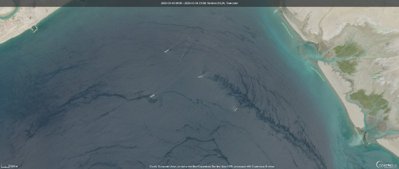

🔸۵ روز پس از آنکه در نزدیکی بندر شهر جاسک هدف حمله نیروهای آمریکایی قرار گرفتند، هنوز وضعیت دو نفتکش ایرانی بحرانی است.

🔹یکی از نفتکش‌های غول‌پیکر VLCC همچنان در آتش می‌سوزد و دود غلیظی از یکی از کشتی‌ها به هوا بلند شده و قابل مشاهده است.

🔸نفتکش دوم نیز در حال نشت حجم زیادی از نفت سنگین (fuel oil) به داخل آب است.

@mwarmonitor

## mwarmonitor — post 9087

  

🔴روز هشتم است که ایران هیچ نفت خامی در جزیره خارگ بارگیری نکرده است. ذخایر نفت در خشکی اکنون تقریباً به ظرفیت کامل رسیده‌اند. به‌احتمال زیاد یکی از خطوط لوله آسیب دیده است. ایران در حال تلاش برای یافتن نوعی راه‌حل جایگزین است. هیچ نفتکش VLCC اجازه ورود پیدا نکرده است به‌دلیل محاصره آمریکا، بنابراین ایران در گزینه‌های خود محدود شده است.

@mwarmonitor

## mwarmonitor — post 9085

  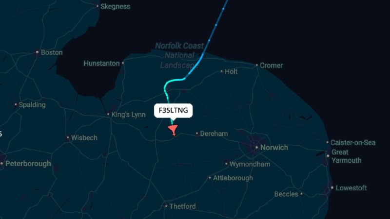

✈️🇺🇸نیروی هوایی آمریکا (USAF) 🚨 وضعیت اضطراری عمومی

⏱ساعت ۱۴:۳۹ – پرواز HITMAN 02 یک فروند Lockheed Martin F-35 Lightning II با علامت «LN» در حال بازگشت به پایگاه RAF Lakenheath است و به‌دلیل مشکل در سیستم فشار کابین (pressurisation) وضعیت اضطراری اعلام کرده است.

✈️این هواپیما کد اضطراری 7700 را روی ترانسپوندر (squawk 7700) ارسال کرده که به معنی اعلام وضعیت اضطراری عمومی در پرواز است.

🔸هواپیما با شماره بدنه 13-5067 به‌عنوان یک F-35A شناسایی شده است.

@mwarmonitor

## mwarmonitor — post 9084

  <a href="telegram/content/mwarmonitor_9084_1778772912.mp4" target="_blank">🎬 Download video</a>

🇺🇸سرمایه‌گذاری ۱.۵ تریلیون دلاری، یک پیش‌پرداخت نسلی برای دفاع ملی آمریکا است.

🔸این سرمایه‌گذاری تضمین می‌کند که ایالات متحده برای نسل‌های آینده، برتری قاطع نظامی و توان بازدارندگی بی‌رقیب خود را در برابر هر دشمنی حفظ کند.

@mwarmonitor

## mwarmonitor — post 9083

  

🇺🇸شهادت در مورد وضعیت فرماندهی مرکزی ایالات متحده (سنتکام) 🔸«من قویاً باور دارم که هر موفقیتی که به دست می‌آوریم با نیروهایمان آغاز می‌شود و با آن‌ها پایان می‌یابد. تنها در ۷ ماه گذشته، فرزندان دختر و پسر آمریکا که در سنتکام خدمت می‌کنند، نقش‌های کلیدی در…

## mwarmonitor — post 9082

  

🇺🇸دریادار برد کوپر، فرمانده فرماندهی مرکزی ایالات متحده (CENTCOM)، صبح امروز درباره وضعیت و آرایش عملیاتی سنتکام در کنگره شهادت خواهد داد. @mwarmonitor

## mwarmonitor — post 9081

  

🇺🇸کمک کنید تا در جریان درآمدی سپاه پاسداران انقلاب اسلامی (IRGC) اختلال ایجاد کنیم.

🔸برای ما درباره این افراد اطلاعات/نکته ارسال کنید؛ کسانی که این شرکت تولیدکننده پهپاد را مدیریت می‌کنند.

@mwarmonitor

## mwarmonitor — post 9080

  

🇺🇸یک ناو جنگی آبی - خاکی uss makin مستقر در سن‌دیگو در حال آماده‌سازی برای اعزام به خاورمیانه است، در حالی که ملوانان کالیفرنیایی برای اعزام آماده می‌شوند. نیویورک پست

@mwarmonitor

## mwarmonitor — post 9079

  

🇺🇸یک بالگرد سی‌هاوک (Sea Hawk) متعلق به اسکادران Helicopter Maritime Strike Squadron 50 بر روی عرشه پرواز ناوشکن USS Truxtun (DDG-103) فرود می‌آید؛ در حالی‌ که این شناور در حال عبور از دریای عرب است و از محاصره دریایی ایالات متحده علیه ایران پشتیبانی می‌کند.

🔸بر اساس آخرین آمار، نیروهای سنتکام تا امروز مسیر ۷۰ کشتی تجاری را تغییر داده و ۴ فروند شناور را برای اطمینان از رعایت مقررات از کار انداخته‌اند.

@mwarmonitor

## pm_afshaa — post 90746

  <a href="telegram/content/pm_afshaa_90746_1778772916.webm" target="_blank">🎬 Download video</a>

🔴عراقچی: برای مسائل مربوط به ایران راه حل نظامی وجود نداره و ما در مقابل تهدیدات محکم می‌ایستیم و سر فرود نمیاریم.

💧 Rainbet.com the #1 Non-KYC Crypto Casino & Sportsbook @rainbetcom

😁 @Pm_Afshaa

## pm_afshaa — post 90745

🎙️آیا درباره حمایت چین از ایران با رئیس جمهور چین صحبت کردید؟

ترامپ: ما در مورد این موضوع صحبت کردیم. او گفت که تجهیزات نظامی ارائه نخواهد کرد، این یک بیانیه بزرگه. اما در عین حال گفت که آنها مقدار زیادی نفت خودشون رو از ایران میخرن و دوست دارن این کار رو ادامه بدن.

💧 Rainbet.com the #1 Non-KYC Crypto Casino & Sportsbook @rainbetcom

😁 @Pm_Afshaa

## pm_afshaa — post 90744

  <a href="telegram/content/pm_afshaa_90744_1778772917.webm" target="_blank">🎬 Download video</a>

🔴برد کوپر، فرمانده سنتکام:
رژیم ایران از سال 1979 در حال گسترش وحشت در سراسر خاورمیانه است.

💧 Rainbet.com the #1 Non-KYC Crypto Casino & Sportsbook @rainbetcom

😁 @Pm_Afshaa

## pm_afshaa — post 90743

  <a href="telegram/content/pm_afshaa_90743_1778772917.webm" target="_blank">🎬 Download video</a>

🔴برد کوپر، فرمانده سنتکام:
توانمندی‌های موشکی، دریایی، پهپادی و صنعتی ایران 90 درصد تضعیف شده. او افزود که نیروی دریایی ایران تا یک نسل دیگر هم به سطحی که پیش از جنگ در اختیار داشت باز نخواهد گشت.

💧 Rainbet.com the #1 Non-KYC Crypto Casino & Sportsbook @rainbetcom

😁 @Pm_Afshaa

## pm_afshaa — post 90742

  <a href="telegram/content/pm_afshaa_90742_1778772918.webm" target="_blank">🎬 Download video</a>

🔴نخعی، عضو کمیسیون انرژی مجلس:
با کمبود بنزین مواجهیم و سناریوهای مختلفی درحال بررسیه.

💧 Rainbet.com the #1 Non-KYC Crypto Casino & Sportsbook @rainbetcom

😁 @Pm_Afshaa

## pm_afshaa — post 90741

  <a href="telegram/content/pm_afshaa_90741_1778772918.webm" target="_blank">🎬 Download video</a>

🔴یسرائیل کاتز، وزیر دفاع اسرائیل:
ماموریت ما در ایران کامل نشده؛ اگر اهداف‌مان تامین نشه، دوباره اقدام می‌کنیم.

💧 Rainbet.com the #1 Non-KYC Crypto Casino & Sportsbook @rainbetcom

😁 @Pm_Afshaa

## DEJradio — post 4630

  <a href="telegram/content/DEJradio_4630_1778772918.webm" target="_blank">🎬 Download video</a>

🔺📢 یک منبع آگاه:
حکومت برای تشییع جنازه خامنه‌ای هم‌زمان با مسابقات جام جهانی برنامه‌ریزی می‌کند

یک منبع آگاه به دژ گفت حکومت در حال برنامه‌ریزی برای تشییع جنازه علی خامنه‌ای همزمان با برگزاری مسابقات جام جهانی است.

نهادهای امنیتی و مقامات تصمیم‌گیر به این نتیجه رسیده‌اند که هم‌زمان با مسابقات فوتبال تهدیدات امنیتی از سوی آمریکا و اسرائیل کمتر خواهد بود.

شنیده شده مصلای تهران برای برگزاری این مراسم آماده می‌شود، اما قصد دارند او را در مشهد در جوار امام هشتم شیعیان دفن کنند.

#موشعلی #جام_جهانی
@DEJradio

## VahidOnline — post 75465

  

یسرائیل کاتز، وزیر دفاع اسرائیل در یک سخنرانی گفت که ماموریت ارتش این کشور درباره ایران کامل نشده و برای این احتمال آماده است که شاید دوباره ناچار به اقدام شود.
یسرائیل کاتز تاکید کرد: «اگر اهداف‌مان تامین نشود، دوباره اقدام خواهیم کرد.»

پیش از این نیز ایال زمیر، رییس ستاد کل ارتش اسرائیل، گفته بود که «نبرد به پایان نرسیده و ارتش برای ازسرگیری جنگ در صورت نیاز آماده است.»
@VahidOOnLine

📡 @VahidOnline

## VahidOnline — post 75464

  

اسکات بسنت، وزیر دارایی آمریکا، در گفت‌وگویی با شبکه سی‌ان‌بی‌سی در حاشیه سفر رئیس‌جمهور آمریکا، در یک مصاحبه از پیش ضبط‌شده گفت که معتقد است چین از نفوذش بر تهران برای بازگشایی تنگه هرمز استفاده خواهد کرد.

او گفت: «فکر می‌کنم آن‌ها (چینی‌ها) هر کاری از دستشان بربیاید انجام خواهند داد.»

آقای بسنت افزود: « بازگشایی تنگه هرمز بسیار به نفع چین است. فکر می‌کنم آن‌ها پشت پرده تلاش خواهند کرد، البته اگر اصلا کسی بتواند بر تصمیم‌های رهبری ایران تاثیر بگذارد.»

به اعتقاد وزیر دارایی آمریکا، چین به‌زودی سفارش بزرگی از هواپیماهای بوئینگ را اعلام خواهد کرد و افزود دو طرف در حال گفت‌وگو درباره بهبود روابط تجاری از جمله صادرات انرژی هستند.
@VahidHeadline

📡 @VahidOnline

## VahidOnline — post 75463

  

رسانه‌های ایران می‌گویند وزیر خارجه جمهوری اسلامی در نشست بریکس در دهلی‌نو، امارات متحده عربی را به «دخالت مستقیم» در عملیات نظامی علیه کشورش متهم کرد.
این تنش یک روز پس از آن رخ داد که امارات ادعای بنیامین نتانیاهو، نخست‌وزیر اسرائیل، مبنی بر سفر به این کشور حاشیه خلیج فارس در جریان جنگ ایران را رد کرد.

خبرگزاری مهر به نقل از عراقچی نوشت: «من به خاطر حفظ وحدت، در سخنرانی‌ام در بریکس نامی از امارات نبردم. اما حقیقت این است که امارات مستقیماً در تجاوز علیه کشور من دخیل بود. وقتی حملات آغاز شد، آن‌ها حتی آن را محکوم هم نکردند.»
رسانه‌های ایرانی مشخص نکردند که نماینده امارات چه اظهاراتی در این نشست مطرح کرده بود.

بر اساس این گزارش‌ها، عراقچی همچنین گفت که «نه پایگاه‌های آمریکا و نه اتحاد با اسرائیل برای امارات امنیت به همراه نیاورده و این کشور باید در سیاست خود نسبت به ایران تجدیدنظر کند».
عراقچی پیش‌ از این نیز گفته بود: «کسانی که با اسرائیل برای ایجاد تفرقه همکاری می‌کنند، پاسخگو خواهند شد.»

رسانه‌های ایرانی همچنین درباره اینکه آیا شرکت‌کنندگان نشست وزیران خارجه بریکس در هند خواهند توانست بیانیه نهایی مشترکی صادر کنند یا نه، ابراز تردید کرده‌اند؛ زیرا اختلافات میان ایران و امارات ادامه دارد.
در همین رابطه از کاظم غریب‌آبادی، معاون وزیر خارجه ایران، نقل شده که به دلیل حضور امارات در این نشست، «مشکلات و رایزنی‌هایی» وجود داشته است.
@VahidHeadline

📡 @VahidOnline

## VahidOnline — post 75462

  

یونهاپ، خبرگزاری دولتی کره جنوبی، روز چهارشنبه ۲۴ اردیبهشت به نقل از یکی از مقام‌های امنیتی این کشور گزارش کرد که بررسی‌های سئول نشان می‌دهد که به احتمال بسیار زیاد جمهوری اسلامی ایران مسئول حمله به کشتی باری این کشور در تنگه هرمز بوده است.

سفارت جمهوری اسلامی در سئول هفته گذشته هرگونه حمله جمهوری اسلامی به کشتی باری کره جنوبی در تنگه هرمز را رد کرده بود.
@VahidOOnLine

📡 @VahidOnline

## VahidOnline — post 75461

  

مرکز عملیات تجارت دریایی بریتانیا روز پنجشنبه ۲۴ اردیبهشت اعلام کرد پس از وقوع حادثه‌ای دریایی در شمال شرقی امارات متحده عربی، «افراد غیرمجاز» کنترل یک کشتی در لنگرگاه را به دست گرفته‌اند و این کشتی اکنون به سوی آب‌های سرزمینی ایران در حرکت است.

این نهاد گفت گزارشی دربارهٔ حادثه دریایی در ۳۸ مایل دریایی (حدود ۷۰ کیلومتری) شمال شرقی بندر فجیره امارات متحده عربی دریافت کرده و پس از آن، کشتی به تصرف درآمده و مسیر آن به سوی آب‌های سرزمینی ایران تغییر داده شده است.
@VahidHeadline

📡 @VahidOnline

## VahidOnline — post 75460

  

کاخ سفید اعلام کرد که دونالد ترامپ و شی جین‌پینگ، در پکن توافق کردند که ایران هرگز نباید به سلاح هسته‌ای دست پیدا کند و تنگه هرمز باید باز بماند.

آمریکا این گفت‌وگوی دو ساعته را «خوب» توصیف کرده و می‌گوید که دو رهبر در حال تلاش برای تقویت همکاری‌های اقتصادی هستند.

در بیانیه کاخ سفید، رئیس‌جمهور شی همچنین «علاقه‌مندی خود را» برای خرید بیشتر نفت آمریکا ابراز کرد تا وابستگی چین به تنگه هرمز را کاهش دهد.

همچنین گفته شد که مدیران برخی از بزرگ‌ترین شرکت‌های آمریکایی هم در بخشی از این دیدار حضور داشتند.

آن‌ها همچنین درباره اهمیت پایان دادن به ورود مواد اولیه برای ساخت ماده مخدر فنتانیل به آمریکا هم صحبت کردند.
@VahidHeadline

📡 @VahidOnline

## VahidOnline — post 75459

  

مارکو روبیو، وزیر خارجه آمریکا، می‌گوید به نفع چین است که حکومت ایران را برای باز کردن تنگه هرمز تحت فشار بگذارد.

براساس گزارشی که فاکس‌نیوز از اظهارات روبیو در راه سفر به چین پخش کرد، او گفت: «ما این استدلال را با چینی‌ها مطرح کرده‌ایم و امیدوارم قانع‌کننده باشد. آن‌ها اواخر این هفته در سازمان ملل فرصت خواهند داشت دربارهٔ این موضوع اقدامی انجام دهند؛ زمانی که قطعنامه‌ای برای محکوم کردن اقدامات ایران در ارتباط با تنگه‌ها مطرح می‌شود.»
روبیو گفت حکومت ایران در حال ایجاد ظرفیتی بوده که بتواند با «انبوهی از موشک‌ها و پهپادها» سامانه‌های دفاعی کشورهای منطقه را از کار بیندازد و هرگونه حملهٔ احتمالی به برنامه هسته‌ای خود را با تهدید به وارد کردن خسارت گسترده به کشورهای خلیج فارس پاسخ دهد.
مارکو روبیو همچنین با اشاره به بحران تنگه هرمز، گفت این وضعیت بیش از هر کشور دیگری به زیان چین است و پکن باید ایران را برای عقب‌نشینی از اقداماتش تحت فشار بگذارد.

@VahidHeadline

📡 @VahidOnline

## VahidOnline — post 75457

نت‌بلاکس، نهاد بین‌المللی پایش اینترنت، نوشت که پس از بیش از ۱۸۰۰ ساعت قطعی اینترنت در ایران، نظامی طبقاتی توسط جمهوری اسلامی برای دسترسی ایجاد شده است.

😋
💩 همزمان مهدی طباطبایی، معاون ارتباطات و اطلاع‌رسانی دفتر مسعود پزشکیان، ادعا کرده است که اگر همه‌پرسی برگزار شود، مردم در شرایط جنگی، امنیت را به سهولت دسترسی به اینترنت ترجیح خواهند داد.
@VahidHeadline
روزنامه اعتماد گزارش داد که نخستین نشست «ستاد ویژه ساماندهی و راهبری فضای مجازی» هفته آینده به ریاست محمدرضا عارف برگزار خواهد شد.
هدف اصلی این ستاد، فراهم کردن زمینه‌های لازم برای رفع محدودیت‌های فضای مجازی است تا حداکثر تا میانه خردادماه، امکان اتصال مجدد شهروندان به اینترنت بین‌المللی فراهم شود.
عارف در این مسیر قصد دارد از ظرفیت نخبگان و اساتید برجسته ارتباطات نظیر هادی خانیکی و علی ربیعی [
🤨] استفاده کرده و میان نهادهای حاکمیتی برای بازگشت سرویس‌دهی هم‌افزایی ایجاد کند.
@VahidOOnLine

📡 @VahidOnline

## VahidOnline — post 75456

  

مهدی شفاخواه، فعال حوزه آموزش و حمایت از کودکان کار و ساکنان مناطق محروم، توسط نیروهای وزارت اطلاعات جمهوری اسلامی بازداشت شد.

این فعال حوزه کودکان عصر سه‌شنبه ۲۲ اردیبهشت ۱۴۰۵، ماموران وزارت اطلاعات بازداشت و به مکان نامعلومی منتقل شد. همچنین تمامی وسایل الکترونیکی و ارتباطی او و همسرش نیز توقیف شده است.
@VahidHeadline
هنوز از دلایل بازداشت، اتهامات انتسابی و محل دقیق نگهداری شفاخواه هیچ اطلاع دقیقی در دسترس نیست و پیگیری‌های خانواده او برای کسب اطلاع از وضعیت سلامت او بی‌نتیجه مانده است.

مهدی شفاخواه طی سال‌های اخیر به صورت داوطلبانه در مناطق محروم و حاشیه‌نشین فعالیت داشته و از طریق آموزش ورزش و مهارت‌های اجتماعی به کودکان کار و نوجوانان آسیب‌پذیر، در راستای کاهش آسیب‌های اجتماعی از جمله اعتیاد و بزهکاری تلاش می‌کرد.

او برادر رضا شفاخواه، وکیل دادگستری و فعال حقوق کودکان و زندانیان سیاسی، است.
@VahidHeadline

📡 @VahidOnline

## IranIntlTV — post 337190

  <a href="telegram/content/IranIntlTV_337190_1778772923.mp4" target="_blank">🎬 Download video</a>

در حالی که تنها ۲۸ روز تا آغاز جام جهانی فوتبال باقی مانده، سرنوشت صدور ویزای آمریکا برای اعضای تیم فوتبال ایران همچنان نامشخص است. رییس فدراسیون فوتبال اعلام کرده هنوز هیچ ویزایی برای اعضای این تیم صادر نشده است.
گفت‌وگو با محمد تقوی، بازیکن پیشین تیم ملی و باشگاه استقلال
@iranintltv

## IranIntlTV — post 337189

  

برد کوپر، فرمانده ستاد فرماندهی مرکزی آمریکا (سنتکام)، در جلسه کمیته نیروهای مسلح سنای آمریکا گفت در ۳۰ ماه منتهی به عملیات «خشم حماسی»، گروه‌های مورد حمایت جمهوری اسلامی بیش از ۳۵۰ بار به نیروها و دیپلمات‌های آمریکایی حمله کرده‌اند؛ به‌طور میانگین بیش از یک حمله در هر سه روز.
او افزود این حملات به کشته شدن چهار نظامی آمریکایی و زخمی شدن نزدیک به ۲۰۰ نفر انجامیده است.

فرمانده سنتکام همچنین گفت امروز حماس، حزب‌الله و حوثی‌ها از پشتیبانی و تامین تسلیحاتی جمهوری اسلامی محروم شده‌اند.
https://iranintl.com/202605144789

## IranIntlTV — post 337188

  

برد کوپر، فرمانده ستاد فرماندهی مرکزی آمریکا (سنتکام)، در جلسه کمیته نیروهای مسلح سنای آمریکا گفت در ۳۰ ماه منتهی به عملیات «خشم حماسی»، گروه‌های مورد حمایت جمهوری اسلامی بیش از ۳۵۰ بار به نیروها و دیپلمات‌های آمریکایی حمله کرده‌اند؛ به‌طور میانگین بیش از یک حمله در هر سه روز.
او افزود این حملات به کشته شدن چهار نظامی آمریکایی و زخمی شدن نزدیک به ۲۰۰ نفر انجامیده است.

فرمانده سنتکام همچنین گفت امروز حماس، حزب‌الله و حوثی‌ها از پشتیبانی و تامین تسلیحاتی جمهوری اسلامی محروم شده‌اند.
https://iranintl.com/202605144789

## IranIntlTV — post 337187

  <a href="telegram/content/IranIntlTV_337187_1778772927.mp4" target="_blank">🎬 Download video</a>

جمهوری اسلامی از نخستین روزهای قدرت، اعدام را به ابزار حکم‌رانی و کنترل سیاسی تبدیل کرد؛ زبانی خشن که از پشت‌بام مدرسه رفاه آغاز شد و تا زندان‌های امروز ادامه دارد.

آرین ریسباف گزارش می‌دهد.
@iranintltv

## IranIntlTV — post 337186

  <a href="https://t.me/IranintlTV/337186" target="_blank">📎 Download file</a>

🎧نسخه صوتی اخبار نیم‌روزی | پنجشنبه ۲۴ اردیبهشت
@iranintlTV

## IranIntlTV — post 337185

  <a href="telegram/content/IranIntlTV_337185_1778772928.mp4" target="_blank">🎬 Download video</a>

وزیر دفاع اسرائیل اعلام کرد ماموریت ارتش این کشور درباره جمهوری اسلامی هنوز کامل نشده است. پیش‌تر رییس ستاد کل ارتش اسرائیل نیز گفته بود نبرد با جمهوری اسلامی پایان نیافته و ارتش اسرائیل در صورت نیاز برای ازسرگیری جنگ آمادگی کامل دارد.
بابک اسحاقی، خبرنگار ایران‌اینترنشنال، گزارش می‌دهد
@iranintltv

## IranIntlTV — post 337184

  <a href="telegram/content/IranIntlTV_337184_1778772930.mp4" target="_blank">🎬 Download video</a>

کاخ سفید اعلام کرد در جریان سفر دونالد ترامپ به پکن، روسای جمهور آمریکا و چین بر لزوم باز ماندن تنگه هرمز به‌عنوان یک آبراه بین‌المللی تاکید کرده و گفته‌اند جریان انتقال انرژی از این مسیر باید ادامه داشته باشد.
گفت‌وگو با امید معماریان، تحلیل‌گر سیاسی
@iranintltv

## IranIntlTV — post 337183

  

🔻علی تاجرنیا، رییس هیات مدیره باشگاه استقلال، درباره اختلاف نظر باشگاه‌ها در برگزاری ادامه لیگ برتر گفت: «استقلال فعلا صدرنشین لیگ برتر است و قهرمانی تیم ما به نظر فدراسیون فوتبال بستگی دارد. بعد از اعلام تصمیم ادامه رقابت‌ها پیش از جام جهانی، تابع نظرات بودیم و نخستین تیمی بودیم که خود را برای مسابقات آماده کردیم.»

🔹او ادامه داد: «وقتی بقیه تیم‌ها درخواست کردند لیگ پس از جام جهانی برگزار شود، با آنها همراهی کردیم. اگر بازی‌ها به هر دلیلی ادامه نداشته باشد، استقلال به‌عنوان صدرنشین در صدر جدول قرار دارد.»

🔹رییس هیات مدیره باشگاه استقلال درباره معرفی نمایندگان ایران به کنفدراسیون فوتبال آسیا گفت: «ما تابع مقررات هستیم. فدراسیون درخواست کرده بود اسامی با تاخیر اعلام شود که ای‌اف‌سی نپذیرفت. خیلی‌ها تلاش می‌کنند به مراجع بالاتر مراجعه کنند، اما به نظرم باید از نهادهای بین‌المللی و آسیایی تمکین کنیم. انتظار داریم این اتفاق زودتر رخ دهد، چون در برنامه‌ریزی‌ها موثر است.»

@iranintltvsport

## IranIntlTV — post 337182

  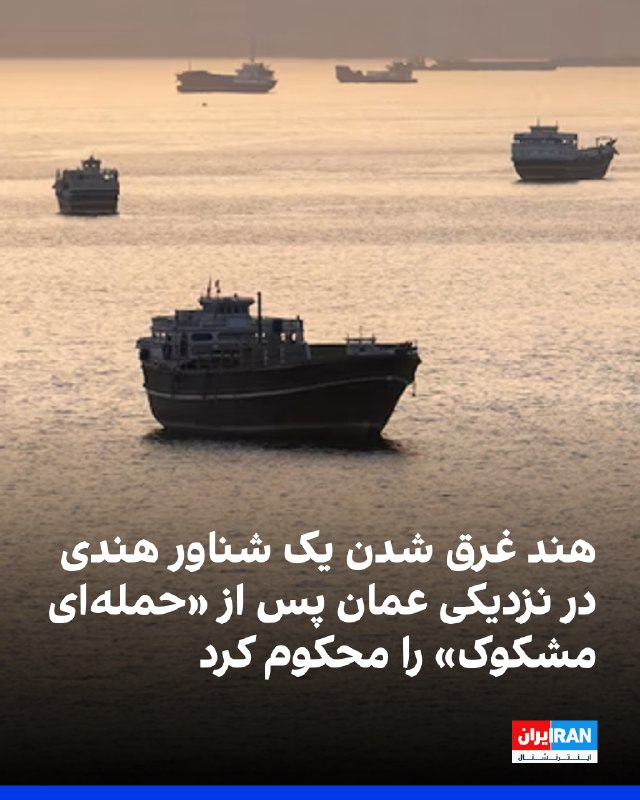

وزارت خارجه هند اعلام کرد یک کشتی باری با پرچم این کشور پس از حمله‌ مشکوک پهپادی یا موشکی در روز چهارشنبه، در آب‌های عمان دچار آتش‌سوزی و غرق شده است.
طبق گزارش‌ها هر ۱۴ خدمه این شناور نجات یافتند.
دهلی‌نو هدف قرار دادن کشتیرانی تجاری و ملوانان غیرنظامی را غیرقابل قبول دانست و آن را محکوم کرد.
شرکت امنیت دریایی وانگارد اعلام کرد این شناور هندی پس از انفجاری مشکوک که احتمالا ناشی از حمله پهپادی یا موشکی بوده، در نزدیکی سواحل عمان غرق شده است.
https://iranintl.com/202605145500

## IranIntlTV — post 337181

سرخط خبرهای پنجشنبه ۲۴ اردیبهشت
@iranintltv

## IranIntlTV — post 337180

  

چارلز سوم، پادشاه بریتانیا، روز پنج‌شنبه از محله‌ یهودی‌نشین گولدرز گرین در لندن بازدید کرد.
ماه گذشته در این محله یک نفر با چاقو دو مرد یهودی را زخمی کرد.
طبق بیانیه کاخ باکینگهام، هدف این بازدید «تاکید دوباره بر حمایت قاطع او» از جامعه یهودی، در شرایط افزایش نگرانی‌های امنیتی پس از این حمله بوده است.
https://iranintl.com/202605145625

## IranIntlTV — post 337179

  <a href="telegram/content/IranIntlTV_337179_1778772933.mp4" target="_blank">🎬 Download video</a>

در حالی که نهادهای نظامی آمریکا از ادامه محاصره دریایی تنگه هرمز خبر می‌دهند، صداوسیمای جمهوری اسلامی به نقل از نیروی دریایی سپاه اعلام کرد در شبانه‌روز گذشته ۳۰ فروند کشتی با مجوز عبور کرده‌اند.
گفت‌وگو با علی‌حسین قاضی‌زاده، عضو تحریریه ایران‌اینترنشنال
@iranintltv

## IranIntlTV — post 337178

  

محمدصالح جوکار، رییس کمیسیون شوراهای مجلس، گفت جمهوری اسلامی از خطوط قرمز خود، به‌ویژه در حوزه دانش هسته‌ای و مواد غنی‌سازی‌شده، عقب‌نشینی نمی‌کند.
نماینده یزد در مجلس، گفت هدف توییت‌های مکرر ترامپ ایجاد شائبه تفرقه میان مسئولان جمهوری اسلامی و نبود تصمیم‌گیر واحد در ایران است. او افزود حتی اگر مذاکرات به نتیجه برسد هم نمی‌توان به آمریکا اعتماد کرد زیرا عملیات تخریبی و ترور همواره در دستور کار آن‌هاست.
https://iranintl.com/202605140299

## IranIntlTV — post 337177

🔻علی بلالی، مشاور عالی فرمانده نیروی هوافضای سپاه در صداوسیمای جمهوری اسلامی درباره حسن طهرانی‌مقدم گفت: «او هوادار استقلال بود و تیم صباباطری را قهرمانی جام حذفی کرد.»

🔹صبا باطری در سال ۱۳۸۴ در فینال جام حذفی با پیروزی برابر ابومسلم به مقام قهرمانی رسید.

🔹طهرانی مقدم از پایه‌گذاران صنعت موشکی در سپاه پاسداران بود که در سال ۱۳۹۰ در پی حادثه انفجار در پادگان مدرس تهران کشته شد.

@iranintltvsport

## IranIntlTV — post 337176

  

مارکو روبیو، وزیر خارجه آمریکا، در گفت‌وگو با ان‌بی‌سی نیوز گفت دونالد ترامپ در گفت‌وگو با شی جین‌پینگ موضوع ایران را مطرح کرده، اما «هیچ درخواستی از او نداشته است».

روبیو تأکید کرد آمریکا از چین درخواست کمک نکرده و نیازی هم به کمک آن ندارد.

او افزود رییس‌جمهور به‌صراحت پیام داده اگر جمهوری اسلامی تصور می‌کند می‌تواند با سوءاستفاده از فضای سیاست داخلی آمریکا، او را به پذیرش توافقی نامطلوب وادار کند، سخت در اشتباه است.
https://iranintl.com/202605147723

## IranIntlTV — post 337175

  

قاسم روانبخش، عضو هیات رییسه کمیسیون امور داخلی کشور و شوراها در مجلس، گفت نقشه راه جمهوری اسلامی کاملا روشن است و دستگاه دیپلماسی موظف است دقیقا بر مبنای ۱۰ شرط شورای عالی امنیت ملی که مورد تایید مجتبی خامنه‌ای است، حرکت کند.
قاسم روانبخش گفت عقب‌نشینی از ۱۰ شرط شورای عالی امنیت ملی یا افزایش سقف مطالبات طرف مقابل، باعث جری‌تر شدن دشمن و تشدید زیاده‌خواهی‌های او خواهد شد و افزود: «وظیفه مسئولان است که به طرف مقابل بفهمانند اگر مسیر عقلانیت را انتخاب نکند، جمهوری اسلامی ابزارهای دیگری در اختیار دارد»
قاسم روانبخش گفت: «ترامپ زبان دیپلماسی را نمی‌فهمد و تنها زبانی که به خوبی درک می‌کند، زبان موشک و قدرت نظامی است» او افزود ترامپ در شرایطی راهی پکن شد که ابهت ناوها و ناوشکن‌های آمریکا با موشک‌های جمهوری اسلامی در هم شکست.
https://iranintl.com/202605147234

## IranIntlTV — post 337174

🗣روایت شما از بحران اقتصادی و زندگی در آتش‌بس- پنج‌شنبه ۲۴ اردیبهشت:

🔹تعجب می‌کنم برخی می‌گن چرا تامین اجتماعی فلان کرد، چرا اداره کار بهمان کرد. جمهوری اسلامی هیچ‌وقت معیشت مردم براش مهم نبود و حتی خیریه‌ها و موسسه‌های مردم‌نهاد و مستقل رو از بین برد تا همه وابسته به خودش باشند و همه چیز رو کنترل بکنند.

🔹واقعا نگران بچه‌های مدرسه‌ای مقطع هفتم تا دوازدهم هستیم. کلاس‌ها اصلا کیفیت نداشته و شرایط روانی‌شون هم اصلا خوب نیست.

🔹چند شیفت کار سنگین می‌کنیم ولی بی‌پولیم.

🔹از اندیشه: قیمت‌ها سر به فلک کشیده، نون تافتون که ۵ هزار تومان بود، ۱۰ هزار تومان شده. داروها نیز بسیار کمیاب شده‌اند.

🔹حکومت می‌گه جنس هست و کمبودی در کار نیست، مثل اینه که من برم پشت ویترین طلافروشی و نتونم بخرم.

🔹قدرت اول منطقه حتی نمی‌تونه بسته‌های پستی رو به جزیره خارک برسونه و جرات ارسال مرسولات پستی به خارک رو نداره.

## IranIntlTV — post 337173

  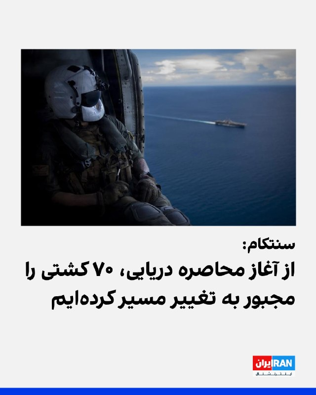

سنتکام اعلام کرد نیروهای آمریکایی در عملیات محاصره بنادر ایران، تاکنون ۷۰ کشتی تجاری را مجبور به تغییر مسیر کرده و ۴ کشتی را از کار انداخته‌اند.
پیش‌تر سنتکام، با انتشار تصویری از گشت‌زنی یک جنگنده پنهان‌کار اف-۳۵-ای نیروی هوایی بر فراز آب‌های منطقه‌ای نزدیک تنگه هرمز خبر داد.
https://iranintl.com/202605143032

## IranIntlTV — post 337172

  <a href="telegram/content/IranIntlTV_337172_1778772937.mp4" target="_blank">🎬 Download video</a>

گزارش‌های رسیده به ایران‌اینترنشنال از شهرهای مختلف ایران، حاکی از کمبود بنزین، صف‌های طولانی و گسترش بازار سیاه سوخت است. شهروندان در استان‌های مختلف می‌گویند عرضه بنزین محدود شده و در برخی جایگاه‌ها سوخت آزاد تنها به مقدار کم ارائه می‌شود.
گفت‌وگو با عطا حسینیان، روزنامه‌نگار اقتصادی و حوزه انرژی
@iranintltv

## IranIntlTV — post 337170

  <a href="telegram/content/IranIntlTV_337170_1778772938.mp4" target="_blank">🎬 Download video</a>

اسکات بسنت، وزیر خزانه‌داری آمریکا، در گفت‌وگو با سی‌ان‌بی‌سی گفت طی سه روز گذشته بارگیری در تاسیسات نفتی ایران انجام نشده است. او همچنین تاکید کرد جمهوری اسلامی توان پرداخت دستمزد نظامیان و هزینه‌های تجهیزات نظامی را ندارد.
گفت‌وگو با دالغا خاتین‌‌اوغلو، کارشناس انرژی
@iranintltv

## ManotoTV — post 105456

  <a href="telegram/content/ManotoTV_105456_1778772940.mp4" target="_blank">🎬 Download video</a>

‌
دونالد ترامپ، رئیس‌جمهوری آمریکا، در گفت‌و‌گو با شان هنیتی، خبرنگار و مجری فاکس‌نیوز گفت شی جین‌پینگ، رئیس‌جمهوری چین، خواهان دستیابی به توافق و باز ماندن تنگه هرمز است.

ترامپ گفت: «رئیس‌جمهوری شی دوست دارد توافقی حاصل شود. او گفت اگر بتواند کمکی بکند، مایل است کمک کند.»

رئیس‌جمهوری آمریکا همچنین با اشاره به خرید نفت ایران از سوی چین افزود: «هر کسی که این مقدار نفت می‌خرد، بدیهی است نوعی رابطه دارد.»

ترامپ در ادامه گفت شی جین‌پینگ مایل است تنگه هرمز باز بماند.

## ManotoTV — post 105455

  <a href="telegram/content/ManotoTV_105455_1778772941.mp4" target="_blank">🎬 Download video</a>

مارکو روبیو، وزیر خارجه آمریکا، گفت دونالد ترامپ موضوع ایران را در گفت‌وگو با مقام‌های چین مطرح کرده و این موضوع «اهمیت زیادی» داشته است.

روبیو گفت طرف چینی اعلام کرده با «نظامی‌سازی تنگه هرمز» و همچنین ایجاد سیستم دریافت عوارض از کشتی‌ها در این آبراه مخالف است.

وزیر خارجه آمریکا افزود: «این موضع ما هم هست.»

## ManotoTV — post 105454

  <a href="telegram/content/ManotoTV_105454_1778772941.mp4" target="_blank">🎬 Download video</a>

وزیر نیروی جمهوری‌اسلامی نسبت به وضعیت منابع آب در تهران هشدار داده و گفته شرایط آبی پایتخت چندان مطلوب نیست.
عباس علی‌آبادی اعلام کرده توزیع نامتوازن بارش‌ها باعث شده ۱۰ استان کشور با جمعیتی بیش از ۳۵ میلیون نفر همچنان در وضعیت کمتر از نرمال قرار داشته باشند.
او با اشاره به اینکه میزان بارش‌ها نسبت به میانگین بلندمدت حدود ۴ درصد و نسبت به سال گذشته ۶۶ درصد افزایش داشته، تأکید کرده این آمار به معنی خروج از بحران نیست.
به گفته او، شش سال خشکسالی پیاپی و کاهش ذخایر آب، به‌ویژه در منابع زیرزمینی، باعث شده کسری مخازن آب سطحی و زیرزمینی همچنان یکی از چالش‌های جدی کشور باقی بماند.

## ManotoTV — post 105453

  <a href="telegram/content/ManotoTV_105453_1778772942.mp4" target="_blank">🎬 Download video</a>

مقامات کره جنوبی اعلام کرده‌اند که به نظر می‌رسد بعید است گروهی غیر از جمهوری‌اسلامی در حمله به یک کشتی باری کره‌ای در نزدیکی تنگه هرمز نقش داشته باشد.
این حمله در تاریخ ۴ مه به کشتی متعلق به شرکت HMM کره جنوبی انجام شد و باعث آتش‌سوزی و آسیب به بخش عقبی آن شد. کره جنوبی در حال بررسی اطلاعاتی است که آمریکا درباره این حادثه در اختیارش قرار داده است.
سئول همچنین تیم‌های کارشناسی را به دبی فرستاده تا خسارت وارد شده به کشتی را بررسی و تحقیقات فنی انجام دهند.
در حالی که جمهوری‌اسلامی هرگونه دخالت در این حمله را رد کرده، مقامات کره جنوبی می‌گویند نتیجه‌گیری نهایی پس از پایان تحقیقات اعلام خواهد شد، اما در صورت اثبات نقش تهران، اقدامات لازم انجام می‌شود.
گزارش‌ها می‌گویند آمریکا نیز بلافاصله پس از حادثه، جمهوری‌اسلامی را به دست داشتن در این حمله متهم کرده و خواستار همکاری کره جنوبی در تأمین امنیت کشتیرانی در تنگه هرمز شده بود.

## ManotoTV — post 105452

  <a href="telegram/content/ManotoTV_105452_1778772942.mp4" target="_blank">🎬 Download video</a>

همزمان با سفر ترامپ به چین، آکسیوس در گزارشی به اختلاف نظرهایی در تیم ترامپ در خصوص ایران پرداخته؛ برخی معتقدند جمهوری‌اسلامی از زمان به نفع خود استفاده می‌کند و منتظر تأثیر فشارهای سیاسی در آمریکا است. هم‌زمان افزایش قیمت نفت و نگرانی از تورم، کار دولت را برای مدیریت افکار عمومی سخت‌تر کرده است.
گزارش‌ها نشان می‌دهد مذاکرات اخیر با تهران به بن‌بست رسیده و گزینه‌های نظامی دوباره روی میز قرار گرفته‌اند؛ از عملیات دریایی در تنگه هرمز گرفته تا حملات به زیرساخت‌های ایران.
در عین حال، برخی مقامات آمریکایی می‌گویند فشار اقتصادی فعلی شاید بدون اقدام نظامی هم ایران را تحت فشار قرار دهد، هرچند ساختار سیاسی این کشور کمتر تحت تأثیر نارضایتی عمومی قرار می‌گیرد.
در مجموع، ترامپ تأکید دارد که جلوگیری از دسترسی جمهوری‌اسلامی به سلاح هسته‌ای اولویت اصلی اوست، حتی اگر پیامدهای اقتصادی و سیاسی داخلی به دنبال داشته باشد؛ موضوعی که حالا به دست دموکرات‌ها یک ابزار تبلیغاتی آماده داده است.

## ManotoTV — post 105451

  <a href="telegram/content/ManotoTV_105451_1778772943.mp4" target="_blank">🎬 Download video</a>

«جمهوری اسلامی قصد جان فاطمه سپهری را کرده»

## ManotoTV — post 105450

  <a href="telegram/content/ManotoTV_105450_1778772944.mp4" target="_blank">🎬 Download video</a>

قیمت چیپس و پفک در بازار طی یک سال گذشته جهش چشمگیری داشته است.
بهای چیپس‌های ۶۰ گرمی که سال گذشته حدود ۲۵ هزار تومان بود، حالا به ۶۰ تا ۶۵ هزار تومان رسیده؛ افزایشی حدود ۱۶۰ درصدی.
قیمت چیپس‌های بزرگ‌تر نیز برای بسیاری از خریداران شوکه‌کننده شده است. هر بسته چیپس ۱۳۸ گرمی بسته به برند، بین ۱۳۰ تا ۱۴۰ هزار تومان قیمت دارد و چیپس‌های ۲۴۵ گرمی به حدود ۲۵۰ هزار تومان رسیده‌اند. برخی بسته‌های بزرگ‌تر نیز بین ۳۰۰ تا ۴۰۰ هزار تومان فروخته می‌شوند.
افزایش قیمت در بازار پفک و اسنک هم ادامه دارد. قیمت پفک ۱۱۰ گرمی از حدود ۴۵ هزار تومان به ۱۱۵ هزار تومان رسیده و اسنک‌های پنیری و طلایی حتی گران‌تر هستند. هر بسته اسنک طلایی اکنون حدود ۱۵۰ هزار تومان قیمت دارد و کرانچی ۱۰۰ گرمی نیز به حدود ۸۰ هزار تومان رسیده است.

## ManotoTV — post 105449

  <a href="telegram/content/ManotoTV_105449_1778772945.mp4" target="_blank">🎬 Download video</a>

«من صدای فاطمه سپهری هستم»

## ManotoTV — post 105448

  <a href="telegram/content/ManotoTV_105448_1778772946.mp4" target="_blank">🎬 Download video</a>

الجزیره گزارش داد نمایندگان لبنان و اسرائیل برای دور تازه‌ای از گفت‌وگوها به ساختمان وزارت خارجه آمریکا در واشنگتن رسیده‌اند.
این مذاکرات مستقیم روزهای پنج‌شنبه و جمعه برگزار می‌شود و مقام‌های دیپلماتیک لبنان، اسرائیل و همچنین مقام‌های آمریکایی در آن حضور خواهند داشت.

## ManotoTV — post 105447

  <a href="telegram/content/ManotoTV_105447_1778772946.mp4" target="_blank">🎬 Download video</a>

فیفا در یک پست اینستاگرامی اعلام کرد که شکیرا، مدونا و سوپراستارهای کی‌پاپ گروه بی‌تی‌اس اجرای نخستین نمایش بین دو نیمه فینال جام جهانی را بر عهده خواهند داشت.
فینال جام جهانی قرار است ۱۹ ژوئیه در ورزشگاه مت‌لایف در نیوجرسی برگزار شود و انتظار می‌رود علاوه بر تماشاگران حاضر در ورزشگاه، میلیون‌ها بیننده در سراسر جهان آن را تماشا کنند.
جام جهانی ۲۰۲۶ از ۱۱ ژوئن در مکزیکوسیتی آغاز می‌شود و مسابقات آن در شهرهای مختلفی در آمریکا، کانادا و مکزیک برگزار خواهد شد.

## ManotoTV — post 105446

  <a href="telegram/content/ManotoTV_105446_1778772946.mp4" target="_blank">🎬 Download video</a>

خبرگزاری حکومتی فارس وابسته به سپاه پاسداران از قول یک منبع آگاه اعلام کرد جمهوری اسلامی با عبور تعدادی از کشتی‌های چینی از تنگه هرمز، در چارچوب «پروتکل مدیریت ایرانی تنگه»، موافقت کرده است.
به گفته این منبع، پس از رایزنی‌های وزیر خارجه چین و سفیر پکن در تهران، دو کشور درباره تسهیل عبور برخی کشتی‌های چینی به توافق رسیدند و این روند از شامگاه گذشته آغاز شده است.
بر اساس این گزارش، عبور این کشتی‌ها پس از هماهنگی با مقام‌های جمهوری‌اسلامی و پذیرش ضوابط تعیین‌شده از سوی تهران انجام می‌شود.

## FarsiVOA — post 217732

  <a href="telegram/content/FarsiVOA_217732_1778772947.mp4" target="_blank">🎬 Download video</a>

کاوه آهنگری، عضو حزب دموکرات کردستان در میدان: به عنوان شاهد عینی در اقلیم کردستان بودم و هیچ گونه سلاح آمریکایی در کمپ‌های حزب دموکرات و کوموله ندیدم

## FarsiVOA — post 217731

آیا احزاب کُرد آماده پاسخگویی درباره منابع سلاح و تجهیزات خود هستند؟ فریبا محمدی، معاون دبیرکل حزب کومله زحمتکشان کردستان می‌گوید انتظار شفاف‌سازی از احزابی که زیر حمله جمهوری اسلامی‌اند منصفانه نیست

## FarsiVOA — post 217730

🔺وزیر خزانه‌داری آمریکا: ما رژیم «شریر» ایران را زیر فشار اقتصادی قرار داده‌ایم

▪️وزیر خزانه‌داری آمریکا می‌گوید در سه روز گذشته هیچ بارگیری از ذخایر نفت در جزیره خارک ایران انجام نشده است و هیچ نفتی وارد یا خارج نشده است.

⬇️ بیشتر بخوانید:

https://ir.voanews.com/a/iran-us-china-bessent-treasury-oil-kharg-island-weapon/8149951.html/?nocach=1

## FarsiVOA — post 217729

🔺واکنش هند به حمله‌ منجر به غرق شدن کشتی این کشور در سواحل عمان: «غیرقابل قبول» است

▪️هند روز پنجشنبه ۲۴ اردیبهشت حمله‌ای را که به غرق شدن یک کشتی تحت پرچم آن کشور در آب‌های عمان منجر شد «غیرقابل قبول» خواند و اعلام کرد که در بحبوحه جنگ آمریکا و اسرائیل با رژیم ایران، باید از هدف گرفتن کشتی‌های تجاری جلوگیری شود.

⬇️ بیشتر بخوانید:

https://ir.voanews.com/a/reuters-indian-flagged-ship-sank-off-the-coast-of-oman/8149952.html/?nocach=1

## FarsiVOA — post 217728

  

⚡️شی جین‌پینگ، رئیس‌جمهور چین، در سخنرانی آغازین خود در ضیافت رسمی به افتخار دونالد ترامپ رئیس‌جمهور آمریکا، روابط دو کشور را مهم‌ترین رابطه دوجانبه جهان توصیف کرد و گفت که دو طرف باید «هرگز آن را خراب نکنند.»

او گفت‌وگوهای روز پنجشنبه خود با ترامپ درباره روابط چین و آمریکا و تحولات بین‌المللی و منطقه‌ای را «گفت‌وگوهای عمیق» توصیف کرد و افزود: «هر دوی ما معتقدیم که روابط چین و آمریکا مهم‌ترین رابطه دوجانبه در جهان است. ما باید آن را به‌درستی پیش ببریم و هرگز آن را خراب نکنیم.»

رییس‌جمهور چین ادامه داد: «هم چین و هم ایالات متحده از همکاری سود می‌برند و از تقابل زیان می‌بینند. دو کشور ما باید شریک یکدیگر باشند نه رقیب.»

او همچنین گفت: «رئیس‌جمهور ترامپ و من همچنین توافق کردیم که یک رابطه سازنده چین و آمریکا با ثبات راهبردی ایجاد کنیم تا توسعه باثبات، سالم و پایدار روابط چین و آمریکا را تقویت کرده و صلح، رفاه و پیشرفت بیشتری برای جهان به ارمغان آوریم.»

## FarsiVOA — post 217720

📸 گالری عکس | مراسم استقبال رسمی از پرزیدنت ترامپ در چین

مراسم استقبال از دونالد ترامپ، رئیس جمهوری آمریکا، با حضور شی جین‌پینگ، رئیس جمهوری چین، در سفر رسمی پرزیدنت ترامپ به پکن

## FarsiVOA — post 217719

زیردریایی هسته‌ای آلاسکا؛ پیام واشنگتن
آشکارسازی کم‌سابقه موقعیت زیردریایی هسته‌ای آمریکا در جبل‌الطارق؛ هشداری راهبردی به جمهوری اسلامی در اوج تنش‌های نظامی و بن‌بست کامل مذاکرات

## DW_Farsi — post 124705

  

🔶 هند حمله به کشتی خود در نزدیکی عمان را "غیرقابل" قبول دانست
 
هند اعلام کرد یک کشتی با پرچم این کشور روز چهارشنبه ۲۳ اردیبهشت (۱۳ مه) در نزدیکی سواحل عمان هدف حمله قرار گرفته است، اما تمامی خدمه آن در سلامت هستند.
 
وزارت امور خارجه هند روز پنجشنبه این حمله را "غیرقابل قبول" خواند و اعلام کرد از اینکه کشتی‌های تجاری و دریانوردان غیرنظامی همچنان هدف قرار می‌گیرند، ابراز تأسف می‌کند.
 
در بیانیه وزارت خارجه هند اشاره‌ای به عامل یا عاملان این حمله نشده است.
 
این بیانیه در شرایطی صادر شده است که وزیران خارجه کشورهای عضو "بریکس" روز پنجشنبه نشست دو روزه‌ای را در دهلی نو آغاز کردند.
 
جمهوری اسلامی و امارات متحده عربی هم عضو بریکس هستند.
 
کاظم غریب‌آبادی، معاون وزیر خارجه ایران روز چهارشنبه گفت اختلاف‌نظرها در داخل بریکس بر سر جنگ ایران، مانع از دستیابی این گروه به یک موضع مشترک شده است.
 
غریب‌آبادی به خبرگزاری "پرس تراست آف ایندیا" گفته است که "یکی از کشورهای عضو" خواهان گنجاندن عباراتی برای محکوم‌کردن ایران بوده و این مسئله تلاش‌ها برای رسیدن به اجماع در داخل این ائتلاف را پیچیده ساخته است.
@dw_farsi

## DW_Farsi — post 124704

  

🔶 اسرائیل در آستانه مذاکرات با لبنان مواضع حزب‌الله را بمباران کرد
 
ارتش اسرائیل اعلام کرد روز پنج‌شنبه ۲۴ اردیبهشت (۱۴ مه) حملاتی را علیه مواضع حزب‌الله در مناطق مختلف جنوب لبنان آغاز کرده است. طبق داده‌های ارتش اسرائیل، این حملات چند ساعت پیش از آغاز مذاکرات دوجانبه میان لبنان و اسرائیل در واشنگتن با میانجی‌گری آمریکا انجام شد.
 
در مذاکرات واشنگتن، حزب‌الله لبنان حضور ندارد و در این گفت‌وگوها شرکت نمی‌کند.
 
ارتش اسرائیل حملات علیه "سایت‌های زیرساختی تروریستی حزب‌الله" در چندین منطقه در جنوب لبنان را پس از صدور هشدار تخلیه برای شماری از روستاهای منطقه انجام داده است. 
 
هم زمان رسانه‌های اسرائیلی گزارش دادند، حزب‌الله با پرتاب یک پهپاد انفجاری از لبنان به سمت خاک اسرائیل، به غیرنظامیان حمله کرده و در نتیجه آن دو نفر به‌شدت زخمی شده‌اند.
 
مقام‌های اسرائیلی این اقدام حزب‌الله را "نقض آشکار آتش‌بس" دانستند و گفتند که هدف آن، غیرنظامیان اسرائیلی بوده است.
@dw_farsi

## DW_Farsi — post 124703

  

🔶 اموال ۴۸ شهروند ایرانی در استان همدان مصادره و توقیف شد
 
۴۸ شهروند در استان همدان بر اساس حکم قضایی با توقیف و مصادره اموال مواجه شدند. مقام‌های قضایی این افراد را به "همکاری با دشمن و ارتباط با اسرائیل" متهم کرده‌اند.
 
۴۲ نفر از این افراد در خارج از کشور و ۶ نفر در ایران سکونت دارند.
 
در این گزارش، به هویت این شهروندان و جزئیات روند دادرسی به پرونده آنان اشاره‌ای نشده است.
 
طبق گزارش خبرگزاری فارس اموال توقیف‌شده قرار است برای بازسازی مناطق آسیب‌دیده از جنگ هزینه شود. مقامات قضایی و رسانه‌های داخلی درباره هویت "متهمان" و جزئیات روند رسیدگی قضایی هیچ اطلاعاتی ارائه نکرده‌اند.
 
توقیف و مصادره اموال شهروندان و بویژه ایرانیان مقیم خارج بعد از حملات نظامی آمریکا و اسرائیل به جمهوری اسلامی افزایش پیدا کرد.
 
مقامات هم‌زمان با این اقدام سامانه‌ای به نام "سهام" را برای شناسایی و توقیف سریع دارایی‌های شهروندان راه‌اندازی کردند.
@dw_farsi

## DW_Farsi — post 124702

  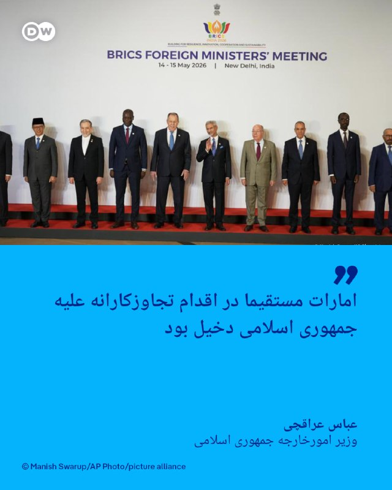

🔶 عراقچی: امارات مستقیما در اقدام تجاوزکارانه علیه جمهوری اسلامی دخیل بود
 
عباس عراقچی، وزیر امورخارجه جمهوری اسلامی که برای اجلاس بریکس به هند سفر کرده است، در نشست وزیران خارجه در روز پنج‌شنبه ۱۴ مه به شدت به امارات متحده عربی حمله کرد.
 
عراقچی خطاب به وزیر امارات گفت: «ائتلاف شما با اسرائیلی‌ها نیز از شما محافظت نکرد. در سیاست خود در قبال ایران بازنگری کنید.»
 
عراقچی گفت: «من در سخنرانی‌ خود نام امارات متحده عربی را ذکر نکردم، به خاطر حفظ وحدت و ترجیح دادم به آن اشاره نکنم. اما در واقع باید بگویم که امارات مستقیماً در اقدام تجاوزکارانه علیه کشور من دخیل بود. زمانی که این تجاوز آغاز شد، آنها حتی از محکوم کردن آن خودداری کردند.»
 
جمهوری اسلامی در زمان جنگ  صدها موشک و پهپاد به سوی امارات متحده شلیک کرد.
 
در روز گذشته دفتر نخست‌وزیر اسرائیل اعلام کرد بنیامین نتانیاهو در جریان جنگ ایران به‌طور محرمانه به امارات سفر کرده است.
 
دفتر نتانیاهو گفت این سفر به "یک دستاورد تاریخی" در روابط دو طرف منجر شده است.
 
وزارت امور خارجه امارات با این حال در بیانیه‌ای این موضوع را تکذیب کرد.
 
@dw_farsi

## DW_Farsi — post 124701

  

🔶 آنگلا مرکل خواستار مدارای بیشتر آلمانی‌ها و سیاستمداران با دولت مرتس شد
 
آنگلا مرکل، صدراعظم پیشین آلمان، از شهروندان این کشور خواست عملکرد دولت ائتلافی را منصفانه‌تر ارزیابی کنند. این در حالی است که نارضایتی عمومی از عملکرد دولت به‌طور گسترده افزایش یافته است.
 
میزان محبوبیت دولت ائتلافی آلمان از زمان آغاز به کار آن، کمی بیش از یک سال پیش، به‌طور مداوم کاهش یافته است. در برخی نظرسنجی‌های تازه بیش از ۸۰ درصد پاسخ‌دهندگان از عملکرد دولت ابراز نارضایتی کرده‌اند.
 
مرکل که از سال ۲۰۰۵ تا ۲۰۲۱ صدراعظم آلمان بود، نخواست درباره سیاست‌های دولت ائتلافی اتحاد دموکرات مسیحی و حزب سوسیال‌دموکرات به‌طور جزئی اظهار نظر کند. اما تأکید کرد: «برای این دولت آرزوی موفقیت دارم.»
 
او در گفت‌وگو با مجله خبری "فوکوس" افزود: «هر شهروندی باید با خویشتنداری و تعادل، که همیشه از واژه‌های مورد علاقه من هستند، تلاش کند آنچه را که دولت تاکنون انجام داده، ارج نهد. این‌طور نیست که هیچ اتفاقی نیفتاده باشد.»
 
مرکل همچنین خواستار تحمل بیشتر در برابر بحث‌ها و اختلاف‌نظرهای درون دولت شد.
 
@dw_farsi

## DW_Farsi — post 124700

  

🔶 برگزاری دور سوم مذاکرات میان اسرائیل و لبنان در واشنگتن
 
نمایندگان اسرائیل و لبنان روز پنج‌شنبه ۲۴ اردیبهشت (۱۴ مه) بار دیگر "در تلاش برای رسیدن به یک راه‌حل صلح‌آمیز" در واشنگتن دیدار می‌کنند. این سومین دور گفت‌وگوها از زمان اعلام آتش‌بس است که حدود یک ماه پیش میان  اسرائیل و لبنان برقرار شده است.
 
دونالد ترامپ، رئیس‌جمهور ایالات متحده در آخرین دور مذاکرات در ۲۳ آوریل شخصا از مذاکره‌کنندگان در کاخ سفید استقبال کرده بود.
 
اسرائیل و لبنان به‌طور رسمی هیچ‌گونه روابط دیپلماتیکی با یکدیگر ندارند و از سال ۱۹۴۸ در "وضعیت جنگی" قرار دارند.
 
با وجود آتش‌بسی که از ۱۷ آوریل برقرار شده، اسرائیل و شبه‌نظامیان حزب‌اللهِ مورد حمایت ایران در لبنان همچنان به حملات متقابل خود ادامه داده‌اند.
 
حزب‌الله با مذاکرات لبنان و اسرائیل که بدون حضور و مشارکت این گروه برگزار می‌شود، مخالفت کرده است.
 
جنگ ایران تنش‌ها را بیش از پیش تشدید کرده است.
 
لبنان در اوایل ماه مارس به جنگ ایران کشیده شد. در آن زمان، حزب‌الله لبنان در واکنش به کشته‌شدن علی خامنه‌ای، رهبر جمهوری اسلامی موشک‌هایی به سمت اسرائیل شلیک کرد.
   
@dw_farsi

## DW_Farsi — post 124699

🎥 حمله مرگبار ایران به یک کشتی باری در تنگه هرمز؛ روایت ملوانی که جان به‌در برد
 
یک ملوان تایلندی که سه تن از همکارانش را در حمله مرگبار ایران به کشتی باری "Mayuree Naree" در تنگه هرمز (اسفند ۱۴۰۴) از دست داد، در گفت‌وگو با دویچه وله از این واقعه و پیامدهای آن می‌گوید.
@dw_farsi

## Persian_Trend_Official — post 14149

  <a href="telegram/content/Persian_Trend_Official_14149_1778772951.mp4" target="_blank">🎬 Download video</a>

🔴مارکو روبیو:

💢نیروهای مسلح اوکراین در حال حاضر قوی‌ترین و قدرتمندترین نیروهای مسلح در سراسر اروپا هستند.

🫆:Tony

📌 @persian_trend_official
پرشین ترند | متفاوت‌ترین کانال نظامی

## Persian_Trend_Official — post 14148

  <a href="telegram/content/Persian_Trend_Official_14148_1778772952.mp4" target="_blank">🎬 Download video</a>

🔴 چین درخواست ترامپ برای عدم خرید نفت از ایران را رد کرد

🔹مجری فاکس‌ نیوز:
آیا در مورد حمایت چین از ایران با شی جین‌پینگ صحبت کردید؟

🔹ترامپ:
«ما در مورد آن صحبت کردیم. منظورم این است که وقتی می‌گویید «حمایت از ایران»، آنها با ما جنگ یا چیزی شبیه به این نمی‌کنند. او گفت که قرار نیست تجهیزات نظامی به ایران بدهد. این حرف بزرگی است. اما او در عین حال گفت که آنها مقدار زیادی از نفت خود را از ایران می‌خرند و دوست دارند به این کار ادامه دهند!»

🫆:Tony

📌 @persian_trend_official
پرشین ترند | متفاوت‌ترین کانال نظامی

## Persian_Trend_Official — post 14147

  

ٖغریب‌آبادی در بریکس: امارات متجاوز است نه ایران؛۱۳۰ هزار هدف غیرنظامی مورد حمله با مشارکت امارات /مستندات را به شورای امنیت ارسال کرده‌ایم

غریب‌آبادی در پاسخ به ادعای وزیر مشاور امارات مبنی بر متجاوز بودن ایران، گفت:

🔹امارات خود متجاوز است، نه ایران. زیرا امارات نقش قابل توجهی در حمایت و تسهیل تجاوز نظامی علیه ایران ایفا کرده است.

🔹استناد به قطعنامه ۱۹۷۴ مجمع عمومی سازمان ملل؛ هر کشوری که به متجاوزین تسهیلات و خدمات دهد، اقدامش برابر با تجاوز است، نه صرفا کمک به متجاوز.

🔹ایران به تمامی پایگاه‌های آمریکا و تأسیسات مرتبط با آمریکا در امارات حمله کرد. این اقدام مطابق با منشور ملل متحد و در چارچوب حق دفاع مشروع بود. ایران پیش از حمله، به امارات هشدار داده بود که در صورت کمک به متجاوز، تأسیساتشان هدف قرار می‌گیرد.

🔹در جریان تجاوز با مشارکت امارات، ۱۳۰ هزار هدف غیرنظامی مورد حمله قرار گرفت و بیش از ۴ هزار غیرنظامی به شهادت رسیدند.

🫆:Tony

📌 @persian_trend_official
پرشین ترند | متفاوت‌ترین کانال نظامی

## Persian_Trend_Official — post 14146

  

🔴 روسیه یکی از سنگین‌ترین حملات خود را علیه اوکراین انجام داد 💢گزارش‌ها حاکی است روسیه طی ۲۴ ساعت گذشته یکی از بزرگ‌ترین حملات هوایی خود از آغاز جنگ را علیه اوکراین انجام داده است. 💢بر اساس اطلاعات منتشرشده: ▪️ بیش از ۱۴۰۰ پهپاد در این حمله استفاده شده…

## Persian_Trend_Official — post 14143

🔴 مشاهده سامانه پدافندی چینی در دست سرباز اوکراینی

💢تصاویری منتشر شده که یک سرباز اوکراینی را در حال استفاده از سامانه پدافند هوایی دوش‌پرتاب «اف‌ان-۱۶» ساخت چین نشان می‌دهد.

▪️ «اف‌ان-۱۶» یک موشک دوش‌پرتاب کوتاه‌برد ضداهداف هوایی است

▪️ این سامانه برای مقابله با:

بالگردها
پهپادها
و هواگردهای کم‌ارتفاع طراحی شده است.

نحوه رسیدن این سامانه چینی به نیروهای اوکراینی مشخص نیست و تاکنون توضیح رسمی درباره آن منتشر نشده است.

🫆:Tony

📌 @persian_trend_official
پرشین ترند | متفاوت‌ترین کانال نظامی

## Persian_Trend_Official — post 14142

  <a href="telegram/content/Persian_Trend_Official_14142_1778772954.mp4" target="_blank">🎬 Download video</a>

💢فرمانده سنتکام، برد کوپر:

💢کار ما آماده بودن است و ما آماده‌ایم
مذاکرات حساس ادامه دارد

🫆:Tony

📌 @persian_trend_official
پرشین ترند | متفاوت‌ترین کانال نظامی

## Persian_Trend_Official — post 14141

  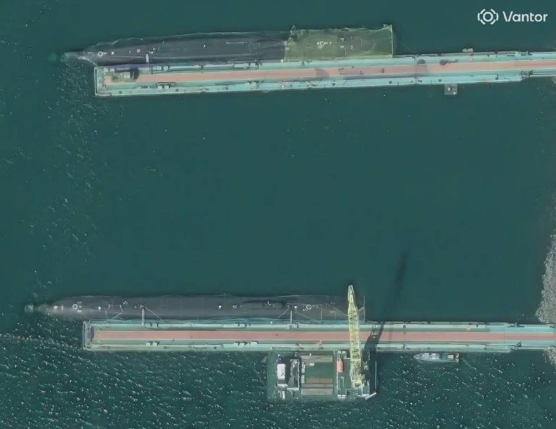

🔴 روسیه زیردریایی‌های هسته‌ای «بوری» را با تور ضدپهپاد پوشاند

💢تصاویر ماهواره‌ای جدید نشان می‌دهد روسیه دو زیردریایی هسته‌ای کلاس «بوری» را در پایگاه کامچاتکا در اقیانوس آرام به‌طور کامل با تورهای ضدپهپادی پوشانده است.

🔹بر اساس گزارش‌ها:

▪️ این پایگاه حدود ۷۴۰۰ کیلومتر با اوکراین فاصله دارد

▪️ برای نخستین‌بار کل بدنه زیردریایی‌ها، نه فقط اسکله یا برجک آن‌ها، زیر پوشش تور قرار گرفته است

▪️ این اقدام احتمالاً با هدف مقابله با تهدید پهپادها انجام شده است

🔹زیردریایی‌های کلاس «بوری» بخشی از مهم‌ترین توان هسته‌ای دریایی روسیه محسوب می‌شوند و هرکدام توان حمل:

▪️ ۱۶ موشک بالستیک قاره‌پیما با چندین کلاهک هسته‌ای مستقل را دارند.

💢این اقدام نشان می‌دهد نگرانی روسیه از تهدید پهپادها اکنون حتی به پایگاه‌های راهبردی هسته‌ای در دوردست‌ترین مناطق این کشور نیز رسیده است.

🫆:Tony

📌 @persian_trend_official
پرشین ترند | متفاوت‌ترین کانال نظامی

## Persian_Trend_Official — post 14140

🔴 شی جین‌پینگ: روابط چین و آمریکا مهم‌ترین رابطه دوجانبه جهان است

💢رئیس‌جمهور چین اعلام کرد روابط پکن و واشینگتن مهم‌ترین رابطه دوجانبه در جهان محسوب می‌شود و دو کشور باید از تقابل پرهیز کنند.

🔹شی جین‌پینگ پس از دیدار با دونالد ترامپ گفت:

▪️ چین و آمریکا بیشترین منفعت را از همکاری مشترک می‌برند

▪️ دو کشور در صورت تقابل، متحمل خسارت خواهند شد

▪️ پکن و واشینگتن باید شریک باشند، نه رقیب

🔹او همچنین افزود:

▪️ در دیدار با ترامپ درباره روابط دوجانبه و تحولات منطقه‌ای و جهانی گفت‌وگوهای عمیقی انجام شده است

▪️ دو طرف بر ایجاد روابطی «سازنده و با ثبات راهبردی» توافق کرده‌اند

▪️ هدف از این رویکرد، کمک به صلح، ثبات و توسعه پایدار در جهان عنوان شده است

🫆:Tony

📌 @persian_trend_official
پرشین ترند | متفاوت‌ترین کانال نظامی

## Persian_Trend_Official — post 14139

  

🔴 طوفان مرگبار در هند؛ دست‌کم ۸۹ کشته 💢تصاویر منتشرشده از ایالت اوتار پرادش هند، شدت طوفان و بادهای سهمگین در این منطقه را نشان می‌دهد 💢 خبرگزاری رویترز گزارش داده طوفان شدید در ایالت اوتار پرادش هند دست‌کم ۸۹ تا ۱۰۴ کشته برجا گذاشته است. ▪️ در ویدئوهای…

## Persian_Trend_Official — post 14137

  <a href="telegram/content/Persian_Trend_Official_14137_1778772957.mp4" target="_blank">🎬 Download video</a>

🔴 طوفان مرگبار در هند؛ دست‌کم ۸۹ کشته

💢تصاویر منتشرشده از ایالت اوتار پرادش هند، شدت طوفان و بادهای سهمگین در این منطقه را نشان می‌دهد

💢 خبرگزاری رویترز گزارش داده طوفان شدید در ایالت اوتار پرادش هند دست‌کم ۸۹ تا ۱۰۴ کشته برجا گذاشته است.

▪️ در ویدئوهای منتشرشده از شهر بریلی، لحظه بلند شدن یک مرد توسط شدت باد دیده می‌شود

️▪️طبق گزارش‌ها، آن مرد همراه با سقف فلزی توسط باد به هوا پرتاب شد اما زنده مانده و دچار شکستگی دست و پا شده است.

🫆:Tony

📌 @persian_trend_official
پرشین ترند | متفاوت‌ترین کانال نظامی

## Persian_Trend_Official — post 14136

  <a href="telegram/content/Persian_Trend_Official_14136_1778772958.webm" target="_blank">🎬 Download video</a>

🔴 چین تولید جنگنده پنهانکار «جی-۲۰» را با کارخانه تمام‌خودکار افزایش داد

💢گزارش‌ها حاکی است چین به‌صورت بی‌سروصدا بهره‌وری تولید پیشرفته‌ترین جنگنده پنهانکار خود را بیش از دو برابر کرده است.

🔹بر اساس گزارش «ساوت چاینا مورنینگ پست»:

▪️ یکی از کارخانه‌های چنگدو به یک «کارخانه تاریک» تمام‌خودکار تبدیل شده است

▪️ در این مجموعه، ماشین‌ها و خودروهای خودران مبتنی بر هوش مصنوعی تقریباً به‌صورت ۲۴ ساعته فعالیت می‌کنند

▪️ به‌دلیل خودکار بودن فرایندها، نیاز چندانی به روشنایی و نیروی انسانی وجود ندارد

💢این کارخانه اکنون قطعات ساختاری جنگنده پنهانکار «جی-۲۰» ملقب به «اژدهای قدرتمند» را تولید می‌کند؛ جنگنده‌ای که از آن به‌عنوان رقیب چینی «اف-۲۲» آمریکا یاد می‌شود.

🔹بر اساس این گزارش:

▪️ استفاده گسترده از اتوماسیون باعث کاهش هزینه تولید شده است

▪️ وابستگی به نیروی انسانی شبانه‌روزی کاهش یافته

▪️ تولید انبوه جنگنده «جی-۲۰» از سال ۲۰۲۰ آغاز شده است

🫆:Tony

📌 @persian_trend_official
پرشین ترند | متفاوت‌ترین کانال نظامی

## Persian_Trend_Official — post 14135

  

اکانت کاخ سفید در شبکه ایکس:
تاریخ در حرکت است.

☆Phantom☆

📌 @persian_trend_official
پرشین ترند | متفاوت‌ترین کانال نظامی

## Persian_Trend_Official — post 14134

خدارو شکر دیگه کم کم هر ننه قمری فاز کوسه برداشته و میخواد به حساب دیگران رسیدگی کنه! جناب کریم شیره ای، شما اگر خیلی حساب و کتاب سرت میشه برو پول بساطت رو با ساقی محل حساب کن .

## Persian_Trend_Official — post 14131

  <a href="telegram/content/Persian_Trend_Official_14131_1778772959.webm" target="_blank">🎬 Download video</a>

کانال هذیان گو اخبار سوریه، با محتوایی سمی و تخیلی ۶۰۰ میلیون از وزارت نفت به اسم تبلیغات !!! هزینه میگیره !

ادعای خط انرژی در مورد دریافتی ۶۰۰ میلیون تومانی مالک کانال ارزشی، قلم به مزد و دروغ پرداز اخبار سوریه از پتروشیمی آریا

در این کشور برای هر نوع چریدن و هدر دادن بیت المال پول کافی وجود دارد اما برای خرج های اصلی مملکت یا ساخت ارتشی توانمند دچار کسری بودجه ایم!

https://farsnews.ir/Khate_energy/1778660394098111565/%D8%A7%D8%B2-%D8%A7%D8%AE%D8%A8%D8%A7%D8%B1-%D8%B3%D9%88%D8%B1%DB%8C%D9%87-%D8%AA%D8%A7-%D9%88%D8%B2%D8%A7%D8%B1%D8%AA-%D9%86%D9%81%D8%AA-%D9%88-%D9%BE%D8%AA%D8%B1%D9%88%D8%B4%DB%8C%D9%85%DB%8C-%D8%A2%D8%B1%DB%8C%D8%A7%D8%B3%D8%A7%D8%B3%D9%88%D9%84-%DA%86%D8%B1%D8%A7-%D8%A8%D9%87-%D8%AE%D8%B7-%D8%A7%D9%86%D8%B1%DA%98%DB%8C-%D8%AD%D9%85%D9%84%D9%87-%D9%85%DB%8C-%DA%A9%D9%86%D9%86%D8%AF

📌 @persian_trend_official
پرشین ترند | متفاوت‌ترین کانال نظامی

## Persian_Trend_Official — post 14130

  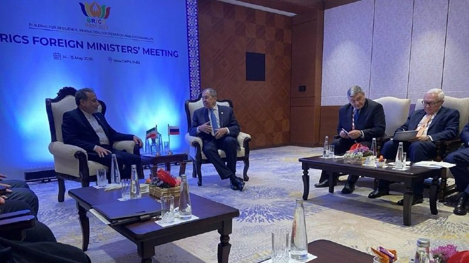

🔴عباس عراقچی، وزیر امور خارجه جمهوری اسلامی، و سرگئی لاوروف، وزیر امور خارجه روسیه، در شهر دهلی نو (پایتخت هند) با یکدیگر دیدار و گفتگو کردند

🫆:Tony

📌 @persian_trend_official
پرشین ترند | متفاوت‌ترین کانال نظامی

## RadioFarda — post 157181

  

🔸رئیس فدراسیون فوتبال ایران می‌گوید هنوز برای هیچیک از اعضای تیم ملی برای شرکت در جام جهانی ۲۰۲۶ ویزا صادر نشده است.

🔸خبرگزاری جمهوری اسلامی، ایرنا، به نقل از مهدی تاج نوشته است: «فردا یا پس‌فردا جلسه‌ای سرنوشت‌ساز با فیفا خواهیم داشت. آن‌ها باید به ما تضمین بدهند، زیرا هنوز مسئله ویزا حل نشده.»

🔸او افزود: «روایتی از سوی طرف مقابل مبنی بر اینکه به چه کسانی ویزا داده‌اند، دریافت نکرده‌ایم. هنوز هیچ ویزایی نیامده است.»

🔸رئیس فدراسیون فوتبال ایران که در روزهای اخیر شرط‌هایی برای حضور در جام جهانی از جمله لزوم صدور ویزا برای کل اعضای تیم و کادر فنی اعلام کرده بود، همچنین گفت: «ما در حال آماده‌سازی برای جام جهانی هستیم، اما منتظر رفتار طرف مقابل هستیم.»

🔸کاروان تیم ملی فوتبال روز چهارشنبه به ترکیه رفت تا بعد از یک اردوی چند روزه عازم آمریکا به عنوان میزبان مسابقات تیم ایران شود.

🔸رئیس فیفا پیش‌تر چند بار گفته است که ایران قطعا در جام جهانی شرکت خواهد کرد. دونالد ترامپ، رئیس‌جمهور ایالات متحده، نیز اعلام کرده که مشکلی با حضور ایران ندارد.

@RadioFarda

## RadioFarda — post 157180

  

🔸ستاد فرماندهی مرکزی ایالات متحده، سنتکام، روز پنجشنبه ۲۴ اردیبهشت با انتشار تصویری از عملیات ناو آمریکایی «یو‌اس‌اس تراکستون» در دریای عرب اعلام کرد که نیروهای این فرماندهی تاکنون ۷۰ کشتی تجاری را در چارچوب محاصره دریایی ایران وادار به تغییر مسیر کرده‌اند.

🔸سنتکام همچنین اعلام کرد چهار شناور نیز برای اجرای محاصره «از کار انداخته» شده‌اند.

🔸سنتکام پیش‌تر گفته بود در چارچوب این عملیات، به ۱۵ کشتی حامل کمک‌های بشردوستانه اجازه عبور داده شده و نیروهای آمریکایی برای وادار کردن برخی کشتی‌ها به تغییر مسیر، از تماس رادیویی و شلیک تیر هشدار نیز استفاده کرده‌اند.

🔸آمریکا پس از بی‌نتیجه ماندن مذاکرات مستقیم با ایران، محاصره دریایی بنادر جمهوری اسلامی را آغاز کرد؛ در حالی که ایران از ابتدای جنگ تنگه هرمز را مسدود کرده است.

@RadioFarda

## IranianMinds — post 20134

🔴ترامپ به فاکس‌نیوز:

رهبر چین پیشنهاد داده است که در موضوع ایران کمک کند و همچنین وعده داده که به ایران تجهیزات نظامی منتقل نکند. او می‌خواهد که تنگه هرمز باز بماند.

@IranianMinds

## IranianMinds — post 20133

  <a href="telegram/content/IranianMinds_20133_1778772961.mp4" target="_blank">🎬 Download video</a>

🔴 فرمانده سنتکام، دریاسالار برد کوپر:

مذاکرات با ریسک بالا ادامه دارد.
وظیفه ما این است که آماده باشیم و هستیم.

@IranianMinds

## IranianMinds — post 20132

🔴 شرکت هواپیمایی ایتالیایی ITA Airways بازگشت پروازهای خود به اسرائیل را تا اول جولای به تعویق انداخت

@IranianMinds

## IranianMinds — post 20131

🔴 فرمانده سنتکام :

ما هر لحظه آماده حرکت علیه ایران هستیم

@IranianMinds

## IranianMinds — post 20130

🔴 وزیر خزانه‌داری آمریکا:
طی سه روز گذشته هیچ بارگیری در تاسیسات نفتی ایران انجام نشده است.

@IranianMinds

## IranianMinds — post 20129

  

😤دنبال یه سایت شرط بندی بین المللی بودی که به ایرانیا خدمات بده؟!
⛔

👍دربی بت همون انتخاب  100%

💎ویژگی های سایت جهانی Derby Bet:

⬅️امکان شارژ امن با کارت بانکی

⬅️واریز اول دوبل شارژ می شوید(بونوس۱۰۰٪)

⬅️پر اپشن ترین سایت فعال در ایران

⬅️تسویه حساب کمتر از 5 دقیقه

⬅️برگشت بخشی از باخت به صورت هفتگی

🚨کد هدیه ثبت نام:GG007

⚠️برای دانلود اپلکیشن کلیک کنید
👉
ge24

🔔کانال دربی بت :

🪙https://t.me/+aCbq7yy8QY80NzQ0

## IranianMinds — post 20128

  

🔴کاخ سفید:

هر دو کشور ( چین و آمریکا ) توافق کردند که ایران هرگز نمی‌تواند سلاح هسته‌ای داشته باشد.

@IranianMinds

## IranianMinds — post 20127

  

لامین یامال بازیکن چپول بارسلونا که تو‌ جشن قهرمانی بارسا پرچم فلسطینو گرفته دستش @IranianMinds

## IranianMinds — post 20126

ShirOKhorshid-2026.05.14.apk

## IranianMinds — post 20125

ShirOKhorshid-2026.05.14.apk

## IranianMinds — post 20124

  <a href="https://t.me/IranianMinds/20124" target="_blank">📎 Download file</a>

آموزش اتصال به اینترنت بین الملل:

🔺 مهم: اگر این نسخه رو نصب کنید دیگه دردسر ستاپ کردن MITM و... ندارید!
این نسخه حدودا یک ساعت پیش توسط برنامه‌نویس شیر و خورشید آپدیت شد و به راحتی می‌تونید طبق این آموزش بهش وصل بشید:
1- وارد اپلیکیشن شیر و خورشید(آخرین نسخه که امروز منتشر شده) می‌شید
2- وارد بخش Options میشید از نوار بالا
3- روی More Options کلیک میکنید
4- گزینه‌ی Connection Protocol رو قرار میدید روی CDN Fronting
5- میرید و عادی کانکت میشید و به راحتی وصل میشه.

@IranianMinds

## IranianMinds — post 20123

  

🔴پست کاخ سفید در ایکس:
تاریخ در حرکت است.

@IranianMinds

## BBCPersian — post 281036

  

‌🔻مصطفی پوردهقان، دبیر دوم کمیسیون صنایع و معادن مجلس گفته است که مصوبه شورای عالی امنیت ملی در مورد اینترنت پرو در اجرا به «قلکی برای همراه اول، ایرانسل و رایتل» تبدیل شده است.

او در مورد انتخاب محمدرضا عارف، به عنوان رئیس ستاد ویژه ساماندهی فضای مجازی گفت که «مجلس در این مورد چیزی نمی‌داند» و این حکم مسعود پزشکیان، رئیس‌جمهور را «تزئينی» خوانده است.

به گفته این نماینده مجلس این قبیل اقدامات بیشتر جنبه «روانی » دارد و قرار نیست که «اتفاق خاصی» در این مورد بیفتد.

آقای پوردهقان همچنین گفته است که بدتر از قطعی اینترنت، تعطیلی مجلس است و اکنون مجلس با بسیاری از وزرای دولت به لحاظ نظارتی هیچ ارتباط خاصی درمورد عملکردشان ندارد که یکی از همین موارد موضوع اینترنت است و هنوز یک جلسه ویژه نداریم که فردی بیاید و شرایط را توضیح دهد.

بیش از ۷۰ روز است که دسترسی به اینترنت جهانی در ایران قطع شده است.

پس از اعتراضات دی ۱۴۰۴ و سپس جنگ آمریکا و اسرائیل با ایران، دسترسی به اینترنت جهانی به طور کامل قطع شد.

لینک خبر کامل:

📷NurPhoto via Getty Images
https://bbc.in/492rMp0

@BBCPersian

## BBCPersian — post 281035

  <a href="telegram/content/BBCPersian_281035_1778772966.mp4" target="_blank">🎬 Download video</a>

🔻‌‌‌دونالد ترامپ با هیئتی از مقامات سیاسی و تجاری از جمله چندین نفر از مدیران ارشد شرکت‌های بزرگ، مانند ایلان ماسک، موسس تسلا و اسپیس‌اکس، تیم کوک، مدیرعامل اپل و جنسن هوانگ، مدیر اجرایی انویدیا به چین سفر کرده است.

دونالد ترامپ و شی جین‌پینگ، رئیس‌جمهور چین حدود دو ساعت با هم مذاکره کردند که دو برابر مدت زمانی بود که در ابتدا برای آن برنامه‌ریزی شده بود. آقای ترامپ در پاسخ به خبرنگاران این گفتگوها را «عالی» توصیف کرد.

اما حضور مارکو روبیو، وزیر امور خارجه آمریکا حتی پیش از ورودش به چین هم خبرساز شده بود. آقای روبیو از سال ۲۰۲۰ تحت دو تحریم دولت چین است، چون در دورانی که سناتور ایالت فلوریدا بود مواضعی سرسختانه درباره هنگ‌کنگ، اقلیت مسلمان اویغور و حقوق بشر در چین داشت.

اما پکن از زمان انتصاب او به وزارت خارجه آمریکا راهکاری برای دور زدن تحریم‌های خود به کار می‌بندد. آنها بخش نخست نام خانوادگی روبیو را در زبان چینی با حرف «لو» می‌نویسند تا تحریم‌ها را اجرا نکنند و لغو هم نکرده باشند.

https://bbc.in/4wyYEzS
@BBCPersian

## BBCPersian — post 281034

🔻دولت اسرائیل از نیویورک‌تایمز به خاطر مقاله‌اش شکایت می‌کند

🔻دفتر نخست‌وزیری اسرائیل روز پنج‌شنبه با صدور بیانیه‌ای اعلام کرد که این کشور علیه روزنامه نیویورک تایمز به دلیل انتشار یادداشتی از نیکلاس کریستوف که شامل اتهاماتی مبنی بر سوءاستفاده جنسی جدی از فلسطینیان در زندان‌های اسرائیل بود، اقدام قانونی خواهد کرد.

مقاله کریستف با عنوان «سکوتی که تجاوز به فلسطینیان با آن روبرو می‌شود» روز دوشنبه ۱۱ مه در نیویورک‌تایمز منتشر شده است.

دفتر نخست‌وزیری اسرائیل که این اتهام را «یکی از زشت‌ترین و تحریف‌شده‌ترین دروغ‌هایی که تاکنون علیه دولت اسرائیل منتشر شده» خوانده و گفته که بنیامین نتانیاهو، نخست‌وزیر، و گیدعون سعر، وزیر خارجه، به مقامات دستور داده‌اند تا مقدمات طرح شکایت افترا علیه این نشریه را آغاز کنند.

روزنامه نیویورک‌تایمز روز چهارشنبه با انتشار بیانیه‌ای ضمن دفاع از انتشار این مطلب، اعلام کرده بود که روایت ۱۴ زن و مردی که در این مطلب مورد اشاره قرار گرفته‌اند راستی‌آزمایی و با روایت شاهدان دیگر مقایسه شده است.

https://bbc.in/49yqhit
@BBCPersian

## BBCPersian — post 281033

  <a href="telegram/content/BBCPersian_281033_1778772967.mp4" target="_blank">🎬 Download video</a>

🔻سرخط خبرهای روز پنجشنبه ۲۴ اردیبهشت ماه ۱۴۰۵

@BBCPersian

## BBCPersian — post 281032

🔻وزیر بهداشت بریتانیا در اعتراض به رهبری استارمر استعفا داد

🔻وس استریتینگ، وزیر بهداشت بریتانیا با انتشار استعفانامه خود در شبکه ایکس، نوشت که «اعتماد به رهبری» کی‌یر استارمر، نخست‌وزیر بریتانیا را «از دست داده‌» و ادامه حضورش در دولت را «غیراخلاقی و برخلاف اصول» می‌داند.

او در بخشی از نامه، از کی‌یر استارمر بابت «شجاعت و دولتمردی» در عرصه بین‌المللی تمجید کرد و نوشت که نخست‌وزیر بریتانیا توانسته کشورش را «از جنگ با ایران دور نگه دارد.»

او همچنین می‌گوید که جنگ‌ها در اروپا و خاورمیانه، مشکلات داخلی بریتانیا را دشوارتر کرده‌اند.

آقای استریتینگ پس از نتایج فاجعه‌بار حزب کارگر در انتخابات شوراهای محلی هفته گذشته، تصمیم به استعفا گرفت.

از متن نامه استعفای او مشخص نیست که آیا از حمایت کافی برای به چالش کشیدن مستقیم کی‌یر استارمر برخوردار است و قصد دارد او را از رهبری کنار بزند یا نه.

https://bbc.in/42uHsOd
@BBCPersian

## BBCPersian — post 281031

🔻گزارش‌ها از تسهیل عبور کشتی‌های چینی از تنگه هرمز

🔻بر اساس گزارش‌ها، ایران از شب گذشته به کشتی‌های چینی بیشتری اجازه عبور از تنگه هرمز را داده است.

خبرگزاری فارس به نقل از یک منبع آگاه گزارش داده است که این اقدام به دنبال درخواست‌های وزیر امور خارجه چین و سفیر پکن در ایران انجام شده است.

خبرگزاری فارس نوشته طی روزهای گذشته دست‌کم شش نفتکش و کشتی فله‌بر با مالکیت یا بهره‌برداری عملیاتی چین از تنگه هرمز عبور کرده‌اند.

بی‌بی‌سی وریفای هم تایید کرده که دستکم یک ابرنفتکش چین روز گذشته از تنگه هرمز عبور کرده است.

ابرنفتکش با پرچم چین به نام «یوان هوا هو» بر اساس سیگنال موقعیت‌یابش، اوایل ماه مارس در بصره عراق پهلو گرفته و محموله نفت بارگیری کرده است.

این کشتی در ساعات اولیه بامداد چهارشنبه (۲۳ اردیبهشت) از تنگه هرمز عبور کرده و موقعیت خود را تنها به مدت حدود ۹۰ دقیقه در آب‌های ایران و در نزدیکی جزیره لارک نشان داده است.

به گزارش بی‌بی‌سی وریفای، این کشتی بیش از ۱۲ ساعت بعد، زمانی که در حال حرکت در وسط دریای عمان و شرق شهر صحار عمان بود، دوباره شروع به پخش موقعیت خود کرد.

مقصد اعلام‌شده این کشتی، بندر ژوشان چین است و طبق اطلاعات موجود در دسترس عموم، قرار است اوایل ژوئن (اواسط خرداد) به آنجا برسد.

مقام‌های چین هنوز این خبر را تایید نکرده‌اند.

ایران در طول جنگ آمریکا و اسرائیل، اعلام کرد که تنها «کشتی‌های بی‌طرف»، می‌توانند از این تنگه عبور کنند و گفته می‌شود که بسیاری از این کشتی‌ها از جمله متعلق به چین است.

https://bbc.in/4uNikya
@BBCPersian

## Dirty_Kids — post 389445

  <a href="telegram/content/Dirty_Kids_389445_1778772969.webm" target="_blank">🎬 Download video</a>

🎶 موزیک - کتلت تنگسیری

@Dirty_Kids 👻

## Dirty_Kids — post 389444

  <a href="telegram/content/Dirty_Kids_389444_1778772969.mp4" target="_blank">🎬 Download video</a>

موزیک ویدیو کتلت تنگسیری

ارزش دانلود بالا، انرژی‌بخش و شاد

حجمش رو تا جایی‌که میشد آوردم پایین
موزیک خالیشم براتون پایین گذاشتم که حجمش خیلی کمتره

@Dirty_Kids 👻

## Dirty_Kids — post 389443

  <a href="telegram/content/Dirty_Kids_389443_1778772970.mp4" target="_blank">🎬 Download video</a>

جو خونه مکرون
بعد از قضیه گلشیفته

@Dirty_Kids 👻

## Dirty_Kids — post 389442

  <a href="telegram/content/Dirty_Kids_389442_1778772971.mp4" target="_blank">🎬 Download video</a>

مصاحبه‌ی بسیار مهمی از عموی خوبم اسکات بسنت وزیر خزانه‌داری آمریکا با شبکه‌ی CNBC که گزارش مختصری از وضعیت روافض هزارپدر می‌ده:

«چیزی که ما شاهدش هستیم اینه که تأسیسات بارگیری نفت روافض که اصلی‌ترین تأسیسات بارگیری نفت‌شونه، مجموعه‌ایه به نام جزیره خارک.

ما رصد کردیم و دیدیم که در سه روز گذشته هیچ بارگیری نفتی صورت نگرفته. ما معتقدیم که مخازن ذخیره‌ی نفت رژیم قحبه‌زاده پر شده.

هیچ کشتی‌ای‌ از اونجا خارج نمی‌شه و هیچ کشتی‌‌ای وارد نمی‌شه، بنابراین رژیم پدرخراب رافضی نمی‌تونه نفتش رو روی آب [در تانکرها] ذخیره کنه.
بنابراین رژیم هزارپدر شروع به متوقف کردن تولید نفت خواهد کرد.
ما از طریق تصاویر ماهواره‌ای می‌بینیم که این اتفاق در حال رخ دادنه.

اما مهم‌تر از همه‌ی این حرف‌ها اینه که این یک رژیم شیطانی مادرهزارتختخوابیه.
روافض جنایتکار تا اینجای سال جاری ۳۰ یا ۴۰ هزار نفر رو کشتن و اعدام کردن ‌ که خیلی از این معترضان مسالمت‌جو بودن‌. پس، با چنین رژیم مادرخر...



@Dirty_Kids 👻

## manototv — post 105456

  <a href="telegram/content/manototv_105456_1778772972.mp4" target="_blank">🎬 Download video</a>

‌
دونالد ترامپ، رئیس‌جمهوری آمریکا، در گفت‌و‌گو با شان هنیتی، خبرنگار و مجری فاکس‌نیوز گفت شی جین‌پینگ، رئیس‌جمهوری چین، خواهان دستیابی به توافق و باز ماندن تنگه هرمز است.

ترامپ گفت: «رئیس‌جمهوری شی دوست دارد توافقی حاصل شود. او گفت اگر بتواند کمکی بکند، مایل است کمک کند.»

رئیس‌جمهوری آمریکا همچنین با اشاره به خرید نفت ایران از سوی چین افزود: «هر کسی که این مقدار نفت می‌خرد، بدیهی است نوعی رابطه دارد.»

ترامپ در ادامه گفت شی جین‌پینگ مایل است تنگه هرمز باز بماند.

## manototv — post 105455

  <a href="telegram/content/manototv_105455_1778772973.mp4" target="_blank">🎬 Download video</a>

مارکو روبیو، وزیر خارجه آمریکا، گفت دونالد ترامپ موضوع ایران را در گفت‌وگو با مقام‌های چین مطرح کرده و این موضوع «اهمیت زیادی» داشته است.

روبیو گفت طرف چینی اعلام کرده با «نظامی‌سازی تنگه هرمز» و همچنین ایجاد سیستم دریافت عوارض از کشتی‌ها در این آبراه مخالف است.

وزیر خارجه آمریکا افزود: «این موضع ما هم هست.»

## manototv — post 105454

  <a href="telegram/content/manototv_105454_1778772974.mp4" target="_blank">🎬 Download video</a>

وزیر نیروی جمهوری‌اسلامی نسبت به وضعیت منابع آب در تهران هشدار داده و گفته شرایط آبی پایتخت چندان مطلوب نیست.
عباس علی‌آبادی اعلام کرده توزیع نامتوازن بارش‌ها باعث شده ۱۰ استان کشور با جمعیتی بیش از ۳۵ میلیون نفر همچنان در وضعیت کمتر از نرمال قرار داشته باشند.
او با اشاره به اینکه میزان بارش‌ها نسبت به میانگین بلندمدت حدود ۴ درصد و نسبت به سال گذشته ۶۶ درصد افزایش داشته، تأکید کرده این آمار به معنی خروج از بحران نیست.
به گفته او، شش سال خشکسالی پیاپی و کاهش ذخایر آب، به‌ویژه در منابع زیرزمینی، باعث شده کسری مخازن آب سطحی و زیرزمینی همچنان یکی از چالش‌های جدی کشور باقی بماند.

## manototv — post 105453

  <a href="telegram/content/manototv_105453_1778772974.mp4" target="_blank">🎬 Download video</a>

مقامات کره جنوبی اعلام کرده‌اند که به نظر می‌رسد بعید است گروهی غیر از جمهوری‌اسلامی در حمله به یک کشتی باری کره‌ای در نزدیکی تنگه هرمز نقش داشته باشد.
این حمله در تاریخ ۴ مه به کشتی متعلق به شرکت HMM کره جنوبی انجام شد و باعث آتش‌سوزی و آسیب به بخش عقبی آن شد. کره جنوبی در حال بررسی اطلاعاتی است که آمریکا درباره این حادثه در اختیارش قرار داده است.
سئول همچنین تیم‌های کارشناسی را به دبی فرستاده تا خسارت وارد شده به کشتی را بررسی و تحقیقات فنی انجام دهند.
در حالی که جمهوری‌اسلامی هرگونه دخالت در این حمله را رد کرده، مقامات کره جنوبی می‌گویند نتیجه‌گیری نهایی پس از پایان تحقیقات اعلام خواهد شد، اما در صورت اثبات نقش تهران، اقدامات لازم انجام می‌شود.
گزارش‌ها می‌گویند آمریکا نیز بلافاصله پس از حادثه، جمهوری‌اسلامی را به دست داشتن در این حمله متهم کرده و خواستار همکاری کره جنوبی در تأمین امنیت کشتیرانی در تنگه هرمز شده بود.

## manototv — post 105452

  <a href="telegram/content/manototv_105452_1778772975.mp4" target="_blank">🎬 Download video</a>

همزمان با سفر ترامپ به چین، آکسیوس در گزارشی به اختلاف نظرهایی در تیم ترامپ در خصوص ایران پرداخته؛ برخی معتقدند جمهوری‌اسلامی از زمان به نفع خود استفاده می‌کند و منتظر تأثیر فشارهای سیاسی در آمریکا است. هم‌زمان افزایش قیمت نفت و نگرانی از تورم، کار دولت را برای مدیریت افکار عمومی سخت‌تر کرده است.
گزارش‌ها نشان می‌دهد مذاکرات اخیر با تهران به بن‌بست رسیده و گزینه‌های نظامی دوباره روی میز قرار گرفته‌اند؛ از عملیات دریایی در تنگه هرمز گرفته تا حملات به زیرساخت‌های ایران.
در عین حال، برخی مقامات آمریکایی می‌گویند فشار اقتصادی فعلی شاید بدون اقدام نظامی هم ایران را تحت فشار قرار دهد، هرچند ساختار سیاسی این کشور کمتر تحت تأثیر نارضایتی عمومی قرار می‌گیرد.
در مجموع، ترامپ تأکید دارد که جلوگیری از دسترسی جمهوری‌اسلامی به سلاح هسته‌ای اولویت اصلی اوست، حتی اگر پیامدهای اقتصادی و سیاسی داخلی به دنبال داشته باشد؛ موضوعی که حالا به دست دموکرات‌ها یک ابزار تبلیغاتی آماده داده است.

## manototv — post 105451

  <a href="telegram/content/manototv_105451_1778772975.mp4" target="_blank">🎬 Download video</a>

«جمهوری اسلامی قصد جان فاطمه سپهری را کرده»

## manototv — post 105450

  <a href="telegram/content/manototv_105450_1778772977.mp4" target="_blank">🎬 Download video</a>

قیمت چیپس و پفک در بازار طی یک سال گذشته جهش چشمگیری داشته است.
بهای چیپس‌های ۶۰ گرمی که سال گذشته حدود ۲۵ هزار تومان بود، حالا به ۶۰ تا ۶۵ هزار تومان رسیده؛ افزایشی حدود ۱۶۰ درصدی.
قیمت چیپس‌های بزرگ‌تر نیز برای بسیاری از خریداران شوکه‌کننده شده است. هر بسته چیپس ۱۳۸ گرمی بسته به برند، بین ۱۳۰ تا ۱۴۰ هزار تومان قیمت دارد و چیپس‌های ۲۴۵ گرمی به حدود ۲۵۰ هزار تومان رسیده‌اند. برخی بسته‌های بزرگ‌تر نیز بین ۳۰۰ تا ۴۰۰ هزار تومان فروخته می‌شوند.
افزایش قیمت در بازار پفک و اسنک هم ادامه دارد. قیمت پفک ۱۱۰ گرمی از حدود ۴۵ هزار تومان به ۱۱۵ هزار تومان رسیده و اسنک‌های پنیری و طلایی حتی گران‌تر هستند. هر بسته اسنک طلایی اکنون حدود ۱۵۰ هزار تومان قیمت دارد و کرانچی ۱۰۰ گرمی نیز به حدود ۸۰ هزار تومان رسیده است.

## manototv — post 105449

  <a href="telegram/content/manototv_105449_1778772977.mp4" target="_blank">🎬 Download video</a>

«من صدای فاطمه سپهری هستم»

## manototv — post 105448

  <a href="telegram/content/manototv_105448_1778772978.mp4" target="_blank">🎬 Download video</a>

الجزیره گزارش داد نمایندگان لبنان و اسرائیل برای دور تازه‌ای از گفت‌وگوها به ساختمان وزارت خارجه آمریکا در واشنگتن رسیده‌اند.
این مذاکرات مستقیم روزهای پنج‌شنبه و جمعه برگزار می‌شود و مقام‌های دیپلماتیک لبنان، اسرائیل و همچنین مقام‌های آمریکایی در آن حضور خواهند داشت.

## manototv — post 105447

  <a href="telegram/content/manototv_105447_1778772979.mp4" target="_blank">🎬 Download video</a>

فیفا در یک پست اینستاگرامی اعلام کرد که شکیرا، مدونا و سوپراستارهای کی‌پاپ گروه بی‌تی‌اس اجرای نخستین نمایش بین دو نیمه فینال جام جهانی را بر عهده خواهند داشت.
فینال جام جهانی قرار است ۱۹ ژوئیه در ورزشگاه مت‌لایف در نیوجرسی برگزار شود و انتظار می‌رود علاوه بر تماشاگران حاضر در ورزشگاه، میلیون‌ها بیننده در سراسر جهان آن را تماشا کنند.
جام جهانی ۲۰۲۶ از ۱۱ ژوئن در مکزیکوسیتی آغاز می‌شود و مسابقات آن در شهرهای مختلفی در آمریکا، کانادا و مکزیک برگزار خواهد شد.

## manototv — post 105446

  <a href="telegram/content/manototv_105446_1778772979.mp4" target="_blank">🎬 Download video</a>

خبرگزاری حکومتی فارس وابسته به سپاه پاسداران از قول یک منبع آگاه اعلام کرد جمهوری اسلامی با عبور تعدادی از کشتی‌های چینی از تنگه هرمز، در چارچوب «پروتکل مدیریت ایرانی تنگه»، موافقت کرده است.
به گفته این منبع، پس از رایزنی‌های وزیر خارجه چین و سفیر پکن در تهران، دو کشور درباره تسهیل عبور برخی کشتی‌های چینی به توافق رسیدند و این روند از شامگاه گذشته آغاز شده است.
بر اساس این گزارش، عبور این کشتی‌ها پس از هماهنگی با مقام‌های جمهوری‌اسلامی و پذیرش ضوابط تعیین‌شده از سوی تهران انجام می‌شود.

## alonews — post 119965

  <a href="telegram/content/alonews_119965_1778772980.webm" target="_blank">🎬 Download video</a>

👈سنتکام: امارات، بحرین، عربستان، کویت، اردن و اسرائیل در عملیات آمریکا شرکت کردند

✅ @AloNews خبر جنگ

## alonews — post 119964

  <a href="telegram/content/alonews_119964_1778772980.webm" target="_blank">🎬 Download video</a>

👈ترامپ : هر کشوری که این مقدار نفت بخرد، بدیهی است که نوعی رابطه دارد، اما او دوست دارد تنگه هرمز باز بماند. 
✅ @AloNews خبر جنگ

## alonews — post 119963

  <a href="telegram/content/alonews_119963_1778772980.webm" target="_blank">🎬 Download video</a>

👈سناتور کنگره خطاب به برد کوپر:
شما میدونستید ایران تنگه هرمز رو میبنده؟

🔴برد کوپر: همه احتمالات در نظر گرفته شده بود

✅ @AloNews خبر جنگ

## alonews — post 119962

  <a href="telegram/content/alonews_119962_1778772980.webm" target="_blank">🎬 Download video</a>

👈میدل ایست نیوز : پارلمان عراق به برنامه دولت علی الزیدی رای داد

✅ @AloNews خبر جنگ

## alonews — post 119961

  <a href="telegram/content/alonews_119961_1778772980.webm" target="_blank">🎬 Download video</a>

👈ترامپ : رئیس‌جمهور شی علاقه‌منده که درباره ایران به توافق برسه، اون گفت : اگه بتونم کمکی بکنم، حاضرم کمک کنم 
✅ @AloNews خبر جنگ

## alonews — post 119960

  <a href="telegram/content/alonews_119960_1778772980.webm" target="_blank">🎬 Download video</a>

👈هانیتی از فاکس: آیا درباره حمایت چین از ایران با شی صحبت کردید؟ 
🔴 ترامپ: او گفت که تجهیزات نظامی نخواهد داد. این یک بیانیه بزرگ است. 
🔴 اما در عین حال، گفت که آنها مقدار زیادی نفت از آنجا می‌خرند و دوست دارند این کار را ادامه دهند. 
✅ @AloNews خبر جنگ

## alonews — post 119959

  <a href="telegram/content/alonews_119959_1778772980.webm" target="_blank">🎬 Download video</a>

👈مارکو روبیو: نیروهای مسلح اوکراین در حال حاضر قوی ترین و قدرتمندترین نیروهای مسلح در تمام اروپا هستند.

✅ @AloNews خبر جنگ

## alonews — post 119958

  <a href="telegram/content/alonews_119958_1778772981.mp4" target="_blank">🎬 Download video</a>

👈هانیتی از فاکس: آیا درباره حمایت چین از ایران با شی صحبت کردید؟

🔴 ترامپ: او گفت که تجهیزات نظامی نخواهد داد. این یک بیانیه بزرگ است.

🔴 اما در عین حال، گفت که آنها مقدار زیادی نفت از آنجا می‌خرند و دوست دارند این کار را ادامه دهند.

✅ @AloNews خبر جنگ

## alonews — post 119957

  <a href="telegram/content/alonews_119957_1778772982.webm" target="_blank">🎬 Download video</a>

👈برد کوپر: فرماندهی مرکزی ایالات متحده در پاسخ مستقیم به تهدیدات جمهوری اسلامی ایران ایجاد شد.

🔴طی ۴۷ سال، رژیم ایران منطقه را به وحشت انداخته و خصومت با آمریکا را به یکی از اصول اصلی حکومت خود تبدیل کرده است.

🔴سوابق خصمانه و مرگبار آنها علیه آمریکا به خوبی مستند شده است.

🔴در کمتر از ۴۰ روز، نیروهای سنتکام به اهداف نظامی خود دست یافتند. با نابودی ۹۰٪ از پایه صنعتی دفاعی ایران، این کشور برای سال‌ها قادر به بازسازی آن سلاح‌ها نخواهد بود.

✅ @AloNews خبر جنگ

## alonews — post 119956

  <a href="telegram/content/alonews_119956_1778772982.webm" target="_blank">🎬 Download video</a>

👈برد کوپر: توانایی ایران به‌طور قابل توجهی ضعیف‌تر شده؛ اگه بخوام از تجربه خودم بگم، تو حدود صدبار عبور از تنگه هرمز معمولاً باید ۲۰ تا ۴۰ قایق تندرو می‌دیدی ولی این روزها فقط ۲ یا ۳ تا می‌بینیم

✅ @AloNews خبر جنگ

## alonews — post 119955

  <a href="telegram/content/alonews_119955_1778772982.webm" target="_blank">🎬 Download video</a>

👈برد کوپر فرمانده سنتکام: توانمندی‌های موشکی، دریایی، پهپادی و صنعتی ایران ۹۰ درصد تضعیف شده است. او افزود که نیروی دریایی ایران تا یک نسل دیگر نیز به سطحی که پیش از جنگ در اختیار داشت باز نخواهد گشت.

✅ @AloNews خبر جنگ

## alonews — post 119954

  <a href="telegram/content/alonews_119954_1778772982.webm" target="_blank">🎬 Download video</a>

👈پزشکیان: از فداکاری و ایثار مردم سپاسگزارم، با همدیگه ایران رو میسازیم

✅ @AloNews خبر جنگ

## alonews — post 119953

  <a href="telegram/content/alonews_119953_1778772982.webm" target="_blank">🎬 Download video</a>

👈 فرمانده سنتکام، دریاسالار برد کوپر: امروز، حماس، حزب‌الله و حوثی‌ها همه از تأمین سلاح و حمایت‌های ایران قطع شده‌اند. 
🔴این نتیجه از پیش تعیین‌شده نبود و نه به شانس به دست آمده است. این حاصل ماه‌ها برنامه‌ریزی دقیق و بر پایه دهه‌ها تجربه است. این نتایج همچنین…

## alonews — post 119952

  <a href="telegram/content/alonews_119952_1778772983.webm" target="_blank">🎬 Download video</a>

👈منابع خبری می‌گویند کشتی باری هندی که روز گذشته به مقصد شارجه در حرکت بوده در تنگه هرمز هدف قرار گرفته و غرق شده است

✅ @AloNews خبر جنگ

## alonews — post 119951

  <a href="telegram/content/alonews_119951_1778772983.webm" target="_blank">🎬 Download video</a>

👈 فرمانده سنتکام، دریاسالار برد کوپر: امروز، حماس، حزب‌الله و حوثی‌ها همه از تأمین سلاح و حمایت‌های ایران قطع شده‌اند.

🔴این نتیجه از پیش تعیین‌شده نبود و نه به شانس به دست آمده است. این حاصل ماه‌ها برنامه‌ریزی دقیق و بر پایه دهه‌ها تجربه است. این نتایج همچنین بدون هزینه به دست نیامده‌اند.

🔴برد کوپر درباره ایران: مذاکرات حساس ادامه دارد.

🔴کار ما آماده بودن است و ما آماده‌ایم.

✅ @AloNews خبر جنگ

## alonews — post 119950

  <a href="telegram/content/alonews_119950_1778772983.webm" target="_blank">🎬 Download video</a>

👈فایننشال تایمز خبر داد: عربستان سعودی پیشنهاد یک پیمان عدم تعرض میان کشورهای خاورمیانه و ایران را مطرح کرده است.

🔴 به گفته دیپلمات‌ها، این ایده بخشی از گفت‌وگوهای ریاض با متحدانش درباره نحوه مدیریت تنش‌های منطقه‌ای پس از پایان جنگ آمریکا و اسرائیل با ایران است.

🔴دو دیپلمات غربی گفتند که ریاض برای این طرح، «فرآیند هلسینکی» در دهه ۱۹۷۰ را به‌عنوان الگویی بالقوه در نظر دارد؛ فرآیندی که در دوران جنگ سرد به کاهش تنش‌ها در اروپا کمک کرد.

🔴آنها افزودند که پیمان عدم تعرض یکی از چندین ایده‌ای است که در حال بررسی است

✅ @AloNews خبر جنگ

## alonews — post 119949

  <a href="telegram/content/alonews_119949_1778772983.webm" target="_blank">🎬 Download video</a>

👈وزیر خزانه‌داری آمریکا: طی سه روز گذشته هیچ بارگیری در تاسیسات نفتی ایران انجام نشده است.

✅ @AloNews خبر جنگ

## alonews — post 119948

  <a href="telegram/content/alonews_119948_1778772983.webm" target="_blank">🎬 Download video</a>

👈سی‌ان‌ان: ایران از چین خواسته تا برای پایان بن‌بست میانجیگری کند، در حالی که آمریکا از پکن می‌خواهد ایران را برای پذیرش شرایط خود تحت فشار قرار دهد

✅ @AloNews خبر جنگ

## alonews — post 119947

  <a href="telegram/content/alonews_119947_1778772983.webm" target="_blank">🎬 Download video</a>

👈رادیوی ارتش اسرائیل: دور جدید مذاکرات میان لبنان و اسرائیل در واشنگتن آغاز شده است.

✅ @AloNews خبر جنگ

## alonews — post 119946

  <a href="telegram/content/alonews_119946_1778772983.mp4" target="_blank">🎬 Download video</a>

👈عارف: به هیچ قیمتی تنگۀ هرمز را از دست نخواهیم داد

🔴اصلا تنگۀ هرمز مال ماست؛ ملک ما بوده حالا مدتی از ملکمان خوب استفاده نمی‌کردیم.

✅ @AloNews خبر جنگ

---
📅 بروزرسانی: 1405/02/24 16:38
---

## VahidOOnLine — post 240115

  

علی مطهری، نایب‌رییس پیشین مجلس، گفت: «امارات متحده عربی خبیث‌ترین کشور خلیج فارس است و به اسرائیل نزدیک شده است.»
او افزود: «اتکای امارات به حمایت آمریکا باعث شده علیه جمهوری اسلامی موضع‌گیری کند و در صورت تضعیف موقعیت آمریکا، امارات نیز سر عقل خواهد آمد.»
‌🏁 🇬🇧 IranintlTV

🤖 @VahidOOnLine

## VahidOOnLine — post 240114

♦️امیر مهدی علوی، مدیر روابط عمومی و سخنگوی فدراسیون فوتبال روز پنجشنبه ۲۴ اردیبهشت در یک برنامه تلویزیونی با انتقاد از مواضع دونالد ترامپ رئیس‌جمهوری آمریکا درباره حضور تیم ملی ایران در جام جهانی ۲۰۲۶ گفت: ای کاش برای دادن میزبانی جام جهانی یک تست عقلی از میزبان می‌گرفتند.
او با اشاره به سخنان پیشین دونالد ترامپ گفت: «ترامپ علیه تیم ملی فوتبال ایران یک «جنگ شناختی» را آغاز کرد اما فوتبال به ترامپ سیلی زد.»
این صحبت‌ها در حالی مطرح می شود که طی هفته‌های اخیر، بحث حضور تیم ملی ایران در جام جهانی ۲۰۲۶ و مسائل مرتبط با ویزا، امنیت و تنش‌های سیاسی منطقه‌ای بار دیگر خبرساز شده است.
پیش‌تر مهدی تاج اعلام کرده بود فدراسیون فوتبال جمهوری اسلامی «قطعا» در جام جهانی ۲۰۲۶ شرکت خواهد کرد و در عین حال گفته بود ایران برای حضور در این رقابت‌ها ۱۰ شرط را مطرح کرده است.
مسابقات جام جهانی فوتبال ۲۰۲۶ از ۲۱ خرداد تا ۲۸ تیر ۱۴۰۵ برگزار خواهد شد.
‌🇸🇦 Indypersian

🤖 @VahidOOnLine

## VahidOOnLine — post 240113

🗣روایت شما از بحران اقتصادی و زندگی در آتش‌بس- پنج‌شنبه ۲۴ اردیبهشت:

🔹این چند وقت فشار روانی زیادی بر دانش‌آموزان بوده و در کمال ناباوری، آموزش و پرورش تصمیم به حضوری بودن امتحانات گرفته. از والدین محترم می‌خوام شرایط روانی فرزندان‌شون رو درک و اگر می‌تونن اعتراضی کنن.

🔹از شهسوار: زندگی برای خیلی از ما سخت شده؛ گرونی، فشارهای روزمره و نگرانی از آینده هر روز بیشتر حس می‌شه. این چیزیه که خیلی‌هامون داریم تجربه‌اش می‌کنیم و امیدوارم صدامون شنیده بشه.

🔹از شیراز: مرغ کیلویی ۵۰۰ هزار تومان، برنج کیلویی ۲۷۰ هزار تومان و تخم‌مرغ دانه‌ای ۲۲ هزار تومان. من که ۱۵ میلیون تومان حقوقمه چطوری می‌تونم زندگی کنم؟

🔹بعد از ۳۷ سال زندگی، با ۱۶ سال سابقه کار تخصصی در زمینه تحصیلاتم (کارشناسی ارشد مکانیک جامدات) و درآمدی که تازه در مقایسه با بقیه مشاغل نسبتا خوب محسوب می‌شه، هیچ امیدی به آینده ندارم. حقوقم فقط خرج روزمره زندگیم می‌شه.

🔹چهارشنبه رفتم بنزین بزنم. با کارت خودم نتونستم، چون سهمیه شخصی تموم شده بود. مسئول جایگاه هم فقط در صورتی کارت آزاد می‌داد که به خودش مستقیم پول بدیم. ۱۵ لیتر بیشتر هم نمیدن و هر لیتری به قیمت ۷ هزار تومان.

🔹قیمت یک پیتزا خانواده در تهران دست‌کم یک میلیون تومان شده؛ یعنی حدود ۵ دلار. در صورتی که درآمد خیلی از خانوارها از ۶۰ دلار در ماه شروع می‌شه. این یک مثال از قدرت خرید مردم در پایتخت بود.

🔹جمهوری اسلامی هیچ‌وقت معیشت مردم براش مهم نبود و حتی خیریه‌ها و موسسه‌های مردم‌نهاد و مستقل رو از بین برد تا همه وابسته به خودش باشن و همه‌چیز رو کنترل کنه.

🔹۲۶ سالمه و فروشگاه پوشاک داشتم. ۴ سال پیش تمام طلاهای مادرم رو فروختم برای راه‌اندازی بوتیک. امسال ورشکست شدم. غم و استرس بیکاری داره نابودم می‌کنه.

🔹 پدرم ۳۲ سال در مخابرات کار کرد و بازنشسته شده است. الان نزدیک یک سال و ۲ ماه هست که سنوات بازنشستگیش را ندادن. این وضعیت برای یک بازنشسته که کل زندگیش را برای کار گذاشته، مناسب نیست.
‌🏁 🇬🇧 IranintlTV

🤖 @VahidOOnLine

## VahidOOnLine — post 240112

  

یسرائیل کاتز، وزیر دفاع اسرائیل در یک سخنرانی گفت که ماموریت ارتش این کشور درباره ایران کامل نشده و برای این احتمال آماده است که شاید دوباره ناچار به اقدام شود.
یسرائیل کاتز تاکید کرد: «اگر اهداف‌مان تامین نشود، دوباره اقدام خواهیم کرد.»

پیش از این نیز ایال زمیر، رییس ستاد کل ارتش اسرائیل، گفته بود که «نبرد به پایان نرسیده و ارتش برای ازسرگیری جنگ در صورت نیاز آماده است.»
‌🏁 🇬🇧 IranintlTV

🤖 @VahidOOnLine

## VahidOOnLine — post 240111

  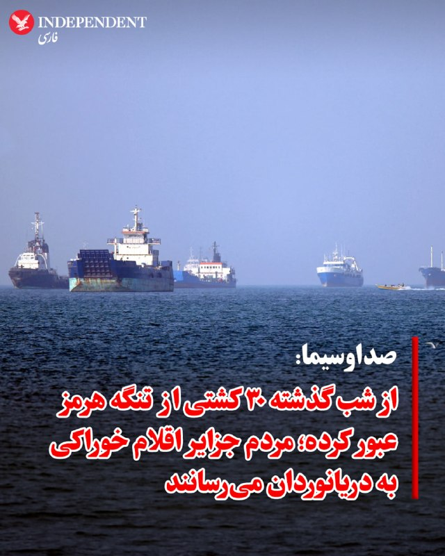

♦️ خبرنگار صداوسیما از استان هرمزگان، روز پنجشنبه ۲۴ اردیبهشت، گزارش داد که از شب گذشته تاکنون حدود ۳۰ کشتی توانسته‌اند با هماهنگی با نیروی دریایی سپاه پاسداران و رعایت ضوابط مورد نظر جمهوری اسلامی از تنگه هرمز عبور کنند.

بر اساس این گزارش، ساکنان جزایر ایران به این کشتی‌ها که اغلب بسیار بیشتر از میزان پیش‌بینی شده روی آب مانده‌اند، اقلام خوراکی تحویل داده‌اند. هم‌چنین اعلام شد که در صورت نیاز، دریانوردان می‌توانند درخواست تامین اقلام دارویی نیز ثبت کنند.
‌🇸🇦 Indypersian

🤖 @VahidOOnLine

## VahidOOnLine — post 240110

  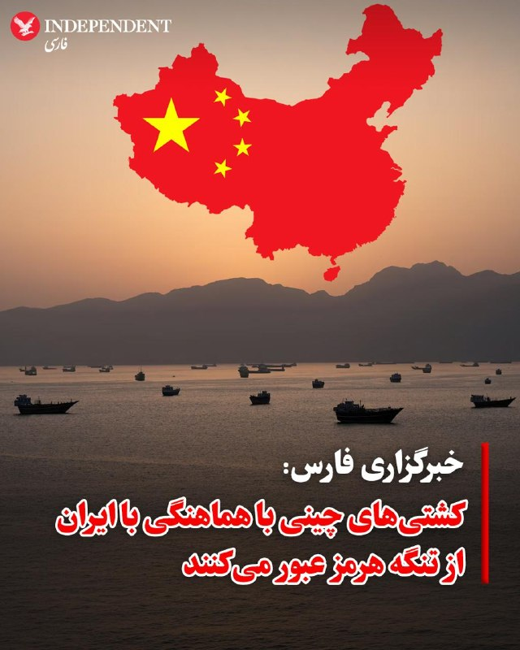

♦️خبرگزاری فارس، وابسته به سپاه پاسداران گزارش داد که از چهارشنبه شب تردد تعدادی از کشتی‌های چینی از تنگه هرمز در چارچوب ضوابط مدیریت ایران و بر اساس تفاهم میان تهران و پکن آغاز شده است. این تصمیم در پی رایزنی‌های وزیر امور خارجه و سفیر چین، و با توجه به روابط راهبردی دو کشور اتخاذ شد؛ به گونه‌ای که این شناورها پس از انطباق با ضوابط تعیین‌شده از سوی جمهوری اسلامی، مجوز تردد دریافت کرده‌اند.

یک منبع آگاه تاکید کرد که این اقدام طبق مقررات داخلی ایران انجام شده و نشان‌دهنده مدیریت کامل تهران بر امنیت این گذرگاه است. هم‌زمان، صداوسیما گزارش داد که از شب گذشته تاکنون در مجموع ۳۰ کشتی با نظارت مستقیم نیروی دریایی سپاه از تنگه هرمز عبور کرده‌اند.
‌🇸🇦 Indypersian

🤖 @VahidOOnLine

## VahidOOnLine — post 240109

  

مصطفی نخعی، عضو کمیسیون انرژی مجلس گفت: «ما با کسری بنزین مواجهیم و قبل از جنگ هم کمبود بنزین وجود داشت و روزانه حدود ۲۰ میلیون لیتر کسری بنزین داشتیم که باید با واردات جبران می‌کردیم.»

او ادامه داد: «سناریوهای مختلفی در خصوص بنزین در دولت در حال بررسی است اما هنوز سناریویی قطعی نشده است.»

این نماینده مجلس ادامه داد: «درحال حاضر یا سهمیه باید کاهش یابد یا از ابزار قیمتی استفاده شود که حداقل مجلس چندان موافق این موضوع نیست.»
‌🏁 🇬🇧 IranintlTV

🤖 @VahidOOnLine

## VahidOOnLine — post 240108

  

ایرنا، خبرگزاری رسمی دولت جمهوری اسلامی در گزارشی نوشت: «میزان ذخایر سدهای تهران نسبت به سال گذشته ۴۵ میلیون مترمکعب کاهش یافته و حجم آب موجود در پنج سد اصلی پایتخت افت قابل توجهی داشته است.»

معاون شرکت آب منطقه‌ای تهران نیز با اشاره به اینکه مخازن تنها حدود ۶۰ درصد ظرفیت نرمال را پر کرده‌اند، هشدار داد که پایتخت همچنان با شرایط خشکسالی مواجه است.
‌🏁 🇬🇧 IranintlTV

🤖 @VahidOOnLine

## VahidOOnLine — post 240107

  <a href="telegram/content/VahidOOnLine_240107_1778764136.mp4" target="_blank">🎬 Download video</a>

عباس عراقچی، وزیر خارجه جمهوری اسلامی، امارات متحده عربی را به مشارکت مستقیم در حملات نظامی علیه ایران متهم کرد و خواستار بازنگری ابوظبی در روابطش با اسرائیل شد.
عراقچی این اظهارات را در نشست وزیران خارجه بریکس در دهلی‌نو مطرح کرد. او گفت: «امارات مستقیماً در تجاوز علیه کشور من دخالت داشت و اجازه داد از خاکش برای شلیک تجهیزات و تسلیحات علیه ایران استفاده شود.»
وزیر خارجه جمهوری اسلامی همچنین با اشاره به عادی‌سازی روابط امارات و اسرائیل در سال ۲۰۲۰ گفت: «ائتلاف شما با اسرائیل هم از شما محافظت نکرد و باید در سیاست خود در قبال ایران تجدیدنظر کنید.»
‌🏁 🇬🇧 ManotoTV

🤖 @VahidOOnLine

## VahidOOnLine — post 240106

  <a href="telegram/content/VahidOOnLine_240106_1778764137.mp4" target="_blank">🎬 Download video</a>

یک شرکت امنیت دریایی اعلام کرد شناور هندی «ام‌اس‌وی حاج‌علی» در پی حمله‌ای ناشناس در آب‌های نزدیک عمان غرق شده است.
شرکت «ونگارد» اعلام کرد این کشتی باری با ۱۴ خدمه، در نزدیکی ساحل لیما در عمان، در جنوب تنگه هرمز، پس از وقوع انفجار غرق شد.
بر اساس این گزارش، کشتی در حال انتقال دام از بربره در منطقه سومالی‌لند به شارجه امارات متحده عربی بود که «احتمالاً بر اثر حمله پهپادی یا موشکی» دچار انفجار شد.
ونگارد اعلام کرد پس از وقوع آتش‌سوزی در کشتی، خدمه مجبور به ترک شناور شدند و کشتی سپس غرق شد.
وب‌سایت رهگیری کشتی‌ها «ماریتایم ترافیک» این شناور را یک لنج چوبی ۵۴ متری معرفی کرده است. وزارت خارجه هند پیش‌تر اعلام کرده بود همه خدمه این کشتی سالم نجات یافته‌اند.
‌🏁 🇬🇧 ManotoTV

🤖 @VahidOOnLine

## VahidOOnLine — post 240105

  

عباس مقتدایی، نایب رییس کمیسیون امنیت ملی مجلس گفت: «ما آنچه را اراده کنیم، به آمریکا و هم‌پیمانانش دیکته می‌کنیم، چرا که حاکمیت بر خلیج فارس، تنگه هرمز و دریای عمان موضوعی ذاتی و متعلق به کشور ماست.»
او افزود: «ترامپ نشان داد که باور به اینکه انسان‌ها می‌توانند از گرگ نیز بدتر و پلیدتر باشند، باوری ریشه‌دار، عمیق و واقعی است.»

او ادامه داد: «با آمادگی دفاعی می‌توانیم سایه جنگ را از سر کشور برداریم و با ایجاد انتظام در تنگه هرمز، این شاهراه حیاتی جهانی را که از نظر اقتصادی و سیاسی اهمیت بالایی دارد، به‌عنوان اهرمی برای دستیابی به حقوق ایران مورد بهره‌برداری قرار دهیم.»
iranintl
‌🏁 🇬🇧 IranintlTV

🤖 @VahidOOnLine

## VahidOOnLine — post 240104

  

محمدرضا عارف، معاون اول مسعود پزشکیان، گفت که تنگه هرمز مال ماست؛ ملک ما بوده و مدتی از ملک‌مان خوب استفاده نمی‌کردیم.

او افزود: «ما به هیچ قیمتی کنترل تنگه هرمز را از دست نخواهیم داد.» عارف ادامه داد: «در جنگ هر کس روایت تولید کرد، پیروز خواهد شد.»
iranintl
‌🏁 🇬🇧 IranintlTV

🤖 @VahidOOnLine

## VahidOOnLine — post 240103

  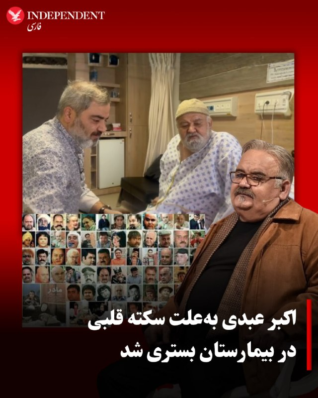

♦️المیرا عبدی فرزند اکبر عبدی، بازیگر نام‌آشنای سینما و تلویزیون ایران روز گفته است که پدرش از یک هفته پیش و در پی سکته قلبی در بخش مراقبت‌های ویژه بستری شده است.

به گزارش عصر ایران، المیرا عبدی گفت که مشخص نیست او چه زمانی مرخص می‌شود.
‌🇸🇦 Indypersian

🤖 @VahidOOnLine

## VahidOOnLine — post 240102

♦️دونالد ترامپ، رئیس جمهوری ایالات متحده آمریکا شامگاه پنجشنبه ۲۴ اردیبهشت (به وقت محلی) و در جریان ضیافت شام شی جین‌پینگ، گفتگوها با رئیس جمهوری چین را «فوق‌العاده مثبت و سازنده» توصیف کرد.

پیش از این کاخ سفید اعلام کرده بود که علاوه بر گفتگوها درباره تعرفه‌ها و تجارت، دو طرف بر سر لزوم بازگشایی تنگه هرمز و دست نیافتن ایران به سلاح هسته‌ای با یکدیگر موافقند.

ترامپ گفت: «ما امروز گفتگوها و جلسات بسیار مثبت و سازنده‌ای با هیئت چینی داشتیم و امشب فرصت مغتنمی است تا در میان دوستان، برخی از مواردی را که امروز مورد بحث قرار دادیم، مورد بحث قرار دهیم.»
‌🇸🇦 Indypersian

🤖 @VahidOOnLine

## VahidOOnLine — post 240101

  <a href="telegram/content/VahidOOnLine_240101_1778764141.mp4" target="_blank">🎬 Download video</a>

کاخ سفید اعلام کرد دونالد ترامپ و شی جین‌پینگ در دیدار خود در پکن درباره جنگ ایران، امنیت تنگه هرمز و برنامه هسته‌ای جمهوری اسلامی گفت‌وگو کرده‌اند.
بر اساس بیانیه کاخ سفید، دو طرف توافق کردند تنگه هرمز باید برای حفظ جریان آزاد انرژی باز بماند. شی جین‌پینگ همچنین مخالفت چین با نظامی‌سازی تنگه هرمز و هرگونه دریافت عوارض برای عبور کشتی‌ها را مطرح کرده است.
در این بیانیه آمده است رئیس‌جمهوری چین از تمایل پکن برای خرید بیشتر نفت آمریکا به‌منظور کاهش وابستگی به تنگه هرمز خبر داده و دو کشور نیز توافق کرده‌اند جمهوری‌اسلامی نباید به سلاح هسته‌ای دست پیدا کند.
کاخ سفید همچنین اعلام کرد دو رهبر درباره همکاری اقتصادی و مقابله با ورود مواد اولیه فنتانیل به آمریکا گفت‌وگو کرده‌اند.
در حالی که بیانیه چین تنها اشاره کوتاهی به موضوع ایران داشت، موضوع تایوان که شی جین‌پینگ آن را «مهم‌ترین مسئله» خوانده بود، در بیانیه واشینگتن مطرح نشد.
‌🏁 🇬🇧 ManotoTV

🤖 @VahidOOnLine

## VahidOOnLine — post 240100

  <a href="telegram/content/VahidOOnLine_240100_1778764141.mp4" target="_blank">🎬 Download video</a>

ترامپ در ضیافت شام رسمی که شی جین‌پینگ، رئیس‌جمهوری چین، در تالار بزرگ خلق پکن برگزار کرده حضور یافت.
ترامپ از شی جین‌پینگ و همسرش، پنگ لی‌یوان، برای سفر به آمریکا و حضور در کاخ سفید در ۲۴ سپتامبر دعوت کرد و گفت: «مایه افتخار من است که این دعوت را مطرح می‌کنم.»
‌🏁 🇬🇧 ManotoTV

🤖 @VahidOOnLine

## VahidOOnLine — post 240099

  

حسینعلی حاجی‌دلیگانی، عضو هیات رییسه مجلس، گفت که ادامه مذاکره با آمریکا اشتباه است و افزود واشینگتن برای آتش‌بس اصرار داشته و به دنبال خرید زمان با اهداف داخلی و انتخاباتی بوده است.

حاجی‌دلیگانی افزود: «خطوط فیبر نوری عبوری از بستر تنگه هرمز نیز باید شامل عوارض سالانه باشند.»

او گفت: «کل تنگه هرمز در حوزه سرزمینی ایران قرار می‌گیرد و مدیریت آن باید در اختیار جمهوری اسلامی باشد.»
iranintl
‌🏁 🇬🇧 IranintlTV

🤖 @VahidOOnLine

## VahidOOnLine — post 240098

  

♦️دونالد ترامپ، رئیس جمهوری ایالات متحده شامگاه پنحشنبه ۲۴ اردیبهشت و در جریان سخنرانی در ضیافت شام رئیس جمهوری چین در پکن، شی جین‌پینگ را برای سفر رسمی به واشنگتن در تاریخ دوم مهرماه، دعوت کرد.
شی جین‌پینگ پیش از این در سال ۲۰۲۳ و برای شرکت در اجلاس سران آسیاپاسیفیک به سانفرانسیسکو سفر کرده بود.
‌🇸🇦 Indypersian

🤖 @VahidOOnLine

## VahidOOnLine — post 240097

  

♦️خبرگزاری فارس، وابسته به سپاه پاسداران، روز پنجشنبه ۲۴ اردیبهشت ماه به نقل از یک «منبع آگاه» گزارش کرد که کشتی‌های چینی از شامگاه پنجشنبه «با تصمیم جمهوری اسلامی، امکان عبور تعدادی از کشتی‌های چینی از تنگه هرمز با رعایت پروتکل مدیریت ایرانی تنگه میسر شد.»

ساعتی پس از انتشار این خبر، صداوسیما به‌نقل از نیروی دریایی سپاه گزارش کرد «از شب گذشته تاکنون ۳۰ فروند کشتی از تنگه هرمز با مجوز ایران عبور کرده‌اند.»
‌🇸🇦 Indypersian

🤖 @VahidOOnLine

## VahidOOnLine — post 240096

  

دانشجویان متحد گزارش داد متین زمانیان، دانشجوی کارشناسی علوم سیاسی دانشگاه آزاد تهران مرکز، با گذشت بیش از یک‌ماه از بازداشت، در زندان تهران بزرگ نگهداری می‌شود.

بنا بر این گزارش متین زمانیان در طول دوران بازداشت، از حق دسترسی به وکیل مستقل و دادرسی عادلانه محروم مانده است.
iranintl
‌🏁 🇬🇧 IranintlTV

🤖 @VahidOOnLine

## mwarmonitor — post 9078

🇺🇸وزارت بازرگانی ایالات متحده آمریکا فروش تراشه‌های هوش مصنوعی H200 شرکت انویدیا را به ۱۰ شرکت چینی، در قالب مجوزهایی که برای هر مشتری تا سقف ۷۵ هزار تراشه را اجازه می‌دهد، تأیید کرده است. با وجود این تأییدها، تاکنون هیچ محموله‌ای ارسال نشده است.

@mwarmonitor

## mwarmonitor — post 9077

  

🇺🇸دریادار برد کوپر، فرمانده فرماندهی مرکزی ایالات متحده (CENTCOM)، صبح امروز درباره وضعیت و آرایش عملیاتی سنتکام در کنگره شهادت خواهد داد.

@mwarmonitor

## mwarmonitor — post 9075

🔴گزارش تری یینگست خبرنگار فاکس نیوز (Trey Yingst) از تل‌آویو

🔸تری یینگست: بله بچه‌ها، صبح بخیر. ببینید، چینی‌ها بزرگترین واردکننده نفت خام ایران در جهان هستند و احتمالاً رئیس‌جمهور ترامپ این موضوع را در طول گفتگوهای جاری خود در پکن مطرح کرده است. وقتی به اقدامات نظامی ایران در تنگه هرمز و برنامه هسته‌ای این کشور نگاه می‌کنیم، هر دو مستقیماً از طریق همین صادرات نفت تأمین مالی می‌شوند.
گزارش‌های امروز صبح نشان می‌دهد که ایران کشتی دیگری را در سواحل امارات متحده عربی توقیف کرده است. وزیر امور خارجه، مارکو روبیو، به شان هنیتی (Sean Hannity) در فاکس نیوز گفت که چینی‌ها باید نقش فعال‌تری در وادار کردن ایران به تغییر مسیر ایفا کنند.

📌صحبت‌های مارکو روبیو (وزیر امور خارجه)

🔸مارکو روبیو: از آنجایی که اقتصاد بسیاری از کشورهای جهان به دلیل این بحران در تنگه‌ها در حال فروپاشی است، آن‌ها محصولات چینی کمتری خواهند خرید و صادرات چین به شدت کاهش خواهد یافت. بنابراین، حل این موضوع به نفع خود آن‌هاست. ما امیدواریم آن‌ها را متقاعد کنیم که نقش فعال‌تری ایفا کرده و ایران را وادار کنند تا از اقداماتی که در حال حاضر در خلیج فارس انجام می‌دهد، دست بکشد.

📌صحبت‌های جی.دی. ونس (معاون رئیس‌جمهور)

🔸تری یینگست: در مورد احتمال توافق از طریق مذاکره، معاون رئیس‌جمهور، جی.دی. ونس، اشاره کرد که در هفته‌های اخیر پیشرفت‌هایی حاصل شده است، اما این سوال باقی می‌ماند که آیا این پیشرفت برای جلوگیری از شروع مجدد جنگ کافی است یا خیر.
🔴جی.دی. ونس: من می‌خواهم بتوانم در چشم مردم آمریکا نگاه کنم و با اطمینان بگویم که دیگر لازم نیست نگران دسترسی این رژیم بسیار خطرناک به خطرناک‌ترین سلاح‌های جهان باشید. این هدفی است که ما روی آن تمرکز کرده‌ایم. باز هم می‌گویم، راه‌های زیادی برای دستیابی به این هدف وجود دارد؛ رئیس‌جمهور فعلاً ما را در مسیر دیپلماتیک قرار داده است و این چیزی است که من روی آن تمرکز دارم.

🇮🇷صحبت‌های عباس عراقچی (وزیر امور خارجه ایران)

🔸تری یینگست: ایرانی‌ها در بحبوحه تنش‌های فزاینده در منطقه، همچنان به سخنرانی و تهدید ادامه می‌دهند. وزیر امور خارجه ایران گفت که این کشور هم برای دیپلماسی و هم برای جنگ آماده است.
🔹عباس عراقچی: ما همان‌طور که آماده‌ایم با تمام قوا از آزادی و خاک خود دفاع کنیم، به همان اندازه آماده‌ایم که دیپلماسی را دنبال کرده و از آن دفاع کنیم. همان‌طور که بارها اعلام کرده‌ام، هیچ راه حل نظامی برای هیچ موضوعی در رابطه با ایران وجود ندارد. ما ایرانی‌ها هرگز در برابر هیچ فشار یا تهدیدی سر خم نمی‌کنیم، اما به زبان احترام، با احترام پاسخ می‌دهیم.

🔴تری یینگست: در اینجا در اسرائیل، درگیری علیه بزرگترین نیروی نیابتی ایران، یعنی حزب‌الله در جنوب لبنان ادامه دارد. این گروه اوایل امروز پهپادهایی را به سمت مرز پرتاب کرد که منجر به زخمی شدن سه نفر در شمال اسرائیل شد. بچه‌ها؟

🔰مجری استودیو: واو، اتفاقات زیادی در آنجا در جریان است. تری، وقتی این نشست (در چین) تمام شود، همه نگاه‌ها به کارهایی خواهد بود که شما الان انجام می‌دهید. اما در حال حاضر تمرکز روی چین و چگونگی ارتباط آن با ایران است.

@mwarmonitor

## mwarmonitor — post 9074

  <a href="telegram/content/mwarmonitor_9074_1778764148.mp4" target="_blank">🎬 Download video</a>

🎬 Video

## mwarmonitor — post 9073

🇺🇸وزیر خزانه‌داری ایالات متحده، بَسِنت، درباره ایران گفت:
«ما معتقدیم به نقطه‌ای رسیده‌ایم که ایران نه به سربازانش حقوق می‌دهد و نه ذخایر تسلیحاتی خود را از خارج تأمین و تجدید می‌کند.»

@mwarmonitor

## mwarmonitor — post 9072

  

🔸عالم مبارز بحرینی: آل خلیفه اگر از خصومت با ملت بحرین دست برندارند، ساقط خواهند شد

🔹«عبدالله الدقاق» به‌دنبال تشدید سرکوبگری رژیم آل‌خلیفه در قالب شکنجه، پیگرد و سلب تابعیت شهروندان بحرینی به ویژه علما و مداحان، یک نشست مطبوعاتی برگزار کرد.

📝در این قاب، با موجودی روبه‌رو هستیم که با وقاحت تمام، ژستِ حق‌به‌جانب گرفته و برای دیگران حکم سقوط صادر می‌کند. این انتر که به اسم «عالم مبارز» معرفی شده، در واقع یک گوریلِ قلمروطلب است که بوی گندِ تفکراتش حتی از پشت عکس هم به مشام می‌رسد؛ موجودی که دقیقاً مثل اجداد وحشی‌اش در ۱۴۰۰ سال پیش، تنها هنرش تبدیل «علم» به ابزاری برای کشت و کشتار و سلاخیِ منتقدان است. این آخوند صادراتی، در حالی که خودش تجسمِ شکنجه و سلب آزادی است، با وقاحتی بی‌مرز از «حقوق بشر» دم می‌زند تا روی ماهیت کثیف و فرقه‌ای خود سرپوش بگذارد . فاجعه اینجاست که این جانور، هر نکبت و فلاکتی را به پروژه‌های خارجی ربط می‌دهد، در حالی که خودش و آن عمامه‌ی ننگینش، بزرگ‌ترین ویروس برای موجودیت و امنیت بشریت هستند.

@mwarmonitor

## pm_afshaa — post 90740

  <a href="telegram/content/pm_afshaa_90740_1778764152.webm" target="_blank">🎬 Download video</a>

🔴عارف، معاون اول پزشکیان: به هیچ قیمتی کنترل تنگه هرمز رو از دست نمیدیم.

💧 Rainbet.com the #1 Non-KYC Crypto Casino & Sportsbook @rainbetcom

😁 @Pm_Afshaa

## pm_afshaa — post 90739

🔴وزیر خزانه داری آمریکا:ایران رو انقدر تحت فشار اقتصادی قرار دادیم که توی پرداخت حقوق نیروهاشم به مشکل خورده. دارن نفسای آخرشونو میکشن

💧 Rainbet.com the #1 Non-KYC Crypto Casino & Sportsbook @rainbetcom

😁 @Pm_Afshaa

## pm_afshaa — post 90738

  <a href="telegram/content/pm_afshaa_90738_1778764153.webm" target="_blank">🎬 Download video</a>

🔴وزیر خزانه‌داری آمریکا: باز شدن تنگه هرمز به نفع چین خواهد بود و انتظار داریم قیمت نفت در شش ماه آینده کاهش یابد

💧 Rainbet.com the #1 Non-KYC Crypto Casino & Sportsbook @rainbetcom

😁 @Pm_Afshaa

## pm_afshaa — post 90737

  <a href="telegram/content/pm_afshaa_90737_1778764153.mp4" target="_blank">🎬 Download video</a>

ایلان ماسک هم خوب مست کرده

💧 Rainbet.com the #1 Non-KYC Crypto Casino & Sportsbook @rainbetcom

😁 @Pm_Afshaa

## pm_afshaa — post 90736

  <a href="telegram/content/pm_afshaa_90736_1778764155.webm" target="_blank">🎬 Download video</a>

🔴شی جین‌پینگ در ضیافت با ترامپ:
چین و آمریکا باید شریک باشن، نه رقیب؛ عظمت دوباره آمریکا و احیای چین میتونن همزمان پیش برن.

ترامپ هم پس از این سخنان، روابط واشینگتن و پکن رو یکی از تاثیرگذارترین روابط تاریخ بشر توصیف کرد و دیدارهای انجام‌شده با مقام‌های چینی رو مثبت و سازنده خواند.

💧 Rainbet.com the #1 Non-KYC Crypto Casino & Sportsbook @rainbetcom

😁 @Pm_Afshaa

## pm_afshaa — post 90732

ترامپ یه جور داره رفتار میکنه که انگار رئیس جمهور چین اومده آمریکا

💧 Rainbet.com the #1 Non-KYC Crypto Casino & Sportsbook @rainbetcom

😁 @Pm_Afshaa

## pm_afshaa — post 90730

  <a href="telegram/content/pm_afshaa_90730_1778764156.webm" target="_blank">🎬 Download video</a>

🔴اکسیوس: یک مشاور ترامپ اذعان کرد مشکل اینه که ایران زمان بیشتری داره و آنها روی تقویم سیاسی ما حساب باز کردن تا به سودشون تمام بشه.

💧 Rainbet.com the #1 Non-KYC Crypto Casino & Sportsbook @rainbetcom

😁 @Pm_Afshaa

## pm_afshaa — post 90729

  <a href="telegram/content/pm_afshaa_90729_1778764157.webm" target="_blank">🎬 Download video</a>

🔴صداوسیما به‌نقل از نیروی دریایی سپاه:
از شب گذشته تاکنون 30 تا کشتی از تنگۀ هرمز با مجوز جمهوری اسلامی عبور کردن.

💧 Rainbet.com the #1 Non-KYC Crypto Casino & Sportsbook @rainbetcom

😁 @Pm_Afshaa

## pm_afshaa — post 90728

🔴وزیر خزانه‌داری آمریکا: تأسیسات اصلی بارگیری نفت ایران به مدت 3 روز است از سرویس خارج شده

💧 Rainbet.com the #1 Non-KYC Crypto Casino & Sportsbook @rainbetcom

😁 @Pm_Afshaa

## kianmeli1 — post 87401

‏🔴شی جین‌پینگ، رییس‌جمهوری چین، در ضیافت رسمی به افتخار ترامپ گفت که دو کشور باید شریک باشند، نه رقیب

‏شی جین‌پینگ گفت که دو شعار «نوزایی چین» و «عظمت را دوباره به آمریکا بازگردانیم» می‌توانند در کنار یکدیگر پیش بروند
https://t.me/kianmeli1

## kianmeli1 — post 87400

🔴بلومبرگ: ۴ روز است که از خارک بارگیری نفت نمی‌شود و اسکله‌های نفتی کاملاً خالی است

صادرات نفت از جزیره خارک برای نخستین بار از آغاز جنگ، چند روز متوقف شد
https://t.me/kianmeli1

## IranIntlTV — post 337169

  <a href="telegram/content/IranIntlTV_337169_1778764158.mp4" target="_blank">🎬 Download video</a>

رویترز گزارش داد جنگ ایران، روند گفت‌وگوهای صلح میان دولت ترکیه و کردها را با اختلال روبه‌رو کرده است. بر اساس این گزارش، آنکارا به دلیل نگرانی از گسترش تنش‌های منطقه‌ای، اجرای اصلاحات سیاسی را متوقف کرده و بر خلع سلاح کامل پ‌ک‌ک تاکید دارد.
نرگس هورخش، خبرنگار ایران‌اینترنشنال، گزارش می‌دهد
@iranintltv

## IranIntlTV — post 337168

  

علی مطهری، نایب‌رییس پیشین مجلس، گفت: «امارات متحده عربی خبیث‌ترین کشور خلیج فارس است و به اسرائیل نزدیک شده است.»
او افزود: «اتکای امارات به حمایت آمریکا باعث شده علیه جمهوری اسلامی موضع‌گیری کند و در صورت تضعیف موقعیت آمریکا، امارات نیز سر عقل خواهد آمد.»
https://iranintl.com/202605145020

## IranIntlTV — post 337167

  <a href="telegram/content/IranIntlTV_337167_1778764161.mp4" target="_blank">🎬 Download video</a>

دیدار دونالد ترامپ با شی جین‌پینگ، واکنش گسترده کاربران رسانه‌های اجتماعی را به همراه داشته است. کاربران علاوه‌بر ابعاد سیاسی و اقتصادی، به حاشیه‌های این سفر از جمله زبان بدن دو رهبر، حضور مارکو روبیو در هیات آمریکایی و موضوع رقابت تکنولوژیک واکنش نشان داده‌اند.
عادله بورنگ، عضو تحریریه ایران‌اینترنشنال، از واکنش کاربران می‌گوید
@iranintltv

## IranIntlTV — post 337166

🗣روایت شما از بحران اقتصادی و زندگی در آتش‌بس- پنج‌شنبه ۲۴ اردیبهشت:

🔹این چند وقت فشار روانی زیادی بر دانش‌آموزان بوده و در کمال ناباوری، آموزش و پرورش تصمیم به حضوری بودن امتحانات گرفته. از والدین محترم می‌خوام شرایط روانی فرزندان‌شون رو درک و اگر می‌تونن اعتراضی کنن.

🔹از شهسوار: زندگی برای خیلی از ما سخت شده؛ گرونی، فشارهای روزمره و نگرانی از آینده هر روز بیشتر حس می‌شه. این چیزیه که خیلی‌هامون داریم تجربه‌اش می‌کنیم و امیدوارم صدامون شنیده بشه.

🔹از شیراز: مرغ کیلویی ۵۰۰ هزار تومان، برنج کیلویی ۲۷۰ هزار تومان و تخم‌مرغ دانه‌ای ۲۲ هزار تومان. من که ۱۵ میلیون تومان حقوقمه چطوری می‌تونم زندگی کنم؟

🔹بعد از ۳۷ سال زندگی، با ۱۶ سال سابقه کار تخصصی در زمینه تحصیلاتم (کارشناسی ارشد مکانیک جامدات) و درآمدی که تازه در مقایسه با بقیه مشاغل نسبتا خوب محسوب می‌شه، هیچ امیدی به آینده ندارم. حقوقم فقط خرج روزمره زندگیم می‌شه.

🔹چهارشنبه رفتم بنزین بزنم. با کارت خودم نتونستم، چون سهمیه شخصی تموم شده بود. مسئول جایگاه هم فقط در صورتی کارت آزاد می‌داد که به خودش مستقیم پول بدیم. ۱۵ لیتر بیشتر هم نمیدن و هر لیتری به قیمت ۷ هزار تومان.

🔹قیمت یک پیتزا خانواده در تهران دست‌کم یک میلیون تومان شده؛ یعنی حدود ۵ دلار. در صورتی که درآمد خیلی از خانوارها از ۶۰ دلار در ماه شروع می‌شه. این یک مثال از قدرت خرید مردم در پایتخت بود.

🔹جمهوری اسلامی هیچ‌وقت معیشت مردم براش مهم نبود و حتی خیریه‌ها و موسسه‌های مردم‌نهاد و مستقل رو از بین برد تا همه وابسته به خودش باشن و همه‌چیز رو کنترل کنه.

🔹۲۶ سالمه و فروشگاه پوشاک داشتم. ۴ سال پیش تمام طلاهای مادرم رو فروختم برای راه‌اندازی بوتیک. امسال ورشکست شدم. غم و استرس بیکاری داره نابودم می‌کنه.

🔹 پدرم ۳۲ سال در مخابرات کار کرد و بازنشسته شده است. الان نزدیک یک سال و ۲ ماه هست که سنوات بازنشستگیش را ندادن. این وضعیت برای یک بازنشسته که کل زندگیش را برای کار گذاشته، مناسب نیست.

## IranIntlTV — post 337165

  

یسرائیل کاتز، وزیر دفاع اسرائیل در یک سخنرانی گفت که ماموریت ارتش این کشور درباره ایران کامل نشده و برای این احتمال آماده است که شاید دوباره ناچار به اقدام شود.
یسرائیل کاتز تاکید کرد: «اگر اهداف‌مان تامین نشود، دوباره اقدام خواهیم کرد.»

پیش از این نیز ایال زمیر، رییس ستاد کل ارتش اسرائیل، گفته بود که «نبرد به پایان نرسیده و ارتش برای ازسرگیری جنگ در صورت نیاز آماده است.»
https://iranintl.com/202605143284

## IranIntlTV — post 337164

  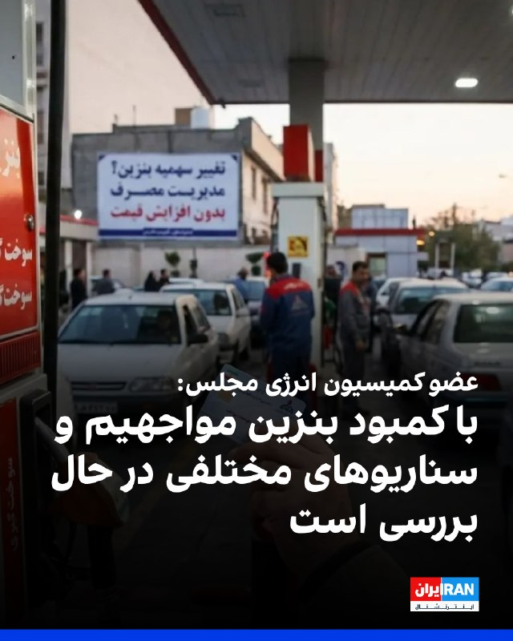

مصطفی نخعی، عضو کمیسیون انرژی مجلس گفت: «ما با کسری بنزین مواجهیم و قبل از جنگ هم کمبود بنزین وجود داشت و روزانه حدود ۲۰ میلیون لیتر کسری بنزین داشتیم که باید با واردات جبران می‌کردیم.»

او ادامه داد: «سناریوهای مختلفی در خصوص بنزین در دولت در حال بررسی است اما هنوز سناریویی قطعی نشده است.»

این نماینده مجلس ادامه داد: «درحال حاضر یا سهمیه باید کاهش یابد یا از ابزار قیمتی استفاده شود که حداقل مجلس چندان موافق این موضوع نیست.»
https://iranintl.com/202605148048

## IranIntlTV — post 337163

  

🔻توماس راشل، نماینده دولت فدرال آلمان در امور آزادی دین و عضو پارلمان این کشور، رسماً کفالت سیاسی پیوند و برنا نعیمی را بر عهده گرفت. این دو جوان ورزشکار بهایی که با اتهامات سنگین و خطر اعدام روبه‌رو هستند، به نمادی از سرکوب جامعه ورزشی و اقلیت‌های مذهبی در ایران بدل شده‌اند.

🔹به گزارش انجمن «زن، زندگی، آزادی» در آلمان، پیوند نعیمی، ورزشکار رشته شنا و واترپلو از ژانویه ۲۰۲۶ در بازداشتگاه‌های سپاه تحت شدیدترین شکنجه‌ها قرار گرفته است و اعترافات اجباری او از صداوسیما پخش شده است.

🔹به گزارش این انجمن حقوق بشری، برنا نعیمی، کاراته‌کا و پدر یک فرزند خردسال، پس از تحمل شوک الکتریکی و «اعدام‌های نمایشی»، مجبور به امضای اعترافاتی علیه خود و پسرعمویش، پیوند نعیمی شده است.

🔹پیش‌تر، جامعه جهانی بهائی در بیانیه‌ای نوشت که پیوند و برنا نعیمی در حالی به دخالت در حوادث اعتراضات دی‌ماه متهم شده‌اند که مدارک نشان می‌دهد پیوند در زمان وقوع حادثه در بازداشت بوده است. این دو ورزشکار بدون دسترسی به دادگاه عادلانه، تحت شکنجه‌های غیرانسانی برای پذیرش اتهامات ساختگی قرار دارند.

@iranintltvsport

## IranIntlTV — post 337162

  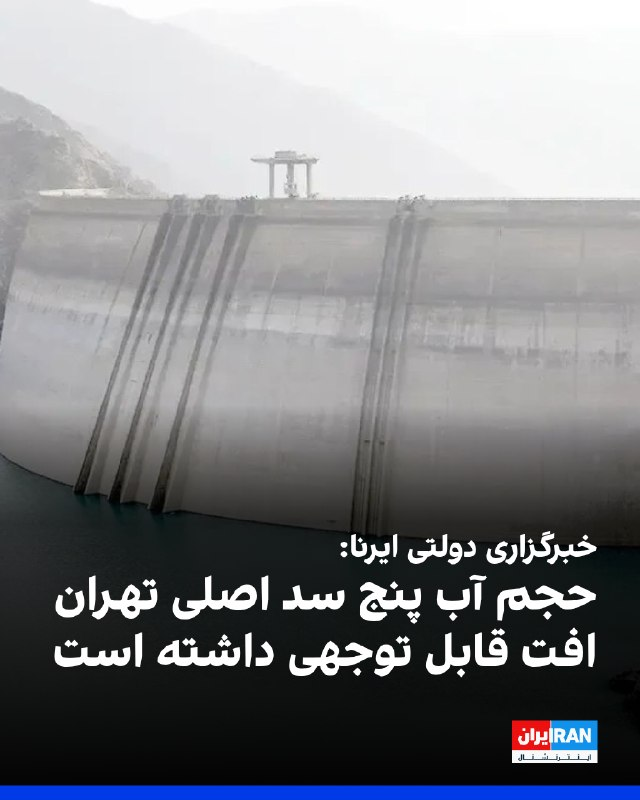

ایرنا، خبرگزاری رسمی دولت جمهوری اسلامی در گزارشی نوشت: «میزان ذخایر سدهای تهران نسبت به سال گذشته ۴۵ میلیون مترمکعب کاهش یافته و حجم آب موجود در پنج سد اصلی پایتخت افت قابل توجهی داشته است.»

معاون شرکت آب منطقه‌ای تهران نیز با اشاره به اینکه مخازن تنها حدود ۶۰ درصد ظرفیت نرمال را پر کرده‌اند، هشدار داد که پایتخت همچنان با شرایط خشکسالی مواجه است.
https://iranintl.com/202605149178

## IranIntlTV — post 337161

  

عباس مقتدایی، نایب رییس کمیسیون امنیت ملی مجلس گفت: «ما آنچه را اراده کنیم، به آمریکا و هم‌پیمانانش دیکته می‌کنیم، چرا که حاکمیت بر خلیج فارس، تنگه هرمز و دریای عمان موضوعی ذاتی و متعلق به کشور ماست.»
او افزود: «ترامپ نشان داد که باور به اینکه انسان‌ها می‌توانند از گرگ نیز بدتر و پلیدتر باشند، باوری ریشه‌دار، عمیق و واقعی است.»

او ادامه داد: «با آمادگی دفاعی می‌توانیم سایه جنگ را از سر کشور برداریم و با ایجاد انتظام در تنگه هرمز، این شاهراه حیاتی جهانی را که از نظر اقتصادی و سیاسی اهمیت بالایی دارد، به‌عنوان اهرمی برای دستیابی به حقوق ایران مورد بهره‌برداری قرار دهیم.»
iranintl.com/202605140403

## IranIntlTV — post 337160

  

محمدرضا عارف، معاون اول مسعود پزشکیان، گفت که تنگه هرمز مال ماست؛ ملک ما بوده و مدتی از ملک‌مان خوب استفاده نمی‌کردیم.

او افزود: «ما به هیچ قیمتی کنترل تنگه هرمز را از دست نخواهیم داد.» عارف ادامه داد: «در جنگ هر کس روایت تولید کرد، پیروز خواهد شد.»
iranintl.com/202605143228

## IranIntlTV — post 337159

  <a href="telegram/content/IranIntlTV_337159_1778764168.mp4" target="_blank">🎬 Download video</a>

سرخط خبرهای پنجشنبه ۲۴ اردیبهشت
@iranintltv

## IranIntlTV — post 337158

  <a href="telegram/content/IranIntlTV_337158_1778764170.mp4" target="_blank">🎬 Download video</a>

ایران‌اینترنشنال از همه افرادی که درباره وقایع بیمارستان الغدیر تهران در ۱۸ و ۱۹ دی‌ماه شواهد، اسناد یا اطلاعاتی دارند خواسته است از طریق بات اینتل‌مدیا، اطلاعات خود را ارسال کنند.

جزییات بیشتر در گفت‌وگو با فرنوش فرجی، عضو تحریریه ایران‌اینترنشنال
@iranintltv

## IranIntlTV — post 337157

  <a href="telegram/content/IranIntlTV_337157_1778764173.mp4" target="_blank">🎬 Download video</a>

فیلم «داستان‌های موازی» ساخته اصغر فرهادی، به‌طور رسمی در بخش مسابقه اصلی جشنواره کن به نمایش درمی‌آید. سینمای مستقل، مهاجرت، تبعید و حضور فیلمسازان ایرانی در بخش‌های مختلف، از محورهای مورد توجه جشنواره امسال است.
لی‌لی نیکفر، خبرنگار ایران‌اینترنشنال، گزارش می‌دهد
@iranintltv

## IranIntlTV — post 337156

  

حسینعلی حاجی‌دلیگانی، عضو هیات رییسه مجلس، گفت که ادامه مذاکره با آمریکا اشتباه است و افزود واشینگتن برای آتش‌بس اصرار داشته و به دنبال خرید زمان با اهداف داخلی و انتخاباتی بوده است.

حاجی‌دلیگانی افزود: «خطوط فیبر نوری عبوری از بستر تنگه هرمز نیز باید شامل عوارض سالانه باشند.»

او گفت: «کل تنگه هرمز در حوزه سرزمینی ایران قرار می‌گیرد و مدیریت آن باید در اختیار جمهوری اسلامی باشد.»
iranintl.com/202605145331

## IranIntlTV — post 337154

🔻بازدید مسعود پزشکیان، رئیس دولت جمهوری اسلامی و احمد دنیامالی، وزیر ورزش و جوانان از مجموعه ورزشی آزادی.

🔹در هفته اول جنگ، ایران‌اینترنشنال گزارش داد که پس از آغاز حملات اسرائیل و آمریکا در نهم اسفندماه، به کارکنان و پرسنل فدراسیون‌ها و مراکز مستقر در مجموعه ورزشی آزادی در تهران دستور داده شد  ساختمان‌ها و سالن‌های ورزشی این مجموعه را تخلیه کنند.

🔹طبق این اطلاعات، پس از تخلیه کارکنان، نیروهای حکومتی از جمله یگان ویژه و بسیج در بخش‌های مختلف این مجموعه مستقر شدند.

🔹پس از این ماموران در سالن‌های مختلف از جمله ورزشگاه ۱۲ هزار نفری آزادی و همچنین سالن‌ها و ساختمان‌های متعلق به فدراسیون‌های ورزشی از جمله کشتی، والیبال، بسکتبال و وزنه‌برداری مستقر شدند.

🔹در پی این اقدامات، سالن ۱۲ هزار نفری ورزشگاه آزادی در حملات هوایی روز پنجشنبه ۱۴ اسفند ۱۴۰۴، تخریب شد.

@iranintltvsport

## IranIntlTV — post 337153

  <a href="telegram/content/IranIntlTV_337153_1778764176.mp4" target="_blank">🎬 Download video</a>

بیمارستان الغدیر تهران شامگاه ۱۸ و ۱۹ دی‌ماه، شاهد گوشه‌ای از جنایتی بود که جمهوری اسلامی علیه معترضان مرتکب شد. ده‌ها پیکر بی‌جان و شمار زیادی از مجروحان به این بیمارستان منتقل شدند و به دلیل کمبود فضای سردخانه، تعدادی از کشته‌شدگان، پتوپیچ در حیاط پشت بیمارستان رها شدند. ایران‌اینترنشنال با هدف روشن کردن ابعاد جنایت در بیمارستان الغدیر تهران در ۱۸ و ۱۹ دی‌ماه، کارزاری مردمی برای شناسایی جاویدنامانی که به این بیمارستان منتقل شده بودند راه‌اندازی کرده و تاکنون هویت ۹ نفر از آن‌ها را شناسایی کرده است.
از همه افرادی که درباره وقایع بیمارستان الغدیر تهران شواهد، اسناد یا اطلاعاتی دارند می‌خواهیم از طریق بات اینتل‌مدیا، اطلاعات خود را ارسال کنند و راوی حقیقت باشند.

گزارش آبتین یزدان‌پناه، خبرنگار ایران‌اینترنشنال
@iranintltv

## IranIntlTV — post 337152

  

دانشجویان متحد گزارش داد متین زمانیان، دانشجوی کارشناسی علوم سیاسی دانشگاه آزاد تهران مرکز، با گذشت بیش از یک‌ماه از بازداشت، در زندان تهران بزرگ نگهداری می‌شود.

بنا بر این گزارش متین زمانیان در طول دوران بازداشت، از حق دسترسی به وکیل مستقل و دادرسی عادلانه محروم مانده است.
iranintl.com/202605143017

## Shin_Persian — post 5998

Samim ✓ @PawnToPromotion Thu, 14 May 2026 10:14:23 UTC آپدیت «خیلی مهم» برای کلاینت شیر و خورشید 2026.05.14: تنظیمات بیشتر برای CDN Domain Fronting: توجه کنید سایفون خودش دامین فرانتینگ انجام میده! ولی اون روش MitM که @patterniha پیدا کرد تنظیمات و جزییات…

## Shin_Persian — post 5997

Samim ✓ @PawnToPromotion
Thu, 14 May 2026 10:14:23 UTC

آپدیت «خیلی مهم» برای کلاینت شیر و خورشید 2026.05.14:

تنظیمات بیشتر برای CDN Domain Fronting: توجه کنید سایفون خودش دامین فرانتینگ انجام میده! ولی اون روش MitM که @patterniha پیدا کرد تنظیمات و جزییات دامین فرانتینگ متفاوتی داره. در این آپدیت٬ کلاینت شیر و خورشید کاری مشابه به چیزی که @patterniha ها معرفی کرد انجام میده با این تفاوت که این روش در هسته شیر و خورشید اضافه شده پس دیگه نیازی به xray و cert وکارای دیگه نیست.

۱. آپدیت رو نصب کنید
۲. پروتکل را روی یکی از حالت های Auto یا Direct یا CDN Fronting تنظیم کنید
۳. کلاینت شیر و خورشید باید الان خودش به تنهایی وصل بشه براتون!

قابلیت تنظیمات بیشتر برای SNI و IP هم وجود داره که فعلا بهش نیازی نیست و میتونید خالی بگذارید باشه. ولی برای آینده شاید به کار بیاد.

میتونید از اینجا دانلود و نصب کنید و ممنون میشم اگه repost کنید که تعداد بیشتری ببینند:

https://github.com/shirokhorshid/shirokhorshid-android/releases/tag/v2026.05.14-8a28d0c

در تلگرام هم آپلود کردم اگر براتون راحت تر هست میتونید از اونجا آپدیت رو بگیرید:

https://t.me/+aF04HaDSxVI4ZGEx

English

"Very Important" update for the Lion and Sun client 2026.05.14:

More settings for CDN Domain Fronting: Note that Psiphon performs its own domain fronting! However, the MitM (Man-in-the-Middle) method discovered by @patterniha involves different domain fronting settings and details. In this update, the Lion and Sun client performs an action similar to what @patterniha introduced, with the difference that this method has been integrated into the Lion and Sun core, so there is no longer a need for Xray, certificates, or other manual tasks.

1. Install the update.
2. Set the protocol to one of the following modes: Auto, Direct, or CDN Fronting.
3. The Lion and Sun client should now connect for you on its own!

There are also additional configuration options for SNI (Server Name Indication) and IP, which are not currently needed and can be left blank. However, they may be useful in the future.

You can download and install it from here, and I would appreciate it if you reposted so more people can see it:

https://github.com/shirokhorshid/shirokhorshid-android/releases/tag/v2026.05.14-8a28d0c

I have also uploaded it to Telegram; if it is easier for you, you can get the update from there:

https://t.me/+aF04HaDSxVI4ZGEx

𝕏 · @shin_persian

## Shin_Persian — post 5996

  

UKMTO Operations Centre @UK_MTO
Thu, 14 May 2026 07:00:22 UTC

UKMTO WARNING 057-26

Click here to view the full warning⤵️
http://www.ukmto.org/-/media/ukmto/products/20260514-ukmto_057_26_warning_suspicious-activity.pdf?rev=67da24ed8b4f43389506d6abbb5fb841

#MaritimeSecurity #MarSec

فارسی

هشدار UKMTO 057-26

برای مشاهده متن کامل هشدار اینجا کلیک کنید⤵️
http://www.ukmto.org/-/media/ukmto/products/20260514-ukmto_057_26_warning_suspicious-activity.pdf?rev=67da24ed8b4f43389506d6abbb5fb841

#MaritimeSecurity #MarSec_

𝕏 · @shin_persian

## ManotoTV — post 105445

  <a href="telegram/content/ManotoTV_105445_1778764181.mp4" target="_blank">🎬 Download video</a>

عباس عراقچی، وزیر خارجه جمهوری اسلامی، امارات متحده عربی را به مشارکت مستقیم در حملات نظامی علیه ایران متهم کرد و خواستار بازنگری ابوظبی در روابطش با اسرائیل شد.
عراقچی این اظهارات را در نشست وزیران خارجه بریکس در دهلی‌نو مطرح کرد. او گفت: «امارات مستقیماً در تجاوز علیه کشور من دخالت داشت و اجازه داد از خاکش برای شلیک تجهیزات و تسلیحات علیه ایران استفاده شود.»
وزیر خارجه جمهوری اسلامی همچنین با اشاره به عادی‌سازی روابط امارات و اسرائیل در سال ۲۰۲۰ گفت: «ائتلاف شما با اسرائیل هم از شما محافظت نکرد و باید در سیاست خود در قبال ایران تجدیدنظر کنید.»

## ManotoTV — post 105444

  <a href="telegram/content/ManotoTV_105444_1778764182.mp4" target="_blank">🎬 Download video</a>

یک شرکت امنیت دریایی اعلام کرد شناور هندی «ام‌اس‌وی حاج‌علی» در پی حمله‌ای ناشناس در آب‌های نزدیک عمان غرق شده است.
شرکت «ونگارد» اعلام کرد این کشتی باری با ۱۴ خدمه، در نزدیکی ساحل لیما در عمان، در جنوب تنگه هرمز، پس از وقوع انفجار غرق شد.
بر اساس این گزارش، کشتی در حال انتقال دام از بربره در منطقه سومالی‌لند به شارجه امارات متحده عربی بود که «احتمالاً بر اثر حمله پهپادی یا موشکی» دچار انفجار شد.
ونگارد اعلام کرد پس از وقوع آتش‌سوزی در کشتی، خدمه مجبور به ترک شناور شدند و کشتی سپس غرق شد.
وب‌سایت رهگیری کشتی‌ها «ماریتایم ترافیک» این شناور را یک لنج چوبی ۵۴ متری معرفی کرده است. وزارت خارجه هند پیش‌تر اعلام کرده بود همه خدمه این کشتی سالم نجات یافته‌اند.

## ManotoTV — post 105443

  <a href="telegram/content/ManotoTV_105443_1778764183.mp4" target="_blank">🎬 Download video</a>

کاخ سفید اعلام کرد دونالد ترامپ و شی جین‌پینگ در دیدار خود در پکن درباره جنگ ایران، امنیت تنگه هرمز و برنامه هسته‌ای جمهوری اسلامی گفت‌وگو کرده‌اند.
بر اساس بیانیه کاخ سفید، دو طرف توافق کردند تنگه هرمز باید برای حفظ جریان آزاد انرژی باز بماند. شی جین‌پینگ همچنین مخالفت چین با نظامی‌سازی تنگه هرمز و هرگونه دریافت عوارض برای عبور کشتی‌ها را مطرح کرده است.
در این بیانیه آمده است رئیس‌جمهوری چین از تمایل پکن برای خرید بیشتر نفت آمریکا به‌منظور کاهش وابستگی به تنگه هرمز خبر داده و دو کشور نیز توافق کرده‌اند جمهوری‌اسلامی نباید به سلاح هسته‌ای دست پیدا کند.
کاخ سفید همچنین اعلام کرد دو رهبر درباره همکاری اقتصادی و مقابله با ورود مواد اولیه فنتانیل به آمریکا گفت‌وگو کرده‌اند.
در حالی که بیانیه چین تنها اشاره کوتاهی به موضوع ایران داشت، موضوع تایوان که شی جین‌پینگ آن را «مهم‌ترین مسئله» خوانده بود، در بیانیه واشینگتن مطرح نشد.

## ManotoTV — post 105442

  <a href="telegram/content/ManotoTV_105442_1778764183.mp4" target="_blank">🎬 Download video</a>

ترامپ در ضیافت شام رسمی که شی جین‌پینگ، رئیس‌جمهوری چین، در تالار بزرگ خلق پکن برگزار کرده حضور یافت.
ترامپ از شی جین‌پینگ و همسرش، پنگ لی‌یوان، برای سفر به آمریکا و حضور در کاخ سفید در ۲۴ سپتامبر دعوت کرد و گفت: «مایه افتخار من است که این دعوت را مطرح می‌کنم.»

## FarsiVOA — post 217718

🔺پیام‌های شادباش «روز اورشلیم»: شهر ادیان و پایتخت ابدی اسرائیل است

▪️اسرائیل با انتشار پیام‌هایی در شبکه‌های اجتماعی فرا رسیدن «روز اورشلیم» را شادباش گفت.

⬇️ بیشتر بخوانید:

https://ir.voanews.com/a/israel-jerusalem-congratulatory-message/8149943.html/?nocach=1

## FarsiVOA — post 217717

🔺اسرائیل طرح مشترکی برای خلع سلاح تدریجی حزب‌الله ارائه می‌کند

▪️سفیر اسرائیل در آمریکا اعلام کرد اورشلیم در دور تازه گفت‌وگوهای اسرائیل و لبنان در واشنگتن چارچوبی را برای خلع سلاح تدریجی حزب‌الله و گسترش روابط سیاسی به بیروت ارائه خواهد کرد.

▪️لایتر درباره روند تدریجی پیشنهادی از سوی اسرائیل گفت: «ما به‌طور مشترک یک منطقه مشخص را تعریف خواهیم کرد و با آن‌ها برنامه‌ریزی می‌کنیم که چگونه آن منطقه پاک‌سازی شود و سپس به مرحله بعدی ادامه دهیم.»

▪️سومین دور گفت‌وگوهای مستقیم نمایندگان اسرائیل و لبنان با میانجیگری آمریکا پنجشنبه ۲۴ اردیبهشت برگزار می‌‌شود.

⬇️ بیشتر بخوانید:
https://ir.voanews.com/a/8149934.html

## FarsiVOA — post 217716

🔺ترامپ با اشاره به گفت‌وگوهای «مثبت و سازنده» پکن، شی را به واشنگتن دعوت کرد

▪️دونالد ترامپ، رئیس‌جمهور آمریکا گفت‌وگوهای خود با شی جین‌پینگ همتای چینی‌اش در جریان سفر به پکن را «بسیار مثبت و سازنده» توصیف کرد.

▪️او درباره گفت‌وگوهایش با شی گفت هر آنچه درباره‌اش صحبت کردند، «همگی به سود ایالات متحده و چین بود.»

▪️همچنین رئیس‌جمهور آمریکا از همتای چینی خود برای سفر به ایالات متحده در ۲۴ سپتامبر دعوت کرد و گفت: «ما مشتاقانه منتظر این سفر هستیم.»

▪️رئیس‌جمهور چین در سخنرانی آغازین خود در ضیافت رسمی به افتخار ترامپ، روابط دو کشور را مهم‌ترین رابطه دوجانبه جهان توصیف کرد و گفت که دو طرف باید «هرگز آن را خراب نکنند.»

⬇️ بیشتر بخوانید:
https://ir.voanews.com/a/8149931.html

## FarsiVOA — post 217715

شی جین‌پینگ، رئیس جمهوری چین، روز پنج‌شنبه طی سخنانی که در مهمانی شام رسمی که به افتخار پرزیدنت ترامپ در پکن برگزار شد، این دیدار را «تاریخی» دانست و به روابط تاریخی دو کشور اشاره کرد.

## FarsiVOA — post 217714

🔺۱۸۰۰ ساعت خاموشی اینترنت؛ ایران زیر سایه اینترنت طبقاتی

▪️قطع گسترده اینترنت در ایران وارد روز هفتاد و ششم شده و شهروندان همچنان با محدودیت شدید ارتباطی روبه‌رو هستند؛ وضعیتی که پیامدهای اجتماعی و اقتصادی آن رو به افزایش است.

▪️نت‌بلاکس در گزارش روز پنجشنبه اعلام کرد شهروندان ایرانی بیش از هزار و ۸۰۰ ساعت است که با محدودیت شدید یا قطع کامل دسترسی به اینترنت مواجه‌اند.

▪️مقام‌های دولتی جمهوری اسلامی از یک طرف بر استفاده مردم از اینترنت تأکید می‌کنند، اما از دیگر سو، بیش از ۷۵ روز است که شهروندان ایرانی را در حصر دیجیتال قرار داده‌اند. وضعیتی که هیچ چشم‌اندازی برای برون‌رفت از آن نیست.

⬇️ بیشتر بخوانید:
https://ir.voanews.com/a/8149927.html

## FarsiVOA — post 217713

  

روزنامه شرق با اشاره به «افزایش اخراج کارگران» و «شرایط غیرمعقول دریافت بیمه بیکاری»، در گزارشی نوشت: «این روزها بیمه بیکاری برای بسیاری از نیروهای تعدیل‌شده، نه یک حمایت اجتماعی، بلکه مسیری فرساینده و مبهم است.»

هم‌زمان با موج تازه تعدیل نیرو در برخی رسانه‌ها، شرکت‌ها و مجموعه‌های تولیدی، شمار متقاضیان بیمه بیکاری افزایش یافته، اما بسیاری از متقاضیان از حمایت‌های لازم برخوردار نیستند.

نداشتن قرارداد کاری یا در اختیار نداشتن نسخه‌ای از قرارداد، عدم پرداخت به موقع حق بیمه از سوی کارفرما، اشکالات فنی سامانه ثبت درخواست بیمه بیکاری، انتظارهای طولانی مدت برای بررسی پرونده و پاسخگو نبودن تأمین اجتماعی و وزارت کار از جمله مهم‌ترین مشکلاتی است که روزنامه شرق به آن اشاره کرده است.

در این گزارش آمده است که روابط عمومی بیمه تأمین اجتماعی، مسئولیت مشکلات «ثبت درخواست بیمه بیکاری»را متوجه وزارت کار دانسته و در مقابل پروانه رضایی‌بختیاری، معاون روابط کار وزارت کار، علت را «پایین‌بودن سطح سواد دیجیتال برخی متقاضیان» بیان کرده است.
@FarsiVOA

## DW_Farsi — post 124698

  

🔶 تشدید سرکوب بهائیان؛ الگوی همیشگی حکومت در ناآرامی‌های سیاسی
 
🔻 گزارشی از الینا فرهادی
 
در حالی که جمهوری اسلامی ایران در ماه‌های اخیر با خیلی از بحران‌های داخلی، تنش‌های منطقه‌ای و فشارهای امنیتی روبه‌رو بوده، جامعه بهائیان ایران بار دیگر با موج تازه‌ای از سرکوب مواجه شده است؛ موجی که این‌بار تنها به بازداشت و احکام قضایی محدود نمانده و با یورش به منازل، مصادره اموال، تبلیغات سازمان‌یافته و طرح اتهام‌های امنیتی علیه شهروندان بهائی همراه شده است.
 
در روزهای گذشته، گزارش‌های منتشرشده از سوی نهادهای حقوق بشری، از افزایش فشارها بر بهائیان در شهرهایی چون شیراز، ساری، کرمان و مشهد خبر داده‌اند.
 
وب‌سایت حقوق بشری "هه‌نگاو" گزارش داده نیروهای امنیتی در روزهای اخیر به خانه فرامرز و پریوش ندافیان، زوج بهائی ساکن شیراز، یورش برده و پس از چند ساعت تفتیش، تلفن‌های همراه، کتاب‌ها، وسایل شخصی و حتی طلا و جواهرات خانواده را ضبط کرده‌اند. یک روز پیش از آن نیز مأموران امنیتی به خانه افسانه جذابی، شهروند بهائی در شیراز حمله کرده و با طرح اتهام "همکاری با اسرائیل"، بخشی ازاموال شخصی  او را مصادره کرده‌اند.
 @dw_farsi

## DW_Farsi — post 124688

📸 آشنایی با ریما حسین؛ رکورددار داوری فوتبال زنان آلمان

وقتی درباره فوتبال حرف می‌زنیم، معمولا همه نگاه‌ها به بازیکنان دوخته می‌شود. اما بعضی شخصیت‌ها بدون آنکه گل بزنند، تاریخ‌ساز می‌شوند.

ریما حسین این آخر هفته پس از بیش از ۲۰ سال فعالیت حرفه‌ای، برای آخرین بار در بوندس‌لیگای زنان سوت خواهد زد؛ در حالی‌که با ۱۵۶ قضاوت، رکورددار داوری در فوتبال زنان آلمان است.

اما نکته‌ای که داستان او را خاص‌تر می‌کند، فقط رکوردهایش نیست. ریما حسین پیش از ورود به داوری بین‌المللی، دکتر داروساز بود و هم‌زمان مسیر دشوار داوری حرفه‌ای را نیز طی کرد.

@dw_farsi

## DW_Farsi — post 124687

🔶 مالزی: ایران برای انتقال نفت از خلأ حقوقی سوءاستفاده می‌کند

ناظران صنعت کشتیرانی و گروه  "اتحاد علیه ایران هسته‌ای" می‌گویند آب‌های نزدیک ایالت جنوبی "جوهور" در مالزی به یکی از مراکز اصلی انتقال کشتی‌به‌کشتی نفت توسط "ناوگان سایه" ایران تبدیل شده است؛ ناوگانی متشکل از نفتکش‌های فرسوده که اغلب با خاموش کردن سیستم‌های رهگیری، استفاده از هویت‌های جعلی و ساختارهای مالکیتی مبهم، منشأ نفت خام خود را پنهان می‌کنند.

این محموله‌های نفتی عمدتاً راهی چین هستند. 

منطقه دریایی جوهور که با نام "EOPL" در دریای چین جنوبی شناخته می‌شود، حدود ۷۰ کیلومتر از سواحل مالزی فاصله دارد. این ناحیه در یکی از پرترددترین مسیرهای تجاری دریایی جهان واقع شده و تقریباً در میانه راه میان ایران و چین قرار دارد. بنا بر برآوردهای کنونی چین حدود ۹۰ درصد نفت ایران را خریداری می‌کند.

منطقه دریایی"EOPL" شامل محدوده لنگرگاهی و آب‌های آزاد در شرق منطقه بندری سنگاپور و سواحل مالزی است که به علت محدودیت‌های حقوقی به عنوان یکی از نقاط کلیدی در انتقال نفت کشتی‌به‌کشتی شناخته می‌شود.

@dw_farsi

## DW_Farsi — post 124686

  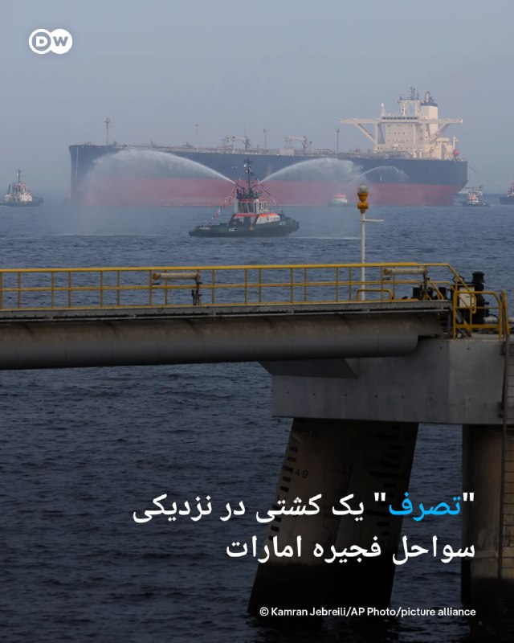

🔶 "تصرف" یک کشتی در نزدیکی سواحل فجیره امارات

مرکز عملیات تجارت دریایی بریتانیا روز پنجشنبه ۱۴ مه (۲۴ اردیبهشت) از وقوع حادثه‌ای در فاصله ۳۹ مایل دریایی شمال شرقی بندر فجیره در شرق امارات متحده عربی خبر داده است.

طبق این گزارش یک کشتی که لنگر انداخته بود، توسط افرادی ناشناس مورد حمله قرار گرفت و اکنون به سمت آب‌های سرزمینی ایران در حرکت است. تا کنون جزییات بیشتری در مورد این حادثه منتشر نشده است.

این رویداد همزمان با سفر دونالد ترامپ، رئیس جمهور آمریکا به پکن و دیدار او با شی جین‌پینگ، همتای چینی او اتفاق افتاده است. کاخ سفید اعلام کرده است که رهبران چین و آمریکا در ملاقات خود اتفاق نظر داشتند که تنگه هرمز باید باز بماند تا جریان آزاد انرژی در منطقه حفظ شود و ایران اجازه مطالبه عوارض برای عبور کشتی‌ها از این آبراه حیاتی را ندارد.

@dw_farsi

## DW_Farsi — post 124685

  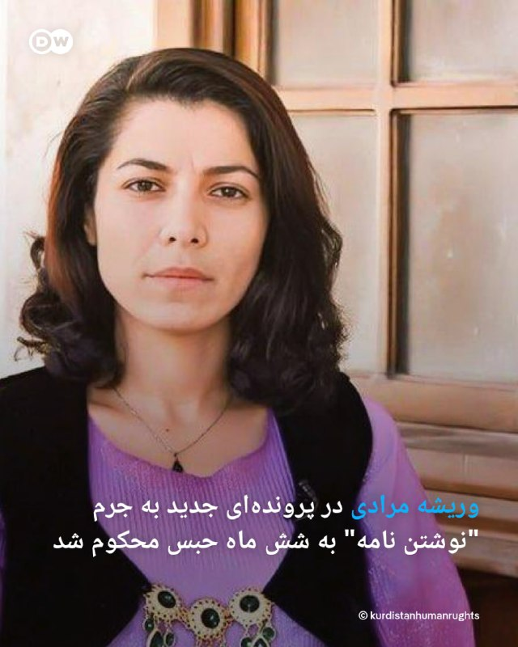

🔶 وریشه مرادی در پرونده‌ای جدید به جرم "نوشتن نامه" به شش ماه حبس محکوم شد

وریشه مرادی، زندانی سیاسی محبوس در زندان اوین، از صدور حکم ۶ ماه حبس قطعی علیه خود به اتهام "تبلیغ علیه نظام" خبر داده شده است. بنا بر اطلاعات کمپین آزادی وریشه مرادی، او هفته پیش طبق ابلاغیه‌ای در جریان محکومیت و این حکم تازه قرار گرفته است.

اتهام مطرح‌شده علیه وریشه مرادی به نوشته‌هایی برمی‌گردد که توسط او در سالگرد جنبش "زن زدگی آزادی" منتشر شده بودند و به این ترتیب، این حکم تازه به پرونده‌های سابق و در حال رسیدگی او افزوده شده است.

وریشه مرادی مردادماه ۱۴۰۲، توسط نیروهای امنیتی در حومه سنندج بازداشت و در تاریخ ۵ دی همان سال، با اتمام مراحل بازجویی از بازداشتگاه وزارت اطلاعات موسوم به بند ۲۰۹ زندان اوین به بند زنان این زندان منتقل شد.

این زندانی سیاسی اواخر آبان سال ۱۴۰۳ توسط شعبه ۱۵ دادگاه انقلاب تهران به ریاست قاضی ابوالقاسم صلواتی از بابت اتهام "بغی" به اعدام محکوم شده بود. اواخر سال گذشته، حکم اعدام ریشه مرادی توسط دیوان عالی کشور نقض و پرونده او جهت رسیدگی مجدد به شعبه هم عرض ارجاع داده شد.

وریشه مرادی در حال حاضر دوران محکومیت خود را در زندان اوین سپری می‌کند.

@dw_farsi

## DW_Farsi — post 124684

  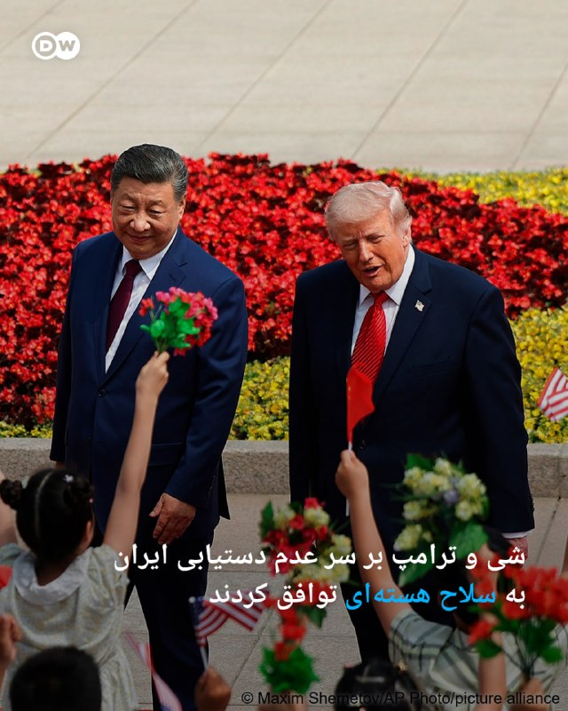

🔶 کاخ سفید: شی و ترامپ بر سر عدم دستیابی ایران به سلاح هسته‌ای توافق کردند

کاخ سفید اعلام کرد که جنگ ایران و بحران تنگه هرمز در دیدار شی جین‌پینگ، رئیس جمهور چین و دونالد ترامپ، همتای آمریکایی او از جمله موضوعات مورد بحث بوده‌ است.

کاخ سفید با انتشار بیانیه‌ای گفت رهبران چین و آمریکا طی گفت‌وگوهای خود که در روز پنجشنبه ۱۴ مه (۲۴ اردیبهشت) در پکن انجام گرفت در مورد عدم دستیابی جمهوری اسلامی به سلاح هسته‌ای اتفاق نظر داشته‌اند.

در این بیانیه آمده است که ترامپ و شی توافق کردند که تنگه هرمز باید باز بماند تا جریان آزاد انرژی در منطقه حفظ شود و ایران اجازه مطالبه عوارض برای عبور کشتی‌ها از تنگه هرمز را ندارد.

به گفته کاخ سفید، شی جین‌پینگ همچنین علاقه‌مندی خود را به خرید بیشتر نفت آمریکا برای کاهش وابستگی چین به تنگه هرمز در آینده ابراز کرده است. با این حال به گزارش خبرگزاری فرانسه در گزارش منتشر شده از سوی پکن به چنین موضوعی اشاره‌ای نشده است.

پکن در حال حاضر بزرگ‌ترین خریدار و واردکننده نفت از ایران محسوب می‌شود.

@dw_farsi

## DW_Farsi — post 124683

  

📸 کاریکاتور هفته

نزدیک به هشتاد روز است که حکومت ایران اینترنت را قطع کرده و تنها بسته‌ای محدود، کنترل‌شده و بسیار گران‌قیمت با عنوان "اینترنت پرو" را در اختیار گروه‌های خاص قرار می‌دهد. در کنار استفاده‌کنندگان اینترنت پرو، دارندگان "سیم‌کارت‌های سفید" نیز از دسترسی ویژه برخوردارند.

عمده بهره‌مندان از این امتیازها، وابستگان حکومت و حامیان آن هستند که با استفاده از این امکان، تصویری عادی، بزک‌شده و گمراه‌کننده از وضعیت امروز ایران به جهان مخابره می‌کنند؛ تصویری که در آن نشانی از فقر گسترده، سرکوب سیستماتیک، گرانی کمرشکن و موج روزانه اعدام‌های سیاسی دیده نمی‌شود.

این موضوع دستمایه مانا نیستانی در طراحی کاریکاتور هفته برای دویچه وله فارسی بوده است.

@dw_farsi

## DW_Farsi — post 124682

  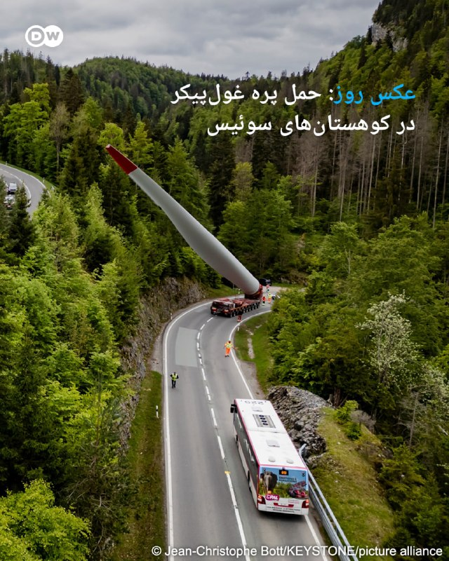

📸 عکس روز: حمل پره غول‌پیکر در کوهستان‌های سوئیس

کامیونی در حال حمل یکی از پرّه‌های توربین بادی که برای نیروگاه "زور گراتی" ساخته شده است. این نیروگاه در سوئیس در حال ساخت است و بهره‌برداری از آن برای اواخر سال ۲۰۲۷ برنامه‌ریزی شده است. این مجموعه شامل شش توربین بادی با ظرفیت نصب‌شده مجموع ۲۵٫۲ مگاوات خواهد بود.

@dw_farsi

## Persian_Trend_Official — post 14124

https://t.me/persian_trend_official/14122?comment=545135

واقعیت این‌طور نیست. همکاران من زحمت بسیار زیادی می‌کشند و بخش مهمی از بار کانال بر دوش ادمین‌هاست. طبیعی است که گاهی بین ما اختلاف‌نظر یا تفاوت سلیقه وجود داشته باشد، اما همه تلاش کرده‌اند چارچوب‌ها و اصول «پرشین ترند» حفظ شود.

در مورد برخی اشتباهات هم باید صادقانه گفت که تا حدی اجتناب‌ناپذیر هستند. خود من هم بارها دچار خطا شده‌ام و اساساً هیچ‌کس نمی‌تواند ادعا کند کاملاً بدون اشتباه است.

اما نقطه قوت و پویایی «پرشین ترند» دقیقاً همین‌جاست؛ به‌محض اینکه اشتباهی شناسایی شود، اصلاح می‌شود و حتی در بسیاری موارد، این فرصت ایجاد می‌شود که اطلاعات کامل‌تر و دقیق‌تری در اختیار شما قرار بگیرد تا موضوع به‌صورت کامل روشن شود.

از توجه شما به این موضوع سپاسگزارم
الیاس فرخ

## Persian_Trend_Official — post 14123

  <a href="telegram/content/Persian_Trend_Official_14123_1778764192.webm" target="_blank">🎬 Download video</a>

عبارت 13 سال ثابت نگه داشتن تورم درست نیست. در بخش مهمی از دهه ۴۰، ایران تورم پایینی داشت اما در دهه ۵۰ و به‌ویژه سال‌های پایانی دولت هویدا، تورم به‌شدت افزایش یافت. بنابراین ادعای «۱۳ سال ثابت نگه داشتن تورم» دقیق نیست و بیشتر یک روایت تبلیغاتی است تا تحلیل…

## Persian_Trend_Official — post 14122

هویدا نخست وزیر ایران در زمان شاه سیزده سال تورم ایران رو ثابت نگه داشته بود؛ زمانیکه بهش نامه زدن به خاطر ماه محرم اداره ها با تاخير باز بشن، در جواب نوشت: “با سلام، موافقت نميشود. عبادت بجز خدمت خلق نيست.” 📝 Nick 📌 @persian_trend_official پرشین ترند |…

## Persian_Trend_Official — post 14121

  <a href="telegram/content/Persian_Trend_Official_14121_1778764192.mp4" target="_blank">🎬 Download video</a>

🔴وزیر دفاع اسرائیل، کاتز درباره ایران

💢ماموریت ما کامل نشده است.

💢ما برای احتمال اینکه ممکن است مجبور شویم دوباره اقدام کنیم - شاید حتی به زودی - آماده‌ایم.

▪️اگر اهداف تأمین نشوند، دوباره اقدام خواهیم کرد.

🫆:Tony

📌 @persian_trend_official
پرشین ترند | متفاوت‌ترین کانال نظامی

## Persian_Trend_Official — post 14120

🔴مارکو روبیو:

💢طرف چینی گفت که آنها موافق نظامی کردن تنگه هرمز یا سیستم عوارضی نیستند و این موضع ما است.

🫆:Tony

📌 @persian_trend_official
پرشین ترند | متفاوت‌ترین کانال نظامی

## Persian_Trend_Official — post 14119

  <a href="telegram/content/Persian_Trend_Official_14119_1778764194.mp4" target="_blank">🎬 Download video</a>

💢شی در ضیافت شام با ترامپ در پکن:

«برای آینده روشن روابط چین و آمریکا و دوستی بین دو ملت، و برای سلامتی رئیس جمهور ترامپ و همه دوستان حاضر در جلسه دعا می‌ کنم.»

🫆:Tony

📌 @persian_trend_official
پرشین ترند | متفاوت‌ترین کانال نظامی

## Persian_Trend_Official — post 14117

هویدا نخست وزیر ایران در زمان شاه سیزده سال تورم ایران رو ثابت نگه داشته بود؛

زمانیکه بهش نامه زدن به خاطر ماه محرم اداره ها با تاخير باز بشن، در جواب نوشت:
“با سلام، موافقت نميشود. عبادت بجز خدمت خلق نيست.”

📝 Nick

📌 @persian_trend_official
پرشین ترند | متفاوت‌ترین کانال نظامی

## RadioFarda — post 157179

  

🔸رسانه‌های حکومتی ایران روز چهارشنبه گفتند نیروهای نظامی جمهوری اسلامی از شامگاه گذشته به گروهی از کشتی‌های چینی اجازه عبور از تنگه هرمز را داده‌اند.

🔸ساعتی بعد صداوسیمای جمهوری اسلامی اعلام کرد «بیش از ۳۰ کشتی» اجازه عبور از این آبراه را یافته‌اند، اما مشخص نکرد که آیا همه آنها چینی بوده‌اند یا نه.

🔸خبرگزاری‌های فارس و تسنیم، هردو نزدیک به سپاه پاسداران، به نقل از منابع آگاه خبر دادند که «با تصمیم جمهوری اسلامی» امکان عبور تعدادی از کشتی‌های چینی از تنگه هرمز «با رعایت پروتکل مدیریت ایرانی تنگه» فراهم شده است.

🔸این اتفاق همزمان با حضور دونالد ترامپ، رئیس‌جمهور آمریکا، در چین رخ داده است. کاخ سفید گفته واشینگتن و پکن توافق کردند که تنگه هرمز باید برای حفظ جریان آزاد انرژی باز بماند و رئیس‌جمهور چین مخالفت چین با «نظامی‌سازی» این آبراه و هرگونه تلاش برای دریافت عوارض برای استفاده از آن را اعلام کرده است.

🔸ایران از زمان آغاز حملات آمریکا و اسرائیل در نهم اسفند سال گذشته، تنگه هرمز را مسدود کرده و آمریکا نیز بعد از آتش‌بس دست به محاصره دریایی ایران زده است.

@RadioFarda

## RadioFarda — post 157178

🔸امید برزگری، مربی سازمان امداد و نجات هلال احمر، در یک گفت‌وگوی تصویری با خبر آن‌لاین دربارۀ سگ‌های امداد و نجات گفت «این سگ‌ها پست نیستند؛ فرشته‌اند، فرشتۀ نجات».

🔸آقای برزگری که به همراه همکارش و دو سگ نجات خود در این گفت‌وگو شرکت کرده بود این جمله را در پاسخ به گزارشی از صداوسیمای جمهوری اسلامی گفت که از مردم پرسیده بود «چه کسی از سگ‌های هلال احمر پست‌تر است».

🔸جمعیت هلال احمر ایران روز سه‌شنبه ۲۵ فروردین اعلام کرد که سگ‌های زنده‌یاب این سازمان، از ابتدای جنگ اخیر، در ۷۹۲ عملیات جستجو و نجات شرکت کردند که از این تعداد، در ۷۱۱ عملیات موفق به زنده‌یابی و جستجوی پیکر کشته‌شدگان شدند.

🔸سگ‌های تجسس هلال احمر در جنگ ۱۲ روزه اسرائیل و ایران هم نقش مهمی ایفا کردند و شماری از سگ‌های زنده‌یاب هلال احمر زخمی و دست کم دو قلاده از آن‌ها در جریان عملیات کشته شدند.

🔸استفاده از سگ‌ها در مواقع جنگ و حوادث غیرمترقبه در ایران در حالی است که داشتن این حیوان خانگی از سوی مقامات جمهوری اسلامی نماد «فرهنگ غربی» توصیف و همواره منع می‌شود.
@RadioFarda

## RadioFarda — post 157177

🔸رسانه‌های ایران می‌گویند وزیر خارجه جمهوری اسلامی در نشست بریکس در دهلی‌نو، امارات متحده عربی را به «دخالت مستقیم» در عملیات نظامی علیه کشورش متهم کرد. 🔸این تنش یک روز پس از آن رخ داد که امارات ادعای بنیامین نتانیاهو، نخست‌وزیر اسرائیل، مبنی بر سفر به این…

## RadioFarda — post 157176

  

🔸رسانه‌های ایران می‌گویند وزیر خارجه جمهوری اسلامی در نشست بریکس در دهلی‌نو، امارات متحده عربی را به «دخالت مستقیم» در عملیات نظامی علیه کشورش متهم کرد.

🔸این تنش یک روز پس از آن رخ داد که امارات ادعای بنیامین نتانیاهو، نخست‌وزیر اسرائیل، مبنی بر سفر به این کشور حاشیه خلیج فارس در جریان جنگ ایران را رد کرد.

🔸خبرگزاری مهر به نقل از عراقچی نوشت: «من به خاطر حفظ وحدت، در سخنرانی‌ام در بریکس نامی از امارات نبردم. اما حقیقت این است که امارات مستقیماً در تجاوز علیه کشور من دخیل بود. وقتی حملات آغاز شد، آن‌ها حتی آن را محکوم هم نکردند.»

🔸رسانه‌های ایرانی مشخص نکردند که نماینده امارات چه اظهاراتی در این نشست مطرح کرده بود.

🔸بر اساس این گزارش‌ها، عراقچی همچنین گفت که «نه پایگاه‌های آمریکا و نه اتحاد با اسرائیل برای امارات امنیت به همراه نیاورده و این کشور باید در سیاست خود نسبت به ایران تجدیدنظر کند».

@RadioFarda

## RadioFarda — post 157175

  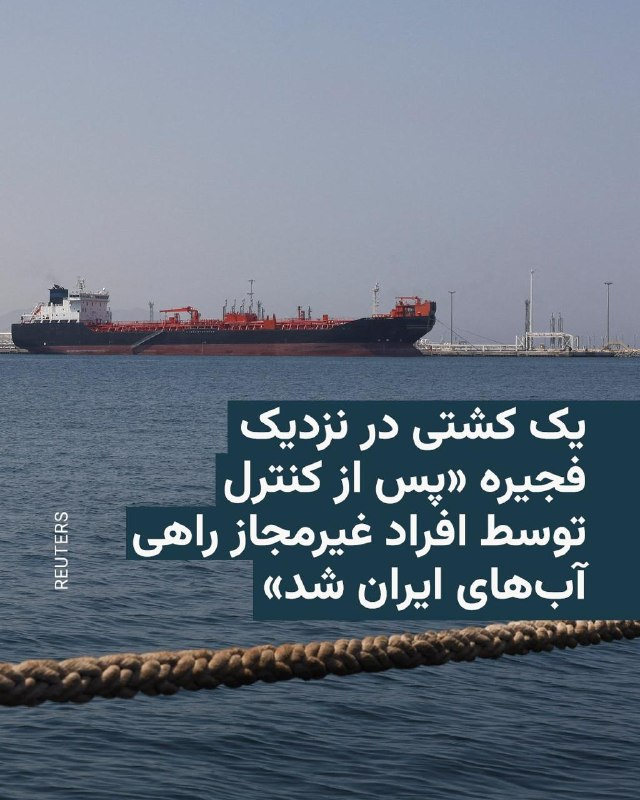

🔸مرکز عملیات تجارت دریایی بریتانیا روز پنجشنبه ۲۴ اردیبهشت اعلام کرد پس از وقوع حادثه‌ای دریایی در شمال شرقی امارات متحده عربی، «افراد غیرمجاز» کنترل یک کشتی در لنگرگاه را به دست گرفته‌اند و این کشتی اکنون به سوی آب‌های سرزمینی ایران در حرکت است.

🔸این نهاد گفت گزارشی دربارهٔ حادثه دریایی در ۳۸ مایل دریایی (حدود ۷۰ کیلومتری) شمال شرقی بندر فجیره امارات متحده عربی دریافت کرده و پس از آن، کشتی به تصرف درآمده و مسیر آن به سوی آب‌های سرزمینی ایران تغییر داده شده است.

🔸از مشخصات این کشتی و هویت افرادی که کنترل آن را در دست گرفته‌اند، هنوز اطلاعاتی منتشر نشده است.
@RadioFarda

## RadioFarda — post 157173

  

🔸وزارت خارجه هند حمله به یک کشتی با پرچم این کشور را که می‌گوید روز چهارشنبه ۲۳ اردیبهشت در نزدیکی سواحل عمان رخ داده است، «غیرقابل قبول» خواند.

🔸وزارت خارجه هند در بیانیه‌ای افزود که هدف قرار دادن کشتی‌های تجاری و دریانوردان غیرنظامی باید متوقف شود و از مقام‌های عمان برای نجات خدمه تشکر کرد.

🔸شرکت امنیت دریایی «ونگارد» نام این کشتی را «ام‌اس‌وی حاج علی» اعلام کرده و گفته است که این لنج چوبی ۵۴ متری در نزدیکی سواحل لیما در عمان، در جنوب تنگه هرمز، پس از وقوع انفجار غرق شده است.

🔸بر اساس این گزارش، کشتی در حال انتقال دام از بندر بربره در سومالی‌لند به شارجه در امارات متحده عربی بوده که احتمالاً هدف حمله پهپادی یا موشکی قرار گرفته است.

🔸حکومت ایران از نهم اسفند پارسال و شروع جنگ آمریکا و اسرائیل با ایران عملاً تنگه هرمز را مسدود کرده و آمریکا نیز با وجود آتش‌بس شکننده‌ای که از ۱۹ فروردین برقرار شده، محاصره دریایی بنادر ایران را ادامه داده است.

@RadioFarda

## RadioFarda — post 157172

  <a href="https://t.me/radiofarda/157172" target="_blank">📎 Download file</a>

📻بشنوید: ساعت ۱۴ با رادیوفردا، ۲۴ اردیبهشت ۱۴۰۵‌

@Radiofarda

## RadioFarda — post 157171

لِگو، هیپ‌هاپ و هوش مصنوعی؛ ایران چگونه بر افکار عمومی غرب اثر می‌گذارد

🔸جنگ ایران درس‌های تازه‌ای دربارهٔ نحوهٔ استفاده از هوش مصنوعی به‌عنوان ابزاری در جنگ‌های مدرن و حکمرانی دولتی آشکار کرده است. حکومت ایران به‌طور فزاینده‌ای تبلیغات تولیدشده با هوش مصنوعی، عملیات سایبری، جنگ روانی و کارزارهای نفوذ را در قالب یک اکوسیستم دیجیتال پیچیده برای مخاطبان داخلی و خارجی در هم آمیخته است.

🔸از ویدئوهای وایرال‌شده به سبک لگو و قطعات هیپ‌هاپ ساخته‌شده با هوش مصنوعی گرفته تا عملیات پنهانی در شبکه‌های اجتماعی و تصاویر جعلی میدان جنگ، تاکتیک‌های حکومت ایران برای نفوذ بیشتر به‌سرعت در حال تحول است و بیش از پیش مخاطبان غربی را هدف قرار می‌دهد.

🔸رادیو اروپای آزاد/رادیو آزادی برای بررسی چگونگی استفادهٔ جمهوری اسلامی از هوش مصنوعی در تبلیغات و جنگ اطلاعاتی، با مکس لِسِر، تحلیلگر ارشد تهدیدهای نوظهور در مرکز نوآوری سایبری و فناوری بنیاد دفاع از دموکراسی‌ها، گفت‌وگو کرده است.

🔸 گزارش کامل را در وب‌سایت رادیو فردا می‌توانید بخوانید.

@RadioFarda

## RadioFarda — post 157170

  

🔸گزارش‌ها از ایران حاکی از بازداشت مهدی شفاخواه، فعال اجتماعی و مربی داوطلب کودکان کار، توسط وزارت اطلاعات است.

🔸شماری از رسانه‌های حقوق بشری از جمله وب‌سایت هه‌نگاو نوشته‌اند که آقای شفاخواه «در پی یورش نیروهای وزارت اطلاعات جمهوری اسلامی ایران به منزل شخصی‌اش بازداشت و به مکان نامعلومی منتقل شد».

🔸بازداشت او عصر روز سه‌شنبه ۲۲ اردیبهشت صورت گرفته و مأموران وزارت اطلاعات، ضمن بازداشت این فعال اجتماعی اقدام به تفتیش منزل و ضبط لوازم شخصی او نیز کرده‌اند.

🔸هنوز از دلایل بازداشت، اتهامات انتسابی و محل دقیق نگهداری شفاخواه هیچ اطلاع دقیقی در دسترس نیست و پیگیری‌های خانواده او برای کسب اطلاع از وضعیت سلامت او بی‌نتیجه مانده است.

🔸مهدی شفاخواه طی سال‌های اخیر به صورت داوطلبانه در مناطق محروم و حاشیه‌نشین فعالیت داشته و از طریق آموزش ورزش و مهارت‌های اجتماعی به کودکان کار و نوجوانان آسیب‌پذیر، در راستای کاهش آسیب‌های اجتماعی از جمله اعتیاد و بزهکاری تلاش می‌کرد.

🔸او برادر رضا شفاخواه، وکیل دادگستری و فعال حقوق کودکان و زندانیان سیاسی، است.

@RadioFarda

## RadioFarda — post 157169

  <a href="https://t.me/radiofarda/157169" target="_blank">📎 Download file</a>

🔸اپیزود ۵۲ پادکست لایه هفتم | گزارش تهدیدهای امنیت سایبری در نیمه دوم ۱۴۰۴

🔸در این اپیزود از بدافزارهای اندرویدی که برای رصد فعالیت‌های آنلاین در گوشی کاربران پنهان می‌شوند صحبت می‌کنیم، همین‌طور از شکل‌های تازه جعل هویت، داکسینگ (یا همان افشای اطلاعات شخصی) و حتی مواردی که حمله سایبری می‌توانسته مقدمه‌ای برای ربایش فیزیکی افراد باشد.

🔸همچنین با حضور داوود سجادی و امیر رشیدی، گزارش جدید تهدیدهای امنیت سایبری ایران در نیمه دوم سال پرالتهاب ۱۴۰۴ را بررسی می‌کنیم. همچنین در ادامه، اصول و راهکارهای عملی برای مقابله با این تهدیدات و محافظت از خود را مرور می‌کنیم.

🔸فردا پادکست 🎧

## RadioFarda — post 157168

  

📷 Photo

## IranianMinds — post 20122

  

🔴 ببین کی داره اینو میگه…

دو روز ۱۸ و ۱۹ دی ۱۴۰۴، ۲۳۶ کودک رو کشتید.
۵۵۵ بچه رو هم بازداشت کردید.

آها یادم نبود کودکان غزه و فلسطین مال شماس.

@IranianMinds

## IranianMinds — post 20121

  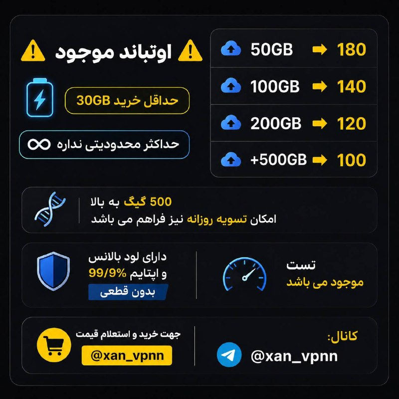

⚠️اوتباند موجود⚠️

🔋حداقل خرید 30GB

♾حداکثر محدودیتی نداره

50GB ➡️ 180

100GB ➡️140

200GB ➡️120

+500GB ➡️100

🧬 500 گیگ به بالا امکان تسویه روزانه نیز فراهم می باشد

⬅️دارای لود بالانس و اپتایم 99/9% بدون قعطی
⬅️تست موجود می باشد

جهت خرید و استعلام قیمت🟡

@xan_vpnn

کانال:

https://t.me/+qNjExGEJztE2OGI0

## IranianMinds — post 20120

  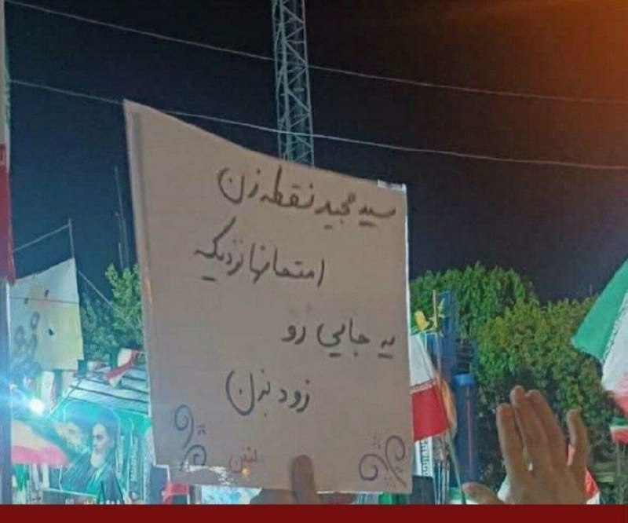

🔴بنر حامیان حکومت در تجمع دیشب تهران:
سید مجید نقطه‌زن، امتحانا نزدیکه، یه جایی‌رو زود بزن.

@IranianMinds

## IranianMinds — post 20119

  

ایلان ماسک به همراه پسرش در نشست پکن شرکت کرد.

@IranianMinds

## IranianMinds — post 20118

  <a href="telegram/content/IranianMinds_20118_1778764207.mp4" target="_blank">🎬 Download video</a>

🔴 صحبت‌های امروز اسکات بسنت، وزیر خزانه‌داری آمریکا راجب ایران و جمهوری‌اسلامی: تا اینجای امسال، رژیم ایران ۳۰ تا ۴۰ هزار نفر رو اعدام کرده (کُشته) و خیلی‌هاشون هم معترضای مسالمت‌آمیز بودن. خب با همچین رژیمی چطور باید برخورد کرد؟ از نظر اقتصادی خفه‌ش می‌کنیم و فکر می‌کنیم کار به جایی رسیده که سربازاشون حقوق نمی‌گیرن و نمی‌تونن از خارج هم سلاح و مهماتشون رو تأمین کنن. برای همین فکر می‌کنم دیگه دارن به آخر خط می‌رسن.

@IranianMinds

## IranianMinds — post 20117

🔴 یسرائیل کاتز، وزیر دفاع اسرائیل، درباره ایران: ماموریت ما کامل نشده؛ ما برای احتمال اینکه ممکنه مجبور شیم دوباره اقدام کنیم، شاید حتی «بزودی» آماده‌ایم. اگر اهدافمون تأمین نشن، دوباره اقدام خواهیم کرد.

@IranianMinds

## BBCPersian — post 281030

  

🔻اسکات بسنت، وزیر دارایی آمریکا، در گفت‌وگویی با شبکه سی‌ان‌بی‌سی در حاشیه سفر رئیس‌جمهور آمریکا، در یک مصاحبه از پیش ضبط‌شده گفت که معتقد است چین از نفوذش بر تهران برای بازگشایی تنگه هرمز استفاده خواهد کرد.

او گفت: «فکر می‌کنم آن‌ها (چینی‌ها) هر کاری از دستشان بربیاید انجام خواهند داد.»

آقای بسنت افزود: « بازگشایی تنگه هرمز بسیار به نفع چین است. فکر می‌کنم آن‌ها پشت پرده تلاش خواهند کرد، البته اگر اصلا کسی بتواند بر تصمیم‌های رهبری ایران تاثیر بگذارد.»

به اعتقاد وزیر دارایی آمریکا، چین به‌زودی سفارش بزرگی از هواپیماهای بوئینگ را اعلام خواهد کرد و افزود دو طرف در حال گفت‌وگو درباره بهبود روابط تجاری از جمله صادرات انرژی هستند.

📷Reuters
@BBCPersian

## BBCPersian — post 281029

  <a href="telegram/content/BBCPersian_281029_1778764210.mp4" target="_blank">🎬 Download video</a>

🔻حضور هیئت ایرانی در اجلاس بریکس به‌طور کامل در سایه جنگ آمریکا و اسرائیل با ایران و تنش‌های منطقه‌ای است.
عباس عراقچی، وزیر خارجه ایران در سخنرانی در صحن اجلاس از ناکارآمدی اقدامات نظامی علیه این کشور گفت و پس از سخنرانی در کانال تلگرامش به‌‌صراحت امارات متحده عربی را به دخالت مستقیم در حمله به ایران متهم کرد.

عباس عراقچی، همچنین از کشورهای عضو اجلاس وزرای خارجه بریکس خواست تا «نقض حقوق بین‌الملل از سوی آمریکا و اسرائیل» را محکوم کنند و وزیر خارجه هند هم تردد آزاد در تنگه هرمز را برای اقتصاد جهان «حیاتی» خواند.
رسانه‌های ایران گمانه‌زنی کرده‌اند که امارات «مانع از صدور بیانیه پایانی شود.»

آقای عراقچی همچنین گفت: «تنگه هرمز اکنون بیش از هر چیز از تجاوز آمریکا و محاصره‌ای که بر آن تحمیل کرده، آسیب می‌بیند. از نظر ما، تنگه هرمز برای تمامی کشتی‌های تجاری باز است، اما آن‌ها باید با نیروهای دریایی ما همکاری کنند.»

📷Shutterstock
@BBCPersian

## BBCPersian — post 281028

چین؛ بازیگردان پشت‌پرده ایران؟
🖋️آنتونی زوکر و لورا بیکر، بی‌بی‌سی

🔻دیدار عباس عراقچی، وزیر خارجه ایران، از پکن در هفته گذشته ظاهرا با هدف نشان دادن میزان نفوذ و اثرگذاری چین در خاورمیانه انجام شد.

ایالات متحده با دقت این موضوع را زیر نظر داشت.

مارکو روبیو، وزیر خارجه آمریکا گفت: «امیدوارم چینی‌ها به او آن چه را که باید گفته شود، بگویند و آن این است که کاری که شما در تنگه انجام می‌دهید باعث شده در سطح جهانی منزوی شوید. شما در این ماجرا طرف بد هستید.»

علی واین، مشاور ارشد تحقیات و حمایت در امور روابط آمریکا و چین در گروه بین‌المللی بحران، می‌گوید: « فکر می‌کنم اگر بخواهیم ایران را به شکلی پایدار و بلندمدت به میز مذاکره برگردانیم، ایالات متحده این را می‌پذیرد که چین قرار است نقشی در این میان داشته باشد.»

به نظر می‌رسد که دونالد ترامپ هم به نوبه خود نسبت به روابط نزدیک چین با تهران، بی‌تفاوت است. در حالی که آمریکا اخیرا یک پالایشگاه مستقر در چین را به دلیل انتقال نفت ایران تحریم کرد، آقای ترامپ هفته گذشته هرگونه حمایت چین از ایران در جریان این درگیری را کم‌اهمیت جلوه داد.

https://bbc.in/4d7TQd4
@BBCPersian

## BBCPersian — post 281027

  <a href="telegram/content/BBCPersian_281027_1778764213.mp4" target="_blank">🎬 Download video</a>

🎶 بُرشی از اجرای «خالی»، تک‌آهنگی از پیمان سلیمی که با تنظیمی تازه، همراه با گروه آلوفونز در استودیوی بی‌بی‌سی اجرا شده است.

او در گفت‌وگویی در حاشیه این اجرا از درس‌هایی که از کار گروهی گرفته، مخاطرات خودمحوری، اهمیت شنیدن حرف‌های دیگران و پیچیدگی‌های روابط عاطفی می‌گوید.

پیمان سلیمی، خواننده، آهنگساز و نوازنده ایرانی-ایتالیایی، فعالیت موسیقایی خود را با نواختن کیبورد آغاز کرد و در نوجوانی به سراغ گیتار رفت. او تحصیلات خود را در رشته موسیقی کلاسیک در دانشکده هنرهای زیبا ادامه داد و سپس برای ادامه تحصیل به فلورانس ایتالیا مهاجرت کرد.

پیمان سال‌ها به‌عنوان نوازنده و آهنگساز فعالیت داشت و نخستین آثارش را در نوجوانی با مضامین عاشقانه خلق کرد. ورود حرفه‌ای‌اش به خوانندگی پس از مهاجرت به فلورانس و همکاری با جمعی از نوازندگان ایتالیایی شکل گرفت.

گفت‌وگو و اجرای او را در «رنگآهنگ» این هفته پنجشنبه از تلویزیون و یوتیوب بی‌بی‌سی فارسی ببینید.

@BBCPersian

## BBCPersian — post 281026

🔻وزارت خارجه هند انفجار و غرق شدن یک کشتی باری این کشور در سواحل عمان را «غیرقابل قبول» خواند

🔻وزارت خارجه هند حمله به یک کشتی با پرچم این کشور را در نزدیکی سواحل عمان «غیرقابل قبول» توصیف کرد. سازمان‌های نظارت دریایی گزارش دادند که این کشتی باری دیروز هدف قرار گرفته و غرق شده است.

دهلی جزئیات بیشتری درباره این حمله ارائه نکرد، اما اعلام کرد که همه خدمه کشتی سالم هستند و از مقامات عمان برای نجات جان خدمه کشتی قدردانی کرد.

در بیانیه وزارت خارجه هند که روز پنجشنبه ۲۴ اردیبهشت ماه منتشر شده، آمده است: «حمله به یک کشتی با پرچم هند در سواحل عمان در روز گذشته غیرقابل قبول است و ما از این که کشتی‌های تجاری و ملوانان غیرنظامی همچنان هدف قرار می‌گیرند بسیار متاسفیم.»

شرکت امنیت دریایی «وانگارد» نام این کشتی را شناور باری حاج علی اعلام کرد که با ۱۴ خدمه در نزدیکی سواحل عمان در جنوب تنگه هرمز روزچهارشنبه پس از وقوع انفجار در نزدیکی آن غرق شد.

شرکت وانگارد می‌گوید که این کشتی در حال حمل دام زنده از بربره در منطقه سومالی لند به بندر شارجه در امارات متحده عربی بوده که در اثر «انفجاری مشکوک که احتمالا ناشی از حمله پهپادی یا موشکی» بوده،‌ آتش گرفته است.

وبسایت رهگیری ترافیک کشتی‌ها،‌ این کشتی را یک لنچ چوبی به طول ۵۴ متر معرفی کرده است.

عباس عراقچی در سخنرانی خود در دهلی به این حمله اشاره‌ای نکرد، اما تاکید کرد که تنگه هرمز «برای همه کشتی‌های تجاری که با نیروی دریایی ایران همکاری کنند،‌ باز است.»

https://bbc.in/4tDRd7V
@BBCPersian

## BBCPersian — post 281025

  

🔻درگیری بین ایران و امارات به نشست عمومی نخستین روز اجلاس وزرای خارجه بریکس هم کشیده شد، جایی که عباس عراقچی، وزیر خارجه ایران بدون ذکر نام امارات گفت: «ائتلاف شما با اسرائیلی‌ها نیز از شما محافظت نکرد. در سیاست خود در قبال ایران بازنگری کنید.»

او ساعاتی پس از سخنرانی در نشست بریکس در کانال تلگرام خود نوشت: «من در سخنرانی‌ خود نام امارات متحده عربی را ذکر نکردم، به خاطر حفظ وحدت و ترجیح دادم به آن اشاره نکنم. اما در واقع باید بگویم که امارات مستقیماً در اقدام تجاوزکارانه علیه کشور من دخیل بود. زمانی که این تجاوز آغاز شد، آنها حتی از محکوم کردن آن خودداری کردند. آنها اجازه دادند از سرزمین‌شان برای شلیک توپخانه و تجهیزات علیه ما استفاده شود.»

جنگ ایران، اجماع نظر بر سر بیانیه مشترک را برای این گروه دشوارتر کرده است، به ویژه به خاطر عضویت ایران و امارات متحده عربی که در جنگ اخیر در دو سوی مقابل قرار دارند.

متن کامل خبر در لینک زیر:
https://bbc.in/3RnsqY1
📷EPA

@BBCPersian

## BBCPersian — post 281024

🔻لبنان در مذاکرات واشنگتن در پی اجرای آتش‌بس از سوی اسرائیل است

🔻یک مقام ارشد لبنانی اعلام کرد که کشورش در مذاکرات رو در رو با اسرائیل که قرار است امروز در واشنگتن برگزار شود، خواستار اجرای آتش‌بس از سوی اسرائیل خواهد شد.

این مقام لبنانی گفت که هیئت لبنانی به دنبال «آتش‌بسی است که اسرائیل آن را اجرا کند.»

این مذاکرات، سومین دیدار میان نمایندگان لبنان و اسرائیل از زمان ازسرگیری درگیری‌ها میان حزب‌الله و اسرائیل در بیش از دو ماه گذشته است. بیروت با وجود مخالفت شدید حزب‌الله در این مذاکرات شرکت می‌کند.

درگیری‌ها میان حزب‌الله و اسرائیل، با وجود آتش‌بس اعلام‌شده با میانجی‌گری آمریکا در ماه گذشته، همچنان ادامه دارد.

وزارت بهداشت لبنان اعلام کرد که حملات اسرائیل در روز گذشته ۲۲ کشته، از جمله هشت کودک، برجای گذاشته است.

ارتش اسرائیل هم گفته است که امروز موج تازه‌ای از حملات را علیه مواضع حزب‌الله در جنوب لبنان انجام داده است. حزب‌الله هم می‌گوید که دیروز ۱۷ حمله علیه نیروهای اسرائیلی در جنوب انجام داده است.

آمریکا در حالی میانجی‌گری میان لبنان و اسرائیل را دنبال می‌کند که هم‌زمان تلاش‌های دیپلماتیک برای پایان دادن به تنش‌های گسترده‌تر میان آمریکا و ایران نیز ادامه دارد.

https://bbc.in/4uOASy5
@BBCPersian

## Dirty_Kids — post 389441

  <a href="telegram/content/Dirty_Kids_389441_1778764217.mp4" target="_blank">🎬 Download video</a>

شی جین‌پینگ، رئیس‌جمهور چین در دیدار با ترامپ رئیس‌جمهور آمريکا:

دو کشور ما باید شریک باشند، نه رقیب. مردم چین و ایالات متحده هر دو ملت‌های بزرگی هستند. تحقق احیای بزرگی ملت چین و عظمت دوباره آمریکا می‌تواند همزمان پیش برود. ما می‌توانیم به موفقیت یکدیگر کمک کنیم و رفاه کل جهان را ارتقا دهیم.

@Dirty_Kids 👻

## Dirty_Kids — post 389437

ترامپ تو چین یه جور داره رفتار میکنه که انگار اون میزبانه:

@Dirty_Kids 👻

## Dirty_Kids — post 389436

  <a href="telegram/content/Dirty_Kids_389436_1778764219.mp4" target="_blank">🎬 Download video</a>

این چه سمی بود دیدم 😂🔞

@Dirty_Kids 👻

## Dirty_Kids — post 389435

  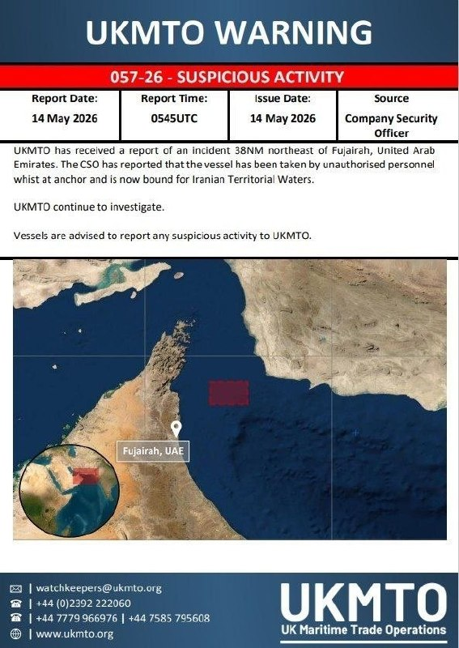

دقیقا وقتی فکر می‌کنی جمهوری اسلامی تپه نریده باقی نذاشته، همون لحظه یه تپه جدید می‌سازه و میره سرش میرینه.
فقط مونده بود برن از امارات کشتی بدزدن فرار کنن، که اونم گویا حاصل شد.

@Dirty_Kids 👻

## Dirty_Kids — post 389434

  <a href="https://t.me/Dirty_Kids/389434" target="_blank">📎 Download file</a>

✅ اپلیکیشن اندروید سایت جهانی دربی بت

💰اولین سایت جهانی با امکان شارژ و برداشت ریالی(کارت به کارت)

🔗 برای ورود فیلترشکن روی کشور مناسب قرار دهید مانند فنلاند و المان و....

😀Telegram Channel
👇
https://t.me/+bcynkEgSW2dlYTc0

## Dirty_Kids — post 389433

  

😤دنبال یه سایت شرط بندی بین المللی بودی که به ایرانیا خدمات بده؟!
⛔

👍دربی بت همون انتخاب  100%

💎ویژگی های سایت جهانی Derby Bet:

⬅️امکان شارژ امن با کارت بانکی

⬅️واریز اول دوبل شارژ می شوید(بونوس۱۰۰٪)

⬅️پر اپشن ترین سایت فعال در ایران

⬅️تسویه حساب کمتر از 5 دقیقه

⬅️برگشت بخشی از باخت به صورت هفتگی

🚨کد هدیه ثبت نام:GG007

⚠️برای دانلود اپلکیشن کلیک کنید
👉

🔔کانال دربی بت :

🪙https://t.me/+bcynkEgSW2dlYTc0

## Dirty_Kids — post 389432

سختی زبان چینی همینقدر بگم که اگه یکم تن صداتو بالا پایین کنی معنی کلمه از توت‌فرنگی به خوارتو گاییدم تغییر می‌کنه.

@Dirty_Kids 👻

## Dirty_Kids — post 389431

  <a href="telegram/content/Dirty_Kids_389431_1778764223.mp4" target="_blank">🎬 Download video</a>

شراب چینی ایلان ماسکو کصخل کرده، هر کی میاد باهاش عکس بگیره شکلک در میاره 😂

@Dirty_Kids 👻

## Hranews — post 112943

  

فاطمه وحدت، نایب‌رئیس اتحادیه زنان کارگر سراسر کشور، با اشاره به تشدید فشارهای اقتصادی بر اقشار آسیب‌پذیر گفت نشانه‌های گسترش #فقر در جامعه کاملاً مشهود است و در برخی مناطق، مردم حتی برای خرید #نان با مشکل مواجه‌اند. او تأکید کرد این نشانه‌ها در ظاهر کوچک به نظر می‌رسند، اما در صورت بی‌توجهی می‌توانند به بحران‌های جدی اجتماعی تبدیل شوند.

وحدت در ادامه با بیان اینکه زنان کارگر به‌ویژه سرپرستان خانوار در شرایط بحرانی بیش از دیگران در معرض اخراج قرار دارند، افزود این روند در بسیاری از استان‌ها مشاهده می‌شود و پیامدهای آن تنها به از دست رفتن شغل محدود نمی‌ماند، بلکه امنیت روانی و معیشت خانواده‌ها را نیز تحت تأثیر قرار می‌دهد. به گفته او، نبود سازوکار حمایتی مشخص برای زنان کارگر و ضعف نظارت بر وضعیت اشتغال، می‌تواند شکاف‌های اجتماعی را عمیق‌تر کند.

↘️
@hranews_bot تماس ✉️ - @Hranews کانال هرانا 🆑

## manototv — post 105445

  <a href="telegram/content/manototv_105445_1778764226.mp4" target="_blank">🎬 Download video</a>

عباس عراقچی، وزیر خارجه جمهوری اسلامی، امارات متحده عربی را به مشارکت مستقیم در حملات نظامی علیه ایران متهم کرد و خواستار بازنگری ابوظبی در روابطش با اسرائیل شد.
عراقچی این اظهارات را در نشست وزیران خارجه بریکس در دهلی‌نو مطرح کرد. او گفت: «امارات مستقیماً در تجاوز علیه کشور من دخالت داشت و اجازه داد از خاکش برای شلیک تجهیزات و تسلیحات علیه ایران استفاده شود.»
وزیر خارجه جمهوری اسلامی همچنین با اشاره به عادی‌سازی روابط امارات و اسرائیل در سال ۲۰۲۰ گفت: «ائتلاف شما با اسرائیل هم از شما محافظت نکرد و باید در سیاست خود در قبال ایران تجدیدنظر کنید.»

## manototv — post 105444

  <a href="telegram/content/manototv_105444_1778764227.mp4" target="_blank">🎬 Download video</a>

یک شرکت امنیت دریایی اعلام کرد شناور هندی «ام‌اس‌وی حاج‌علی» در پی حمله‌ای ناشناس در آب‌های نزدیک عمان غرق شده است.
شرکت «ونگارد» اعلام کرد این کشتی باری با ۱۴ خدمه، در نزدیکی ساحل لیما در عمان، در جنوب تنگه هرمز، پس از وقوع انفجار غرق شد.
بر اساس این گزارش، کشتی در حال انتقال دام از بربره در منطقه سومالی‌لند به شارجه امارات متحده عربی بود که «احتمالاً بر اثر حمله پهپادی یا موشکی» دچار انفجار شد.
ونگارد اعلام کرد پس از وقوع آتش‌سوزی در کشتی، خدمه مجبور به ترک شناور شدند و کشتی سپس غرق شد.
وب‌سایت رهگیری کشتی‌ها «ماریتایم ترافیک» این شناور را یک لنج چوبی ۵۴ متری معرفی کرده است. وزارت خارجه هند پیش‌تر اعلام کرده بود همه خدمه این کشتی سالم نجات یافته‌اند.

## manototv — post 105443

  <a href="telegram/content/manototv_105443_1778764228.mp4" target="_blank">🎬 Download video</a>

کاخ سفید اعلام کرد دونالد ترامپ و شی جین‌پینگ در دیدار خود در پکن درباره جنگ ایران، امنیت تنگه هرمز و برنامه هسته‌ای جمهوری اسلامی گفت‌وگو کرده‌اند.
بر اساس بیانیه کاخ سفید، دو طرف توافق کردند تنگه هرمز باید برای حفظ جریان آزاد انرژی باز بماند. شی جین‌پینگ همچنین مخالفت چین با نظامی‌سازی تنگه هرمز و هرگونه دریافت عوارض برای عبور کشتی‌ها را مطرح کرده است.
در این بیانیه آمده است رئیس‌جمهوری چین از تمایل پکن برای خرید بیشتر نفت آمریکا به‌منظور کاهش وابستگی به تنگه هرمز خبر داده و دو کشور نیز توافق کرده‌اند جمهوری‌اسلامی نباید به سلاح هسته‌ای دست پیدا کند.
کاخ سفید همچنین اعلام کرد دو رهبر درباره همکاری اقتصادی و مقابله با ورود مواد اولیه فنتانیل به آمریکا گفت‌وگو کرده‌اند.
در حالی که بیانیه چین تنها اشاره کوتاهی به موضوع ایران داشت، موضوع تایوان که شی جین‌پینگ آن را «مهم‌ترین مسئله» خوانده بود، در بیانیه واشینگتن مطرح نشد.

## manototv — post 105442

  <a href="telegram/content/manototv_105442_1778764229.mp4" target="_blank">🎬 Download video</a>

ترامپ در ضیافت شام رسمی که شی جین‌پینگ، رئیس‌جمهوری چین، در تالار بزرگ خلق پکن برگزار کرده حضور یافت.
ترامپ از شی جین‌پینگ و همسرش، پنگ لی‌یوان، برای سفر به آمریکا و حضور در کاخ سفید در ۲۴ سپتامبر دعوت کرد و گفت: «مایه افتخار من است که این دعوت را مطرح می‌کنم.»

## alonews — post 119933

  <a href="telegram/content/alonews_119933_1778764231.webm" target="_blank">🎬 Download video</a>

👈سنتکام: نیروهای ما از زمان محاصره تا امروز ۷۰کشتی را برگرداندن و ۴کشتی را توقیف کردن

✅ @AloNews خبر جنگ

## alonews — post 119932

  <a href="telegram/content/alonews_119932_1778764231.mp4" target="_blank">🎬 Download video</a>

👈گوشیT1 "ترامپ موبایل" بعد از نزدیک یه سال تأخیر بالاخره داره عرضه میشه
- یه گوشی طلایی ۴۹۹ دلاری با برند ترامپه که چیپ اسنپدراگون سری ۷، رم ۱۲ گیگ، حافظه ۵۱۲ گیگ و دوربین سه‌گانه ۵۰ مگاپیکسلی داره
- به نظر میاد در اصل یه گوشی ساخت چین باشه که فقط مونتاژ نهاییشو تو آمریکا انجام دادن

✅ @AloNews خبر جنگ

## alonews — post 119931

  <a href="telegram/content/alonews_119931_1778764234.webm" target="_blank">🎬 Download video</a>

👈تصویری پربازدید از رزمایش ۵روزه سپاه

✅ @AloNews خبر جنگ

## alonews — post 119930

  <a href="telegram/content/alonews_119930_1778764235.mp4" target="_blank">🎬 Download video</a>

👈دقایقی قبل اسرائیل بازهم به لبنان حمله کرد

✅ @AloNews خبر جنگ.‌‌

## alonews — post 119929

  <a href="telegram/content/alonews_119929_1778764238.mp4" target="_blank">🎬 Download video</a>

👈وزیر خزانه‌داری آمریکا : ما رژیم رو عوض نکردیم، ولی خودِ رژیم عوض شد

🔴ترامپ هم بارها ادعا کرده، ما کارمون رو کردیم و عملاً رژیم عوض شده

✅ @AloNews خبر جنگ

## alonews — post 119928

  <a href="telegram/content/alonews_119928_1778764240.mp4" target="_blank">🎬 Download video</a>

👈وزیر امور خارجه مارکو روبیو:
سیاست ایالات متحده در مورد تایوان از امروز و از جلسه ای که امروز اینجا داشتیم بدون تغییر است.

🔴مطرح شد. آنها همیشه آن را در کنار خود بالا می برند. ما همیشه موضع خود را روشن می کنیم و به موضوعات دیگر می پردازیم.‌‌

✅ @AloNews خبر جنگ

## alonews — post 119927

  <a href="telegram/content/alonews_119927_1778764242.mp4" target="_blank">🎬 Download video</a>

👈رئیس جمهور ترامپ در پکن:
من می خواهم یک لیوان را بالا ببرم و یک نوشابه به روابط غنی و پایدار بین مردم آمریکا و چین پیشنهاد کنم.

🔴این یه رابطه خیلی خاصه‌‌

✅ @AloNews خبر جنگ

## alonews — post 119926

  <a href="telegram/content/alonews_119926_1778764245.mp4" target="_blank">🎬 Download video</a>

👈رئیس جمهور چین شی جین پینگ:
هم چین و هم ایالات متحده از همکاری سود می برند و از رویارویی شکست می خورند.

🔴دو کشور ما باید شریک باشند نه رقیب.‌‌

✅ @AloNews خبر جنگ

## alonews — post 119925

  <a href="telegram/content/alonews_119925_1778764247.webm" target="_blank">🎬 Download video</a>

👈وزارت امور خارجه هند اعلام کرد که یه کشتی با پرچم هند در سواحل عمان مورد حمله قرار گرفته.

✅ @AloNews خبر جنگ

## alonews — post 119924

  <a href="telegram/content/alonews_119924_1778764248.webm" target="_blank">🎬 Download video</a>

👈یسرائیل کاتز، وزیر دفاع اسرائیل درباره ایران: ماموریت ما کامل نشده؛ ما برای احتمال اینکه ممکنه مجبور شیم دوباره اقدام کنیم، شاید حتی «بزودی» آماده‌ایم. گر اهدافمون تأمین نشن، دوباره اقدام خواهیم کرد.

✅ @AloNews خبر جنگ

## alonews — post 119923

  <a href="telegram/content/alonews_119923_1778764248.webm" target="_blank">🎬 Download video</a>

👈ترامپ توی چین یه جوری رفتار میکنه انگار اون میزبانه و رئیس جمهور چین اومده آمریکا.

✅ @AloNews خبر جنگ

## alonews — post 119922

  <a href="telegram/content/alonews_119922_1778764248.webm" target="_blank">🎬 Download video</a>

👈اکسیوس:
یک مشاور ترامپ اذعان کرد مشکل این است که «ایران زمان بیشتری دارد و آنها روی تقویم سیاسی ما حساب باز کرده‌اند تا به سودشان تمام شود.»

✅ @AloNews خبر جنگ

## alonews — post 119921

  <a href="telegram/content/alonews_119921_1778764249.webm" target="_blank">🎬 Download video</a>

👈وزیر خزانه‌داری آمریکا: باز شدن تنگه هرمز به نفع چین خواهد بود و انتظار داریم قیمت نفت در شش ماه آینده کاهش یابد.

✅ @AloNews خبر جنگ

## alonews — post 119920

  <a href="telegram/content/alonews_119920_1778764249.webm" target="_blank">🎬 Download video</a>

👈آکسیوس: ترامپ احتمالا بعد از برگشت از چین‌ گام بعدی خودش رو در مقابل ایران برمیداره. یا پروژه آزادی و باز کردن تنگه هرمز رو از سر میگیره یا حملات نظامی رو شروع میکنه.

✅ @AloNews خبر جنگ

## alonews — post 119919

  <a href="telegram/content/alonews_119919_1778764249.mp4" target="_blank">🎬 Download video</a>

👈حرکات عجیب ایلان ماسک بعد مستی

✅ @AloNews خبر جنگ

## alonews — post 119918

  <a href="telegram/content/alonews_119918_1778764252.webm" target="_blank">🎬 Download video</a>

👈ترامپ از شی جین‌پینگ دعوت کرد تا در تاریخ ۲۴ سپتامبر از کاخ سفید بازدید کند.

✅ @AloNews خبر جنگ

## alonews — post 119917

  <a href="telegram/content/alonews_119917_1778764252.webm" target="_blank">🎬 Download video</a>

👈صداوسیما به‌نقل از نیروی دریایی سپاه:
از شب گذشته تاکنون ۳۰ فروند کشتی از تنگۀ هرمز با مجوز ایران عبور کرده‌اند.

✅ @AloNews خبر جنگ

---
📅 بروزرسانی: 1405/02/24 14:45
---

## VahidOOnLine — post 240095

♦️شی جین‌پینگ، رئیس جمهوری چین شامگاه پنجشنبه ۲۴ اردیبهشت در پکن میزبان ضیافت شامی مجلل برای دونالد ترامپ، رئیس جمهوری ایالات متحده و هیئت همراه او بود.

ضیافت شام روسای دو «ابرقدرت» جهانی پس از دیدار و گفتگوی شی با ترامپ و پس از بازدید کم‌سابقه مشترک از «معبد بهشت»، برگزار می‌شود.
‌🇸🇦 Indypersian

🤖 @VahidOOnLine

## VahidOOnLine — post 240094

  

اسکات بسنت، وزیر خزانه‌داری آمریکا، گفت هم‌زمان با سفر دونالد ترامپ به پکن، انتظار می‌رود چین سفارش‌های بزرگی برای خرید هواپیما از شرکت بوئینگ ثبت و اعلام کند.

به گفته او، مذاکرات میان واشینگتن و پکن علاوه بر صنعت هوانوردی، حوزه‌هایی مانند انرژی و محصولات کشاورزی را نیز در بر خواهد گرفت.

بسنت همچین به مناقشه تایوان پرداخت و افزود: «ترامپ حساسیت‌های مربوط به این موضوع را درک می‌کند.»

به گفته وزیر خزانه‌داری آمریکا، ترامپ «در روزهای آینده» درباره این مساله صحبت خواهد کرد.
‌🏁 🇬🇧 IranintlTV

🤖 @VahidOOnLine

## VahidOOnLine — post 240093

  <a href="telegram/content/VahidOOnLine_240093_1778757306.mp4" target="_blank">🎬 Download video</a>

معین، خواننده شهیر در صفحه اینستاگرام خود با انتشار متنی، شایعات مطرح شده در خصوص اجرا برای تیم فوتبال در جام جهانی را تکذیب کرد. معین در متن خود از جمله نوشته: «عشق من به مردم و سرزمینم همیشه واقعی بوده. اما صدای من زمانی معنا دارد که دل مردم آرام باشد و حال ایران خوب»
روز گذشته اظهارات مهدی تاج، رئیس فدراسیون فوتبال جمهوری‌اسلامی به شایعاتی از این دست دامن زده بود.
‌🏁 🇬🇧 ManotoTV

🤖 @VahidOOnLine

## VahidOOnLine — post 240092

  <a href="telegram/content/VahidOOnLine_240092_1778757307.mp4" target="_blank">🎬 Download video</a>

مهدی تاج، رئیس فدراسیون فوتبال جمهوری‌اسلامی گفته «مسئله ویزا حل نشده و هنوز هیچ روادیدی برای اعضای تیم ملی فوتبال ایران صادر نشده است.» و افزوده «منتظریم ببینیم رفتار طرف مقابل چیست.»
او از «جلسه سرنوشت‌ساز» با فیفا صحبت به میان آورده چرا که به گفته تاج فیفا «باید به ما گارانتی بدهد»
‌🏁 🇬🇧 ManotoTV

🤖 @VahidOOnLine

## VahidOOnLine — post 240091

  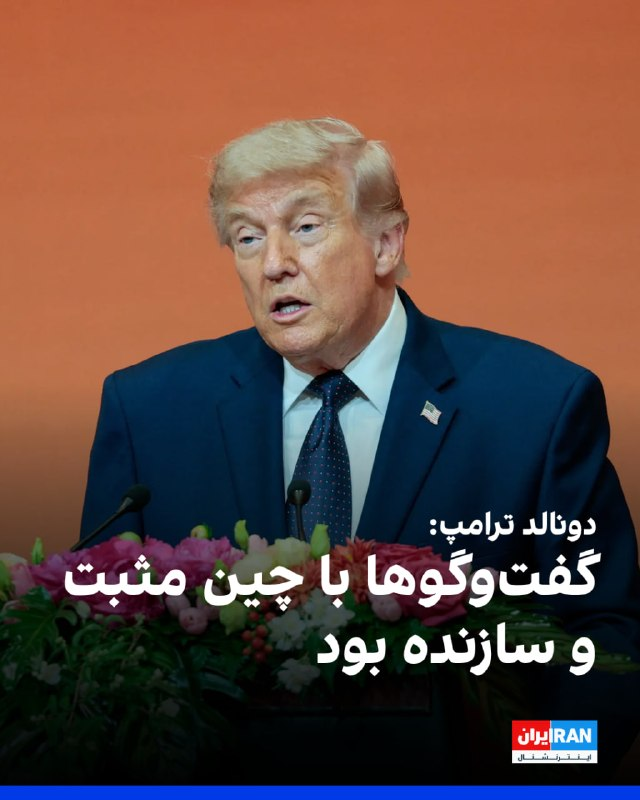

دونالد ترامپ، رییس‌جمهوری آمریکا، پس از سخنان شی جین‌پینگ در ضیافت رسمی در پکن پشت تریبون رفت و از استقبال انجام‌شده قدردانی کرد. او استقبال از خود در پکن را «افتخاری بزرگ» توصیف کرد و از شی جین‌پینگ «برای این استقبال باشکوه» تشکر کرد.

ترامپ گفت: «امروز گفت‌وگوها و دیدارهای بسیار مثبت و سازنده‌ای با هیات چینی داشتیم و این ضیافت نیز فرصتی ارزشمند است تا در جمع دوستان درباره برخی از موضوعاتی که امروز مطرح کردیم گفت‌وگو کنیم.»

رییس‌جمهوری آمریکا همچنین روابط ایالات متحده و چین را «یکی از تاثیرگذارترین روابط در تاریخ بشر» خواند.
‌🏁 🇬🇧 IranintlTV

🤖 @VahidOOnLine

## VahidOOnLine — post 240090

  

عترشی جین‌پینگ، رهبر چین، در آغاز ضیافت شام رسمی با دونالد ترامپ با بلند کردن جام خود به او و هیات آمریکایی خوشامد گفت و بر ضرورت همکاری میان دو کشور تاکید کرد. رهبر چین تاکید کرد: «دو کشور ما باید شریک باشند، نه رقیب.»

شی در سخنان خود به سال ۲۰۲۶ به عنوان دویست‌وپنجاهمین سالگرد اعلامیه استقلال آمریکا اشاره کرد و گفت: «مردم چین و ایالات متحده هر دو ملت‌های بزرگی هستند.»

او افزود: «تحقق احیای بزرگ ملت چین و عظمت دوباره آمریکا می‌تواند همزمان پیش برود. ما می‌توانیم به موفقیت یکدیگر کمک کنیم و رفاه کل جهان را ارتقا دهیم.»
‌🏁 🇬🇧 IranintlTV

🤖 @VahidOOnLine

## VahidOOnLine — post 240089

  

فاطمه وحدت، نایب‌رییس اتحادیه زنان کارگر سراسر ایران گفت: «نشانه‌های گسترش فقر در جامعه مشهود است. این روزها آدم‌ها را می‌بینیم که حتی برای خرید نان دچار مشکل هستند. این‌ها نشانه‌های کوچکی نیستند. شاید ساده به نظر برسند، اما اگر جدی گرفته نشوند، بعدها به معضل بزرگ اجتماعی تبدیل می‌شوند.»

او افزود: «در شرایط بحرانی، زنان کارگر بیش از دیگران در معرض اخراج قرار می‌گیرند؛ به‌ویژه زنانی که سرپرست خانوار هستند و مسئولیت مستقیم تامین معاش خانواده را برعهده دارند، در اثر این اخراج بیشترین آسیب را متحمل می‌شوند.»

وحدت ادامه داد: «همه از این شرایط خبر دارند، اما مسئله این است که نظارت جدی وجود ندارد.»
‌🏁 🇬🇧 IranintlTV

🤖 @VahidOOnLine

## VahidOOnLine — post 240088

  

اسکات بسنت، وزیر خزانه‌داری آمریکا گفت بازگشایی تنگه هرمز به نفع چین است و پکن هر کاری بتواند برای بازگشایی این آبراه انجام خواهد داد.

او در مصاحبه با سی‌ان‌بی‌سی تاکید کرد چین پشت صحنه و تا جایی که بر جمهوری اسلامی نفوذ داشته باشد، برای بازگشایی تنگه هرمز همکاری خواهد کرد.
‌🏁 🇬🇧 IranintlTV

🤖 @VahidOOnLine

## VahidOOnLine — post 240087

  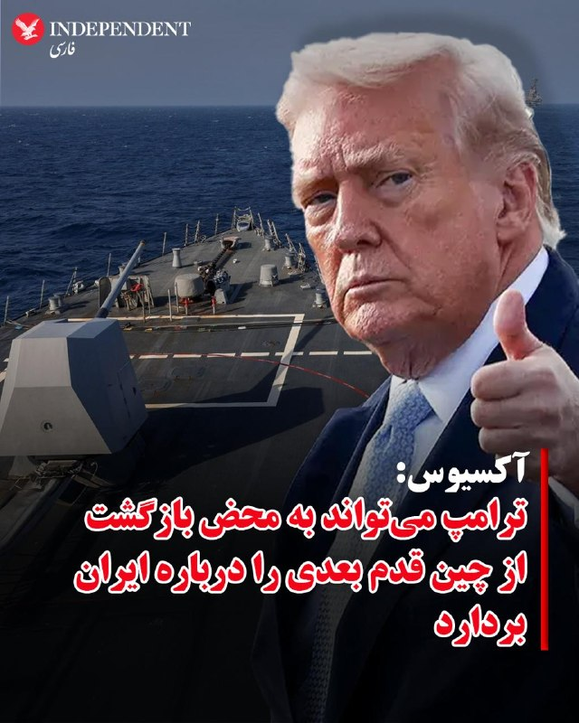

♦️آکسیوس روز پنجشنبه ۲۴ اردیبهشت گزارش کرد که این احتمال وجود دارد که دونالد ترامپ، رئیس جمهوری آمریکا بلافاصله پس از بازگشت از سفر رسمی به چین، گام بعدی را در رابطه جنگ با ایران بردارد.

براساس گزارش این رسانه‌ آمریکا، ترامپ گزینه‌هایی از جمله از سرگیری «پروژه آزادی» تنگه هرمز یا آغاز دور تازه بمباران ایران را در اختیار دارد.

آکسیوس در همین گزارش نوشته است که دونالد ترامپ عامدانه و آگاهانه واژه‌های عبارت «من بیش از آنکه به افزایش هزینه‌ها در آمریکا فکر کنم به دست نیافتن ایران به سلاح هسته‌ای فکر می‌کنم» را انتخاب کرده است.
‌🇸🇦 Indypersian

🤖 @VahidOOnLine

## VahidOOnLine — post 240086

⭕️حمله گسترده موشکی و پهپادی روسیه به کی‌یف دست‌کم سه کشته و ده‌ها زخمی برجا گذاشت

♦️روسیه بامداد پنج‌شنبه با صدها پهپاد و ده‌ها موشک، کی‌یف را هدف حملات گسترده قرار داد؛ حملاتی که به گفته مقام‌های اوکراینی دست‌کم سه کشته و ۴۰ زخمی، از جمله دو کودک برجا گذاشت.

تصاویری که خبرگزاری فرانسه منتشر کرده، عملیات امدادگران برای بیرون کشیدن زخمی‌ها از زیر آوار ساختمان‌های مسکونی را نشان می‌دهد.

نیروی هوایی ارتش اوکراین اعلام کرد روسیه ۶۷۵ پهپاد و ۵۶ موشک شلیک کرده که بخش عمده آن‌ها به سمت پایتخت بوده است.

ولودیمیر زلنسکی، رئیس‌جمهوری اوکراین گفت: بیش از ۲۰ نقطه در کی‌یف، از جمله ساختمان‌های مسکونی، مدرسه و مراکز غیرنظامی آسیب دیده‌اند.

زلنسکی در واکنش به سخنان دیروز دمیتری پسکوف، سخنگوی کرملین که گفته بود «جنگ به پایان خود نزدیک شده است» تاکید کرد این حملات نشان می‌دهد جنگ هنوز به پایان نزدیک نشده است.
‌🇸🇦 Indypersian

🤖 @VahidOOnLine

## VahidOOnLine — post 240085

  <a href="telegram/content/VahidOOnLine_240085_1778757312.mp4" target="_blank">🎬 Download video</a>

روزنامه نیویورک‌تایمز گزارش داد نهادهای اطلاعاتی آمریکا معتقدند شرکت‌های چینی درباره ارسال مخفیانه تسلیحات به جمهوری اسلامی از طریق کشورهای ثالث گفت‌وگو کرده‌اند تا منشأ این محموله‌ها پنهان بماند.
این گزارش ساعاتی پس از ورود دونالد ترامپ به پکن منتشر شد و می‌تواند فشارها بر رئیس‌جمهوری آمریکا را برای درخواست از شی جین‌پینگ به‌منظور قطع حمایت از جمهوری اسلامی افزایش دهد.
بر اساس این گزارش، مقام‌های آمریکایی بر سر این‌که آیا این انتقال‌ها بالفعل انجام شده یا نه اختلاف نظر دارند، اما گفته‌اند چنین اقداماتی بعید است بدون اطلاع مقام‌های ارشد چینی صورت گرفته باشد.
رسانه‌های آمریکایی پیش‌تر نیز گزارش داده بودند چین موشک‌های دوش‌پرتاب ضدهوایی به جمهوری اسلامی ارسال کرده است؛ تسلیحاتی که می‌توانند هواپیماها و پهپادها را هدف قرار دهند. همچنین گفته می‌شود تهران در سال ۲۰۲۴ یک ماهواره جاسوسی چینی دریافت کرده که برای شناسایی نیروهای آمریکایی در خاورمیانه از آن استفاده می‌کند.
در همین حال، گزارش‌هایی از بازسازی توان موشکی جمهوری اسلامی پس از حملات آمریکا و اسرائیل منتشر شده است. بر اساس ارزیابی سازمان سیا، بخش قابل توجهی از موشک‌های بالستیک و پرتابگرهای متحرک ایران همچنان سالم مانده‌اند.
‌🏁 🇬🇧 ManotoTV

🤖 @VahidOOnLine

## VahidOOnLine — post 240084

  <a href="telegram/content/VahidOOnLine_240084_1778757314.mp4" target="_blank">🎬 Download video</a>

بانک مرکزی ترکیه هدف تورم پایان سال ۲۰۲۶ را از ۱۶ به ۲۴ درصد افزایش داد و اعلام کرد پیامدهای جنگ ایران و اسرائیل و افزایش تنش‌ها در خاورمیانه، فشارهای تورمی را تشدید کرده است. رئیس بانک مرکزی ترکیه گفت افزایش بهای انرژی و اختلال در عرضه، به‌ویژه برای اقتصادهای وابسته به واردات مانند ترکیه، یک ریسک جدی محسوب می‌شود. این بانک همچنین پیش‌بینی تورم پایان ۲۰۲۷ را از ۹ به ۱۵ درصد افزایش داد. نرخ تورم ماهانه ترکیه در آوریل به بیش از ۴ درصد و تورم سالانه به حدود ۳۲ درصد رسید.
‌🏁 🇬🇧 ManotoTV

🤖 @VahidOOnLine

## VahidOOnLine — post 240083

  <a href="telegram/content/VahidOOnLine_240083_1778757315.mp4" target="_blank">🎬 Download video</a>

مرکز عملیات تجارت دریایی بریتانیا (UKMTO) در یک هشدار امنیتی اعلام کرد یک کشتی در دریای عمان، در حالی که در لنگرگاه قرار داشت، توسط «افراد غیرمجاز» تصرف شده و اکنون به سمت آب‌های سرزمینی ایران در حرکت است.
بر اساس هشدار رسمی UKMTO، این حادثه حدود ۳۸ مایل دریایی شمال شرقی فجیره امارات متحده عربی رخ داده است. هویت کشتی و جزئیات بیشتر درباره مهاجمان هنوز اعلام نشده است.
این نهاد بریتانیایی اعلام کرد در حال بررسی موضوع است و از همه شناورها خواسته هرگونه فعالیت مشکوک را فورا گزارش دهند.
هشدار صبح امروز چهارشنبه منتشر شده و نشان‌دهنده یک رخداد امنیتی تازه و حساس در آبراه‌های منطقه است.
اگرچه این نهاد هنوز درباره عاملان احتمالی این حادثه اظهار نظر نکرده، اما چنین هشدارهایی معمولا در موارد مرتبط با توقیف کشتی‌ها، دزدی دریایی یا عملیات نیروهای نظامی و شبه‌نظامی در منطقه صادر می‌شود.
‌🏁 🇬🇧 ManotoTV

🤖 @VahidOOnLine

## VahidOOnLine — post 240082

  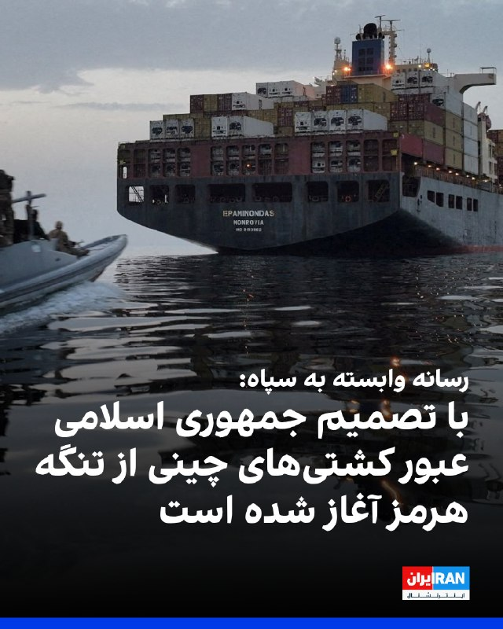

خبرگزاری فارس، وابسته به سپاه پاسداران به نقل از «منبع آگاه» نوشت: «با تصمیم جمهوری اسلامی، عبور شماری از کشتی‌های چینی از تنگه هرمز، از شامگاه چهارشنبه، ۲۳ اردیبهشت و پس از توافق بر سر پروتکل‌های مدیریت جمهوری اسلامی بر این آبراه آغاز شده است.»

بر اساس این گزارش، این تصمیم پس از پیگیری‌های مقام‌های چین و در چارچوب «روابط راهبردی» تهران و پکن اتخاذ شد و کشتی‌های مورد درخواست چین اجازه عبور یافتند.
‌🏁 🇬🇧 IranintlTV

🤖 @VahidOOnLine

## VahidOOnLine — post 240081

  

عباس عراقچی، وزیر خارجه جمهوری اسلامی که برای شرکت در اجلاس بریکس، به دهلی نو سفر کرده، گفت: «امارات متحده عربی مستقیما در جنگ علیه ما دخیل بود.»
او خطاب به اماراتی‌ها گفت: «ائتلاف با اسرائیل هم از شما محافظت نکرد.»

عراقچی ادامه داد: «اماراتی‌ها اجازه دادند از سرزمین‌شان برای شلیک توپخانه و تجهیزات علیه ما استفاده شود.»

وزیر خارجه جمهوری اسلامی افزود: «امارات متحده عربی شریک فعال جنگ علیه ماست و هیچ تردیدی در این باره وجود ندارد و ما شگفت‌زده شدیم که برادران ما در امارات متحده عربی تصمیم گرفتند فعالانه به جنگ علیه ما بپیوندند.»

عراقچی تاکید کرد: «همدستی امارات متحده عربی با اسرائیل غیرقابل بخشش است.»
‌🏁 🇬🇧 IranintlTV

🤖 @VahidOOnLine

## VahidOOnLine — post 240080

  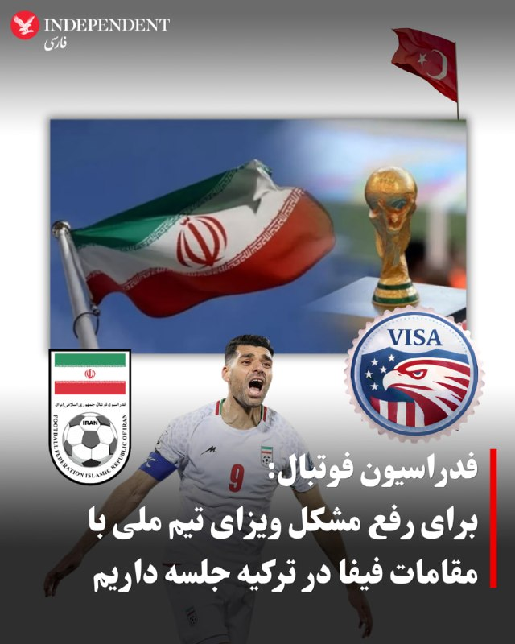

♦️امیرمهدی علوی، سخنگوی فدراسیون فوتبال جمهوری اسلامی ایران روز پنجشنبه اعلام کرد روند اداری دریافت ویزای کاروان اعزامی ایران به جام‌جهانی در امارات انجام شده و فدراسیون همچنان منتظر پاسخ آمریکاست.
او گفت در صورت صادر نشدن ویزا برای برخی بازیکنان، کادر فنی گزینه‌های جایگزین را در نظر گرفته است.

 علوی همچنین از برگزاری نشست رئیس فدراسیون فوتبال با مقام‌های فیفا در ترکیه طی ۴۸ ساعت آینده خبر داد و گفت موضوع صدور ویزا، نخستین خواسته مطرح‌شده از سوی ایران خواهد بود.
در فاصله کمتر از یک ماه تا آغاز جام‌جهانی، تاخیر در صدور ویزای آمریکا به یکی از چالش‌های اصلی تیم ملی تبدیل شده و گزارش‌ها حاکی است احتمال رد ویزای برخی اعضای کاروان به‌دلیل سوابق یا ارتباط با سپاه پاسداران وجود دارد.
‌🇸🇦 Indypersian

🤖 @VahidOOnLine

## VahidOOnLine — post 240079

  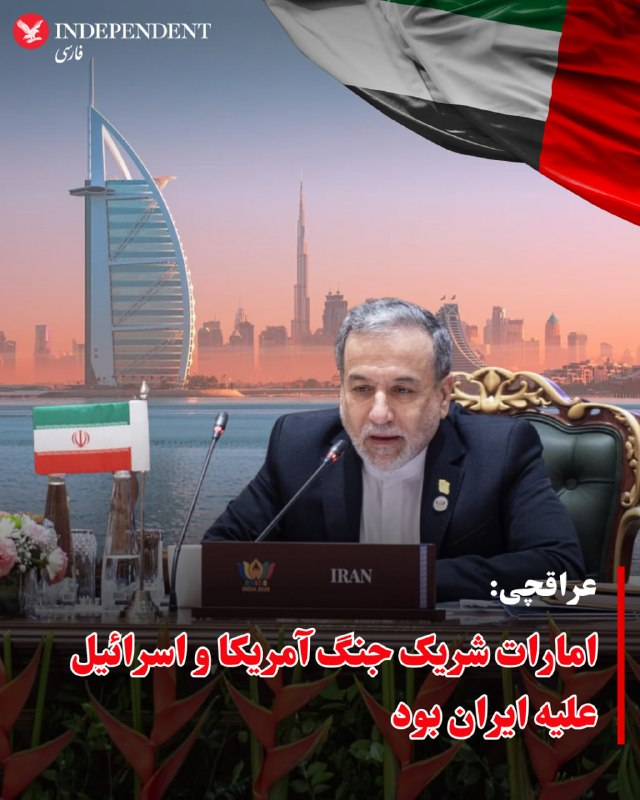

♦️عباس عراقچی، وزیر امور خارجه جمهوری اسلامی روز پنجشنبه ۲۴ اردیبهشت و در زمان حضور در اجلاس وزرای امور خارجه بریکس، امارات را به مشارکت فعال در جنگ آمریکا و اسرائیل علیه ایران متهم کرد.

براساس پیامی که در کانال تلگرام عباس عراقچی منتشر شده، وزیر امور خارجه جمهوری اسلامی در واکنش به آنچه «ادعاهای امارات در اجلاس بریکس» نوشت: حتی ائتلاف با اسرائیل هم از شما محافظت نکرد.

در پیام عراقچی آمده است: «من در سخنرانی‌ خود نام امارات متحده عربی را ذکر نکردم، به خاطر حفظ وحدت و ترجیح دادم به آن اشاره نکنم. اما در واقع باید بگویم که امارات مستقیما در اقدام تجاوزکارانه علیه کشور من دخیل بود. زمانی که این تجاوز آغاز شد، آنها حتی از محکوم کردن آن خودداری کردند.
آنها اجازه دادند از سرزمین‌شان برای شلیک توپخانه و تجهیزات علیه ما استفاده شود.»

عراقچی با اشاره به اعلام خبر دولت اسرائیل درباره سفر «مخفیانه» بنیامین نتانیاهو به امارات در دوران جنگ نوشت: «همین دیروز فاش شد که نتانیاهو در زمان جنگ به امارات و ابوظبی سفر کرده بود. همچنین آشکار شد که آنها در این حملات مشارکت داشته‌اند و شاید حتی مستقیما علیه ما اقدام کرده باشند. بنابراین امارات شریک فعال این تجاوز است و هیچ تردیدی در این باره وجود ندارد.»
‌🇸🇦 Indypersian

🤖 @VahidOOnLine

## VahidOOnLine — post 240078

  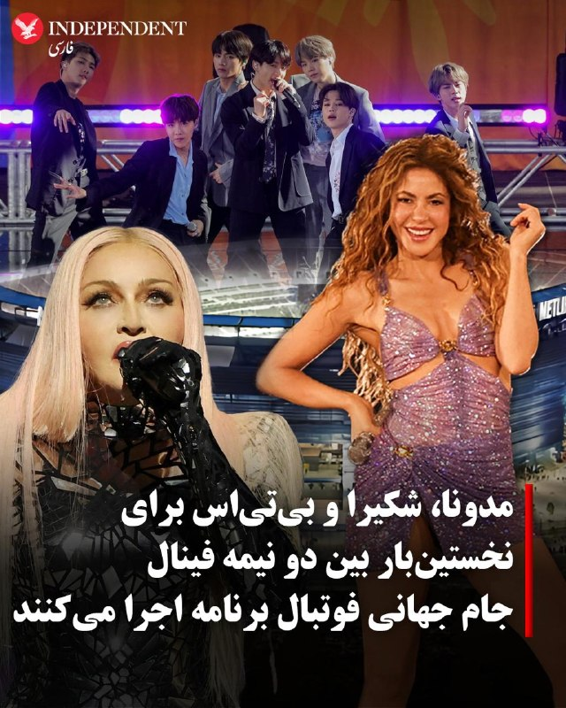

♦️فیفا اعلام کرد مدونا، شکیرا و گروه کره‌ای بی‌تی‌اس در نخستین اجرای بین دو نیمه فینال جام جهانی فوتبال، روز ۲۸ تیر در ورزشگاه مت‌لایف نیوجرسی روی صحنه خواهند رفت.
به گزارش خبرگزاری فرانسه، کریس مارتین، خواننده گروه کلدپلی، مدیریت هنری این برنامه را برعهده دارد. برنامه‌ای که برای نخستین بار در تاریخ فینال جام جهانی برگزار می‌شود و همزمان نگرانی‌هایی را درباره طولانی شدن زمان استراحت بین دو نیمه ایجاد کرده است.
جام جهانی ۲۰۲۶ با حضور ۴۸ تیم از ۲۱ خرداد تا ۲۸ تیر ۱۴۰۵ به میزبانی مشترک آمریکا، کانادا و مکزیک برگزار می‌شود و بزرگ‌ترین دوره تاریخ این رقابت‌ها خواهد بود.
جیانی اینفانتینو، رئیس فیفا، پیش‌تر اعلام کرده بود فینال جام جهانی ۲۰۲۶ برای نخستین بار شاهد اجرای موسیقی بین دو نیمه خواهد بود، اما در آن زمان جزئیاتی درباره اجراکنندگان یا مدت زمان برنامه ارائه نکرده بود.
رئیس فیفا روز پنجشنبه، در اینستاگرام نوشت: «این یک لحظه تاریخی برای جام جهانی فوتبال و نمایشی درخور بزرگ‌ترین رویداد ورزشی جهان خواهد بود.»
در فینال جام جهانی باشگاه‌های فیفا که سال گذشته در همین ورزشگاه برگزار شده بود، کنسرت بین دو نیمه باعث شد زمان استراحت از ۱۵ دقیقه استاندارد فراتر برود.
اینفانتینو همچنین اعلام کرد فیفا قصد دارد در آخر هفته پایانی جام جهانی، میدان تایمز نیویورک را نیز به مرکز برنامه‌های ویژه این رقابت‌ها تبدیل کند.
فیفا اعلام کرد کنسرت بین دو نیمه در حمایت از «صندوق آموزش شهروند جهانی فیفا» برگزار می‌شود، طرحی که هدف آن جمع‌آوری ۱۰۰ میلیون دلار برای حمایت از کودکان در سراسر جهان است.

شکیرا غیر از این برنامه، با همکاری خواننده نیجریه‌ای، برنا بوی، ترانه «دای دای» را برای جام‌جهانی فوتبال ۲۰۲۶ آماده کرده است.
‌🇸🇦 Indypersian

🤖 @VahidOOnLine

## VahidOOnLine — post 240077

  <a href="telegram/content/VahidOOnLine_240077_1778757320.mp4" target="_blank">🎬 Download video</a>

بر اساس گزارش‌های منتشرشده در شبکه‌های اجتماعی، خاطره خدادادی، دانشجوی رشته دندانپزشکی در بلاروس، پس از اظهار نظر درباره مسائل ایران در یک کانال تلگرامی، با دخالت سفارت جمهوری اسلامی بازداشت و به ۱۴ روز زندان محکوم شده است.
به گفته نزدیکان او، قرار بود دهم اردیبهشت آزاد شود، اما همچنان در بازداشت به‌سر می‌برد و وضعیت تحصیل و اقامتش نامشخص است. همچنین گزارش شده که او در مدت بازداشت از دسترسی به وکیل و تماس با دوستانش محروم بوده است.
‌🏁 🇬🇧 ManotoTV

🤖 @VahidOOnLine

## VahidOOnLine — post 240076

  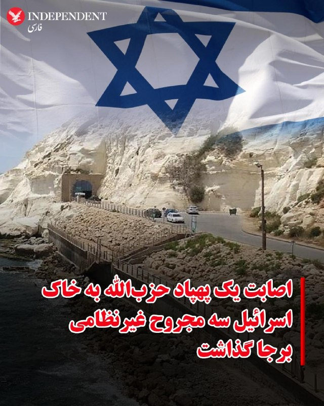

♦️ارتش اسرائیل روز پنجشنبه ۲۴ اردیبهشت اعلام کرد پس از سقوط یک پهپاد انفجاری حزب‌الله در نزدیکی مرز اسرائیل و لبنان، سه غیرنظامی اسرائیلی زخمی و به بیمارستان منتقل شدند.

این خبر در حالی اعلام می‌شود که آتش‌بس میان اسرائیل و حزب‌الله که سه هفته گذشته اعلام شد، عملا اجرا نمی‌شود.
‌🇸🇦 Indypersian

🤖 @VahidOOnLine

## mwarmonitor — post 9071

🇨🇳🇺🇸دونالد ترامپ، رئیس‌جمهور چین، شی جین‌پینگ را برای بازدید از کاخ سفید در تاریخ ۲۴ سپتامبر دعوت کرد.

@mwarmonitor

## mwarmonitor — post 9070

📝از "هزار پدر" تا "بی‌پدر": وقتی شی‌جین‌پینگ با یک لبخند به ترامپ، یتیم‌خانه‌ی سایبری‌ها را به آتش می‌کشد.

🔰وقاحتِ این جماعتِ جیره‌خوار زمانی به اوج می‌رسد که می‌بینند «پدرِ معنوی‌شان» در پکن، برای همان ترامپی که شب و روز در رویاهایشان ترورش می‌کردند، فرشِ قرمز پهن کرده و با شکوهی بی‌سابقه از او پذیرایی می‌کند. حالا که سوزشِ این حقیقتِ عریان به جانشان افتاده، طبقِ معمولِ آن ذاتِ دروغ‌گویشان، به آب و آتش می‌زنند تا با روایت‌هایِ مضحک، این «تعظیمِ دیپلماتیکِ چین» را به عنوانِ «تحقیرِ آمریکا» به خوردِ مخاطبِ مفلوکشان بدهند. این اراذلِ سایبری که هنوز فرقِ میانِ "نزاکتِ ابرقدرت‌ها" و "نوکریِ حقیرانه" را نمی‌فهمند، سعی دارند با واژه‌هایی مثل «دیکته کردنِ دیپلماسی»، رویِ این واقعیت سرپوش بگذارند که چین، برخلافِ تصورِ این‌ها، به دنبالِ تجارت با کدخداست، نه گداییِ رفاقت با یک نظامِ منزوی و ورشکسته.

🔸تصویرِ ترامپ در شهرِ ممنوعه، برای این هزارپدرانِ نظام مثلِ پاشیدنِ نمک روی زخمِ "عزتِ نداشته‌شان" است؛ آن‌ها که کلِ دیپلماسی‌شان به گشت‌زنی در مخروبه‌های ونزوئلا و گرفتنِ عکسِ یادگاری با شبه‌نظامیانِ گمنام خلاصه شده، حالا چنان از استقبالِ باشکوهِ شی‌جین‌پینگ از ترامپ گیج شده‌اند که از شدتِ استیصال، به هذیان‌گویی روی آورده‌اند. چقدر باید یک موجود حقیر باشد که ببیند اربابش دارد با دشمنِ خونی‌اش در بالاترین سطحِ ممکنِ تشریفات لبخند می‌زند و ناهار می‌خورد، اما باز هم با وقاحتِ تمام رو به دوربین کند و بگوید: «نه، ببینید چطور با کلاسِ بالا ترامپ را تحقیر کردند!». این اوجِ حقارتِ یک "برده‌ی فکری" است که حتی وقتی صاحبش او را نادیده می‌گیرد و با رقیب دستِ دوستی می‌دهد، باز هم دنبالِ راهی می‌گردد تا از این فضاحت، یک "پیروزیِ خیالی" بسازد. حقیقت این است که دنیای واقعیِ قدرت، فرسنگ‌ها با حجره‌های تاریکِ پروپاگاندای این‌ها فاصله دارد و این جیره‌خوارانِ مفلوک، تنها چیزی که از این استقبالِ باشکوه نصیبشان شده، دود و سوزشی است که هیچ "دیپلماسیِ چینی" قادر به خاموش کردنش نیست.

@mwarmonitor

## mwarmonitor — post 9069

  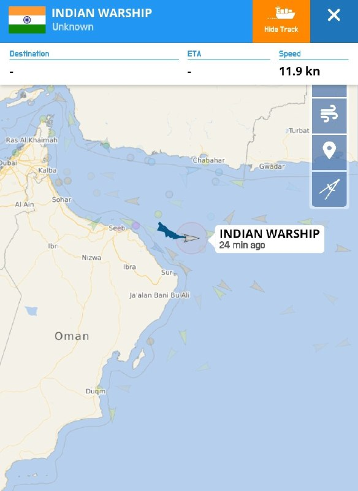

🇮🇳هند اعلام کرد که یک کشتی با پرچم هند روز چهارشنبه در سواحل عمان مورد حمله قرار گرفته است.
🚢این کشتی پیدا نشده و احتمالاً با سامانه AIS خاموش در حال تردد بوده است. همچنین از چند هفته پیش یک ناو جنگی هندی برای حفاظت از کشتی‌های این کشور در دریای عمان مستقر است.

@mwarmonitor

## mwarmonitor — post 9068

  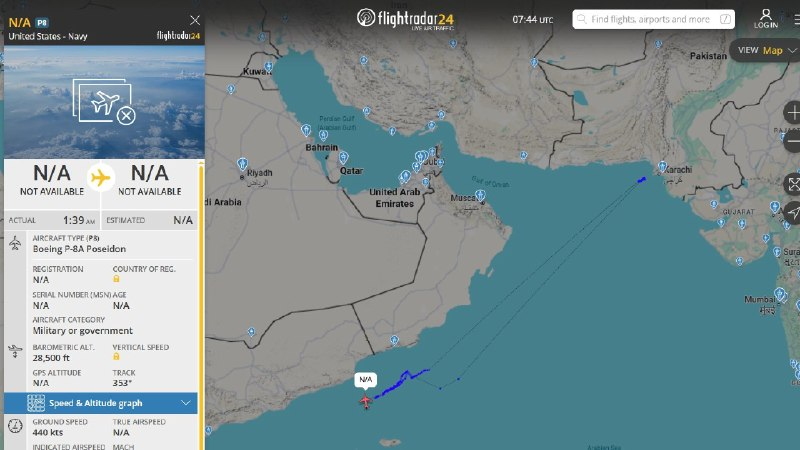

✈️📡 هواپیمای P-8A پوزایدون نیروی دریایی US Navy در سواحل پاکستان فعال بوده و احتمالاً در حال پایش نفتکش‌های ایرانی لنگرگرفته در آن منطقه بوده است.

@mwarmonitor

## mwarmonitor — post 9067

  

🔴عبور از تنگه هرمز صبح امروز:

🚢• نفتکش گاز مایع (LPG) «ROYAL H» که تحت تحریم‌های آمریکا قرار دارد
🚢• نفتکش نفت «SWIFT FALCON» متعلق به چین
🚢• نفتکش نفت «TREND» با ثبت امارات (اما نه با مالکیت اماراتی)
🚢• نفتکش نفت «RAISSA» متعلق به چین

🔸احتمالاً شناوری که توقیف شد، به‌صورت پنهانی در حال حرکت بوده است.

@mwarmonitor

## mwarmonitor — post 9066

🔴نقل‌قول جنجالی ترامپ؛ بن‌بست او در برابر ایران و تورم

📝نویسندگان: دیو لاولر، باراک راوید AXIOS

🔰جمله اخیر رئیس‌جمهور ترامپ مبنی بر اینکه در زمان تصمیم‌گیری درباره اقدامات بعدی در قبال ایران، «به وضعیت مالی آمریکایی‌ها فکر نمی‌کنم»، ناخواسته نشان‌دهنده بن‌بست اساسی اوست: چگونه می‌توان بدون آشفته کردن بازارها و جهش قیمت نفت، بر ایران فشار آورد؟

چرا این موضوع مهم است؟
ترامپ در حال حاضر راه حل مشخصی ندارد که بتواند تمایل خود برای پایان دادن به جنگ (طبق شروط خودش) را با نیاز به مهار تورم و پررونق نگه داشتن بازار سهام در یک سال انتخاباتی، همسو کند.
تحلیل پشت پرده
منظور واقعی ترامپ: به نظر می‌رسد منظور او در اظهارات روز سه‌شنبه این بوده که نگرانی‌های اقتصادی داخلی، او را از برداشتن گام‌های لازم برای جلوگیری از دستیابی ایران به سلاح هسته‌ای باز نخواهد داشت.
فرصت‌طلبی دموکرات‌ها: قطعا این ظرافت کلامی در تبلیغات انتخاباتی دموکرات‌ها گم خواهد شد و آن‌ها از این جمله برای حمله به او استفاده خواهند کرد.
دیدگاه مشاوران: یکی از مشاوران ترامپ به آکسیوس گفت: «رئیس‌جمهور می‌توانست کلمات بهتری انتخاب کند، اما واقعیت فکر او همین است.» مشاور دوم نیز تایید کرد که مشکل اینجاست که «ایران زمان بیشتری در اختیار دارد و آن‌ها روی تقویم سیاسی ما حساب باز کرده‌اند.»
نقطه اصطکاک
مقامات ایرانی به وضوح نشان داده‌اند که معتقدند زمان به نفع آن‌هاست و ترامپ نسبت به افزایش قیمت نفت و نوسانات بازار بسیار حساس است.
داده‌های اقتصادی: آمارهای اخیر که نشان‌دهنده جهش تورم ناشی از قیمت بنزین است، به جایگاه ترامپ آسیب می‌زند؛ به‌ویژه که نظرسنجی‌ها نشان می‌دهد رای‌دهندگان، رئیس‌جمهور و جمهوری‌خواهان را مقصر می‌دانند.
چالش انتخاباتی: نظرسنجی‌های حزب جمهوری‌خواه تایید می‌کنند که افزایش قیمت بنزین، تبلیغ دستاوردهایی مانند «کاهش مالیات» را دشوارتر می‌کند. با این حال، مشاوران ترامپ اصرار دارند که او در مورد «ایرانِ بدون سلاح هسته‌ای» جدی است و ملاحظات سیاسی را کنار گذاشته است.
تصویر کلی
ترامپ از زمان برقراری آتش‌بس در ۶ هفته پیش، نشان داده که به دنبال توافق است و تمایلی به ازسرگیری جنگ ندارد.
شکست مذاکرات: مذاکره‌کنندگان او فکر می‌کردند هفته گذشته به یک توافق مقدماتی با تهران نزدیک شده‌اند، اما پیشنهاد متقابل ایران، خواسته‌های هسته‌ای کلیدی ترامپ را نادیده گرفت.
تهدید به تشدید تنش: ترامپ موضع ایران را غیرقابل قبول خواند و تهدید کرد که ایران بهای سنگینی برای این انعطاف‌ناپذیری خواهد پرداخت. تیم او اکنون در حال بررسی گزینه‌های نظامی برای شکستن بن‌بست هستند، هرچند از خطرات تشدید آشفتگی اقتصادی آگاهند.
آنچه در پشت صحنه می‌گذرد
مقامات آمریکایی انتظار ندارند ترامپ در طول سفرش به چین اقدام دراماتیکی انجام دهد، اما معتقدند بلافاصله پس از آن، حرکت بعدی خود را انجام خواهد داد. گزینه‌های روی میز عبارتند از:
عملیات «آزادی» (Project Freedom): تلاش نیروی دریایی برای شکستن بن‌بست در تنگه هرمز.
حملات هوایی: راه‌اندازی کمپین بمباران جدید با تمرکز بر زیرساخت‌های ایران.
وضعیت اسرائیل: مقامات اسرائیلی می‌گویند در آخر هفته در حالت آماده‌باش کامل خواهند بود تا در صورت تصمیم ترامپ برای ازسرگیری جنگ، هماهنگی‌های لازم را انجام دهند.
خلاصه وضعیت
برخی مقامات معتقدند محاصره آمریکا در حال فشار آوردن به ایران است و ممکن است بدون درگیری نظامی هم باعث تسلیم شدن این کشور شود. با این حال، با توجه به موضع اخیر ایران، امیدها به توافق کمرنگ شده و انتظارات برای بازگشت درگیری‌ها افزایش یافته است.

📌نکته نهایی: ترامپ می‌گوید در صورت اتخاذ چنین تصمیمی، «حتی ذره‌ای» به مسائل مالی آمریکایی‌ها فکر نخواهد کرد. او با این کار، یک محتوای آماده برای تبلیغات تهاجمی دموکرات‌ها به آن‌ها هدیه داده است.

@mwarmonitor

## mwarmonitor — post 9065

🇬🇧وزیر دفاع بریتانیا ؛ حملات پهپادی شوکه‌کننده روسیه به اوکراین طی ۲۴ ساعت گذشته.

🔸من دستور داده‌ام که تحویل سامانه‌های پدافند هوایی و مقابله با پهپاد از سوی بریتانیا با حداکثر سرعت ممکن تسریع شود.

🔸ما در برابر تجاوز ولادیمیر پوتین در کنار اوکراین ایستاده‌ایم.
افکار و همدردی ما با خانواده‌های اوکراینی است.

@mwarmonitor

## mwarmonitor — post 9064

🟥شرکتUKMTO گزارشی از یک حادثه در ۳۸ مایل دریایی (38NM) شمال شرقی فجیره، امارات متحده عربی دریافت کرده است.
🔸افسر امنیتی شرکت (CSO) گزارش داده است که کشتی در زمان لنگر انداختن توسط افراد غیرمجاز تصرف شده و اکنون به سمت آب‌های سرزمینی ایران در حرکت است.

@mwarmonitor

## mwarmonitor — post 9063

🔴 پس از دیدار دونالد ترامپ و شی جین‌پینگ، یک مقام کاخ سفید اعلام کرد که چین و ایالات متحده آمریکا توافق دارند که ایران هرگز نباید به سلاح هسته‌ای دست یابد و تنگه هرمز باید باز بماند. i24 news

@mwarmonitor

## pm_afshaa — post 90727

🔴در حاشیه اجلاس سران در چین: رئیس‌جمهور ترامپ رئیس‌جمهور چین را برای بازدید از کاخ سفید در پایان سپتامبر دعوت کرد

💧 Rainbet.com the #1 Non-KYC Crypto Casino & Sportsbook @rainbetcom

😁 @Pm_Afshaa

## pm_afshaa — post 90726

فارس : عبور کشتی‌های چینی از تنگه هرمز با هماهنگی ایران آغاز شد

💧 Rainbet.com the #1 Non-KYC Crypto Casino & Sportsbook @rainbetcom

😁 @Pm_Afshaa

## pm_afshaa — post 90725

  <a href="telegram/content/pm_afshaa_90725_1778757325.webm" target="_blank">🎬 Download video</a>

🔥 ربات فروشگاه مردمی وینستون در خدمت شماست 
🔥

فروش کانفیگ ویتوری 
🏳

گیگی 195.000 تومان 
☄️
گیگی 250.000 تومان 
☄️
گیگی 280.000 تومان 
☄️

🔥 سرعت موشکی

💎 ( پنل مشاهده حجم در ربات )
لوکیشن بلغارستان و آلمان و ترکیه 
🇧🇬
🇩🇪
🇹🇷

‼️ برای خرید ربات رو استارت کنید 
‼️

BOT 
📎 @WinstonLite_bot

PV 
✉️ @mosadeveloper

CH 
📣 https://t.me/winstonservice

## pm_afshaa — post 90724

  <a href="telegram/content/pm_afshaa_90724_1778757326.webm" target="_blank">🎬 Download video</a>

🔴آکسیوس: یکی از گزینه‌های ترامپ پس از بازگشت از چین از سر گیری پروژه آزادی در تنگه هرمز است. گزینه دیگر ترامپ حمله به زیرساخت‌های ایرانه.

💧 Rainbet.com the #1 Non-KYC Crypto Casino & Sportsbook @rainbetcom

😁 @Pm_Afshaa

## pm_afshaa — post 90723

  <a href="telegram/content/pm_afshaa_90723_1778757327.webm" target="_blank">🎬 Download video</a>

🔴فارس: با تصمیم جمهوری اسلامی عبور کشتی‌های چینی از تنگه هرمز آغاز شده.

💧 Rainbet.com the #1 Non-KYC Crypto Casino & Sportsbook @rainbetcom

😁 @Pm_Afshaa

## pm_afshaa — post 90722

  <a href="telegram/content/pm_afshaa_90722_1778757327.webm" target="_blank">🎬 Download video</a>

🔴یک مقام کاخ سفید به فاکس‌نیوز:
رئیس‌جمهور چین علاقه‌منده نفت بیشتری از آمریکا خریداری کنه تا وابستگی کشورش به تنگه هرمز رو کاهش بده.

💧 Rainbet.com the #1 Non-KYC Crypto Casino & Sportsbook @rainbetcom

😁 @Pm_Afshaa

## pm_afshaa — post 90721

  <a href="telegram/content/pm_afshaa_90721_1778757328.mp4" target="_blank">🎬 Download video</a>

ترامپ و شی موقع دست دادن سعی داشتن دستِ طرف مقابل رو سمت خودشون بکشن که همچین صحنه‌ای خلق شد :

💧 Rainbet.com the #1 Non-KYC Crypto Casino & Sportsbook @rainbetcom

😁 @Pm_Afshaa

## pm_afshaa — post 90720

  <a href="telegram/content/pm_afshaa_90720_1778757330.webm" target="_blank">🎬 Download video</a>

🔴ترامپ در دیدار با شی‌جین‌ پینگ: روابط آمریکا و چین بهتر از زمان دیگری خواهد شد.

شی هم ابراز امیدواری کرد سال 2026 نقطه‌عطفی در روابط چین و آمریکا باشه.

💧 Rainbet.com the #1 Non-KYC Crypto Casino & Sportsbook @rainbetcom

😁 @Pm_Afshaa

## pm_afshaa — post 90719

  <a href="telegram/content/pm_afshaa_90719_1778757331.webm" target="_blank">🎬 Download video</a>

🔴شی جین‌پینگ در دیدار با دونالد ترامپ:
همواره باور داشتم منافع مشترک چین و آمریکا بیشتر از اختلافاتشونه.

💧 Rainbet.com the #1 Non-KYC Crypto Casino & Sportsbook @rainbetcom

😁 @Pm_Afshaa

## pm_afshaa — post 90718

  <a href="telegram/content/pm_afshaa_90718_1778757332.webm" target="_blank">🎬 Download video</a>

🔴مدیر سرویس اطلاعات خارجی روسیه:
هیچ نشانه‌ای از پایان درگیری نظامی بر سر ایران وجود نداره و نمیشه موج جدیدی از تشدید تنش رو رد کرد.

💧 Rainbet.com the #1 Non-KYC Crypto Casino & Sportsbook @rainbetcom

😁 @Pm_Afshaa

## pm_afshaa — post 90717

  <a href="telegram/content/pm_afshaa_90717_1778757333.webm" target="_blank">🎬 Download video</a>

🔴مقامات اسرائیلی به آکسیوس:
ما در طول تعطیلات آخر هفته، وضعیت آماده‌باش رو به بالاترین سطح میبریم؛ چون احتمال میدیم ترامپ تصمیم بگیره جنگ رو از سر بگیره.

💧 Rainbet.com the #1 Non-KYC Crypto Casino & Sportsbook @rainbetcom

😁 @Pm_Afshaa

## pm_afshaa — post 90716

  <a href="telegram/content/pm_afshaa_90716_1778757334.webm" target="_blank">🎬 Download video</a>

🔴آکسیوس به نقل از مقامات آمریکایی:
محاصره‌ آمریکا بدجوری داره به ایران فشار میاره و ممکنه مجبورشون کنه که بدون نیاز به درگیری نظامی، تسلیم بشن.

💧 Rainbet.com the #1 Non-KYC Crypto Casino & Sportsbook @rainbetcom

😁 @Pm_Afshaa

## pm_afshaa — post 90715

🔴کاخ سفید: روسای جمهور آمریکا و چین درباره تقویت همکاری اقتصادی گفت‌وگو کردن

💧 Rainbet.com the #1 Non-KYC Crypto Casino & Sportsbook @rainbetcom

😁 @Pm_Afshaa

## pm_afshaa — post 90714

🔴سازمان تجارت دریایی بریتانیا اعلام کرد: قایق های تندرو سپاه یک کشتی را که خارج از تنگه هرمز لنگر انداخته بود را تهدید به هدف قرار دادن و سپس توقیف کردند و اکنون در حال بردن آن به سوی بنادر ایران هستن

💧 Rainbet.com the #1 Non-KYC Crypto Casino & Sportsbook @rainbetcom

😁 @Pm_Afshaa

## pm_afshaa — post 90713

🔴کاخ سفید : ترامپ و شی توافق کردن که تنگه هرمز باید باز بمونه

💧 Rainbet.com the #1 Non-KYC Crypto Casino & Sportsbook @rainbetcom

😁 @Pm_Afshaa

## DEJradio — post 4629

  <a href="telegram/content/DEJradio_4629_1778757334.webm" target="_blank">🎬 Download video</a>

🔺📌 در اواسط جنگ گزارش شد مسعود پزشکیان به دنبال استعفاست اما نهادهای نظامی و امنیتی مخالف‌اند، اکنون گزارش‌های رسیده به دژ از تشدید اختلافات در سطوح عالی حکومت و افزایش فشارها علیه دولت مسعود پزشکیان حکایت دارد؛ تحولاتی که هم‌زمان با عمیق‌تر شدن بحران اقتصادی و افزایش نارضایتی‌های عمومی در ایران رخ می‌دهد.

بر اساس این گزارش‌ها، شماری از مقام‌های ارشد حکومتی از جمله نظامی‌ها با ابراز بی‌اعتمادی نسبت به سیاست‌ها و اصلاحات اقتصادی مسعود پزشکیان، دولت او را مسئول افزایش فشارهای معیشتی، تورم و نارضایتی اجتماعی می‌دانند.

منابع نزدیک به ساختار قدرت همچنین از آغاز رایزنی‌هایی با برخی وزیران و جریان‌های سیاسی برای تضعیف جایگاه رئیس‌جمهور یا بررسی سناریوی تغییر دولت خبر می‌دهند.

این تحولات در شرایطی رخ می‌دهد که اقتصاد ایران با کاهش ارزش پول ملی، گرانی گسترده کالاهای اساسی و افزایش بیکاری روبه‌روست؛ وضعیتی که موج تازه‌ای از نارضایتی‌های اجتماعی را در کشور ایجاد کرده است.

#پزشکیان #اقتصاد_ایران
@DEJradio

## DEJradio — post 4628

  <a href="telegram/content/DEJradio_4628_1778757335.mp4" target="_blank">🎬 Download video</a>

🤡
🔺 لمپن‌های مدافع جمهوری؛ موتورساز هتاک در جنوب شهر تهران

#تهران #جمهوری
@DEJradio

## DEJradio — post 4627

  <a href="telegram/content/DEJradio_4627_1778757339.webm" target="_blank">🎬 Download video</a>

🚨
⭕️ مایک والتز، سفیر ایالات متحده در سازمان ملل، ضمن اشاره به حمایت ۱۱۳ کشور از پیش‌نویس قطعنامه شورای امنیت در محکومیت اقدامات جمهوری اسلامی، تصریح کرد تهران به دلیل اقدامات غیرقانونی خود، از جمله مین‌گذاری و اعمال عوارض بر کشتیرانی در تنگه هرمز، «منزوی» شده است.

آقای والتز در شبکه اجتماعی ایکس نوشت که کشورهایی از جمله هند، ژاپن و کره جنوبی از این ابتکار حمایت کرده‌اند.

#تنگه_هرمز
@DEJradio

## DEJradio — post 4626

  <a href="telegram/content/DEJradio_4626_1778757339.webm" target="_blank">🎬 Download video</a>

🚨
⭕️ کشتی دزدی سـ.ـپاه پاسداران در تنگه هرمز

نیروهای سـ.ـپاه یک کشتی تجاری را از آب‌های امارات دزدیدند و به آب‌های ایران آوردند.

این کشتی تجاری که نزدیک آب‌های الفجیره امارات لنگر انداخته بود، بامداد ۲۴ اردیبهشت، توسط شبه‌نظامیان نقاب‌پوش دزدیده و به آب‌های سرزمینی جمهوری اسلامی هدایت شد.

سازمان دریانوردی تجاری بریتانیا اعلام کرد یک کشتی در سواحل امارات و در نزدیکی تنگه هرمز دچار حادثه شده است.

بر اساس این گزارش، افرادی «غیرمجاز» کنترل این کشتی را در دست گرفته‌اند و شناور اکنون به‌سمت آب‌های سرزمینی ایران در حرکت است.

برخی منابع نیز گزارش دادند که یکی از کشتی‌ها بعد از اصابت یک پرتابه دچار انفجار شد.

#تنگه_هرمز #IRGCterrorists
@DEJradio

## mamlekate — post 103525

📝 آغاز دیدار شی و ترامپ در سایه جنگ ایران

رهبران چین و آمریکا گفت‌وگوهای رسمی خود را آغاز کردند. مسائل تجاری، تنش چین و تایوان و همچنین جنگ ایران از موضوعات محوری دیدار شی و ترامپ خواهد بود. واشنگتن به نقش فعالانه‌تر پکن در حل بحران تنگه هرمز امیدوار است.

شماری از شخصیت‌های تجاری برجسته آمریکا از جمله ایلان ماسک،‌ مدیرعامل شرکت تسلا، تیم کوک، مدیرعامل اپل و جنسن هوانگ، مدیر اجرایی انویدیا، دونالد ترامپ را در این سفر همراهی می‌کنند.

📝 ترامپ به شی: روابط آمریکا با چین «بهتر از همیشه» خواهد بود

📝 شی در دیدار با ترامپ: مسئله تایوان «مهم‌ترین» موضوع است و در صورت سوء‌مدیریت می‌تواند «وضعیتی بسیار خطرناک» ایجاد کند

@mamlekate

## kianmeli1 — post 87399

  <a href="telegram/content/kianmeli1_87399_1778757340.mp4" target="_blank">🎬 Download video</a>

🔴ترامپ از شی دعوت کرد تا در 24 سپتامبر به آمریکا سفر کند.
https://t.me/kianmeli1

## kianmeli1 — post 87398

  <a href="telegram/content/kianmeli1_87398_1778757343.mp4" target="_blank">🎬 Download video</a>

🔴صداوسیما

از دیشب عبور ۳۰ کشتی از تنگه هرمز انجام پذیرفته است
https://t.me/kianmeli1

## kianmeli1 — post 87397

  

🔴در پی انتشار گزارش‌هایی مبنی بر بلند شدن دود از منطقه صنایع نفتی فجیره، دفتر رسانه‌ای فجیره اعلام کرد که این دود به دلیل تعمیرات مداوم یک خط لوله است.
https://t.me/kianmeli1

## kianmeli1 — post 87396

  

🔴طبق اعلام مرکز عملیات تجارت دریایی بریتانیا (UKMTO)، حادثه‌ای در ۳۸ مایلی شمال شرقی فجیره، امارات متحده عربی رخ داده است که در آن یک کشتی توقیف و به آب‌های ایران منتقل شده است. این احتمالاً توقیف دیگری از یک کشتی توسط سپاه پاسداران انقلاب اسلامی است.
https://t.me/kianmeli1

## kianmeli1 — post 87395

  

🔴کاخ سفید پس از مذاکرات دوجانبه ایالات متحده و چین در پکن، پایتخت چین، در بیانیه‌ای اعلام کرد که دو هیئت در مورد مسائلی مانند دسترسی به بازار چین، سرمایه‌گذاری چین در صنایع ایالات متحده، مواد مخدر، به ویژه فنتانیل، «جریان آزاد» تجارت از طریق تنگه هرمز و سایر مسائل کلیدی گفتگو کردند.
https://t.me/kianmeli1

## kianmeli1 — post 87394

🔴آکسیوس : یکی از گزینه‌های ترامپ پس از بازگشت از چین از سر گیری پروژه آزادی در تنگه هرمز است.گزینه دیگر ترامپ حمله به زیرساخت‌های ایران است.
https://t.me/kianmeli1

## kianmeli1 — post 87393

  <a href="telegram/content/kianmeli1_87393_1778757348.mp4" target="_blank">🎬 Download video</a>

🔴جان بولتون: مذاکره بر سر توافق هسته‌ای با ایران اتلاف اکسیژن است.

این افراد دهه‌ها پیش تصمیمی استراتژیک برای دستیابی به سلاح‌های هسته‌ای گرفتند.
در ۴۷ سال گذشته حتی یک مدرک هم وجود ندارد که نشان دهد آنها از این هدف دست کشیده‌اند
https://t.me/kianmeli1

## IranIntlTV — post 337151

  

اسکات بسنت، وزیر خزانه‌داری آمریکا، گفت هم‌زمان با سفر دونالد ترامپ به پکن، انتظار می‌رود چین سفارش‌های بزرگی برای خرید هواپیما از شرکت بوئینگ ثبت و اعلام کند.

به گفته او، مذاکرات میان واشینگتن و پکن علاوه بر صنعت هوانوردی، حوزه‌هایی مانند انرژی و محصولات کشاورزی را نیز در بر خواهد گرفت.

بسنت همچین به مناقشه تایوان پرداخت و افزود: «ترامپ حساسیت‌های مربوط به این موضوع را درک می‌کند.»

به گفته وزیر خزانه‌داری آمریکا، ترامپ «در روزهای آینده» درباره این مساله صحبت خواهد کرد.
https://iranintl.com/202605141039

## IranIntlTV — post 337150

«#چشم‌انداز با مهدی مهدوی‌آزاد»؛ شنبه تا چهارشنبه ساعت ۲۱:۰۰ تهران

بررسی آخرین رویدادهای سیاسی، فرهنگی و اجتماعی با حضور کارشناسان.
@iranintltv

## IranIntlTV — post 337149

  

دونالد ترامپ، رییس‌جمهوری آمریکا، پس از سخنان شی جین‌پینگ در ضیافت رسمی در پکن پشت تریبون رفت و از استقبال انجام‌شده قدردانی کرد. او استقبال از خود در پکن را «افتخاری بزرگ» توصیف کرد و از شی جین‌پینگ «برای این استقبال باشکوه» تشکر کرد.

ترامپ گفت: «امروز گفت‌وگوها و دیدارهای بسیار مثبت و سازنده‌ای با هیات چینی داشتیم و این ضیافت نیز فرصتی ارزشمند است تا در جمع دوستان درباره برخی از موضوعاتی که امروز مطرح کردیم گفت‌وگو کنیم.»

رییس‌جمهوری آمریکا همچنین روابط ایالات متحده و چین را «یکی از تاثیرگذارترین روابط در تاریخ بشر» خواند.

## IranIntlTV — post 337148

  

عترشی جین‌پینگ، رهبر چین، در آغاز ضیافت شام رسمی با دونالد ترامپ با بلند کردن جام خود به او و هیات آمریکایی خوشامد گفت و بر ضرورت همکاری میان دو کشور تاکید کرد. رهبر چین تاکید کرد: «دو کشور ما باید شریک باشند، نه رقیب.»

شی در سخنان خود به سال ۲۰۲۶ به عنوان دویست‌وپنجاهمین سالگرد اعلامیه استقلال آمریکا اشاره کرد و گفت: «مردم چین و ایالات متحده هر دو ملت‌های بزرگی هستند.»

او افزود: «تحقق احیای بزرگ ملت چین و عظمت دوباره آمریکا می‌تواند همزمان پیش برود. ما می‌توانیم به موفقیت یکدیگر کمک کنیم و رفاه کل جهان را ارتقا دهیم.»

## IranIntlTV — post 337147

  

فاطمه وحدت، نایب‌رییس اتحادیه زنان کارگر سراسر ایران گفت: «نشانه‌های گسترش فقر در جامعه مشهود است. این روزها آدم‌ها را می‌بینیم که حتی برای خرید نان دچار مشکل هستند. این‌ها نشانه‌های کوچکی نیستند. شاید ساده به نظر برسند، اما اگر جدی گرفته نشوند، بعدها به معضل بزرگ اجتماعی تبدیل می‌شوند.»

او افزود: «در شرایط بحرانی، زنان کارگر بیش از دیگران در معرض اخراج قرار می‌گیرند؛ به‌ویژه زنانی که سرپرست خانوار هستند و مسئولیت مستقیم تامین معاش خانواده را برعهده دارند، در اثر این اخراج بیشترین آسیب را متحمل می‌شوند.»

وحدت ادامه داد: «همه از این شرایط خبر دارند، اما مسئله این است که نظارت جدی وجود ندارد.»
https://iranintl.com/202605143396

## IranIntlTV — post 337146

  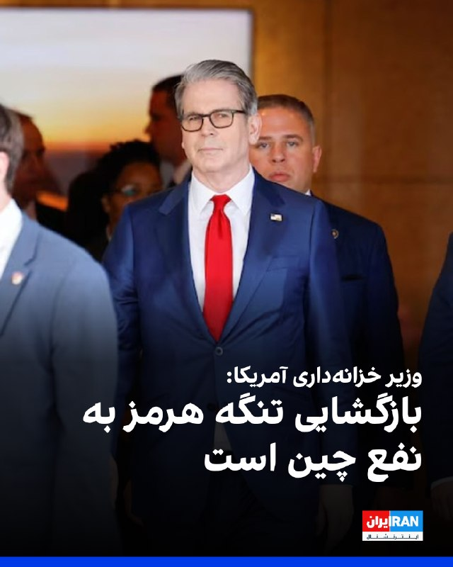

اسکات بسنت، وزیر خزانه‌داری آمریکا گفت بازگشایی تنگه هرمز به نفع چین است و پکن هر کاری بتواند برای بازگشایی این آبراه انجام خواهد داد.

او در مصاحبه با سی‌ان‌بی‌سی تاکید کرد چین پشت صحنه و تا جایی که بر جمهوری اسلامی نفوذ داشته باشد، برای بازگشایی تنگه هرمز همکاری خواهد کرد.
https://iranintl.com/202605140954

## IranIntlTV — post 337145

  

🔻فریده شجاعی، نایب‌رییس بانوان فدراسیون فوتبال، در مراسم بدرقه تیم ملی در شامگاه چهارشنبه ۲۳ اردیبهشت گفت: «به تمامی اعضای هیات‌رییسه فدراسیون فوتبال اعلام شده در جام جهانی حضور داشته باشند.»

🔹صحبت‌های شجاعی در حالی مطرح می‌شد که تیم ملی در فاصله کمتر از یک ماه تا آغاز جام‌جهانی با بحران ویزا و چالش مالی روبه‌رو است. هنوز ویزای ملی‌پوشان صادر نشده و کادر فنی نمی‌داند کدام بازیکن ویزا خواهد گرفت و به کدام بازیکن ویزا نخواهند داد.

🔹احتمال دارد برای برخی اعضای کاروان ایران به دلیل سوابق فعالیت یا ارتباط با سپاه پاسداران، ویزا صادر نشود.
@iranintltvsport

## IranIntlTV — post 337143

  

خبرگزاری فارس، وابسته به سپاه پاسداران به نقل از «منبع آگاه» نوشت: «با تصمیم جمهوری اسلامی، عبور شماری از کشتی‌های چینی از تنگه هرمز، از شامگاه چهارشنبه، ۲۳ اردیبهشت و پس از توافق بر سر پروتکل‌های مدیریت جمهوری اسلامی بر این آبراه آغاز شده است.»

بر اساس این گزارش، این تصمیم پس از پیگیری‌های مقام‌های چین و در چارچوب «روابط راهبردی» تهران و پکن اتخاذ شد و کشتی‌های مورد درخواست چین اجازه عبور یافتند.
https://iranintl.com/202605149673

## IranIntlTV — post 337142

  <a href="telegram/content/IranIntlTV_337142_1778757357.mp4" target="_blank">🎬 Download video</a>

همزمان با موج تازه بیکاری در شرایط جنگی و بحران اقتصادی، آمارهای رسمی نشان می‌دهد حدود ۲۰۰ هزار نفر متقاضی دریافت بیمه بیکاری هستند. روزنامه شرق در گزارشی نوشت روند دریافت بیمه بیکاری از سازمان تامین اجتماعی به مسیری دشوار برای متقاضیان تبدیل شده است.
گفت‌وگو با اشکان نظام‌آبادی، روزنامه‌نگار اقتصادی
@iranintltv

## IranIntlTV — post 337141

  

عباس عراقچی، وزیر خارجه جمهوری اسلامی که برای شرکت در اجلاس بریکس، به دهلی نو سفر کرده، گفت: «امارات متحده عربی مستقیما در جنگ علیه ما دخیل بود.»
او خطاب به اماراتی‌ها گفت: «ائتلاف با اسرائیل هم از شما محافظت نکرد.»

عراقچی ادامه داد: «اماراتی‌ها اجازه دادند از سرزمین‌شان برای شلیک توپخانه و تجهیزات علیه ما استفاده شود.»

وزیر خارجه جمهوری اسلامی افزود: «امارات متحده عربی شریک فعال جنگ علیه ماست و هیچ تردیدی در این باره وجود ندارد و ما شگفت‌زده شدیم که برادران ما در امارات متحده عربی تصمیم گرفتند فعالانه به جنگ علیه ما بپیوندند.»

عراقچی تاکید کرد: «همدستی امارات متحده عربی با اسرائیل غیرقابل بخشش است.»
https://iranintl.com/202605148778

## IranIntlTV — post 337140

  <a href="telegram/content/IranIntlTV_337140_1778757361.mp4" target="_blank">🎬 Download video</a>

اظهارات و گزارش‌های رسمی چین و آمریکا حاکی است دونالد ترامپ و شی جین‌پینگ، رهبران دو کشور، در دیدار کلیدی خود در پکن درباره ایران گفت‌وگو کرده‌اند.

توماج طاهباز، خبرنگار ایران‌اینترنشنال، گزارش می‌دهد
@iranintltv

## IranIntlTV — post 337139

  <a href="telegram/content/IranIntlTV_337139_1778757363.mp4" target="_blank">🎬 Download video</a>

کاخ سفید اعلام کرد در جریان سفر دونالد ترامپ و دیدار او با شی‌ جین‌پینگ در پکن، روسای جمهور آمریکا و چین بر ممنوعیت دستیابی جمهوری اسلامی به سلاح هسته‌ای توافق کردند.
گفت‌وگو با عطا محامد، کارشناس روابط بین‌الملل
@iranintltv

## IranIntlTV — post 337138

در این قسمت چرتکه، محمد ماشینچیان سناریوهای مختلف قدرت خرید را تا پایان سال ۱۴۰۵ بررسی کرده و تاثیر نوسان نرخ دلار بر معیشت خانوارها را توضیح می‌دهد.
هنگام بررسی قدرت خرید حداقل دستمزد از ۱۳۹۴ تا ۱۴۰۵ در می‌یابیم که از ۹۷ به این سو، حتی وقتی قدرت خرید کارگر در ابتدای سال، حدود ۱۳۰ دلار بوده، مثل ۱۴۰۱ و ۱۴۰۴، در نتیجه تورم و بالا رفتن دلار، قدرت خرید تا پایان سال، به زیر ۱۰۰ دلار رسیده است.

تماشای نسخه کامل «چرتکه» در یوتیوب:
https://youtu.be/1W2RoMvSqPQ
@iranintltv

## IranIntlTV — post 337137

  

🔻مهدی تاج، رییس فدراسیون فوتبال، پنج‌شنبه ۲۴ اردیبهشت، در حاشیه اهدای جام قهرمانی فوتسال زنان به استقلال گفت: «فردا یا پس‌فردا در ترکیه جلسه سرنوشت‌سازی با فیفا داریم، چون باید به ما گارانتی بدهند. مساله ویزا حل نشده و هنوز هیچ ویزایی ندادند. منتظریم ببینیم رفتار طرف مقابل چیست.»

🔹فدراسیون فوتبال در فاصله کمتر از یک ماه تا آغاز جام‌جهانی با بحران ویزا و چالش مالی دست‌به‌گریبان است. امیر قلعه‌نویی هنوز نمی‌داند کدام بازیکن ویزا خواهد گرفت و کدام بازیکن را در آمریکا در اختیار خواهد داشت.

🔹احتمال دارد برای برخی اعضای کاروان ایران به دلیل سوابق فعالیت یا ارتباط با سپاه پاسداران، ویزا صادر نشود.
@iranintltvsport

## IranIntlTV — post 337136

  <a href="telegram/content/IranIntlTV_337136_1778757366.mp4" target="_blank">🎬 Download video</a>

شهروندان با ارسال پیام‌های متعدد به ایران‌اینترنشنال از افزایش بیکاری، دشواری پیدا کردن شغل در شهرهای مختلف و مشکلات معیشتی ناشی از آن در ایران خبر دادند.
@iranintltv

## IranIntlTV — post 337135

  <a href="telegram/content/IranIntlTV_337135_1778757369.mp4" target="_blank">🎬 Download video</a>

دفتر نخست‌وزیری اسرائیل چهارشنبه گزارش داد بنیامین نتانیاهو، نخست‌وزیر اسرائیل، در جریان عملیات «غرش شیران» به‌صورت محرمانه به امارات سفر کرده است. به گفته مقام‌های اسرائیلی، این سفر به گشایشی تاریخی در روابط دو طرف منجر شده است. وزارت خارجه امارات گزارش‌ها درباره این سفر را تکذیب کرده است.

ارزیابی محمدجواد اکبرین، عضو تحریریه ایران‌اینترنشنال
@iranintltv

## IranIntlTV — post 337134

  <a href="telegram/content/IranIntlTV_337134_1778757372.mp4" target="_blank">🎬 Download video</a>

سازمان عملیات تجارت دریایی بریتانیا اعلام کرد یک کشتی که در ۷۰ کیلومتری شمال شرقی بندر فجیره لنگر انداخته بود، توقیف شده و اکنون به سمت آب‌های ایران در حرکت است.
جزییات بیشتر با مرتضی کاظمیان، عضو تحریریه ایران‌اینترنشنال
@iranintltv

## IranIntlTV — post 337133

  <a href="telegram/content/IranIntlTV_337133_1778757374.mp4" target="_blank">🎬 Download video</a>

شی جین‌پینگ، رهبر چین، در دیدار با دونالد ترامپ، رییس‌جمهوری ایالات متحده، گفت همواره باور داشته که «چین و آمریکا منافع مشترک بیشتری نسبت به اختلافاتشان دارند». او همچنین بر اهمیت ثبات روابط پکن و واشینگتن برای دو کشور و جهان تاکید کرد.
@iranintltv

## ManotoTV — post 105441

  <a href="telegram/content/ManotoTV_105441_1778757376.mp4" target="_blank">🎬 Download video</a>

معین، خواننده شهیر در صفحه اینستاگرام خود با انتشار متنی، شایعات مطرح شده در خصوص اجرا برای تیم فوتبال در جام جهانی را تکذیب کرد. معین در متن خود از جمله نوشته: «عشق من به مردم و سرزمینم همیشه واقعی بوده. اما صدای من زمانی معنا دارد که دل مردم آرام باشد و حال ایران خوب»
روز گذشته اظهارات مهدی تاج، رئیس فدراسیون فوتبال جمهوری‌اسلامی به شایعاتی از این دست دامن زده بود.

## ManotoTV — post 105440

  <a href="telegram/content/ManotoTV_105440_1778757377.mp4" target="_blank">🎬 Download video</a>

مهدی تاج، رئیس فدراسیون فوتبال جمهوری‌اسلامی گفته «مسئله ویزا حل نشده و هنوز هیچ روادیدی برای اعضای تیم ملی فوتبال ایران صادر نشده است.» و افزوده «منتظریم ببینیم رفتار طرف مقابل چیست.»
او از «جلسه سرنوشت‌ساز» با فیفا صحبت به میان آورده چرا که به گفته تاج فیفا «باید به ما گارانتی بدهد»

## ManotoTV — post 105439

  <a href="telegram/content/ManotoTV_105439_1778757378.mp4" target="_blank">🎬 Download video</a>

روزنامه نیویورک‌تایمز گزارش داد نهادهای اطلاعاتی آمریکا معتقدند شرکت‌های چینی درباره ارسال مخفیانه تسلیحات به جمهوری اسلامی از طریق کشورهای ثالث گفت‌وگو کرده‌اند تا منشأ این محموله‌ها پنهان بماند.
این گزارش ساعاتی پس از ورود دونالد ترامپ به پکن منتشر شد و می‌تواند فشارها بر رئیس‌جمهوری آمریکا را برای درخواست از شی جین‌پینگ به‌منظور قطع حمایت از جمهوری اسلامی افزایش دهد.
بر اساس این گزارش، مقام‌های آمریکایی بر سر این‌که آیا این انتقال‌ها بالفعل انجام شده یا نه اختلاف نظر دارند، اما گفته‌اند چنین اقداماتی بعید است بدون اطلاع مقام‌های ارشد چینی صورت گرفته باشد.
رسانه‌های آمریکایی پیش‌تر نیز گزارش داده بودند چین موشک‌های دوش‌پرتاب ضدهوایی به جمهوری اسلامی ارسال کرده است؛ تسلیحاتی که می‌توانند هواپیماها و پهپادها را هدف قرار دهند. همچنین گفته می‌شود تهران در سال ۲۰۲۴ یک ماهواره جاسوسی چینی دریافت کرده که برای شناسایی نیروهای آمریکایی در خاورمیانه از آن استفاده می‌کند.
در همین حال، گزارش‌هایی از بازسازی توان موشکی جمهوری اسلامی پس از حملات آمریکا و اسرائیل منتشر شده است. بر اساس ارزیابی سازمان سیا، بخش قابل توجهی از موشک‌های بالستیک و پرتابگرهای متحرک ایران همچنان سالم مانده‌اند.

## ManotoTV — post 105437

  <a href="telegram/content/ManotoTV_105437_1778757380.mp4" target="_blank">🎬 Download video</a>

بانک مرکزی ترکیه هدف تورم پایان سال ۲۰۲۶ را از ۱۶ به ۲۴ درصد افزایش داد و اعلام کرد پیامدهای جنگ ایران و اسرائیل و افزایش تنش‌ها در خاورمیانه، فشارهای تورمی را تشدید کرده است. رئیس بانک مرکزی ترکیه گفت افزایش بهای انرژی و اختلال در عرضه، به‌ویژه برای اقتصادهای وابسته به واردات مانند ترکیه، یک ریسک جدی محسوب می‌شود. این بانک همچنین پیش‌بینی تورم پایان ۲۰۲۷ را از ۹ به ۱۵ درصد افزایش داد. نرخ تورم ماهانه ترکیه در آوریل به بیش از ۴ درصد و تورم سالانه به حدود ۳۲ درصد رسید.

## ManotoTV — post 105436

  <a href="telegram/content/ManotoTV_105436_1778757380.mp4" target="_blank">🎬 Download video</a>

مرکز عملیات تجارت دریایی بریتانیا (UKMTO) در یک هشدار امنیتی اعلام کرد یک کشتی در دریای عمان، در حالی که در لنگرگاه قرار داشت، توسط «افراد غیرمجاز» تصرف شده و اکنون به سمت آب‌های سرزمینی ایران در حرکت است.
بر اساس هشدار رسمی UKMTO، این حادثه حدود ۳۸ مایل دریایی شمال شرقی فجیره امارات متحده عربی رخ داده است. هویت کشتی و جزئیات بیشتر درباره مهاجمان هنوز اعلام نشده است.
این نهاد بریتانیایی اعلام کرد در حال بررسی موضوع است و از همه شناورها خواسته هرگونه فعالیت مشکوک را فورا گزارش دهند.
هشدار صبح امروز چهارشنبه منتشر شده و نشان‌دهنده یک رخداد امنیتی تازه و حساس در آبراه‌های منطقه است.
اگرچه این نهاد هنوز درباره عاملان احتمالی این حادثه اظهار نظر نکرده، اما چنین هشدارهایی معمولا در موارد مرتبط با توقیف کشتی‌ها، دزدی دریایی یا عملیات نیروهای نظامی و شبه‌نظامی در منطقه صادر می‌شود.

## ManotoTV — post 105435

  <a href="telegram/content/ManotoTV_105435_1778757381.mp4" target="_blank">🎬 Download video</a>

بر اساس گزارش‌های منتشرشده در شبکه‌های اجتماعی، خاطره خدادادی، دانشجوی رشته دندانپزشکی در بلاروس، پس از اظهار نظر درباره مسائل ایران در یک کانال تلگرامی، با دخالت سفارت جمهوری اسلامی بازداشت و به ۱۴ روز زندان محکوم شده است.
به گفته نزدیکان او، قرار بود دهم اردیبهشت آزاد شود، اما همچنان در بازداشت به‌سر می‌برد و وضعیت تحصیل و اقامتش نامشخص است. همچنین گزارش شده که او در مدت بازداشت از دسترسی به وکیل و تماس با دوستانش محروم بوده است.

## ManotoTV — post 105434

  <a href="telegram/content/ManotoTV_105434_1778757382.mp4" target="_blank">🎬 Download video</a>

رسانه‌های داخلی ایران گزارش دادند زمین‌لرزه‌ای به بزرگی ۵ ریشتر منطقه بردسیر در استان کرمان را لرزاند.
بر اساس این گزارش‌ها، کانون زلزله در عمق ۸ کیلومتری زمین و در نزدیکی روستای کمال‌آباد از توابع شهرستان بردسیر بوده است. هلال‌احمر اعلام کرد دو تیم ارزیاب برای بررسی وضعیت به منطقه اعزام شده‌اند.

## FarsiVOA — post 217712

دونالد ترامپ، رئیس جمهوری آمریکا، روز پنج‌شنبه طی سخنانی که در مهمانی شام رسمی که به افتخار او در پکن برگزار شده است، گفت که دو طرف «گفت‌وگوها و نشست‌های بسیار مثبت و سازنده‌ای» داشته‌اند. او رابطه آمریکا و چین را یکی از «سرنوشت‌سازترین روابط در تاریخ جهان» توصیف کرد.

## FarsiVOA — post 217711

  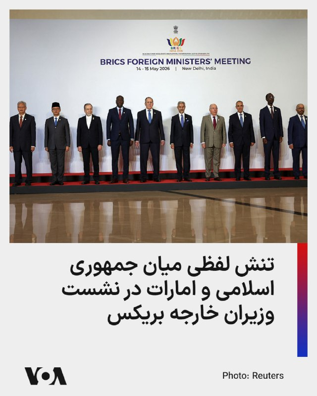

وزیر خارجه جمهوری اسلامی در نشست وزیران خارجه کشورهای عضو بریکس در دهلی نو، امارات متحده عربی را به «دخالت مستقیم در عملیات نظامی» علیه حکومت ایران متهم کرد.

بر اساس گزارش خبرگزاری مهر، عباس عراقچی در پاسخ به اظهارات نماینده امارات گفت: «من در سخنرانی‌ خود نام امارات متحده عربی را ذکر نکردم، به خاطر حفظ وحدت و ترجیح دادم به آن اشاره نکنم. اما در واقع باید بگویم که امارات مستقیماً در اقدام تجاوزکارانه علیه کشور من دخیل بود. زمانی که این تجاوز آغاز شد، آنها حتی از محکوم کردن آن خودداری کردند.»

بر اساس این گزارش، نماينده امارات در این نشست بر رعایت حقوق بین‌الملل تأکید کرده بود.

در روزهای اخیر، رسانه‌های بین‌المللی گزارش دادند که امارات متحده عربی در جریان جنگ، با هماهنگی اسرائیل حملاتی را علیه تأسیسات انرژی ایران انجام داد.

این حملات در واکنش به حملات جمهوری اسلامی علیه امارات در جریان جنگ صورت گرفت. امارات در میان دیگر کشورهایی که جمهوری اسلامی به آنها حمله کرد، بیشترین تعداد حمله را متحمل شد.
@FarsiVOA

## FarsiVOA — post 217710

  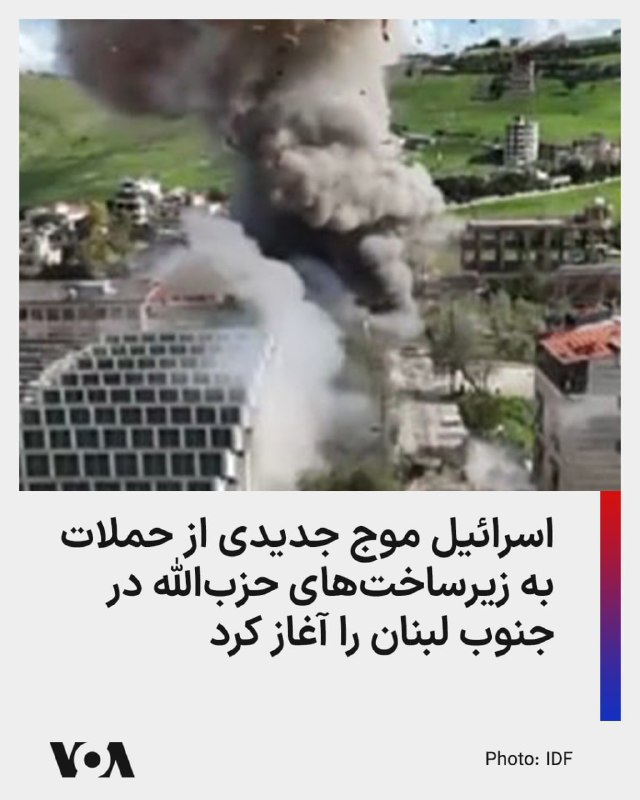

ارتش اسرائیل اعلام کرد که روز پنجشنبه موجی از حملات هوایی را علیه سایت‌های زیرساختی حزب‌الله در چندین منطقه در جنوب لبنان آغاز کرده است.

کمی قبل از بیانیه ارتش اسرائیل، هشدارهای تخلیه برای هشت روستا در جنوب لبنان صادر شده بود.

همزمان، ارتش اسرائیل پنجشنبه اعلام کرد که یک پهپاد انفجاری که توسط حزب‌الله پرتاب شده بود در داخل خاک اسرائیل و در نزدیکی مرز اسرائیل-لبنان سقوط کرد.

بر اساس این گزارش، چند غیرنظامی اسرائیلی زخمی شده و برای درمان به بیمارستان منتقل شدند.
@FarsiVOA

## FarsiVOA — post 217709

🔺رویترز: جنگنده‌های سعودی در جریان جنگ، به شبه‌نظامیان عراق حمله کردند

▪️خبرگزاری رویترز به نقل از چندین منبع مطلع گزارش داد که جنگنده‌های عربستان سعودی در جریان جنگ اخیر علیه جمهوری اسلامی، اهداف مرتبط با شبه‌نظامیان شیعه مورد حمایت تهران در عراق را بمباران کردند.

▪️بر اساس این گزارش، این حملات سایت‌هایی را هدف قرار دادند که از آن‌ها حملات پهپادی و موشکی علیه عربستان سعودی و دیگر کشورهای خلیج فارس انجام می‌شد.

▪️به گفته منابع آگاه، صدها پهپادی که کشورهای عربی خلیج فارس را در جریان جنگ اخیر هدف قرار دادند از عراق شلیک شده بودند.

⬇️ بیشتر بخوانید:
https://ir.voanews.com/a/8149921.html

## FarsiVOA — post 217708

  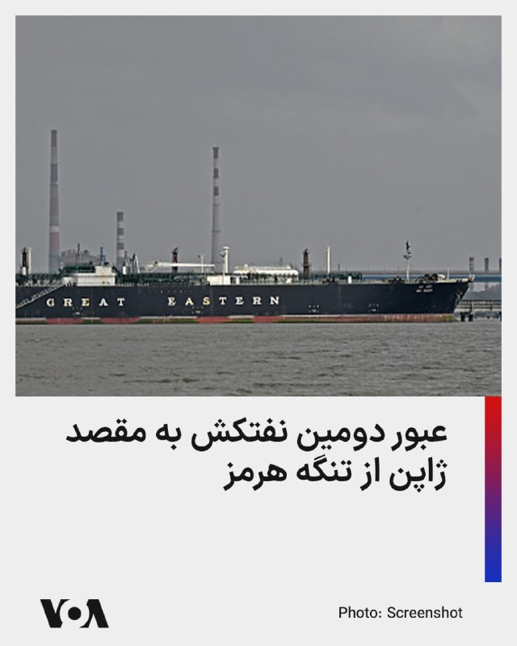

خبرگزاری رویترز از عبور دومین نفتکش به مقصد ژاپن از تنگه هرمز در روز پنج‌شنبه خبر داد. این نفتکش حامل ۱.۲ میلیون بشکه نفت کویت و ۷۰۰ هزار بشکه نفت امارات است.

نفتکش قبلی حدود دو هفته پیش از تنگه هرمز گذشته بود.

سانائه تاکایچی نخست‌وزیر ژاپن می‌گوید در راستای خروج محموله‌های نفتی ژاپن از تنگه هرمز، مستقیماً با رئیس‌جمهور ایران تماس گرفته و از بابت اجازه عبور نفتکش‌ها تشکر کرد. او گفت هنوز ۳۹ کشتی مرتبط با ژاپن در خلیج فارس است.

پیش از انسداد تنگه هرمز توسط جمهوری اسلامی، ۹۵ درصد نفت وارداتی ژاپن از کشورهای عرب حوزه خلیج فارس انجام می‌شد.
@FarsiVOA

## FarsiVOA — post 217707

🔺کاخ سفید: ترامپ و شی درباره ضرورت باز بودن تنگه هرمز توافق کردند

▪️کاخ سفید اعلام کرد که رهبران آمریکا و چین در دیدار خود درباره ضرورت باز بودن تنگه هرمز که از سوی نیروهای حکومت ایران عملاً مسدود شده، توافق کردند.

▪️پیشتر مارکو روبیو، وزیر امور خارجه آمریکا، در مسیر سفر به چین در همراهی با رئیس‌جمهور آمریکا، درباره تلاش‌ها برای وادار کردن چین به برخورد با جمهوری اسلامی ایران در ارتباط با اقداماتش در خلیج فارس توضیح داد.

▪️در بیانیه کاخ سفید همچنین آمده است که ترامپ و شی همچنین درباره ادامه پیشرفت در توقف ورود مواد شیمیایی پیش‌ساز فنتانیل به ایالات متحده، و همچنین افزایش خرید محصولات کشاورزی آمریکا توسط چین گفت‌وگو کردند.

⬇️ بیشتر بخوانید:
https://ir.voanews.com/a/8149919.html

## FarsiVOA — post 217706

  

سازمان عملیات تجارت دریایی بریتانیا از تصرف یک کشتی در دریای عمان خبر داد. بر اساس این گزارش یک کشتی لنگر انداخته در ۳۸ مایل دریایی شمال شرق بندر فجیره امارات توسط افراد غیرمجاز تصرف شده و اکنون به سمت آب‌های سرزمینی ایران در حرکت است.
@FarsiVOA

## FarsiVOA — post 217705

🔺تلاش اسرائیل برای افزایش بردِ جنگنده‌ها بدون نیاز به سوخت‌رسانی

▪️وزارت دفاع اسرائیل اعلام کرد که قراردادی را با یکی از زیرمجموعه‌های شرکت دفاعی البیت برای توسعه «قابلیت بردِ افزایش‌یافته» جنگنده اف-۳۵آی امضا کرده است.

▪️این قرارداد شامل «توسعه و یکپارچه‌سازی مخازن سوخت خارجی» بر اساس طرحی است که شرکت سایکلون پیش‌تر برای جنگنده اف-۱۶ توسعه داده است.

▪️وزارت دفاع اسرائیل در بیانیه‌ای نوشت که این قابلیت جدید انتظار می‌رود «برد عملیاتی هواپیما را افزایش دهد، وابستگی به سوخت‌رسانی هوایی را کاهش دهد و انعطاف‌پذیری عملیاتی را در مأموریت‌های دوربرد تقویت کند.»

▪️اسرائیل اکنون ۴۸ فروند اف‌-۳۵آی در اختیار دارد؛ در حالی که سفارش اولیه این کشور ۵۰ فروند بود.

⬇️ بیشتر بخوانید:
https://ir.voanews.com/a/8149918.html

## DW_Farsi — post 124681

🔶 آمریکا استقرار چهار هزار سرباز در اروپا را متوقف کرد

بر اساس گزارش‌ها، وزارت دفاع (جنگ) آمریکا اعزام بیش از چهار هزار سرباز از یک تیپ رزمی به اروپا را متوقف کرده است. به نوشته روزنامه "وال‌استریت ژورنال" به نقل از یکی از مقامات پنتاگون، این تصمیم روز چهارشنبه ۱۳ مه در نشستی میان فرماندهی اروپایی نیروهای مسلح آمریکا (EUCOM) و بخش‌هایی از ارتش این کشور اعلام شد.

قرار بود این نیروها برای مأموریتی ۹ ماهه در لهستان مستقر شوند.

ارتش آمریکا در ماه مارس اعلام کرده بود که این تیپ رزمی قرار است در چارچوب یک برنامه دوره‌ای معمول، جایگزین نیروهای دیگر شود. اما اکنون انتقال بخشی از تجهیزات و حتی برخی سربازان که در مسیر اعزام بوده‌اند، به دلیل این تصمیم جدید به تعویق افتاده است؛ تصمیمی غیرمنتظره که گفته می‌شود بسیاری از اعضای ارتش آمریکا را غافلگیر کرده است.

به نوشته وال‌استریت ژورنال، گرچه فرماندهی اروپایی آمریکا توصیه کرده بود که پس از پایان مأموریت دوره‌ای چندماهه، جایگزینی برای این ۴۰۰۰ سرباز در نظر گرفته نشود، اما خواهان توقف فوری اعزام نشده بود.

@dw_farsi

## DW_Farsi — post 124680

  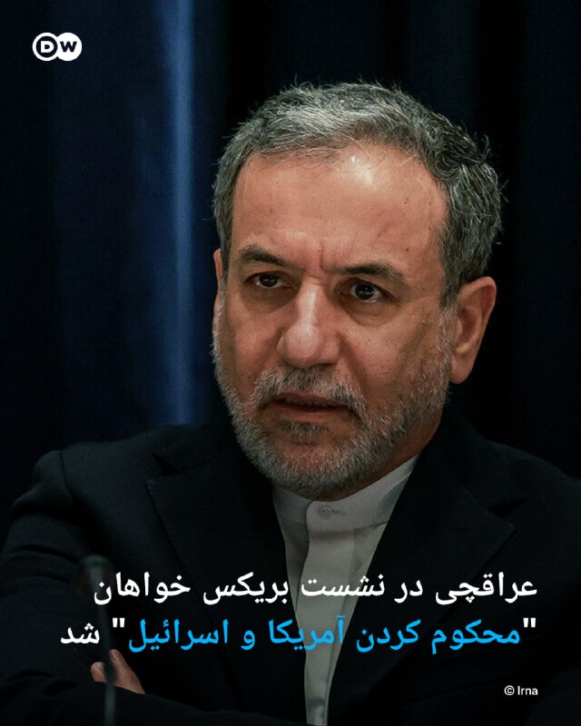

🔶 عراقچی در نشست بریکس خواهان "محکوم کردن آمریکا و اسرائیل" شد

عباس عراقچی، وزیر خارجه جمهوری اسلامی که برای حضور در نشست بریکس به هند سفر کرده است، پنجشنبه ۱۴ مه (۲۴ اردیبهشت) در جریان سخرانی خود از "سیاست‌های یک‌جانبه‌گرایانه" آمریکا انتقاد و بر "ضرورت همکاری کشورهای عضو برای مقابله با نقض قوانین بین‌المللی و نقش‌آفرینی این گروه در شکل‌دهی به نظم جهانی عادلانه‌تر" تاکید کرد.

او "زورگویی و سیاست‌های تحمیلی آمریکا" را مورد انتقاد قرار داد و همکاری کشورهای عضو برای مقابله با این رویکردها را ضروری خواند.

وزیر امور خارجه ایران با اشاره به "نقض حاکمیت کشورها" و "استانداردهای دوگانه" در عرصه سیاست بین‌الملل افزود: «احساس مصونیت از مجازات در برخی قدرت‌ها موجب تداوم این اقدامات شده و باید این وضعیت با اقدام جمعی کشورها پایان یابد.»

عراقچی از کشورهای عضو سازمان بریکس و دیگر اعضای جامعه جهانی خواست تا "نقض حقوق بین‌الملل از سوی آمریکا و اسرائیل، از جمله حمله علیه ایران" را صراحتا محکوم کرده و مانع از "سیاسی‌سازی نهادهای بین‌المللی" شوند.

او در پایان تاکید کرد: «بریکس می‌تواند نقش مهمی در شکل‌دهی به نظمی جهانی عادلانه‌تر و متوازن‌تر ایفا کند؛ نظمی که در آن قدرت جایگزین قانون نشود و ملت‌های مستقل بتوانند مسیر توسعه و استقلال خود را دنبال کنند.»

بریکس نام گروهی به رهبری برخی از کشورهایی است که اقتصادی نوظهور در جهان دارند. برزیل، روسیه، هند، چین و آفریقای جنوبی اعضای اصلی بریکس هستند. نام بریکس از حروف اول نام کشورهای عضو به زبان انگلیسی گرفته شده است. ایران نیز از دو سال پیش به صورت رسمی به عضویت این سازمان درآمده است.

میزبانی این دوره از نشست وزیران امور خارجه بریکس را هند بر عهده دارد که اقتصاد و بخش انرژی آن به ویژه به خاطر انسداد تنگه هرمز زیر فشار قرار گرفته است. از این رو سایه جنگ ایران و بحران سوخت و انرژی ناشی از آن بر این نشست سنگینی می‌کند.

@dw_farsi

## DW_Farsi — post 124679

  

🔶 معین خبر اجرای سرود برای تیم ملی فوتبال ایران را تکذیب کرد

معین، خواننده معروف پاپ ساکن لس‌آنجلس، شایعات در مورد خواندن قطعه‌ای برای تیم ملی فوتبال ایران را تکذیب کرد. او پنجشنبه ۱۴ مه (۲۴ اردیبهشت) با انتشار پستی در اینستاگرام تأکید کرد که این موضوع صحت ندارد.

او نوشت: «عشق من به مردم و سرزمینم همیشه واقعی بوده، اما صدای من زمانی معنا دارد که دل مردم ایران آرام باشد و حال ایران خوب.»

مهدی تاج، رئیس فدراسیون فوتبال ایران، به تازگی در حاشیه مراسم بدرقه تیم ملی برای حضور در جام جهانی ۲۰۲۶ در پاسخ به پرسش یک خبرنگار درباره شایعات مربوط به اجرای یک قطعه برای تیم ملی توسط معین گفته بود: «فدراسیون نقشی در این موضوع ندارد، اما در جریان هستیم، از هر اثری که برای حمایت از تیم ملی تولید شود استقبال می‌کنیم.‌»

تاج در ادامه در مورد "رسمیت‌ داشتن این قطعه" افزوده بود: «اگر ایشان [معین] بخواند... هر کسی از تیم ملی ایران دفاع و حمایت کند، جایش روی چشم ماست.»

@dw_farsi

## DW_Farsi — post 124678

  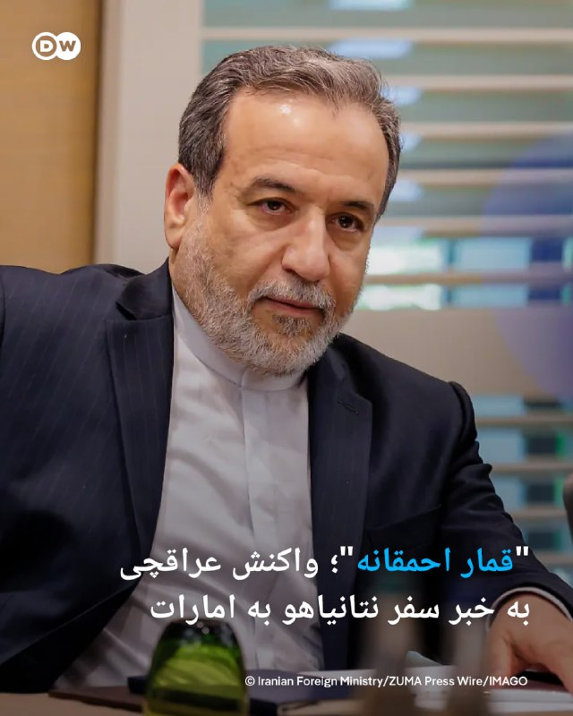

🔶 "قمار احمقانه"؛ واکنش عراقچی به خبر سفر نتانیاهو به امارات

عباس عراقچی در واکنش به علنی شدن خبر سفر نخست‌وزیر اسرائیل به امارات متحده عربی گفت: «نتانیاهو اکنون به‌صورت علنی آنچه را که نهادهای امنیتی ایران مدت‌ها قبل به رهبری ما منتقل کرده بودند، افشا کرده است.»

وزیر خارجه جمهوری اسلامی در این باره که چرا تهران علیرغم اطلاع از این مسئله، تا کنون اقدام به افشای آن نکرده است، چیزی نگفت.

عراقچی در پست شدید‌الحن خود که در شبکه ایکس (توئیتر سابق) منتشر کرد، "دشمنی با ایران" را "قماری احمقانه" خواند و افزود: «همکاری و همدستی با اسرائیل در این مسیر، غیرقابل بخشش است. کسانی که در همدستی با اسرائیل برای ایجاد تفرقه نقش دارند، باید پاسخگو باشند.»

دفتر بنیامین نتانیاهو چهارشنبه ۱۳ مه (۲۳ اردیبهشت) اعلام کرده بود، نخست وزیر اسرائیل در جریان جنگ ایران به‌طور محرمانه به امارات سفر کرده و با محمد بن زاید، رئیس امارات، دیدار داشته است. به گفته دفتر نتانیاهو این سفر به "یک دستاورد تاریخی" در روابط دو طرف منجر شده است.

در این میان اما وزارت امور خارجه امارات متحده با انتشار بیانیه‌ای اعلام کرده است که این کشور "گزارش‌های منتشرشده درباره سفر نخست‌وزير اسرائيل يا استقبال از يک هيات نظامی اسرائيلی را تکذيب می‌کند".

این وزارتخانه تأکید کرد که روابط امارات و اسرائیل "علنی و بر پایه پیمان ابراهیم" است و از این رو "تمامی سفرها و دیدارهای رسمی به شکل شفاف اعلام شده و انجام می‌گیرند".

پیش از انتشار خبر مربوط به سفر نتانیاهو به امارات، نشریه وال استریت ژورنال در گزارشی نوشته بود دیوید بارنیا، رئیس موساد، نیز دست‌کم دو بار در ماه‌های مارس و آوریل به امارات سفر کرد تا درباره روند جنگ با ایران و هماهنگی‌های امنیتی با مقام‌های این کشور گفت‌وگو کند.

@dw_farsi

## DW_Farsi — post 124677

  

🔶 عبور دومین نفتکش ژاپنی از تنگه هرمز

داده‌های ردیابی از شرکت ال‌اس‌ای‌جی (LSEG) که تردد کشتی‌ها را رهگیری می‌کند، پنجشنبه ۱۴ مه (۲۴ اردیبهشت) نشان داد که یک نفت‌کش ژاپنی از تنگه هرمز  عبور کرده است. این نفت‌کش متعلق به "انیوس" (Eneos)، بزرگترین شرکت نفت و انرژی ژاپن بوده و تحت پرچم پاناما در حرکت است.

این دومین بار است که یک کشتی متعلق به شرکت‌های ژاپنی از آغاز جنگ آمریکا و اسرائیل علیه جمهوری اسلامی و انسداد تنگه هرمز به این سو، موفق به عبور از این آبراه حیاتی شده است. پیش از آغاز جنگ ایران، ژاپن حدود ۹۵ درصد از نفت خود را از کشورهای حوزه حلیج فارس وارد می‌کرد.

می‌یاتا توموهیده، مدیر عامل شرکت انیوس روز پنجشنبه به خبرنگاران گفت که این نفت‌کش به‌طور امن تنگه هرمز را پشت سر گذاشته و به احتمال قوی اواخر ماه مه یا اوایل ماه ژوئن به ژاپن خواهد رسید. این نفت‌کش حامل ۱.۲ میلیون بشکه نفت خام کویت و ۷۰۰ هزار بشکه نفت امارات متحده عربی است که بنا بر داده شرکت رهگیری "کپلر" در اواخر ماه فوریه بارگیری شده و قرار بوده که سوم ژوئن به ژاپن برسد.

ژاپن از زمان بروز جنگ در اواخر ماه فوریه تلاش‌های دیپلماتیک خود را تقویت کرد و در عین حال به دنبال بدیل‌هایی برای جایگزین کردن محموله‌های تحویل‌داده‌نشده بوده است. دولت ژاپن در عین حال یارانه‌های درخورتوجهی را برای پایین نگه داشتن بهای بنزین در بازارهای داخلی تخصیص داده است.

وزارت خارجه ژاپن با انتشار بیانیه‌ای اعلام کرد که دولت این کشور در ارتباط با عبور این نفت‌کش از تنگه هرمز، با جمهوری اسلامی در تماس مسقتیم بوده است. سانائه تاکایچی، نخست‌وزیر ژاپن نیز ماه آوریل در تماسی تلفنی با مسعود پزشکیان، رئیس جمهور ایران گفت‌وگو کرد.

این وزارتخانه در بیانیه خود تأکید کرد، توکیو به تلاش‌های دیپلماتیک و هماهنگی‌ ادامه خواهد داد تا ۳۹ کشتی مرتبط با این کشور را از آب‌های خلیج فارس خارج کند.
نخستین کشتی ژاپنی که موفق به عبور از تنگه هرمز شده بود، نفت‌کش "ایدمیتسو مارو" (Idemitsu Maru)، متعلق به یک شرکت وابسته به کمپانی نفتی ایدمیتسو کوسان بود. این کشتی حامل نفت عربستان سعودی، اواخر ماه آوریل از تنگه هرمز گذر کرده بود.

@dw_farsi

## DW_Farsi — post 124676

🔶 عربستان ناوگان عظیم کامیون‌ها را جایگزین تنگه هرمز کرده است

پس از حمله آمریکا و اسرائیل به ایران، مدیرعامل شرکت بزرگ دولتی "معادن" در عربستان به سرعت وارد عمل شد. این شرکت که دفتر مرکزی آن در ریاض است، عمدتا در معادن خود طلا، بوکسیت، مس، مواد معدنی صنعتی و فسفات استخراج می‌کند. عربستان به‌طور معمول، این مواد خام را از طریق بنادر خلیج فارس صادر کرده و از راه تنگه هرمز  به سراسر جهان منتقل می‌کند. اما در شرایط کنونی این مسیر از آغاز جنگ ایران،تا کنون مسدود شده است.

بر اساس گزارشی از روزنامه وال‌استریت ژورنال، شرکت "معادن" تنها ظرف دو هفته توانسته انتقال کود شیمیایی را از سراسر عربستان به سواحل دریای سرخ سازماندهی کند. برای این کار هزاران کامیون به‌کار گرفته شده‌اند که از آن زمان تقریباً به‌صورت شبانه‌روزی در حال فعالیت هستند.

این روزنامه به نقل از مدیرعامل شرکت می‌نویسد: «تعداد کامیون‌ها نخست از ۶۰۰ به ۱۶۰۰ رسید و بعد بالغ بر ۲۰۰۰ کامیون شد. اما حالا ۳۵۰۰ کامیون بین خلیج فارس و دریای سرخ در رفت‌وآمد هستند.» هدف این است که عقب‌ماندگی صادرات عربستان تا پایان ماه مه جبران شود.

@dw_farsi

## Persian_Trend_Official — post 14116

  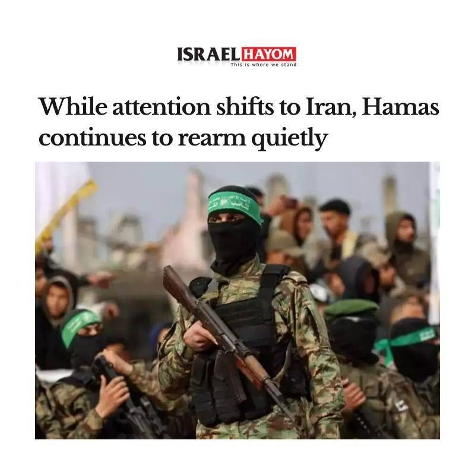

اسرائیل هیوم: در حالی که توجه‌ها به سمت ایران معطوف شده، حماس بی سر و صدا در حال تسلیح مجدد خود است.

☆Phantom☆

📌 @persian_trend_official
پرشین ترند | متفاوت‌ترین کانال نظامی

## Persian_Trend_Official — post 14115

  <a href="telegram/content/Persian_Trend_Official_14115_1778757391.mp4" target="_blank">🎬 Download video</a>

💢حمله حامیان جمهوری اسلامی به دو گردشگر چینی که در حال تهیه گزارش
از شرایط کشور در زمان حملات بودند

🫆:Tony

📌 @persian_trend_official
پرشین ترند | متفاوت‌ترین کانال نظامی

## Persian_Trend_Official — post 14114

  <a href="telegram/content/Persian_Trend_Official_14114_1778757393.mp4" target="_blank">🎬 Download video</a>

🔺علی کیایی ‌فر، متخصص امنیت اطلاعات: در جنگ دوازده‌روزه، نوبیتکس، بانک پاسارگاد، بانک سپه و بانک مرکزی از داخل خود ایران هک شدند

مثلاً نوبیتکس توسط یک سرور زامبی در یک مدرسه‌ی علمیه خواهران در قم هک شد.

☆Phantom☆

📌 @persian_trend_official
پرشین ترند | متفاوت‌ترین کانال نظامی

## Persian_Trend_Official — post 14113

🔴 چین: آماده گسترش همکاری با آمریکا هستیم

💢سخنگوی وزارت بازرگانی چین اعلام کرد پکن آماده همکاری با آمریکا برای گسترش فهرست همکاری‌های مشترک میان دو کشور است.

💢بر اساس این اظهارات:

▪️ معاون نخست‌وزیر چین و وزیر خزانه‌داری آمریکا روز چهارشنبه در کره جنوبی دیدار کردند
▪️ مقام‌های دو کشور گفت‌وگوها را «صریح، عمیق و سازنده» توصیف کرده‌اند
▪️ چین اعلام کرده همکاری‌ها باید بر پایه:

برابری
احترام متقابل
و منافع مشترک

پیش برود.

💢پکن همچنین تأکید کرد دو طرف در تلاش هستند فهرست اختلافات را کاهش داده و روابط اقتصادی و تجاری سالم‌تری ایجاد کنند.

🫆:Tony

📌 @persian_trend_official
پرشین ترند | متفاوت‌ترین کانال نظامی

## Persian_Trend_Official — post 14112

  <a href="telegram/content/Persian_Trend_Official_14112_1778757396.mp4" target="_blank">🎬 Download video</a>

🔴 عراقچی: این آمریکا است که تنگه هرمز را بسته، نه ایران

💢عباس عراقچی، وزیر خارجه جمهوری اسلامی ، اعلام کرد تهران تنگه هرمز را نبسته و این آمریکا است که با اقدامات خود محاصره ایجاد کرده است.

💢او گفت:

▪️ از نگاه جمهوری اسلامی ، تنگه هرمز برای تمامی کشتی‌های تجاری باز است

▪️ کشتی‌ها باید با نیروهای دریایی حمهوری اسلامی همکاری و هماهنگی داشته باشند

▪️ جمهوری اسلامی هیچ مانعی در مسیر عبور کشتی‌ها ایجاد نکرده است

▪️ آنچه اکنون در منطقه رخ می‌دهد، ناشی از محاصره و اقدامات آمریکا است

🫆:Tony

📌 @persian_trend_official
پرشین ترند | متفاوت‌ترین کانال نظامی

## RadioFarda — post 157167

  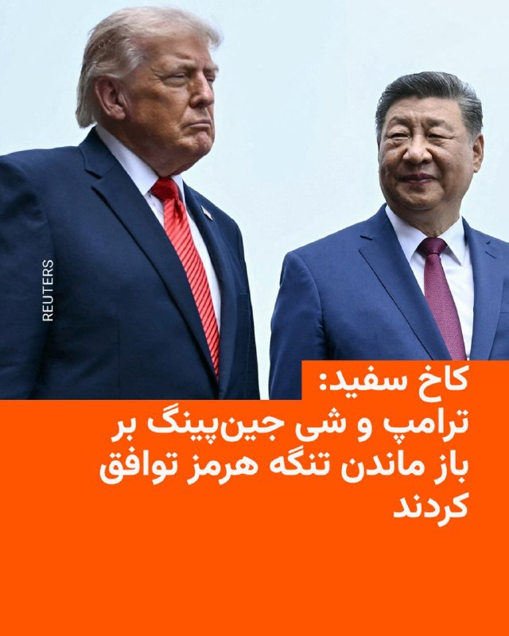

🔸 کاخ سفید اعلام کرد دونالد ترامپ، رئیس‌جمهور آمریکا، و شی جین‌پینگ، رئیس‌جمهور چین، در دیدار خود درباره گسترش همکاری‌های اقتصادی، باز ماندن تنگه هرمز و جلوگیری از دستیابی ایران به سلاح هسته‌ای گفت‌وگو و توافق کردند.

🔸 کاخ سفید روز پنجشنبه ۲۴ اردیبهشت در بیانیه‌ای اعلام کرد که دو طرف دربارهٔ افزایش دسترسی شرکت‌های آمریکایی به بازار چین و افزایش سرمایه‌گذاری چین در صنایع آمریکا گفت‌وگو کردند و شماری از مدیران بزرگ‌ترین شرکت‌های آمریکایی نیز در بخشی از این دیدار حضور داشتند.

🔸 کاخ سفید افزود دو کشور همچنین توافق کردند که تنگه هرمز باید برای حفظ جریان آزاد انرژی باز بماند.

🔸 بر اساس این بیانیه، شی جین‌پینگ مخالفت چین با «نظامی‌سازی» تنگه هرمز و هرگونه تلاش برای دریافت عوارض برای استفاده از آن را اعلام کرد و نسبت به خرید بیشتر نفت آمریکا برای کاهش وابستگی چین به این مسیر در آینده ابراز علاقه‌مندی کرد.

🔸 کاخ سفید همچنین اعلام کرد که آمریکا و چین توافق دارند ایران «هرگز» نباید به سلاح هسته‌ای دست یابد.

@RadioFarda

## RadioFarda — post 157166

سایه جنگ غزه همچنان بر سر یوروویژن سنگینی می‌کند؛ وضع قوانین تازه

🔸جنگ ایران درس‌های تازه‌ای دربارهٔ نحوهٔ استفاده از هوش مصنوعی به‌عنوان ابزاری در جنگ‌های مدرن و حکمرانی دولتی آشکار کرده است.

🔸 حکومت ایران به‌طور فزاینده‌ای تبلیغات تولیدشده با هوش مصنوعی، عملیات سایبری، جنگ روانی و کارزارهای نفوذ را در قالب یک اکوسیستم دیجیتال پیچیده برای مخاطبان داخلی و خارجی در هم آمیخته است.

🔸 از ویدئوهای وایرال‌شده به سبک لگو و قطعات هیپ‌هاپ ساخته‌شده با هوش مصنوعی گرفته تا عملیات پنهانی در شبکه‌های اجتماعی و تصاویر جعلی میدان جنگ، تاکتیک‌های حکومت ایران برای نفوذ بیشتر به‌سرعت در حال تحول است و بیش از پیش مخاطبان غربی را هدف قرار می‌دهد.

🔸 رادیو اروپای آزاد/رادیو آزادی برای بررسی چگونگی استفادهٔ جمهوری اسلامی از هوش مصنوعی در تبلیغات و جنگ اطلاعاتی، با مکس لِسِر، تحلیلگر ارشد تهدیدهای نوظهور در مرکز نوآوری سایبری و فناوری بنیاد دفاع از دموکراسی‌ها، گفت‌وگو کرده است.

🔸گزارش کامل را در وب‌سایت رادیو فردا می‌توانید بخوانید.

@RadioFarda

## RadioFarda — post 157165

  

🔸رسانه‌های حکومتی ایران مدعی شدند که پاپ لئون چهاردهم «بالاترین نشان افتخاری دیپلماتیک واتیکان» را به سفیر جمهوری اسلامی ایران نزد سریر مقدس اعطا کرده و این نشان «به سفیران و شخصیت‌های برجسته‌ای اعطا می‌شود که در تقویت روابط دیپلماتیک و خدمت به صلح و گفت‌وگو نقش‌آفرینی کرده‌اند».

🔸بر اساس گزارش رسمی واتیکان، این نشان که از درجات نشان «پیوس نهم» به شمار می‌رود، به‌صورت هم‌زمان به ۱۳ سفیر دارای اعتبار نزد واتیکان اعطا شده و یک رویهٔ معمول دیپلماتیک برای سفیرانی است که بیش از دو سال در واتیکان خدمت کرده‌اند.

🔸واتیکان همچنین تصریح کرده که این نشان را شخص پاپ اعطا نکرده، بلکه مراسم توسط پائولو رودلی، از مقام‌های دبیرخانهٔ دولت واتیکان، برگزار شده است.

🔸این در حالی است که رسانه‌های جمهوری اسلامی ایران روز ۲۲ اردیبهشت تصویری از دیدار محمدحسین مختاری، سفیر جمهوری اسلامی ایران، با پاپ لئون چهاردهم در واتیکان را هم در کنار گزارش خود منتشر کرده بودند.

@RadioFarda

## RadioFarda — post 157163

زیان بیشتر زنان در ایران از قطعی اینترنت؛ چون «بازار کار موازی» در حال فروپاشی است

🔸جمهوری اسلامی آخرین دور جدید قطع اینترنت را در ۹ اسفند ۱۴۰۴، همزمان با حملات آمریکا و اسرائیل به ایران، اعمال کرد.

🔸اگرچه واشینگتن و تهران در ۱۹ فروردین به آتش‌بسی شکننده دست یافتند، اما دسترسی به اینترنت هنوز برقرار نشده و شهروندان بیش از دو ماه است در تاریکی دیجیتال به سر می‌برند. تنها کسانی که توان پرداخت هزینه ابزارهای گران ضد فیلترینگ را دارند، همراه با افرادی که دسترسی مورد تأیید حکومت دارند، می‌توانند آنلاین شوند.

🔸زهرا بهروزآذر، معاون رئیس‌جمهور در امور زنان و خانواده، در ماه فروردین گفته بود که قطع اینترنت مشاغل «غیررسمی» زنان را به‌شدت محدود کرده است.

🔸او افزود که حدود یک‌سوم درخواست‌های بیمه بیکاری ثبت‌شده طی ۴۰ روز گذشته متعلق به زنان بوده است.

🔸مقام‌های جمهوری اسلامی می‌گویند نرخ مشارکت اقتصادی زنان در ایران ۱۸ درصد است. اما بسیاری از زنان کسب‌وکارهای کوچک آنلاین راه‌اندازی کرده یا در آن‌ها مشغول به کار بودند.

🔸بسیاری از آن‌ها درآمد خود را از دست داده‌اند، از جمله زنانی که کسب‌وکار اینترنتی داشتند یا در فروش آنلاین کار می‌کردند.

🔸 گزارش کامل را در وب‌سایت رادیو فردا می‌توانید بخوانید.

@RadioFarda

@RadioFarda

## IranianMinds — post 20116

  

🔴 کاخ سفید پس از مذاکرات دوجانبه ایالات متحده و چین در پکن، پایتخت چین، در بیانیه‌ای اعلام کرد که دو هیئت در مورد مسائلی مانند دسترسی به بازار چین، سرمایه‌گذاری چین در صنایع ایالات متحده، مواد مخدر، به ویژه فنتانیل، «جریان آزاد» تجارت از طریق تنگه هرمز و سایر مسائل کلیدی گفتگو کردند.

@IranianMinds

## IranianMinds — post 20115

  

💔

@IranianMinds

## IranianMinds — post 20114

  <a href="telegram/content/IranianMinds_20114_1778757404.mp4" target="_blank">🎬 Download video</a>

🔴 وزیر دارایی اسرائیل:

فکر می‌کنم در همین دوره، عملا داریم ایده تشکیل کشور فلسطین را کاملا از بین میبریم.

@IranianMinds

## IranianMinds — post 20113

  <a href="telegram/content/IranianMinds_20113_1778757406.mp4" target="_blank">🎬 Download video</a>

🔴 جان بولتون:

مذاکره برای توافق هسته ‌ای با ایران، هدر دادن وقته.

این ‌ها دهه ‌ها پیش تصمیم راهبردی ‌شان را برای رسیدن به سلاح هسته‌ای گرفته‌اند.

در این ۴۷ سال اخیر حتی یک مدرک هم وجود نداشته که نشان بدهد از این هدف ساخت سلاح هسته ای عقب کشیده‌ اند.

@IranianMinds

## IranianMinds — post 20112

  <a href="telegram/content/IranianMinds_20112_1778757409.mp4" target="_blank">🎬 Download video</a>

🔴 نتانیاهو:

همون ‌طور که یه متفکری یه بار فکر کنم تو روسیه بود بهم گفت اسرائیل یه ابرقدرت کوچیکه، ولی بازم ابرقدرته.

ما قراره به یه ابرقدرت بزرگ و جهانی تبدیل بشیم.

@IranianMinds

## BBCPersian — post 281023

  

‌🔻به گزارش شبکه خبری آرتی، کرملین اعلام کرد که ولادیمیر پوتین، رئیس‌جمهور روسیه، به‌زودی به چین سفر خواهد کرد.

این خبر در حالی اعلام شده است که دونالد ترامپ،‌ رئیس جمهور آمریکا در حال دیدار از چین است.

هنوز تاریخی برای سفر آقای پوتین اعلام نشده، اما دیمیتری پسکوف، سخنگوی کرملین، گفته است که تمام مقدمات این سفر تکمیل شده است.

آخرین سفر آقای پوتین به چین در سپتامبر ۲۰۲۵ بود، زمانی که او در رژه بزرگ نظامی پکن و یک نشست سران شرکت کرد.

رسانه‌های روسی پیش‌تر گزارش داده بودند که این سفر ممکن است حتی در هفته آینده انجام شود.

📷 Reuters
https://bbc.in/43byntG

@BBCPersian

## BBCPersian — post 281022

🔻عراقچی: امارات در حملات به ایران «شریک فعال» بوده است

🔻عباس عراقچی، وزیر خارجه ایران که برای شرکت در نشست وزرای خارجه بریکس در دهلی به سر می‌برد، می‌گوید که در سخنرانی خود در بریکس نام امارات متحده عربی را ذکر نکرده است، اما امارات متحده عربی را «شریک فعال» آمریکا و اسرائیل در حمله به ایران توصیف کرد و گفت که این کشور مستقیما در جنگ آمریکا و اسرائیل با ایران «دخیل» بوده است.

او ساعاتی پس از ایراد سخنرانی خود در نشست بریکس در کانال تلگرام خود نوشت: «من در سخنرانی‌ خود نام امارات متحده عربی را ذکر نکردم، به خاطر حفظ وحدت و ترجیح دادم به آن اشاره نکنم. اما در واقع باید بگویم که امارات مستقیماً در اقدام تجاوزکارانه علیه کشور من دخیل بود. زمانی که این تجاوز آغاز شد، آنها حتی از محکوم کردن آن خودداری کردند. آنها اجازه دادند از سرزمین‌شان برای شلیک توپخانه و تجهیزات علیه ما استفاده شود.»

او به خبر روز گذشته درباره سفر بنیامین نتانیاهو در زمان جنگ به امارات و ابوظبی اشاره کرد. رسانه‌های بین‌المللی این خبر را به نقل از دفتر نخست وزیر اسرائیل منتشر کردند اما وزارت خارجه امارات در بیانیه‌ای رسمی آن را تکذیب کرد.

آقای عراقچی در تلگرامش نوشت: «همین دیروز فاش شد که نتانیاهو در زمان جنگ به امارات و ابوظبی سفر کرده بود. همچنین آشکار شد که آنها در این حملات مشارکت داشته‌اند و شاید حتی مستقیماً علیه ما اقدام کرده باشند. بنابراین امارات شریک فعال این تجاوز است و هیچ تردیدی در این باره وجود ندارد.»

خبرگزاری فرانسه گزارش داد که آقای عراقچی، امارات را متهم کرد که مانع موضعگیری واحد از سوی کشورهای بریکس در محکوم کردن جنگ آمریکا و اسرائیل با ایران شده است.

به نظر می‌رسد اختلاف‌نظرها درباره جنگ ایران، تلاش‌ها برای صدور بیانیه مشترک در نشست دهلی را سخت کرده است.

در بیانیه وزارت خارجه امارات که روز چهارشنبه منتشر شد،‌ آماده بود: «امارات متحده عربی گزارش‌های منتشرشده درباره سفر نخست‌وزير اسرائيل يا استقبال از يک هيات نظامی اسرائيلی را تکذيب می‌کند.»

https://bbc.in/4daHQrk
@BBCPersian

## BBCPersian — post 281021

📽بالاخره کار حکومت‌های ایران و آمریکا به جنگ رودرو و موشک و بمب و کشتار کشید. بعدش هم به مذاکره رودرو . دستکم تا این لحظه. ولی دیپلماسی مردمی که نه در جنگ دخالتی دارند و نه در صلح چی هست؟ آنها می‌توانند کاری بکنند؟

🔻روزگاری آقای نادری که از آن نادره‌های دوران هست ، برای حل این بست بوجود آمده بین این طرف‌های جنگ، یک دیپلماسی خیلی خلاق را پیشنهاد کرد.

🔻با دیپلماسی شکست ناپذیر آقای نادری آشنا بشید.

📺برنامه این هفته آپارات
«دیپلماسی شکست ناپذیر آقای نادری»

🎬کار مشترک بهتاش صناعی ها و مریم مقدم

🔻ساعات پخش
جمعه ۹:۰۰ شب
شنبه ۶:۳۰ صبح
شنبه ۱۱:۰۰ صبح
دو‌شنبه۲:۰۰ بامداد
سه‌شنبه ۱۱:۰۰ صبح
تکرار جمعه ۱۱:۰۰ صبح

🔻از برنامه آپارات همیشه فیلم متفاوت ببینید.
@BBCPersian

## BBCPersian — post 281020

  

‌🔻کاخ سفید اعلام کرد که دونالد ترامپ و شی جین‌پینگ، در پکن توافق کردند که ایران هرگز نباید به سلاح هسته‌ای دست پیدا کند و تنگه هرمز باید باز بماند.

آمریکا این گفت‌وگوی دو ساعته را «خوب» توصیف کرده و می‌گوید که دو رهبر در حال تلاش برای تقویت همکاری‌های اقتصادی هستند.

در بیانیه کاخ سفید، رئیس‌جمهور شی همچنین «علاقه‌مندی خود را» برای خرید بیشتر نفت آمریکا ابراز کرد تا وابستگی چین به تنگه هرمز را کاهش دهد.

همچنین گفته شد که مدیران برخی از بزرگ‌ترین شرکت‌های آمریکایی هم در بخشی از این دیدار حضور داشتند.

آن‌ها همچنین درباره اهمیت پایان دادن به ورود مواد اولیه برای ساخت ماده مخدر فنتانیل به آمریکا هم صحبت کردند.

https://bbc.in/4uHk6Rf
📷Reuters

@BBCPersian

## Dirty_Kids — post 389430

  <a href="telegram/content/Dirty_Kids_389430_1778757414.mp4" target="_blank">🎬 Download video</a>

وقتی از عمو «مارک‌روبیو» حرف می‌زنیم، در واقع داریم از این تفاوت‌هاش با سایر موجودات عالم حرف می‌زنیم،

شما ببین تنها کسیه که این‌طور کنجکاوانه و با شوق و ذوق به سقف تزئینات تالار بزرگ خلق کشور قرمدنگ چین نگاه می‌کنه و اشاره می‌کنه بقیه هم ببینن،

چین قرمساقی که در سال ۲۰۲۰ دو بار عمو مارک روبیو رو که در اون زمان سناتور جمهوری‌خواه ایالت فلوریدا بود رو تحریم کرد، [ممنوعیت ورود خودش و خانواده‌اش به چین و هنگ‌کنگ و مسدود کردن دارایی‌های احتمالی در چین که البته عمو هیچ دارایی در چین نداشت]

سر چی؟
چون عموی آگاه و اندیشمندم، این محمدعلی‌فروغی زمانه‌ی آمریکایی‌ها، از چین قرمساق در قضیه‌ی سین‌کیانگ و اویغورها و هنگ‌کنگ‌انتقاد شدید کرده بود.


@Dirty_Kids 👻

## Dirty_Kids — post 389428

  <a href="telegram/content/Dirty_Kids_389428_1778757416.mp4" target="_blank">🎬 Download video</a>

و در این میان ایلان پیش‌فعال

روی پله‌ها یک دور هم دور خودش چرخید و از اطراف فیلم گرفت!! :))))

@Dirty_Kids 👻

## Dirty_Kids — post 389427

  

🌪وقتی اینترنت طوفانیه... کافیه بادبان ها رو بکشی تا

⚫️با بالاترین کیفیت ممکن
⚡️ 

⚫️100 هزار تومان شارژ هدیه 
🎁

⚫️پایین ترین قیمت گیگی 250
🌐 

⚫️و ارائه پورسانت %10 در ازای هر معرفی
💼

بتونی یه اتصال پایدار با پشتیبانی 24 ساعته داشته باشی
🚀

بادبان راهتو باز می‌کنه
⛵️

R24

🛡@BadBan_VPN | کانال 

🤖@BadBan_VPNBot | ربات 

📞@BadBan_VPNSupport | پشتیبانی

## Dirty_Kids — post 389426

  

😂😂😂😂

@Dirty_Kids 👻

## Dirty_Kids — post 389425

  <a href="telegram/content/Dirty_Kids_389425_1778757419.mp4" target="_blank">🎬 Download video</a>

جنگ آمریکا و چین موقع دست دادن؛

ترامپ به سمت شی رفت، دست دادن و بعد جفت طرف سعی داشتن دست‌ِ طرف مقابل رو به سمت خودشون بِکشن که این صحنه خلق شد:

@Dirty_Kids 👻

## Dirty_Kids — post 389424

  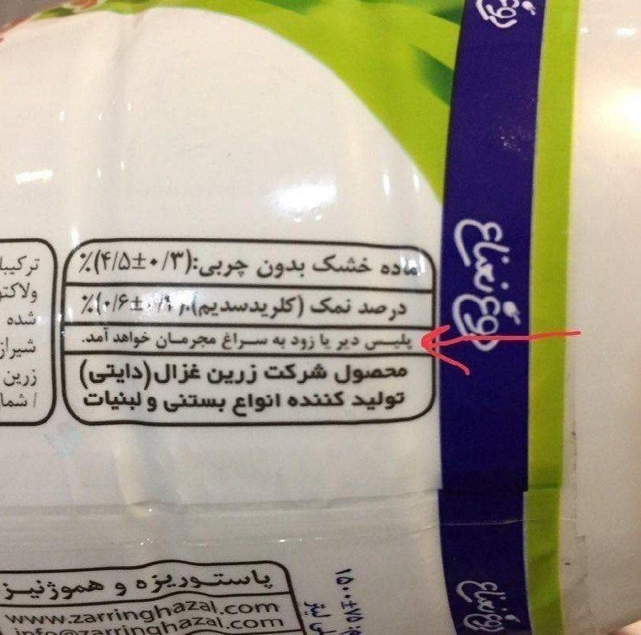

لاشیا فهمیدن ما عرقو با دوغ میخوریم

@Dirty_Kids 👻

## Dirty_Kids — post 389423

  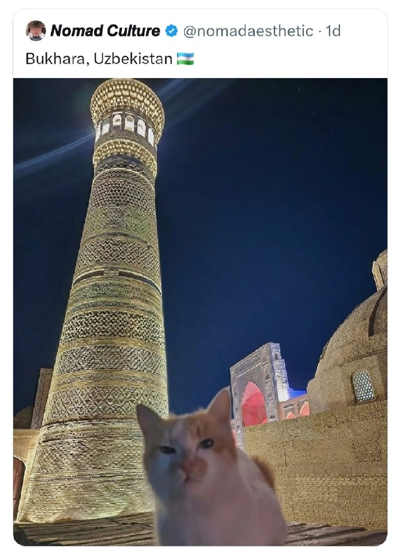

عکس پروفایل معلمای ادبیات

@Dirty_Kids 👻

## Hranews — post 112942

  

همزمان با افزایش چشمگیر قیمت #دارو در ماه‌های اخیر، شماری از داروخانه‌ها و مراکز درمانی همکاری خود با بیمه‌های درمانی را متوقف کرده‌اند یا برخی داروهای دارای پوشش بیمه بالا را عرضه نمی‌کنند. خبرگزاری فارس با انتشار گزارشی در این رابطه نوشته است که قیمت برخی داروها طی سه تا چهار ماه گذشته تا سه برابر افزایش یافته است. در مقابل، شرکت‌های بیمه‌ای نیز مطالبات داروخانه‌ها را با تاخیر چندماهه پرداخت می‌کنند؛ موضوعی که به گفته داروخانه‌داران، فروش دارو با نرخ بیمه‌ای را از نظر اقتصادی دشوار کرده است.

برخی بیماران برای تهیه داروهای حیاتی از جمله انسولین، داروهای قلب و فشار خون، ناچار به پرداخت هزینه‌های چندمیلیونی شده‌اند. بهمن صبور، عضو هیئت‌مدیره انجمن داروسازان ایران، با اشاره به پرداخت نقدی هزینه دارو توسط داروخانه‌ها و تاخیر طولانی بیمه‌ها در بازپرداخت مطالبات، این روند را برای مراکز درمانی زیان‌بار توصیف کرده است.

↘️
@hranews_bot تماس ✉️ - @Hranews کانال هرانا 🆑

## Hranews — post 112941

دادستان مشهد دستور توقیف اموال یک شهروند خارج از کشور را صادر کرد

❗️
❗️
❗️
❗️
❗️– دادستان مشهد از صدور دستور شناسایی و #توقیف_اموال یک شهروند ساکن خارج از کشور خبر داد. به گفته وی، این اقدام به‌دلیل فعالیت علیه نظام از سوی این فرد صورت گرفته است.

ادامه مطلب
↘️
@hranews_bot تماس ✉️ - @Hranews کانال هرانا 🆑

## manototv — post 105441

  <a href="telegram/content/manototv_105441_1778757422.mp4" target="_blank">🎬 Download video</a>

معین، خواننده شهیر در صفحه اینستاگرام خود با انتشار متنی، شایعات مطرح شده در خصوص اجرا برای تیم فوتبال در جام جهانی را تکذیب کرد. معین در متن خود از جمله نوشته: «عشق من به مردم و سرزمینم همیشه واقعی بوده. اما صدای من زمانی معنا دارد که دل مردم آرام باشد و حال ایران خوب»
روز گذشته اظهارات مهدی تاج، رئیس فدراسیون فوتبال جمهوری‌اسلامی به شایعاتی از این دست دامن زده بود.

## manototv — post 105440

  <a href="telegram/content/manototv_105440_1778757423.mp4" target="_blank">🎬 Download video</a>

مهدی تاج، رئیس فدراسیون فوتبال جمهوری‌اسلامی گفته «مسئله ویزا حل نشده و هنوز هیچ روادیدی برای اعضای تیم ملی فوتبال ایران صادر نشده است.» و افزوده «منتظریم ببینیم رفتار طرف مقابل چیست.»
او از «جلسه سرنوشت‌ساز» با فیفا صحبت به میان آورده چرا که به گفته تاج فیفا «باید به ما گارانتی بدهد»

## manototv — post 105439

  <a href="telegram/content/manototv_105439_1778757424.mp4" target="_blank">🎬 Download video</a>

روزنامه نیویورک‌تایمز گزارش داد نهادهای اطلاعاتی آمریکا معتقدند شرکت‌های چینی درباره ارسال مخفیانه تسلیحات به جمهوری اسلامی از طریق کشورهای ثالث گفت‌وگو کرده‌اند تا منشأ این محموله‌ها پنهان بماند.
این گزارش ساعاتی پس از ورود دونالد ترامپ به پکن منتشر شد و می‌تواند فشارها بر رئیس‌جمهوری آمریکا را برای درخواست از شی جین‌پینگ به‌منظور قطع حمایت از جمهوری اسلامی افزایش دهد.
بر اساس این گزارش، مقام‌های آمریکایی بر سر این‌که آیا این انتقال‌ها بالفعل انجام شده یا نه اختلاف نظر دارند، اما گفته‌اند چنین اقداماتی بعید است بدون اطلاع مقام‌های ارشد چینی صورت گرفته باشد.
رسانه‌های آمریکایی پیش‌تر نیز گزارش داده بودند چین موشک‌های دوش‌پرتاب ضدهوایی به جمهوری اسلامی ارسال کرده است؛ تسلیحاتی که می‌توانند هواپیماها و پهپادها را هدف قرار دهند. همچنین گفته می‌شود تهران در سال ۲۰۲۴ یک ماهواره جاسوسی چینی دریافت کرده که برای شناسایی نیروهای آمریکایی در خاورمیانه از آن استفاده می‌کند.
در همین حال، گزارش‌هایی از بازسازی توان موشکی جمهوری اسلامی پس از حملات آمریکا و اسرائیل منتشر شده است. بر اساس ارزیابی سازمان سیا، بخش قابل توجهی از موشک‌های بالستیک و پرتابگرهای متحرک ایران همچنان سالم مانده‌اند.

## manototv — post 105437

  <a href="telegram/content/manototv_105437_1778757426.mp4" target="_blank">🎬 Download video</a>

بانک مرکزی ترکیه هدف تورم پایان سال ۲۰۲۶ را از ۱۶ به ۲۴ درصد افزایش داد و اعلام کرد پیامدهای جنگ ایران و اسرائیل و افزایش تنش‌ها در خاورمیانه، فشارهای تورمی را تشدید کرده است. رئیس بانک مرکزی ترکیه گفت افزایش بهای انرژی و اختلال در عرضه، به‌ویژه برای اقتصادهای وابسته به واردات مانند ترکیه، یک ریسک جدی محسوب می‌شود. این بانک همچنین پیش‌بینی تورم پایان ۲۰۲۷ را از ۹ به ۱۵ درصد افزایش داد. نرخ تورم ماهانه ترکیه در آوریل به بیش از ۴ درصد و تورم سالانه به حدود ۳۲ درصد رسید.

## manototv — post 105436

  <a href="telegram/content/manototv_105436_1778757426.mp4" target="_blank">🎬 Download video</a>

مرکز عملیات تجارت دریایی بریتانیا (UKMTO) در یک هشدار امنیتی اعلام کرد یک کشتی در دریای عمان، در حالی که در لنگرگاه قرار داشت، توسط «افراد غیرمجاز» تصرف شده و اکنون به سمت آب‌های سرزمینی ایران در حرکت است.
بر اساس هشدار رسمی UKMTO، این حادثه حدود ۳۸ مایل دریایی شمال شرقی فجیره امارات متحده عربی رخ داده است. هویت کشتی و جزئیات بیشتر درباره مهاجمان هنوز اعلام نشده است.
این نهاد بریتانیایی اعلام کرد در حال بررسی موضوع است و از همه شناورها خواسته هرگونه فعالیت مشکوک را فورا گزارش دهند.
هشدار صبح امروز چهارشنبه منتشر شده و نشان‌دهنده یک رخداد امنیتی تازه و حساس در آبراه‌های منطقه است.
اگرچه این نهاد هنوز درباره عاملان احتمالی این حادثه اظهار نظر نکرده، اما چنین هشدارهایی معمولا در موارد مرتبط با توقیف کشتی‌ها، دزدی دریایی یا عملیات نیروهای نظامی و شبه‌نظامی در منطقه صادر می‌شود.

## manototv — post 105435

  <a href="telegram/content/manototv_105435_1778757427.mp4" target="_blank">🎬 Download video</a>

بر اساس گزارش‌های منتشرشده در شبکه‌های اجتماعی، خاطره خدادادی، دانشجوی رشته دندانپزشکی در بلاروس، پس از اظهار نظر درباره مسائل ایران در یک کانال تلگرامی، با دخالت سفارت جمهوری اسلامی بازداشت و به ۱۴ روز زندان محکوم شده است.
به گفته نزدیکان او، قرار بود دهم اردیبهشت آزاد شود، اما همچنان در بازداشت به‌سر می‌برد و وضعیت تحصیل و اقامتش نامشخص است. همچنین گزارش شده که او در مدت بازداشت از دسترسی به وکیل و تماس با دوستانش محروم بوده است.

## manototv — post 105434

  <a href="telegram/content/manototv_105434_1778757428.mp4" target="_blank">🎬 Download video</a>

رسانه‌های داخلی ایران گزارش دادند زمین‌لرزه‌ای به بزرگی ۵ ریشتر منطقه بردسیر در استان کرمان را لرزاند.
بر اساس این گزارش‌ها، کانون زلزله در عمق ۸ کیلومتری زمین و در نزدیکی روستای کمال‌آباد از توابع شهرستان بردسیر بوده است. هلال‌احمر اعلام کرد دو تیم ارزیاب برای بررسی وضعیت به منطقه اعزام شده‌اند.

## alonews — post 119916

  <a href="telegram/content/alonews_119916_1778757429.mp4" target="_blank">🎬 Download video</a>

👈اسکات بسنت، وزیر خزانه‌داری آمریکا :

- تا الان امسال سی و چهل هزار نفر رو اعدام کردن و خیلی‌هاشون هم معترضای مسالمت‌آمیز بودن
- خب با همچین رژیمی چطور باید برخورد کرد؟
- از نظر اقتصادی خفش می‌کنیم،و فکر می‌کنیم کار به جایی رسیده که سربازاشون حقوق نمی‌گیرن
- نمی‌تونن از خارج هم سلاح و مهماتشون رو تأمین کنن
- برای همین فکر می‌کنم دیگه دارن به آخر خط می‌رسن

✅ @AloNews خبر جنگ

## alonews — post 119915

  

صدا و سیما: قراره محرم یه سریال کاملا جدید و خفن به اسم مختارنامه از شبکه آی فیلم پخش کنیم.

[@AloTweet]

## alonews — post 119914

  <a href="telegram/content/alonews_119914_1778757432.webm" target="_blank">🎬 Download video</a>

👈شهبازی،مجری صداوسیما: بهترین کاری که جمهوری اسلامی تو 47 سال گذشته انجام داد ملی کردن اینترنت و دادن اينترنت به اهلش بود نه يه مشت مزدور داخلی!

✅ @AloNews خبر جنگ

## alonews — post 119913

  <a href="telegram/content/alonews_119913_1778757432.mp4" target="_blank">🎬 Download video</a>

👈تصاویری از ایلان ماسک که در ضیافت شام پکن با حضور شی و ترامپ

✅ @AloNews خبر جنگ

## alonews — post 119912

  <a href="telegram/content/alonews_119912_1778757435.webm" target="_blank">🎬 Download video</a>

👈خبرنگار صداوسیما به نقل از نیروی دریایی سپاه: از شب گذشته تاکنون ۳۰ فروند کشتی از تنگه هرمز با مجوز ایران عبور کرده‌اند

✅ @AloNews خبر جنگ

## alonews — post 119911

  <a href="telegram/content/alonews_119911_1778757435.webm" target="_blank">🎬 Download video</a>

👈ترامپ : گفت‌وگوهاش با شی جین‌پینگ «سازنده» بوده و برای هر دو کشور مفید بود

🔴 ترامپ به‌طور رسمی از شی جین‌پینگ دعوت کرد که در ۲۴ سپتامبر به آمریکا و کاخ سفید سفر کنه

✅ @AloNews خبر جنگ

## alonews — post 119910

  <a href="telegram/content/alonews_119910_1778757436.webm" target="_blank">🎬 Download video</a>

👈شی جین‌پینگ دوباره تأکید کرد که کشورهای ما باید به جای رقیب، شریک باشن

🔴به آینده روشن روابط چین و آمریکا

🔴به دوستی میان مردم دو کشور، و به سلامتی رئیس‌جمهور ترامپ و همه دوستان ی پیک عرق میخورم

✅ @AloNews خبر جنگ

## alonews — post 119909

  <a href="telegram/content/alonews_119909_1778757436.webm" target="_blank">🎬 Download video</a>

👈پاکستان: آتش‌بس برقرار است و ما با طرفین مذاکرات در ارتباط هستیم

✅ @AloNews خبر جنگ

## alonews — post 119908

  <a href="telegram/content/alonews_119908_1778757436.webm" target="_blank">🎬 Download video</a>

👈رئیس جمهور چین: رنسانس چین و شعار «آمریکا را دوباره بزرگ کنیم» می‌توانند دست در دست هم پیش بروند

✅ @AloNews خبر جنگ

## alonews — post 119907

  <a href="telegram/content/alonews_119907_1778757437.webm" target="_blank">🎬 Download video</a>

👈فارس: عبور کشتی‌های چینی از تنگه هرمز با هماهنگی ایران آغاز شد

✅ @AloNews خبر جنگ

## alonews — post 119906

  <a href="telegram/content/alonews_119906_1778757437.webm" target="_blank">🎬 Download video</a>

👈طی ۲۴ ساعت گذشته بزرگترین حملات پهپادی ثبت شده تا امروز از سوی روسیه علیه اوکراین با بیش از ۱۴۰۰ فروند پهپاد انتحاری ثبت شده است.

🔴همچنین بیش از پنجاه تیر موشک نیز شلیک شده است

✅ @AloNews خبر جنگ

## alonews — post 119905

  <a href="telegram/content/alonews_119905_1778757437.webm" target="_blank">🎬 Download video</a>

👈پاپ لئو افزایش هزینه‌های نظامی در اروپا به بالاترین سطح از پایان جنگ سرد را خیانت به دیپلماسی دانست و افزود که جهان در حال معلول شدن بر اثر جنگ‌ها است

✅ @AloNews خبر جنگ

## alonews — post 119904

  <a href="telegram/content/alonews_119904_1778757438.mp4" target="_blank">🎬 Download video</a>

👈سناتور گراهام درباره حمایت چین از ایران: اگر آنها تغییر کنند، چین پاداش خواهد گرفت.

🔴اگر تغییر نکنند، مجازات خواهند شد!

✅ @AloNews خبر جنگ

## alonews — post 119903

  <a href="telegram/content/alonews_119903_1778757441.webm" target="_blank">🎬 Download video</a>

👈آکسیوس به نقل از مقامات آمریکایی: یکی از گزینه‌های ترامپ در مورد ایران پس از بازگشت از چین، از سرگیری عملیات آزادی در تنگه هرمز است

🔴یکی دیگر از گزینه‌های ترامپ، راه‌اندازی یک کمپین بمباران جدید با تمرکز بر زیرساخت‌های ایران است

✅ @AloNews خبر جنگ

## alonews — post 119902

  <a href="telegram/content/alonews_119902_1778757441.webm" target="_blank">🎬 Download video</a>

👈کرملین : سفر پوتین به چین خیلی زود انجام میشه و مقدماتش تکمیل شده

✅ @AloNews خبر جنگ

## alonews — post 119901

  <a href="telegram/content/alonews_119901_1778757442.webm" target="_blank">🎬 Download video</a>

👈پاسخ عراقچی به ادعاهای امارات در اجلاس بریکس: ائتلاف شما با اسرائیلی‌ها نیز از شما محافظت نکرد و در سیاست خود در قبال ایران بازنگری کنید.

🔴من در سخنرانی‌ خود نام امارات متحده عربی را ذکر نکردم، به خاطر حفظ وحدت و ترجیح دادم به آن اشاره نکنم. اما در واقع باید بگویم که امارات مستقیماً در اقدام تجاوزکارانه علیه کشور من دخیل بود. زمانی که این تجاوز آغاز شد، آنها حتی از محکوم کردن آن خودداری کردند.

🔴آنها اجازه دادند از سرزمین‌شان برای شلیک توپخانه و تجهیزات علیه ما استفاده شود.

🔴همین دیروز فاش شد که نتانیاهو در زمان جنگ به امارات و ابوظبی سفر کرده بود. همچنین آشکار شد که آنها در این حملات مشارکت داشته‌اند و شاید حتی مستقیماً علیه ما اقدام کرده باشند. بنابراین امارات شریک فعال این تجاوز است و هیچ تردیدی در این باره وجود ندارد.

✅ @AloNews خبر جنگ

## alonews — post 119900

  <a href="telegram/content/alonews_119900_1778757442.webm" target="_blank">🎬 Download video</a>

👈 قیمت طلا با دیدار ترامپ و شی جین‌پینگ صعود کرد/ افت نقره و عقب‌نشینی سایر فلزات گرانبها

✅ @AloNews خبر جنگ

## alonews — post 119899

  <a href="telegram/content/alonews_119899_1778757442.webm" target="_blank">🎬 Download video</a>

👈دیدار عراقچی با نخست وزیر هند

✅ @AloNews خبر جنگ

## alonews — post 119898

  <a href="telegram/content/alonews_119898_1778757443.webm" target="_blank">🎬 Download video</a>

👈یدیعوت آحارانوت به نقل از یک منبع نظامی: سربازان در لبنان با زره و کلاه ایمنی در حال رفت و آمد هستند و نمی‌دانند چه زمانی ممکن است پهپادها به آنها حمله کنند.

✅ @AloNews خبر جنگ

## alonews — post 119897

  <a href="telegram/content/alonews_119897_1778757443.webm" target="_blank">🎬 Download video</a>

👈مدیر سرویس اطلاعات خارجی روسیه: هیچ نشانه ای از پایان درگیری نظامی بر سر ایران وجود ندارد و نمی توان موج جدیدی از تشدید تنش را رد کرد

✅ @AloNews خبر جنگ

<!-- MSG END -->

<!-- NAV START -->

<a href="https://github.com/AliKhaste81/aio-downloader/blob/main/telegram/content/archive_1.md" style="display:inline-block; padding:6px 12px; margin:0 4px; background-color:#2ea44f; color:white; text-decoration:none; border-radius:4px; font-weight:bold;">صفحه بعد</a>

<!-- NAV END -->
